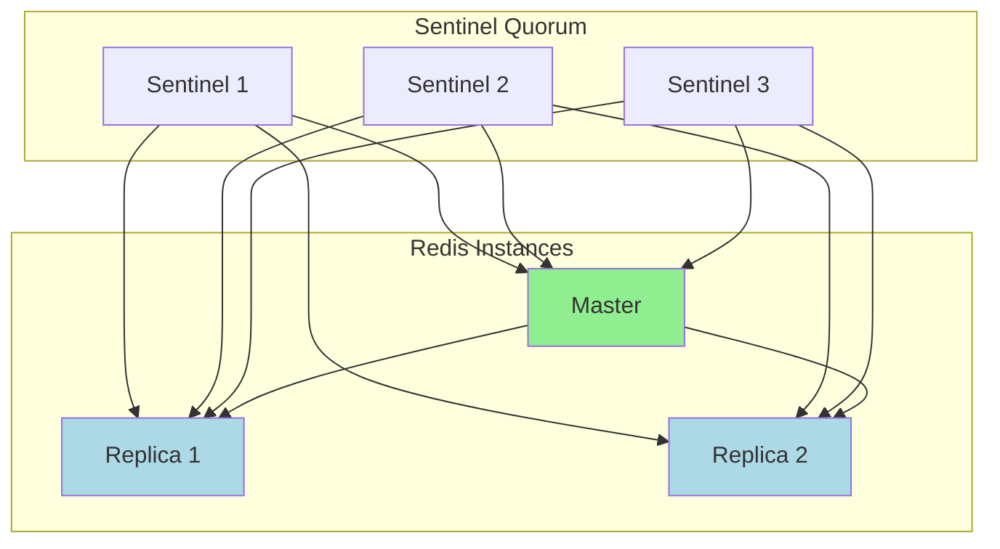

# How to Set Up Automatic Failover with Redis Sentinel

Author: [nawazdhandala](https://www.github.com/nawazdhandala)

Tags: Redis, Sentinel, High Availability, Failover, DevOps, Infrastructure

Description: Learn how to configure Redis Sentinel for automatic failover, monitoring, and notifications. This guide covers multi-node setup, client configuration, and production best practices.

---

A single Redis instance is a single point of failure. When it goes down, your application stops working. Redis Sentinel provides automatic failover by monitoring your Redis instances and promoting a replica to master when the primary fails. This guide walks you through setting up a production-ready Sentinel deployment.

## How Sentinel Works

Sentinel runs as a separate process that watches your Redis instances. When enough Sentinels agree that a master is down (quorum), they elect a leader Sentinel that promotes one of the replicas to master. The other replicas are reconfigured to follow the new master.



## Infrastructure Setup

You need at least three Sentinel instances for reliable quorum voting. A typical setup has:
- 1 Redis master
- 2 Redis replicas
- 3 Sentinel instances

This gives you tolerance for one Sentinel failure while still maintaining quorum (2 out of 3).

## Redis Master Configuration

Start with the master Redis instance.

```bash
# redis-master.conf
# Primary Redis instance configuration

port 6379
bind 0.0.0.0

# Authentication
requirepass your-redis-password
masterauth your-redis-password

# Persistence
appendonly yes
appendfilename "appendonly.aof"
dir /var/lib/redis

# Memory
maxmemory 2gb
maxmemory-policy allkeys-lru

# Replication settings
min-replicas-to-write 1
min-replicas-max-lag 10

# Logging
logfile /var/log/redis/redis-master.log
loglevel notice
```

## Redis Replica Configuration

Each replica connects to the master and syncs data.

```bash
# redis-replica-1.conf
# Replica configuration - connects to master for replication

port 6380
bind 0.0.0.0

# Authentication
requirepass your-redis-password
masterauth your-redis-password

# Connect to master
replicaof 192.168.1.10 6379

# Replica settings
replica-read-only yes
replica-serve-stale-data yes

# Persistence
appendonly yes
appendfilename "appendonly.aof"
dir /var/lib/redis

# Memory
maxmemory 2gb
maxmemory-policy allkeys-lru

# Logging
logfile /var/log/redis/redis-replica-1.log
```

Create a similar file for the second replica on port 6381.

## Sentinel Configuration

Each Sentinel instance needs its own configuration file.

```bash
# sentinel-1.conf
# Sentinel instance 1 configuration

port 26379
bind 0.0.0.0

# Sentinel data directory
dir /var/lib/redis-sentinel

# Monitor the master
# sentinel monitor <master-name> <ip> <port> <quorum>
# Quorum of 2 means 2 Sentinels must agree that master is down
sentinel monitor mymaster 192.168.1.10 6379 2

# Authentication for connecting to Redis instances
sentinel auth-pass mymaster your-redis-password

# How long to wait before considering master down (milliseconds)
sentinel down-after-milliseconds mymaster 5000

# How many replicas can sync with new master simultaneously
# Lower number = slower failover but less load on new master
sentinel parallel-syncs mymaster 1

# Failover timeout (milliseconds)
# If failover takes longer, it's considered failed
sentinel failover-timeout mymaster 60000

# Notification script - called on events
# sentinel notification-script mymaster /etc/redis/notify.sh

# Reconfig script - called when clients need to update master address
# sentinel client-reconfig-script mymaster /etc/redis/reconfig.sh

# Logging
logfile /var/log/redis/sentinel-1.log
```

Create similar files for Sentinel 2 (port 26380) and Sentinel 3 (port 26381).

## Docker Compose Deployment

Here's a complete Docker Compose setup for testing.

```yaml
# docker-compose.yml
# Redis Sentinel setup with 1 master, 2 replicas, 3 sentinels
version: '3.8'

services:
  redis-master:
    image: redis:7.2-alpine
    container_name: redis-master
    command: redis-server /etc/redis/redis.conf
    ports:
      - "6379:6379"
    volumes:
      - ./config/redis-master.conf:/etc/redis/redis.conf
      - redis-master-data:/data
    networks:
      redis-net:
        ipv4_address: 172.20.0.10

  redis-replica-1:
    image: redis:7.2-alpine
    container_name: redis-replica-1
    command: redis-server /etc/redis/redis.conf
    ports:
      - "6380:6380"
    volumes:
      - ./config/redis-replica-1.conf:/etc/redis/redis.conf
      - redis-replica-1-data:/data
    depends_on:
      - redis-master
    networks:
      redis-net:
        ipv4_address: 172.20.0.11

  redis-replica-2:
    image: redis:7.2-alpine
    container_name: redis-replica-2
    command: redis-server /etc/redis/redis.conf
    ports:
      - "6381:6381"
    volumes:
      - ./config/redis-replica-2.conf:/etc/redis/redis.conf
      - redis-replica-2-data:/data
    depends_on:
      - redis-master
    networks:
      redis-net:
        ipv4_address: 172.20.0.12

  sentinel-1:
    image: redis:7.2-alpine
    container_name: sentinel-1
    command: redis-sentinel /etc/redis/sentinel.conf
    ports:
      - "26379:26379"
    volumes:
      - ./config/sentinel-1.conf:/etc/redis/sentinel.conf
    depends_on:
      - redis-master
      - redis-replica-1
      - redis-replica-2
    networks:
      redis-net:
        ipv4_address: 172.20.0.20

  sentinel-2:
    image: redis:7.2-alpine
    container_name: sentinel-2
    command: redis-sentinel /etc/redis/sentinel.conf
    ports:
      - "26380:26380"
    volumes:
      - ./config/sentinel-2.conf:/etc/redis/sentinel.conf
    depends_on:
      - redis-master
      - redis-replica-1
      - redis-replica-2
    networks:
      redis-net:
        ipv4_address: 172.20.0.21

  sentinel-3:
    image: redis:7.2-alpine
    container_name: sentinel-3
    command: redis-sentinel /etc/redis/sentinel.conf
    ports:
      - "26381:26381"
    volumes:
      - ./config/sentinel-3.conf:/etc/redis/sentinel.conf
    depends_on:
      - redis-master
      - redis-replica-1
      - redis-replica-2
    networks:
      redis-net:
        ipv4_address: 172.20.0.22

networks:
  redis-net:
    driver: bridge
    ipam:
      config:
        - subnet: 172.20.0.0/16

volumes:
  redis-master-data:
  redis-replica-1-data:
  redis-replica-2-data:
```

## Monitoring Sentinel Status

Check that Sentinels are working and know about each other.

```bash
# Connect to Sentinel
redis-cli -p 26379

# Get master information
SENTINEL master mymaster

# Get replica information
SENTINEL replicas mymaster

# Get other Sentinels
SENTINEL sentinels mymaster

# Check if master is reachable
SENTINEL ckquorum mymaster

# Get current master address
SENTINEL get-master-addr-by-name mymaster
```

Example output from `SENTINEL master mymaster`:

```
 1) "name"
 2) "mymaster"
 3) "ip"
 4) "172.20.0.10"
 5) "port"
 6) "6379"
 7) "flags"
 8) "master"
 9) "num-slaves"
10) "2"
11) "num-other-sentinels"
12) "2"
13) "quorum"
14) "2"
```

## Node.js Client with Sentinel Support

Use ioredis with Sentinel configuration for automatic failover handling.

```javascript
// redis-sentinel-client.js
// Redis client with Sentinel support for automatic failover
const Redis = require('ioredis');

// Connect through Sentinels - they tell us who the current master is
const redis = new Redis({
  sentinels: [
    { host: '172.20.0.20', port: 26379 },
    { host: '172.20.0.21', port: 26380 },
    { host: '172.20.0.22', port: 26381 },
  ],
  name: 'mymaster', // Master name as defined in Sentinel config
  password: 'your-redis-password',
  sentinelPassword: 'your-redis-password', // If Sentinels require auth

  // Retry strategy during failover
  retryStrategy: (times) => {
    if (times > 10) {
      console.error('Max retries reached, giving up');
      return null;
    }
    // Wait longer between retries during failover
    const delay = Math.min(times * 200, 5000);
    console.log(`Retry attempt ${times}, waiting ${delay}ms`);
    return delay;
  },

  // Enable read from replicas for scaling reads
  // role: 'slave', // Uncomment to always read from replicas
});

// Handle connection events
redis.on('connect', () => {
  console.log('Connected to Redis');
});

redis.on('ready', () => {
  console.log('Redis client ready');
});

redis.on('error', (err) => {
  console.error('Redis error:', err.message);
});

// Important: Handle reconnection after failover
redis.on('reconnecting', (delay) => {
  console.log(`Reconnecting in ${delay}ms...`);
});

redis.on('+switch-master', (newMaster) => {
  console.log('Master switched to:', newMaster);
});

module.exports = redis;
```

## Handling Failover in Application Code

Your application needs to handle the brief period during failover.

```javascript
// resilient-operations.js
// Wrapper for Redis operations that handles failover gracefully
const redis = require('./redis-sentinel-client');

class ResilientRedis {
  constructor(client) {
    this.client = client;
    this.maxRetries = 3;
    this.retryDelay = 1000;
  }

  // Wrap operations with retry logic for failover handling
  async execute(operation) {
    let lastError;

    for (let attempt = 1; attempt <= this.maxRetries; attempt++) {
      try {
        return await operation();
      } catch (error) {
        lastError = error;

        // Check if error is failover-related
        if (this.isFailoverError(error)) {
          console.log(`Failover detected, attempt ${attempt}/${this.maxRetries}`);

          if (attempt < this.maxRetries) {
            await this.sleep(this.retryDelay * attempt);
            continue;
          }
        }

        // Non-failover errors should not retry
        throw error;
      }
    }

    throw lastError;
  }

  isFailoverError(error) {
    const failoverMessages = [
      'READONLY',
      'LOADING',
      'MASTERDOWN',
      'Connection is closed',
      'ECONNREFUSED',
      'ENOTFOUND',
    ];

    return failoverMessages.some((msg) =>
      error.message && error.message.includes(msg)
    );
  }

  sleep(ms) {
    return new Promise((resolve) => setTimeout(resolve, ms));
  }

  // Wrapped operations
  async get(key) {
    return this.execute(() => this.client.get(key));
  }

  async set(key, value, ...args) {
    return this.execute(() => this.client.set(key, value, ...args));
  }

  async del(key) {
    return this.execute(() => this.client.del(key));
  }

  async incr(key) {
    return this.execute(() => this.client.incr(key));
  }

  async hset(key, field, value) {
    return this.execute(() => this.client.hset(key, field, value));
  }

  async hget(key, field) {
    return this.execute(() => this.client.hget(key, field));
  }

  async hgetall(key) {
    return this.execute(() => this.client.hgetall(key));
  }
}

const resilientRedis = new ResilientRedis(redis);

module.exports = resilientRedis;
```

## Testing Failover

Simulate a master failure to verify your setup works.

```bash
#!/bin/bash
# test-failover.sh
# Simulate master failure and observe automatic recovery

echo "Current master:"
redis-cli -p 26379 SENTINEL get-master-addr-by-name mymaster

echo ""
echo "Killing master..."
docker stop redis-master

echo ""
echo "Waiting for failover (5-10 seconds)..."
sleep 10

echo ""
echo "New master:"
redis-cli -p 26379 SENTINEL get-master-addr-by-name mymaster

echo ""
echo "Sentinel status:"
redis-cli -p 26379 SENTINEL master mymaster | grep -E "^(ip|port|flags|num-slaves)"

echo ""
echo "Restarting old master (will become replica)..."
docker start redis-master

sleep 5
echo ""
echo "Final topology:"
redis-cli -p 26379 SENTINEL replicas mymaster | grep -E "^(ip|port|flags)"
```

## Notification Script

Sentinel can run scripts when events occur. This is useful for alerting.

```bash
#!/bin/bash
# /etc/redis/notify.sh
# Sentinel notification script for alerting

EVENT_TYPE=$1
EVENT_DESCRIPTION=$2
MASTER_NAME=$3
ROLE=$4
IP=$5
PORT=$6

LOG_FILE="/var/log/redis/sentinel-events.log"

# Log the event
echo "$(date '+%Y-%m-%d %H:%M:%S') [$EVENT_TYPE] $MASTER_NAME $ROLE $IP:$PORT - $EVENT_DESCRIPTION" >> $LOG_FILE

# Send alert based on event type
case $EVENT_TYPE in
  "+odown")
    # Master is objectively down (quorum agrees)
    curl -X POST "https://your-alerting-service.com/webhook" \
      -H "Content-Type: application/json" \
      -d "{\"event\": \"master_down\", \"master\": \"$MASTER_NAME\", \"ip\": \"$IP\"}"
    ;;
  "+switch-master")
    # New master elected
    curl -X POST "https://your-alerting-service.com/webhook" \
      -H "Content-Type: application/json" \
      -d "{\"event\": \"failover_complete\", \"new_master\": \"$IP:$PORT\"}"
    ;;
  "+sdown")
    # Instance subjectively down (this Sentinel thinks so)
    echo "Instance $IP:$PORT is subjectively down"
    ;;
esac
```

## Production Checklist

| Item | Recommendation |
|------|----------------|
| Sentinel count | Minimum 3, preferably 5 for larger deployments |
| Quorum | Majority (2 for 3 Sentinels, 3 for 5) |
| down-after-milliseconds | 5000-30000ms depending on network |
| failover-timeout | 60000ms or higher |
| Authentication | Enable on both Redis and Sentinel |
| Network | Place Sentinels close to Redis but on different hosts |
| Monitoring | Track Sentinel logs and events |

## Common Issues and Solutions

**Sentinel not detecting master failure:**
- Check `down-after-milliseconds` is not too high
- Verify network connectivity between Sentinel and Redis
- Ensure authentication is configured correctly

**Split-brain scenario:**
- Always use odd number of Sentinels (3, 5, 7)
- Set appropriate quorum value
- Place Sentinels in different availability zones

**Replica not syncing after failover:**
- Check `masterauth` is set correctly on replicas
- Verify network connectivity to new master
- Check Redis logs for replication errors

Redis Sentinel gives you automatic high availability without the complexity of Redis Cluster. For many applications that don't need horizontal sharding, Sentinel provides the reliability guarantees you need with simpler operations.
