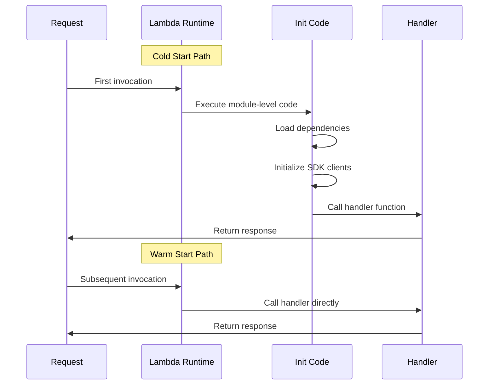

# How to Build Production Lambda Functions

Author: [nawazdhandala](https://www.github.com/nawazdhandala)

Tags: AWS, Lambda, Serverless, Production, Node.js, Python, Observability, Cold Start, Error Handling

Description: A practical guide to building production-ready AWS Lambda functions covering project structure, error handling, cold start optimization, observability, testing, and deployment best practices.

---

> AWS Lambda makes it easy to deploy code, but building functions that run reliably in production requires more thought. From cold start optimization to proper error handling, there are patterns that separate hobby projects from production workloads.

This guide walks through the practical decisions and code patterns you need to build Lambda functions that can handle real traffic without waking you up at 3 AM.

---

## Project Structure That Scales

A well-organized Lambda project makes it easier to test, debug, and extend. Here is a structure that works for both simple functions and larger serverless applications:

```
my-lambda-function/
├── src/
│   ├── handlers/           # Lambda entry points
│   │   ├── api.js
│   │   └── worker.js
│   ├── services/           # Business logic
│   │   ├── userService.js
│   │   └── orderService.js
│   ├── utils/              # Shared utilities
│   │   ├── logger.js
│   │   ├── errors.js
│   │   └── validation.js
│   └── config/             # Configuration management
│       └── index.js
├── tests/
│   ├── unit/
│   └── integration/
├── infrastructure/         # IaC templates
│   └── template.yaml
├── package.json
└── README.md
```

The key principle here is separation of concerns. Your handler should be thin - it extracts input, calls business logic, and formats the response. All the actual work happens in services.

```javascript
// src/handlers/api.js
// Keep handlers thin - they extract input, call business logic, format output
const { processOrder } = require('../services/orderService');
const { validateOrderInput } = require('../utils/validation');
const { logger } = require('../utils/logger');
const { AppError } = require('../utils/errors');

exports.handler = async (event, context) => {
  // Disable waiting for empty event loop to avoid timeouts
  // when using connection pooling or background processes
  context.callbackWaitsForEmptyEventLoop = false;

  const requestId = context.awsRequestId;
  logger.setRequestId(requestId);

  try {
    // Parse and validate input
    const body = JSON.parse(event.body || '{}');
    const validatedInput = validateOrderInput(body);

    // Delegate to service layer
    const result = await processOrder(validatedInput);

    return {
      statusCode: 200,
      headers: {
        'Content-Type': 'application/json',
        'X-Request-Id': requestId
      },
      body: JSON.stringify(result)
    };
  } catch (error) {
    return handleError(error, requestId);
  }
};
```

---

## Configuration Management

Never hardcode configuration values. Lambda provides several ways to manage configuration, each with different tradeoffs.

```javascript
// src/config/index.js
// Centralized configuration with validation and defaults

// Cache config in module scope to avoid re-reading on every invocation
let cachedConfig = null;

function loadConfig() {
  if (cachedConfig) {
    return cachedConfig;
  }

  // Required environment variables - fail fast if missing
  const required = ['DATABASE_URL', 'API_KEY'];
  const missing = required.filter(key => !process.env[key]);

  if (missing.length > 0) {
    throw new Error(`Missing required environment variables: ${missing.join(', ')}`);
  }

  cachedConfig = {
    // Database configuration
    database: {
      url: process.env.DATABASE_URL,
      poolSize: parseInt(process.env.DB_POOL_SIZE || '5', 10),
      connectionTimeout: parseInt(process.env.DB_TIMEOUT || '5000', 10)
    },

    // External service configuration
    externalApi: {
      baseUrl: process.env.EXTERNAL_API_URL || 'https://api.example.com',
      apiKey: process.env.API_KEY,
      timeout: parseInt(process.env.API_TIMEOUT || '10000', 10)
    },

    // Feature flags - easily toggle behavior
    features: {
      enableNewProcessor: process.env.ENABLE_NEW_PROCESSOR === 'true',
      debugMode: process.env.DEBUG_MODE === 'true'
    },

    // Runtime information
    runtime: {
      region: process.env.AWS_REGION,
      functionName: process.env.AWS_LAMBDA_FUNCTION_NAME,
      memorySize: parseInt(process.env.AWS_LAMBDA_FUNCTION_MEMORY_SIZE || '128', 10)
    }
  };

  return cachedConfig;
}

module.exports = { getConfig: loadConfig };
```

For sensitive values like API keys, use AWS Secrets Manager or Parameter Store:

```javascript
// src/utils/secrets.js
const { SecretsManagerClient, GetSecretValueCommand } = require('@aws-sdk/client-secrets-manager');

// Initialize client outside handler for connection reuse
const client = new SecretsManagerClient({});

// Cache secrets in memory to avoid repeated API calls
const secretsCache = new Map();

async function getSecret(secretName) {
  // Return cached value if available and not expired
  const cached = secretsCache.get(secretName);
  if (cached && cached.expiry > Date.now()) {
    return cached.value;
  }

  const command = new GetSecretValueCommand({ SecretId: secretName });
  const response = await client.send(command);

  const secret = JSON.parse(response.SecretString);

  // Cache for 5 minutes to balance freshness vs API calls
  secretsCache.set(secretName, {
    value: secret,
    expiry: Date.now() + 5 * 60 * 1000
  });

  return secret;
}

module.exports = { getSecret };
```

---

## Error Handling That Actually Helps

Generic error responses make debugging impossible. Build structured error handling from the start.

```javascript
// src/utils/errors.js
// Custom error classes for different failure scenarios

class AppError extends Error {
  constructor(message, statusCode, code, details = {}) {
    super(message);
    this.statusCode = statusCode;
    this.code = code;           // Machine-readable error code
    this.details = details;     // Additional context for debugging
    this.isOperational = true;  // Distinguishes from programming errors
  }
}

// Specific error types for common scenarios
class ValidationError extends AppError {
  constructor(message, details = {}) {
    super(message, 400, 'VALIDATION_ERROR', details);
  }
}

class NotFoundError extends AppError {
  constructor(resource, id) {
    super(`${resource} not found: ${id}`, 404, 'NOT_FOUND', { resource, id });
  }
}

class ExternalServiceError extends AppError {
  constructor(service, originalError) {
    super(`External service error: ${service}`, 502, 'EXTERNAL_SERVICE_ERROR', {
      service,
      originalMessage: originalError.message
    });
  }
}

class RateLimitError extends AppError {
  constructor(retryAfter = 60) {
    super('Rate limit exceeded', 429, 'RATE_LIMIT_EXCEEDED', { retryAfter });
  }
}

module.exports = {
  AppError,
  ValidationError,
  NotFoundError,
  ExternalServiceError,
  RateLimitError
};
```

Now handle these errors consistently:

```javascript
// src/handlers/errorHandler.js
const { logger } = require('../utils/logger');

function handleError(error, requestId) {
  // Log full error details for debugging
  logger.error('Request failed', {
    requestId,
    errorName: error.name,
    errorMessage: error.message,
    errorCode: error.code,
    stack: error.stack,
    details: error.details
  });

  // Operational errors - return structured response
  if (error.isOperational) {
    return {
      statusCode: error.statusCode,
      headers: {
        'Content-Type': 'application/json',
        'X-Request-Id': requestId
      },
      body: JSON.stringify({
        error: {
          code: error.code,
          message: error.message,
          details: error.details,
          requestId
        }
      })
    };
  }

  // Programming errors - don't leak internal details
  return {
    statusCode: 500,
    headers: {
      'Content-Type': 'application/json',
      'X-Request-Id': requestId
    },
    body: JSON.stringify({
      error: {
        code: 'INTERNAL_ERROR',
        message: 'An unexpected error occurred',
        requestId
      }
    })
  };
}

module.exports = { handleError };
```

---

## Cold Start Optimization

Cold starts are the biggest complaint about Lambda. While you cannot eliminate them entirely, you can minimize their impact.



The key insight is that code outside your handler function runs once during cold start and is cached for subsequent invocations.

```javascript
// Initialize AWS SDK clients outside the handler
// These are reused across invocations, avoiding re-initialization overhead
const { DynamoDBClient } = require('@aws-sdk/client-dynamodb');
const { DynamoDBDocumentClient, GetCommand, PutCommand } = require('@aws-sdk/lib-dynamodb');

// Create clients at module level - runs once during cold start
const ddbClient = new DynamoDBClient({
  // Use keep-alive for connection reuse
  requestHandler: {
    connectionTimeout: 5000,
    socketTimeout: 5000
  }
});

const docClient = DynamoDBDocumentClient.from(ddbClient, {
  marshallOptions: { removeUndefinedValues: true }
});

// Lazy initialization for expensive resources
let dbPool = null;

async function getDbPool() {
  if (!dbPool) {
    // Only create pool when first needed
    const { Pool } = require('pg');
    dbPool = new Pool({
      connectionString: process.env.DATABASE_URL,
      max: 5,                    // Keep pool small for Lambda
      idleTimeoutMillis: 60000,  // Close idle connections
      connectionTimeoutMillis: 5000
    });
  }
  return dbPool;
}

// Handler stays thin and fast
exports.handler = async (event, context) => {
  context.callbackWaitsForEmptyEventLoop = false;

  // Use pre-initialized clients
  const result = await docClient.send(new GetCommand({
    TableName: process.env.TABLE_NAME,
    Key: { id: event.pathParameters.id }
  }));

  return {
    statusCode: 200,
    body: JSON.stringify(result.Item)
  };
};
```

Additional cold start optimization techniques:

```javascript
// 1. Import only what you need
// Bad: imports entire SDK
const AWS = require('aws-sdk');

// Good: imports only specific client
const { S3Client } = require('@aws-sdk/client-s3');

// 2. Use provisioned concurrency for critical functions
// Configure in SAM/CloudFormation:
// ProvisionedConcurrencyConfig:
//   ProvisionedConcurrentExecutions: 5

// 3. Keep deployment package small
// Use webpack or esbuild to bundle and tree-shake
// Exclude dev dependencies and unnecessary files
```

---

## Observability and Logging

You cannot fix what you cannot see. Production Lambda functions need structured logging and distributed tracing.

```javascript
// src/utils/logger.js
// Structured logging that works with CloudWatch Insights

class Logger {
  constructor() {
    this.requestId = null;
    this.correlationId = null;
  }

  setRequestId(requestId) {
    this.requestId = requestId;
  }

  setCorrelationId(correlationId) {
    this.correlationId = correlationId;
  }

  // Format log entry for CloudWatch Insights queries
  formatEntry(level, message, data = {}) {
    return JSON.stringify({
      timestamp: new Date().toISOString(),
      level,
      message,
      requestId: this.requestId,
      correlationId: this.correlationId,
      // Include function context for filtering
      functionName: process.env.AWS_LAMBDA_FUNCTION_NAME,
      functionVersion: process.env.AWS_LAMBDA_FUNCTION_VERSION,
      ...data
    });
  }

  info(message, data) {
    console.log(this.formatEntry('INFO', message, data));
  }

  warn(message, data) {
    console.warn(this.formatEntry('WARN', message, data));
  }

  error(message, data) {
    console.error(this.formatEntry('ERROR', message, data));
  }

  debug(message, data) {
    if (process.env.DEBUG_MODE === 'true') {
      console.debug(this.formatEntry('DEBUG', message, data));
    }
  }
}

// Export singleton instance
module.exports = { logger: new Logger() };
```

For distributed tracing, integrate with OpenTelemetry:

```javascript
// src/utils/tracing.js
const { NodeTracerProvider } = require('@opentelemetry/sdk-trace-node');
const { BatchSpanProcessor } = require('@opentelemetry/sdk-trace-base');
const { OTLPTraceExporter } = require('@opentelemetry/exporter-trace-otlp-http');
const { Resource } = require('@opentelemetry/resources');
const { AwsLambdaInstrumentation } = require('@opentelemetry/instrumentation-aws-lambda');
const { registerInstrumentations } = require('@opentelemetry/instrumentation');

// Initialize tracing before handler code runs
const provider = new NodeTracerProvider({
  resource: new Resource({
    'service.name': process.env.AWS_LAMBDA_FUNCTION_NAME,
    'service.version': process.env.FUNCTION_VERSION || '1.0.0',
    'deployment.environment': process.env.ENVIRONMENT || 'production'
  })
});

// Send traces to OneUptime or your observability backend
const exporter = new OTLPTraceExporter({
  url: process.env.OTEL_EXPORTER_OTLP_ENDPOINT || 'https://oneuptime.com/otlp/v1/traces',
  headers: {
    'x-oneuptime-token': process.env.ONEUPTIME_TOKEN
  }
});

// Batch spans for efficient export
provider.addSpanProcessor(new BatchSpanProcessor(exporter, {
  maxQueueSize: 100,
  scheduledDelayMillis: 500  // Flush quickly for Lambda's short lifecycle
}));

provider.register();

// Auto-instrument Lambda and common libraries
registerInstrumentations({
  instrumentations: [
    new AwsLambdaInstrumentation({
      disableAwsContextPropagation: false
    })
  ]
});

module.exports = { provider };
```

Add custom metrics for business visibility:

```javascript
// src/utils/metrics.js
const { CloudWatchClient, PutMetricDataCommand } = require('@aws-sdk/client-cloudwatch');

const cloudwatch = new CloudWatchClient({});

// Buffer metrics and flush periodically to reduce API calls
const metricsBuffer = [];

async function recordMetric(name, value, unit = 'Count', dimensions = {}) {
  const metric = {
    MetricName: name,
    Value: value,
    Unit: unit,
    Timestamp: new Date(),
    Dimensions: Object.entries(dimensions).map(([Name, Value]) => ({ Name, Value }))
  };

  metricsBuffer.push(metric);

  // Flush if buffer is full
  if (metricsBuffer.length >= 20) {
    await flushMetrics();
  }
}

async function flushMetrics() {
  if (metricsBuffer.length === 0) return;

  const metrics = metricsBuffer.splice(0, 20);

  await cloudwatch.send(new PutMetricDataCommand({
    Namespace: process.env.METRICS_NAMESPACE || 'MyApp',
    MetricData: metrics
  }));
}

// Helper for common patterns
async function recordLatency(operation, durationMs) {
  await recordMetric(`${operation}Latency`, durationMs, 'Milliseconds', {
    FunctionName: process.env.AWS_LAMBDA_FUNCTION_NAME
  });
}

async function recordError(errorType) {
  await recordMetric('Errors', 1, 'Count', {
    FunctionName: process.env.AWS_LAMBDA_FUNCTION_NAME,
    ErrorType: errorType
  });
}

module.exports = { recordMetric, recordLatency, recordError, flushMetrics };
```

---

## Input Validation

Never trust input from any source. Validate early and fail fast.

```javascript
// src/utils/validation.js
const Ajv = require('ajv');
const addFormats = require('ajv-formats');
const { ValidationError } = require('./errors');

// Initialize validator once at module level
const ajv = new Ajv({ allErrors: true, coerceTypes: true });
addFormats(ajv);

// Define schemas for your input types
const schemas = {
  createOrder: {
    type: 'object',
    required: ['customerId', 'items'],
    properties: {
      customerId: { type: 'string', format: 'uuid' },
      items: {
        type: 'array',
        minItems: 1,
        maxItems: 100,
        items: {
          type: 'object',
          required: ['productId', 'quantity'],
          properties: {
            productId: { type: 'string', minLength: 1 },
            quantity: { type: 'integer', minimum: 1, maximum: 1000 },
            price: { type: 'number', minimum: 0 }
          }
        }
      },
      shippingAddress: {
        type: 'object',
        properties: {
          street: { type: 'string', maxLength: 200 },
          city: { type: 'string', maxLength: 100 },
          country: { type: 'string', pattern: '^[A-Z]{2}$' },
          postalCode: { type: 'string', maxLength: 20 }
        }
      }
    },
    additionalProperties: false  // Reject unknown fields
  }
};

// Compile schemas for better performance
const validators = {};
for (const [name, schema] of Object.entries(schemas)) {
  validators[name] = ajv.compile(schema);
}

function validate(schemaName, data) {
  const validator = validators[schemaName];
  if (!validator) {
    throw new Error(`Unknown schema: ${schemaName}`);
  }

  const valid = validator(data);
  if (!valid) {
    // Format errors for useful feedback
    const errors = validator.errors.map(err => ({
      field: err.instancePath || err.params.missingProperty,
      message: err.message,
      value: err.data
    }));

    throw new ValidationError('Invalid input', { errors });
  }

  return data;
}

module.exports = { validate };
```

---

## Testing Lambda Functions

Test handlers in isolation without deploying to AWS.

```javascript
// tests/unit/handlers/api.test.js
const { handler } = require('../../../src/handlers/api');

// Mock external services
jest.mock('../../../src/services/orderService', () => ({
  processOrder: jest.fn()
}));

const { processOrder } = require('../../../src/services/orderService');

describe('API Handler', () => {
  // Create consistent mock context
  const mockContext = {
    awsRequestId: 'test-request-123',
    callbackWaitsForEmptyEventLoop: true
  };

  beforeEach(() => {
    jest.clearAllMocks();
    process.env.TABLE_NAME = 'test-table';
  });

  test('returns 200 for valid order', async () => {
    const mockOrder = { orderId: 'order-123', status: 'created' };
    processOrder.mockResolvedValue(mockOrder);

    const event = {
      body: JSON.stringify({
        customerId: '550e8400-e29b-41d4-a716-446655440000',
        items: [{ productId: 'prod-1', quantity: 2 }]
      })
    };

    const response = await handler(event, mockContext);

    expect(response.statusCode).toBe(200);
    expect(JSON.parse(response.body)).toEqual(mockOrder);
    expect(response.headers['X-Request-Id']).toBe('test-request-123');
  });

  test('returns 400 for invalid input', async () => {
    const event = {
      body: JSON.stringify({
        // Missing required customerId
        items: []  // Empty items array
      })
    };

    const response = await handler(event, mockContext);

    expect(response.statusCode).toBe(400);
    const body = JSON.parse(response.body);
    expect(body.error.code).toBe('VALIDATION_ERROR');
  });

  test('returns 500 for unexpected errors', async () => {
    processOrder.mockRejectedValue(new Error('Database connection failed'));

    const event = {
      body: JSON.stringify({
        customerId: '550e8400-e29b-41d4-a716-446655440000',
        items: [{ productId: 'prod-1', quantity: 1 }]
      })
    };

    const response = await handler(event, mockContext);

    expect(response.statusCode).toBe(500);
    const body = JSON.parse(response.body);
    expect(body.error.code).toBe('INTERNAL_ERROR');
    // Should not leak internal error details
    expect(body.error.message).not.toContain('Database');
  });
});
```

For integration tests, use LocalStack or AWS SAM Local:

```javascript
// tests/integration/api.test.js
const { DynamoDBClient } = require('@aws-sdk/client-dynamodb');
const { DynamoDBDocumentClient, PutCommand, DeleteCommand } = require('@aws-sdk/lib-dynamodb');

// Point to LocalStack for integration tests
const client = new DynamoDBClient({
  endpoint: process.env.DYNAMODB_ENDPOINT || 'http://localhost:4566',
  region: 'us-east-1',
  credentials: { accessKeyId: 'test', secretAccessKey: 'test' }
});

const docClient = DynamoDBDocumentClient.from(client);

describe('Order API Integration', () => {
  const testOrderId = 'test-order-integration';

  afterEach(async () => {
    // Clean up test data after each test
    await docClient.send(new DeleteCommand({
      TableName: 'orders',
      Key: { orderId: testOrderId }
    }));
  });

  test('creates and retrieves order', async () => {
    // Call the actual Lambda handler with real DynamoDB (LocalStack)
    const { handler } = require('../../src/handlers/api');

    const createEvent = {
      httpMethod: 'POST',
      path: '/orders',
      body: JSON.stringify({
        customerId: '550e8400-e29b-41d4-a716-446655440000',
        items: [{ productId: 'prod-1', quantity: 2, price: 29.99 }]
      })
    };

    const createResponse = await handler(createEvent, { awsRequestId: 'test-123' });
    expect(createResponse.statusCode).toBe(201);

    const createdOrder = JSON.parse(createResponse.body);

    // Verify order was persisted
    const getEvent = {
      httpMethod: 'GET',
      path: `/orders/${createdOrder.orderId}`,
      pathParameters: { orderId: createdOrder.orderId }
    };

    const getResponse = await handler(getEvent, { awsRequestId: 'test-124' });
    expect(getResponse.statusCode).toBe(200);

    const retrievedOrder = JSON.parse(getResponse.body);
    expect(retrievedOrder.customerId).toBe('550e8400-e29b-41d4-a716-446655440000');
  });
});
```

---

## Infrastructure as Code

Define your Lambda infrastructure in code for reproducible deployments. Here is a SAM template that includes all the production settings we have discussed:

```yaml
# infrastructure/template.yaml
AWSTemplateFormatVersion: '2010-09-09'
Transform: AWS::Serverless-2016-10-31
Description: Production Lambda function with best practices

Parameters:
  Environment:
    Type: String
    AllowedValues: [dev, staging, production]
    Default: dev

  LogRetentionDays:
    Type: Number
    Default: 30

Globals:
  Function:
    Runtime: nodejs20.x
    MemorySize: 512
    Timeout: 30
    Tracing: Active
    Environment:
      Variables:
        ENVIRONMENT: !Ref Environment
        LOG_LEVEL: !If [IsProduction, 'info', 'debug']

Conditions:
  IsProduction: !Equals [!Ref Environment, production]

Resources:
  OrderApi:
    Type: AWS::Serverless::Function
    Properties:
      FunctionName: !Sub 'order-api-${Environment}'
      Handler: src/handlers/api.handler
      Description: Order management API

      # Enable X-Ray tracing for distributed tracing
      Tracing: Active

      # VPC configuration for database access
      VpcConfig:
        SecurityGroupIds:
          - !Ref LambdaSecurityGroup
        SubnetIds:
          - !Ref PrivateSubnet1
          - !Ref PrivateSubnet2

      # Environment variables
      Environment:
        Variables:
          TABLE_NAME: !Ref OrdersTable
          OTEL_EXPORTER_OTLP_ENDPOINT: !Sub '{{resolve:secretsmanager:${Environment}/observability:SecretString:endpoint}}'
          ONEUPTIME_TOKEN: !Sub '{{resolve:secretsmanager:${Environment}/observability:SecretString:token}}'

      # Policies for accessing AWS services
      Policies:
        - DynamoDBCrudPolicy:
            TableName: !Ref OrdersTable
        - Version: '2012-10-17'
          Statement:
            - Effect: Allow
              Action:
                - secretsmanager:GetSecretValue
              Resource: !Sub 'arn:aws:secretsmanager:${AWS::Region}:${AWS::AccountId}:secret:${Environment}/*'

      # API Gateway event source
      Events:
        CreateOrder:
          Type: Api
          Properties:
            Path: /orders
            Method: POST
        GetOrder:
          Type: Api
          Properties:
            Path: /orders/{orderId}
            Method: GET

      # Reserved concurrency to prevent runaway scaling
      ReservedConcurrentExecutions: !If [IsProduction, 100, 10]

    Metadata:
      BuildMethod: esbuild
      BuildProperties:
        Minify: true
        Target: es2020
        Sourcemap: true
        EntryPoints:
          - src/handlers/api.js
        External:
          - '@aws-sdk/*'

  # Provisioned concurrency for production
  OrderApiProvisionedConcurrency:
    Type: AWS::Lambda::Version
    Condition: IsProduction
    Properties:
      FunctionName: !Ref OrderApi
      ProvisionedConcurrencyConfig:
        ProvisionedConcurrentExecutions: 5

  # DynamoDB table with auto-scaling
  OrdersTable:
    Type: AWS::DynamoDB::Table
    Properties:
      TableName: !Sub 'orders-${Environment}'
      BillingMode: PAY_PER_REQUEST
      AttributeDefinitions:
        - AttributeName: orderId
          AttributeType: S
        - AttributeName: customerId
          AttributeType: S
      KeySchema:
        - AttributeName: orderId
          KeyType: HASH
      GlobalSecondaryIndexes:
        - IndexName: customer-index
          KeySchema:
            - AttributeName: customerId
              KeyType: HASH
          Projection:
            ProjectionType: ALL
      PointInTimeRecoverySpecification:
        PointInTimeRecoveryEnabled: true

  # CloudWatch alarms for production monitoring
  ErrorAlarm:
    Type: AWS::CloudWatch::Alarm
    Condition: IsProduction
    Properties:
      AlarmName: !Sub '${Environment}-order-api-errors'
      AlarmDescription: Triggered when error rate exceeds threshold
      MetricName: Errors
      Namespace: AWS/Lambda
      Dimensions:
        - Name: FunctionName
          Value: !Ref OrderApi
      Statistic: Sum
      Period: 60
      EvaluationPeriods: 5
      Threshold: 10
      ComparisonOperator: GreaterThanThreshold
      TreatMissingData: notBreaching

  # Log group with retention policy
  OrderApiLogGroup:
    Type: AWS::Logs::LogGroup
    Properties:
      LogGroupName: !Sub '/aws/lambda/order-api-${Environment}'
      RetentionInDays: !Ref LogRetentionDays

Outputs:
  ApiEndpoint:
    Description: API Gateway endpoint URL
    Value: !Sub 'https://${ServerlessRestApi}.execute-api.${AWS::Region}.amazonaws.com/Prod/'
```

---

## Deployment Pipeline

Automate deployments with a CI/CD pipeline:

```yaml
# .github/workflows/deploy.yml
name: Deploy Lambda

on:
  push:
    branches: [main]
  pull_request:
    branches: [main]

env:
  AWS_REGION: us-east-1
  SAM_CLI_TELEMETRY: 0

jobs:
  test:
    runs-on: ubuntu-latest
    steps:
      - uses: actions/checkout@v4

      - name: Setup Node.js
        uses: actions/setup-node@v4
        with:
          node-version: '20'
          cache: 'npm'

      - name: Install dependencies
        run: npm ci

      - name: Run unit tests
        run: npm test

      - name: Run linting
        run: npm run lint

  deploy-staging:
    needs: test
    if: github.ref == 'refs/heads/main'
    runs-on: ubuntu-latest
    environment: staging

    steps:
      - uses: actions/checkout@v4

      - name: Setup SAM CLI
        uses: aws-actions/setup-sam@v2

      - name: Configure AWS credentials
        uses: aws-actions/configure-aws-credentials@v4
        with:
          aws-access-key-id: ${{ secrets.AWS_ACCESS_KEY_ID }}
          aws-secret-access-key: ${{ secrets.AWS_SECRET_ACCESS_KEY }}
          aws-region: ${{ env.AWS_REGION }}

      - name: Build
        run: sam build

      - name: Deploy to staging
        run: |
          sam deploy \
            --stack-name order-api-staging \
            --parameter-overrides Environment=staging \
            --no-confirm-changeset \
            --no-fail-on-empty-changeset

  deploy-production:
    needs: deploy-staging
    runs-on: ubuntu-latest
    environment: production

    steps:
      - uses: actions/checkout@v4

      - name: Setup SAM CLI
        uses: aws-actions/setup-sam@v2

      - name: Configure AWS credentials
        uses: aws-actions/configure-aws-credentials@v4
        with:
          aws-access-key-id: ${{ secrets.AWS_ACCESS_KEY_ID }}
          aws-secret-access-key: ${{ secrets.AWS_SECRET_ACCESS_KEY }}
          aws-region: ${{ env.AWS_REGION }}

      - name: Build
        run: sam build

      - name: Deploy to production
        run: |
          sam deploy \
            --stack-name order-api-production \
            --parameter-overrides Environment=production \
            --no-confirm-changeset \
            --no-fail-on-empty-changeset
```

---

## Wrapping Up

Building production Lambda functions requires attention to details that do not matter for simple demos but make all the difference when handling real traffic:

- Separate handler logic from business logic for testability
- Initialize expensive resources outside the handler to minimize cold starts
- Use structured error handling with clear error codes
- Implement comprehensive logging with correlation IDs
- Add distributed tracing for visibility across services
- Validate all input before processing
- Write tests that exercise handlers in isolation
- Use infrastructure as code for reproducible deployments

Lambda is a powerful platform, but it rewards careful design. The patterns in this guide will help you build functions that are reliable, maintainable, and debuggable in production.

---

*Need visibility into your Lambda functions? [OneUptime](https://oneuptime.com) provides native OpenTelemetry support for tracing, metrics, and logs from serverless applications. Get started with our free tier to monitor your production workloads.*

**Related Reading:**
- [How to Instrument Python Applications with OpenTelemetry](https://oneuptime.com/blog/post/2025-01-06-instrument-python-opentelemetry/view)
- [Three Pillars of Observability: Logs, Metrics, Traces](https://oneuptime.com/blog/post/2025-08-20-three-pillars-of-observability-logs-metrics-traces/view)
- [How to Structure Logs Properly in OpenTelemetry](https://oneuptime.com/blog/post/2025-08-28-how-to-structure-logs-properly-in-opentelemetry/view)
