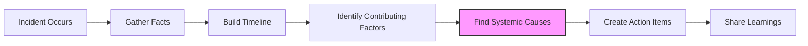
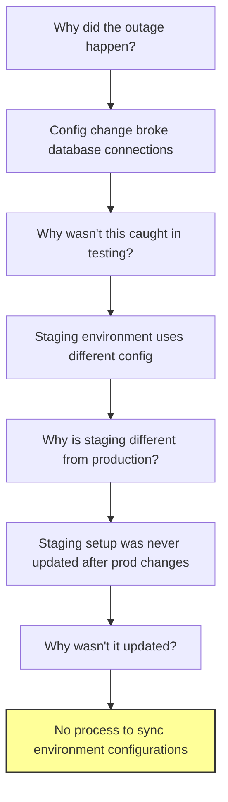

# How to Conduct Blameless Postmortems

Author: [nawazdhandala](https://www.github.com/nawazdhandala)

Tags: Incident Management, Postmortems, Blameless Culture, Site Reliability Engineering, Team Leadership

Description: Learn how to conduct effective blameless postmortems that help your team learn from incidents without fear. This practical guide covers facilitation techniques, common pitfalls, and real examples from production environments.

Your database just went down for 45 minutes. Customers are upset. Leadership wants answers. And everyone on the team knows exactly who pushed that config change.

This is the moment where most organizations get it wrong. The natural instinct is to find who made the mistake and hold them accountable. But here's the thing - that approach actively makes your systems less reliable over time.

Blameless postmortems are not about being soft on mistakes. They are about being smart enough to recognize that punishing individuals for systemic failures only teaches people to hide information, avoid taking risks, and cover their tracks. None of that makes your systems better.

## What Makes a Postmortem Blameless

A blameless postmortem operates on a fundamental assumption: the people involved in an incident were trying to do the right thing given the information they had at the time. When an engineer deploys a change that causes an outage, they genuinely believed it was safe to deploy. The question is not "who screwed up?" but "what in our system made it possible - or even likely - for a reasonable person to make this mistake?"

This shift in framing changes everything. Instead of spending energy defending yourself or pointing fingers, the entire team focuses on understanding what happened and preventing it from happening again.

Here is what blameless looks like in practice:

The key step is "Find Systemic Causes" - this is where you look at the systems, processes, and tools that allowed the incident to happen rather than focusing on individual actions.

## Before the Meeting: Preparation That Matters

The postmortem meeting itself is just one part of the process. What happens before and after often determines whether the exercise produces real improvements or just a document nobody reads.

### Designate a Facilitator

Choose someone who was not directly involved in the incident to run the meeting. This person's job is to keep the discussion constructive, redirect blame-oriented questions, and ensure everyone has a chance to contribute. The facilitator does not need to be a manager - in fact, it often works better when they are a peer.

### Build the Timeline First

Before bringing everyone together, have someone create a detailed timeline of the incident. Pull data from:

- Monitoring and alerting systems
- Chat logs and communication channels
- Deployment logs
- Git commit history
- Any customer reports

A good timeline includes timestamps, the actors involved, and what information was available at each decision point. This becomes the foundation for the discussion.

Here is an example of what a timeline might look like:

| Time (UTC) | Event | Actor | Context |
|------------|-------|-------|---------|
| 14:32 | Deployment to production | Sarah | PR approved by 2 reviewers, CI passed |
| 14:35 | Error rate increases 5x | System | Monitoring shows spike in 500 errors |
| 14:38 | PagerDuty alert fires | System | On-call engineer James receives page |
| 14:42 | James begins investigating | James | Checking dashboards, no obvious cause |
| 14:51 | Sarah notices deployment timing | Sarah | Correlates deployment with error spike |
| 14:53 | Rollback initiated | James | Previous version deployed |
| 14:56 | Error rate returns to normal | System | Incident resolved |

### Send Pre-Read Materials

Give attendees the timeline and any relevant data at least a day before the meeting. People should come prepared with their observations, not spending meeting time reading through logs.

## Running the Postmortem Meeting

The meeting itself typically runs 60 to 90 minutes. Here is a structure that works well:

### Start With Ground Rules (5 minutes)

Open by explicitly stating the blameless principle. Something like: "We are here to understand what happened, not to assign blame. Everyone involved made decisions that seemed reasonable at the time. Our job is to figure out why those decisions led to this outcome and how we can prevent similar incidents."

This might feel redundant if your team has done this before, but it sets the tone and gives anyone who feels defensive permission to let their guard down.

### Walk Through the Timeline (20 minutes)

Go through the timeline chronologically. At each step, ask the person involved to explain their thought process. What did they know? What were they trying to accomplish? What options did they consider?

The facilitator should actively redirect any blame-oriented questions. If someone asks "Why didn't you check the database metrics?", reframe it as "What information would have helped identify the issue earlier?"

### Identify Contributing Factors (25 minutes)

This is where the real work happens. For each decision point that contributed to the incident, dig into why that decision made sense at the time. Common patterns include:

**Information Gaps**: The engineer did not have access to critical information. Maybe the monitoring dashboard did not show the relevant metric, or the documentation was out of date.

**Process Failures**: The existing process did not catch the problem. Code review passed, tests passed, but something still broke. What is missing from your safety net?

**Tooling Limitations**: The tools made it easy to make the mistake or hard to catch it. Perhaps the deployment system does not support canary releases, or the rollback process is too slow.

**Organizational Pressures**: Were there time pressures that led to cutting corners? Was someone working alone when they should have had backup?

For each contributing factor, use the "Five Whys" technique to find the root cause:

The real root cause is usually 3 to 5 levels deep. Surface-level answers like "someone made a mistake" are not useful for prevention.

### Generate Action Items (15 minutes)

For each root cause identified, brainstorm potential fixes. Good action items are:

- **Specific**: "Add database connection timeout metric to main dashboard" not "Improve monitoring"
- **Owned**: Each item has a single person responsible for completion
- **Time-bound**: Set a deadline, typically 1 to 4 weeks depending on complexity
- **Prioritized**: Not every action item is equally important - focus on high-impact fixes

Avoid the temptation to create action items like "Train engineers to be more careful" or "Add more code review." These are not systemic fixes.

### Close With Learnings (10 minutes)

End by asking everyone to share one thing they learned from the incident. This reinforces that the goal is learning and improvement, not punishment.

## Common Pitfalls and How to Avoid Them

### The Blame Game in Disguise

Sometimes postmortems become blameless in language but not in spirit. Watch out for phrases like:

- "Human error" as a root cause
- "The engineer should have known..."
- "If only someone had..."

These all shift responsibility to individuals rather than systems. When you hear them, redirect to systemic questions: "What could we change so that anyone in that situation would have the information they need?"

### Stopping at the First Answer

The most obvious cause is rarely the most useful one. "The deployment had a bug" is true but not actionable in a systemic way. Keep asking why until you reach something you can actually change about your systems, processes, or tools.

### Action Items That Never Get Done

A postmortem document with uncompleted action items is almost worse than no postmortem at all. It creates cynicism about the whole process. To prevent this:

- Limit action items to 3 to 5 per incident
- Assign owners before the meeting ends
- Track completion in a visible place
- Review incomplete items in your regular team meetings

### Not Sharing the Results

Postmortems that only stay with the immediate team miss a huge opportunity. Other teams can learn from your incidents, and you can learn from theirs. Create a culture of sharing postmortem documents broadly within the organization.

## A Real Example: The Cascading Cache Failure

Let me walk through a real scenario to show how this works in practice.

**The Incident**: A production cache service started returning stale data, causing users to see outdated information for about 2 hours. Multiple teams were affected.

**The Surface-Level Story**: An engineer updated the cache TTL configuration as part of routine maintenance. The change looked correct but had an unintended interaction with another setting that caused the cache to stop refreshing.

**The Blameless Investigation**:

Instead of asking "Why did the engineer make this mistake?", the team asked:

1. Why did this configuration combination cause the issue?
   - The two settings interact in a non-obvious way

2. Why was this interaction not documented?
   - The cache system has accumulated settings over years with no clear documentation of interactions

3. Why did we not catch this in testing?
   - The test environment uses a much smaller cache with different timing characteristics

4. Why did it take 2 hours to detect?
   - The staleness metric was not included in our alerting - we only alerted on cache availability

**The Action Items**:

1. Document cache configuration interactions (Owner: Senior engineer who understands the system, Due: 2 weeks)
2. Add test coverage for configuration combinations (Owner: Platform team, Due: 4 weeks)
3. Add cache data freshness metric and alert (Owner: SRE team, Due: 1 week)
4. Create cache configuration change checklist (Owner: Documentation lead, Due: 1 week)

Notice how none of these action items involve the engineer who made the change. The system allowed a reasonable person to make a mistake, and the fixes address the system.

## Building a Blameless Culture Over Time

Running blameless postmortems is one thing. Building a culture where people genuinely feel safe to share mistakes is another. Here are some things that help:

**Leadership Sets the Tone**: When leaders admit their own mistakes openly and focus on learning rather than blame, everyone else follows. If your CEO shares lessons from their own failures, it becomes normal for engineers to do the same.

**Celebrate Good Postmortems**: Recognize teams that produce insightful postmortems and follow through on action items. Make the behavior you want to see visible and valued.

**Start With Your Own Incidents**: If you are introducing blameless postmortems to a team that is used to blame culture, start by doing a postmortem on an incident you were directly involved in. Model the vulnerability you want others to show.

**Be Patient**: Cultural change takes time. The first few blameless postmortems might feel awkward or might still have blame creeping in. Keep redirecting, keep reinforcing the principles, and gradually the team will internalize the approach.

## Conclusion

Blameless postmortems are not about being nice or avoiding accountability. They are about being effective. Systems fail because of system problems, and the only way to find those problems is to create an environment where people feel safe to share what really happened.

When you run a postmortem, remember: the engineer who pushed the breaking change is giving you a gift. They are showing you where your safety nets have holes. Thank them for that, fix the holes, and move on to building more reliable systems.

The goal is not to find the person who made the mistake. The goal is to make sure the next person in that situation cannot make the same mistake. That is what makes your systems - and your team - truly resilient.
