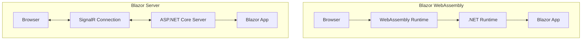
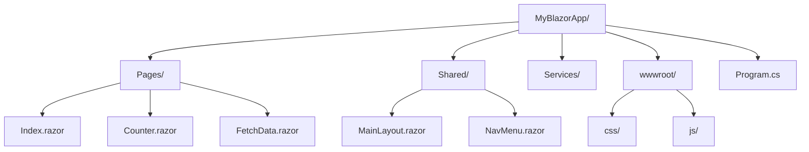
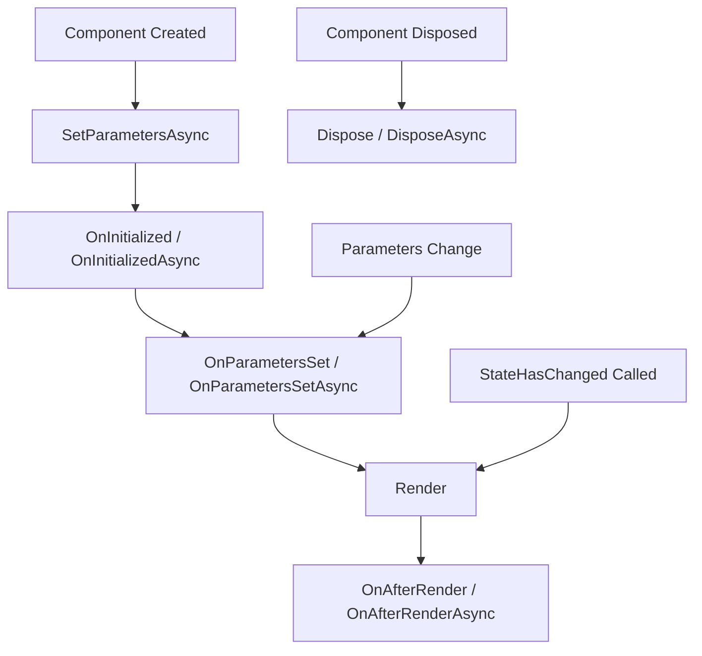
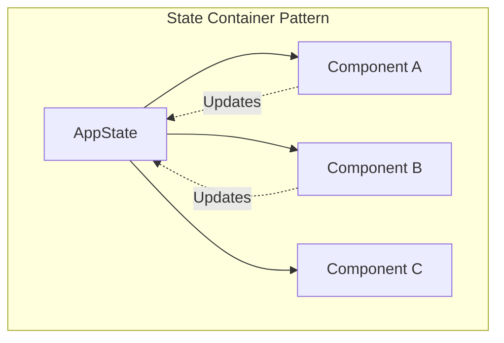
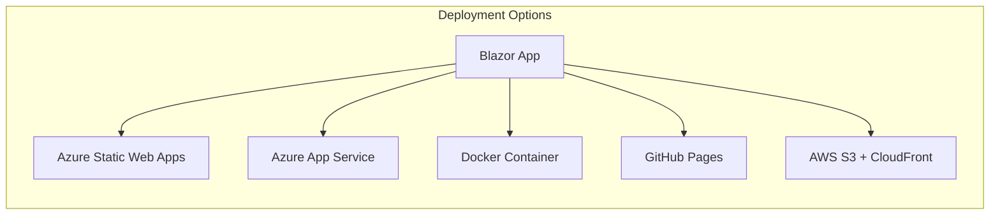

# How to Build Blazor Applications

Author: [nawazdhandala](https://www.github.com/nawazdhandala)

Tags: Blazor, C#, .NET, WebAssembly, Web Development

Description: Learn how to build interactive web applications with Blazor including components, data binding, forms, authentication, and deployment options.

---

Blazor is a framework for building interactive web applications using C# instead of JavaScript. It runs on WebAssembly in the browser or on the server with SignalR. This guide covers everything you need to know to build production-ready Blazor applications.

## Understanding Blazor Hosting Models

Blazor offers two hosting models: Blazor WebAssembly and Blazor Server. Each has distinct advantages depending on your use case.



## Setting Up a Blazor Project

Start by creating a new Blazor project using the .NET CLI.

```bash
# Create a new Blazor WebAssembly project
dotnet new blazorwasm -o MyBlazorApp

# Or create a Blazor Server project
dotnet new blazorserver -o MyBlazorApp

# Navigate to the project directory
cd MyBlazorApp

# Run the application
dotnet run
```

## Project Structure

A typical Blazor project has a well-organized structure that separates concerns.



## Building Your First Component

Blazor components are the building blocks of your application. Each component is a reusable piece of UI.

```csharp
// File: Components/ProductCard.razor

@* Component parameters allow data to be passed from parent components *@
@code {
    // Define a parameter that accepts a Product object
    [Parameter]
    public Product Item { get; set; } = default!;

    // Event callback for when the user clicks add to cart
    [Parameter]
    public EventCallback<Product> OnAddToCart { get; set; }

    // Private method to handle the button click
    private async Task AddToCartClicked()
    {
        // Invoke the callback to notify the parent component
        await OnAddToCart.InvokeAsync(Item);
    }
}

<div class="product-card">
    
    <h3>@Item.Name</h3>
    <p class="price">$@Item.Price.ToString("F2")</p>
    <p class="description">@Item.Description</p>

    @* Bind the click event to our handler method *@
    <button class="btn btn-primary" @onclick="AddToCartClicked">
        Add to Cart
    </button>
</div>
```

## Data Binding

Blazor supports one-way and two-way data binding for creating reactive UIs.

```csharp
// File: Pages/DataBindingDemo.razor
@page "/binding-demo"

<h2>Data Binding Examples</h2>

@* One-way binding: displays the value *@
<p>Current count: @count</p>

@* Two-way binding: syncs input value with variable *@
<input @bind="username" placeholder="Enter username" />
<p>Hello, @username!</p>

@* Two-way binding with event modifier *@
@* Updates on every keystroke instead of on blur *@
<input @bind="searchQuery" @bind:event="oninput" placeholder="Search..." />
<p>Searching for: @searchQuery</p>

@* Binding to a select element *@
<select @bind="selectedCategory">
    <option value="">Select a category</option>
    @foreach (var category in categories)
    {
        <option value="@category">@category</option>
    }
</select>
<p>Selected: @selectedCategory</p>

@code {
    // Variables for binding
    private int count = 0;
    private string username = "";
    private string searchQuery = "";
    private string selectedCategory = "";

    // List of categories for the dropdown
    private List<string> categories = new()
    {
        "Electronics",
        "Clothing",
        "Books",
        "Home & Garden"
    };
}
```

## Component Lifecycle

Understanding the component lifecycle helps you manage state and resources properly.



```csharp
// File: Components/LifecycleDemo.razor

@implements IAsyncDisposable

<h3>Lifecycle Demo</h3>
<p>Data: @data</p>

@code {
    private string data = "Loading...";
    private Timer? timer;

    // Called when the component is first initialized
    protected override async Task OnInitializedAsync()
    {
        // Perform async initialization like fetching data
        data = await LoadDataAsync();
    }

    // Called after parameters are set or changed
    protected override void OnParametersSet()
    {
        // React to parameter changes
        Console.WriteLine("Parameters have been set");
    }

    // Called after the component has rendered
    protected override void OnAfterRender(bool firstRender)
    {
        if (firstRender)
        {
            // Only runs on the first render
            // Good place to initialize JavaScript interop
            timer = new Timer(UpdateData, null, 0, 5000);
        }
    }

    private async Task<string> LoadDataAsync()
    {
        // Simulate API call
        await Task.Delay(500);
        return "Data loaded successfully";
    }

    private void UpdateData(object? state)
    {
        // Update data periodically
        data = $"Updated at {DateTime.Now:HH:mm:ss}";

        // Notify Blazor that state has changed
        InvokeAsync(StateHasChanged);
    }

    // Clean up resources when component is disposed
    public async ValueTask DisposeAsync()
    {
        if (timer != null)
        {
            await timer.DisposeAsync();
        }
    }
}
```

## Building Forms with Validation

Blazor provides built-in form handling with validation support.

```csharp
// File: Models/UserRegistration.cs

using System.ComponentModel.DataAnnotations;

public class UserRegistration
{
    // Required field with custom error message
    [Required(ErrorMessage = "Username is required")]
    [StringLength(50, MinimumLength = 3,
        ErrorMessage = "Username must be between 3 and 50 characters")]
    public string Username { get; set; } = "";

    // Email validation
    [Required(ErrorMessage = "Email is required")]
    [EmailAddress(ErrorMessage = "Invalid email format")]
    public string Email { get; set; } = "";

    // Password with complexity requirements
    [Required(ErrorMessage = "Password is required")]
    [MinLength(8, ErrorMessage = "Password must be at least 8 characters")]
    [RegularExpression(@"^(?=.*[a-z])(?=.*[A-Z])(?=.*\d).+$",
        ErrorMessage = "Password must contain uppercase, lowercase, and a number")]
    public string Password { get; set; } = "";

    // Confirm password validation
    [Required(ErrorMessage = "Please confirm your password")]
    [Compare(nameof(Password), ErrorMessage = "Passwords do not match")]
    public string ConfirmPassword { get; set; } = "";

    // Date validation
    [Required(ErrorMessage = "Birth date is required")]
    [DataType(DataType.Date)]
    public DateTime? BirthDate { get; set; }
}
```

```csharp
// File: Pages/Register.razor
@page "/register"
@inject NavigationManager Navigation

<h2>User Registration</h2>

@* EditForm provides form handling and validation context *@
<EditForm Model="@user" OnValidSubmit="HandleValidSubmit">
    @* Displays validation summary at the top of the form *@
    <DataAnnotationsValidator />
    <ValidationSummary />

    <div class="form-group">
        <label for="username">Username</label>
        <InputText id="username" class="form-control" @bind-Value="user.Username" />
        @* Shows validation message for this specific field *@
        <ValidationMessage For="@(() => user.Username)" />
    </div>

    <div class="form-group">
        <label for="email">Email</label>
        <InputText id="email" class="form-control" @bind-Value="user.Email" />
        <ValidationMessage For="@(() => user.Email)" />
    </div>

    <div class="form-group">
        <label for="password">Password</label>
        <InputText id="password" type="password" class="form-control"
                   @bind-Value="user.Password" />
        <ValidationMessage For="@(() => user.Password)" />
    </div>

    <div class="form-group">
        <label for="confirmPassword">Confirm Password</label>
        <InputText id="confirmPassword" type="password" class="form-control"
                   @bind-Value="user.ConfirmPassword" />
        <ValidationMessage For="@(() => user.ConfirmPassword)" />
    </div>

    <div class="form-group">
        <label for="birthDate">Birth Date</label>
        <InputDate id="birthDate" class="form-control" @bind-Value="user.BirthDate" />
        <ValidationMessage For="@(() => user.BirthDate)" />
    </div>

    <button type="submit" class="btn btn-primary" disabled="@isSubmitting">
        @if (isSubmitting)
        {
            <span>Registering...</span>
        }
        else
        {
            <span>Register</span>
        }
    </button>
</EditForm>

@code {
    private UserRegistration user = new();
    private bool isSubmitting = false;

    private async Task HandleValidSubmit()
    {
        isSubmitting = true;

        try
        {
            // Call your registration API here
            await RegisterUserAsync(user);

            // Navigate to success page
            Navigation.NavigateTo("/registration-success");
        }
        catch (Exception ex)
        {
            // Handle registration errors
            Console.WriteLine($"Registration failed: {ex.Message}");
        }
        finally
        {
            isSubmitting = false;
        }
    }

    private async Task RegisterUserAsync(UserRegistration registration)
    {
        // Simulate API call
        await Task.Delay(1000);
    }
}
```

## Dependency Injection

Blazor has built-in support for dependency injection to manage services.

```csharp
// File: Services/IWeatherService.cs

public interface IWeatherService
{
    Task<IEnumerable<WeatherForecast>> GetForecastAsync(DateTime startDate);
}

// File: Services/WeatherService.cs

public class WeatherService : IWeatherService
{
    private readonly HttpClient _httpClient;

    // HttpClient is injected through constructor
    public WeatherService(HttpClient httpClient)
    {
        _httpClient = httpClient;
    }

    public async Task<IEnumerable<WeatherForecast>> GetForecastAsync(DateTime startDate)
    {
        // Make HTTP request to weather API
        var response = await _httpClient.GetAsync(
            $"api/weather?startDate={startDate:yyyy-MM-dd}");

        response.EnsureSuccessStatusCode();

        return await response.Content
            .ReadFromJsonAsync<IEnumerable<WeatherForecast>>()
            ?? Enumerable.Empty<WeatherForecast>();
    }
}
```

```csharp
// File: Program.cs

using Microsoft.AspNetCore.Components.Web;
using Microsoft.AspNetCore.Components.WebAssembly.Hosting;

var builder = WebAssemblyHostBuilder.CreateDefault(args);

// Add root components
builder.RootComponents.Add<App>("#app");
builder.RootComponents.Add<HeadOutlet>("head::after");

// Configure HttpClient with base address
builder.Services.AddScoped(sp => new HttpClient
{
    BaseAddress = new Uri(builder.HostEnvironment.BaseAddress)
});

// Register services with appropriate lifetimes
// Scoped: One instance per user circuit (recommended for most services)
builder.Services.AddScoped<IWeatherService, WeatherService>();

// Singleton: One instance shared across all users
builder.Services.AddSingleton<IConfigurationService, ConfigurationService>();

// Transient: New instance every time it is requested
builder.Services.AddTransient<IValidationService, ValidationService>();

await builder.Build().RunAsync();
```

```csharp
// File: Pages/Weather.razor
@page "/weather"
@inject IWeatherService WeatherService

<h2>Weather Forecast</h2>

@if (forecasts == null)
{
    <p>Loading weather data...</p>
}
else if (!forecasts.Any())
{
    <p>No forecast data available.</p>
}
else
{
    <table class="table">
        <thead>
            <tr>
                <th>Date</th>
                <th>Temperature (C)</th>
                <th>Temperature (F)</th>
                <th>Summary</th>
            </tr>
        </thead>
        <tbody>
            @foreach (var forecast in forecasts)
            {
                <tr>
                    <td>@forecast.Date.ToShortDateString()</td>
                    <td>@forecast.TemperatureC</td>
                    <td>@forecast.TemperatureF</td>
                    <td>@forecast.Summary</td>
                </tr>
            }
        </tbody>
    </table>
}

@code {
    private IEnumerable<WeatherForecast>? forecasts;

    protected override async Task OnInitializedAsync()
    {
        // Use the injected service to fetch data
        forecasts = await WeatherService.GetForecastAsync(DateTime.Now);
    }
}
```

## State Management

Managing state across components is essential for complex applications.



```csharp
// File: Services/AppState.cs

public class AppState
{
    // Private backing field for cart items
    private List<CartItem> _cartItems = new();

    // Public read-only access to cart items
    public IReadOnlyList<CartItem> CartItems => _cartItems.AsReadOnly();

    // Computed property for total
    public decimal CartTotal => _cartItems.Sum(item => item.Price * item.Quantity);

    // Event that components can subscribe to
    public event Action? OnChange;

    // Method to add item to cart
    public void AddToCart(Product product, int quantity = 1)
    {
        var existingItem = _cartItems
            .FirstOrDefault(i => i.ProductId == product.Id);

        if (existingItem != null)
        {
            // Update quantity if item already exists
            existingItem.Quantity += quantity;
        }
        else
        {
            // Add new item to cart
            _cartItems.Add(new CartItem
            {
                ProductId = product.Id,
                Name = product.Name,
                Price = product.Price,
                Quantity = quantity
            });
        }

        // Notify subscribers that state has changed
        NotifyStateChanged();
    }

    // Method to remove item from cart
    public void RemoveFromCart(int productId)
    {
        var item = _cartItems.FirstOrDefault(i => i.ProductId == productId);
        if (item != null)
        {
            _cartItems.Remove(item);
            NotifyStateChanged();
        }
    }

    // Method to clear the entire cart
    public void ClearCart()
    {
        _cartItems.Clear();
        NotifyStateChanged();
    }

    // Private method to raise the change event
    private void NotifyStateChanged() => OnChange?.Invoke();
}
```

```csharp
// File: Components/CartSummary.razor
@inject AppState AppState
@implements IDisposable

<div class="cart-summary">
    <span class="cart-icon">Cart</span>
    <span class="cart-count">@AppState.CartItems.Count</span>
    <span class="cart-total">$@AppState.CartTotal.ToString("F2")</span>
</div>

@code {
    protected override void OnInitialized()
    {
        // Subscribe to state changes
        AppState.OnChange += StateHasChanged;
    }

    public void Dispose()
    {
        // Unsubscribe to prevent memory leaks
        AppState.OnChange -= StateHasChanged;
    }
}
```

## JavaScript Interop

Sometimes you need to call JavaScript from Blazor or vice versa.

```csharp
// File: Pages/JsInteropDemo.razor
@page "/js-interop"
@inject IJSRuntime JS

<h2>JavaScript Interop Demo</h2>

<button class="btn btn-primary" @onclick="ShowAlert">
    Show JavaScript Alert
</button>

<button class="btn btn-secondary" @onclick="GetBrowserInfo">
    Get Browser Info
</button>

@if (!string.IsNullOrEmpty(browserInfo))
{
    <p>Browser: @browserInfo</p>
}

<div @ref="chartContainer" id="chart-container"></div>

<button class="btn btn-success" @onclick="InitializeChart">
    Initialize Chart
</button>

@code {
    private string browserInfo = "";
    private ElementReference chartContainer;

    // Call a simple JavaScript function
    private async Task ShowAlert()
    {
        await JS.InvokeVoidAsync("alert", "Hello from Blazor!");
    }

    // Call JavaScript and get a return value
    private async Task GetBrowserInfo()
    {
        browserInfo = await JS.InvokeAsync<string>("getBrowserInfo");
    }

    // Pass an element reference to JavaScript
    private async Task InitializeChart()
    {
        // Initialize a chart library in the specified container
        await JS.InvokeVoidAsync("initializeChart", chartContainer, new
        {
            labels = new[] { "Jan", "Feb", "Mar", "Apr", "May" },
            data = new[] { 10, 20, 15, 25, 30 }
        });
    }
}
```

```javascript
// File: wwwroot/js/interop.js

// Simple function to get browser info
window.getBrowserInfo = function() {
    return navigator.userAgent;
};

// Function to initialize a chart using an element reference
window.initializeChart = function(element, options) {
    // Example using Chart.js or similar library
    console.log("Initializing chart in element:", element);
    console.log("With options:", options);

    // Your chart initialization code here
    // new Chart(element, { ... });
};

// Function that calls back into Blazor
window.setupCallback = function(dotNetHelper) {
    document.addEventListener("scroll", function() {
        // Call a method on the Blazor component
        dotNetHelper.invokeMethodAsync("OnScroll", window.scrollY);
    });
};
```

## Authentication and Authorization

Blazor provides built-in support for authentication and authorization.

```csharp
// File: Program.cs (Authentication setup)

// Add authentication services
builder.Services.AddOidcAuthentication(options =>
{
    // Configure your identity provider
    builder.Configuration.Bind("Auth0", options.ProviderOptions);
    options.ProviderOptions.ResponseType = "code";
});

// Or use custom authentication state provider
builder.Services.AddScoped<AuthenticationStateProvider, CustomAuthStateProvider>();
builder.Services.AddAuthorizationCore();
```

```csharp
// File: Services/CustomAuthStateProvider.cs

using Microsoft.AspNetCore.Components.Authorization;
using System.Security.Claims;

public class CustomAuthStateProvider : AuthenticationStateProvider
{
    private readonly ILocalStorageService _localStorage;
    private readonly HttpClient _httpClient;

    public CustomAuthStateProvider(
        ILocalStorageService localStorage,
        HttpClient httpClient)
    {
        _localStorage = localStorage;
        _httpClient = httpClient;
    }

    public override async Task<AuthenticationState> GetAuthenticationStateAsync()
    {
        // Get token from local storage
        var token = await _localStorage.GetItemAsync<string>("authToken");

        if (string.IsNullOrEmpty(token))
        {
            // Return anonymous user if no token
            return new AuthenticationState(
                new ClaimsPrincipal(new ClaimsIdentity()));
        }

        // Set the authorization header for API calls
        _httpClient.DefaultRequestHeaders.Authorization =
            new AuthenticationHeaderValue("Bearer", token);

        // Parse claims from the token
        var claims = ParseClaimsFromJwt(token);
        var identity = new ClaimsIdentity(claims, "jwt");
        var user = new ClaimsPrincipal(identity);

        return new AuthenticationState(user);
    }

    public void NotifyUserAuthentication(string token)
    {
        var claims = ParseClaimsFromJwt(token);
        var identity = new ClaimsIdentity(claims, "jwt");
        var user = new ClaimsPrincipal(identity);

        // Notify the app that authentication state has changed
        var authState = Task.FromResult(new AuthenticationState(user));
        NotifyAuthenticationStateChanged(authState);
    }

    public void NotifyUserLogout()
    {
        var anonymous = new ClaimsPrincipal(new ClaimsIdentity());
        var authState = Task.FromResult(new AuthenticationState(anonymous));
        NotifyAuthenticationStateChanged(authState);
    }

    private IEnumerable<Claim> ParseClaimsFromJwt(string jwt)
    {
        var claims = new List<Claim>();
        var payload = jwt.Split('.')[1];
        var jsonBytes = Convert.FromBase64String(
            AddPadding(payload));
        var keyValuePairs = JsonSerializer
            .Deserialize<Dictionary<string, object>>(jsonBytes);

        if (keyValuePairs != null)
        {
            foreach (var kvp in keyValuePairs)
            {
                claims.Add(new Claim(kvp.Key, kvp.Value.ToString() ?? ""));
            }
        }

        return claims;
    }

    private string AddPadding(string base64)
    {
        switch (base64.Length % 4)
        {
            case 2: return base64 + "==";
            case 3: return base64 + "=";
            default: return base64;
        }
    }
}
```

```csharp
// File: Pages/SecurePage.razor
@page "/secure"
@attribute [Authorize]

<h2>Secure Content</h2>

<AuthorizeView>
    <Authorized>
        <p>Welcome, @context.User.Identity?.Name!</p>

        @* Show content only for admin role *@
        <AuthorizeView Roles="Admin">
            <Authorized>
                <div class="admin-panel">
                    <h3>Admin Panel</h3>
                    <p>You have administrative access.</p>
                </div>
            </Authorized>
        </AuthorizeView>
    </Authorized>
    <NotAuthorized>
        <p>You must be logged in to view this content.</p>
        <a href="/login">Log in</a>
    </NotAuthorized>
</AuthorizeView>
```

## Error Handling

Implement proper error handling to create resilient applications.

```csharp
// File: Components/ErrorBoundary.razor
@inherits ErrorBoundary

@if (CurrentException != null)
{
    <div class="error-container">
        <h3>Something went wrong</h3>
        <p>@CurrentException.Message</p>
        <button class="btn btn-primary" @onclick="Recover">
            Try Again
        </button>
    </div>
}
else
{
    @ChildContent
}

@code {
    [Parameter]
    public RenderFragment? ChildContent { get; set; }
}
```

```csharp
// File: Pages/Index.razor

@page "/"

<ErrorBoundary @ref="errorBoundary">
    <ChildContent>
        <ProductList />
    </ChildContent>
</ErrorBoundary>

@code {
    private ErrorBoundary? errorBoundary;

    protected override void OnParametersSet()
    {
        // Reset error boundary when parameters change
        errorBoundary?.Recover();
    }
}
```

## Deployment Options

Blazor applications can be deployed in several ways.



```bash
# Publish for production
dotnet publish -c Release -o ./publish

# Docker deployment
# File: Dockerfile
FROM mcr.microsoft.com/dotnet/aspnet:8.0 AS base
WORKDIR /app
EXPOSE 80

FROM mcr.microsoft.com/dotnet/sdk:8.0 AS build
WORKDIR /src
COPY ["MyBlazorApp.csproj", "./"]
RUN dotnet restore
COPY . .
RUN dotnet build -c Release -o /app/build

FROM build AS publish
RUN dotnet publish -c Release -o /app/publish

FROM base AS final
WORKDIR /app
COPY --from=publish /app/publish .
ENTRYPOINT ["dotnet", "MyBlazorApp.dll"]
```

```bash
# Build and run Docker container
docker build -t myblazorapp .
docker run -d -p 8080:80 myblazorapp
```

## Performance Optimization

Follow these practices to optimize your Blazor application.

```csharp
// File: Components/OptimizedList.razor

@typeparam TItem

@* Use virtualization for large lists *@
<Virtualize Items="@Items" Context="item" ItemSize="50">
    <ItemContent>
        @ItemTemplate(item)
    </ItemContent>
    <Placeholder>
        <div class="placeholder-item">Loading...</div>
    </Placeholder>
</Virtualize>

@code {
    [Parameter]
    public ICollection<TItem> Items { get; set; } = new List<TItem>();

    [Parameter]
    public RenderFragment<TItem> ItemTemplate { get; set; } = default!;
}
```

```csharp
// File: Components/MemoizedComponent.razor

@* Use ShouldRender to prevent unnecessary re-renders *@

<div class="memoized-content">
    <h4>@Title</h4>
    <p>Rendered at: @renderTime</p>
</div>

@code {
    [Parameter]
    public string Title { get; set; } = "";

    private string previousTitle = "";
    private DateTime renderTime;

    // Only re-render when Title actually changes
    protected override bool ShouldRender()
    {
        if (Title != previousTitle)
        {
            previousTitle = Title;
            renderTime = DateTime.Now;
            return true;
        }
        return false;
    }
}
```

## Summary

Building Blazor applications involves understanding components, data binding, forms, dependency injection, state management, and authentication. The framework provides a productive environment for C# developers to build interactive web applications without writing JavaScript.

Key takeaways:

1. Choose the right hosting model based on your requirements
2. Build reusable components with parameters and event callbacks
3. Use data binding for reactive UIs
4. Implement proper form validation using data annotations
5. Manage state with dependency injection and state containers
6. Use JavaScript interop when needed for browser APIs
7. Implement authentication and authorization for secure applications
8. Optimize performance with virtualization and memoization

Start with a simple project and gradually add complexity as you become comfortable with the framework. The official Microsoft documentation and the Blazor community provide excellent resources for continued learning.
