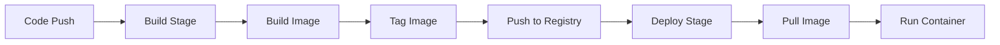

# How to Build Docker Images with GitLab CI

Author: [nawazdhandala](https://www.github.com/nawazdhandala)

Tags: GitLab CI, Docker, Container, CI/CD, DevOps, Container Registry

Description: Learn how to build, tag, and push Docker images with GitLab CI using Docker-in-Docker, Kaniko, and BuildKit for fast, secure container builds.

---

Building Docker images in CI requires running Docker commands inside a containerized environment. This creates a container-in-container situation that needs careful handling. GitLab CI offers several approaches, each with different trade-offs for security, speed, and complexity. This guide covers the practical methods you'll use in production.

## Docker-in-Docker (DinD)

The traditional approach runs a Docker daemon inside your CI job.

```yaml
build-image:
  stage: build
  image: docker:24.0
  services:
    # Run Docker daemon as a service
    - docker:24.0-dind
  variables:
    # Connect to the service container
    DOCKER_HOST: tcp://docker:2376
    DOCKER_TLS_CERTDIR: "/certs"
    DOCKER_CERT_PATH: "/certs/client"
    DOCKER_TLS_VERIFY: "1"
  before_script:
    # Authenticate to GitLab Container Registry
    - docker login -u $CI_REGISTRY_USER -p $CI_REGISTRY_PASSWORD $CI_REGISTRY
  script:
    # Build and tag the image
    - docker build -t $CI_REGISTRY_IMAGE:$CI_COMMIT_SHA .
    - docker push $CI_REGISTRY_IMAGE:$CI_COMMIT_SHA
```

The `docker:dind` service runs a full Docker daemon. Your job connects to it via TCP. This works but requires privileged mode on the runner.

## Kaniko for Rootless Builds

Kaniko builds images without requiring a Docker daemon or privileged access.

```yaml
build-image:
  stage: build
  image:
    name: gcr.io/kaniko-project/executor:v1.19.0-debug
    entrypoint: [""]
  script:
    # Kaniko reads credentials from this file
    - mkdir -p /kaniko/.docker
    - echo "{\"auths\":{\"${CI_REGISTRY}\":{\"auth\":\"$(printf "%s:%s" "${CI_REGISTRY_USER}" "${CI_REGISTRY_PASSWORD}" | base64 | tr -d '\n')\"}}}" > /kaniko/.docker/config.json
    # Build and push in one command
    - /kaniko/executor
      --context "${CI_PROJECT_DIR}"
      --dockerfile "${CI_PROJECT_DIR}/Dockerfile"
      --destination "${CI_REGISTRY_IMAGE}:${CI_COMMIT_SHA}"
      --destination "${CI_REGISTRY_IMAGE}:latest"
```

Kaniko executes Dockerfile commands directly in the container, writing layers to the registry without needing Docker. This is more secure but can be slower for complex builds.

## BuildKit with Buildx

BuildKit provides advanced features like better caching and multi-platform builds.

```yaml
build-image:
  stage: build
  image: docker:24.0
  services:
    - docker:24.0-dind
  variables:
    DOCKER_HOST: tcp://docker:2376
    DOCKER_TLS_CERTDIR: "/certs"
    DOCKER_BUILDKIT: "1"
  before_script:
    - docker login -u $CI_REGISTRY_USER -p $CI_REGISTRY_PASSWORD $CI_REGISTRY
    # Install buildx
    - mkdir -p ~/.docker/cli-plugins
    - wget -O ~/.docker/cli-plugins/docker-buildx https://github.com/docker/buildx/releases/download/v0.12.0/buildx-v0.12.0.linux-amd64
    - chmod +x ~/.docker/cli-plugins/docker-buildx
    # Create builder with BuildKit
    - docker buildx create --use --driver docker-container
  script:
    - docker buildx build
      --cache-from type=registry,ref=$CI_REGISTRY_IMAGE:cache
      --cache-to type=registry,ref=$CI_REGISTRY_IMAGE:cache,mode=max
      --push
      -t $CI_REGISTRY_IMAGE:$CI_COMMIT_SHA
      .
```

BuildKit's registry-based caching dramatically speeds up builds by storing and reusing layers remotely.

## Multi-Stage Builds

Optimize image size with multi-stage Dockerfiles.

```dockerfile
# Dockerfile
# Build stage - includes build tools
FROM node:20-alpine AS builder
WORKDIR /app
COPY package*.json ./
RUN npm ci
COPY . .
RUN npm run build

# Production stage - minimal runtime
FROM node:20-alpine AS production
WORKDIR /app
# Copy only built artifacts
COPY --from=builder /app/dist ./dist
COPY --from=builder /app/node_modules ./node_modules
COPY package.json ./
USER node
EXPOSE 3000
CMD ["node", "dist/index.js"]
```

```yaml
build-image:
  stage: build
  image: docker:24.0
  services:
    - docker:24.0-dind
  variables:
    DOCKER_HOST: tcp://docker:2376
    DOCKER_TLS_CERTDIR: "/certs"
  script:
    - docker login -u $CI_REGISTRY_USER -p $CI_REGISTRY_PASSWORD $CI_REGISTRY
    # Build specific stage
    - docker build --target production -t $CI_REGISTRY_IMAGE:$CI_COMMIT_SHA .
    - docker push $CI_REGISTRY_IMAGE:$CI_COMMIT_SHA
```

## Build Process Flow

Here's the typical Docker build workflow:



## Caching Strategies

Layer caching is crucial for fast builds. Here are effective patterns.

### Registry Cache

```yaml
build-image:
  script:
    # Pull previous image for cache
    - docker pull $CI_REGISTRY_IMAGE:latest || true
    # Build with cache from previous image
    - docker build
      --cache-from $CI_REGISTRY_IMAGE:latest
      -t $CI_REGISTRY_IMAGE:$CI_COMMIT_SHA
      -t $CI_REGISTRY_IMAGE:latest
      .
    - docker push $CI_REGISTRY_IMAGE:$CI_COMMIT_SHA
    - docker push $CI_REGISTRY_IMAGE:latest
```

### BuildKit Inline Cache

```yaml
build-image:
  script:
    - docker build
      --build-arg BUILDKIT_INLINE_CACHE=1
      --cache-from $CI_REGISTRY_IMAGE:latest
      -t $CI_REGISTRY_IMAGE:$CI_COMMIT_SHA
      .
```

The inline cache embeds cache metadata in the image itself.

## Multi-Architecture Builds

Build images for multiple CPU architectures.

```yaml
build-multiarch:
  stage: build
  image: docker:24.0
  services:
    - docker:24.0-dind
  variables:
    DOCKER_HOST: tcp://docker:2376
    DOCKER_TLS_CERTDIR: "/certs"
  before_script:
    - docker login -u $CI_REGISTRY_USER -p $CI_REGISTRY_PASSWORD $CI_REGISTRY
    # Set up QEMU for cross-platform builds
    - docker run --privileged --rm tonistiigi/binfmt --install all
    # Create multi-platform builder
    - docker buildx create --use --name multiarch
  script:
    - docker buildx build
      --platform linux/amd64,linux/arm64
      --push
      -t $CI_REGISTRY_IMAGE:$CI_COMMIT_SHA
      .
```

QEMU emulates ARM on x86 runners (and vice versa), enabling builds for any platform.

## Security Scanning

Scan images before pushing to production.

```yaml
stages:
  - build
  - scan
  - push

build-image:
  stage: build
  script:
    - docker build -t $CI_REGISTRY_IMAGE:$CI_COMMIT_SHA .
    # Save image to file for scanning
    - docker save $CI_REGISTRY_IMAGE:$CI_COMMIT_SHA > image.tar
  artifacts:
    paths:
      - image.tar
    expire_in: 1 hour

scan-image:
  stage: scan
  image:
    name: aquasec/trivy:latest
    entrypoint: [""]
  script:
    # Scan the saved image
    - trivy image --input image.tar --exit-code 1 --severity CRITICAL,HIGH
  dependencies:
    - build-image

push-image:
  stage: push
  script:
    - docker login -u $CI_REGISTRY_USER -p $CI_REGISTRY_PASSWORD $CI_REGISTRY
    - docker load < image.tar
    - docker push $CI_REGISTRY_IMAGE:$CI_COMMIT_SHA
  dependencies:
    - build-image
  needs:
    - scan-image
```

## Build Arguments and Secrets

Pass build-time configuration securely.

```yaml
build-image:
  stage: build
  script:
    - docker build
      --build-arg APP_VERSION=$CI_COMMIT_SHA
      --build-arg BUILD_DATE=$(date -u +%Y-%m-%dT%H:%M:%SZ)
      -t $CI_REGISTRY_IMAGE:$CI_COMMIT_SHA
      .
```

For secrets during build, use BuildKit's secret mounting:

```dockerfile
# Dockerfile
FROM node:20-alpine
WORKDIR /app
COPY package*.json ./
# Mount secret at build time only - not stored in layer
RUN --mount=type=secret,id=npm_token \
    NPM_TOKEN=$(cat /run/secrets/npm_token) npm ci
COPY . .
RUN npm run build
```

```yaml
build-image:
  script:
    # Pass secret to build
    - echo "$NPM_TOKEN" > npm_token
    - docker build --secret id=npm_token,src=npm_token -t $CI_REGISTRY_IMAGE:$CI_COMMIT_SHA .
    - rm npm_token
```

## Tagging Strategies

Use meaningful tags for different purposes.

```yaml
build-image:
  stage: build
  script:
    - docker login -u $CI_REGISTRY_USER -p $CI_REGISTRY_PASSWORD $CI_REGISTRY
    - docker build -t $CI_REGISTRY_IMAGE:$CI_COMMIT_SHA .

    # Tag based on context
    - |
      if [ "$CI_COMMIT_BRANCH" = "main" ]; then
        docker tag $CI_REGISTRY_IMAGE:$CI_COMMIT_SHA $CI_REGISTRY_IMAGE:latest
        docker push $CI_REGISTRY_IMAGE:latest
      fi

    - |
      if [ -n "$CI_COMMIT_TAG" ]; then
        docker tag $CI_REGISTRY_IMAGE:$CI_COMMIT_SHA $CI_REGISTRY_IMAGE:$CI_COMMIT_TAG
        docker push $CI_REGISTRY_IMAGE:$CI_COMMIT_TAG
      fi

    - docker push $CI_REGISTRY_IMAGE:$CI_COMMIT_SHA
```

Common tagging patterns:
- `latest`: Most recent build from main branch
- `v1.2.3`: Semantic version tags
- `abc123`: Commit SHA for immutable references
- `branch-name`: Current branch for testing

## Optimizing Build Speed

Speed matters for developer productivity. Apply these optimizations:

Order Dockerfile commands from least to most frequently changing:

```dockerfile
# Rarely changes - cached well
FROM node:20-alpine
WORKDIR /app

# Changes occasionally
COPY package*.json ./
RUN npm ci

# Changes frequently - at the end
COPY . .
RUN npm run build
```

Use `.dockerignore` to exclude unnecessary files:

```
# .dockerignore
node_modules
.git
.gitignore
*.md
tests
coverage
.env*
```

Parallelize independent build stages in your pipeline:

```yaml
build-frontend:
  stage: build
  script:
    - docker build -f Dockerfile.frontend -t $CI_REGISTRY_IMAGE/frontend:$CI_COMMIT_SHA .

build-backend:
  stage: build
  script:
    - docker build -f Dockerfile.backend -t $CI_REGISTRY_IMAGE/backend:$CI_COMMIT_SHA .
```

---

Building Docker images in GitLab CI balances speed, security, and simplicity. Start with Docker-in-Docker for familiarity, then move to Kaniko if you need rootless builds or BuildKit if you need advanced caching. The key is matching your build approach to your security requirements and performance needs.
