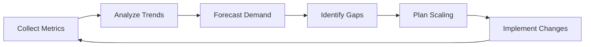
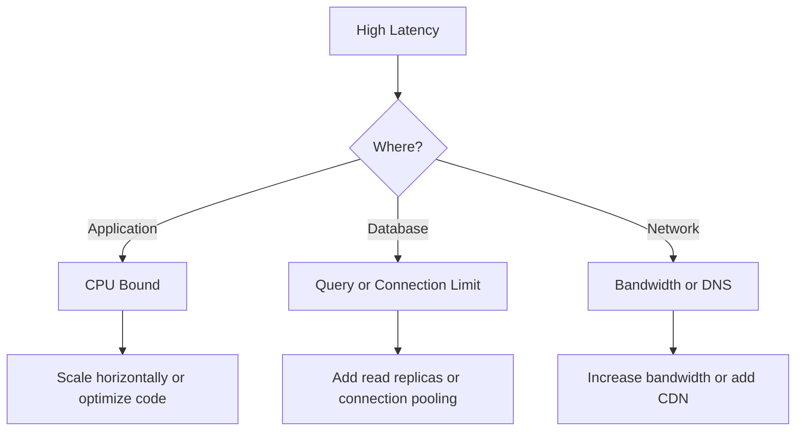

# How to Implement Capacity Planning for Services

Author: [nawazdhandala](https://www.github.com/nawazdhandala)

Tags: Capacity Planning, DevOps, Infrastructure, Scaling, Monitoring, SRE, Performance

Description: A practical guide to implementing capacity planning for services, covering resource forecasting, monitoring setup, load testing, and scaling strategies to ensure your systems handle growth without downtime.

---

Your service handles 100 requests per second today. Next month, marketing launches a campaign that could double your traffic. Will your infrastructure handle it? Without capacity planning, you are left guessing. With it, you can confidently scale before problems occur.

This guide walks through implementing capacity planning from scratch - from collecting the right metrics to building forecasts and automated scaling policies.

---

## What is Capacity Planning?

Capacity planning is the process of determining what resources your services need to handle current and future load. It involves:

1. Understanding current resource utilization
2. Forecasting future demand
3. Identifying bottlenecks before they cause outages
4. Planning infrastructure changes ahead of time

The goal is simple: have enough capacity to handle load with acceptable performance, without massively over-provisioning (and wasting money).



---

## Step 1: Define Your Service Capacity Metrics

Before you can plan capacity, you need to measure it. Every service has different bottlenecks, but these metrics apply to most:

### Resource Metrics

| Metric | What to Track | Warning Threshold |
|--------|---------------|-------------------|
| CPU Usage | Average and P95 utilization | 70-80% sustained |
| Memory Usage | Used vs available, including swap | 80-85% |
| Disk I/O | Read/write throughput, IOPS, latency | 80% of provisioned |
| Network | Bandwidth utilization, packet drops | 70% of capacity |

### Application Metrics

| Metric | What to Track | Why It Matters |
|--------|---------------|----------------|
| Request Rate | Requests per second | Measures demand |
| Response Time | P50, P95, P99 latency | User experience |
| Error Rate | 4xx and 5xx responses | Service health |
| Queue Depth | Pending work items | Processing capacity |
| Connection Pool | Active vs available | Database capacity |

### Setting Up Prometheus Metrics

Here is a practical example collecting these metrics with Prometheus:

```yaml
# prometheus.yml
global:
  scrape_interval: 15s
  evaluation_interval: 15s

scrape_configs:
  # Application metrics
  - job_name: 'api-service'
    static_configs:
      - targets: ['api-service:8080']
    metrics_path: /metrics

  # Node metrics for resource utilization
  - job_name: 'node-exporter'
    static_configs:
      - targets: ['node-exporter:9100']

  # Database metrics
  - job_name: 'postgres'
    static_configs:
      - targets: ['postgres-exporter:9187']
```

In your application, expose key metrics:

```python
# Python example using prometheus_client
from prometheus_client import Counter, Histogram, Gauge
import time

# Request metrics
REQUEST_COUNT = Counter(
    'http_requests_total',
    'Total HTTP requests',
    ['method', 'endpoint', 'status']
)

REQUEST_LATENCY = Histogram(
    'http_request_duration_seconds',
    'HTTP request latency',
    ['method', 'endpoint'],
    buckets=[0.01, 0.05, 0.1, 0.25, 0.5, 1.0, 2.5, 5.0, 10.0]
)

# Capacity metrics
ACTIVE_CONNECTIONS = Gauge(
    'active_connections',
    'Number of active client connections'
)

QUEUE_SIZE = Gauge(
    'task_queue_size',
    'Number of tasks waiting to be processed'
)

DB_POOL_AVAILABLE = Gauge(
    'db_pool_connections_available',
    'Available database connections in pool'
)

# Middleware to track requests
def track_request(method, endpoint, status, duration):
    REQUEST_COUNT.labels(method=method, endpoint=endpoint, status=status).inc()
    REQUEST_LATENCY.labels(method=method, endpoint=endpoint).observe(duration)
```

---

## Step 2: Establish Baselines

You cannot plan for growth without understanding where you are today. Collect at least 2-4 weeks of data to establish baselines, capturing daily and weekly patterns.

### Key Questions to Answer

1. What is your peak traffic time?
2. What is the ratio between peak and average load?
3. How does resource usage correlate with request rate?
4. What is your current headroom (capacity minus usage)?

### Creating a Baseline Report

Build a dashboard that shows these key relationships:

```sql
-- Example: Calculate requests per CPU core over time
-- This helps understand how efficiently you use resources

SELECT
    time_bucket('1 hour', time) AS hour,
    avg(http_requests_total) / avg(cpu_cores) AS requests_per_core,
    avg(cpu_usage_percent) AS avg_cpu,
    percentile_cont(0.95) WITHIN GROUP (ORDER BY cpu_usage_percent) AS p95_cpu
FROM metrics
WHERE time > now() - interval '7 days'
GROUP BY hour
ORDER BY hour;
```

Document your findings:

```
Service: API Gateway
Baseline Period: January 1-14, 2026

Peak Load:
- Time: Weekdays 10:00-11:00 AM, 2:00-3:00 PM
- Requests/sec: 450 (average), 680 (peak)
- Peak to average ratio: 1.5x

Resource Utilization at Peak:
- CPU: 65% average, 78% P95
- Memory: 72% average
- Database connections: 45/100 (45%)

Current Headroom:
- CPU: ~20% before hitting 85% threshold
- Can handle ~25% traffic increase before scaling
```

---

## Step 3: Identify Bottlenecks

Different services have different bottlenecks. Understanding yours is critical for capacity planning.

### Common Bottleneck Patterns



### Finding Your Bottleneck

Run this analysis during peak load:

```python
# Script to identify bottlenecks
import requests
import json

def analyze_bottlenecks(prometheus_url, service_name):
    queries = {
        'cpu_saturation': f'avg(rate(process_cpu_seconds_total{{service="{service_name}"}}[5m])) > 0.8',
        'memory_pressure': f'avg(process_resident_memory_bytes{{service="{service_name}"}}) / avg(node_memory_MemTotal_bytes) > 0.85',
        'db_connection_saturation': f'avg(db_pool_active_connections{{service="{service_name}"}}) / avg(db_pool_max_connections) > 0.8',
        'request_queue_growth': f'rate(request_queue_size{{service="{service_name}"}}[5m]) > 0',
    }

    bottlenecks = []
    for name, query in queries.items():
        result = requests.get(
            f'{prometheus_url}/api/v1/query',
            params={'query': query}
        ).json()

        if result['data']['result']:
            bottlenecks.append(name)

    return bottlenecks

# Example output: ['db_connection_saturation']
# This tells you the database connection pool is your constraint
```

---

## Step 4: Build a Capacity Model

A capacity model predicts how resources scale with load. Start simple and refine over time.

### Linear Capacity Model

For most services, resource usage scales roughly linearly with load:

```
Resource_Usage = Base_Usage + (Load * Usage_Per_Unit)
```

Example calculation:

```python
# Capacity model for API service
class CapacityModel:
    def __init__(self):
        # Derived from baseline measurements
        self.base_cpu_percent = 15  # CPU usage at zero load
        self.cpu_per_100_rps = 12   # Additional CPU per 100 req/sec
        self.base_memory_mb = 512
        self.memory_per_100_rps = 50
        self.db_connections_per_100_rps = 8

    def predict_resources(self, requests_per_second):
        """Predict resource needs for given load"""
        rps_units = requests_per_second / 100

        return {
            'cpu_percent': self.base_cpu_percent + (self.cpu_per_100_rps * rps_units),
            'memory_mb': self.base_memory_mb + (self.memory_per_100_rps * rps_units),
            'db_connections': self.db_connections_per_100_rps * rps_units,
        }

    def max_capacity(self, cpu_limit=80, memory_limit_mb=3500, db_connection_limit=90):
        """Calculate maximum requests per second given resource limits"""
        max_by_cpu = ((cpu_limit - self.base_cpu_percent) / self.cpu_per_100_rps) * 100
        max_by_memory = ((memory_limit_mb - self.base_memory_mb) / self.memory_per_100_rps) * 100
        max_by_db = (db_connection_limit / self.db_connections_per_100_rps) * 100

        # The bottleneck determines max capacity
        return {
            'max_rps': min(max_by_cpu, max_by_memory, max_by_db),
            'bottleneck': 'cpu' if max_by_cpu == min(max_by_cpu, max_by_memory, max_by_db)
                         else 'memory' if max_by_memory == min(max_by_cpu, max_by_memory, max_by_db)
                         else 'db_connections'
        }

# Usage
model = CapacityModel()
print(model.predict_resources(500))  # Predict for 500 req/sec
print(model.max_capacity())  # Find maximum capacity
```

---

## Step 5: Forecast Future Demand

Combine historical trends with business intelligence to forecast demand.

### Historical Growth Analysis

```python
import pandas as pd
from sklearn.linear_model import LinearRegression
import numpy as np

def forecast_traffic(historical_data, days_ahead=90):
    """
    Forecast traffic based on historical trends
    historical_data: DataFrame with columns ['date', 'requests_per_day']
    """
    df = historical_data.copy()
    df['day_number'] = (df['date'] - df['date'].min()).dt.days

    # Fit linear regression
    X = df['day_number'].values.reshape(-1, 1)
    y = df['requests_per_day'].values

    model = LinearRegression()
    model.fit(X, y)

    # Forecast
    future_days = np.arange(len(df), len(df) + days_ahead).reshape(-1, 1)
    forecast = model.predict(future_days)

    # Calculate growth rate
    daily_growth = model.coef_[0]
    current_traffic = y[-1]
    growth_percent = (daily_growth * 30 / current_traffic) * 100

    return {
        'forecast_90_days': forecast[-1],
        'monthly_growth_percent': growth_percent,
        'days_until_capacity': None  # Calculate based on your capacity model
    }
```

### Business Event Calendar

Technical forecasting is not enough. Build a calendar of events that affect load:

| Event | Expected Impact | Date | Duration |
|-------|-----------------|------|----------|
| Marketing campaign | +50% traffic | Feb 15 | 2 weeks |
| Product launch | +100% traffic | Mar 1 | 1 week spike, +30% sustained |
| Seasonal peak | +80% traffic | Dec 1-25 | 25 days |
| Partner integration | +20% sustained | Apr 1 | Permanent |

---

## Step 6: Set Up Alerting and Automation

Capacity planning is not a one-time exercise. Set up alerts to warn you before hitting limits.

### Capacity Alerts

```yaml
# Prometheus alerting rules
groups:
  - name: capacity_alerts
    rules:
      # Alert when approaching CPU capacity
      - alert: HighCPUUtilization
        expr: avg(rate(process_cpu_seconds_total[5m])) by (service) > 0.75
        for: 15m
        labels:
          severity: warning
        annotations:
          summary: "Service {{ $labels.service }} CPU at {{ $value | humanizePercentage }}"
          description: "Consider scaling or optimizing. Capacity planning threshold is 80%."

      # Alert when database connections are running low
      - alert: DatabaseConnectionPoolLow
        expr: (db_pool_active / db_pool_max) > 0.8
        for: 5m
        labels:
          severity: warning
        annotations:
          summary: "Database connection pool {{ $value | humanizePercentage }} utilized"

      # Predictive alert - traffic growing faster than capacity
      - alert: CapacityRunway
        expr: predict_linear(http_requests_total[7d], 30*24*3600) > (max_service_capacity * 0.9)
        for: 1h
        labels:
          severity: warning
        annotations:
          summary: "Service will reach 90% capacity in 30 days at current growth rate"
```

### Auto-Scaling Configuration

For Kubernetes, configure Horizontal Pod Autoscaler with appropriate thresholds:

```yaml
# Kubernetes HPA for capacity-aware scaling
apiVersion: autoscaling/v2
kind: HorizontalPodAutoscaler
metadata:
  name: api-service-hpa
spec:
  scaleTargetRef:
    apiVersion: apps/v1
    kind: Deployment
    name: api-service
  minReplicas: 3
  maxReplicas: 20
  metrics:
    # Scale based on CPU - leave headroom
    - type: Resource
      resource:
        name: cpu
        target:
          type: Utilization
          averageUtilization: 70  # Scale before hitting 80% threshold

    # Scale based on custom metric (requests per second per pod)
    - type: Pods
      pods:
        metric:
          name: http_requests_per_second
        target:
          type: AverageValue
          averageValue: "100"  # Based on capacity model

  behavior:
    scaleUp:
      stabilizationWindowSeconds: 60
      policies:
        - type: Percent
          value: 50
          periodSeconds: 60
    scaleDown:
      stabilizationWindowSeconds: 300  # Wait 5 minutes before scaling down
      policies:
        - type: Percent
          value: 25
          periodSeconds: 120
```

---

## Step 7: Load Testing for Validation

Validate your capacity model with load tests before relying on it.

### Load Test Strategy

```python
# Load test script using locust
from locust import HttpUser, task, between

class APIUser(HttpUser):
    wait_time = between(0.5, 2)

    @task(10)
    def get_items(self):
        self.client.get("/api/items")

    @task(3)
    def get_item_detail(self):
        self.client.get("/api/items/123")

    @task(1)
    def create_item(self):
        self.client.post("/api/items", json={"name": "test"})
```

Run load tests at different levels:

```bash
# Test current capacity
locust --headless --users 100 --spawn-rate 10 --run-time 10m

# Test 50% above current peak
locust --headless --users 150 --spawn-rate 10 --run-time 10m

# Find breaking point
locust --headless --users 300 --spawn-rate 5 --run-time 15m
```

### Interpreting Results

Compare actual results to your capacity model predictions:

| Load Level | Predicted CPU | Actual CPU | Predicted Latency P95 | Actual Latency P95 |
|------------|---------------|------------|----------------------|-------------------|
| 200 rps | 39% | 42% | 120ms | 115ms |
| 400 rps | 63% | 68% | 180ms | 195ms |
| 600 rps | 87% | 92% | 350ms | 520ms |

If predictions differ significantly from actual results, update your capacity model.

---

## Step 8: Document and Review

Create a capacity planning document that you review monthly:

```markdown
# Capacity Planning Report - January 2026

## Executive Summary
- Current capacity: 550 req/sec (80% CPU threshold)
- Current peak load: 420 req/sec
- Headroom: 31%
- Projected capacity exhaustion: March 15 at current growth

## Action Items
1. [ ] Increase database connection pool from 100 to 150 (Feb 1)
2. [ ] Add 2 API nodes before marketing campaign (Feb 10)
3. [ ] Implement caching for /api/products endpoint (Feb 15)

## Next Review: February 1, 2026
```

---

## Common Mistakes to Avoid

1. **Only measuring averages** - P95 and P99 metrics matter more for capacity planning since they show peak behavior.

2. **Ignoring database capacity** - Application servers scale horizontally, but databases often do not. Plan database capacity separately.

3. **Not accounting for deployment overhead** - Rolling deployments temporarily reduce capacity. Build this into your headroom calculations.

4. **Planning for averages instead of peaks** - Size for peak load plus headroom, not average load.

5. **Forgetting about dependent services** - Your service might have capacity, but what about downstream APIs, caches, and message queues?

---

## Conclusion

Capacity planning is an ongoing process, not a one-time project. Start by measuring the right metrics, build a simple capacity model, and refine it based on real load tests. Set up alerts to warn you before hitting limits, and review your capacity plan regularly.

The goal is not perfect predictions - it is having enough visibility and lead time to scale before your users notice problems.

---

*Effective capacity planning requires good observability. [OneUptime](https://oneuptime.com) provides the monitoring, alerting, and dashboards you need to track resource utilization, set capacity thresholds, and get notified before you run out of headroom.*

**Related Reading:**
- [How to Fix Capacity Planning Issues](https://oneuptime.com/blog/post/2026-01-24-capacity-planning-issues/view)
- [How to Scale Microservices with Kubernetes HPA](https://oneuptime.com/blog/post/2026-01-06-kubernetes-hpa-setup/view)
