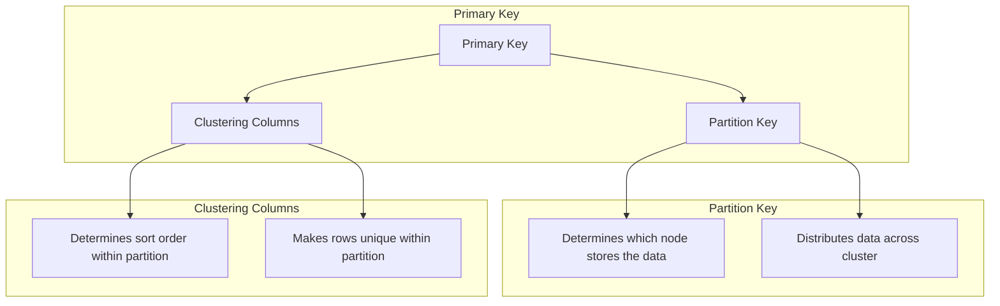
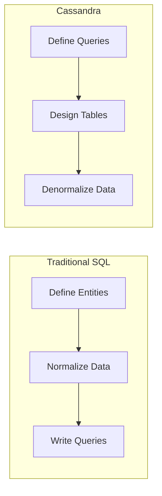
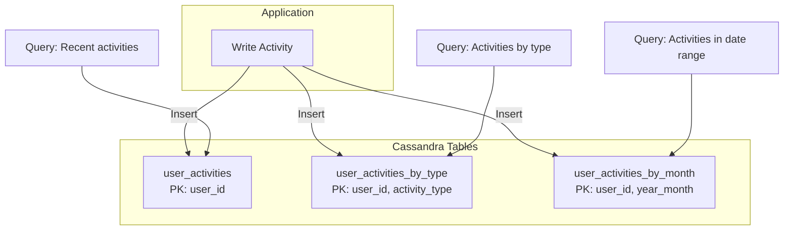
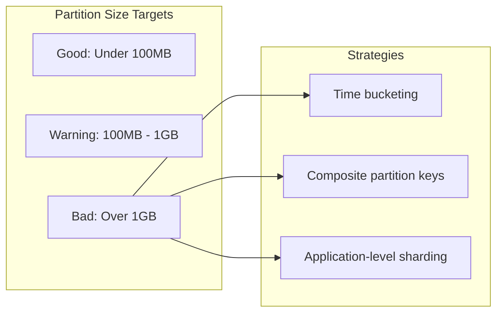
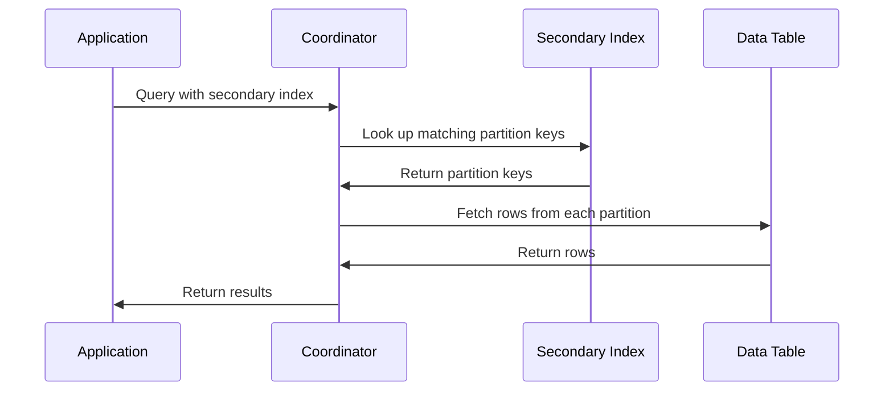

# How to Design Cassandra Data Models

Author: [nawazdhandala](https://www.github.com/nawazdhandala)

Tags: Cassandra, NoSQL, Data Modeling, Database Design, Distributed Systems

Description: Learn how to design effective Cassandra data models with partition keys, clustering columns, and query-driven design principles.

---

Cassandra is a distributed NoSQL database built for high availability and horizontal scalability. Unlike relational databases where you design schemas around entities and normalize data, Cassandra requires a fundamentally different approach. You design your data model around the queries your application needs to execute. This guide walks through the principles and patterns that lead to effective Cassandra data models.

## Understanding Cassandra's Storage Model

Before designing tables, you need to understand how Cassandra stores and retrieves data. The primary key is the foundation of every table design.



The primary key has two components:

- **Partition Key**: Determines which node in the cluster stores the row. All rows with the same partition key are stored together on the same node. This is critical for query performance.
- **Clustering Columns**: Define the sort order of rows within a partition and help make each row unique. You can query ranges of clustering columns efficiently.

## The Query-First Design Approach

In Cassandra, you start with the queries you need to support and work backward to design tables. This is the opposite of relational design where you normalize data first and figure out queries later.



Here is the process:

1. List all the queries your application needs
2. For each query, design a table that can answer it efficiently
3. Accept data duplication as normal and expected

## Example: Designing a User Activity System

Let us design a data model for a system that tracks user activity. The application needs to support these queries:

1. Get all activities for a user sorted by timestamp (most recent first)
2. Get activities for a user filtered by activity type
3. Get activities for a user within a date range

### Query 1: Activities by User

The first query needs all activities for a specific user. The user ID becomes the partition key so all activities for one user are stored together.

```cql
-- Table design for: Get all activities for a user
-- The partition key (user_id) groups all rows for a user on the same node
-- The clustering column (activity_timestamp) sorts rows within the partition

CREATE TABLE user_activities (
    user_id uuid,                    -- Partition key: groups data by user
    activity_timestamp timestamp,    -- Clustering column: sorts activities by time
    activity_type text,              -- Type of activity (login, purchase, etc.)
    activity_data text,              -- JSON or other serialized activity details
    device_info text,                -- Device that generated the activity
    ip_address text,                 -- IP address of the request
    PRIMARY KEY (user_id, activity_timestamp)
) WITH CLUSTERING ORDER BY (activity_timestamp DESC);
-- DESC ordering returns most recent activities first without extra sorting
```

This query is efficient because Cassandra reads data from a single partition:

```cql
-- Fetch the 20 most recent activities for a user
-- This hits a single partition and returns pre-sorted results
SELECT * FROM user_activities
WHERE user_id = 550e8400-e29b-41d4-a716-446655440000
LIMIT 20;
```

### Query 2: Activities by User and Type

The second query filters by activity type. You cannot efficiently filter on a non-key column in Cassandra, so you need a separate table with activity_type in the primary key.

```cql
-- Table design for: Get activities filtered by type
-- activity_type is now part of the primary key for efficient filtering
-- We use a composite partition key to keep partitions from growing unbounded

CREATE TABLE user_activities_by_type (
    user_id uuid,                    -- Part of partition key
    activity_type text,              -- Part of partition key: enables type filtering
    activity_timestamp timestamp,    -- Clustering column for time ordering
    activity_data text,
    device_info text,
    ip_address text,
    PRIMARY KEY ((user_id, activity_type), activity_timestamp)
    -- Double parentheses indicate composite partition key
) WITH CLUSTERING ORDER BY (activity_timestamp DESC);
```

Now you can query by type efficiently:

```cql
-- Fetch purchase activities for a user
-- The composite partition key (user_id, activity_type) is fully specified
SELECT * FROM user_activities_by_type
WHERE user_id = 550e8400-e29b-41d4-a716-446655440000
  AND activity_type = 'purchase'
LIMIT 50;
```

### Query 3: Activities Within a Date Range

For date range queries, you can use the clustering column with range operators. However, partitions can grow large over time. A common pattern is to bucket data by time periods.

```cql
-- Table design for: Get activities within a date range
-- year_month creates time-based buckets to limit partition size
-- Each bucket (user + month) stays manageable in size

CREATE TABLE user_activities_by_month (
    user_id uuid,                    -- Part of partition key
    year_month text,                 -- Part of partition key: '2026-01' format
    activity_timestamp timestamp,    -- Clustering column for range queries
    activity_type text,
    activity_data text,
    device_info text,
    ip_address text,
    PRIMARY KEY ((user_id, year_month), activity_timestamp)
) WITH CLUSTERING ORDER BY (activity_timestamp DESC);
```

Query a specific month:

```cql
-- Fetch activities for January 2026
SELECT * FROM user_activities_by_month
WHERE user_id = 550e8400-e29b-41d4-a716-446655440000
  AND year_month = '2026-01'
  AND activity_timestamp >= '2026-01-15 00:00:00'
  AND activity_timestamp < '2026-01-20 00:00:00';
```

For queries spanning multiple months, your application issues parallel queries for each month:

```java
// Java example: Query across multiple months in parallel
// Cassandra excels at parallel reads across partitions

public List<Activity> getActivitiesInRange(UUID userId,
                                            LocalDate start,
                                            LocalDate end) {
    // Generate list of year-month buckets to query
    List<String> months = new ArrayList<>();
    YearMonth current = YearMonth.from(start);
    YearMonth endMonth = YearMonth.from(end);

    while (!current.isAfter(endMonth)) {
        months.add(current.toString()); // Formats as "2026-01"
        current = current.plusMonths(1);
    }

    // Execute queries in parallel using async driver methods
    List<CompletableFuture<List<Activity>>> futures = months.stream()
        .map(month -> queryMonthAsync(userId, month, start, end))
        .collect(Collectors.toList());

    // Combine results from all partitions
    return futures.stream()
        .map(CompletableFuture::join)
        .flatMap(List::stream)
        .sorted(Comparator.comparing(Activity::getTimestamp).reversed())
        .collect(Collectors.toList());
}
```

## Data Model Visualization

Here is how data flows through the different tables:



## Managing Data Duplication

Writing to multiple tables is a core Cassandra pattern. You can maintain consistency using batch statements for tables with the same partition key, or use application-level logic for different partitions.

```cql
-- Batch insert when tables share the same partition key structure
-- Batches are atomic within a single partition

BEGIN BATCH
    INSERT INTO user_activities (
        user_id, activity_timestamp, activity_type, activity_data, device_info, ip_address
    ) VALUES (
        550e8400-e29b-41d4-a716-446655440000,
        '2026-01-26 10:30:00',
        'purchase',
        '{"item_id": "ABC123", "amount": 99.99}',
        'iPhone 15 Pro',
        '192.168.1.100'
    );

    INSERT INTO user_activities_by_type (
        user_id, activity_type, activity_timestamp, activity_data, device_info, ip_address
    ) VALUES (
        550e8400-e29b-41d4-a716-446655440000,
        'purchase',
        '2026-01-26 10:30:00',
        '{"item_id": "ABC123", "amount": 99.99}',
        'iPhone 15 Pro',
        '192.168.1.100'
    );

    INSERT INTO user_activities_by_month (
        user_id, year_month, activity_timestamp, activity_type, activity_data, device_info, ip_address
    ) VALUES (
        550e8400-e29b-41d4-a716-446655440000,
        '2026-01',
        '2026-01-26 10:30:00',
        'purchase',
        '{"item_id": "ABC123", "amount": 99.99}',
        'iPhone 15 Pro',
        '192.168.1.100'
    );
APPLY BATCH;
```

For high-throughput applications, consider using logged batches sparingly. They add coordination overhead. Unlogged batches or individual writes are often faster when atomicity is not required.

## Partition Sizing Guidelines

Partitions that grow too large cause performance problems. Follow these guidelines:



### Estimating Partition Size

Calculate your expected partition size before deploying:

```python
# Python script to estimate partition size

def estimate_partition_size(
    rows_per_partition: int,
    avg_row_size_bytes: int,
    clustering_columns: int,
    column_count: int
) -> dict:
    """
    Estimate the size of a Cassandra partition.

    Args:
        rows_per_partition: Expected number of rows in one partition
        avg_row_size_bytes: Average size of data columns per row
        clustering_columns: Number of clustering columns
        column_count: Total number of non-key columns

    Returns:
        Dictionary with size estimates
    """
    # Overhead per row (approximately 23 bytes for metadata)
    row_overhead = 23

    # Cell overhead per column (approximately 15 bytes)
    cell_overhead = 15 * column_count

    # Total size per row
    row_size = row_overhead + cell_overhead + avg_row_size_bytes

    # Partition overhead (approximately 20 bytes)
    partition_overhead = 20

    # Total partition size
    total_size = partition_overhead + (rows_per_partition * row_size)

    return {
        'row_size_bytes': row_size,
        'partition_size_bytes': total_size,
        'partition_size_mb': total_size / (1024 * 1024),
        'recommendation': 'OK' if total_size < 100_000_000 else 'Consider splitting'
    }

# Example: User activities table
# 1000 activities per user per month, 500 bytes average per activity
estimate = estimate_partition_size(
    rows_per_partition=1000,
    avg_row_size_bytes=500,
    clustering_columns=1,
    column_count=5
)

print(f"Estimated partition size: {estimate['partition_size_mb']:.2f} MB")
print(f"Recommendation: {estimate['recommendation']}")
```

## Common Anti-Patterns to Avoid

### Anti-Pattern 1: Using ALLOW FILTERING

The ALLOW FILTERING clause lets you query columns not in the primary key, but it scans all partitions. This is a performance disaster at scale.

```cql
-- BAD: This query scans all partitions
-- Never use ALLOW FILTERING in production code
SELECT * FROM user_activities
WHERE activity_type = 'purchase'
ALLOW FILTERING;

-- GOOD: Design a table that supports the query directly
SELECT * FROM user_activities_by_type
WHERE user_id = ? AND activity_type = 'purchase';
```

### Anti-Pattern 2: Too Many Clustering Columns

Adding too many clustering columns makes writes expensive and queries inflexible.

```cql
-- BAD: Four clustering columns create deep nesting
CREATE TABLE over_clustered (
    user_id uuid,
    year int,
    month int,
    day int,
    hour int,
    activity_data text,
    PRIMARY KEY (user_id, year, month, day, hour)
);

-- Queries must specify all preceding clustering columns
-- This query fails because 'month' is not specified:
SELECT * FROM over_clustered WHERE user_id = ? AND year = 2026 AND day = 26;
-- Error: PRIMARY KEY column "month" cannot be restricted as preceding column "day" is not restricted

-- GOOD: Use composite values to reduce clustering depth
CREATE TABLE time_bucketed (
    user_id uuid,
    date text,                       -- '2026-01-26' format
    activity_timestamp timestamp,
    activity_data text,
    PRIMARY KEY (user_id, date, activity_timestamp)
);
```

### Anti-Pattern 3: Using Collections for Large Data

Collections (lists, sets, maps) are read entirely into memory. They should be small.

```cql
-- BAD: Storing thousands of items in a collection
CREATE TABLE user_with_huge_list (
    user_id uuid PRIMARY KEY,
    all_activities list<text>        -- Grows unbounded, loaded entirely on read
);

-- GOOD: Use a separate table with clustering columns
CREATE TABLE user_activities_proper (
    user_id uuid,
    activity_timestamp timestamp,
    activity_data text,
    PRIMARY KEY (user_id, activity_timestamp)
);
```

## Secondary Indexes: Use With Caution

Cassandra supports secondary indexes, but they have significant limitations. They work by creating a hidden table that maps indexed values to partition keys, then looking up the original table.



Secondary indexes are acceptable when:
- The indexed column has moderate cardinality (hundreds to thousands of unique values)
- Queries always include the partition key
- The query is not latency-sensitive

```cql
-- Creating a secondary index
-- Only appropriate for low-cardinality columns queried with partition key
CREATE INDEX ON user_activities (activity_type);

-- Acceptable: Index query with partition key
SELECT * FROM user_activities
WHERE user_id = 550e8400-e29b-41d4-a716-446655440000
  AND activity_type = 'login';

-- Avoid: Index-only query hits all nodes
SELECT * FROM user_activities
WHERE activity_type = 'login';
-- This requires contacting every node in the cluster
```

For most use cases, a denormalized table is a better choice than a secondary index.

## Time Series Data Patterns

Time series data is a natural fit for Cassandra. Here is a pattern for high-volume metrics:

```cql
-- Metrics table with time-based bucketing
-- Each bucket contains one hour of data for one metric

CREATE TABLE metrics (
    metric_name text,                -- Name of the metric (e.g., 'cpu_usage')
    bucket timestamp,                -- Truncated to hour: '2026-01-26 10:00:00'
    recorded_at timestamp,           -- Exact measurement time
    value double,                    -- Metric value
    tags map<text, text>,            -- Additional dimensions
    PRIMARY KEY ((metric_name, bucket), recorded_at)
) WITH CLUSTERING ORDER BY (recorded_at DESC)
  AND default_time_to_live = 2592000;  -- Auto-delete after 30 days (in seconds)
```

Writing metrics:

```java
// Java example: Writing time series metrics
// Demonstrates bucket calculation and prepared statements

public class MetricsWriter {
    private final CqlSession session;
    private final PreparedStatement insertStmt;

    public MetricsWriter(CqlSession session) {
        this.session = session;
        // Prepare statement once, reuse for all writes
        this.insertStmt = session.prepare(
            "INSERT INTO metrics (metric_name, bucket, recorded_at, value, tags) " +
            "VALUES (?, ?, ?, ?, ?)"
        );
    }

    public void recordMetric(String metricName,
                             Instant timestamp,
                             double value,
                             Map<String, String> tags) {
        // Calculate the hour bucket for this timestamp
        // Truncates to the start of the hour
        Instant bucket = timestamp.truncatedTo(ChronoUnit.HOURS);

        // Execute the insert with bound parameters
        session.execute(insertStmt.bind(
            metricName,
            bucket,
            timestamp,
            value,
            tags
        ));
    }

    public void recordMetricAsync(String metricName,
                                   Instant timestamp,
                                   double value,
                                   Map<String, String> tags) {
        Instant bucket = timestamp.truncatedTo(ChronoUnit.HOURS);

        // Async execution for high-throughput scenarios
        // Returns immediately, write happens in background
        session.executeAsync(insertStmt.bind(
            metricName,
            bucket,
            timestamp,
            value,
            tags
        ));
    }
}
```

Querying metrics:

```java
// Query metrics for the last 6 hours
public List<Metric> getRecentMetrics(String metricName, int hours) {
    Instant now = Instant.now();
    List<Instant> buckets = new ArrayList<>();

    // Generate list of hourly buckets to query
    for (int i = 0; i < hours; i++) {
        buckets.add(now.minus(i, ChronoUnit.HOURS).truncatedTo(ChronoUnit.HOURS));
    }

    // Query each bucket in parallel
    List<CompletableFuture<AsyncResultSet>> futures = buckets.stream()
        .map(bucket -> session.executeAsync(
            SimpleStatement.newInstance(
                "SELECT * FROM metrics WHERE metric_name = ? AND bucket = ?",
                metricName,
                bucket
            )
        ).toCompletableFuture())
        .collect(Collectors.toList());

    // Combine and return results
    return futures.stream()
        .map(CompletableFuture::join)
        .flatMap(rs -> StreamSupport.stream(rs.currentPage().spliterator(), false))
        .map(this::rowToMetric)
        .collect(Collectors.toList());
}
```

## Summary

Effective Cassandra data modeling follows these principles:

1. **Start with queries**: Design tables to answer specific queries efficiently
2. **Embrace denormalization**: Data duplication is expected and necessary
3. **Choose partition keys carefully**: They determine data distribution and query capabilities
4. **Use clustering columns for sorting**: They enable range queries within partitions
5. **Keep partitions bounded**: Use time buckets or composite keys to limit partition growth
6. **Avoid ALLOW FILTERING**: If you need it, you need a different table design
7. **Test with realistic data volumes**: Partition size problems only appear at scale

Cassandra rewards careful upfront design. Spend time understanding your query patterns before creating tables. The investment pays off with predictable performance as your data grows to billions of rows across hundreds of nodes.
