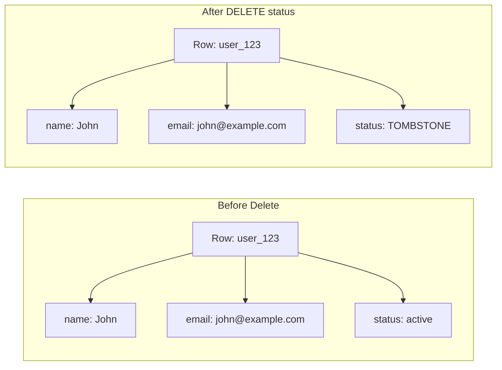
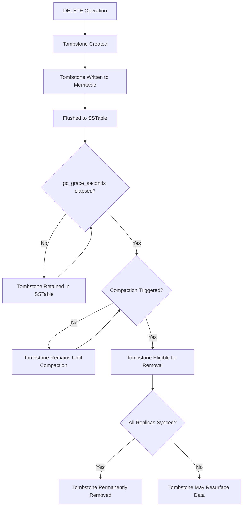
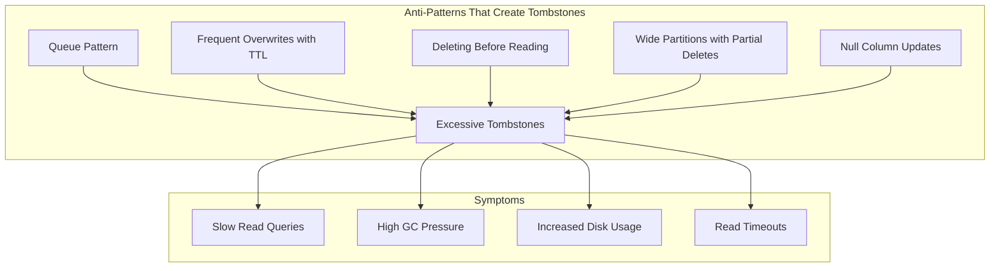
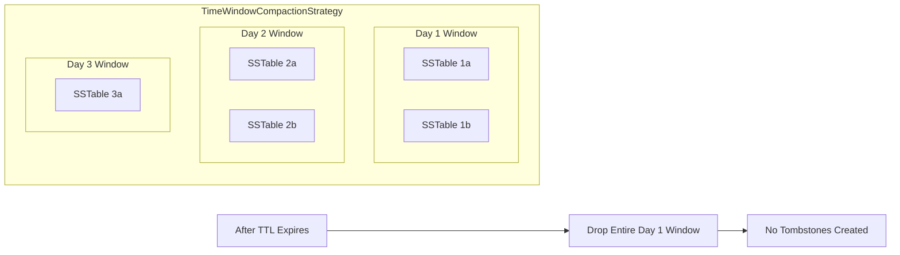

# How to Handle Tombstones in Cassandra

Author: [nawazdhandala](https://github.com/nawazdhandala)

Tags: Cassandra, Database, NoSQL, Performance, Data Management, Distributed Systems, DevOps

Description: Learn how to identify, manage, and prevent tombstone accumulation in Apache Cassandra to maintain optimal query performance and cluster health.

---

Tombstones are Cassandra's way of marking data as deleted. Unlike traditional databases that remove data immediately, Cassandra writes a deletion marker called a tombstone. This design enables Cassandra's distributed architecture to propagate deletes across nodes, but accumulated tombstones can severely degrade read performance. This guide covers practical strategies for detecting and managing tombstones in production.

## What Are Tombstones?

When you delete data in Cassandra, the data is not immediately removed. Instead, Cassandra writes a special marker called a tombstone that indicates the data should be treated as deleted. Tombstones exist because Cassandra is a distributed database where data is replicated across multiple nodes. If data were simply removed from one node, other replicas might still have the old value and reintroduce it during read repair or anti-entropy operations.



## Types of Tombstones

Cassandra creates different tombstone types depending on what you delete.

### Cell Tombstone

Created when you delete or update a single column to null.

```cql
-- Delete a single column
UPDATE users SET email = null WHERE user_id = 'user_123';

-- Or using DELETE
DELETE email FROM users WHERE user_id = 'user_123';
```

### Row Tombstone

Created when you delete an entire row.

```cql
-- This creates a row tombstone
DELETE FROM users WHERE user_id = 'user_123';
```

### Range Tombstone

Created when you delete a range of clustering columns.

```cql
-- Table with clustering key
CREATE TABLE events (
    user_id text,
    event_date date,
    event_time timestamp,
    event_type text,
    data text,
    PRIMARY KEY ((user_id), event_date, event_time)
) WITH CLUSTERING ORDER BY (event_date DESC, event_time DESC);

-- Delete all events for a specific date - creates a range tombstone
DELETE FROM events
WHERE user_id = 'user_123'
AND event_date = '2026-01-15';
```

### Partition Tombstone

Created when you delete an entire partition.

```cql
-- Delete entire partition
DELETE FROM events WHERE user_id = 'user_123';
```

### TTL Tombstone

Created automatically when data with a TTL (Time To Live) expires.

```cql
-- Insert with 7-day TTL
INSERT INTO sessions (session_id, user_id, data)
VALUES ('sess_abc', 'user_123', '{"cart": []}')
USING TTL 604800;

-- After 7 days, this becomes a tombstone
```

## The Tombstone Lifecycle

Tombstones follow a specific lifecycle in Cassandra before they are permanently removed.



The key setting is `gc_grace_seconds`, which defaults to 10 days (864000 seconds). This grace period ensures all replicas have received the delete before the tombstone is purged.

## Detecting Tombstone Problems

### Query Tracing

Enable tracing to see tombstone counts in your queries.

```cql
-- Enable tracing
TRACING ON;

-- Run your query
SELECT * FROM events
WHERE user_id = 'user_123'
AND event_date > '2026-01-01';

-- Output will include lines like:
-- Read 1247 live rows and 89432 tombstone cells
```

### CQL Query with Tombstone Limit

Cassandra has built-in protection against runaway tombstone scans.

```yaml
# In cassandra.yaml
# Warn when query scans this many tombstones
tombstone_warn_threshold: 1000

# Fail query when this many tombstones are scanned
tombstone_failure_threshold: 100000
```

When limits are exceeded, you will see errors like this:

```
ReadFailureException: Operation timed out - received 0 responses
Caused by: TombstoneOverwhelmingException:
  Scanned over 100000 tombstones during query
```

### Using nodetool

Check tombstone statistics with nodetool commands.

```bash
# View SSTable metadata including tombstone count
nodetool tablestats keyspace_name.table_name

# Sample output includes:
# Local read latency: 2.145 ms
# Local write latency: 0.089 ms
# Pending flushes: 0
# Percent repaired: 85.3%
# Bloom filter false positives: 234
# Bloom filter false ratio: 0.00012
# SSTable count: 47
# Space used (live): 12.5 GB
# Space used (total): 14.2 GB
# Compaction pending: 3
# Droppable tombstone ratio: 0.42  <-- High ratio indicates tombstone buildup

# View per-SSTable tombstone data
nodetool cfstats keyspace_name.table_name -H
```

### SSTable Metadata Analysis

Use sstablemetadata to inspect individual SSTables for tombstone counts.

```bash
# Navigate to Cassandra data directory
cd /var/lib/cassandra/data/keyspace_name/table_name-uuid/

# Analyze a specific SSTable
sstablemetadata mc-123-big-Data.db

# Look for these fields in output:
# Estimated tombstone drop times:
#   1706313600: 45231    <-- timestamp: tombstone count
#   1706400000: 23156
# This shows when tombstones become eligible for removal
```

### Custom Monitoring Query

This Python script scans for high-tombstone partitions by sampling data.

```python
#!/usr/bin/env python3
"""
Tombstone detection script for Cassandra.
Samples partitions and identifies those with high tombstone ratios
by comparing expected vs actual row counts after filtering.
"""

from cassandra.cluster import Cluster
from cassandra.query import SimpleStatement
import logging

logging.basicConfig(level=logging.INFO)
logger = logging.getLogger(__name__)

def analyze_tombstones(keyspace, table, partition_key_column, sample_keys):
    """
    Analyze tombstone presence in specific partitions.

    Args:
        keyspace: Target keyspace name
        table: Target table name
        partition_key_column: Name of partition key column
        sample_keys: List of partition key values to analyze
    """
    cluster = Cluster(['cassandra-node1', 'cassandra-node2'])
    session = cluster.connect(keyspace)

    # Enable tracing to capture tombstone metrics
    results = []

    for key in sample_keys:
        query = SimpleStatement(
            f"SELECT * FROM {table} WHERE {partition_key_column} = %s",
            fetch_size=1000
        )

        # Execute with tracing enabled
        trace = session.execute(query, [key], trace=True).get_query_trace()

        # Parse trace events for tombstone information
        tombstone_count = 0
        live_rows = 0

        for event in trace.events:
            desc = event.description.lower()
            # Look for tombstone mentions in trace events
            if 'tombstone' in desc:
                # Extract count from messages like "Read 500 live rows and 1234 tombstone cells"
                parts = desc.split()
                for i, part in enumerate(parts):
                    if part == 'tombstone':
                        try:
                            tombstone_count = int(parts[i - 1])
                        except (ValueError, IndexError):
                            pass
                    if part == 'live':
                        try:
                            live_rows = int(parts[i - 1])
                        except (ValueError, IndexError):
                            pass

        ratio = tombstone_count / (live_rows + 1) if live_rows else tombstone_count

        results.append({
            'partition_key': key,
            'live_rows': live_rows,
            'tombstones': tombstone_count,
            'ratio': ratio
        })

        if ratio > 1.0:
            logger.warning(
                f"High tombstone ratio detected in partition {key}: "
                f"{tombstone_count} tombstones vs {live_rows} live rows"
            )

    cluster.shutdown()
    return results


def find_problematic_partitions(keyspace, table, threshold_ratio=0.5):
    """
    Sample random partitions to find those with tombstone issues.
    Uses system tracing to estimate tombstone density.
    """
    cluster = Cluster(['cassandra-node1'])
    session = cluster.connect(keyspace)

    # Get sample partition keys using token ranges
    # This approach samples across the entire cluster
    token_query = f"""
        SELECT DISTINCT token({get_partition_key(session, keyspace, table)}) as tok
        FROM {table}
        LIMIT 100
    """

    sample_tokens = session.execute(token_query)

    problematic = []

    for row in sample_tokens:
        # Query each partition with tracing
        # Analysis logic similar to above
        pass

    cluster.shutdown()
    return problematic


def get_partition_key(session, keyspace, table):
    """
    Retrieve partition key column names from system schema.
    """
    query = """
        SELECT column_name
        FROM system_schema.columns
        WHERE keyspace_name = %s
        AND table_name = %s
        AND kind = 'partition_key'
    """

    rows = session.execute(query, [keyspace, table])
    return ', '.join(row.column_name for row in rows)


if __name__ == '__main__':
    # Example usage: analyze specific user partitions
    results = analyze_tombstones(
        keyspace='production',
        table='user_events',
        partition_key_column='user_id',
        sample_keys=['user_001', 'user_002', 'user_003']
    )

    for r in sorted(results, key=lambda x: x['ratio'], reverse=True):
        print(f"Partition {r['partition_key']}: "
              f"{r['tombstones']} tombstones, {r['live_rows']} live rows, "
              f"ratio: {r['ratio']:.2f}")
```

## Common Causes of Tombstone Accumulation

Understanding why tombstones accumulate helps you prevent problems before they occur.



### Anti-Pattern 1: Using Cassandra as a Queue

The queue anti-pattern creates massive tombstone accumulation because rows are continuously inserted and then deleted after processing.

```cql
-- BAD: Queue-like table design
CREATE TABLE job_queue (
    queue_name text,
    job_id timeuuid,
    payload text,
    PRIMARY KEY ((queue_name), job_id)
);

-- Constant insert/delete cycle creates tombstones
INSERT INTO job_queue (queue_name, job_id, payload)
VALUES ('emails', now(), '{"to": "user@example.com"}');

-- After processing, delete creates tombstone
DELETE FROM job_queue
WHERE queue_name = 'emails'
AND job_id = 12345678-1234-1234-1234-123456789abc;

-- Over time, millions of tombstones accumulate in 'emails' partition
```

### Anti-Pattern 2: Wide Partitions with Deletes

When partitions grow wide and you delete ranges, range tombstones span large portions of the data.

```cql
-- Table that can grow unbounded
CREATE TABLE sensor_readings (
    sensor_id text,
    reading_time timestamp,
    value double,
    PRIMARY KEY ((sensor_id), reading_time)
);

-- If you delete old readings periodically
DELETE FROM sensor_readings
WHERE sensor_id = 'sensor_001'
AND reading_time < '2026-01-01';

-- Creates range tombstone that affects all queries on this partition
```

### Anti-Pattern 3: Inserting Nulls

In Cassandra, inserting a null value is equivalent to a delete and creates a tombstone.

```cql
-- BAD: Inserting nulls creates tombstones
INSERT INTO users (user_id, name, email, phone)
VALUES ('user_123', 'John', 'john@example.com', null);
-- The phone column now has a tombstone

-- BETTER: Omit null columns entirely
INSERT INTO users (user_id, name, email)
VALUES ('user_123', 'John', 'john@example.com');
```

## Strategies for Managing Tombstones

### Strategy 1: Adjust gc_grace_seconds

Lower gc_grace_seconds to remove tombstones faster, but be careful with consistency.

```cql
-- Reduce gc_grace_seconds for tables with heavy deletes
-- Default is 864000 (10 days)
ALTER TABLE events
WITH gc_grace_seconds = 86400;  -- 1 day

-- WARNING: Only safe if:
-- 1. You run regular repairs (more frequently than gc_grace_seconds)
-- 2. All nodes are consistently available
-- 3. You understand the risk of zombie data resurrection
```

### Strategy 2: Time-Windowed Compaction

Use TimeWindowCompactionStrategy (TWCS) for time-series data with TTLs. This strategy groups data by time windows, allowing entire SSTables to be dropped when all data expires.

```cql
-- Create table with TWCS
CREATE TABLE metrics (
    metric_name text,
    bucket timestamp,
    collected_at timestamp,
    value double,
    PRIMARY KEY ((metric_name, bucket), collected_at)
) WITH CLUSTERING ORDER BY (collected_at DESC)
AND compaction = {
    'class': 'TimeWindowCompactionStrategy',
    'compaction_window_unit': 'DAYS',
    'compaction_window_size': 1
}
AND default_time_to_live = 604800;  -- 7 days

-- With TWCS, entire SSTables are dropped after TTL
-- No tombstones needed when all data in a window expires
```



### Strategy 3: Partition Design to Isolate Deletes

Design your data model so deletes affect isolated partitions that can be entirely dropped.

```cql
-- BAD: Single partition accumulates tombstones
CREATE TABLE user_sessions_bad (
    user_id text,
    session_id text,
    created_at timestamp,
    data text,
    PRIMARY KEY ((user_id), session_id)
);

-- BETTER: Bucket by time so old buckets can be dropped entirely
CREATE TABLE user_sessions_good (
    user_id text,
    day date,
    session_id text,
    created_at timestamp,
    data text,
    PRIMARY KEY ((user_id, day), session_id)
) WITH default_time_to_live = 604800;

-- When querying, specify the time bucket
SELECT * FROM user_sessions_good
WHERE user_id = 'user_123'
AND day = '2026-01-26';

-- Old days automatically expire without tombstone accumulation
-- Entire partitions are dropped, not individual rows
```

### Strategy 4: Force Compaction

Manually trigger compaction to remove eligible tombstones.

```bash
# Force major compaction on a table
# WARNING: Major compaction is resource-intensive and can cause
# significant disk I/O and temporary disk space usage
nodetool compact keyspace_name table_name

# Force compaction with specific SSTables
nodetool compact keyspace_name table_name -s

# Check compaction status
nodetool compactionstats

# If using STCS or LCS, consider user-defined compaction
# to target specific SSTables with high tombstone ratios
nodetool garbagecollect keyspace_name table_name
```

### Strategy 5: Use TRUNCATE for Bulk Deletes

When deleting all data in a table, TRUNCATE is more efficient than DELETE.

```cql
-- BAD: Creates a tombstone for every row
DELETE FROM temp_processing_table;

-- GOOD: Drops SSTables directly, no tombstones
TRUNCATE temp_processing_table;

-- For partition-level bulk delete, consider dropping and recreating
-- if the entire partition should be removed
```

## Application-Level Strategies

### Soft Deletes Instead of Hard Deletes

Mark records as deleted in application logic instead of using Cassandra DELETE.

```python
"""
Soft delete pattern for Cassandra.
Instead of DELETE operations, mark records as inactive.
Query filters exclude inactive records.
"""

from cassandra.cluster import Cluster
from datetime import datetime

class UserRepository:
    def __init__(self, session):
        self.session = session

        # Prepare statements for better performance
        self.insert_stmt = session.prepare("""
            INSERT INTO users (user_id, name, email, is_active, deleted_at)
            VALUES (?, ?, ?, ?, ?)
        """)

        self.soft_delete_stmt = session.prepare("""
            UPDATE users
            SET is_active = false, deleted_at = ?
            WHERE user_id = ?
        """)

        self.get_active_stmt = session.prepare("""
            SELECT * FROM users
            WHERE user_id = ? AND is_active = true
            ALLOW FILTERING
        """)

    def create_user(self, user_id, name, email):
        """Create a new active user."""
        self.session.execute(
            self.insert_stmt,
            [user_id, name, email, True, None]
        )

    def delete_user(self, user_id):
        """
        Soft delete: mark as inactive instead of DELETE.
        No tombstones created.
        """
        self.session.execute(
            self.soft_delete_stmt,
            [datetime.utcnow(), user_id]
        )

    def get_user(self, user_id):
        """Get user only if active."""
        result = self.session.execute(
            self.get_active_stmt,
            [user_id]
        )
        return result.one()

    def hard_delete_inactive_users(self, older_than_days=90):
        """
        Periodically clean up inactive users that are older than threshold.
        Run during low-traffic periods.
        Batches deletes to avoid overwhelming the cluster.
        """
        cutoff = datetime.utcnow() - timedelta(days=older_than_days)

        # Find inactive users older than cutoff
        query = """
            SELECT user_id FROM users
            WHERE is_active = false
            AND deleted_at < %s
            ALLOW FILTERING
        """

        inactive_users = self.session.execute(query, [cutoff])

        delete_stmt = self.session.prepare(
            "DELETE FROM users WHERE user_id = ?"
        )

        batch_size = 100
        batch = []

        for row in inactive_users:
            batch.append(row.user_id)

            if len(batch) >= batch_size:
                self._delete_batch(delete_stmt, batch)
                batch = []
                # Sleep between batches to reduce cluster load
                time.sleep(0.1)

        if batch:
            self._delete_batch(delete_stmt, batch)

    def _delete_batch(self, stmt, user_ids):
        """Delete a batch of users."""
        for user_id in user_ids:
            self.session.execute(stmt, [user_id])
```

### Queue Pattern with Time Buckets

If you must use Cassandra for queue-like workloads, use time buckets to isolate tombstones.

```python
"""
Time-bucketed queue pattern for Cassandra.
Isolates tombstones to time-based partitions that can be dropped entirely.
"""

from cassandra.cluster import Cluster
from cassandra.query import BatchStatement
from datetime import datetime, timedelta
import uuid

class TimeWindowedQueue:
    """
    Queue implementation that uses time windows to prevent tombstone buildup.

    Table schema:
    CREATE TABLE job_queue (
        queue_name text,
        window_start timestamp,
        job_id timeuuid,
        payload text,
        processed boolean,
        PRIMARY KEY ((queue_name, window_start), job_id)
    ) WITH CLUSTERING ORDER BY (job_id ASC)
    AND default_time_to_live = 86400;  -- 1 day TTL
    """

    def __init__(self, session, window_size_minutes=60):
        self.session = session
        self.window_size = timedelta(minutes=window_size_minutes)

        self.enqueue_stmt = session.prepare("""
            INSERT INTO job_queue (queue_name, window_start, job_id, payload, processed)
            VALUES (?, ?, ?, ?, false)
        """)

        self.mark_processed_stmt = session.prepare("""
            UPDATE job_queue
            SET processed = true
            WHERE queue_name = ? AND window_start = ? AND job_id = ?
        """)

        self.get_pending_stmt = session.prepare("""
            SELECT job_id, payload
            FROM job_queue
            WHERE queue_name = ?
            AND window_start = ?
            AND processed = false
            ALLOW FILTERING
        """)

    def _get_window_start(self, timestamp=None):
        """
        Calculate the window start time for a given timestamp.
        Windows are aligned to the hour for predictable partition boundaries.
        """
        if timestamp is None:
            timestamp = datetime.utcnow()

        # Round down to nearest window
        minutes = (timestamp.minute // (self.window_size.seconds // 60)) * (self.window_size.seconds // 60)
        return timestamp.replace(minute=minutes, second=0, microsecond=0)

    def enqueue(self, queue_name, payload):
        """
        Add job to queue in current time window.
        Jobs are partitioned by (queue_name, window_start) to isolate tombstones.
        """
        window = self._get_window_start()
        job_id = uuid.uuid1()  # Time-based UUID for ordering

        self.session.execute(
            self.enqueue_stmt,
            [queue_name, window, job_id, payload]
        )

        return job_id

    def process_window(self, queue_name, window_start, processor_fn):
        """
        Process all pending jobs in a specific time window.

        Instead of deleting processed jobs, we mark them processed.
        The entire partition expires via TTL, avoiding tombstones.
        """
        pending = self.session.execute(
            self.get_pending_stmt,
            [queue_name, window_start]
        )

        for row in pending:
            try:
                processor_fn(row.payload)

                # Mark as processed instead of deleting
                self.session.execute(
                    self.mark_processed_stmt,
                    [queue_name, window_start, row.job_id]
                )
            except Exception as e:
                # Log error, job will be retried
                print(f"Failed to process job {row.job_id}: {e}")

    def get_active_windows(self, queue_name, lookback_hours=24):
        """
        Get list of time windows that may have pending jobs.
        Used by worker to know which partitions to poll.
        """
        windows = []
        current = self._get_window_start()

        for i in range(int(lookback_hours * 60 / (self.window_size.seconds / 60))):
            windows.append(current - (self.window_size * i))

        return windows


# Example usage
def main():
    cluster = Cluster(['cassandra-node1'])
    session = cluster.connect('queue_keyspace')

    queue = TimeWindowedQueue(session, window_size_minutes=60)

    # Producer: enqueue jobs
    job_id = queue.enqueue('email_notifications', '{"to": "user@example.com"}')
    print(f"Enqueued job: {job_id}")

    # Consumer: process jobs from active windows
    def send_email(payload):
        data = json.loads(payload)
        print(f"Sending email to {data['to']}")

    for window in queue.get_active_windows('email_notifications', lookback_hours=2):
        queue.process_window('email_notifications', window, send_email)

    cluster.shutdown()
```

## Monitoring and Alerting

Set up monitoring to catch tombstone issues before they impact users.

```yaml
# Prometheus alerting rules for Cassandra tombstone issues
groups:
  - name: cassandra_tombstones
    rules:
      # Alert when tombstone ratio is high
      - alert: CassandraHighTombstoneRatio
        expr: cassandra_table_droppable_tombstone_ratio > 0.3
        for: 30m
        labels:
          severity: warning
        annotations:
          summary: "High tombstone ratio on {{ $labels.table }}"
          description: "Table {{ $labels.keyspace }}.{{ $labels.table }} has tombstone ratio of {{ $value }}"

      # Alert when queries are scanning too many tombstones
      - alert: CassandraTombstoneScanWarning
        expr: rate(cassandra_client_request_tombstones_scanned_total[5m]) > 10000
        for: 10m
        labels:
          severity: warning
        annotations:
          summary: "Excessive tombstone scanning detected"
          description: "Queries are scanning {{ $value }} tombstones per second"

      # Alert on tombstone-related read failures
      - alert: CassandraTombstoneReadFailures
        expr: rate(cassandra_client_request_failures_total{reason="tombstone"}[5m]) > 0
        for: 5m
        labels:
          severity: critical
        annotations:
          summary: "Read failures due to tombstones"
          description: "Queries failing due to tombstone threshold exceeded"
```

```python
"""
Custom metrics exporter for Cassandra tombstone monitoring.
Collects tombstone metrics from JMX and exposes to Prometheus.
"""

from prometheus_client import start_http_server, Gauge
import subprocess
import re
import time

# Define Prometheus metrics
tombstone_ratio = Gauge(
    'cassandra_table_droppable_tombstone_ratio',
    'Ratio of droppable tombstones in table',
    ['keyspace', 'table']
)

tombstone_scanned = Gauge(
    'cassandra_table_tombstones_scanned_per_read',
    'Average tombstones scanned per read',
    ['keyspace', 'table']
)

def collect_tombstone_metrics():
    """
    Collect tombstone metrics using nodetool.
    In production, consider using JMX directly for efficiency.
    """
    # Get table stats for all tables
    result = subprocess.run(
        ['nodetool', 'tablestats'],
        capture_output=True,
        text=True
    )

    current_keyspace = None
    current_table = None

    for line in result.stdout.split('\n'):
        # Parse keyspace
        if line.startswith('Keyspace:'):
            current_keyspace = line.split(':')[1].strip()

        # Parse table
        elif line.strip().startswith('Table:'):
            current_table = line.split(':')[1].strip()

        # Parse droppable tombstone ratio
        elif 'Droppable tombstone ratio' in line:
            match = re.search(r'(\d+\.?\d*)', line)
            if match and current_keyspace and current_table:
                ratio = float(match.group(1))
                tombstone_ratio.labels(
                    keyspace=current_keyspace,
                    table=current_table
                ).set(ratio)

def main():
    # Start Prometheus metrics server
    start_http_server(9500)
    print("Metrics server started on port 9500")

    while True:
        collect_tombstone_metrics()
        time.sleep(60)  # Collect every minute

if __name__ == '__main__':
    main()
```

## Best Practices Summary

| Practice | Benefit | When to Apply |
|----------|---------|---------------|
| Use TWCS for time-series | Entire SSTables dropped, no tombstones | Tables with TTL-based expiry |
| Partition by time bucket | Isolate tombstones to droppable partitions | Queue-like or append-heavy tables |
| Soft deletes | No DELETE operations | User-facing data with audit requirements |
| Lower gc_grace_seconds | Faster tombstone cleanup | Tables with heavy deletes and reliable repairs |
| Avoid nulls in INSERT | Prevent accidental tombstones | All INSERT operations |
| Monitor tombstone ratio | Catch issues early | All production tables |
| Regular repairs | Enable safe gc_grace reduction | Entire cluster |

## Conclusion

Tombstones are a necessary feature of Cassandra's distributed architecture, but they require careful management. The key strategies are:

1. Design your data model to minimize deletes or isolate them to droppable partitions
2. Use TWCS and TTLs instead of DELETE when possible
3. Monitor tombstone metrics and set up alerts
4. Run regular repairs to safely reduce gc_grace_seconds
5. Consider soft deletes at the application level

By understanding how tombstones work and following these practices, you can maintain excellent read performance even in write-heavy workloads that involve data expiration.
