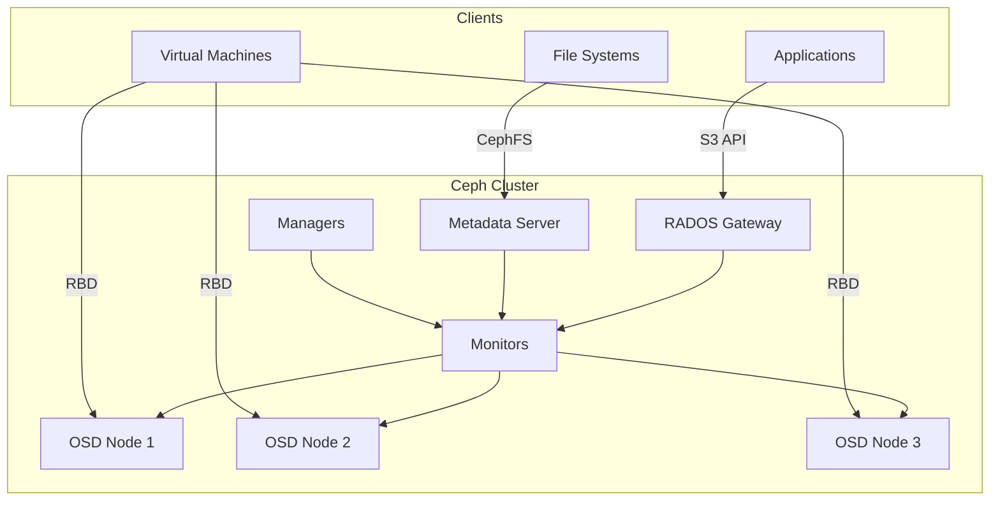
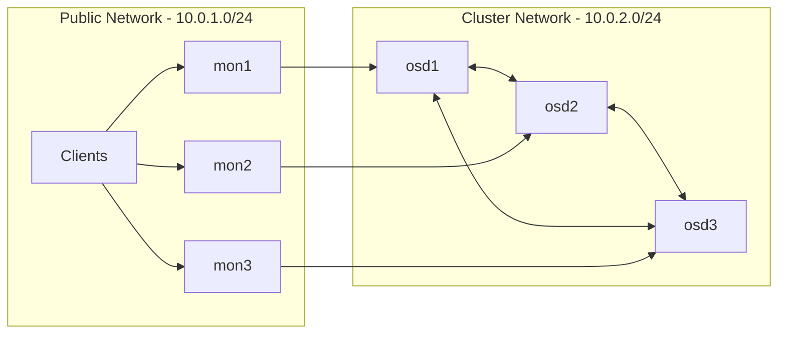

# How to Deploy Ceph Cluster on Bare Metal

Author: [nawazdhandala](https://www.github.com/nawazdhandala)

Tags: Ceph, Storage, Bare Metal, Distributed Storage, Linux, Infrastructure, DevOps

Description: A step-by-step guide to deploying a production-ready Ceph cluster on bare metal servers, covering hardware requirements, network configuration, and cluster setup with cephadm.

---

Ceph is one of the most battle-tested distributed storage systems available. It handles petabytes of data at organizations like CERN, Bloomberg, and Deutsche Telekom. Running Ceph on bare metal gives you full control over your storage infrastructure - no cloud vendor lock-in, predictable costs, and maximum performance from your hardware.

This guide walks you through deploying a production Ceph cluster from scratch using cephadm, the modern deployment tool that ships with Ceph.

## What You Will Build

By the end of this guide, you will have a working Ceph cluster that provides:

- **Block storage (RBD)** - For virtual machines and databases
- **Object storage (RGW)** - S3-compatible API for applications
- **File storage (CephFS)** - POSIX-compliant shared filesystem



## Hardware Requirements

Ceph is designed for commodity hardware, but your cluster's performance depends heavily on getting the basics right.

### Minimum for a Test Cluster

- **3 nodes** (Ceph requires odd numbers for quorum)
- **4 CPU cores** per node
- **8 GB RAM** per node (more for production)
- **1 SSD** for OS (50+ GB)
- **1+ HDD/SSD** for OSD storage per node
- **1 Gbps network** (10 Gbps recommended)

### Production Recommendations

- **5+ nodes** for better fault tolerance
- **16+ CPU cores** per OSD node
- **64+ GB RAM** per node (Ceph uses ~4GB per OSD by default)
- **NVMe for journals/WAL** if using HDDs for data
- **10 Gbps+ network** with dedicated storage network
- **Separate network interfaces** for public and cluster traffic

## Network Architecture

Ceph benefits from network separation. The public network handles client traffic, while the cluster network handles replication between OSDs.



## Step 1: Prepare Your Servers

Run these commands on all nodes. I am using Ubuntu 22.04 LTS, but Ceph supports RHEL, CentOS, Debian, and other distributions.

### Update and Install Dependencies

```bash
# Update package lists and upgrade existing packages
sudo apt update && sudo apt upgrade -y

# Install required dependencies for cephadm
sudo apt install -y python3 python3-pip lvm2 chrony podman

# Cephadm uses containers, so ensure podman or docker is running
sudo systemctl enable --now podman
```

### Configure Time Synchronization

Ceph is extremely sensitive to clock skew. All nodes must have synchronized time within 50ms.

```bash
# Configure chrony to use reliable NTP servers
sudo tee /etc/chrony/chrony.conf > /dev/null << 'EOF'
# Use pool.ntp.org as primary time source
pool pool.ntp.org iburst maxsources 4

# Record the rate at which the system clock gains/losses time
driftfile /var/lib/chrony/drift

# Allow the system clock to be stepped in the first three updates
makestep 1 3

# Enable kernel synchronization of the real-time clock (RTC)
rtcsync

# Specify directory for log files
logdir /var/log/chrony
EOF

# Restart chrony and verify synchronization
sudo systemctl restart chrony
chronyc sources -v
```

### Configure Hostnames and /etc/hosts

Each node needs a resolvable hostname. Edit `/etc/hosts` on all nodes:

```bash
# Add all cluster nodes to /etc/hosts for reliable resolution
sudo tee -a /etc/hosts > /dev/null << 'EOF'
10.0.1.11  ceph-node1
10.0.1.12  ceph-node2
10.0.1.13  ceph-node3
EOF

# Set the hostname on each node (run appropriate command per node)
sudo hostnamectl set-hostname ceph-node1  # On node 1
sudo hostnamectl set-hostname ceph-node2  # On node 2
sudo hostnamectl set-hostname ceph-node3  # On node 3
```

### Configure SSH Key Access

The bootstrap node needs passwordless SSH access to all other nodes.

```bash
# Generate SSH key on the bootstrap node (ceph-node1)
ssh-keygen -t ed25519 -N "" -f ~/.ssh/id_ed25519

# Copy the public key to all nodes including itself
ssh-copy-id ceph-node1
ssh-copy-id ceph-node2
ssh-copy-id ceph-node3

# Verify SSH access works without password prompts
ssh ceph-node1 hostname
ssh ceph-node2 hostname
ssh ceph-node3 hostname
```

## Step 2: Install Cephadm

Cephadm is the official deployment tool for Ceph Reef (v18) and later versions. It uses containers to deploy and manage all Ceph daemons.

```bash
# Download the latest cephadm script
curl --silent --remote-name --location \
  https://download.ceph.com/rpm-reef/el9/noarch/cephadm

# Make it executable and move to system path
chmod +x cephadm
sudo mv cephadm /usr/local/bin/

# Verify installation
cephadm version
```

## Step 3: Bootstrap the Cluster

Run the bootstrap command on your first node. This creates the initial monitor, manager, and other essential services.

```bash
# Bootstrap the cluster with essential configuration
# --mon-ip: IP address for the first monitor
# --cluster-network: Dedicated network for OSD replication traffic
sudo cephadm bootstrap \
  --mon-ip 10.0.1.11 \
  --cluster-network 10.0.2.0/24 \
  --initial-dashboard-user admin \
  --initial-dashboard-password "YourSecurePassword123" \
  --allow-fqdn-hostname
```

The bootstrap process takes a few minutes. When complete, you will see output like:

```
Ceph Dashboard is now available at:
         URL: https://ceph-node1:8443/
        User: admin
    Password: YourSecurePassword123

You can access the Ceph CLI with:
        sudo /usr/local/bin/cephadm shell -- ceph -s
```

### Verify the Bootstrap

```bash
# Enter the cephadm shell for running Ceph commands
sudo cephadm shell

# Inside the shell, check cluster status
ceph -s
```

You should see output indicating one monitor and one manager are running:

```
  cluster:
    id:     a1b2c3d4-e5f6-7890-abcd-ef1234567890
    health: HEALTH_WARN
            OSD count 0 < osd_pool_default_size 3

  services:
    mon: 1 daemons, quorum ceph-node1
    mgr: ceph-node1(active)
    osd: 0 osds: 0 up, 0 in
```

## Step 4: Add Additional Nodes

Now add the other nodes to the cluster. Run these commands from the bootstrap node.

```bash
# Enter the cephadm shell
sudo cephadm shell

# Copy the SSH key to remote hosts (cephadm needs access)
ssh-copy-id -f -i /etc/ceph/ceph.pub root@ceph-node2
ssh-copy-id -f -i /etc/ceph/ceph.pub root@ceph-node3

# Add the hosts to the cluster
# Specify both public and cluster network IPs using labels
ceph orch host add ceph-node2 10.0.1.12 --labels _admin
ceph orch host add ceph-node3 10.0.1.13 --labels _admin

# Verify hosts are added
ceph orch host ls
```

Expected output:

```
HOST        ADDR        LABELS  STATUS
ceph-node1  10.0.1.11   _admin
ceph-node2  10.0.1.12   _admin
ceph-node3  10.0.1.13   _admin
```

## Step 5: Add Storage (OSDs)

OSDs (Object Storage Daemons) are the workhorses of Ceph - they store actual data. Each OSD typically maps to one physical drive.

### Identify Available Disks

```bash
# List all available devices across the cluster
ceph orch device ls

# You will see output showing available (unused) devices
# HOST        PATH      TYPE  SIZE   AVAILABLE
# ceph-node1  /dev/sdb  hdd   1.8T   Yes
# ceph-node1  /dev/sdc  hdd   1.8T   Yes
# ceph-node2  /dev/sdb  hdd   1.8T   Yes
# ...
```

### Add OSDs Automatically

The easiest way to add OSDs is to let Ceph claim all available devices:

```bash
# Tell Ceph to use all available devices as OSDs
ceph orch apply osd --all-available-devices

# Watch the OSD creation progress
ceph -w
```

### Add OSDs Manually (For Specific Devices)

If you want more control over which devices become OSDs:

```bash
# Add a specific device on a specific host
ceph orch daemon add osd ceph-node1:/dev/sdb
ceph orch daemon add osd ceph-node1:/dev/sdc
ceph orch daemon add osd ceph-node2:/dev/sdb
ceph orch daemon add osd ceph-node3:/dev/sdb

# For NVMe devices, the path might be /dev/nvme0n1
ceph orch daemon add osd ceph-node1:/dev/nvme0n1
```

### Verify OSD Deployment

```bash
# Check OSD status
ceph osd tree

# Expected output showing OSDs distributed across nodes
# ID  CLASS  WEIGHT   TYPE NAME          STATUS  REWEIGHT  PRI-AFF
# -1         5.45679  root default
# -3         1.81893      host ceph-node1
#  0    hdd  0.90947          osd.0          up   1.00000  1.00000
#  1    hdd  0.90947          osd.1          up   1.00000  1.00000
# -5         1.81893      host ceph-node2
#  2    hdd  0.90947          osd.2          up   1.00000  1.00000
# ...
```

## Step 6: Deploy Monitors and Managers

By default, cephadm deploys monitors and managers as needed. For production, you want at least 3 monitors for quorum.

```bash
# Specify monitor placement across all three nodes
ceph orch apply mon --placement="ceph-node1,ceph-node2,ceph-node3"

# Deploy manager daemons for high availability
ceph orch apply mgr --placement="ceph-node1,ceph-node2,ceph-node3"

# Verify monitor quorum
ceph mon stat

# Output: e3: 3 mons at {ceph-node1,ceph-node2,ceph-node3}, election epoch 12, quorum 0,1,2
```

## Step 7: Create Storage Pools

Pools are logical partitions for storing data. Different pools can have different replication rules.

```bash
# Create a replicated pool for general use (3x replication)
ceph osd pool create general-pool 128 128 replicated

# Set the replication size (3 copies of data)
ceph osd pool set general-pool size 3
ceph osd pool set general-pool min_size 2

# Create a pool for RBD block storage
ceph osd pool create rbd-pool 128 128 replicated
ceph osd pool application enable rbd-pool rbd

# Initialize the RBD pool
rbd pool init rbd-pool

# Verify pools
ceph osd pool ls detail
```

The number 128 represents placement groups (PGs). A rough formula is:

```
PGs = (OSDs * 100) / replication_factor
```

Round to the nearest power of 2.

## Step 8: Configure Block Storage (RBD)

Create an RBD image that can be mounted as a block device:

```bash
# Create a 100GB block device image
rbd create --size 102400 rbd-pool/my-disk

# List images in the pool
rbd ls rbd-pool

# Get image info
rbd info rbd-pool/my-disk
```

### Mount RBD on a Client

On a client machine with the Ceph client tools installed:

```bash
# Install ceph-common on the client
sudo apt install -y ceph-common

# Copy ceph.conf and keyring from a cluster node
sudo scp ceph-node1:/etc/ceph/ceph.conf /etc/ceph/
sudo scp ceph-node1:/etc/ceph/ceph.client.admin.keyring /etc/ceph/

# Map the RBD image to a local block device
sudo rbd map rbd-pool/my-disk --name client.admin

# This creates /dev/rbd0 - format and mount it
sudo mkfs.ext4 /dev/rbd0
sudo mkdir -p /mnt/ceph-disk
sudo mount /dev/rbd0 /mnt/ceph-disk

# Verify the mount
df -h /mnt/ceph-disk
```

## Step 9: Enable Object Storage (RGW)

The RADOS Gateway provides an S3-compatible object storage API.

```bash
# Deploy RGW daemon on the cluster
ceph orch apply rgw myrgw --placement="ceph-node1"

# Create a user for S3 access
radosgw-admin user create \
  --uid=s3user \
  --display-name="S3 User" \
  --access-key=MYACCESSKEY123 \
  --secret-key=MYSECRETKEY456

# Test with AWS CLI (on any machine with aws cli installed)
aws configure set aws_access_key_id MYACCESSKEY123
aws configure set aws_secret_access_key MYSECRETKEY456

# Create a bucket using the S3 API
aws --endpoint-url=http://ceph-node1:80 s3 mb s3://my-bucket

# Upload a file
aws --endpoint-url=http://ceph-node1:80 s3 cp /etc/hosts s3://my-bucket/

# List bucket contents
aws --endpoint-url=http://ceph-node1:80 s3 ls s3://my-bucket/
```

## Step 10: Enable CephFS

CephFS provides a POSIX-compliant distributed filesystem.

```bash
# Create the CephFS filesystem with pools for data and metadata
ceph fs volume create myfs

# This automatically creates:
# - cephfs.myfs.data pool for file data
# - cephfs.myfs.meta pool for metadata

# Check filesystem status
ceph fs status myfs
```

### Mount CephFS on a Client

```bash
# Install ceph-common on client
sudo apt install -y ceph-common

# Get the admin secret key
ceph auth get-key client.admin

# Mount using the kernel driver
sudo mkdir -p /mnt/cephfs
sudo mount -t ceph ceph-node1:/ /mnt/cephfs \
  -o name=admin,secret=AQD...your-key-here...

# Or mount using FUSE (more compatible but slower)
sudo apt install -y ceph-fuse
sudo ceph-fuse -m ceph-node1:6789 /mnt/cephfs
```

## Step 11: Monitor Cluster Health

### Check Overall Status

```bash
# Quick cluster status
ceph -s

# Detailed health information
ceph health detail

# Real-time status updates
ceph -w
```

### Enable Prometheus Metrics

```bash
# Deploy Prometheus and Grafana for monitoring
ceph orch apply prometheus
ceph orch apply grafana
ceph orch apply alertmanager

# Get Grafana URL and credentials
ceph dashboard get-grafana-api-url
ceph dashboard get-grafana-api-username
ceph dashboard get-grafana-api-password
```

### Monitor Performance

```bash
# OSD performance stats
ceph osd perf

# Pool IO statistics
ceph osd pool stats

# Real-time IO statistics
ceph daemon osd.0 perf dump
```

## Common Maintenance Tasks

### Adding a New OSD

```bash
# Add a new disk to an existing node
ceph orch daemon add osd ceph-node1:/dev/sdd

# Ceph will automatically rebalance data
ceph -w  # Watch the rebalancing progress
```

### Removing an OSD

```bash
# Mark OSD as out (stop receiving new data)
ceph osd out osd.5

# Wait for data to migrate, then remove
ceph osd purge osd.5 --yes-i-really-mean-it
```

### Upgrading Ceph

```bash
# Check current version
ceph version

# Start the upgrade process
ceph orch upgrade start --ceph-version 18.2.0

# Monitor upgrade progress
ceph orch upgrade status
```

## Troubleshooting

### Common Health Warnings

**HEALTH_WARN: OSD count 0 < osd_pool_default_size 3**
- Not enough OSDs for the default replication factor
- Add more OSDs or reduce pool size

**HEALTH_WARN: clock skew detected**
- Time sync issue between nodes
- Fix NTP/chrony configuration

**HEALTH_WARN: pools have many more objects per pg than average**
- Uneven data distribution
- Increase PG count for affected pools

### Check Service Logs

```bash
# View logs for a specific daemon
ceph log last 100 osd.0

# Or check container logs directly
sudo podman logs ceph-mon.ceph-node1
sudo podman logs ceph-osd.0
```

---

You now have a fully functional Ceph cluster running on bare metal. This setup provides a solid foundation that can scale from terabytes to petabytes by adding more nodes and disks. The key to successful Ceph operations is regular monitoring and staying ahead of capacity needs - always keep at least 30% free space to allow for recovery operations.

For production deployments, consider adding network bonding for redundancy, implementing proper backup procedures for the monitor database, and setting up alerting through Prometheus and Alertmanager.
