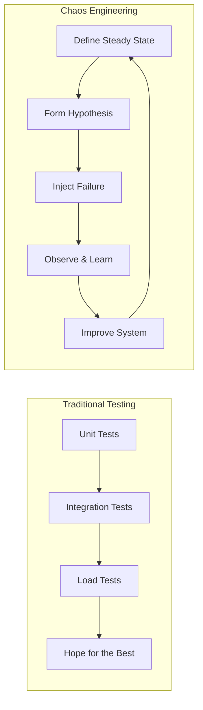
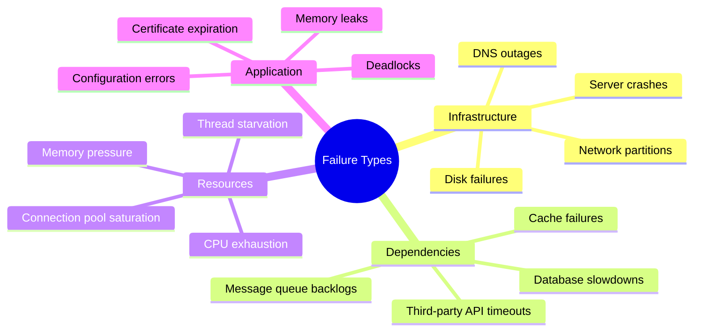
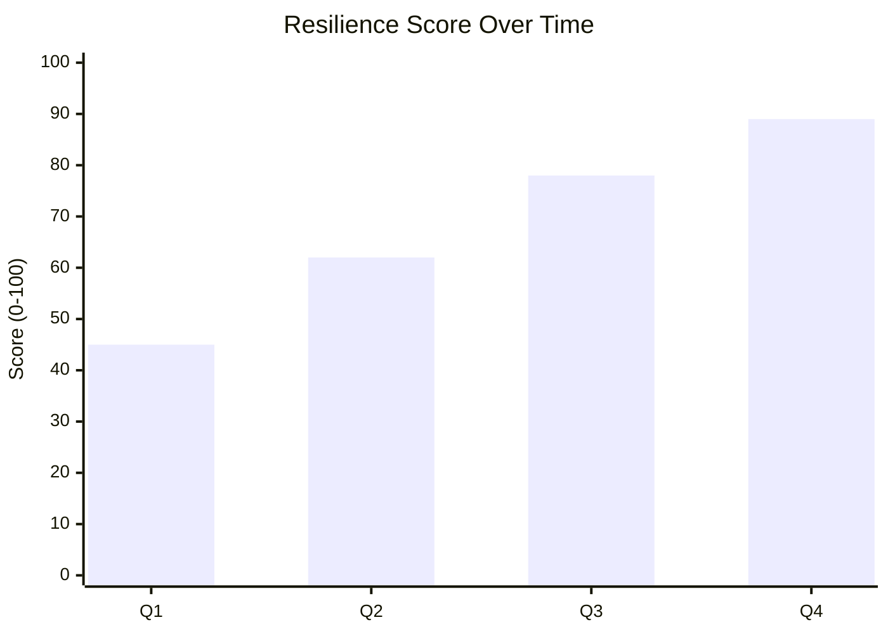

# How to Get Started with Chaos Engineering

Author: [nawazdhandala](https://www.github.com/nawazdhandala)

Tags: Chaos Engineering, Reliability, SRE, DevOps, Site Reliability Engineering, Resilience

Description: Learn the fundamentals of chaos engineering and how to build more resilient systems by intentionally introducing controlled failures. This guide covers core principles, planning your first experiments, and building a chaos engineering practice from scratch.

---

Your monitoring dashboards are green. Your unit tests pass. Your load tests show acceptable performance. Then at 3 AM on a Saturday, a network partition brings down your entire payment system. Sound familiar?

Chaos engineering exists because traditional testing cannot catch all the ways distributed systems fail. You cannot write a unit test for "what happens when the database becomes slow for 30 seconds" or "how does the system behave when one availability zone goes dark." These scenarios require a different approach - one where you intentionally break things to learn how they really behave.

## What Chaos Engineering Actually Is

Chaos engineering is the discipline of experimenting on a system to build confidence in its ability to withstand turbulent conditions in production. Netflix popularized the practice when they built Chaos Monkey in 2011, a tool that randomly kills virtual machine instances in production.

The core insight is simple: failures will happen in production. The question is whether you discover weaknesses proactively through controlled experiments or reactively through customer-impacting incidents.



Chaos engineering is not randomly breaking things. It is a disciplined, scientific approach to discovering system weaknesses before they cause real outages.

## The Four Principles

Chaos engineering follows four core principles that distinguish it from random destruction.

### 1. Build a Hypothesis Around Steady State Behavior

Before injecting any failure, you need to define what "normal" looks like. Steady state is not about internal metrics - it is about business outcomes your customers experience.

Good steady state metrics include:
- Orders processed per minute
- Login success rate
- Search results returned within 200ms
- Video playback starts without buffering

Bad steady state metrics focus too much on internals:
- CPU usage below 70%
- Memory consumption under 4GB
- Database query count

The hypothesis should be: "When we inject failure X, the system will continue to maintain steady state behavior Y."

### 2. Vary Real-World Events

The failures you inject should reflect things that actually happen in production. Draw from your incident history and known infrastructure weaknesses.

Common real-world failure categories:



### 3. Run Experiments in Production

This sounds scary, but there is a reason for it. Staging environments never perfectly mirror production. Different traffic patterns, different data volumes, different failure modes.

That said, you should not start in production. Build confidence in staging first, then graduate to production with careful controls.

### 4. Minimize Blast Radius

Always start small. Kill one instance before killing many. Add 50ms latency before adding 500ms. Affect 1% of traffic before 10%.

The goal is learning, not destruction.

## Planning Your First Experiment

Let me walk you through planning a real chaos experiment from scratch.

### Step 1: Choose Your Target

Pick something important but not critical. A good first target might be a service that handles non-critical background processing. A bad first target would be your payment gateway.

For this example, let's say we have a product recommendation service. If it fails, customers see generic recommendations instead of personalized ones - not great, but not catastrophic.

### Step 2: Understand Current Behavior

Before breaking anything, you need baseline measurements. Spend time observing your service under normal conditions.

```python
# baseline_monitor.py - Collect steady state metrics

import time
from prometheus_api_client import PrometheusConnect

class BaselineCollector:
    def __init__(self, prometheus_url: str):
        self.prom = PrometheusConnect(url=prometheus_url)

    def collect_baseline(self, service_name: str, duration_hours: int = 24):
        """
        Collect baseline metrics for a service over a time period.
        Run this before any chaos experiments to understand normal behavior.
        """

        metrics = {}

        # Request success rate - the most important metric
        success_query = f'''
            sum(rate(http_requests_total{{service="{service_name}", status=~"2.."}}[5m]))
            /
            sum(rate(http_requests_total{{service="{service_name}"}}[5m]))
        '''
        metrics['success_rate'] = self._get_percentiles(success_query, duration_hours)

        # Response latency - how fast are we responding
        latency_query = f'''
            histogram_quantile(0.99,
                rate(http_request_duration_seconds_bucket{{service="{service_name}"}}[5m])
            )
        '''
        metrics['p99_latency'] = self._get_percentiles(latency_query, duration_hours)

        # Throughput - how many requests per second
        throughput_query = f'''
            sum(rate(http_requests_total{{service="{service_name}"}}[5m]))
        '''
        metrics['throughput'] = self._get_percentiles(throughput_query, duration_hours)

        return metrics

    def _get_percentiles(self, query: str, hours: int):
        """Calculate percentiles from historical data"""

        # Query Prometheus for historical values
        result = self.prom.custom_query_range(
            query=query,
            start_time=time.time() - (hours * 3600),
            end_time=time.time(),
            step='1m'
        )

        if not result:
            return None

        values = [float(point[1]) for point in result[0]['values'] if point[1] != 'NaN']
        values.sort()

        return {
            'min': values[0] if values else None,
            'p50': values[len(values)//2] if values else None,
            'p95': values[int(len(values)*0.95)] if values else None,
            'p99': values[int(len(values)*0.99)] if values else None,
            'max': values[-1] if values else None
        }


# Usage example
if __name__ == "__main__":
    collector = BaselineCollector("http://prometheus:9090")

    baseline = collector.collect_baseline("recommendation-service", duration_hours=48)

    print("Baseline metrics for recommendation-service:")
    print(f"  Success rate: {baseline['success_rate']}")
    print(f"  P99 latency: {baseline['p99_latency']}")
    print(f"  Throughput: {baseline['throughput']}")
```

### Step 3: Write Your Hypothesis

Be specific. A good hypothesis is falsifiable - you can definitively prove it true or false.

Bad hypothesis: "The system should handle failures gracefully."

Good hypothesis: "When one recommendation-service pod is killed, the success rate will remain above 99.5% and p99 latency will stay below 200ms."

### Step 4: Design the Experiment

```python
# experiment.py - Define and run a chaos experiment

from dataclasses import dataclass
from typing import Callable, Dict, Any
from datetime import datetime, timedelta
import subprocess
import json

@dataclass
class Hypothesis:
    """What we expect to happen during the experiment"""
    description: str
    success_criteria: Dict[str, Any]

@dataclass
class Experiment:
    """A complete chaos experiment definition"""
    name: str
    target_service: str
    hypothesis: Hypothesis
    failure_injection: str  # What failure to inject
    duration_seconds: int
    rollback_command: str


def create_pod_kill_experiment(service_name: str) -> Experiment:
    """
    Create an experiment that kills one pod of a service.
    This tests if the service can handle instance failures.
    """

    return Experiment(
        name=f"pod-kill-{service_name}",
        target_service=service_name,
        hypothesis=Hypothesis(
            description=(
                f"When one {service_name} pod is killed, "
                "the service will maintain 99.5% success rate "
                "and p99 latency under 200ms"
            ),
            success_criteria={
                'min_success_rate': 0.995,
                'max_p99_latency_ms': 200
            }
        ),
        failure_injection=f"kubectl delete pod -l app={service_name} --wait=false | head -1",
        duration_seconds=300,  # Observe for 5 minutes after injection
        rollback_command=f"kubectl rollout restart deployment/{service_name}"
    )


class ExperimentRunner:
    def __init__(self, baseline_collector, alert_webhook: str = None):
        self.baseline = baseline_collector
        self.alert_webhook = alert_webhook

    def run(self, experiment: Experiment) -> Dict[str, Any]:
        """Execute a chaos experiment with safety controls"""

        results = {
            'experiment': experiment.name,
            'started_at': datetime.utcnow().isoformat(),
            'hypothesis': experiment.hypothesis.description,
            'status': 'running'
        }

        # Verify system is healthy before starting
        pre_check = self._check_steady_state(experiment.target_service)
        if not pre_check['healthy']:
            results['status'] = 'aborted'
            results['reason'] = 'System not in steady state before experiment'
            return results

        results['baseline_metrics'] = pre_check['metrics']

        try:
            # Inject the failure
            print(f"[{datetime.utcnow()}] Injecting failure: {experiment.failure_injection}")
            subprocess.run(experiment.failure_injection, shell=True, check=True)

            # Monitor during the experiment
            observations = self._observe(
                experiment.target_service,
                experiment.duration_seconds,
                experiment.hypothesis.success_criteria
            )

            results['observations'] = observations

            # Evaluate against hypothesis
            results['hypothesis_validated'] = self._evaluate_hypothesis(
                observations,
                experiment.hypothesis.success_criteria
            )

            results['status'] = 'completed'

        except Exception as e:
            results['status'] = 'error'
            results['error'] = str(e)

        finally:
            # Always run rollback
            print(f"[{datetime.utcnow()}] Running rollback: {experiment.rollback_command}")
            subprocess.run(experiment.rollback_command, shell=True)

        results['completed_at'] = datetime.utcnow().isoformat()
        return results

    def _check_steady_state(self, service: str) -> Dict[str, Any]:
        """Verify the system is healthy before we start breaking things"""

        metrics = self.baseline.collect_baseline(service, duration_hours=1)

        # Check if metrics look normal
        healthy = True
        if metrics['success_rate']['p50'] < 0.99:
            healthy = False

        return {'healthy': healthy, 'metrics': metrics}

    def _observe(self, service: str, duration: int, criteria: Dict) -> list:
        """Collect observations during the experiment"""

        observations = []
        interval = 10  # Check every 10 seconds

        for i in range(duration // interval):
            obs = self.baseline.collect_baseline(service, duration_hours=0.01)
            obs['timestamp'] = datetime.utcnow().isoformat()
            observations.append(obs)

            # Safety abort if things go very wrong
            if self._should_abort(obs, criteria):
                print("Safety threshold exceeded - aborting experiment")
                break

            time.sleep(interval)

        return observations

    def _should_abort(self, observation: Dict, criteria: Dict) -> bool:
        """Check if we should abort due to excessive degradation"""

        # Abort if success rate drops below 90% (regardless of hypothesis)
        if observation.get('success_rate', {}).get('p50', 1.0) < 0.90:
            return True
        return False

    def _evaluate_hypothesis(self, observations: list, criteria: Dict) -> bool:
        """Did the system behave as hypothesized?"""

        for obs in observations:
            success_rate = obs.get('success_rate', {}).get('p50', 0)
            latency = obs.get('p99_latency', {}).get('p50', float('inf'))

            if success_rate < criteria.get('min_success_rate', 0):
                return False
            if latency > criteria.get('max_p99_latency_ms', float('inf')) / 1000:
                return False

        return True
```

### Step 5: Run and Learn

```python
# run_first_experiment.py - Execute your first chaos experiment

from baseline_monitor import BaselineCollector
from experiment import ExperimentRunner, create_pod_kill_experiment

def main():
    # Initialize
    collector = BaselineCollector("http://prometheus:9090")
    runner = ExperimentRunner(collector)

    # Create the experiment
    experiment = create_pod_kill_experiment("recommendation-service")

    print(f"Running experiment: {experiment.name}")
    print(f"Hypothesis: {experiment.hypothesis.description}")
    print("-" * 60)

    # Run it
    results = runner.run(experiment)

    # Report findings
    print("\n" + "=" * 60)
    print("EXPERIMENT RESULTS")
    print("=" * 60)
    print(f"Status: {results['status']}")
    print(f"Hypothesis validated: {results.get('hypothesis_validated', 'N/A')}")

    if results.get('hypothesis_validated'):
        print("\nThe system handled the failure as expected.")
        print("Consider increasing the blast radius in future experiments.")
    else:
        print("\nThe hypothesis was NOT validated.")
        print("This indicates a resilience gap that needs attention.")
        print("\nReview the observations to understand what went wrong:")
        for obs in results.get('observations', []):
            print(f"  {obs['timestamp']}: success_rate={obs['success_rate']}")

if __name__ == "__main__":
    main()
```

## Starting Without Kubernetes

Not everyone runs Kubernetes. Here is how to inject chaos in simpler environments.

### Network Latency with tc

The Linux traffic control (tc) command can simulate network problems without any special tools.

```bash
#!/bin/bash
# inject_latency.sh - Add network latency to a specific port

TARGET_PORT=5432  # PostgreSQL
LATENCY_MS=100
INTERFACE=eth0

# Add latency to traffic going to the database
sudo tc qdisc add dev $INTERFACE root handle 1: prio
sudo tc qdisc add dev $INTERFACE parent 1:3 handle 30: netem delay ${LATENCY_MS}ms
sudo tc filter add dev $INTERFACE protocol ip parent 1:0 prio 3 u32 \
    match ip dport $TARGET_PORT 0xffff flowid 1:3

echo "Added ${LATENCY_MS}ms latency to port $TARGET_PORT"
echo "Run 'sudo tc qdisc del dev $INTERFACE root' to remove"
```

### Process Killing with a Simple Script

```python
# simple_chaos.py - Basic chaos for any environment

import subprocess
import random
import time
import psutil

def kill_random_process(process_name: str):
    """
    Find and kill a random process matching the given name.
    Use with caution - this is actual chaos.
    """

    matching_pids = []

    for proc in psutil.process_iter(['pid', 'name', 'cmdline']):
        try:
            # Check if process name matches
            if process_name.lower() in proc.info['name'].lower():
                matching_pids.append(proc.info['pid'])
            # Also check command line arguments
            elif proc.info['cmdline']:
                cmdline = ' '.join(proc.info['cmdline'])
                if process_name.lower() in cmdline.lower():
                    matching_pids.append(proc.info['pid'])
        except (psutil.NoSuchProcess, psutil.AccessDenied):
            continue

    if not matching_pids:
        print(f"No processes found matching '{process_name}'")
        return None

    # Pick a random one
    target_pid = random.choice(matching_pids)

    print(f"Killing process {target_pid} (one of {len(matching_pids)} matches)")
    subprocess.run(['kill', '-9', str(target_pid)])

    return target_pid


def exhaust_memory(megabytes: int, duration_seconds: int):
    """
    Allocate memory to simulate memory pressure.
    The memory is released when the function returns.
    """

    print(f"Allocating {megabytes}MB for {duration_seconds} seconds...")

    # Allocate memory in 1MB chunks
    chunks = []
    for _ in range(megabytes):
        # Each chunk is 1MB of random data
        chunks.append(bytearray(1024 * 1024))

    print(f"Allocated. Holding for {duration_seconds} seconds...")
    time.sleep(duration_seconds)

    # Memory is freed when chunks goes out of scope
    print("Releasing memory")


def burn_cpu(cores: int, duration_seconds: int):
    """
    Burn CPU cycles to simulate high CPU load.
    Uses multiprocessing to utilize multiple cores.
    """

    import multiprocessing

    def cpu_burner():
        end_time = time.time() + duration_seconds
        while time.time() < end_time:
            # Busy loop - burns CPU
            _ = sum(i * i for i in range(10000))

    print(f"Burning {cores} CPU cores for {duration_seconds} seconds...")

    processes = []
    for _ in range(cores):
        p = multiprocessing.Process(target=cpu_burner)
        p.start()
        processes.append(p)

    for p in processes:
        p.join()

    print("CPU burn complete")
```

## Building a Chaos Engineering Practice

Running one experiment teaches you something. Running experiments continuously builds organizational resilience.

### Start with Game Days

Game Days are scheduled events where the team comes together to run chaos experiments. They build familiarity and reduce fear around controlled failure injection.

A good Game Day structure:

1. Morning briefing (30 min) - Review the day's experiments and safety procedures
2. Experiment rounds (2-3 hours) - Run 3-5 experiments with breaks between
3. Debrief (1 hour) - Document findings and assign follow-up work

### Graduate to Continuous Chaos

Once the team is comfortable, move toward automated chaos that runs without human intervention.

```yaml
# chaos-schedule.yaml - Run chaos experiments on a schedule

apiVersion: chaos-mesh.org/v1alpha1
kind: Schedule
metadata:
  name: weekly-pod-kill
spec:
  schedule: "0 10 * * 3"  # Every Wednesday at 10 AM
  type: PodChaos
  podChaos:
    action: pod-kill
    mode: one
    selector:
      namespaces:
        - production
      labelSelectors:
        chaos-enabled: "true"  # Only target opted-in services
```

### Track Resilience Over Time

Create a dashboard that shows how your system resilience improves.



Good metrics to track:
- Mean time to recovery (MTTR) during chaos experiments
- Percentage of experiments where hypothesis was validated
- Number of services with chaos experiments enabled
- Findings that led to actual system improvements

## Common Pitfalls to Avoid

After helping teams adopt chaos engineering, I have seen the same mistakes repeatedly.

**Running chaos without observability.** If you cannot see what is happening, you cannot learn from it. Get your monitoring solid before injecting failures.

**Skipping the hypothesis.** Without a hypothesis, you are just breaking things randomly. Every experiment needs a clear, falsifiable prediction.

**Starting too big.** The blast radius should be tiny at first. One pod. One instance. Five percent of traffic. Grow gradually as confidence increases.

**No rollback plan.** Before every experiment, know exactly how to stop it immediately. Test the rollback before running the experiment.

**Treating it as a one-time event.** Chaos engineering is not a project with an end date. It is an ongoing practice that becomes part of how you operate.

---

Chaos engineering transforms the question from "will our system handle failure?" to "how does our system handle failure?" The difference is confidence backed by evidence rather than hope backed by testing in controlled environments.

Start small. Pick one service, define one hypothesis, run one experiment. Learn from what you observe. Then do it again. Over time, you will build systems that handle the unexpected gracefully - not because you hoped they would, but because you proved they can.
