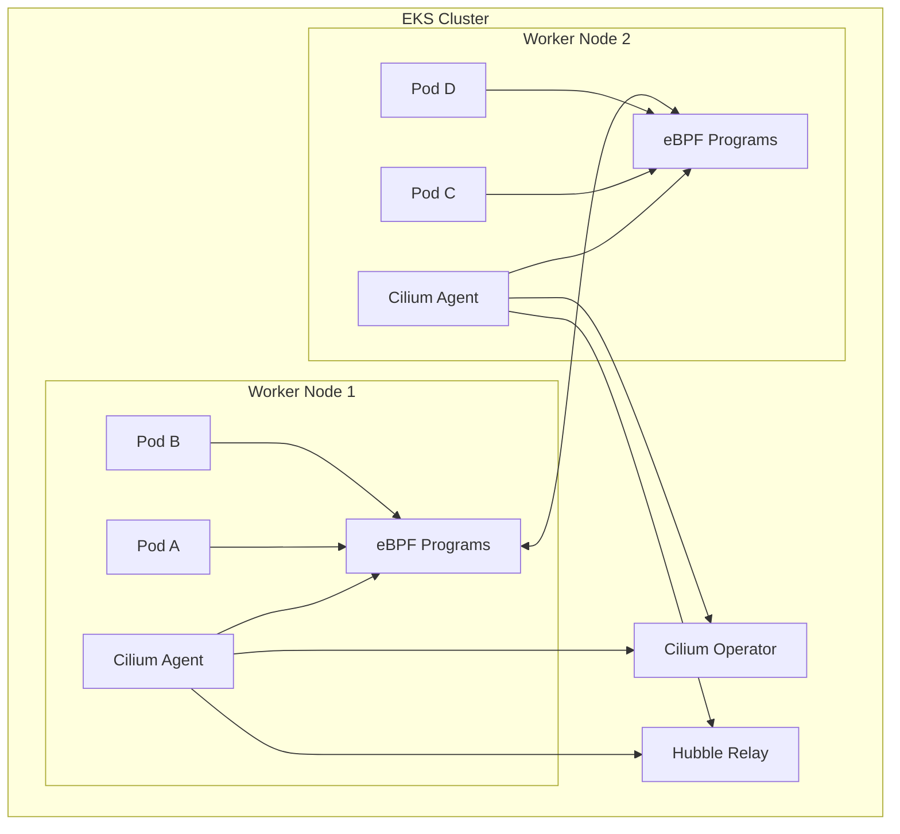
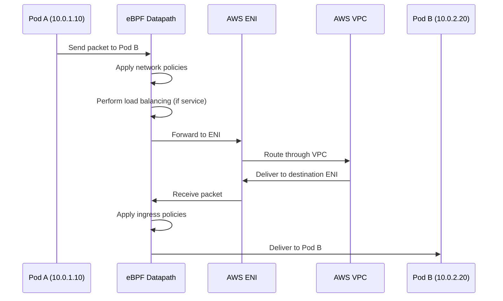
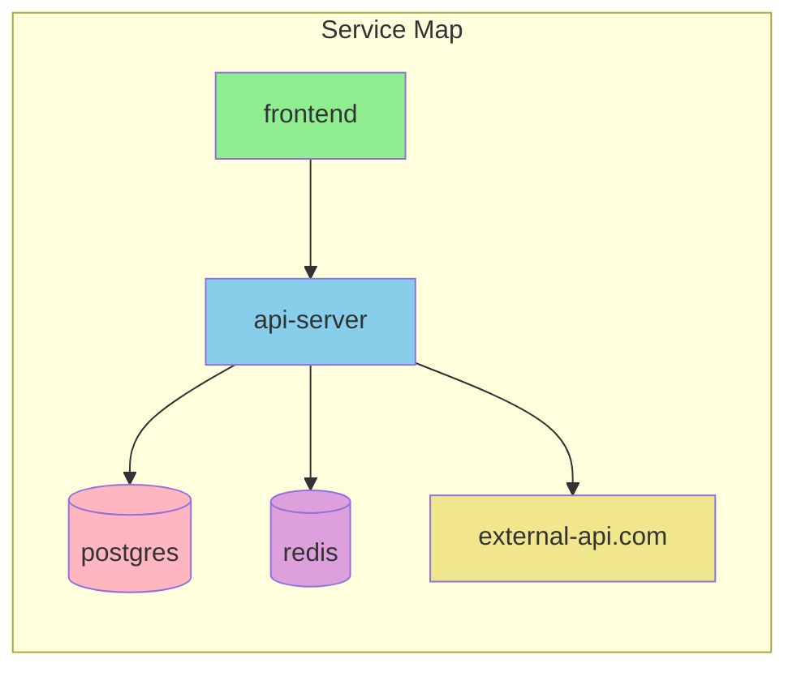

# How to Use Cilium with AWS EKS

Author: [nawazdhandala](https://www.github.com/nawazdhandala)

Tags: Cilium, AWS, EKS, Kubernetes, eBPF, Networking, CNI

Description: Learn how to deploy and configure Cilium as the CNI for AWS EKS clusters, replacing the default AWS VPC CNI with eBPF-powered networking.

---

## Why Use Cilium on AWS EKS

AWS EKS comes with the AWS VPC CNI by default, which assigns VPC IP addresses directly to pods. While this works well for basic networking, Cilium offers several advantages:

- **eBPF-powered networking**: Faster packet processing without iptables overhead
- **Advanced network policies**: L7-aware policies that go beyond standard Kubernetes NetworkPolicy
- **Built-in observability**: Hubble provides deep visibility into network traffic
- **Service mesh capabilities**: Sidecar-free service mesh using eBPF
- **Transparent encryption**: WireGuard-based encryption between nodes

This guide walks through deploying Cilium on an EKS cluster from scratch.

## Architecture Overview

When you deploy Cilium on EKS, it replaces the default AWS VPC CNI as the primary network plugin. Cilium manages pod networking, network policies, and load balancing using eBPF programs attached to network interfaces.



## Prerequisites

Before you begin, ensure you have:

- AWS CLI configured with appropriate permissions
- kubectl installed and configured
- Helm 3.x installed
- eksctl installed (for cluster creation)

## Creating an EKS Cluster Without a CNI

To use Cilium as the primary CNI, you need to create an EKS cluster without the default AWS VPC CNI. This prevents conflicts between the two CNI plugins.

Create a cluster configuration file:

```yaml
# cluster-config.yaml
# EKS cluster configuration that disables the default VPC CNI
# This allows Cilium to be installed as the primary CNI

apiVersion: eksctl.io/v1alpha5
kind: ClusterConfig

metadata:
  name: cilium-eks-cluster
  region: us-west-2
  version: "1.28"

# Disable the default VPC CNI addon
# Cilium will handle all pod networking instead
addons:
  - name: vpc-cni
    version: latest
    # Setting attachPolicyARNs to empty disables the addon
    attachPolicyARNs: []

# IAM OIDC provider is required for Cilium service accounts
iam:
  withOIDC: true

# Define the managed node group configuration
managedNodeGroups:
  - name: cilium-workers
    instanceType: m5.large
    desiredCapacity: 3
    minSize: 2
    maxSize: 5

    # Use Amazon Linux 2 with containerd runtime
    amiFamily: AmazonLinux2

    # Enable SSH access for debugging if needed
    ssh:
      allow: true
      publicKeyName: your-key-pair

    # Labels help identify nodes for scheduling
    labels:
      role: worker
      cilium: enabled

    # Taints prevent pods from scheduling until Cilium is ready
    # Remove this taint after Cilium installation completes
    taints:
      - key: node.cilium.io/agent-not-ready
        value: "true"
        effect: NoSchedule
```

Create the cluster:

```bash
# Create the EKS cluster using the configuration file
# This process takes approximately 15-20 minutes
eksctl create cluster -f cluster-config.yaml

# Verify the cluster is created and accessible
kubectl get nodes

# Expected output (nodes will be NotReady until CNI is installed):
# NAME                                           STATUS     ROLES    AGE   VERSION
# ip-192-168-1-100.us-west-2.compute.internal   NotReady   <none>   2m    v1.28.0
# ip-192-168-2-101.us-west-2.compute.internal   NotReady   <none>   2m    v1.28.0
# ip-192-168-3-102.us-west-2.compute.internal   NotReady   <none>   2m    v1.28.0
```

## Removing the AWS VPC CNI (If Present)

If you created a standard EKS cluster, you need to remove the AWS VPC CNI before installing Cilium:

```bash
# Check if AWS VPC CNI is installed
kubectl get pods -n kube-system -l k8s-app=aws-node

# Delete the AWS VPC CNI daemonset
kubectl delete daemonset aws-node -n kube-system

# Delete the associated configmap
kubectl delete configmap amazon-vpc-cni -n kube-system

# Verify removal
kubectl get pods -n kube-system | grep aws-node
# Should return no results
```

## Installing Cilium with Helm

Add the Cilium Helm repository and install Cilium with EKS-specific configuration:

```bash
# Add the official Cilium Helm repository
helm repo add cilium https://helm.cilium.io/

# Update repository cache to get latest charts
helm repo update
```

Create a values file with EKS-specific configuration:

```yaml
# cilium-values.yaml
# Cilium Helm values optimized for AWS EKS

# Use ENI mode for native AWS VPC integration
# This allows pods to get IPs from the VPC CIDR
eni:
  enabled: true

# AWS-specific settings
awsEnablePrefixDelegation: true
awsReleaseExcessIPs: true

# IPAM configuration
# eni mode uses AWS ENI for IP address management
ipam:
  mode: eni

# EKS uses the AWS cloud provider
egressMasqueradeInterfaces: eth0

# Enable endpoint routes for better AWS integration
endpointRoutes:
  enabled: true

# Tunnel mode must be disabled when using ENI
tunnel: disabled

# Disable eBPF-based masquerading in ENI mode
# AWS VPC handles NAT for outbound traffic
bpf:
  masquerade: false

# Enable Hubble for observability
# Hubble provides network flow visibility and metrics
hubble:
  enabled: true

  # Enable the Hubble Relay for aggregating flows from all nodes
  relay:
    enabled: true

  # Enable the Hubble UI for visual network topology
  ui:
    enabled: true

# Install the Cilium CLI as part of the deployment
# Useful for troubleshooting and management
cilium:
  image:
    repository: quay.io/cilium/cilium
    tag: v1.15.0

# Operator configuration
operator:
  replicas: 2

# Prometheus metrics for monitoring
prometheus:
  enabled: true
  serviceMonitor:
    enabled: false

# Node initialization configuration
# This handles the taint removal after Cilium is ready
nodeinit:
  enabled: true
  removeCbrBridge: true
  reconfigureKubelet: true

# Kubernetes-specific settings
kubeProxyReplacement: strict

# Cluster configuration
# Replace with your actual cluster name
cluster:
  name: cilium-eks-cluster

# Security context for running on EKS
securityContext:
  privileged: true
```

Install Cilium:

```bash
# Install Cilium using Helm with the custom values
helm install cilium cilium/cilium \
  --version 1.15.0 \
  --namespace kube-system \
  --values cilium-values.yaml

# Watch the Cilium pods come up
kubectl get pods -n kube-system -l k8s-app=cilium -w

# Expected output after a few minutes:
# NAME           READY   STATUS    RESTARTS   AGE
# cilium-abc12   1/1     Running   0          2m
# cilium-def34   1/1     Running   0          2m
# cilium-ghi56   1/1     Running   0          2m
```

## Validating the Installation

After installation, validate that Cilium is working correctly:

```bash
# Check Cilium status on each node
kubectl exec -n kube-system ds/cilium -- cilium status

# Expected output:
#    /¯¯\
# /¯¯\__/¯¯\    Cilium:             OK
# \__/¯¯\__/    Operator:           OK
# /¯¯\__/¯¯\    Hubble Relay:       OK
# \__/¯¯\__/    ClusterMesh:        disabled
#    \__/
#
# Cluster health:   3/3 reachable   (2024-01-26T10:00:00Z)
```

Run the Cilium connectivity test to verify end-to-end functionality:

```bash
# Install the Cilium CLI if not already installed
curl -L --remote-name-all https://github.com/cilium/cilium-cli/releases/latest/download/cilium-linux-amd64.tar.gz
tar xzvf cilium-linux-amd64.tar.gz
sudo mv cilium /usr/local/bin/

# Run the connectivity test
# This deploys test pods and validates network connectivity
cilium connectivity test

# The test runs multiple scenarios including:
# - Pod to pod connectivity
# - Pod to service connectivity
# - Pod to external connectivity
# - Network policy enforcement
```

Verify that nodes are now Ready:

```bash
kubectl get nodes

# Expected output:
# NAME                                           STATUS   ROLES    AGE   VERSION
# ip-192-168-1-100.us-west-2.compute.internal   Ready    <none>   10m   v1.28.0
# ip-192-168-2-101.us-west-2.compute.internal   Ready    <none>   10m   v1.28.0
# ip-192-168-3-102.us-west-2.compute.internal   Ready    <none>   10m   v1.28.0
```

## Cilium Network Flow on EKS

The following diagram shows how network traffic flows through Cilium on EKS:



## Configuring Network Policies

Cilium supports both standard Kubernetes NetworkPolicy and its own CiliumNetworkPolicy CRD, which offers additional features like L7 filtering:

```yaml
# network-policy.yaml
# Example CiliumNetworkPolicy for a web application

apiVersion: "cilium.io/v2"
kind: CiliumNetworkPolicy
metadata:
  name: api-server-policy
  namespace: production
spec:
  # Apply this policy to pods with the app=api-server label
  endpointSelector:
    matchLabels:
      app: api-server

  # Ingress rules control incoming traffic
  ingress:
    # Allow traffic from frontend pods on port 8080
    - fromEndpoints:
        - matchLabels:
            app: frontend
      toPorts:
        - ports:
            - port: "8080"
              protocol: TCP
          # L7 rules provide HTTP-aware filtering
          rules:
            http:
              - method: "GET"
                path: "/api/v1/.*"
              - method: "POST"
                path: "/api/v1/orders"

    # Allow health checks from the load balancer
    - fromCIDR:
        - 10.0.0.0/16
      toPorts:
        - ports:
            - port: "8080"
              protocol: TCP
          rules:
            http:
              - method: "GET"
                path: "/health"

  # Egress rules control outgoing traffic
  egress:
    # Allow connections to the database
    - toEndpoints:
        - matchLabels:
            app: postgres
      toPorts:
        - ports:
            - port: "5432"
              protocol: TCP

    # Allow DNS resolution
    - toEndpoints:
        - matchLabels:
            k8s:io.kubernetes.pod.namespace: kube-system
            k8s-app: kube-dns
      toPorts:
        - ports:
            - port: "53"
              protocol: UDP
          rules:
            dns:
              - matchPattern: "*"
```

Apply the network policy:

```bash
# Apply the policy
kubectl apply -f network-policy.yaml

# Verify the policy is active
kubectl get ciliumnetworkpolicies -n production

# Check endpoint status to see applied policies
kubectl get ciliumendpoints -n production
```

## Using Hubble for Network Observability

Hubble provides real-time visibility into network traffic. Access the Hubble CLI or UI to observe flows:

```bash
# Port-forward to access Hubble Relay
kubectl port-forward -n kube-system svc/hubble-relay 4245:80 &

# Install Hubble CLI
export HUBBLE_VERSION=$(curl -s https://raw.githubusercontent.com/cilium/hubble/master/stable.txt)
curl -L --remote-name-all https://github.com/cilium/hubble/releases/download/$HUBBLE_VERSION/hubble-linux-amd64.tar.gz
tar xzvf hubble-linux-amd64.tar.gz
sudo mv hubble /usr/local/bin/

# Observe all network flows in real-time
hubble observe --follow

# Filter flows by namespace
hubble observe --namespace production --follow

# Filter flows by verdict (allowed or dropped)
hubble observe --verdict DROPPED --follow

# Get flow statistics
hubble observe --namespace production -o json | jq -s 'group_by(.destination.namespace) | map({namespace: .[0].destination.namespace, count: length})'
```

Access the Hubble UI for visual network topology:

```bash
# Port-forward to access Hubble UI
kubectl port-forward -n kube-system svc/hubble-ui 12000:80

# Open http://localhost:12000 in your browser
```

The Hubble UI displays:



## Enabling Transparent Encryption

Cilium can encrypt all pod-to-pod traffic using WireGuard without any application changes:

```yaml
# Update your cilium-values.yaml to enable encryption
# cilium-values-encryption.yaml

# Enable WireGuard encryption
encryption:
  enabled: true
  type: wireguard

# WireGuard-specific settings
wireguard:
  # Use userspace WireGuard if kernel module is not available
  userspaceFallback: false
```

Upgrade the Cilium installation:

```bash
# Upgrade Cilium with encryption enabled
helm upgrade cilium cilium/cilium \
  --namespace kube-system \
  --reuse-values \
  --set encryption.enabled=true \
  --set encryption.type=wireguard

# Verify encryption is active
kubectl exec -n kube-system ds/cilium -- cilium status | grep Encryption

# Expected output:
# Encryption:              Wireguard   [NodeEncryption: Disabled, cilium_wg0 (Pubkey: xxxxx, Port: 51871, Peers: 2)]

# Check WireGuard interfaces on nodes
kubectl exec -n kube-system ds/cilium -- wg show
```

## Load Balancing with Cilium

Cilium can replace kube-proxy for service load balancing, using eBPF for better performance:

```yaml
# Service with Cilium load balancing annotations
apiVersion: v1
kind: Service
metadata:
  name: api-gateway
  namespace: production
  annotations:
    # Use Cilium's maglev algorithm for consistent hashing
    service.cilium.io/loadbalancer-algorithm: maglev
spec:
  type: LoadBalancer
  ports:
    - port: 80
      targetPort: 8080
      protocol: TCP
  selector:
    app: api-gateway
```

For internal load balancing with session affinity:

```yaml
apiVersion: v1
kind: Service
metadata:
  name: stateful-app
  namespace: production
spec:
  type: ClusterIP
  # Enable session affinity based on client IP
  sessionAffinity: ClientIP
  sessionAffinityConfig:
    clientIP:
      timeoutSeconds: 10800
  ports:
    - port: 80
      targetPort: 8080
  selector:
    app: stateful-app
```

## Monitoring Cilium with Prometheus

Cilium exposes Prometheus metrics for monitoring. Configure Prometheus to scrape Cilium metrics:

```yaml
# prometheus-servicemonitor.yaml
# ServiceMonitor for Prometheus Operator to scrape Cilium metrics

apiVersion: monitoring.coreos.com/v1
kind: ServiceMonitor
metadata:
  name: cilium-metrics
  namespace: monitoring
spec:
  selector:
    matchLabels:
      k8s-app: cilium
  namespaceSelector:
    matchNames:
      - kube-system
  endpoints:
    - port: metrics
      interval: 30s
      path: /metrics

---
# ServiceMonitor for Hubble metrics
apiVersion: monitoring.coreos.com/v1
kind: ServiceMonitor
metadata:
  name: hubble-metrics
  namespace: monitoring
spec:
  selector:
    matchLabels:
      k8s-app: hubble
  namespaceSelector:
    matchNames:
      - kube-system
  endpoints:
    - port: metrics
      interval: 30s
      path: /metrics
```

Key metrics to monitor:

```bash
# Number of endpoints managed by Cilium
cilium_endpoint_count

# Network policy verdict counts
cilium_policy_verdict_total

# eBPF map operations
cilium_bpf_map_ops_total

# Dropped packets by reason
cilium_drop_count_total

# API request latency
cilium_api_process_time_seconds
```

## Troubleshooting Common Issues

### Pods Stuck in ContainerCreating

If pods are stuck in ContainerCreating after installing Cilium:

```bash
# Check Cilium agent logs for errors
kubectl logs -n kube-system -l k8s-app=cilium --tail=100

# Verify ENI attachment
kubectl exec -n kube-system ds/cilium -- cilium status --verbose

# Check for AWS API rate limiting
kubectl logs -n kube-system deployment/cilium-operator | grep -i "rate limit"
```

### Network Policy Not Working

If network policies are not being enforced:

```bash
# Verify policy is applied to the endpoint
kubectl exec -n kube-system ds/cilium -- cilium endpoint list

# Check policy verdict for specific endpoint
kubectl exec -n kube-system ds/cilium -- cilium endpoint get <endpoint-id> -o jsonpath='{.status.policy}'

# View policy events in Hubble
hubble observe --verdict DROPPED --namespace <namespace>
```

### ENI IP Exhaustion

If you run out of ENI IP addresses:

```bash
# Check current ENI usage
kubectl exec -n kube-system ds/cilium -- cilium status | grep "allocated"

# Enable prefix delegation for more IPs per ENI
# Add to your Helm values:
# awsEnablePrefixDelegation: true

# Verify prefix delegation is active
kubectl exec -n kube-system ds/cilium -- cilium status --verbose | grep -i prefix
```

## Cleanup

To remove Cilium and restore the cluster to its original state:

```bash
# Uninstall Cilium
helm uninstall cilium -n kube-system

# Remove Cilium CRDs
kubectl delete crd ciliumclusterwidenetworkpolicies.cilium.io
kubectl delete crd ciliumendpoints.cilium.io
kubectl delete crd ciliumidentities.cilium.io
kubectl delete crd ciliumnetworkpolicies.cilium.io
kubectl delete crd ciliumnodes.cilium.io

# Reinstall AWS VPC CNI if needed
kubectl apply -f https://raw.githubusercontent.com/aws/amazon-vpc-cni-k8s/master/config/master/aws-k8s-cni.yaml
```

## Conclusion

Cilium brings powerful eBPF-based networking to AWS EKS, offering better performance, advanced security features, and deep observability. The ENI integration mode allows pods to use native VPC networking while benefiting from Cilium's features.

Key points to remember:

- Create EKS clusters without the AWS VPC CNI or remove it before installing Cilium
- Use ENI mode for native AWS VPC integration
- Enable Hubble for network visibility and troubleshooting
- Consider WireGuard encryption for secure pod-to-pod communication
- Monitor Cilium metrics to track cluster network health

With Cilium on EKS, you get the scalability of AWS managed Kubernetes combined with the advanced networking capabilities that eBPF enables.
