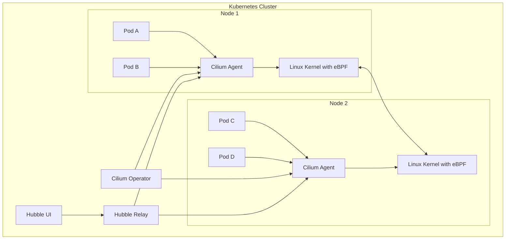
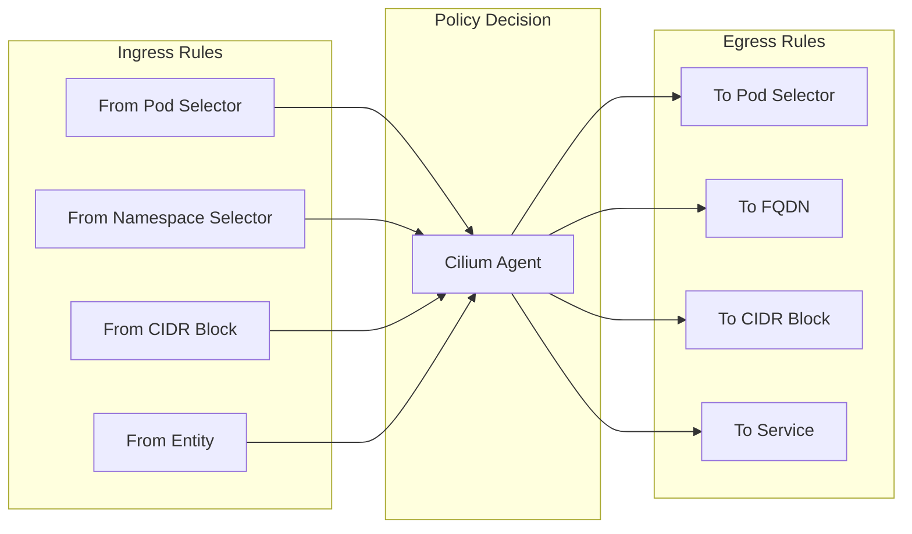
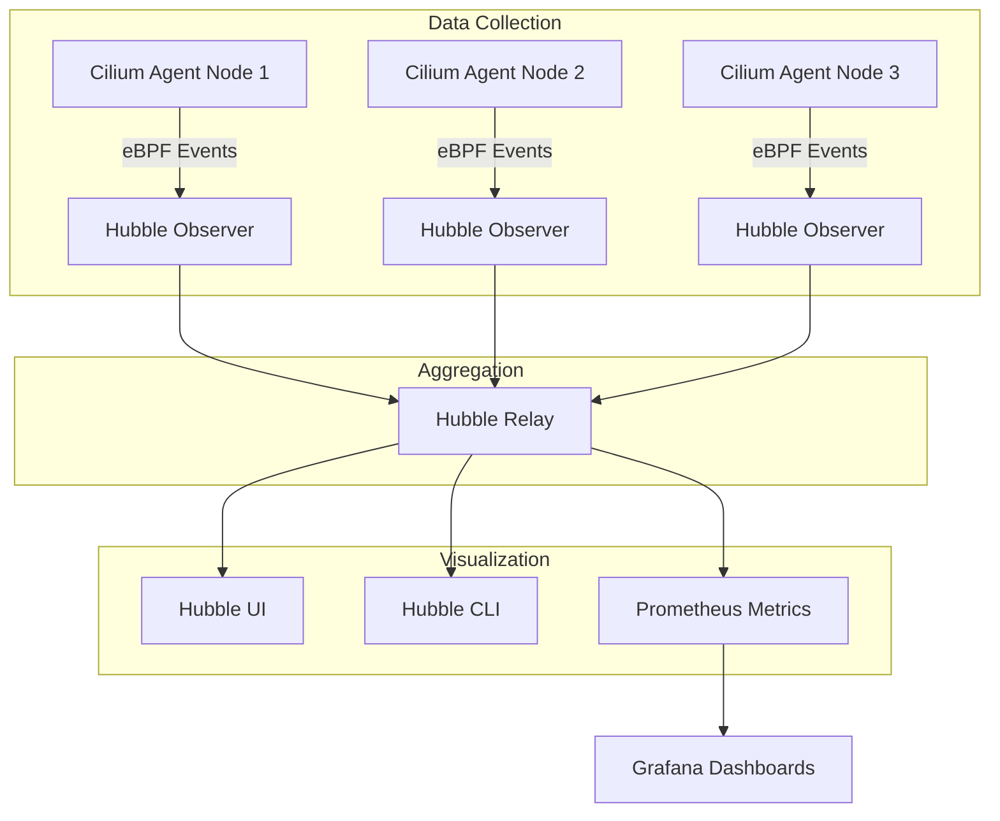

# How to Get Started with Cilium for Kubernetes Networking

Author: [nawazdhandala](https://www.github.com/nawazdhandala)

Tags: Cilium, Kubernetes, Networking, eBPF, Service Mesh

Description: A beginner's guide to Cilium for Kubernetes networking, covering installation, network policies, observability with Hubble, and eBPF-based networking.

---

## Introduction

Cilium is a powerful open-source networking solution for Kubernetes that leverages eBPF (extended Berkeley Packet Filter) to provide high-performance networking, security, and observability. Unlike traditional CNI (Container Network Interface) plugins that rely on iptables, Cilium operates directly in the Linux kernel, offering better performance and more granular control over network traffic.

This guide walks you through getting started with Cilium, from installation to implementing network policies and enabling observability with Hubble.

## Why Choose Cilium?

Before diving into the setup, let's understand what makes Cilium different from other Kubernetes networking solutions:

- **eBPF-powered**: Runs directly in the kernel without the overhead of iptables rule processing
- **Identity-based security**: Uses workload identity rather than IP addresses for security policies
- **Built-in observability**: Hubble provides deep visibility into network flows without additional tooling
- **Service mesh capabilities**: Optional sidecar-free service mesh with mTLS encryption
- **Multi-cluster support**: Native support for connecting multiple Kubernetes clusters

## Architecture Overview

The following diagram shows how Cilium integrates with Kubernetes:



Each node runs a Cilium agent that programs eBPF maps in the kernel. The Cilium Operator handles cluster-wide tasks like IPAM (IP Address Management) and garbage collection. Hubble provides observability by collecting flow data from each agent.

## Prerequisites

Before installing Cilium, ensure you have:

- A Kubernetes cluster (v1.21 or later recommended)
- kubectl configured to access your cluster
- Helm 3.x installed (for Helm-based installation)

You can verify your cluster is ready:

```bash
# Check Kubernetes version
kubectl version --short

# Verify kubectl can access the cluster
kubectl get nodes
```

## Installing Cilium

### Option 1: Using the Cilium CLI

The Cilium CLI is the easiest way to install Cilium. First, install the CLI tool:

```bash
# For Linux (amd64)
CILIUM_CLI_VERSION=$(curl -s https://raw.githubusercontent.com/cilium/cilium-cli/main/stable.txt)
CLI_ARCH=amd64
curl -L --fail --remote-name-all https://github.com/cilium/cilium-cli/releases/download/${CILIUM_CLI_VERSION}/cilium-linux-${CLI_ARCH}.tar.gz
sudo tar xzvfC cilium-linux-${CLI_ARCH}.tar.gz /usr/local/bin
rm cilium-linux-${CLI_ARCH}.tar.gz

# For macOS
brew install cilium-cli
```

Now install Cilium on your cluster:

```bash
# Install Cilium with default settings
cilium install

# Wait for Cilium to be ready
cilium status --wait
```

### Option 2: Using Helm

For more control over the installation, use Helm:

```bash
# Add the Cilium Helm repository
helm repo add cilium https://helm.cilium.io/
helm repo update

# Install Cilium with Hubble enabled
helm install cilium cilium/cilium --version 1.15.0 \
    --namespace kube-system \
    --set hubble.relay.enabled=true \
    --set hubble.ui.enabled=true \
    --set hubble.metrics.enabled="{dns,drop,tcp,flow,port-distribution,icmp,http}"
```

The Helm installation allows you to customize various aspects of Cilium. Here are some common configuration options:

```yaml
# values.yaml - Example Cilium configuration
# Enable Hubble for observability
hubble:
  relay:
    enabled: true
  ui:
    enabled: true
  metrics:
    # Expose metrics for Prometheus scraping
    enabled:
      - dns
      - drop
      - tcp
      - flow
      - port-distribution
      - icmp
      - http

# Configure IP address management
ipam:
  # Use cluster-pool mode for automatic IP allocation
  mode: cluster-pool
  operator:
    clusterPoolIPv4PodCIDRList:
      - "10.0.0.0/8"

# Enable bandwidth manager for better network performance
bandwidthManager:
  enabled: true

# Enable native routing mode (recommended for cloud providers)
routingMode: native

# Configure kube-proxy replacement
kubeProxyReplacement: strict
```

Apply the custom configuration:

```bash
helm install cilium cilium/cilium --version 1.15.0 \
    --namespace kube-system \
    -f values.yaml
```

### Verifying the Installation

After installation, verify that Cilium is running correctly:

```bash
# Check Cilium status
cilium status

# Run connectivity tests
cilium connectivity test
```

The connectivity test deploys test pods and verifies that networking works correctly. A successful output looks like this:

```
All 42 tests (295 actions) successful, 0 tests skipped, 0 scenarios skipped.
```

## Understanding Cilium Network Policies

Cilium supports both standard Kubernetes NetworkPolicy and its own CiliumNetworkPolicy CRD (Custom Resource Definition). The CiliumNetworkPolicy provides additional features like Layer 7 filtering and DNS-aware rules.

### Network Policy Flow



### Basic Network Policy Example

Let's start with a simple example that restricts traffic to a web application:

```yaml
# network-policy-basic.yaml
# This policy allows only pods with the role=frontend label
# to access pods labeled app=backend on port 8080

apiVersion: cilium.io/v2
kind: CiliumNetworkPolicy
metadata:
  name: backend-policy
  namespace: production
spec:
  # Select which pods this policy applies to
  endpointSelector:
    matchLabels:
      app: backend

  # Define allowed ingress (incoming) traffic
  ingress:
    - fromEndpoints:
        # Only allow traffic from pods with role=frontend
        - matchLabels:
            role: frontend
      toPorts:
        - ports:
            # Only allow traffic on port 8080
            - port: "8080"
              protocol: TCP
```

Apply the policy:

```bash
kubectl apply -f network-policy-basic.yaml
```

### Layer 7 Policy with HTTP Filtering

Cilium can inspect Layer 7 traffic, allowing you to create policies based on HTTP methods, paths, and headers:

```yaml
# layer7-policy.yaml
# This policy restricts API access based on HTTP methods and paths

apiVersion: cilium.io/v2
kind: CiliumNetworkPolicy
metadata:
  name: api-l7-policy
  namespace: production
spec:
  endpointSelector:
    matchLabels:
      app: api-server

  ingress:
    - fromEndpoints:
        - matchLabels:
            role: web-client
      toPorts:
        - ports:
            - port: "8080"
              protocol: TCP
          # Layer 7 rules for HTTP traffic
          rules:
            http:
              # Allow GET requests to any path starting with /api/v1/
              - method: GET
                path: "/api/v1/.*"

              # Allow POST requests only to the /api/v1/orders endpoint
              - method: POST
                path: "/api/v1/orders"

              # Allow GET requests to health check endpoint from anyone
              - method: GET
                path: "/health"
```

### DNS-Aware Egress Policy

One of Cilium's powerful features is the ability to create egress policies based on DNS names:

```yaml
# dns-egress-policy.yaml
# This policy allows pods to access specific external services by DNS name

apiVersion: cilium.io/v2
kind: CiliumNetworkPolicy
metadata:
  name: external-api-access
  namespace: production
spec:
  endpointSelector:
    matchLabels:
      app: payment-service

  egress:
    # Allow DNS resolution (required for FQDN rules to work)
    - toEndpoints:
        - matchLabels:
            io.cilium.k8s.policy.cluster: default
            io.cilium.k8s.policy.serviceaccount: kube-dns
            k8s-app: kube-dns
      toPorts:
        - ports:
            - port: "53"
              protocol: UDP
          rules:
            dns:
              - matchPattern: "*"

    # Allow HTTPS traffic to specific external APIs
    - toFQDNs:
        - matchName: "api.stripe.com"
        - matchName: "api.paypal.com"
      toPorts:
        - ports:
            - port: "443"
              protocol: TCP
```

### Namespace-Based Policy

Control traffic between namespaces:

```yaml
# namespace-isolation.yaml
# Isolate the production namespace and only allow traffic from staging

apiVersion: cilium.io/v2
kind: CiliumNetworkPolicy
metadata:
  name: namespace-isolation
  namespace: production
spec:
  # Apply to all pods in the production namespace
  endpointSelector: {}

  ingress:
    # Allow traffic from within the same namespace
    - fromEndpoints:
        - {}

    # Allow traffic from the staging namespace
    - fromEndpoints:
        - matchLabels:
            io.cilium.k8s.namespace.labels.name: staging

    # Allow traffic from the monitoring namespace (for metrics scraping)
    - fromEndpoints:
        - matchLabels:
            io.cilium.k8s.namespace.labels.name: monitoring
      toPorts:
        - ports:
            - port: "9090"
              protocol: TCP
```

## Setting Up Hubble for Observability

Hubble is Cilium's observability platform that provides deep visibility into network flows. If you installed Cilium with Hubble enabled, you can start using it immediately.

### Installing the Hubble CLI

```bash
# For Linux
HUBBLE_VERSION=$(curl -s https://raw.githubusercontent.com/cilium/hubble/master/stable.txt)
HUBBLE_ARCH=amd64
curl -L --fail --remote-name-all https://github.com/cilium/hubble/releases/download/$HUBBLE_VERSION/hubble-linux-${HUBBLE_ARCH}.tar.gz
sudo tar xzvfC hubble-linux-${HUBBLE_ARCH}.tar.gz /usr/local/bin
rm hubble-linux-${HUBBLE_ARCH}.tar.gz

# For macOS
brew install hubble
```

### Accessing Hubble

Enable port forwarding to access the Hubble Relay:

```bash
# Forward Hubble Relay port
cilium hubble port-forward &

# Check Hubble status
hubble status
```

### Observing Network Flows

Hubble provides real-time visibility into network traffic:

```bash
# Observe all flows in the cluster
hubble observe

# Filter flows by namespace
hubble observe --namespace production

# Filter flows by pod
hubble observe --pod production/api-server

# Filter by verdict (forwarded, dropped, error)
hubble observe --verdict DROPPED

# Filter by protocol
hubble observe --protocol tcp --port 443

# Follow flows in real-time
hubble observe --follow

# Show flows in JSON format for further processing
hubble observe --output json
```

### Hubble Observability Architecture



### Accessing the Hubble UI

The Hubble UI provides a graphical interface for viewing network flows and service dependencies:

```bash
# Port forward the Hubble UI
kubectl port-forward -n kube-system svc/hubble-ui 12000:80 &

# Open in browser
open http://localhost:12000
```

The UI shows:

- Service dependency graphs
- Real-time flow visualization
- Policy verdict summaries
- HTTP request/response details (for L7 policies)

### Exporting Metrics to Prometheus

Hubble can export metrics to Prometheus for long-term storage and alerting:

```yaml
# prometheus-servicemonitor.yaml
# ServiceMonitor for Prometheus Operator to scrape Hubble metrics

apiVersion: monitoring.coreos.com/v1
kind: ServiceMonitor
metadata:
  name: hubble
  namespace: kube-system
  labels:
    app: hubble
spec:
  selector:
    matchLabels:
      k8s-app: hubble
  namespaceSelector:
    matchNames:
      - kube-system
  endpoints:
    - port: hubble-metrics
      interval: 30s
      path: /metrics
```

Key metrics exposed by Hubble include:

- `hubble_flows_processed_total` - Total flows processed
- `hubble_drop_total` - Dropped packets by reason
- `hubble_tcp_flags_total` - TCP flags observed
- `hubble_dns_queries_total` - DNS queries by type
- `hubble_http_requests_total` - HTTP requests by method and status

## Replacing kube-proxy with Cilium

Cilium can fully replace kube-proxy, providing better performance for service load balancing:

```bash
# Install Cilium with kube-proxy replacement
helm upgrade cilium cilium/cilium --version 1.15.0 \
    --namespace kube-system \
    --reuse-values \
    --set kubeProxyReplacement=strict \
    --set k8sServiceHost=<API_SERVER_IP> \
    --set k8sServicePort=<API_SERVER_PORT>
```

Verify kube-proxy replacement is working:

```bash
# Check Cilium kube-proxy replacement status
kubectl -n kube-system exec ds/cilium -- cilium status | grep KubeProxyReplacement

# View service load balancing rules
kubectl -n kube-system exec ds/cilium -- cilium service list
```

Benefits of replacing kube-proxy:

- Reduced latency for service connections
- Better scalability with large numbers of services
- Maglev consistent hashing for load balancing
- Direct server return (DSR) support

## Troubleshooting Common Issues

### Checking Cilium Health

```bash
# Check overall Cilium status
cilium status

# Check Cilium agent logs
kubectl -n kube-system logs -l k8s-app=cilium --tail=100

# Check specific node's Cilium agent
kubectl -n kube-system exec ds/cilium -- cilium status --verbose

# List all Cilium endpoints
kubectl -n kube-system exec ds/cilium -- cilium endpoint list
```

### Debugging Network Policies

```bash
# Check if a policy is applied to an endpoint
kubectl -n kube-system exec ds/cilium -- cilium endpoint list
kubectl -n kube-system exec ds/cilium -- cilium endpoint get <endpoint-id>

# Check policy verdicts
kubectl -n kube-system exec ds/cilium -- cilium policy get

# Monitor policy decisions in real-time
hubble observe --verdict DROPPED --follow
```

### Common Issues and Solutions

**Issue**: Pods cannot communicate after installing Cilium

```bash
# Restart pods to ensure they get Cilium networking
kubectl rollout restart deployment -n <namespace>

# Check if endpoints are in ready state
kubectl -n kube-system exec ds/cilium -- cilium endpoint list | grep -v ready
```

**Issue**: DNS resolution not working

```bash
# Check if CoreDNS pods are managed by Cilium
kubectl -n kube-system exec ds/cilium -- cilium endpoint list | grep kube-dns

# Verify DNS traffic is allowed
hubble observe --protocol udp --port 53
```

**Issue**: External traffic blocked

```bash
# Check if cluster has proper CIDR configuration
kubectl -n kube-system exec ds/cilium -- cilium config | grep -i cidr

# Verify egress policy allows external traffic
kubectl get ciliumnetworkpolicies -A
```

## Best Practices

### 1. Start with Monitoring Mode

Before enforcing policies, use Cilium in monitoring mode to understand your traffic patterns:

```yaml
# audit-policy.yaml
# Policy that logs all traffic without blocking

apiVersion: cilium.io/v2
kind: CiliumClusterwideNetworkPolicy
metadata:
  name: audit-all
spec:
  endpointSelector: {}
  ingress:
    - {}
  ingressDeny: []
```

### 2. Use Endpoint Selectors Carefully

Always use specific selectors to avoid accidentally blocking critical traffic:

```yaml
# Avoid overly broad selectors
spec:
  endpointSelector: {}  # Applies to ALL pods - use with caution

# Prefer specific selectors
spec:
  endpointSelector:
    matchLabels:
      app: my-app
      environment: production
```

### 3. Enable Hubble in Production

Always enable Hubble for visibility into network issues:

```bash
helm upgrade cilium cilium/cilium \
    --namespace kube-system \
    --reuse-values \
    --set hubble.enabled=true \
    --set hubble.relay.enabled=true \
    --set hubble.metrics.enabled="{dns,drop,tcp,flow}"
```

### 4. Implement Gradual Policy Rollout

Roll out policies incrementally to avoid disruption:

1. Deploy the policy in a test namespace first
2. Use Hubble to verify expected traffic patterns
3. Monitor for dropped connections
4. Roll out to production namespaces one at a time

## Conclusion

Cilium provides a modern, high-performance networking solution for Kubernetes that goes beyond traditional CNI plugins. By leveraging eBPF, it offers superior performance, identity-based security, and deep observability without the complexity of managing iptables rules.

Key takeaways from this guide:

- Cilium uses eBPF for high-performance networking directly in the Linux kernel
- CiliumNetworkPolicy provides Layer 7 filtering and DNS-aware rules
- Hubble offers deep visibility into network flows and service dependencies
- Cilium can replace kube-proxy for better service load balancing performance
- Start with monitoring and gradually enforce policies to avoid disruption

As you gain experience with Cilium, explore advanced features like cluster mesh for multi-cluster networking, Cilium Service Mesh for sidecar-free mTLS, and Tetragon for security observability. These capabilities make Cilium a comprehensive platform for securing and observing your Kubernetes infrastructure.
