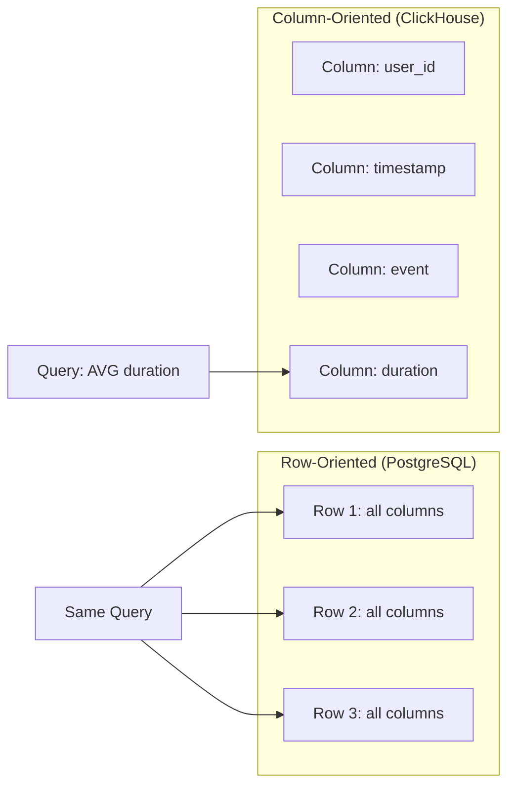
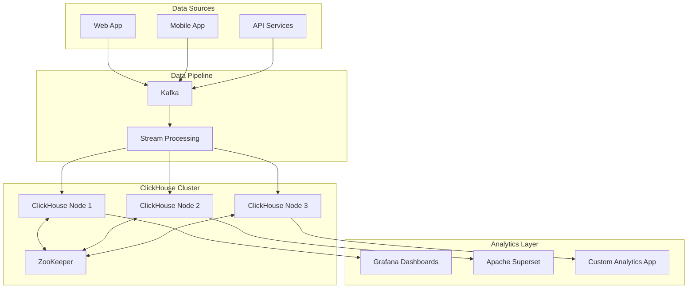

# How to Get Started with ClickHouse for Analytics

Author: [nawazdhandala](https://github.com/nawazdhandala)

Tags: ClickHouse, Analytics, Database, Big Data, SQL, Time Series, OLAP

Description: A practical guide to getting started with ClickHouse for analytics workloads. Learn installation, table design, data loading, and query optimization to build fast analytical systems.

---

If you have ever waited minutes for an analytical query to return results, you know the frustration of traditional databases when faced with billions of rows. ClickHouse solves this problem by being purpose-built for analytical workloads, delivering query results in milliseconds that would take other databases seconds or minutes.

ClickHouse is an open-source column-oriented database management system designed for online analytical processing (OLAP). It was originally developed at Yandex to power their web analytics platform, handling over 600 petabytes of data and processing billions of events per second.

## Why ClickHouse for Analytics?

Before diving into the setup, let's understand what makes ClickHouse different from traditional databases.

### Column-Oriented Storage

Traditional row-oriented databases store data like this:

```
Row 1: user_id=1, timestamp=2024-01-01, event=click, duration=5
Row 2: user_id=2, timestamp=2024-01-01, event=view, duration=10
Row 3: user_id=1, timestamp=2024-01-02, event=click, duration=3
```

ClickHouse stores it by columns:

```
user_id:   [1, 2, 1, ...]
timestamp: [2024-01-01, 2024-01-01, 2024-01-02, ...]
event:     [click, view, click, ...]
duration:  [5, 10, 3, ...]
```

This layout is optimal for analytics because queries typically read a few columns across many rows. When you run `SELECT AVG(duration) FROM events`, ClickHouse only reads the duration column, skipping everything else.



### Compression and Performance

Column storage enables better compression since similar values are stored together. A column of integers compresses much better than mixed data types in a row. ClickHouse typically achieves 10x to 20x compression ratios, meaning 1TB of raw data fits in 50-100GB on disk.

## Installation

### Using Docker (Recommended for Getting Started)

The quickest way to try ClickHouse is with Docker:

```bash
# Pull the official ClickHouse image
docker pull clickhouse/clickhouse-server

# Start ClickHouse server with persistent storage
docker run -d \
  --name clickhouse-server \
  -p 8123:8123 \
  -p 9000:9000 \
  -v clickhouse-data:/var/lib/clickhouse \
  -v clickhouse-logs:/var/log/clickhouse-server \
  clickhouse/clickhouse-server
```

The server exposes two ports:
- Port 8123: HTTP interface for queries and web UI
- Port 9000: Native TCP protocol for high-performance clients

Connect using the ClickHouse client:

```bash
# Start the ClickHouse client
docker exec -it clickhouse-server clickhouse-client
```

### Installing on Ubuntu/Debian

For production deployments, install directly on the host:

```bash
# Add the ClickHouse repository
sudo apt-get install -y apt-transport-https ca-certificates dirmngr
sudo apt-key adv --keyserver hkp://keyserver.ubuntu.com:80 --recv 8919F6BD2B48D754

echo "deb https://packages.clickhouse.com/deb stable main" | sudo tee \
  /etc/apt/sources.list.d/clickhouse.list

# Install ClickHouse server and client
sudo apt-get update
sudo apt-get install -y clickhouse-server clickhouse-client

# Start the service
sudo systemctl start clickhouse-server
sudo systemctl enable clickhouse-server

# Verify it's running
sudo systemctl status clickhouse-server
```

## Creating Your First Table

Let's create a table for web analytics events - a classic ClickHouse use case.

```sql
-- Create a database for our analytics data
CREATE DATABASE IF NOT EXISTS analytics;

-- Switch to the database
USE analytics;

-- Create an events table with MergeTree engine
CREATE TABLE events
(
    -- Primary key columns - used for sorting and indexing
    event_date Date,
    event_time DateTime,
    user_id UInt64,

    -- Event attributes
    event_type LowCardinality(String),
    page_url String,
    referrer String,

    -- Session information
    session_id UUID,

    -- User agent details parsed into separate columns for efficient filtering
    browser LowCardinality(String),
    os LowCardinality(String),
    device_type LowCardinality(String),

    -- Geographic data
    country_code LowCardinality(FixedString(2)),
    city String,

    -- Numeric metrics
    duration_ms UInt32,
    scroll_depth UInt8
)
ENGINE = MergeTree()
-- Partition by month - allows dropping old data efficiently
PARTITION BY toYYYYMM(event_date)
-- Primary key determines physical sort order and sparse index
ORDER BY (event_date, event_type, user_id, event_time)
-- Time-to-live: automatically delete data older than 90 days
TTL event_date + INTERVAL 90 DAY
-- Additional settings for this table
SETTINGS index_granularity = 8192;
```

### Understanding the Table Design

**MergeTree Engine**: The workhorse of ClickHouse. It stores data sorted by the primary key and creates a sparse index for fast lookups.

**PARTITION BY**: Organizes data into chunks. Partitioning by month means you can drop old months instantly without scanning all data.

**ORDER BY**: The most important clause for performance. Columns listed first get the best filtering performance. Order them by:
1. Time columns (most queries filter by date)
2. High-cardinality filter columns
3. Columns used in GROUP BY

**LowCardinality**: A special wrapper type that dictionary-encodes columns with few unique values (like country codes or event types). It dramatically reduces storage and speeds up filtering.

**TTL**: Automatically removes old data. Perfect for analytics where you only need recent history.

## Loading Data

### Inserting Sample Data

```sql
-- Insert some test events
INSERT INTO events VALUES
    (today(), now(), 1001, 'page_view', '/home', 'https://google.com',
     generateUUIDv4(), 'Chrome', 'Windows', 'desktop', 'US', 'New York', 2500, 75),
    (today(), now(), 1002, 'page_view', '/products', 'https://google.com',
     generateUUIDv4(), 'Safari', 'macOS', 'desktop', 'UK', 'London', 3200, 90),
    (today(), now(), 1001, 'click', '/products/item-1', '/products',
     generateUUIDv4(), 'Chrome', 'Windows', 'desktop', 'US', 'New York', 150, 45),
    (today(), now(), 1003, 'page_view', '/home', '',
     generateUUIDv4(), 'Firefox', 'Linux', 'desktop', 'DE', 'Berlin', 1800, 60);
```

### Bulk Loading from CSV

For real workloads, you'll load data in bulk. Create a CSV file:

```bash
# Create a sample CSV file
cat > /tmp/events.csv << 'EOF'
2024-01-15,2024-01-15 10:30:00,1001,page_view,/home,https://google.com,Chrome,Windows,desktop,US,New York,2500,75
2024-01-15,2024-01-15 10:31:00,1002,click,/products,/home,Safari,macOS,desktop,UK,London,150,45
2024-01-15,2024-01-15 10:32:00,1001,page_view,/checkout,,Chrome,Windows,desktop,US,New York,4500,100
EOF
```

Load it into ClickHouse:

```bash
# Load CSV using clickhouse-client
clickhouse-client --query="INSERT INTO analytics.events
    (event_date, event_time, user_id, event_type, page_url, referrer,
     browser, os, device_type, country_code, city, duration_ms, scroll_depth)
    FORMAT CSV" < /tmp/events.csv
```

### Loading from Kafka (Production Pattern)

For real-time analytics, stream data from Kafka:

```sql
-- Create a Kafka table engine to consume messages
CREATE TABLE events_kafka
(
    event_date Date,
    event_time DateTime,
    user_id UInt64,
    event_type String,
    page_url String,
    referrer String,
    browser String,
    os String,
    device_type String,
    country_code String,
    city String,
    duration_ms UInt32,
    scroll_depth UInt8
)
ENGINE = Kafka()
SETTINGS
    kafka_broker_list = 'kafka:9092',
    kafka_topic_list = 'analytics-events',
    kafka_group_name = 'clickhouse-consumer',
    kafka_format = 'JSONEachRow';

-- Create a materialized view to move data from Kafka to MergeTree
CREATE MATERIALIZED VIEW events_consumer TO events AS
SELECT
    event_date,
    event_time,
    user_id,
    event_type,
    page_url,
    referrer,
    -- Generate session ID if not provided
    generateUUIDv4() AS session_id,
    browser,
    os,
    device_type,
    country_code,
    city,
    duration_ms,
    scroll_depth
FROM events_kafka;
```

## Writing Analytical Queries

Now let's run some typical analytics queries.

### Basic Aggregations

```sql
-- Daily unique visitors and page views for the last 7 days
SELECT
    event_date,
    uniqExact(user_id) AS unique_visitors,
    countIf(event_type = 'page_view') AS page_views,
    countIf(event_type = 'click') AS clicks,
    -- Calculate click-through rate
    round(clicks / page_views * 100, 2) AS ctr_percent
FROM events
WHERE event_date >= today() - 7
GROUP BY event_date
ORDER BY event_date DESC;
```

### Funnel Analysis

```sql
-- Conversion funnel: home -> products -> checkout -> purchase
SELECT
    countIf(event_type = 'page_view' AND page_url = '/home') AS step1_home,
    countIf(event_type = 'page_view' AND page_url LIKE '/products%') AS step2_products,
    countIf(event_type = 'page_view' AND page_url = '/checkout') AS step3_checkout,
    countIf(event_type = 'purchase') AS step4_purchase,
    -- Calculate conversion rates between steps
    round(step2_products / step1_home * 100, 2) AS conv_1_to_2,
    round(step3_checkout / step2_products * 100, 2) AS conv_2_to_3,
    round(step4_purchase / step3_checkout * 100, 2) AS conv_3_to_4
FROM events
WHERE event_date = today();
```

### Time Series Aggregation

```sql
-- Hourly traffic breakdown by device type
SELECT
    toStartOfHour(event_time) AS hour,
    device_type,
    count() AS events,
    uniqExact(user_id) AS users,
    avg(duration_ms) AS avg_duration_ms
FROM events
WHERE event_date >= today() - 1
GROUP BY hour, device_type
ORDER BY hour DESC, events DESC;
```

### Top Pages with Engagement Metrics

```sql
-- Most visited pages with engagement metrics
SELECT
    page_url,
    count() AS views,
    uniqExact(user_id) AS unique_visitors,
    avg(duration_ms) AS avg_time_on_page_ms,
    avg(scroll_depth) AS avg_scroll_percent,
    -- Bounce rate: sessions with only one page view
    round(
        countIf(duration_ms < 5000) / count() * 100,
        2
    ) AS bounce_rate_percent
FROM events
WHERE event_type = 'page_view'
    AND event_date >= today() - 7
GROUP BY page_url
ORDER BY views DESC
LIMIT 20;
```

### User Retention Cohorts

```sql
-- Weekly retention cohorts
WITH user_first_week AS (
    SELECT
        user_id,
        toMonday(min(event_date)) AS cohort_week
    FROM events
    GROUP BY user_id
)
SELECT
    cohort_week,
    count(DISTINCT ufw.user_id) AS cohort_size,
    countIf(
        e.event_date >= cohort_week + 7
        AND e.event_date < cohort_week + 14
    ) AS week_1_retained,
    countIf(
        e.event_date >= cohort_week + 14
        AND e.event_date < cohort_week + 21
    ) AS week_2_retained,
    round(week_1_retained / cohort_size * 100, 1) AS week_1_retention_pct,
    round(week_2_retained / cohort_size * 100, 1) AS week_2_retention_pct
FROM user_first_week ufw
LEFT JOIN events e ON ufw.user_id = e.user_id
GROUP BY cohort_week
ORDER BY cohort_week DESC
LIMIT 10;
```

## Query Optimization Tips

### Use PREWHERE for Filtering

PREWHERE reads only the columns needed for filtering before reading the rest. ClickHouse often applies this automatically, but you can be explicit:

```sql
-- PREWHERE reads event_type column first, then only reads
-- matching rows for other columns
SELECT page_url, count()
FROM events
PREWHERE event_type = 'page_view'
WHERE event_date >= today() - 7
GROUP BY page_url;
```

### Sampling for Approximate Results

When you need quick estimates on large datasets:

```sql
-- Sample 10% of data for approximate results
SELECT
    browser,
    count() * 10 AS estimated_count  -- Multiply by inverse of sample rate
FROM events
SAMPLE 0.1
WHERE event_date >= today() - 30
GROUP BY browser
ORDER BY estimated_count DESC;
```

### Check Query Performance

```sql
-- Analyze query execution
EXPLAIN PIPELINE
SELECT event_type, count()
FROM events
WHERE event_date = today()
GROUP BY event_type;

-- See which parts were scanned
SELECT
    query,
    read_rows,
    read_bytes,
    result_rows,
    query_duration_ms
FROM system.query_log
WHERE query LIKE '%events%'
    AND type = 'QueryFinish'
ORDER BY event_time DESC
LIMIT 10;
```

## Architecture Overview

Here's how ClickHouse fits into a typical analytics architecture:



## Monitoring ClickHouse

Keep an eye on these system tables:

```sql
-- Current running queries
SELECT
    query_id,
    user,
    elapsed,
    read_rows,
    memory_usage,
    query
FROM system.processes;

-- Table sizes and compression
SELECT
    database,
    table,
    formatReadableSize(sum(bytes_on_disk)) AS size_on_disk,
    formatReadableSize(sum(data_uncompressed_bytes)) AS uncompressed_size,
    round(sum(data_uncompressed_bytes) / sum(bytes_on_disk), 2) AS compression_ratio,
    sum(rows) AS total_rows
FROM system.parts
WHERE active
GROUP BY database, table
ORDER BY sum(bytes_on_disk) DESC;

-- Part merges in progress
SELECT
    database,
    table,
    elapsed,
    progress,
    num_parts,
    result_part_name
FROM system.merges;
```

## Best Practices Summary

| Area | Recommendation |
|------|----------------|
| **Table Design** | Put time columns first in ORDER BY, use LowCardinality for enum-like strings |
| **Data Types** | Use smallest type that fits (UInt32 vs UInt64), FixedString for fixed-length |
| **Partitioning** | Partition by time (month/week), keep partition count under 1000 |
| **Loading** | Batch inserts of 10K-100K rows, avoid single-row inserts |
| **Queries** | Filter by primary key columns, use LIMIT, leverage approximate functions |
| **Monitoring** | Watch system.query_log, system.merges, disk space |

## What's Next?

You now have a working ClickHouse instance and understand the fundamentals. From here, you might explore:

- **Materialized Views**: Pre-aggregate data for instant dashboard queries
- **Distributed Tables**: Scale horizontally across multiple nodes
- **Dictionary Functions**: Join with dimension tables efficiently
- **Window Functions**: Advanced analytics like running totals and percentiles

ClickHouse excels when you design your schema around your query patterns. Spend time thinking about your most common queries, then structure your tables to make those queries fast. The payoff is analytics that feel instantaneous, even across billions of rows.
