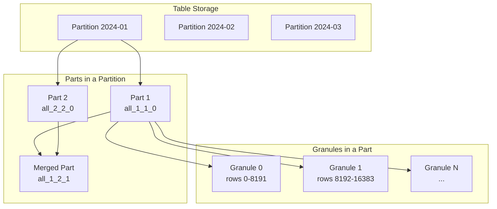
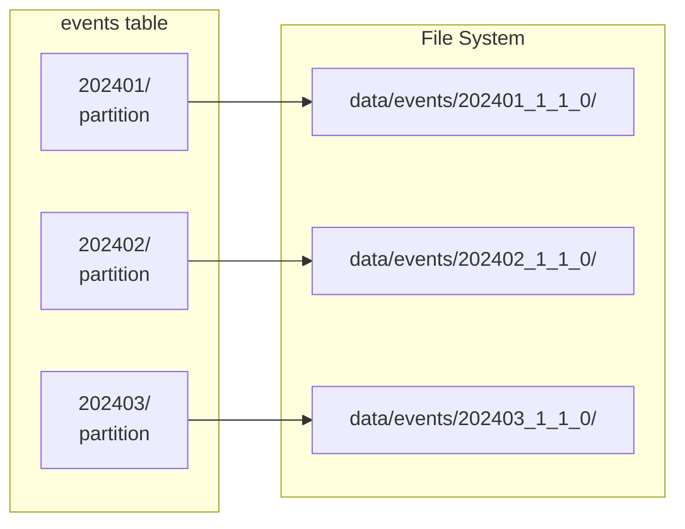
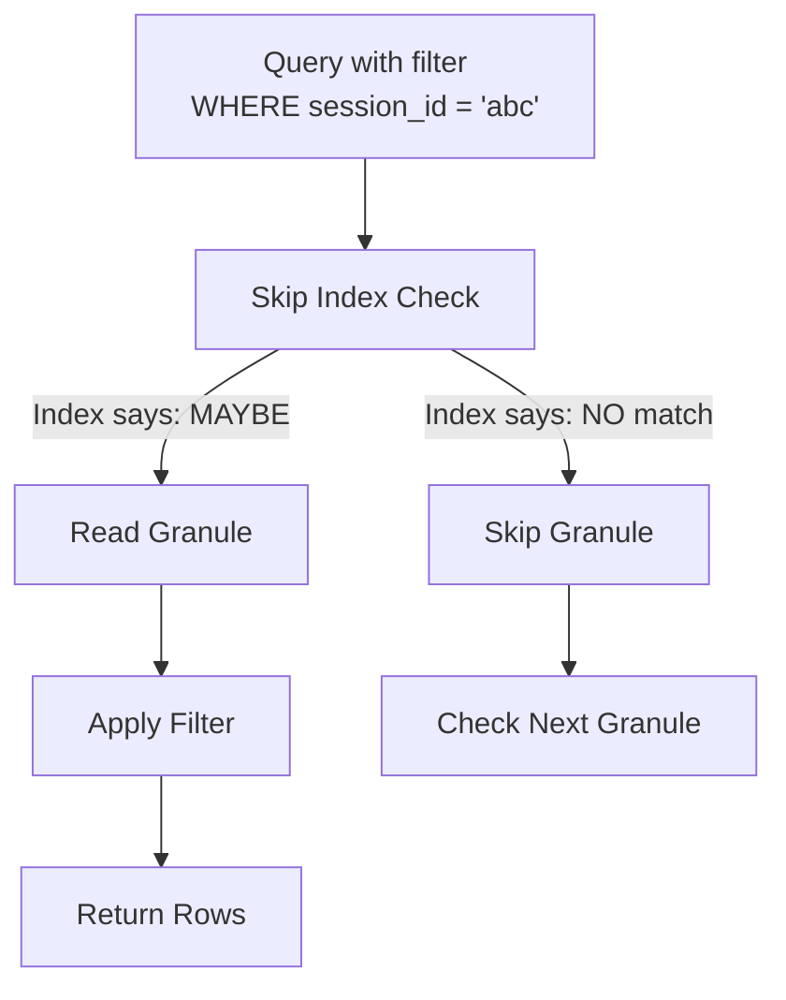
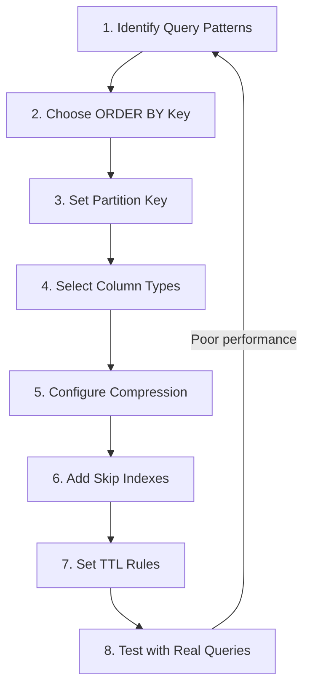

# How to Design ClickHouse Tables for Performance

Author: [nawazdhandala](https://www.github.com/nawazdhandala)

Tags: ClickHouse, Database Design, Performance Optimization, Analytics, Schema Design, MergeTree

Description: A comprehensive guide to designing ClickHouse tables for optimal query performance, covering primary keys, ordering keys, partitioning, compression, and real-world schema patterns.

---

ClickHouse is built for speed, but that speed depends heavily on how you design your tables. A poorly designed schema can make queries 100x slower than they need to be, while a well-designed one can return results over billions of rows in milliseconds. This guide covers the key decisions you need to make when designing ClickHouse tables for production workloads.

## Understanding ClickHouse Storage Architecture

Before diving into table design, you need to understand how ClickHouse stores data. This knowledge directly informs every design decision.



Key concepts:

| Component | Description | Size |
|-----------|-------------|------|
| **Table** | Contains all data, divided into partitions | Unlimited |
| **Partition** | Logical division based on partition key | Days/months of data |
| **Part** | Physical data files, immutable once written | Hundreds of MB |
| **Granule** | Smallest unit of data reading | 8,192 rows default |

ClickHouse reads data in granules. When you query, it first identifies which granules might contain matching rows using sparse indexes, then reads only those granules. The goal of table design is to minimize the number of granules ClickHouse needs to read.

## The ORDER BY Key: Your Most Important Decision

The `ORDER BY` key determines how data is physically sorted on disk. This is the single most important factor for query performance.

### How the ORDER BY Key Works

When data is inserted, ClickHouse sorts it by the ORDER BY columns and stores a sparse index. This index contains one entry per granule (every 8,192 rows by default), recording the minimum value of the ORDER BY key in that granule.

```sql
-- Create a table with an ORDER BY key
CREATE TABLE events (
    event_date Date,
    user_id UInt64,
    event_type String,
    properties String,
    created_at DateTime
) ENGINE = MergeTree()
PARTITION BY toYYYYMM(event_date)
ORDER BY (event_date, user_id, event_type);
```

With this ORDER BY key, queries filtering on `event_date`, `user_id`, or `event_type` can skip entire granules. But the order matters.

### ORDER BY Key Ordering Rules

The ORDER BY key follows a leftmost prefix rule. Filtering works efficiently only when you filter on a prefix of the key:

```sql
-- These queries use the index efficiently:
SELECT * FROM events WHERE event_date = '2024-01-15';  -- Uses first column
SELECT * FROM events WHERE event_date = '2024-01-15' AND user_id = 12345;  -- Uses first two
SELECT * FROM events WHERE event_date = '2024-01-15' AND user_id = 12345 AND event_type = 'click';  -- Uses all three

-- This query CANNOT use the index efficiently:
SELECT * FROM events WHERE user_id = 12345;  -- Skips event_date, scans all data
SELECT * FROM events WHERE event_type = 'click';  -- Skips both, scans all data
```

### Choosing ORDER BY Columns

Put columns in this order:

1. **Columns you always filter on** - These should come first
2. **Columns you often filter on** - Put these after the always-filtered ones
3. **Columns with lower cardinality first** - Among equally-important columns, lower cardinality first improves compression

```sql
-- Example: An e-commerce events table
-- Most queries filter by tenant and date, sometimes by user
CREATE TABLE ecommerce_events (
    tenant_id UInt32,           -- Always filtered (multi-tenant)
    event_date Date,            -- Always filtered (time range)
    user_id UInt64,             -- Often filtered
    session_id String,          -- Sometimes filtered
    event_type LowCardinality(String),
    page_url String,
    created_at DateTime64(3)
) ENGINE = MergeTree()
PARTITION BY toYYYYMM(event_date)
ORDER BY (tenant_id, event_date, user_id, session_id);
```

### Measuring ORDER BY Effectiveness

Use `EXPLAIN` to see how many granules ClickHouse reads:

```sql
EXPLAIN indexes = 1
SELECT count() FROM events
WHERE event_date = '2024-01-15' AND user_id = 12345;

-- Look for "Granules" in the output
-- Selected: 4 / 10000 means only 4 granules out of 10,000 are read
```

## Partitioning Strategy

Partitions divide your table into separate physical directories. Each partition contains independent parts.



### Partition Key Guidelines

Good partition keys:

```sql
-- Monthly partitioning for most time-series data
PARTITION BY toYYYYMM(event_date)

-- Daily partitioning for high-volume ingestion (100M+ rows/day)
PARTITION BY toYYYYMMDD(event_date)

-- Composite partitioning for multi-tenant systems
PARTITION BY (tenant_id, toYYYYMM(event_date))
```

Avoid these partition key mistakes:

| Mistake | Problem | Fix |
|---------|---------|-----|
| **Too many partitions** | Thousands of small parts, slow merges | Use coarser granularity |
| **High cardinality key** | Partition per user = disaster | Never partition by user_id |
| **No time component** | Cannot use TTL for data lifecycle | Always include time |

### How Many Partitions Are Too Many?

As a rule of thumb:
- Keep partition count under 1,000 for any table
- Each partition should have at least 10 million rows
- If you have fewer than 1 million rows per partition, your partitions are too fine

Check your partition health:

```sql
-- See partition sizes
SELECT
    partition,
    count() as parts,
    sum(rows) as total_rows,
    formatReadableSize(sum(data_compressed_bytes)) as compressed,
    formatReadableSize(sum(data_uncompressed_bytes)) as uncompressed
FROM system.parts
WHERE table = 'events' AND active
GROUP BY partition
ORDER BY partition;
```

## Choosing Column Types for Performance

ClickHouse offers many data types. Choosing the right ones affects both storage size and query speed.

### Numeric Types

Use the smallest type that fits your data:

```sql
-- Instead of this:
CREATE TABLE inefficient (
    id Int64,           -- 8 bytes, often overkill
    count Int64,        -- 8 bytes
    price Float64,      -- 8 bytes
    percentage Float64  -- 8 bytes
);

-- Use this:
CREATE TABLE efficient (
    id UInt32,              -- 4 bytes, handles 4 billion values
    count UInt16,           -- 2 bytes, handles up to 65,535
    price Decimal(10,2),    -- Fixed precision, no floating point errors
    percentage UInt8        -- 1 byte, store as 0-100 instead of 0.0-1.0
);
```

### String Types

Strings are often the biggest storage consumers. Use LowCardinality for columns with repeated values:

```sql
-- Standard String: stores each value independently
event_type String  -- "click", "view", "purchase" stored as strings

-- LowCardinality: stores dictionary + references
event_type LowCardinality(String)  -- Dictionary: 0="click", 1="view", 2="purchase"
                                   -- Data: 0, 1, 0, 2, 1, 0, ...
```

LowCardinality is beneficial when:
- Column has fewer than 10,000 distinct values
- Values repeat frequently
- You filter or group by this column

```sql
-- Example table with optimized string types
CREATE TABLE web_logs (
    timestamp DateTime64(3),
    -- Low cardinality strings
    method LowCardinality(String),          -- GET, POST, PUT, DELETE
    status_code LowCardinality(String),     -- 200, 404, 500, etc.
    country LowCardinality(String),         -- US, UK, DE, etc.
    browser LowCardinality(String),         -- Chrome, Firefox, Safari
    -- High cardinality strings (keep as regular String)
    url String,                              -- Many unique URLs
    user_agent String,                       -- Many variations
    request_id UUID                          -- Unique per request
) ENGINE = MergeTree()
ORDER BY (timestamp);
```

### DateTime Types

Choose precision based on your needs:

```sql
-- Date only (3 bytes)
event_date Date              -- 2024-01-15

-- Seconds precision (4 bytes)
created_at DateTime          -- 2024-01-15 14:30:00

-- Milliseconds precision (8 bytes)
started_at DateTime64(3)     -- 2024-01-15 14:30:00.123

-- Microseconds precision (8 bytes)
measured_at DateTime64(6)    -- 2024-01-15 14:30:00.123456
```

For most analytics, `DateTime` (seconds) is sufficient. Use `DateTime64` only when sub-second precision matters.

## Compression Settings

ClickHouse compresses data by column. The default LZ4 compression is fast but not the most space-efficient. You can tune compression per column.

```sql
CREATE TABLE metrics (
    timestamp DateTime,
    -- Use ZSTD for large text columns (better compression)
    message String CODEC(ZSTD(3)),
    -- Use Delta + ZSTD for monotonically increasing values
    counter UInt64 CODEC(Delta, ZSTD),
    -- Use DoubleDelta for timestamps (very common pattern)
    event_time DateTime CODEC(DoubleDelta, LZ4),
    -- Use Gorilla for floating point metrics
    cpu_usage Float32 CODEC(Gorilla, LZ4),
    -- Keep LZ4 for high-cardinality strings (fast decompression)
    request_id UUID CODEC(LZ4)
) ENGINE = MergeTree()
ORDER BY timestamp;
```

Compression codec recommendations:

| Data Pattern | Recommended Codec | Reason |
|--------------|-------------------|--------|
| Monotonic integers | Delta + ZSTD | Stores differences, highly compressible |
| Timestamps | DoubleDelta + LZ4 | Double differencing for time series |
| Float metrics | Gorilla + LZ4 | XOR-based, great for similar values |
| Large text | ZSTD(3) | High compression, acceptable speed |
| Random UUIDs | LZ4 | Fast, incompressible data anyway |

Check compression effectiveness:

```sql
SELECT
    column,
    formatReadableSize(data_compressed_bytes) as compressed,
    formatReadableSize(data_uncompressed_bytes) as uncompressed,
    round(data_uncompressed_bytes / data_compressed_bytes, 2) as ratio
FROM system.columns
WHERE table = 'metrics'
ORDER BY data_uncompressed_bytes DESC;
```

## Real-World Schema Examples

### Example 1: Application Events Table

A table for tracking user behavior in a SaaS application:

```sql
CREATE TABLE app_events (
    -- Identifiers
    tenant_id UInt32,                              -- Multi-tenant support
    user_id UInt64,
    session_id UUID,
    event_id UUID,

    -- Time
    event_date Date,
    event_time DateTime64(3),

    -- Event metadata
    event_type LowCardinality(String),             -- page_view, click, purchase
    event_category LowCardinality(String),         -- navigation, engagement, conversion

    -- Context
    page_url String,
    referrer String,
    device_type LowCardinality(String),            -- mobile, desktop, tablet
    os LowCardinality(String),
    browser LowCardinality(String),
    country LowCardinality(String),

    -- Event-specific properties (flexible schema)
    properties String CODEC(ZSTD(3)),              -- JSON blob

    -- Metrics
    duration_ms UInt32,
    scroll_depth UInt8
) ENGINE = MergeTree()
PARTITION BY toYYYYMM(event_date)
ORDER BY (tenant_id, event_date, user_id, event_type)
TTL event_date + INTERVAL 90 DAY
SETTINGS index_granularity = 8192;
```

Typical queries this schema optimizes:

```sql
-- Query 1: Daily active users per tenant (fast: uses full ORDER BY prefix)
SELECT
    event_date,
    uniq(user_id) as dau
FROM app_events
WHERE tenant_id = 123
  AND event_date >= today() - 30
GROUP BY event_date;

-- Query 2: User journey (fast: uses tenant + date + user)
SELECT
    event_time,
    event_type,
    page_url
FROM app_events
WHERE tenant_id = 123
  AND event_date = today()
  AND user_id = 456789
ORDER BY event_time;

-- Query 3: Conversion funnel (fast: uses tenant + date + event_type)
SELECT
    event_type,
    uniq(user_id) as users
FROM app_events
WHERE tenant_id = 123
  AND event_date >= today() - 7
  AND event_type IN ('page_view', 'add_to_cart', 'checkout', 'purchase')
GROUP BY event_type;
```

### Example 2: Infrastructure Metrics Table

A table for storing server metrics:

```sql
CREATE TABLE infra_metrics (
    -- Time (most important for metrics)
    timestamp DateTime,

    -- Dimensions (low cardinality identifiers)
    datacenter LowCardinality(String),
    cluster LowCardinality(String),
    host LowCardinality(String),
    metric_name LowCardinality(String),

    -- Tags (flexible dimensions)
    tags Map(LowCardinality(String), String),

    -- Values (using appropriate codecs)
    value Float64 CODEC(Gorilla, LZ4),

    -- Aggregation helpers
    count UInt64 CODEC(Delta, LZ4),
    sum Float64 CODEC(Gorilla, LZ4),
    min Float64 CODEC(Gorilla, LZ4),
    max Float64 CODEC(Gorilla, LZ4)
) ENGINE = MergeTree()
PARTITION BY toYYYYMMDD(timestamp)
ORDER BY (datacenter, cluster, host, metric_name, timestamp)
TTL timestamp + INTERVAL 30 DAY DELETE,
    timestamp + INTERVAL 7 DAY TO VOLUME 'cold'
SETTINGS index_granularity = 8192;
```

This schema supports typical monitoring queries:

```sql
-- Query: CPU usage for a specific host over time
SELECT
    toStartOfMinute(timestamp) as minute,
    avg(value) as avg_cpu
FROM infra_metrics
WHERE datacenter = 'us-east-1'
  AND cluster = 'web-prod'
  AND host = 'web-prod-001'
  AND metric_name = 'cpu_usage'
  AND timestamp >= now() - INTERVAL 1 HOUR
GROUP BY minute
ORDER BY minute;
```

### Example 3: Log Storage Table

A table optimized for log ingestion and search:

```sql
CREATE TABLE logs (
    -- Time-based ordering
    timestamp DateTime64(3),

    -- Log identifiers
    service LowCardinality(String),
    instance LowCardinality(String),
    trace_id String,
    span_id String,

    -- Log content
    level LowCardinality(String),
    message String CODEC(ZSTD(3)),

    -- Structured fields
    attributes Map(String, String) CODEC(ZSTD(3)),

    -- Search optimization
    message_tokens Array(String) MATERIALIZED splitByNonAlpha(lower(message))
) ENGINE = MergeTree()
PARTITION BY toYYYYMMDD(timestamp)
ORDER BY (service, level, timestamp)
TTL timestamp + INTERVAL 14 DAY
SETTINGS index_granularity = 8192;

-- Add skip indexes for text search
ALTER TABLE logs ADD INDEX idx_message message TYPE tokenbf_v1(32768, 3, 0) GRANULARITY 4;
ALTER TABLE logs ADD INDEX idx_trace_id trace_id TYPE bloom_filter(0.01) GRANULARITY 1;
```

## Skip Indexes for Additional Filtering

When you need to filter on columns not in the ORDER BY key, skip indexes help ClickHouse skip granules:

```sql
-- Add skip indexes to existing table
ALTER TABLE app_events
    ADD INDEX idx_session session_id TYPE bloom_filter(0.01) GRANULARITY 4,
    ADD INDEX idx_url page_url TYPE tokenbf_v1(10240, 3, 0) GRANULARITY 4,
    ADD INDEX idx_country country TYPE set(100) GRANULARITY 4;
```

Skip index types:

| Index Type | Use Case | Example |
|------------|----------|---------|
| **minmax** | Range queries on sorted values | `WHERE amount > 100` |
| **set(N)** | Equality on low cardinality | `WHERE country = 'US'` |
| **bloom_filter** | Equality on high cardinality | `WHERE user_id = 123` |
| **tokenbf_v1** | Text search / substring matching | `WHERE message LIKE '%error%'` |
| **ngrambf_v1** | Fuzzy text matching | `WHERE url LIKE '%/api/%'` |



Skip indexes cannot prove a value exists, they can only prove a value definitely does not exist. This means false positives are possible but false negatives are not.

## Putting It All Together: Design Checklist

When designing a new ClickHouse table, follow this checklist:



### Step-by-Step Checklist

1. **Identify your query patterns**
   - What columns do you always filter on?
   - What columns do you sometimes filter on?
   - What are your GROUP BY columns?
   - What time ranges do you typically query?

2. **Design your ORDER BY key**
   - Put always-filtered columns first
   - Put lower cardinality columns before higher cardinality
   - Include columns used in GROUP BY

3. **Set your partition key**
   - Use time-based partitioning (monthly for most cases)
   - Add tenant_id for multi-tenant systems
   - Keep total partitions under 1,000

4. **Choose optimal column types**
   - Use smallest numeric types that fit
   - Use LowCardinality for repeated strings
   - Use appropriate DateTime precision

5. **Configure compression**
   - Use Delta/DoubleDelta for sequences
   - Use Gorilla for metrics
   - Use ZSTD for large text

6. **Add skip indexes**
   - bloom_filter for high-cardinality lookups
   - set() for low-cardinality filters
   - tokenbf_v1 for text search

7. **Set TTL rules**
   - Delete old data automatically
   - Move cold data to cheaper storage

8. **Test with real queries**
   - Use EXPLAIN to verify granule filtering
   - Measure query times with representative data
   - Iterate on design based on results

## Common Mistakes to Avoid

### Mistake 1: Wrong ORDER BY Column Order

```sql
-- BAD: user_id first, but most queries filter by date
ORDER BY (user_id, event_date, event_type)

-- Query: SELECT * FROM events WHERE event_date = today()
-- Result: Full table scan (cannot skip any granules)

-- GOOD: date first since all queries filter by date
ORDER BY (event_date, user_id, event_type)
```

### Mistake 2: Over-Partitioning

```sql
-- BAD: Daily partitioning with low volume
PARTITION BY toYYYYMMDD(timestamp)  -- Creates 365 partitions/year

-- With only 100K rows/day, you get tiny partitions
-- Merges become slow, metadata overhead increases

-- GOOD: Monthly partitioning for moderate volume
PARTITION BY toYYYYMM(timestamp)  -- Creates 12 partitions/year
```

### Mistake 3: Missing LowCardinality

```sql
-- BAD: Repeated strings stored independently
CREATE TABLE events (
    event_type String,  -- "click" stored 1 million times
    country String      -- "US" stored 500K times
);

-- GOOD: Dictionary encoding for repeated values
CREATE TABLE events (
    event_type LowCardinality(String),  -- Dictionary + references
    country LowCardinality(String)
);
```

### Mistake 4: Ignoring Compression Codecs

```sql
-- BAD: Default compression for all columns
CREATE TABLE metrics (
    timestamp DateTime,
    value Float64,
    counter UInt64
);

-- GOOD: Appropriate codecs per column type
CREATE TABLE metrics (
    timestamp DateTime CODEC(DoubleDelta, LZ4),
    value Float64 CODEC(Gorilla, LZ4),
    counter UInt64 CODEC(Delta, ZSTD)
);
```

## Measuring Performance

After creating your table, validate the design:

```sql
-- Check how many granules a query reads
EXPLAIN indexes = 1
SELECT count() FROM your_table
WHERE your_typical_filter_conditions;

-- Measure query execution time
SELECT *
FROM your_table
WHERE your_typical_filter_conditions
FORMAT Null;  -- Discards output, shows timing

-- Check part sizes and compression
SELECT
    partition,
    count() as parts,
    sum(rows) as rows,
    formatReadableSize(sum(data_compressed_bytes)) as compressed,
    round(sum(data_uncompressed_bytes) / sum(data_compressed_bytes), 2) as ratio
FROM system.parts
WHERE table = 'your_table' AND active
GROUP BY partition
ORDER BY partition;
```

## Summary

Designing ClickHouse tables for performance comes down to understanding how the storage engine works and aligning your schema with your query patterns:

| Design Element | Key Principle |
|----------------|---------------|
| **ORDER BY key** | Put always-filtered columns first, lower cardinality before higher |
| **Partitioning** | Use time-based partitions, avoid over-partitioning |
| **Column types** | Smallest type that fits, LowCardinality for repeated strings |
| **Compression** | Match codec to data pattern (Delta for sequences, Gorilla for floats) |
| **Skip indexes** | Add for columns not in ORDER BY that you filter on |

The best way to learn is to experiment. Create test tables with sample data, run your actual queries, and use EXPLAIN to understand what ClickHouse is doing. Iterate on your design until queries scan the minimum number of granules needed.
