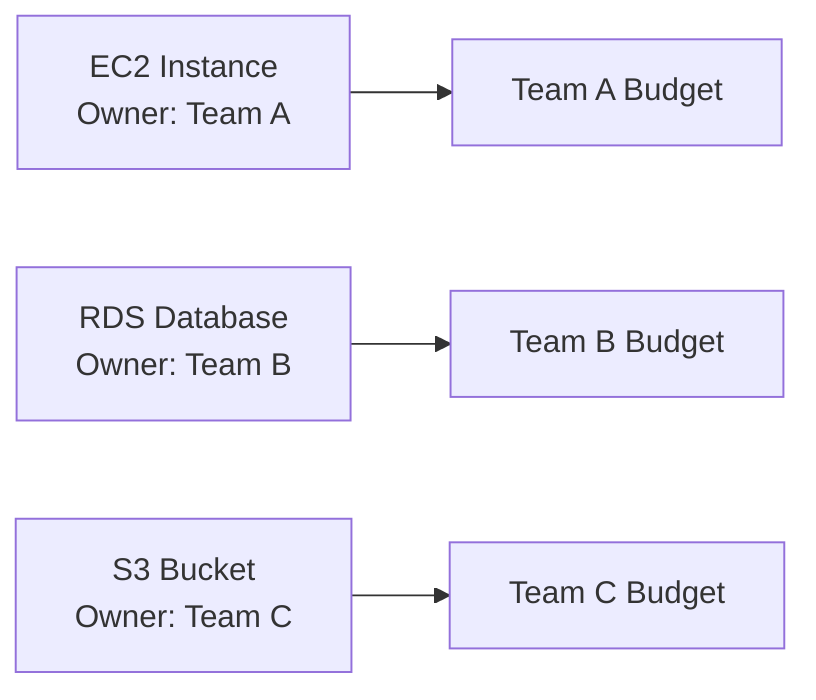
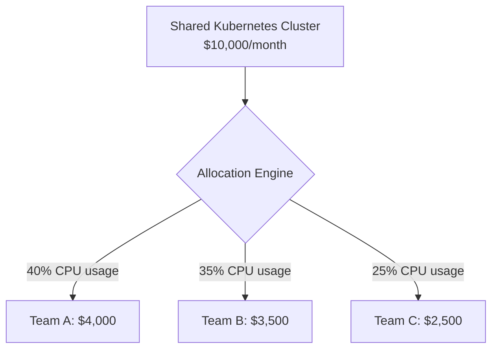
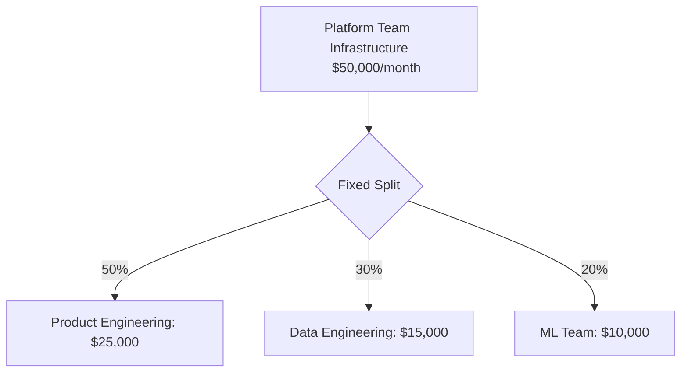
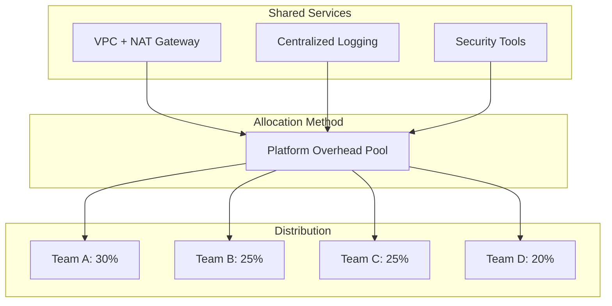

# How to Implement Cloud Cost Allocation

Author: [nawazdhandala](https://www.github.com/nawazdhandala)

Tags: Cloud Cost Management, FinOps, Cost Allocation, AWS, Azure, GCP, Tagging, Chargeback, Showback

Description: A practical guide to implementing cloud cost allocation across teams and projects. Learn tagging strategies, allocation models, and automation techniques to bring accountability to your cloud spend.

---

## Why Cost Allocation Matters

Cloud spending without accountability tends to grow unchecked. When nobody owns the bill, nobody optimizes. Cost allocation changes that by connecting spending to the teams, products, and customers that generate it.

The benefits are straightforward:

- Engineering teams understand their infrastructure footprint
- Finance gets accurate cost data for budgeting and forecasting
- Product managers can calculate true unit economics
- Leadership can make informed build-vs-buy decisions

This guide walks through how to implement cost allocation from scratch, with practical examples you can adapt to your organization.

## The Foundation: A Tagging Strategy

Tags are the building blocks of cost allocation. Every resource in your cloud account needs consistent metadata that answers three questions:

1. Who owns this resource?
2. What project or product does it support?
3. What environment is it running in?

### Essential Tag Keys

Start with these five tags on every resource:

```yaml
# Minimum viable tagging schema
Owner: platform-team
Project: checkout-service
Environment: production
CostCenter: engineering-12345
Application: ecommerce-backend
```

### Expanded Tagging for Mature Organizations

As your allocation needs grow, add these secondary tags:

```yaml
# Extended tagging schema
Owner: platform-team
Project: checkout-service
Environment: production
CostCenter: engineering-12345
Application: ecommerce-backend
Component: payment-processor
Team: backend-payments
Customer: internal
Lifecycle: permanent
CreatedBy: terraform
```

### Naming Conventions That Scale

Consistency matters more than perfection. Pick a convention and enforce it:

| Approach | Example | Pros | Cons |
|----------|---------|------|------|
| Lowercase with hyphens | `checkout-service` | Easy to type, URL-safe | Can conflict with some tools |
| CamelCase | `CheckoutService` | Readable | Case sensitivity issues |
| Lowercase with underscores | `checkout_service` | Database-friendly | Harder to read in dashboards |

My recommendation: lowercase with hyphens. It works everywhere and reads well in cost reports.

## Implementing Tags Across Cloud Providers

### AWS Tagging

AWS supports up to 50 tags per resource. Use AWS Organizations Tag Policies to enforce your schema:

```json
{
  "tags": {
    "Environment": {
      "tag_key": {
        "@@assign": "Environment"
      },
      "tag_value": {
        "@@assign": [
          "production",
          "staging",
          "development",
          "sandbox"
        ]
      },
      "enforced_for": {
        "@@assign": [
          "ec2:instance",
          "rds:db",
          "s3:bucket",
          "lambda:function"
        ]
      }
    }
  }
}
```

Enable Cost Allocation Tags in the AWS Billing Console. Tags take 24 hours to appear in Cost Explorer after activation.

### Azure Tagging

Azure uses Resource Groups as an additional allocation layer. Combine tags with resource group naming:

```bash
# Resource group naming convention
rg-{project}-{environment}-{region}
# Example: rg-checkout-prod-eastus

# Apply tags via Azure CLI
az resource tag --tags \
  Owner=platform-team \
  Project=checkout-service \
  Environment=production \
  CostCenter=engineering-12345 \
  --ids /subscriptions/{sub-id}/resourceGroups/{rg-name}
```

Use Azure Policy to require tags at resource creation:

```json
{
  "if": {
    "allOf": [
      {
        "field": "type",
        "equals": "Microsoft.Compute/virtualMachines"
      },
      {
        "field": "tags['Environment']",
        "exists": "false"
      }
    ]
  },
  "then": {
    "effect": "deny"
  }
}
```

### GCP Labeling

GCP calls tags "labels" and supports 64 per resource:

```bash
# Apply labels via gcloud
gcloud compute instances update my-instance \
  --update-labels=owner=platform-team,project=checkout-service,environment=production

# Or in Terraform
resource "google_compute_instance" "default" {
  name         = "checkout-api"
  machine_type = "e2-medium"

  labels = {
    owner       = "platform-team"
    project     = "checkout-service"
    environment = "production"
    cost_center = "engineering-12345"
  }
}
```

## Choosing an Allocation Model

With tags in place, decide how to distribute costs. Three models dominate:

### Direct Allocation

Costs go directly to the team whose tags appear on the resource. Simple and accurate for dedicated resources.



**Best for:** Dedicated infrastructure, clear ownership, mature tagging.

### Proportional Allocation

Shared resources get split based on usage metrics. Requires usage tracking but reflects reality better.



**Best for:** Shared infrastructure, multi-tenant systems, Kubernetes clusters.

### Fixed-Percentage Allocation

Predetermined splits that ignore actual usage. Simple but can create unfair distributions.



**Best for:** Overhead costs, executive agreement on cost sharing, bootstrap allocation before metrics exist.

## Handling Untagged and Shared Resources

### The Untagged Resource Problem

Untagged resources break cost allocation. Attack this problem from multiple angles:

**Prevention:** Use cloud policies to block untagged resource creation.

```hcl
# Terraform example - require tags on all resources
variable "required_tags" {
  type = map(string)
  default = {
    Owner       = ""
    Project     = ""
    Environment = ""
    CostCenter  = ""
  }
}

resource "aws_instance" "example" {
  ami           = "ami-12345678"
  instance_type = "t3.micro"

  tags = merge(var.required_tags, {
    Name = "example-instance"
  })

  lifecycle {
    precondition {
      condition     = var.required_tags["Owner"] != ""
      error_message = "Owner tag is required"
    }
  }
}
```

**Detection:** Run weekly reports to find untagged resources.

```bash
# AWS CLI - find untagged EC2 instances
aws ec2 describe-instances \
  --query 'Reservations[].Instances[?!not_null(Tags[?Key==`Owner`].Value)].[InstanceId,State.Name]' \
  --output table
```

**Remediation:** Assign untagged costs to a central "unallocated" bucket and make teams claim their resources.

### Shared Services Allocation

Shared infrastructure like networking, logging, and security tools needs special handling:



Options for shared services:

1. **Overhead pool:** Distribute evenly or by headcount
2. **Usage-based:** Track actual consumption where possible
3. **Exclude from allocation:** Treat as company infrastructure cost

## Building the Allocation Pipeline

### Data Collection

Pull cost data from your cloud provider's billing APIs:

```python
import boto3
from datetime import datetime, timedelta

def get_tagged_costs(start_date, end_date):
    client = boto3.client('ce')

    response = client.get_cost_and_usage(
        TimePeriod={
            'Start': start_date,
            'End': end_date
        },
        Granularity='DAILY',
        Metrics=['UnblendedCost'],
        GroupBy=[
            {'Type': 'TAG', 'Key': 'Project'},
            {'Type': 'TAG', 'Key': 'Environment'}
        ]
    )

    return response['ResultsByTime']

# Get last month's costs by project and environment
costs = get_tagged_costs(
    (datetime.now() - timedelta(days=30)).strftime('%Y-%m-%d'),
    datetime.now().strftime('%Y-%m-%d')
)
```

### Processing and Enrichment

Transform raw billing data into allocation-ready records:

```python
def process_cost_record(record):
    """
    Transform raw cost data into allocation record
    """
    project = record.get('Project', 'untagged')
    environment = record.get('Environment', 'unknown')
    cost = float(record.get('UnblendedCost', {}).get('Amount', 0))

    # Map project to team via lookup table
    team_mapping = {
        'checkout-service': 'backend-payments',
        'user-service': 'backend-identity',
        'analytics-pipeline': 'data-engineering'
    }

    team = team_mapping.get(project, 'unassigned')

    return {
        'project': project,
        'environment': environment,
        'team': team,
        'cost': cost,
        'allocated_date': datetime.now().isoformat()
    }
```

### Reporting and Visualization

Generate reports that drive action:

```python
def generate_team_report(allocated_costs, team):
    """
    Generate cost summary for a specific team
    """
    team_costs = [c for c in allocated_costs if c['team'] == team]

    by_project = {}
    by_environment = {}

    for cost in team_costs:
        project = cost['project']
        env = cost['environment']
        amount = cost['cost']

        by_project[project] = by_project.get(project, 0) + amount
        by_environment[env] = by_environment.get(env, 0) + amount

    return {
        'team': team,
        'total': sum(c['cost'] for c in team_costs),
        'by_project': by_project,
        'by_environment': by_environment,
        'top_projects': sorted(
            by_project.items(),
            key=lambda x: x[1],
            reverse=True
        )[:5]
    }
```

## Showback vs Chargeback

Two approaches to making costs visible:

### Showback

Teams see their costs but do not pay from their budget. Good for building cost awareness before accountability.

**Pros:**
- Low friction to implement
- Builds cost awareness gradually
- No budget transfer complexity

**Cons:**
- Less incentive to optimize
- Can be ignored without consequences

### Chargeback

Costs transfer to team budgets. Real financial accountability.

**Pros:**
- Strong optimization incentive
- Accurate product economics
- Clear ownership

**Cons:**
- Requires finance team involvement
- Can create gaming behavior
- Needs accurate allocation first

**My recommendation:** Start with showback for 2-3 quarters while perfecting your tagging and allocation. Move to chargeback once accuracy reaches 90%+ tagged resources.

## Automation and Governance

### Automated Tag Compliance

Build a compliance bot that runs daily:

```python
def check_tag_compliance():
    """
    Check all resources for required tags
    """
    required_tags = ['Owner', 'Project', 'Environment', 'CostCenter']
    violations = []

    # Check EC2 instances
    ec2 = boto3.client('ec2')
    instances = ec2.describe_instances()

    for reservation in instances['Reservations']:
        for instance in reservation['Instances']:
            instance_id = instance['InstanceId']
            tags = {t['Key']: t['Value'] for t in instance.get('Tags', [])}

            missing = [t for t in required_tags if t not in tags]
            if missing:
                violations.append({
                    'resource_type': 'ec2:instance',
                    'resource_id': instance_id,
                    'missing_tags': missing
                })

    return violations

def notify_violations(violations):
    """
    Send Slack notification for tag violations
    """
    if not violations:
        return

    message = f"Found {len(violations)} untagged resources:\n"
    for v in violations[:10]:  # Limit to first 10
        message += f"- {v['resource_type']}: {v['resource_id']} missing {v['missing_tags']}\n"

    # Send to Slack webhook
    requests.post(SLACK_WEBHOOK, json={'text': message})
```

### Budget Alerts

Connect allocation data to alerting:

```yaml
# Example: OneUptime alert configuration
name: Team Budget Alert
type: threshold
metric: allocated_cost_daily
group_by: team
conditions:
  - team: backend-payments
    threshold: 500
    comparison: greater_than
    period: daily
  - team: data-engineering
    threshold: 1000
    comparison: greater_than
    period: daily
notification:
  channels:
    - slack-finops
    - email-team-leads
```

## Common Pitfalls and How to Avoid Them

### Pitfall 1: Over-Engineering the Tagging Schema

Starting with 20 required tags guarantees poor compliance. Begin with 4-5 essential tags and expand based on actual reporting needs.

### Pitfall 2: Ignoring Container and Serverless Costs

Kubernetes pods and Lambda functions need allocation too. Use namespace labels for Kubernetes and function tags for serverless.

### Pitfall 3: Monthly-Only Reporting

Monthly reports are too slow for optimization. Provide daily cost visibility so teams can react to anomalies.

### Pitfall 4: No Baseline Comparison

Raw numbers mean nothing without context. Always show month-over-month and year-over-year comparisons.

### Pitfall 5: Blaming Teams for Uncontrollable Costs

Some costs are outside team control (data transfer, support plans, reserved instance amortization). Separate controllable from uncontrollable costs in reports.

## Measuring Success

Track these metrics to gauge your cost allocation program:

| Metric | Target | Why It Matters |
|--------|--------|----------------|
| Tag coverage | >95% | Untagged resources break allocation |
| Allocation accuracy | >90% | Teams trust accurate data |
| Report delivery time | <24 hours | Fresh data enables fast decisions |
| Cost anomaly detection | <4 hours | Catch runaway spend early |
| Team engagement | >80% viewing reports | Data only helps if people see it |

## Getting Started This Week

1. **Day 1-2:** Audit current tagging - run a report on tag coverage
2. **Day 3:** Define your minimum tag schema (4-5 tags)
3. **Day 4:** Implement tag policies to block untagged resources
4. **Day 5:** Set up basic cost reports by tag

The goal is not perfect allocation on day one. Start simple, measure compliance, and iterate. Cost allocation is a practice, not a project.

## Final Thoughts

Cloud cost allocation transforms infrastructure spending from an opaque line item into actionable team-level data. The technical implementation is straightforward - tags, policies, and reports. The harder part is organizational: getting teams to tag consistently and act on the data.

Start with showback to build awareness, enforce tagging through automation, and graduate to chargeback when accuracy is high. Connect your allocation data to observability tools like OneUptime to correlate cost with performance and reliability metrics.

The teams that understand their infrastructure costs make better decisions about architecture, scaling, and optimization. Cost allocation gives them that understanding.
