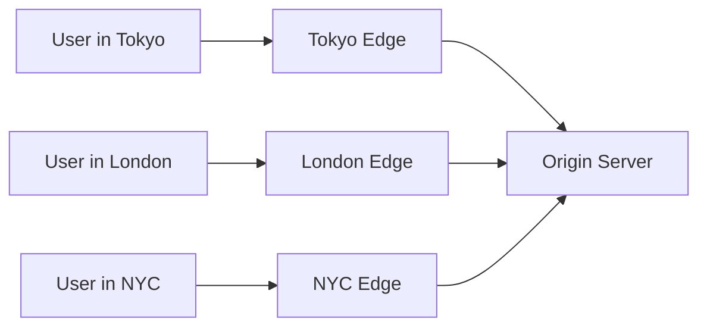

# How to Build Applications with Cloudflare Workers

Author: [nawazdhandala](https://www.github.com/nawazdhandala)

Tags: Cloudflare Workers, Edge Computing, Serverless, JavaScript, TypeScript, Performance

Description: A practical guide to building and deploying applications on Cloudflare Workers. Learn how edge computing works, write your first Worker, handle routing, manage state with KV and Durable Objects, and deploy a production-ready API.

Cloudflare Workers let you run JavaScript at the edge - on servers distributed across 300+ cities worldwide. Your code executes within milliseconds of your users, no matter where they are. Unlike traditional serverless platforms where cold starts can take seconds, Workers typically respond in under 50ms.

This guide walks through building real applications with Workers. We will start with the basics and work up to production patterns including routing, state management, and observability.

## What Makes Workers Different

Traditional cloud functions run in centralized data centers. When a user in Tokyo hits your AWS Lambda in Virginia, they pay the latency tax of crossing the Pacific twice. Workers flip this model - your code deploys to every edge location automatically.



The V8 isolate model also means no cold starts. Instead of spinning up containers, Workers use lightweight JavaScript isolates that initialize in under 5ms. You get the benefits of serverless - no servers to manage, pay-per-request pricing - without the latency penalty.

## Setting Up Your Development Environment

First, install Wrangler, the CLI for managing Workers:

```bash
# Install wrangler globally
npm install -g wrangler

# Authenticate with your Cloudflare account
wrangler login
```

Create a new project:

```bash
# Create a new Worker project
wrangler init my-worker

# Choose your template when prompted
# For this guide, select "Hello World" worker
```

This generates a project structure:

```
my-worker/
  src/
    index.ts       # Your Worker code
  wrangler.toml    # Configuration file
  package.json
  tsconfig.json
```

## Your First Worker

Open `src/index.ts`. The basic structure looks like this:

```typescript
// Every Worker exports a default object with a fetch handler
// This handler receives every incoming HTTP request
export default {
  async fetch(request: Request, env: Env, ctx: ExecutionContext): Promise<Response> {
    // request - the incoming HTTP request
    // env - bindings like KV namespaces, secrets, and other Workers
    // ctx - execution context with waitUntil for background tasks

    return new Response("Hello from the edge!", {
      headers: { "content-type": "text/plain" },
    });
  },
};
```

Test it locally:

```bash
# Start local development server
wrangler dev
```

Your Worker runs at `http://localhost:8787`. Every change hot-reloads instantly.

## Building a REST API with Routing

Real applications need routing. While you can use frameworks like Hono or Itty Router, understanding the manual approach helps you debug issues later.

```typescript
// Simple pattern-based router
// Handles GET, POST, PUT, DELETE with URL pattern matching

interface RouteHandler {
  (request: Request, env: Env, params: Record<string, string>): Promise<Response>;
}

interface Route {
  method: string;
  pattern: RegExp;
  handler: RouteHandler;
}

const routes: Route[] = [];

// Helper to register routes
function route(method: string, path: string, handler: RouteHandler) {
  // Convert path parameters like :id to named capture groups
  const pattern = new RegExp(
    "^" + path.replace(/:(\w+)/g, "(?<$1>[^/]+)") + "$"
  );
  routes.push({ method, pattern, handler });
}

// Define your API endpoints
route("GET", "/api/users", async (request, env) => {
  const users = await env.USERS_KV.list();
  return Response.json({ users: users.keys });
});

route("GET", "/api/users/:id", async (request, env, params) => {
  const user = await env.USERS_KV.get(params.id, "json");
  if (!user) {
    return Response.json({ error: "User not found" }, { status: 404 });
  }
  return Response.json(user);
});

route("POST", "/api/users", async (request, env) => {
  const body = await request.json();
  const id = crypto.randomUUID();

  // Store user in KV with metadata
  await env.USERS_KV.put(id, JSON.stringify({ id, ...body }), {
    metadata: { createdAt: Date.now() },
  });

  return Response.json({ id, ...body }, { status: 201 });
});

// Main fetch handler with routing logic
export default {
  async fetch(request: Request, env: Env, ctx: ExecutionContext): Promise<Response> {
    const url = new URL(request.url);

    // Find matching route
    for (const route of routes) {
      if (request.method !== route.method) continue;

      const match = url.pathname.match(route.pattern);
      if (match) {
        // Extract named parameters from the URL
        const params = match.groups || {};
        return route.handler(request, env, params);
      }
    }

    return Response.json({ error: "Not found" }, { status: 404 });
  },
};
```

## State Management with KV

Workers KV provides a global key-value store. Data written in one region becomes available worldwide within 60 seconds. It excels at read-heavy workloads - think configuration, feature flags, and cached content.

Configure KV in `wrangler.toml`:

```toml
name = "my-worker"
main = "src/index.ts"
compatibility_date = "2024-01-01"

# Create a KV namespace binding
[[kv_namespaces]]
binding = "USERS_KV"
id = "your-kv-namespace-id"
preview_id = "your-preview-kv-id"
```

Create the namespace:

```bash
# Create a KV namespace for production
wrangler kv:namespace create USERS_KV

# Create one for local development
wrangler kv:namespace create USERS_KV --preview
```

KV operations are straightforward:

```typescript
// Basic KV operations
// All operations return Promises

// Write a value with optional expiration
await env.USERS_KV.put("user:123", JSON.stringify(userData), {
  expirationTtl: 86400,  // Expire after 24 hours
  metadata: { version: 1 },  // Attach metadata (not counted in value size)
});

// Read with type hint - "json" parses automatically
const user = await env.USERS_KV.get("user:123", "json");

// Read with metadata
const { value, metadata } = await env.USERS_KV.getWithMetadata("user:123", "json");

// List keys with prefix filtering
const users = await env.USERS_KV.list({ prefix: "user:" });

// Delete a key
await env.USERS_KV.delete("user:123");
```

## Handling Real-Time State with Durable Objects

KV works great for read-heavy, eventually-consistent data. But what about real-time coordination, counters, or WebSocket connections? That is where Durable Objects come in.

Each Durable Object is a single instance that runs in one location. All requests to that object route to the same instance, giving you strong consistency and the ability to maintain state in memory.

```typescript
// Durable Object for real-time rate limiting
// Each user gets their own Durable Object instance

export class RateLimiter {
  state: DurableObjectState;
  requestCount: number;
  windowStart: number;

  constructor(state: DurableObjectState, env: Env) {
    this.state = state;
    this.requestCount = 0;
    this.windowStart = Date.now();
  }

  async fetch(request: Request): Promise<Response> {
    const now = Date.now();
    const windowMs = 60000;  // 1 minute window
    const maxRequests = 100; // 100 requests per minute

    // Reset window if expired
    if (now - this.windowStart > windowMs) {
      this.requestCount = 0;
      this.windowStart = now;
    }

    this.requestCount++;

    if (this.requestCount > maxRequests) {
      return Response.json(
        { error: "Rate limit exceeded" },
        {
          status: 429,
          headers: { "Retry-After": "60" }
        }
      );
    }

    return Response.json({
      remaining: maxRequests - this.requestCount,
      resetAt: this.windowStart + windowMs
    });
  }
}
```

Wire it up in your main Worker:

```typescript
// Using Durable Objects from your Worker
// Each user ID maps to a unique Durable Object instance

export default {
  async fetch(request: Request, env: Env): Promise<Response> {
    // Get user ID from header or auth token
    const userId = request.headers.get("X-User-ID");
    if (!userId) {
      return Response.json({ error: "Missing user ID" }, { status: 401 });
    }

    // Create a stable ID from the user ID
    // Same user ID always routes to the same Durable Object
    const id = env.RATE_LIMITER.idFromName(userId);

    // Get stub and forward request
    const limiter = env.RATE_LIMITER.get(id);
    const limitResult = await limiter.fetch(request);

    if (limitResult.status === 429) {
      return limitResult;
    }

    // Continue with your actual request handling
    return new Response("Request processed");
  },
};
```

Update `wrangler.toml` for Durable Objects:

```toml
[[durable_objects.bindings]]
name = "RATE_LIMITER"
class_name = "RateLimiter"

[[migrations]]
tag = "v1"
new_classes = ["RateLimiter"]
```

## Making External API Calls

Workers can call external APIs, but you need to handle errors and timeouts carefully. The `fetch` API is available globally.

```typescript
// Calling external APIs with proper error handling
// Workers have a 30-second CPU time limit but can wait longer on I/O

async function fetchWithRetry(
  url: string,
  options: RequestInit = {},
  maxRetries = 3
): Promise<Response> {
  let lastError: Error | null = null;

  for (let attempt = 0; attempt < maxRetries; attempt++) {
    try {
      const response = await fetch(url, {
        ...options,
        // Add timeout using AbortController
        signal: AbortSignal.timeout(10000),
      });

      // Retry on 5xx errors
      if (response.status >= 500) {
        throw new Error(`Server error: ${response.status}`);
      }

      return response;
    } catch (error) {
      lastError = error as Error;

      // Exponential backoff before retry
      if (attempt < maxRetries - 1) {
        await new Promise(r => setTimeout(r, Math.pow(2, attempt) * 100));
      }
    }
  }

  throw lastError;
}

// Usage in your handler
export default {
  async fetch(request: Request, env: Env): Promise<Response> {
    try {
      // Call external API with retries
      const response = await fetchWithRetry(
        "https://api.example.com/data",
        {
          headers: {
            "Authorization": `Bearer ${env.API_KEY}`,
            "Content-Type": "application/json"
          },
        }
      );

      const data = await response.json();
      return Response.json(data);

    } catch (error) {
      console.error("API call failed:", error);
      return Response.json(
        { error: "External service unavailable" },
        { status: 502 }
      );
    }
  },
};
```

## Adding Observability

You cannot fix what you cannot see. Workers integrate with logging and tracing through a few mechanisms.

```typescript
// Structured logging for better observability
// Logs appear in the Cloudflare dashboard and can be exported

function log(level: string, message: string, data: Record<string, any> = {}) {
  const entry = {
    timestamp: new Date().toISOString(),
    level,
    message,
    ...data,
  };
  console.log(JSON.stringify(entry));
}

export default {
  async fetch(request: Request, env: Env, ctx: ExecutionContext): Promise<Response> {
    const requestId = crypto.randomUUID();
    const startTime = Date.now();

    log("info", "Request received", {
      requestId,
      method: request.method,
      url: request.url,
      userAgent: request.headers.get("User-Agent"),
    });

    try {
      // Your handler logic here
      const response = new Response("OK");

      log("info", "Request completed", {
        requestId,
        status: response.status,
        durationMs: Date.now() - startTime,
      });

      return response;

    } catch (error) {
      log("error", "Request failed", {
        requestId,
        error: (error as Error).message,
        stack: (error as Error).stack,
        durationMs: Date.now() - startTime,
      });

      return Response.json(
        { error: "Internal server error", requestId },
        { status: 500 }
      );
    }
  },
};
```

For production observability, consider exporting logs to your observability platform. You can use `ctx.waitUntil()` to send telemetry without blocking the response:

```typescript
// Non-blocking telemetry export
// waitUntil keeps the Worker alive after responding

ctx.waitUntil(
  fetch("https://your-observability-endpoint.com/logs", {
    method: "POST",
    headers: { "Content-Type": "application/json" },
    body: JSON.stringify(logEntry),
  }).catch(() => {
    // Swallow errors - don't let telemetry failures affect requests
  })
);
```

## Deploying to Production

Deploy your Worker:

```bash
# Deploy to production
wrangler deploy

# Deploy to a specific environment
wrangler deploy --env staging
```

Set up secrets for API keys and sensitive configuration:

```bash
# Add a secret - you'll be prompted to enter the value
wrangler secret put API_KEY

# List existing secrets
wrangler secret list
```

Configure environments in `wrangler.toml`:

```toml
name = "my-worker"
main = "src/index.ts"
compatibility_date = "2024-01-01"

# Production routes
routes = [
  { pattern = "api.yourdomain.com/*", zone_name = "yourdomain.com" }
]

# Staging environment
[env.staging]
routes = [
  { pattern = "api-staging.yourdomain.com/*", zone_name = "yourdomain.com" }
]

[[env.staging.kv_namespaces]]
binding = "USERS_KV"
id = "staging-kv-namespace-id"
```

## Common Patterns and Gotchas

**Request body can only be read once.** If you need to read it multiple times, clone the request first:

```typescript
// Clone request before reading body
const clonedRequest = request.clone();
const body = await request.json();
// clonedRequest still has the body available
```

**Workers have execution limits.** CPU time is capped at 30 seconds (50ms on the free plan). However, I/O wait time does not count against this. Long-running compute should be chunked or moved to a queue.

**KV is eventually consistent.** Writes propagate globally in about 60 seconds. If you need immediate consistency, use Durable Objects.

**Use Cache API for expensive operations.** Workers have access to the Cache API for storing computed results:

```typescript
// Cache expensive operations
const cache = caches.default;
const cacheKey = new Request(request.url, request);

// Check cache first
let response = await cache.match(cacheKey);
if (response) {
  return response;
}

// Compute and cache
response = await expensiveOperation();
response = new Response(response.body, response);
response.headers.set("Cache-Control", "s-maxage=3600");

// Store in cache without blocking response
ctx.waitUntil(cache.put(cacheKey, response.clone()));

return response;
```

## Wrapping Up

Cloudflare Workers offer a compelling model for building globally distributed applications. The combination of edge computing, zero cold starts, and integrated storage makes them well-suited for APIs, real-time features, and anything where latency matters.

Start small - deploy a simple API endpoint and measure the latency from different regions. Once you see response times under 50ms globally, you will understand why edge computing is worth the paradigm shift.

The development experience has matured significantly. Wrangler provides excellent local development, and the debugging tools in the Cloudflare dashboard help you understand what your Workers are doing in production. For teams already using Cloudflare for DNS and CDN, adding Workers is a natural extension of your infrastructure.
