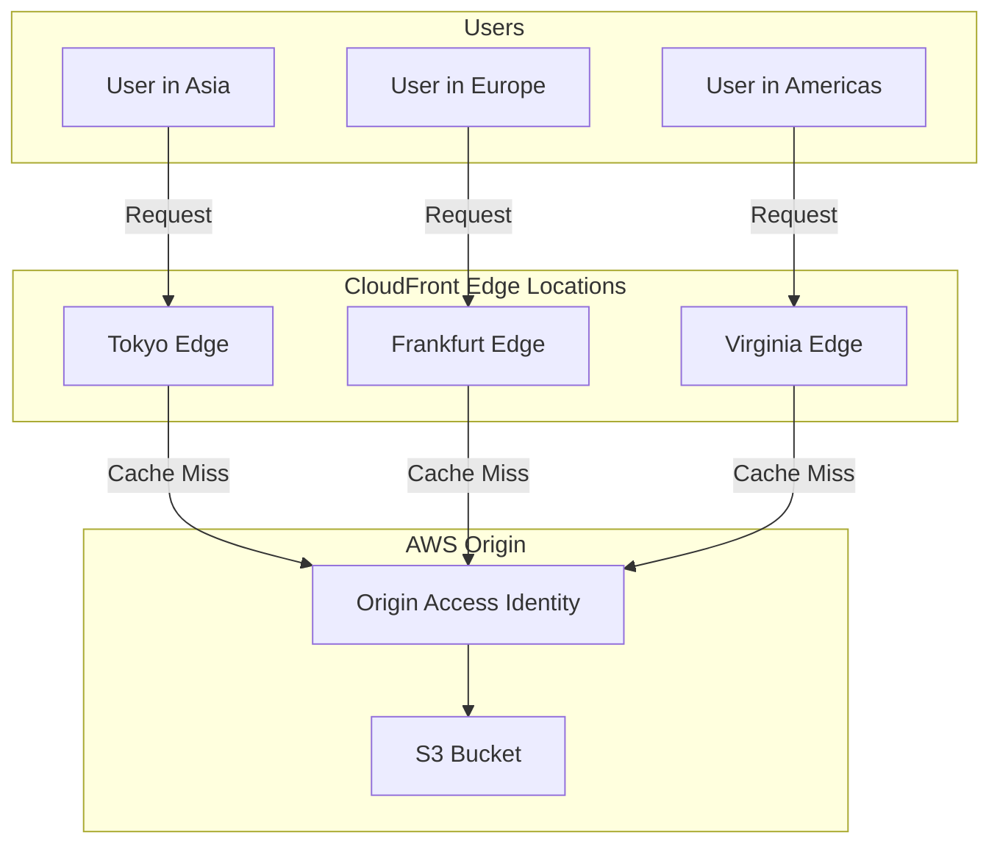
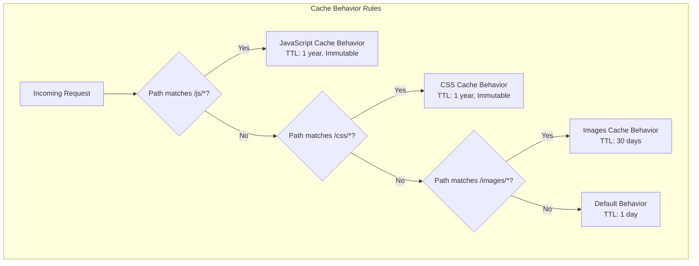
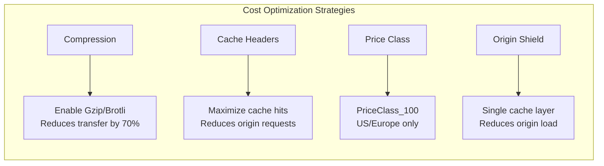

# How to Configure CloudFront for Static Assets

Author: [nawazdhandala](https://www.github.com/nawazdhandala)

Tags: CloudFront, CDN, AWS, Static Assets, Performance, S3, Caching

Description: Learn how to configure Amazon CloudFront for static asset delivery with S3 origins, cache behaviors, and invalidation strategies.

---

Amazon CloudFront is AWS's content delivery network that distributes your static assets from edge locations around the world. When configured properly with S3 as the origin, CloudFront can dramatically reduce load times for your users while offloading traffic from your servers. This guide walks through setting up CloudFront specifically for static asset delivery.

## Architecture Overview



## Step 1: Create an S3 Bucket for Static Assets

First, set up an S3 bucket to store your static files. The bucket does not need public access since CloudFront will access it through an Origin Access Control.

```bash
# Create the S3 bucket for static assets
# Replace 'my-static-assets-bucket' with your preferred name
aws s3 mb s3://my-static-assets-bucket --region us-east-1

# Block all public access to the bucket
# CloudFront will use Origin Access Control instead
aws s3api put-public-access-block \
    --bucket my-static-assets-bucket \
    --public-access-block-configuration \
    "BlockPublicAcls=true,IgnorePublicAcls=true,BlockPublicPolicy=true,RestrictPublicBuckets=true"
```

Upload your static assets with appropriate content types:

```bash
# Upload JavaScript files with correct content type
aws s3 cp ./dist/js/ s3://my-static-assets-bucket/js/ \
    --recursive \
    --content-type "application/javascript" \
    --cache-control "public, max-age=31536000, immutable"

# Upload CSS files
aws s3 cp ./dist/css/ s3://my-static-assets-bucket/css/ \
    --recursive \
    --content-type "text/css" \
    --cache-control "public, max-age=31536000, immutable"

# Upload images
aws s3 cp ./dist/images/ s3://my-static-assets-bucket/images/ \
    --recursive \
    --cache-control "public, max-age=2592000"

# Upload fonts with CORS headers
aws s3 cp ./dist/fonts/ s3://my-static-assets-bucket/fonts/ \
    --recursive \
    --cache-control "public, max-age=31536000, immutable"
```

## Step 2: Create Origin Access Control

Origin Access Control (OAC) allows CloudFront to access your private S3 bucket securely. This is the recommended approach over the older Origin Access Identity (OAI).

```bash
# Create an Origin Access Control for secure S3 access
aws cloudfront create-origin-access-control \
    --origin-access-control-config '{
        "Name": "StaticAssetsOAC",
        "Description": "OAC for static assets bucket",
        "SigningProtocol": "sigv4",
        "SigningBehavior": "always",
        "OriginAccessControlOriginType": "s3"
    }'

# Note the Id from the response - you will need it for the distribution
```

Update your S3 bucket policy to allow CloudFront access:

```json
{
    "Version": "2012-10-17",
    "Statement": [
        {
            "Sid": "AllowCloudFrontServicePrincipal",
            "Effect": "Allow",
            "Principal": {
                "Service": "cloudfront.amazonaws.com"
            },
            "Action": "s3:GetObject",
            "Resource": "arn:aws:s3:::my-static-assets-bucket/*",
            "Condition": {
                "StringEquals": {
                    "AWS:SourceArn": "arn:aws:cloudfront::123456789012:distribution/EDFDVBD6EXAMPLE"
                }
            }
        }
    ]
}
```

## Step 3: Create CloudFront Distribution

Here is a CloudFormation template for a production-ready CloudFront distribution:

```yaml
# cloudfront-static-assets.yaml
# CloudFormation template for CloudFront distribution serving static assets

AWSTemplateFormatVersion: '2010-09-09'
Description: CloudFront distribution for static asset delivery from S3

Parameters:
  BucketName:
    Type: String
    Description: Name of the S3 bucket containing static assets
  DomainName:
    Type: String
    Description: Custom domain name for the distribution (e.g., static.example.com)
  CertificateArn:
    Type: String
    Description: ARN of the ACM certificate for HTTPS

Resources:
  # Origin Access Control for secure S3 access
  OriginAccessControl:
    Type: AWS::CloudFront::OriginAccessControl
    Properties:
      OriginAccessControlConfig:
        Name: !Sub "${BucketName}-oac"
        Description: OAC for static assets bucket
        SigningProtocol: sigv4
        SigningBehavior: always
        OriginAccessControlOriginType: s3

  # Cache policy optimized for static assets
  StaticAssetsCachePolicy:
    Type: AWS::CloudFront::CachePolicy
    Properties:
      CachePolicyConfig:
        Name: !Sub "${AWS::StackName}-static-assets-policy"
        Comment: Cache policy for immutable static assets
        DefaultTTL: 86400        # 1 day default
        MaxTTL: 31536000         # 1 year maximum
        MinTTL: 1                # Minimum 1 second
        ParametersInCacheKeyAndForwardedToOrigin:
          CookiesConfig:
            CookieBehavior: none
          HeadersConfig:
            HeaderBehavior: none
          QueryStringsConfig:
            QueryStringBehavior: none
          EnableAcceptEncodingGzip: true
          EnableAcceptEncodingBrotli: true

  # Response headers policy for security and caching
  ResponseHeadersPolicy:
    Type: AWS::CloudFront::ResponseHeadersPolicy
    Properties:
      ResponseHeadersPolicyConfig:
        Name: !Sub "${AWS::StackName}-response-headers"
        Comment: Security and cache headers for static assets
        CorsConfig:
          AccessControlAllowOrigins:
            Items:
              - "https://example.com"
              - "https://www.example.com"
          AccessControlAllowMethods:
            Items:
              - GET
              - HEAD
          AccessControlAllowHeaders:
            Items:
              - "*"
          AccessControlMaxAgeSec: 86400
          OriginOverride: true
        SecurityHeadersConfig:
          StrictTransportSecurity:
            AccessControlMaxAgeSec: 31536000
            IncludeSubdomains: true
            Override: true
          ContentTypeOptions:
            Override: true
          FrameOptions:
            FrameOption: DENY
            Override: true

  # The CloudFront distribution
  Distribution:
    Type: AWS::CloudFront::Distribution
    Properties:
      DistributionConfig:
        Enabled: true
        Comment: Static assets distribution
        HttpVersion: http2and3
        PriceClass: PriceClass_100     # Use only North America and Europe

        # Custom domain configuration
        Aliases:
          - !Ref DomainName
        ViewerCertificate:
          AcmCertificateArn: !Ref CertificateArn
          SslSupportMethod: sni-only
          MinimumProtocolVersion: TLSv1.2_2021

        # S3 origin configuration
        Origins:
          - Id: S3Origin
            DomainName: !Sub "${BucketName}.s3.amazonaws.com"
            OriginAccessControlId: !GetAtt OriginAccessControl.Id
            S3OriginConfig:
              OriginAccessIdentity: ""

        # Default behavior for all static assets
        DefaultCacheBehavior:
          TargetOriginId: S3Origin
          ViewerProtocolPolicy: redirect-to-https
          CachePolicyId: !Ref StaticAssetsCachePolicy
          ResponseHeadersPolicyId: !Ref ResponseHeadersPolicy
          Compress: true
          AllowedMethods:
            - GET
            - HEAD
          CachedMethods:
            - GET
            - HEAD

        # Custom error responses
        CustomErrorResponses:
          - ErrorCode: 403
            ResponseCode: 404
            ResponsePagePath: /404.html
            ErrorCachingMinTTL: 60
          - ErrorCode: 404
            ResponseCode: 404
            ResponsePagePath: /404.html
            ErrorCachingMinTTL: 60

Outputs:
  DistributionId:
    Description: CloudFront distribution ID
    Value: !Ref Distribution
  DistributionDomainName:
    Description: CloudFront distribution domain name
    Value: !GetAtt Distribution.DomainName
```

Deploy the stack:

```bash
# Deploy the CloudFormation stack
aws cloudformation create-stack \
    --stack-name static-assets-cdn \
    --template-body file://cloudfront-static-assets.yaml \
    --parameters \
        ParameterKey=BucketName,ParameterValue=my-static-assets-bucket \
        ParameterKey=DomainName,ParameterValue=static.example.com \
        ParameterKey=CertificateArn,ParameterValue=arn:aws:acm:us-east-1:123456789012:certificate/abc123
```

## Step 4: Configure Cache Behaviors

For more granular control, you can define different cache behaviors for different asset types:



Add additional cache behaviors in your CloudFormation template:

```yaml
# Additional cache behaviors for specific asset types
CacheBehaviors:
  # JavaScript files - longest cache with immutable
  - PathPattern: "*.js"
    TargetOriginId: S3Origin
    ViewerProtocolPolicy: redirect-to-https
    CachePolicyId: !Ref ImmutableAssetsCachePolicy
    ResponseHeadersPolicyId: !Ref ResponseHeadersPolicy
    Compress: true
    AllowedMethods:
      - GET
      - HEAD

  # CSS files - longest cache with immutable
  - PathPattern: "*.css"
    TargetOriginId: S3Origin
    ViewerProtocolPolicy: redirect-to-https
    CachePolicyId: !Ref ImmutableAssetsCachePolicy
    ResponseHeadersPolicyId: !Ref ResponseHeadersPolicy
    Compress: true
    AllowedMethods:
      - GET
      - HEAD

  # Images - moderate cache
  - PathPattern: "/images/*"
    TargetOriginId: S3Origin
    ViewerProtocolPolicy: redirect-to-https
    CachePolicyId: !Ref ImagesCachePolicy
    Compress: true
    AllowedMethods:
      - GET
      - HEAD

  # Fonts - longest cache for WOFF2
  - PathPattern: "*.woff2"
    TargetOriginId: S3Origin
    ViewerProtocolPolicy: redirect-to-https
    CachePolicyId: !Ref ImmutableAssetsCachePolicy
    ResponseHeadersPolicyId: !Ref FontsResponseHeadersPolicy
    Compress: false    # WOFF2 is already compressed
    AllowedMethods:
      - GET
      - HEAD
```

## Step 5: Implement Cache Invalidation

When you need to update cached content before the TTL expires, use CloudFront invalidations. Here is a Python script for managing invalidations:

```python
# invalidate_cloudfront.py
# Script to invalidate CloudFront cache after deployments

import boto3
import time
import sys
from typing import List

class CloudFrontInvalidator:
    """Handles CloudFront cache invalidation for static assets."""

    def __init__(self, distribution_id: str):
        # Initialize the CloudFront client
        self.client = boto3.client('cloudfront')
        self.distribution_id = distribution_id

    def create_invalidation(self, paths: List[str]) -> str:
        """
        Create a cache invalidation for the specified paths.

        Args:
            paths: List of paths to invalidate (e.g., ['/js/*', '/css/*'])

        Returns:
            The invalidation ID for tracking
        """
        # Generate a unique caller reference using timestamp
        caller_reference = f"invalidation-{int(time.time())}"

        response = self.client.create_invalidation(
            DistributionId=self.distribution_id,
            InvalidationBatch={
                'Paths': {
                    'Quantity': len(paths),
                    'Items': paths
                },
                'CallerReference': caller_reference
            }
        )

        invalidation_id = response['Invalidation']['Id']
        print(f"Created invalidation: {invalidation_id}")
        print(f"Paths: {paths}")

        return invalidation_id

    def wait_for_completion(self, invalidation_id: str, timeout: int = 300):
        """
        Wait for an invalidation to complete.

        Args:
            invalidation_id: The ID returned from create_invalidation
            timeout: Maximum seconds to wait (default 5 minutes)
        """
        print(f"Waiting for invalidation {invalidation_id} to complete...")

        start_time = time.time()

        while True:
            # Check the invalidation status
            response = self.client.get_invalidation(
                DistributionId=self.distribution_id,
                Id=invalidation_id
            )

            status = response['Invalidation']['Status']

            if status == 'Completed':
                elapsed = time.time() - start_time
                print(f"Invalidation completed in {elapsed:.1f} seconds")
                return True

            # Check for timeout
            if time.time() - start_time > timeout:
                print(f"Timeout waiting for invalidation after {timeout} seconds")
                return False

            # Wait before checking again
            print(f"Status: {status}, waiting...")
            time.sleep(10)

    def invalidate_all(self) -> str:
        """
        Invalidate all cached content. Use sparingly as this incurs costs.

        Returns:
            The invalidation ID
        """
        return self.create_invalidation(['/*'])

    def invalidate_static_assets(self) -> str:
        """
        Invalidate common static asset paths.

        Returns:
            The invalidation ID
        """
        paths = [
            '/js/*',
            '/css/*',
            '/images/*',
            '/fonts/*'
        ]
        return self.create_invalidation(paths)


def main():
    """Main entry point for command line usage."""
    if len(sys.argv) < 3:
        print("Usage: python invalidate_cloudfront.py <distribution_id> <path1> [path2] ...")
        print("Example: python invalidate_cloudfront.py E1ABCDEF12345 /js/* /css/*")
        sys.exit(1)

    distribution_id = sys.argv[1]
    paths = sys.argv[2:]

    invalidator = CloudFrontInvalidator(distribution_id)
    invalidation_id = invalidator.create_invalidation(paths)
    invalidator.wait_for_completion(invalidation_id)


if __name__ == '__main__':
    main()
```

Integrate invalidation into your deployment pipeline:

```yaml
# .github/workflows/deploy-static.yml
# GitHub Actions workflow for deploying static assets

name: Deploy Static Assets

on:
  push:
    branches: [main]
    paths:
      - 'static/**'

jobs:
  deploy:
    runs-on: ubuntu-latest

    steps:
      - uses: actions/checkout@v4

      - name: Configure AWS credentials
        uses: aws-actions/configure-aws-credentials@v4
        with:
          aws-access-key-id: ${{ secrets.AWS_ACCESS_KEY_ID }}
          aws-secret-access-key: ${{ secrets.AWS_SECRET_ACCESS_KEY }}
          aws-region: us-east-1

      - name: Build static assets
        run: |
          npm ci
          npm run build

      - name: Sync to S3
        run: |
          # Sync JS and CSS with long cache headers
          aws s3 sync ./dist/js s3://${{ secrets.S3_BUCKET }}/js \
            --cache-control "public, max-age=31536000, immutable" \
            --delete

          aws s3 sync ./dist/css s3://${{ secrets.S3_BUCKET }}/css \
            --cache-control "public, max-age=31536000, immutable" \
            --delete

          # Sync images with moderate cache
          aws s3 sync ./dist/images s3://${{ secrets.S3_BUCKET }}/images \
            --cache-control "public, max-age=2592000" \
            --delete

      - name: Invalidate CloudFront cache
        run: |
          # Only invalidate paths that were updated
          aws cloudfront create-invalidation \
            --distribution-id ${{ secrets.CLOUDFRONT_DISTRIBUTION_ID }} \
            --paths "/js/*" "/css/*" "/images/*"
```

## Step 6: Monitor CloudFront Performance

Enable CloudFront metrics and logging to track your CDN performance:

```yaml
# Add to your CloudFront distribution configuration
DistributionConfig:
  # Enable real-time logs for detailed request analysis
  Logging:
    Enabled: true
    IncludeCookies: false
    Bucket: my-cloudfront-logs.s3.amazonaws.com
    Prefix: static-assets/

# Create a real-time log configuration for streaming metrics
RealTimeLogConfig:
  Type: AWS::CloudFront::RealtimeLogConfig
  Properties:
    Name: static-assets-realtime-logs
    SamplingRate: 100    # Log 100% of requests
    EndPoints:
      - StreamType: Kinesis
        KinesisStreamConfig:
          RoleArn: !GetAtt KinesisStreamRole.Arn
          StreamArn: !GetAtt LogStream.Arn
    Fields:
      - timestamp
      - c-ip
      - sc-status
      - cs-uri-stem
      - cs-bytes
      - time-taken
      - x-edge-result-type
      - x-edge-response-result-type
```

Create a CloudWatch dashboard for key metrics:

```python
# cloudwatch_dashboard.py
# Create a CloudWatch dashboard for CloudFront metrics

import boto3
import json

def create_cloudfront_dashboard(distribution_id: str):
    """Create a CloudWatch dashboard for monitoring CloudFront."""

    client = boto3.client('cloudwatch')

    # Define dashboard widgets for key metrics
    dashboard_body = {
        "widgets": [
            {
                "type": "metric",
                "x": 0,
                "y": 0,
                "width": 12,
                "height": 6,
                "properties": {
                    "title": "Request Count",
                    "metrics": [
                        ["AWS/CloudFront", "Requests",
                         "DistributionId", distribution_id,
                         "Region", "Global"]
                    ],
                    "period": 300,
                    "stat": "Sum",
                    "region": "us-east-1"
                }
            },
            {
                "type": "metric",
                "x": 12,
                "y": 0,
                "width": 12,
                "height": 6,
                "properties": {
                    "title": "Cache Hit Rate",
                    "metrics": [
                        ["AWS/CloudFront", "CacheHitRate",
                         "DistributionId", distribution_id,
                         "Region", "Global"]
                    ],
                    "period": 300,
                    "stat": "Average",
                    "region": "us-east-1"
                }
            },
            {
                "type": "metric",
                "x": 0,
                "y": 6,
                "width": 12,
                "height": 6,
                "properties": {
                    "title": "Error Rate",
                    "metrics": [
                        ["AWS/CloudFront", "4xxErrorRate",
                         "DistributionId", distribution_id,
                         "Region", "Global"],
                        ["AWS/CloudFront", "5xxErrorRate",
                         "DistributionId", distribution_id,
                         "Region", "Global"]
                    ],
                    "period": 300,
                    "stat": "Average",
                    "region": "us-east-1"
                }
            },
            {
                "type": "metric",
                "x": 12,
                "y": 6,
                "width": 12,
                "height": 6,
                "properties": {
                    "title": "Bytes Downloaded",
                    "metrics": [
                        ["AWS/CloudFront", "BytesDownloaded",
                         "DistributionId", distribution_id,
                         "Region", "Global"]
                    ],
                    "period": 300,
                    "stat": "Sum",
                    "region": "us-east-1"
                }
            }
        ]
    }

    # Create or update the dashboard
    client.put_dashboard(
        DashboardName=f"CloudFront-{distribution_id}",
        DashboardBody=json.dumps(dashboard_body)
    )

    print(f"Dashboard created: CloudFront-{distribution_id}")


if __name__ == '__main__':
    import sys
    if len(sys.argv) != 2:
        print("Usage: python cloudwatch_dashboard.py <distribution_id>")
        sys.exit(1)

    create_cloudfront_dashboard(sys.argv[1])
```

## Cost Optimization Tips

CloudFront pricing is based on data transfer and requests. Here are strategies to optimize costs:



**Key optimizations:**

1. **Use appropriate price classes** - If your users are primarily in specific regions, limit edge locations
2. **Maximize cache hit ratio** - Use long TTLs for immutable assets with content hashes in filenames
3. **Enable compression** - Gzip and Brotli reduce data transfer significantly
4. **Use Origin Shield** - Adds a caching layer between edge locations and your origin
5. **Monitor and adjust** - Review CloudFront reports to identify optimization opportunities

---

*OneUptime monitors your CloudFront distributions and alerts you when cache hit rates drop, error rates spike, or latency increases across global edge locations.*
