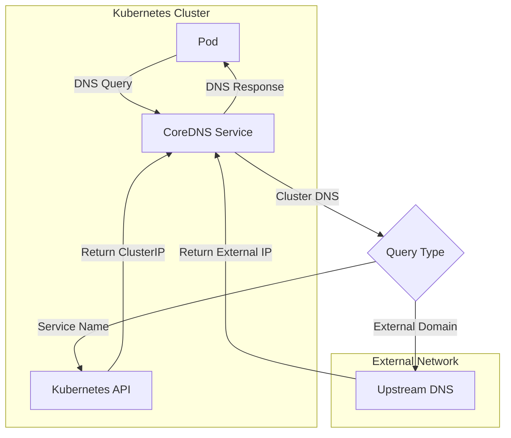
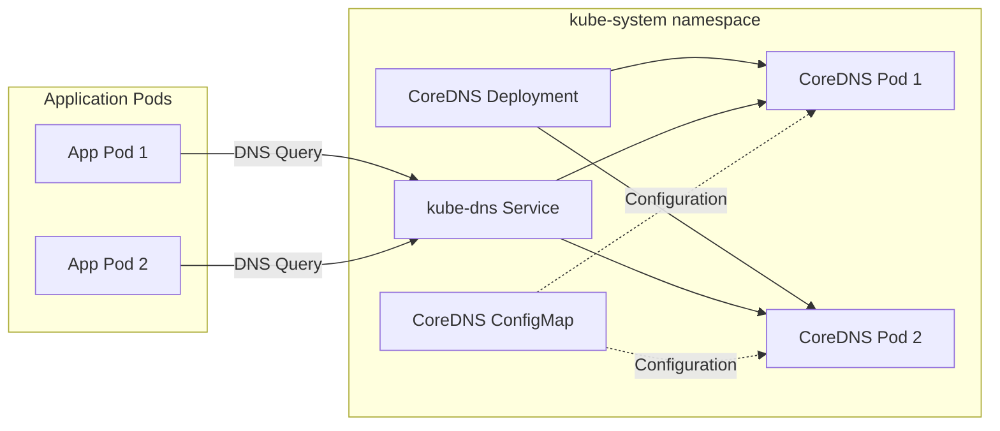
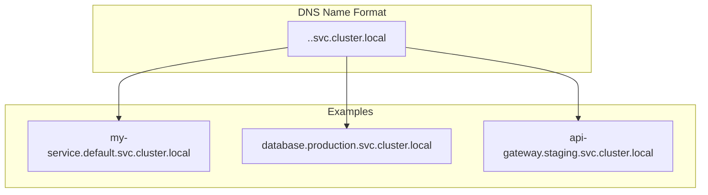
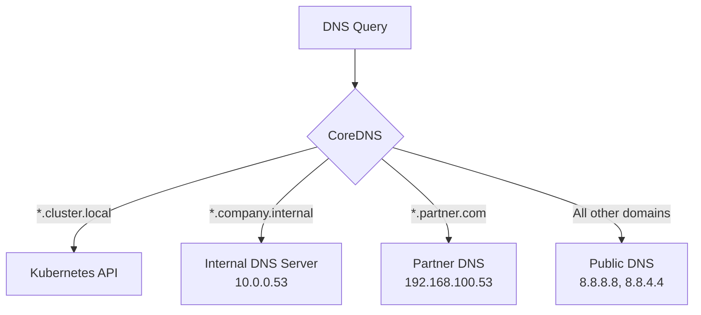
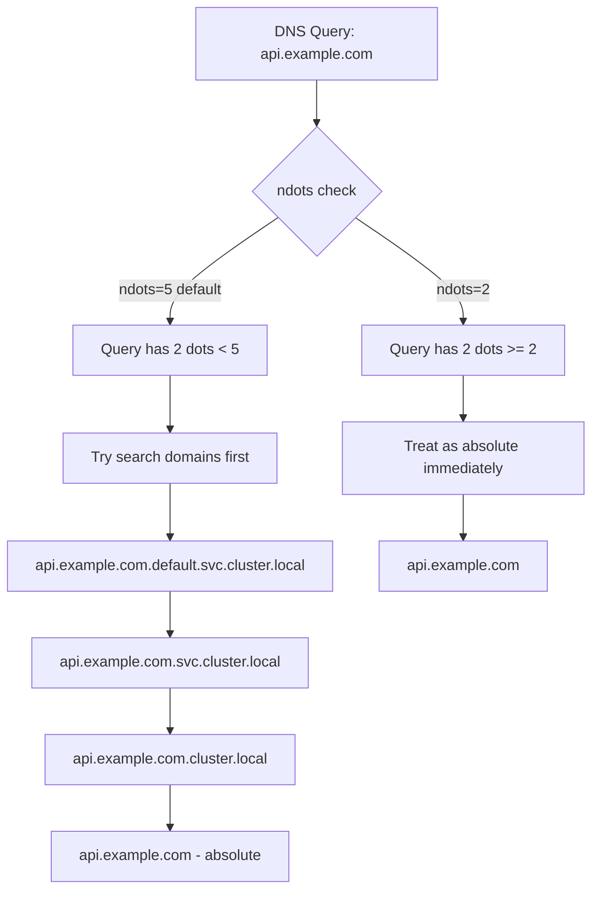

# How to Use CoreDNS with Kubernetes

Author: [nawazdhandala](https://www.github.com/nawazdhandala)

Tags: CoreDNS, Kubernetes, DNS, Networking, Service Discovery

Description: Learn how to configure CoreDNS in Kubernetes for service discovery, custom DNS entries, and external DNS resolution.

---

CoreDNS is the default DNS server in Kubernetes clusters since version 1.13. It handles service discovery, allowing pods to find and communicate with other services using DNS names instead of IP addresses. This guide walks you through understanding and configuring CoreDNS for your Kubernetes environment.

## How DNS Works in Kubernetes

Before diving into CoreDNS configuration, let's understand how DNS resolution works in a Kubernetes cluster.



When a pod needs to resolve a DNS name, the request goes to CoreDNS. CoreDNS then determines whether the query is for an internal Kubernetes service or an external domain. Internal queries are resolved using the Kubernetes API, while external queries are forwarded to upstream DNS servers.

## CoreDNS Architecture in Kubernetes

CoreDNS runs as a Deployment in the `kube-system` namespace with a Service that provides a stable IP address for DNS resolution.



## Checking CoreDNS Status

First, verify that CoreDNS is running in your cluster.

```bash
# Check CoreDNS pods
kubectl get pods -n kube-system -l k8s-app=kube-dns

# Expected output:
# NAME                       READY   STATUS    RESTARTS   AGE
# coredns-5644d7b6d9-abcd1   1/1     Running   0          10d
# coredns-5644d7b6d9-abcd2   1/1     Running   0          10d
```

```bash
# Check the CoreDNS service
kubectl get svc -n kube-system kube-dns

# Expected output:
# NAME       TYPE        CLUSTER-IP   EXTERNAL-IP   PORT(S)
# kube-dns   ClusterIP   10.96.0.10   <none>        53/UDP,53/TCP
```

## Understanding the CoreDNS Corefile

The Corefile is the main configuration file for CoreDNS. It defines how DNS queries are processed.

```bash
# View the current CoreDNS configuration
kubectl get configmap coredns -n kube-system -o yaml
```

Here's a typical Corefile with detailed comments:

```yaml
apiVersion: v1
kind: ConfigMap
metadata:
  name: coredns
  namespace: kube-system
data:
  Corefile: |
    # The dot (.) represents all DNS zones
    # This block handles all DNS queries
    .:53 {
        # errors plugin: Log errors to stdout
        errors

        # health plugin: Expose health check endpoint on port 8080
        # Used by Kubernetes liveness probe
        health {
           lameduck 5s
        }

        # ready plugin: Report readiness on port 8181
        # Used by Kubernetes readiness probe
        ready

        # kubernetes plugin: Handle DNS for Kubernetes services and pods
        # cluster.local is the default cluster domain
        # pods insecure: Allow pod DNS resolution without verification
        # fallthrough: If no match, pass to next plugin
        kubernetes cluster.local in-addr.arpa ip6.arpa {
           pods insecure
           fallthrough in-addr.arpa ip6.arpa
           ttl 30
        }

        # prometheus plugin: Expose metrics on port 9153
        prometheus :9153

        # forward plugin: Forward external queries to upstream DNS
        # /etc/resolv.conf contains the node's DNS configuration
        forward . /etc/resolv.conf {
           max_concurrent 1000
        }

        # cache plugin: Cache DNS responses
        # 30 seconds for positive responses
        cache 30

        # loop plugin: Detect and break DNS loops
        loop

        # reload plugin: Auto-reload Corefile on changes
        reload

        # loadbalance plugin: Round-robin DNS responses
        loadbalance
    }
```

## DNS Resolution for Kubernetes Services

Kubernetes creates DNS records for Services automatically. Understanding the naming convention is essential.



### Testing DNS Resolution

Create a test pod to verify DNS resolution:

```yaml
# dns-test-pod.yaml
apiVersion: v1
kind: Pod
metadata:
  name: dns-test
  namespace: default
spec:
  containers:
  - name: dns-test
    image: busybox:1.36
    command:
      - sleep
      - "3600"
    # Resource limits for production environments
    resources:
      limits:
        memory: "64Mi"
        cpu: "100m"
```

```bash
# Apply the test pod
kubectl apply -f dns-test-pod.yaml

# Test DNS resolution for the kubernetes service
kubectl exec -it dns-test -- nslookup kubernetes.default.svc.cluster.local

# Expected output:
# Server:    10.96.0.10
# Address 1: 10.96.0.10 kube-dns.kube-system.svc.cluster.local
#
# Name:      kubernetes.default.svc.cluster.local
# Address 1: 10.96.0.1 kubernetes.default.svc.cluster.local
```

## Adding Custom DNS Entries

You can add custom DNS entries to CoreDNS for internal services or external hosts.

### Method 1: Using the hosts Plugin

Edit the CoreDNS ConfigMap to add static DNS entries:

```yaml
apiVersion: v1
kind: ConfigMap
metadata:
  name: coredns
  namespace: kube-system
data:
  Corefile: |
    .:53 {
        errors
        health {
           lameduck 5s
        }
        ready

        # hosts plugin: Add custom static DNS entries
        # Place this BEFORE the kubernetes plugin
        hosts {
           # Format: IP_ADDRESS HOSTNAME
           192.168.1.100 legacy-database.internal
           192.168.1.101 legacy-api.internal
           10.0.0.50 external-service.company.com

           # fallthrough passes unmatched queries to next plugin
           fallthrough
        }

        kubernetes cluster.local in-addr.arpa ip6.arpa {
           pods insecure
           fallthrough in-addr.arpa ip6.arpa
           ttl 30
        }

        prometheus :9153
        forward . /etc/resolv.conf {
           max_concurrent 1000
        }
        cache 30
        loop
        reload
        loadbalance
    }
```

### Method 2: Using a Custom ConfigMap with hosts File

For larger sets of custom entries, use a separate ConfigMap:

```yaml
# custom-hosts-configmap.yaml
apiVersion: v1
kind: ConfigMap
metadata:
  name: coredns-custom-hosts
  namespace: kube-system
data:
  # Custom hosts entries file
  custom.hosts: |
    # Legacy systems that don't have DNS entries
    192.168.1.100 legacy-db.internal
    192.168.1.101 legacy-api.internal

    # Partner API endpoints
    10.50.0.10 partner-api.example.com

    # Development overrides
    10.0.0.99 dev-override.company.com
```

Then update the CoreDNS Deployment to mount this ConfigMap:

```yaml
# Patch the CoreDNS deployment to add the volume
apiVersion: apps/v1
kind: Deployment
metadata:
  name: coredns
  namespace: kube-system
spec:
  template:
    spec:
      volumes:
      - name: config-volume
        configMap:
          name: coredns
          items:
          - key: Corefile
            path: Corefile
      # Add custom hosts volume
      - name: custom-hosts
        configMap:
          name: coredns-custom-hosts
      containers:
      - name: coredns
        volumeMounts:
        - name: config-volume
          mountPath: /etc/coredns
          readOnly: true
        # Mount custom hosts file
        - name: custom-hosts
          mountPath: /etc/coredns/custom
          readOnly: true
```

Update the Corefile to use the custom hosts file:

```
hosts /etc/coredns/custom/custom.hosts {
   fallthrough
}
```

## Configuring External DNS Resolution

You can configure CoreDNS to forward queries for specific domains to different DNS servers.



Here's the Corefile configuration for this setup:

```yaml
apiVersion: v1
kind: ConfigMap
metadata:
  name: coredns
  namespace: kube-system
data:
  Corefile: |
    # Handle cluster.local domain (Kubernetes services)
    cluster.local:53 {
        errors
        cache 30
        kubernetes cluster.local in-addr.arpa ip6.arpa {
           pods insecure
           fallthrough in-addr.arpa ip6.arpa
           ttl 30
        }
    }

    # Forward queries for company.internal to internal DNS
    company.internal:53 {
        errors
        cache 30
        # Forward to internal corporate DNS servers
        forward . 10.0.0.53 10.0.0.54 {
           # Use TCP if UDP fails
           prefer_udp
           # Health check interval
           health_check 5s
        }
    }

    # Forward queries for partner.com to partner DNS
    partner.com:53 {
        errors
        cache 60
        forward . 192.168.100.53 {
           prefer_udp
           health_check 10s
        }
    }

    # Default zone for all other queries
    .:53 {
        errors
        health {
           lameduck 5s
        }
        ready
        prometheus :9153

        # Forward to public DNS servers
        forward . 8.8.8.8 8.8.4.4 {
           # Use TLS for DNS queries (DNS over TLS)
           # tls_servername dns.google
           prefer_udp
           max_concurrent 1000
        }

        cache 30
        loop
        reload
        loadbalance
    }
```

## Configuring DNS for Pods

Kubernetes allows you to customize DNS settings for individual pods.

### Using dnsPolicy

```yaml
apiVersion: v1
kind: Pod
metadata:
  name: custom-dns-pod
spec:
  # dnsPolicy options:
  # - Default: Inherit from node
  # - ClusterFirst: Use cluster DNS, fall back to node DNS (default for pods)
  # - ClusterFirstWithHostNet: Like ClusterFirst but for hostNetwork pods
  # - None: Ignore cluster DNS, use dnsConfig only
  dnsPolicy: "None"

  # Custom DNS configuration (used when dnsPolicy is None)
  dnsConfig:
    # Custom nameservers
    nameservers:
      - 10.96.0.10      # Cluster DNS
      - 8.8.8.8         # Fallback to Google DNS

    # Search domains for short names
    searches:
      - default.svc.cluster.local
      - svc.cluster.local
      - cluster.local
      - company.internal

    # DNS options
    options:
      - name: ndots
        value: "2"       # Number of dots before absolute lookup
      - name: timeout
        value: "3"       # Query timeout in seconds
      - name: attempts
        value: "3"       # Number of retry attempts

  containers:
  - name: app
    image: nginx:1.24
```

### Understanding ndots

The `ndots` option controls when Kubernetes treats a hostname as fully qualified.



For applications that frequently query external domains, reducing `ndots` improves performance:

```yaml
dnsConfig:
  options:
    - name: ndots
      value: "2"  # Reduces unnecessary search domain queries
```

## Enabling DNS Logging

For debugging, you can enable DNS query logging in CoreDNS.

```yaml
apiVersion: v1
kind: ConfigMap
metadata:
  name: coredns
  namespace: kube-system
data:
  Corefile: |
    .:53 {
        errors

        # log plugin: Log all DNS queries
        # Format: {type} {name} {class} {proto} {remote}
        log . {
           class denial error
        }

        health {
           lameduck 5s
        }
        ready
        kubernetes cluster.local in-addr.arpa ip6.arpa {
           pods insecure
           fallthrough in-addr.arpa ip6.arpa
           ttl 30
        }
        prometheus :9153
        forward . /etc/resolv.conf {
           max_concurrent 1000
        }
        cache 30
        loop
        reload
        loadbalance
    }
```

View the logs:

```bash
# Check CoreDNS logs
kubectl logs -n kube-system -l k8s-app=kube-dns -f

# Example log output:
# [INFO] 10.244.0.5:45678 - 12345 "A IN my-service.default.svc.cluster.local. udp 53"
```

## Scaling CoreDNS

For large clusters, you may need to scale CoreDNS for better performance.

```bash
# Scale CoreDNS to 3 replicas
kubectl scale deployment coredns -n kube-system --replicas=3

# Verify the scaling
kubectl get pods -n kube-system -l k8s-app=kube-dns
```

For automatic scaling based on cluster size, use the cluster-proportional-autoscaler:

```yaml
# coredns-autoscaler.yaml
apiVersion: apps/v1
kind: Deployment
metadata:
  name: coredns-autoscaler
  namespace: kube-system
spec:
  replicas: 1
  selector:
    matchLabels:
      app: coredns-autoscaler
  template:
    metadata:
      labels:
        app: coredns-autoscaler
    spec:
      serviceAccountName: coredns-autoscaler
      containers:
      - name: autoscaler
        image: registry.k8s.io/cpa/cluster-proportional-autoscaler:1.8.8
        command:
          - /cluster-proportional-autoscaler
          - --namespace=kube-system
          - --configmap=coredns-autoscaler
          - --target=deployment/coredns
          # Scale based on nodes and cores
          - --default-params={"linear":{"coresPerReplica":256,"nodesPerReplica":16,"min":2,"max":10,"preventSinglePointFailure":true}}
          - --logtostderr=true
          - --v=2
        resources:
          requests:
            cpu: 20m
            memory: 10Mi
          limits:
            cpu: 100m
            memory: 50Mi
```

## Monitoring CoreDNS

CoreDNS exposes Prometheus metrics on port 9153.

```bash
# Port-forward to access metrics
kubectl port-forward -n kube-system svc/kube-dns 9153:9153

# View metrics
curl http://localhost:9153/metrics
```

Key metrics to monitor:

| Metric | Description |
|--------|-------------|
| `coredns_dns_requests_total` | Total DNS requests by type and zone |
| `coredns_dns_responses_total` | Total responses by response code |
| `coredns_dns_request_duration_seconds` | Request latency histogram |
| `coredns_cache_hits_total` | Cache hit count |
| `coredns_cache_misses_total` | Cache miss count |
| `coredns_forward_requests_total` | Forwarded requests count |

Example Prometheus alert rules:

```yaml
# prometheus-rules.yaml
apiVersion: monitoring.coreos.com/v1
kind: PrometheusRule
metadata:
  name: coredns-alerts
  namespace: monitoring
spec:
  groups:
  - name: coredns
    rules:
    # Alert if CoreDNS error rate is high
    - alert: CoreDNSHighErrorRate
      expr: |
        sum(rate(coredns_dns_responses_total{rcode="SERVFAIL"}[5m])) /
        sum(rate(coredns_dns_responses_total[5m])) > 0.01
      for: 10m
      labels:
        severity: warning
      annotations:
        summary: CoreDNS error rate is above 1%

    # Alert if CoreDNS latency is high
    - alert: CoreDNSHighLatency
      expr: |
        histogram_quantile(0.99,
          sum(rate(coredns_dns_request_duration_seconds_bucket[5m])) by (le)
        ) > 0.1
      for: 10m
      labels:
        severity: warning
      annotations:
        summary: CoreDNS p99 latency is above 100ms
```

## Common Issues and Solutions

### Issue 1: DNS Resolution Timeout

If pods experience DNS timeouts, check these areas:

```bash
# Check CoreDNS pod resources
kubectl top pods -n kube-system -l k8s-app=kube-dns

# Check for resource constraints in the deployment
kubectl get deployment coredns -n kube-system -o yaml | grep -A 10 resources
```

Solution: Increase resources or scale replicas:

```yaml
# Increase CoreDNS resources
resources:
  limits:
    memory: 170Mi
    cpu: 200m
  requests:
    memory: 70Mi
    cpu: 100m
```

### Issue 2: External DNS Not Resolving

```bash
# Test external DNS resolution from a pod
kubectl exec -it dns-test -- nslookup google.com

# If it fails, check the forward configuration
kubectl get configmap coredns -n kube-system -o yaml | grep -A 5 forward
```

Solution: Verify upstream DNS servers are reachable:

```bash
# Check if the node can reach upstream DNS
kubectl run -it --rm debug --image=busybox:1.36 --restart=Never -- \
  nslookup google.com 8.8.8.8
```

### Issue 3: Service Discovery Not Working

```bash
# Check if the kubernetes plugin is configured correctly
kubectl get configmap coredns -n kube-system -o yaml | grep -A 10 kubernetes

# Verify the service exists
kubectl get svc -A

# Test resolution
kubectl exec -it dns-test -- nslookup my-service.my-namespace.svc.cluster.local
```

## Conclusion

CoreDNS is a powerful and flexible DNS server that forms the backbone of service discovery in Kubernetes. With the configurations covered in this guide, you can:

- Understand how DNS resolution works in Kubernetes
- Add custom DNS entries for legacy systems or external services
- Configure domain-specific forwarding rules
- Tune DNS settings for individual pods
- Monitor and scale CoreDNS for production workloads

Remember to test DNS changes in a non-production environment first, and always verify that your applications can resolve both internal and external DNS names after making configuration changes.
