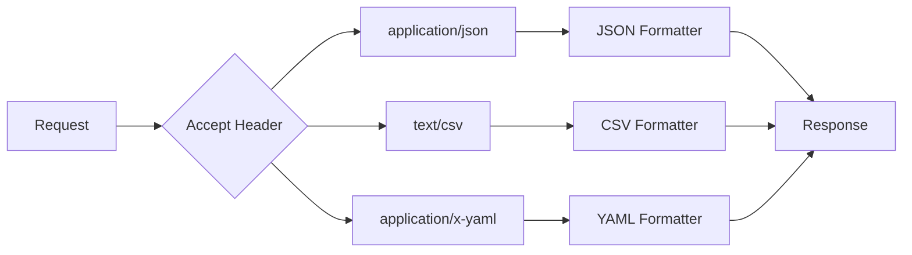

# How to Build Custom Formatters in ASP.NET Core

Author: [nawazdhandala](https://www.github.com/nawazdhandala)

Tags: .NET, C#, ASP.NET Core, Custom Formatters, Content Negotiation

Description: Learn how to build custom input and output formatters in ASP.NET Core to support formats like CSV, YAML, or Protocol Buffers. This guide covers formatter implementation, content negotiation, and integration with the MVC pipeline.

---

ASP.NET Core handles JSON out of the box, but real-world APIs often need to support multiple formats: CSV for Excel compatibility, YAML for human-readable configuration, Protocol Buffers for performance-critical services, or custom binary formats for legacy systems. Custom formatters let you add support for any content type while keeping your controllers clean.

## How Content Negotiation Works

When a request comes in, ASP.NET Core selects formatters based on:

1. The `Accept` header (for output)
2. The `Content-Type` header (for input)
3. The formatter's supported media types



## Building an Output Formatter

Let's create a CSV output formatter:

```csharp
using Microsoft.AspNetCore.Mvc.Formatters;
using Microsoft.Net.Http.Headers;
using System.Collections;
using System.Reflection;
using System.Text;

public class CsvOutputFormatter : TextOutputFormatter
{
    public CsvOutputFormatter()
    {
        // Define supported media types
        SupportedMediaTypes.Add(MediaTypeHeaderValue.Parse("text/csv"));
        SupportedMediaTypes.Add(MediaTypeHeaderValue.Parse("application/csv"));

        // Define supported encodings
        SupportedEncodings.Add(Encoding.UTF8);
        SupportedEncodings.Add(Encoding.Unicode);
    }

    // Determine if this formatter can handle the given type
    protected override bool CanWriteType(Type? type)
    {
        if (type == null) return false;

        // Handle collections of objects
        if (typeof(IEnumerable).IsAssignableFrom(type))
        {
            return true;
        }

        // Handle single objects
        return !type.IsPrimitive && type != typeof(string);
    }

    public override async Task WriteResponseBodyAsync(
        OutputFormatterWriteContext context,
        Encoding selectedEncoding)
    {
        var response = context.HttpContext.Response;
        var builder = new StringBuilder();

        var objectType = context.ObjectType;
        var value = context.Object;

        if (value is IEnumerable enumerable)
        {
            // Get the element type
            var elementType = GetElementType(objectType);
            if (elementType == null) return;

            // Write header row
            var properties = elementType.GetProperties(BindingFlags.Public | BindingFlags.Instance);
            builder.AppendLine(string.Join(",", properties.Select(p => EscapeCsvValue(p.Name))));

            // Write data rows
            foreach (var item in enumerable)
            {
                var values = properties.Select(p =>
                {
                    var propValue = p.GetValue(item);
                    return EscapeCsvValue(propValue?.ToString() ?? "");
                });
                builder.AppendLine(string.Join(",", values));
            }
        }
        else if (value != null)
        {
            // Single object - write as single row with header
            var properties = objectType!.GetProperties(BindingFlags.Public | BindingFlags.Instance);
            builder.AppendLine(string.Join(",", properties.Select(p => EscapeCsvValue(p.Name))));

            var values = properties.Select(p =>
            {
                var propValue = p.GetValue(value);
                return EscapeCsvValue(propValue?.ToString() ?? "");
            });
            builder.AppendLine(string.Join(",", values));
        }

        await response.WriteAsync(builder.ToString(), selectedEncoding);
    }

    private static Type? GetElementType(Type? type)
    {
        if (type == null) return null;

        // Check for generic IEnumerable<T>
        var enumInterface = type.GetInterfaces()
            .FirstOrDefault(i => i.IsGenericType &&
                                  i.GetGenericTypeDefinition() == typeof(IEnumerable<>));

        if (enumInterface != null)
        {
            return enumInterface.GetGenericArguments()[0];
        }

        // Check if the type itself is IEnumerable<T>
        if (type.IsGenericType && type.GetGenericTypeDefinition() == typeof(IEnumerable<>))
        {
            return type.GetGenericArguments()[0];
        }

        return null;
    }

    private static string EscapeCsvValue(string value)
    {
        // Escape values containing commas, quotes, or newlines
        if (value.Contains(',') || value.Contains('"') || value.Contains('\n'))
        {
            return $"\"{value.Replace("\"", "\"\"")}\"";
        }
        return value;
    }
}
```

## Building an Input Formatter

Create a CSV input formatter to accept CSV data in requests:

```csharp
using Microsoft.AspNetCore.Mvc.Formatters;
using Microsoft.Net.Http.Headers;
using System.Reflection;
using System.Text;

public class CsvInputFormatter : TextInputFormatter
{
    public CsvInputFormatter()
    {
        SupportedMediaTypes.Add(MediaTypeHeaderValue.Parse("text/csv"));
        SupportedMediaTypes.Add(MediaTypeHeaderValue.Parse("application/csv"));

        SupportedEncodings.Add(Encoding.UTF8);
        SupportedEncodings.Add(Encoding.Unicode);
    }

    protected override bool CanReadType(Type type)
    {
        // Can read collections of objects
        if (type.IsGenericType)
        {
            var genericDef = type.GetGenericTypeDefinition();
            return genericDef == typeof(List<>) ||
                   genericDef == typeof(IEnumerable<>) ||
                   genericDef == typeof(IList<>);
        }
        return false;
    }

    public override async Task<InputFormatterResult> ReadRequestBodyAsync(
        InputFormatterContext context,
        Encoding encoding)
    {
        var httpContext = context.HttpContext;
        var modelType = context.ModelType;

        using var reader = new StreamReader(httpContext.Request.Body, encoding);
        var content = await reader.ReadToEndAsync();

        var lines = content.Split('\n', StringSplitOptions.RemoveEmptyEntries);
        if (lines.Length == 0)
        {
            return await InputFormatterResult.SuccessAsync(null);
        }

        // Get element type from List<T>
        var elementType = modelType.GetGenericArguments()[0];
        var properties = elementType.GetProperties(BindingFlags.Public | BindingFlags.Instance);

        // Parse header row
        var headers = ParseCsvLine(lines[0]);
        var propertyMap = new Dictionary<int, PropertyInfo>();

        for (var i = 0; i < headers.Length; i++)
        {
            var property = properties.FirstOrDefault(p =>
                p.Name.Equals(headers[i], StringComparison.OrdinalIgnoreCase));

            if (property != null)
            {
                propertyMap[i] = property;
            }
        }

        // Create list and parse data rows
        var listType = typeof(List<>).MakeGenericType(elementType);
        var list = (IList)Activator.CreateInstance(listType)!;

        for (var i = 1; i < lines.Length; i++)
        {
            var values = ParseCsvLine(lines[i]);
            var item = Activator.CreateInstance(elementType)!;

            foreach (var kvp in propertyMap)
            {
                if (kvp.Key < values.Length)
                {
                    var convertedValue = ConvertValue(values[kvp.Key], kvp.Value.PropertyType);
                    kvp.Value.SetValue(item, convertedValue);
                }
            }

            list.Add(item);
        }

        return await InputFormatterResult.SuccessAsync(list);
    }

    private static string[] ParseCsvLine(string line)
    {
        var values = new List<string>();
        var current = new StringBuilder();
        var inQuotes = false;

        for (var i = 0; i < line.Length; i++)
        {
            var c = line[i];

            if (c == '"')
            {
                if (inQuotes && i + 1 < line.Length && line[i + 1] == '"')
                {
                    // Escaped quote
                    current.Append('"');
                    i++;
                }
                else
                {
                    inQuotes = !inQuotes;
                }
            }
            else if (c == ',' && !inQuotes)
            {
                values.Add(current.ToString().Trim());
                current.Clear();
            }
            else
            {
                current.Append(c);
            }
        }

        values.Add(current.ToString().Trim());
        return values.ToArray();
    }

    private static object? ConvertValue(string value, Type targetType)
    {
        if (string.IsNullOrEmpty(value))
        {
            return targetType.IsValueType ? Activator.CreateInstance(targetType) : null;
        }

        // Handle nullable types
        var underlyingType = Nullable.GetUnderlyingType(targetType) ?? targetType;

        if (underlyingType == typeof(string)) return value;
        if (underlyingType == typeof(int)) return int.Parse(value);
        if (underlyingType == typeof(long)) return long.Parse(value);
        if (underlyingType == typeof(decimal)) return decimal.Parse(value);
        if (underlyingType == typeof(double)) return double.Parse(value);
        if (underlyingType == typeof(bool)) return bool.Parse(value);
        if (underlyingType == typeof(DateTime)) return DateTime.Parse(value);
        if (underlyingType == typeof(Guid)) return Guid.Parse(value);

        return Convert.ChangeType(value, underlyingType);
    }
}
```

## Registering Formatters

Add formatters to the MVC pipeline in `Program.cs`:

```csharp
var builder = WebApplication.CreateBuilder(args);

builder.Services.AddControllers(options =>
{
    // Add CSV formatters
    options.OutputFormatters.Add(new CsvOutputFormatter());
    options.InputFormatters.Add(new CsvInputFormatter());

    // Add format mapping for URL-based format selection
    options.FormatterMappings.SetMediaTypeMappingForFormat("csv", "text/csv");
});

var app = builder.Build();

app.MapControllers();
app.Run();
```

## Using the Formatters

### Controller Example

```csharp
[ApiController]
[Route("api/[controller]")]
public class ProductsController : ControllerBase
{
    private static readonly List<Product> Products = new()
    {
        new Product { Id = 1, Name = "Widget", Price = 9.99m, Category = "Tools" },
        new Product { Id = 2, Name = "Gadget", Price = 24.99m, Category = "Electronics" },
        new Product { Id = 3, Name = "Gizmo", Price = 14.99m, Category = "Electronics" }
    };

    // Returns JSON by default, CSV if requested
    [HttpGet]
    [Produces("application/json", "text/csv")]
    public IActionResult GetProducts()
    {
        return Ok(Products);
    }

    // Accepts CSV input
    [HttpPost("import")]
    [Consumes("text/csv", "application/json")]
    public IActionResult ImportProducts([FromBody] List<Product> products)
    {
        Products.AddRange(products);
        return Ok(new { Imported = products.Count });
    }

    // Force CSV response using format parameter
    [HttpGet("export.{format}")]
    public IActionResult ExportProducts(string format)
    {
        // The format is resolved via FormatterMappings
        return Ok(Products);
    }
}

public class Product
{
    public int Id { get; set; }
    public string Name { get; set; } = string.Empty;
    public decimal Price { get; set; }
    public string Category { get; set; } = string.Empty;
}
```

### Making Requests

```bash
# Get JSON (default)
curl https://localhost:5001/api/products

# Get CSV using Accept header
curl -H "Accept: text/csv" https://localhost:5001/api/products

# Get CSV using format extension
curl https://localhost:5001/api/products/export.csv

# Post CSV data
curl -X POST \
  -H "Content-Type: text/csv" \
  -d "Id,Name,Price,Category
4,Thingamajig,19.99,Tools
5,Doohickey,29.99,Electronics" \
  https://localhost:5001/api/products/import
```

## YAML Output Formatter

Add YAML support using YamlDotNet:

```csharp
using Microsoft.AspNetCore.Mvc.Formatters;
using Microsoft.Net.Http.Headers;
using System.Text;
using YamlDotNet.Serialization;
using YamlDotNet.Serialization.NamingConventions;

public class YamlOutputFormatter : TextOutputFormatter
{
    private readonly ISerializer _serializer;

    public YamlOutputFormatter()
    {
        SupportedMediaTypes.Add(MediaTypeHeaderValue.Parse("application/x-yaml"));
        SupportedMediaTypes.Add(MediaTypeHeaderValue.Parse("text/yaml"));

        SupportedEncodings.Add(Encoding.UTF8);

        _serializer = new SerializerBuilder()
            .WithNamingConvention(CamelCaseNamingConvention.Instance)
            .Build();
    }

    public override async Task WriteResponseBodyAsync(
        OutputFormatterWriteContext context,
        Encoding selectedEncoding)
    {
        var yaml = _serializer.Serialize(context.Object);
        await context.HttpContext.Response.WriteAsync(yaml, selectedEncoding);
    }
}

public class YamlInputFormatter : TextInputFormatter
{
    private readonly IDeserializer _deserializer;

    public YamlInputFormatter()
    {
        SupportedMediaTypes.Add(MediaTypeHeaderValue.Parse("application/x-yaml"));
        SupportedMediaTypes.Add(MediaTypeHeaderValue.Parse("text/yaml"));

        SupportedEncodings.Add(Encoding.UTF8);

        _deserializer = new DeserializerBuilder()
            .WithNamingConvention(CamelCaseNamingConvention.Instance)
            .Build();
    }

    public override async Task<InputFormatterResult> ReadRequestBodyAsync(
        InputFormatterContext context,
        Encoding encoding)
    {
        using var reader = new StreamReader(context.HttpContext.Request.Body, encoding);
        var yaml = await reader.ReadToEndAsync();

        try
        {
            var result = _deserializer.Deserialize(yaml, context.ModelType);
            return await InputFormatterResult.SuccessAsync(result);
        }
        catch (Exception ex)
        {
            context.ModelState.AddModelError("YAML", $"Invalid YAML: {ex.Message}");
            return await InputFormatterResult.FailureAsync();
        }
    }
}
```

## Protocol Buffers Formatter

For high-performance scenarios, add Protocol Buffers support:

```csharp
using Google.Protobuf;
using Microsoft.AspNetCore.Mvc.Formatters;
using Microsoft.Net.Http.Headers;

public class ProtobufOutputFormatter : OutputFormatter
{
    public ProtobufOutputFormatter()
    {
        SupportedMediaTypes.Add(MediaTypeHeaderValue.Parse("application/x-protobuf"));
        SupportedMediaTypes.Add(MediaTypeHeaderValue.Parse("application/protobuf"));
    }

    protected override bool CanWriteType(Type? type)
    {
        return type != null && typeof(IMessage).IsAssignableFrom(type);
    }

    public override async Task WriteResponseBodyAsync(OutputFormatterWriteContext context)
    {
        if (context.Object is IMessage message)
        {
            var bytes = message.ToByteArray();
            await context.HttpContext.Response.Body.WriteAsync(bytes);
        }
    }
}

public class ProtobufInputFormatter : InputFormatter
{
    public ProtobufInputFormatter()
    {
        SupportedMediaTypes.Add(MediaTypeHeaderValue.Parse("application/x-protobuf"));
        SupportedMediaTypes.Add(MediaTypeHeaderValue.Parse("application/protobuf"));
    }

    protected override bool CanReadType(Type type)
    {
        return typeof(IMessage).IsAssignableFrom(type);
    }

    public override async Task<InputFormatterResult> ReadRequestBodyAsync(
        InputFormatterContext context)
    {
        var modelType = context.ModelType;

        // Get the parser property from the Protobuf message type
        var parserProperty = modelType.GetProperty("Parser",
            BindingFlags.Public | BindingFlags.Static);

        if (parserProperty == null)
        {
            return await InputFormatterResult.FailureAsync();
        }

        var parser = parserProperty.GetValue(null) as MessageParser;
        if (parser == null)
        {
            return await InputFormatterResult.FailureAsync();
        }

        using var stream = new MemoryStream();
        await context.HttpContext.Request.Body.CopyToAsync(stream);
        stream.Position = 0;

        var message = parser.ParseFrom(stream);
        return await InputFormatterResult.SuccessAsync(message);
    }
}
```

## Formatter Selection Priority

Control which formatter is selected when multiple match:

```csharp
builder.Services.AddControllers(options =>
{
    // Insert at specific position (0 = highest priority)
    options.OutputFormatters.Insert(0, new ProtobufOutputFormatter());

    // Or add to end (lowest priority)
    options.OutputFormatters.Add(new CsvOutputFormatter());
    options.OutputFormatters.Add(new YamlOutputFormatter());

    // Remove default formatters if needed
    options.OutputFormatters.RemoveType<SystemTextJsonOutputFormatter>();
});
```

## Handling Formatter Errors

Add error handling for malformed input:

```csharp
public override async Task<InputFormatterResult> ReadRequestBodyAsync(
    InputFormatterContext context,
    Encoding encoding)
{
    try
    {
        // Parse input...
        var result = ParseInput(context);
        return await InputFormatterResult.SuccessAsync(result);
    }
    catch (FormatException ex)
    {
        context.ModelState.AddModelError(context.ModelName,
            $"Invalid format: {ex.Message}");
        return await InputFormatterResult.FailureAsync();
    }
    catch (Exception ex)
    {
        context.ModelState.AddModelError(context.ModelName,
            $"Failed to parse request body: {ex.Message}");
        return await InputFormatterResult.FailureAsync();
    }
}
```

## Summary

| Formatter Type | Use Case | Content Type |
|---------------|----------|--------------|
| **CSV** | Excel/spreadsheet compatibility | text/csv |
| **YAML** | Human-readable configuration | application/x-yaml |
| **Protobuf** | High-performance binary | application/x-protobuf |
| **MessagePack** | Compact binary JSON | application/x-msgpack |
| **XML** | Legacy system integration | application/xml |

Custom formatters extend ASP.NET Core to speak any data format. By implementing `TextOutputFormatter` for text formats or `OutputFormatter` for binary data, you can support CSV exports, YAML configuration files, Protocol Buffers for performance, or any custom format your API consumers need. The content negotiation system handles format selection automatically based on request headers, keeping your controllers focused on business logic.
