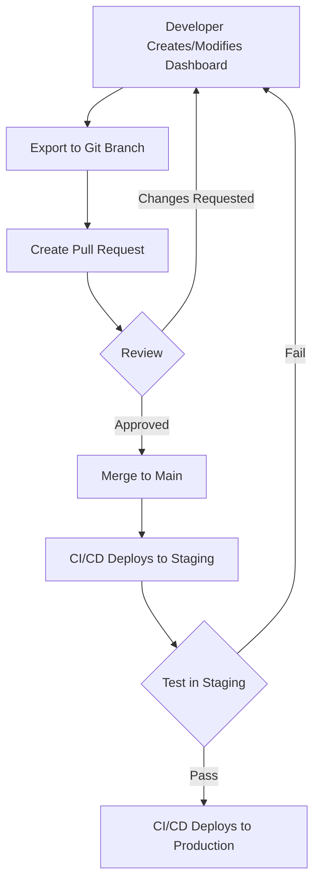

# How to Manage Dashboard Versions in Grafana

Author: [nawazdhandala](https://www.github.com/nawazdhandala)

Tags: Grafana, Dashboard Management, Version Control, Backup, Restore, DevOps, Governance

Description: Learn how to use Grafana's built-in versioning, implement Git-based version control, and establish governance practices for dashboard management.

---

## Why Version Control Dashboards?

Dashboards evolve. Someone adds a panel, another engineer tweaks a query, and suddenly your carefully designed layout is unrecognizable. Without version control, you have no way to:

- Recover from accidental changes or deletions
- Track who changed what and when
- Review changes before deploying to production
- Maintain consistency across environments

Grafana provides built-in versioning, and you can extend this with Git-based workflows for more robust control.

## Built-In Dashboard Versioning

Grafana automatically saves a new version each time you save a dashboard.

### Viewing Version History

1. Open the dashboard
2. Click the gear icon (Dashboard settings)
3. Select "Versions" from the left menu

You will see a list of all versions with:
- Version number
- Save date/time
- User who made the change
- Commit message (if provided)

### Comparing Versions

Select two versions and click "Compare" to see a diff:

```json
// Version 5 (before)
{
  "panels": [
    {
      "title": "Request Rate",
      "targets": [
        {"expr": "rate(http_requests_total[5m])"}
      ]
    }
  ]
}

// Version 6 (after)
{
  "panels": [
    {
      "title": "Request Rate per Service",  // Changed
      "targets": [
        {"expr": "sum(rate(http_requests_total[5m])) by (service)"}  // Changed
      ]
    }
  ]
}
```

Grafana highlights additions, modifications, and deletions in the JSON.

### Restoring Previous Versions

To restore a version:

1. Open version history
2. Click "Restore" next to the desired version
3. Confirm the restoration

This creates a new version based on the old one, preserving full history.

### Version Retention

By default, Grafana keeps all versions. Configure retention in `grafana.ini`:

```ini
[dashboards]
# Maximum versions to store per dashboard (0 = unlimited)
versions_to_keep = 20

# Minimum interval between saves (seconds)
min_refresh_interval = 5s
```

## Git-Based Version Control

For team collaboration and deployment automation, store dashboards in Git.

### Exporting Dashboards

Export a dashboard via the UI:
1. Dashboard settings > JSON Model
2. Copy or download the JSON

Or use the API:

```bash
# Export dashboard by UID
curl -H "Authorization: Bearer $GRAFANA_TOKEN" \
     https://grafana.example.com/api/dashboards/uid/abc123 \
     | jq '.dashboard' > dashboards/service-overview.json
```

### Repository Structure

Organize dashboards in a Git repository:

```
grafana-dashboards/
├── dashboards/
│   ├── platform/
│   │   ├── cluster-overview.json
│   │   └── node-details.json
│   ├── application/
│   │   ├── api-gateway.json
│   │   └── checkout-service.json
│   └── executive/
│       └── business-metrics.json
├── datasources/
│   ├── prometheus.yaml
│   └── loki.yaml
├── alerting/
│   └── rules.yaml
└── scripts/
    ├── export.sh
    └── import.sh
```

### Export Script

Automate dashboard export:

```bash
#!/bin/bash
# scripts/export.sh - Export all dashboards from Grafana

GRAFANA_URL="${GRAFANA_URL:-http://localhost:3000}"
GRAFANA_TOKEN="${GRAFANA_TOKEN}"
OUTPUT_DIR="dashboards"

# Get all dashboard UIDs
uids=$(curl -s -H "Authorization: Bearer $GRAFANA_TOKEN" \
    "$GRAFANA_URL/api/search?type=dash-db" | jq -r '.[].uid')

for uid in $uids; do
    # Get dashboard details
    response=$(curl -s -H "Authorization: Bearer $GRAFANA_TOKEN" \
        "$GRAFANA_URL/api/dashboards/uid/$uid")

    # Extract folder and title
    folder=$(echo "$response" | jq -r '.meta.folderTitle // "General"' | tr ' ' '-' | tr '[:upper:]' '[:lower:]')
    title=$(echo "$response" | jq -r '.dashboard.title' | tr ' ' '-' | tr '[:upper:]' '[:lower:]')

    # Create folder if needed
    mkdir -p "$OUTPUT_DIR/$folder"

    # Save dashboard JSON (remove id and version for clean import)
    echo "$response" | jq '.dashboard | del(.id, .version)' > "$OUTPUT_DIR/$folder/$title.json"

    echo "Exported: $folder/$title.json"
done
```

### Import Script

Import dashboards to Grafana:

```bash
#!/bin/bash
# scripts/import.sh - Import dashboards to Grafana

GRAFANA_URL="${GRAFANA_URL:-http://localhost:3000}"
GRAFANA_TOKEN="${GRAFANA_TOKEN}"
INPUT_DIR="dashboards"

for file in $(find "$INPUT_DIR" -name "*.json"); do
    # Extract folder from path
    folder=$(dirname "$file" | xargs basename)

    # Get or create folder ID
    folder_id=$(curl -s -H "Authorization: Bearer $GRAFANA_TOKEN" \
        "$GRAFANA_URL/api/folders" | jq -r ".[] | select(.title==\"$folder\") | .id")

    if [ -z "$folder_id" ]; then
        folder_id=$(curl -s -X POST \
            -H "Authorization: Bearer $GRAFANA_TOKEN" \
            -H "Content-Type: application/json" \
            -d "{\"title\": \"$folder\"}" \
            "$GRAFANA_URL/api/folders" | jq -r '.id')
    fi

    # Import dashboard
    dashboard=$(cat "$file")
    payload=$(jq -n --argjson dashboard "$dashboard" --arg folderId "$folder_id" \
        '{dashboard: $dashboard, folderId: ($folderId | tonumber), overwrite: true}')

    curl -s -X POST \
        -H "Authorization: Bearer $GRAFANA_TOKEN" \
        -H "Content-Type: application/json" \
        -d "$payload" \
        "$GRAFANA_URL/api/dashboards/db"

    echo "Imported: $file"
done
```

## CI/CD Pipeline Integration

Automate dashboard deployment with CI/CD.

### GitHub Actions Workflow

```yaml
# .github/workflows/deploy-dashboards.yml
name: Deploy Dashboards

on:
  push:
    branches: [main]
    paths:
      - 'dashboards/**'
  pull_request:
    branches: [main]
    paths:
      - 'dashboards/**'

jobs:
  validate:
    runs-on: ubuntu-latest
    steps:
      - uses: actions/checkout@v4

      - name: Validate JSON syntax
        run: |
          for file in dashboards/**/*.json; do
            echo "Validating $file"
            jq empty "$file"
          done

  deploy-staging:
    needs: validate
    if: github.event_name == 'pull_request'
    runs-on: ubuntu-latest
    steps:
      - uses: actions/checkout@v4

      - name: Deploy to staging
        env:
          GRAFANA_URL: ${{ secrets.GRAFANA_STAGING_URL }}
          GRAFANA_TOKEN: ${{ secrets.GRAFANA_STAGING_TOKEN }}
        run: ./scripts/import.sh

  deploy-production:
    needs: validate
    if: github.ref == 'refs/heads/main'
    runs-on: ubuntu-latest
    steps:
      - uses: actions/checkout@v4

      - name: Deploy to production
        env:
          GRAFANA_URL: ${{ secrets.GRAFANA_PROD_URL }}
          GRAFANA_TOKEN: ${{ secrets.GRAFANA_PROD_TOKEN }}
        run: ./scripts/import.sh
```

### Pull Request Review

Include dashboard JSON diffs in PR reviews:

```yaml
# Part of PR workflow
- name: Generate dashboard diff
  run: |
    git diff origin/main -- dashboards/ > dashboard-changes.diff

- name: Comment on PR
  uses: actions/github-script@v6
  with:
    script: |
      const fs = require('fs');
      const diff = fs.readFileSync('dashboard-changes.diff', 'utf8');
      github.rest.issues.createComment({
        issue_number: context.issue.number,
        owner: context.repo.owner,
        repo: context.repo.repo,
        body: '### Dashboard Changes\n```diff\n' + diff.slice(0, 60000) + '\n```'
      });
```

## Provisioning for Immutable Dashboards

Provisioning treats dashboards as code, preventing UI modifications.

### Provisioning Configuration

```yaml
# provisioning/dashboards/provider.yaml
apiVersion: 1

providers:
  - name: 'Platform Dashboards'
    orgId: 1
    folder: 'Platform'
    folderUid: 'platform'
    type: file
    disableDeletion: true
    updateIntervalSeconds: 30
    allowUiUpdates: false  # Makes dashboards read-only in UI
    options:
      path: /var/lib/grafana/dashboards/platform

  - name: 'Application Dashboards'
    orgId: 1
    folder: 'Application'
    folderUid: 'application'
    type: file
    disableDeletion: true
    allowUiUpdates: true  # Allows UI edits (useful for development)
    options:
      path: /var/lib/grafana/dashboards/application
```

### Kubernetes ConfigMap Approach

```yaml
# kubernetes/configmap.yaml
apiVersion: v1
kind: ConfigMap
metadata:
  name: grafana-dashboards
  namespace: monitoring
data:
  service-overview.json: |
    {
      "title": "Service Overview",
      "uid": "service-overview",
      ...
    }
---
apiVersion: v1
kind: ConfigMap
metadata:
  name: grafana-dashboard-provider
  namespace: monitoring
data:
  provider.yaml: |
    apiVersion: 1
    providers:
      - name: 'default'
        folder: ''
        type: file
        disableDeletion: false
        options:
          path: /var/lib/grafana/dashboards
```

## Dashboard Governance

Establish processes for dashboard management.

### Change Management Workflow



### Naming Conventions

Establish consistent naming:

```yaml
Dashboard Naming:
  Pattern: "[Team] - [Service/Domain] - [View Type]"
  Examples:
    - "Platform - Kubernetes - Cluster Overview"
    - "Payments - Checkout Service - Error Analysis"

UID Naming:
  Pattern: "[team]-[service]-[view]"
  Examples:
    - "platform-k8s-cluster"
    - "payments-checkout-errors"
```

### Required Metadata

Include metadata in every dashboard:

```json
{
  "title": "API Gateway Overview",
  "uid": "platform-api-gateway",
  "tags": ["platform", "api", "production"],
  "description": "Overview of API Gateway health, traffic, and errors",
  "annotations": {
    "list": [
      {
        "name": "Deployments",
        "datasource": "Prometheus",
        "query": "ALERTS{alertname=\"DeploymentComplete\"}"
      }
    ]
  },
  "links": [
    {
      "title": "Runbook",
      "url": "https://wiki.example.com/runbooks/api-gateway",
      "type": "link"
    }
  ]
}
```

## Backup and Disaster Recovery

Protect against data loss.

### Automated Backups

```bash
#!/bin/bash
# backup-dashboards.sh - Run daily via cron

BACKUP_DIR="/backups/grafana/$(date +%Y-%m-%d)"
mkdir -p "$BACKUP_DIR"

# Export all dashboards
./scripts/export.sh
cp -r dashboards "$BACKUP_DIR/"

# Export data sources
curl -s -H "Authorization: Bearer $GRAFANA_TOKEN" \
    "$GRAFANA_URL/api/datasources" > "$BACKUP_DIR/datasources.json"

# Export alert rules
curl -s -H "Authorization: Bearer $GRAFANA_TOKEN" \
    "$GRAFANA_URL/api/v1/provisioning/alert-rules" > "$BACKUP_DIR/alert-rules.json"

# Compress and upload to object storage
tar -czf "$BACKUP_DIR.tar.gz" "$BACKUP_DIR"
aws s3 cp "$BACKUP_DIR.tar.gz" "s3://backups/grafana/"

# Clean up old local backups (keep 7 days)
find /backups/grafana -mtime +7 -delete
```

### Recovery Procedure

Document the recovery process:

```markdown
## Grafana Dashboard Recovery

### Full Recovery
1. Restore Grafana database from backup
2. Import dashboards: `./scripts/import.sh`
3. Verify data source connectivity
4. Test critical dashboards

### Single Dashboard Recovery
1. Find dashboard in Git history or backups
2. Import via UI or API
3. Verify functionality
```

## Conclusion

Dashboard version control starts with Grafana's built-in versioning for quick rollbacks, extends to Git for team collaboration and deployment automation, and matures into full governance with provisioning and change management processes. Establish these practices early, and your dashboard collection will remain maintainable even as your monitoring needs grow.
