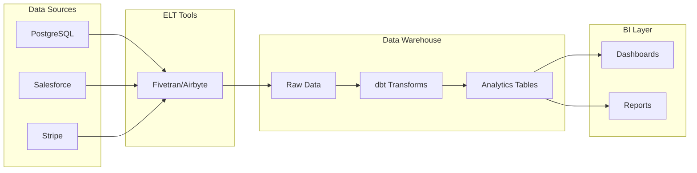
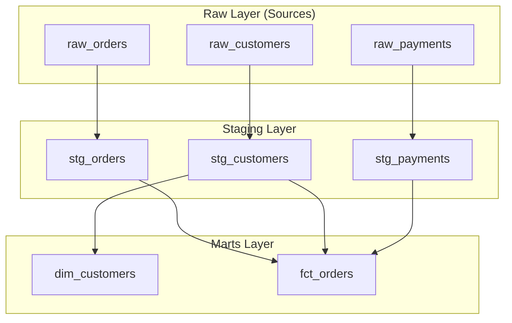
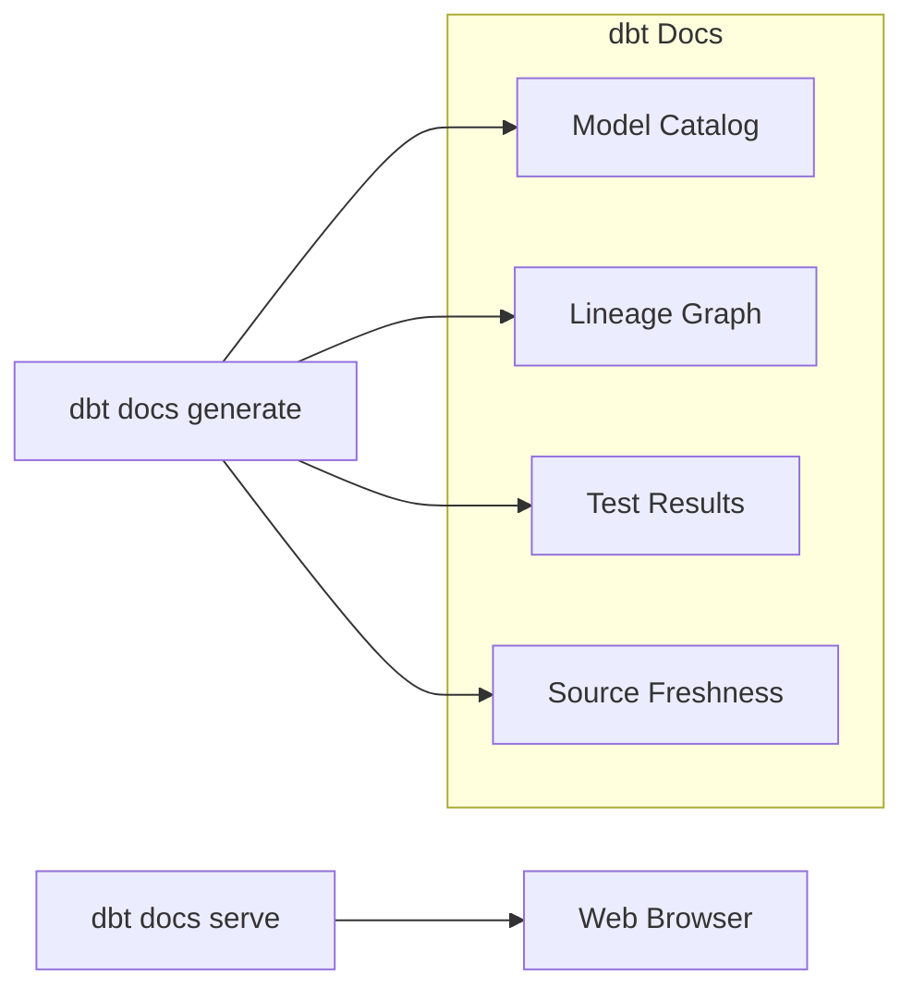

# How to Get Started with dbt for Data Transformation

Author: [nawazdhandala](https://www.github.com/nawazdhandala)

Tags: dbt, Data Engineering, Data Transformation, SQL, Analytics

Description: A beginner's guide to dbt for data transformation, covering models, tests, documentation, and building a modern analytics workflow.

---

dbt (data build tool) has become the standard for transforming data in modern data warehouses. Instead of writing complex stored procedures or Python scripts, you write modular SQL models that dbt compiles and runs in your warehouse. This guide will walk you through setting up dbt and building your first data transformation pipeline.

## What is dbt?

dbt sits between your raw data and your analytics layer. It takes raw data loaded by tools like Fivetran, Airbyte, or custom ELT pipelines and transforms it into clean, analysis-ready tables.



### Why Use dbt?

- **Version Control**: Your transformations live in Git, not in your warehouse
- **Testing**: Built-in data quality tests catch issues before they reach dashboards
- **Documentation**: Auto-generated docs keep everyone aligned
- **Modularity**: Build reusable models instead of monolithic queries
- **Lineage**: Understand how data flows through your pipeline

## Installing dbt

dbt comes in two flavors: dbt Core (open source CLI) and dbt Cloud (managed service). We will focus on dbt Core.

### Install dbt Core with Your Adapter

dbt uses adapters to connect to different warehouses. Install the one matching your warehouse:

```bash
# For Snowflake
pip install dbt-snowflake

# For BigQuery
pip install dbt-bigquery

# For PostgreSQL
pip install dbt-postgres

# For Redshift
pip install dbt-redshift

# For DuckDB (great for local development)
pip install dbt-duckdb
```

### Verify Installation

```bash
# Check dbt version
dbt --version

# Expected output:
# Core:
#   - installed: 1.7.0
# Plugins:
#   - postgres: 1.7.0
```

## Creating Your First dbt Project

Initialize a new project with `dbt init`:

```bash
# Create a new dbt project
dbt init my_analytics

# Navigate into the project
cd my_analytics
```

This creates the following structure:

```
my_analytics/
├── dbt_project.yml          # Project configuration
├── profiles.yml             # Connection profiles (usually in ~/.dbt/)
├── models/                  # Your SQL models
│   └── example/
│       ├── my_first_dbt_model.sql
│       └── schema.yml
├── seeds/                   # CSV files to load
├── snapshots/               # Slowly changing dimension tracking
├── macros/                  # Reusable SQL functions
├── tests/                   # Custom data tests
└── analyses/                # Ad-hoc queries
```

## Configuring Your Connection

dbt reads connection details from `profiles.yml`. By default, this lives in `~/.dbt/profiles.yml`.

### Example profiles.yml for PostgreSQL

```yaml
# ~/.dbt/profiles.yml
my_analytics:
  target: dev  # Default target to use
  outputs:
    dev:
      type: postgres
      host: localhost
      user: analytics_user
      password: "{{ env_var('DBT_PASSWORD') }}"  # Use environment variables for secrets
      port: 5432
      dbname: analytics
      schema: dbt_dev  # Each developer gets their own schema
      threads: 4  # Number of parallel queries

    prod:
      type: postgres
      host: prod-warehouse.company.com
      user: dbt_prod
      password: "{{ env_var('DBT_PROD_PASSWORD') }}"
      port: 5432
      dbname: analytics
      schema: analytics
      threads: 8
```

### Test Your Connection

```bash
# Verify dbt can connect to your warehouse
dbt debug

# Expected output:
# All checks passed!
```

## Understanding dbt Models

Models are SELECT statements that dbt compiles and runs in your warehouse. Each model creates a table or view.



### The Three-Layer Architecture

**1. Sources (Raw)**: References to tables loaded by your ELT tool
**2. Staging**: Light transformations like renaming, casting, and filtering
**3. Marts**: Business logic and aggregations for specific teams

### Creating Your First Model

Let's build a simple analytics pipeline. First, define your sources:

```yaml
# models/staging/sources.yml
version: 2

sources:
  - name: raw
    description: "Raw data loaded by Fivetran"
    database: analytics
    schema: raw_data
    tables:
      - name: orders
        description: "Raw orders from the ecommerce platform"
        columns:
          - name: id
            description: "Primary key"
          - name: customer_id
            description: "Foreign key to customers"
          - name: order_date
            description: "When the order was placed"
          - name: status
            description: "Order status (pending, shipped, delivered, cancelled)"
          - name: amount_cents
            description: "Order total in cents"

      - name: customers
        description: "Customer records"
        columns:
          - name: id
            description: "Primary key"
          - name: email
            description: "Customer email"
          - name: created_at
            description: "Account creation timestamp"
```

### Building Staging Models

Staging models clean up raw data with consistent naming and data types:

```sql
-- models/staging/stg_orders.sql

-- Configuration block sets materialization and other options
{{
    config(
        materialized='view',  -- Staging models are typically views
        tags=['staging', 'daily']
    )
}}

with source as (
    -- Reference the source defined in sources.yml
    select * from {{ source('raw', 'orders') }}
),

renamed as (
    select
        -- Rename columns to follow consistent naming conventions
        id as order_id,
        customer_id,

        -- Cast dates to proper timestamp type
        cast(order_date as timestamp) as ordered_at,

        -- Standardize status values to lowercase
        lower(status) as order_status,

        -- Convert cents to dollars for easier analysis
        amount_cents / 100.0 as order_amount,

        -- Add metadata columns
        current_timestamp as _loaded_at
    from source

    -- Filter out test orders that pollute analytics
    where customer_id is not null
      and customer_id != 0
)

select * from renamed
```

```sql
-- models/staging/stg_customers.sql

{{
    config(
        materialized='view',
        tags=['staging', 'daily']
    )
}}

with source as (
    select * from {{ source('raw', 'customers') }}
),

renamed as (
    select
        id as customer_id,

        -- Normalize email to lowercase for matching
        lower(trim(email)) as email,

        -- Extract email domain for analysis
        split_part(lower(trim(email)), '@', 2) as email_domain,

        cast(created_at as timestamp) as customer_created_at,

        current_timestamp as _loaded_at
    from source

    -- Filter invalid emails
    where email is not null
      and email like '%@%.%'
)

select * from renamed
```

### Building Mart Models

Mart models combine staging models to answer business questions:

```sql
-- models/marts/fct_orders.sql

-- Fact tables are materialized as tables for performance
{{
    config(
        materialized='table',
        tags=['marts', 'finance']
    )
}}

with orders as (
    -- Reference another model using the ref function
    select * from {{ ref('stg_orders') }}
),

customers as (
    select * from {{ ref('stg_customers') }}
),

-- Join orders with customer data
order_details as (
    select
        o.order_id,
        o.customer_id,
        c.email,
        c.email_domain,
        o.ordered_at,
        o.order_status,
        o.order_amount,

        -- Calculate if this is a new customer (first order)
        row_number() over (
            partition by o.customer_id
            order by o.ordered_at
        ) as customer_order_number,

        -- Date dimensions for easier filtering
        date_trunc('day', o.ordered_at) as order_date,
        date_trunc('week', o.ordered_at) as order_week,
        date_trunc('month', o.ordered_at) as order_month

    from orders o
    left join customers c on o.customer_id = c.customer_id
)

select
    *,
    -- Flag first-time buyers
    case when customer_order_number = 1 then true else false end as is_first_order
from order_details
```

```sql
-- models/marts/dim_customers.sql

{{
    config(
        materialized='table',
        tags=['marts', 'finance']
    )
}}

with customers as (
    select * from {{ ref('stg_customers') }}
),

orders as (
    select * from {{ ref('stg_orders') }}
),

-- Aggregate order metrics per customer
customer_orders as (
    select
        customer_id,
        count(*) as total_orders,
        sum(order_amount) as lifetime_value,
        min(ordered_at) as first_order_at,
        max(ordered_at) as last_order_at,
        avg(order_amount) as avg_order_value
    from orders
    group by customer_id
),

-- Combine customer info with order aggregates
final as (
    select
        c.customer_id,
        c.email,
        c.email_domain,
        c.customer_created_at,

        -- Order metrics with defaults for customers without orders
        coalesce(o.total_orders, 0) as total_orders,
        coalesce(o.lifetime_value, 0) as lifetime_value,
        coalesce(o.avg_order_value, 0) as avg_order_value,
        o.first_order_at,
        o.last_order_at,

        -- Customer segments based on behavior
        case
            when o.total_orders is null then 'never_purchased'
            when o.total_orders = 1 then 'one_time'
            when o.total_orders between 2 and 5 then 'repeat'
            else 'loyal'
        end as customer_segment,

        -- Days since last order
        extract(day from current_timestamp - o.last_order_at) as days_since_last_order

    from customers c
    left join customer_orders o on c.customer_id = o.customer_id
)

select * from final
```

## Running Your Models

Execute models with the `dbt run` command:

```bash
# Run all models
dbt run

# Run specific model and its dependencies
dbt run --select fct_orders+

# Run all models with a tag
dbt run --select tag:staging

# Run only models that have changed
dbt run --select state:modified+

# Dry run to see what would execute
dbt run --empty
```

Example output:

```
Running with dbt=1.7.0
Found 4 models, 8 tests, 0 snapshots, 0 analyses, 0 macros

Concurrency: 4 threads

1 of 4 START view model dbt_dev.stg_customers .......................... [RUN]
2 of 4 START view model dbt_dev.stg_orders ............................. [RUN]
1 of 4 OK created view model dbt_dev.stg_customers ..................... [OK in 0.82s]
2 of 4 OK created view model dbt_dev.stg_orders ........................ [OK in 0.91s]
3 of 4 START table model dbt_dev.dim_customers ......................... [RUN]
4 of 4 START table model dbt_dev.fct_orders ............................ [RUN]
3 of 4 OK created table model dbt_dev.dim_customers .................... [OK in 1.24s]
4 of 4 OK created table model dbt_dev.fct_orders ....................... [OK in 1.31s]

Finished running 2 view models, 2 table models in 4.12s.

Completed successfully
```

## Adding Tests

dbt has two types of tests: generic tests (built-in) and singular tests (custom SQL).

### Generic Tests in schema.yml

```yaml
# models/marts/schema.yml
version: 2

models:
  - name: fct_orders
    description: "Order fact table with customer details"
    columns:
      - name: order_id
        description: "Primary key"
        tests:
          - unique  # No duplicate order IDs
          - not_null  # Every row has an order ID

      - name: customer_id
        description: "Foreign key to dim_customers"
        tests:
          - not_null
          - relationships:  # Referential integrity check
              to: ref('dim_customers')
              field: customer_id

      - name: order_status
        description: "Current status of the order"
        tests:
          - accepted_values:
              values: ['pending', 'shipped', 'delivered', 'cancelled']

      - name: order_amount
        description: "Order total in dollars"
        tests:
          - not_null
          # Custom test: orders should be positive
          - dbt_utils.expression_is_true:
              expression: ">= 0"

  - name: dim_customers
    description: "Customer dimension with lifetime metrics"
    columns:
      - name: customer_id
        tests:
          - unique
          - not_null

      - name: lifetime_value
        tests:
          - not_null
          - dbt_utils.expression_is_true:
              expression: ">= 0"
```

### Singular Tests (Custom SQL)

For complex business logic, write custom test queries:

```sql
-- tests/assert_total_revenue_positive.sql
-- This test fails if any rows are returned

-- Check that daily revenue is never negative
select
    order_date,
    sum(order_amount) as daily_revenue
from {{ ref('fct_orders') }}
group by order_date
having sum(order_amount) < 0
```

```sql
-- tests/assert_no_orphan_orders.sql

-- Find orders without matching customers
select
    o.order_id,
    o.customer_id
from {{ ref('fct_orders') }} o
left join {{ ref('dim_customers') }} c
    on o.customer_id = c.customer_id
where c.customer_id is null
```

### Running Tests

```bash
# Run all tests
dbt test

# Run tests for specific model
dbt test --select fct_orders

# Run tests and stop at first failure
dbt test --fail-fast

# Store test failures in a table for debugging
dbt test --store-failures
```

## Documentation

dbt generates documentation automatically from your YAML files and model SQL.

### Adding Descriptions

```yaml
# models/marts/schema.yml
version: 2

models:
  - name: fct_orders
    description: |
      Order fact table joining order details with customer information.

      **Grain**: One row per order

      **Update frequency**: Daily

      **Primary consumers**: Finance team, Growth team

    columns:
      - name: order_id
        description: "Unique identifier for each order"

      - name: is_first_order
        description: |
          Boolean flag indicating if this was the customer's first order.
          Used for new vs returning customer analysis.
```

### Generating and Serving Docs

```bash
# Generate documentation
dbt docs generate

# Start local documentation server
dbt docs serve

# Opens browser to http://localhost:8080
```

The documentation includes:
- Model descriptions
- Column descriptions
- Data lineage DAG
- Test coverage
- Source freshness



## Incremental Models

For large tables, rebuild only new or updated rows:

```sql
-- models/marts/fct_orders_incremental.sql

{{
    config(
        materialized='incremental',
        unique_key='order_id',  -- Used for merge/upsert
        incremental_strategy='merge'  -- or 'delete+insert', 'append'
    )
}}

with orders as (
    select * from {{ ref('stg_orders') }}

    
    -- This filter only applies after the first run
    -- Only process orders newer than the max in the target table
    where ordered_at > (
        select max(ordered_at) from {{ this }}
    )
    
),

customers as (
    select * from {{ ref('stg_customers') }}
)

select
    o.order_id,
    o.customer_id,
    c.email,
    o.ordered_at,
    o.order_status,
    o.order_amount,
    current_timestamp as _updated_at
from orders o
left join customers c on o.customer_id = c.customer_id
```

### Managing Incremental Models

```bash
# Normal run - only processes new rows
dbt run --select fct_orders_incremental

# Full refresh - rebuilds entire table
dbt run --select fct_orders_incremental --full-refresh
```

## Macros for Reusable Logic

Macros are Jinja functions you can call in your models:

```sql
-- macros/cents_to_dollars.sql


    ({{ column_name }} / 100.0)

```

```sql
-- macros/generate_surrogate_key.sql


    md5(concat_ws('|',
        
            coalesce(cast({{ field }} as varchar), '')
            , 
        
    ))

```

Use macros in your models:

```sql
-- models/staging/stg_orders.sql

select
    {{ generate_surrogate_key(['id', 'customer_id']) }} as order_key,
    id as order_id,
    customer_id,
    {{ cents_to_dollars('amount_cents') }} as order_amount
from {{ source('raw', 'orders') }}
```

## Project Configuration

Configure project-wide settings in `dbt_project.yml`:

```yaml
# dbt_project.yml
name: 'my_analytics'
version: '1.0.0'

profile: 'my_analytics'

model-paths: ["models"]
analysis-paths: ["analyses"]
test-paths: ["tests"]
seed-paths: ["seeds"]
macro-paths: ["macros"]
snapshot-paths: ["snapshots"]

# Configure materializations by folder
models:
  my_analytics:
    # Staging models are views
    staging:
      +materialized: view
      +schema: staging
      +tags: ['staging']

    # Mart models are tables
    marts:
      +materialized: table
      +schema: marts
      +tags: ['marts']

      # Finance mart gets its own schema
      finance:
        +schema: finance
        +tags: ['finance']

# Persist test failures for debugging
tests:
  +store_failures: true
  +schema: dbt_test_failures

# Set variables used in models
vars:
  start_date: '2020-01-01'
  default_currency: 'USD'
```

## Best Practices

### Folder Structure

```
models/
├── staging/
│   ├── sources.yml           # Source definitions
│   ├── stg_orders.sql
│   ├── stg_customers.sql
│   └── schema.yml            # Staging tests
├── intermediate/
│   ├── int_order_items.sql   # Complex joins/logic
│   └── schema.yml
└── marts/
    ├── finance/
    │   ├── fct_orders.sql
    │   ├── dim_customers.sql
    │   └── schema.yml
    └── marketing/
        ├── fct_campaigns.sql
        └── schema.yml
```

### Naming Conventions

- **Sources**: Prefix with source system (`raw_`, `salesforce_`, `stripe_`)
- **Staging**: Prefix with `stg_` (`stg_orders`, `stg_customers`)
- **Intermediate**: Prefix with `int_` (`int_order_items`)
- **Facts**: Prefix with `fct_` (`fct_orders`, `fct_revenue`)
- **Dimensions**: Prefix with `dim_` (`dim_customers`, `dim_products`)

### Common Commands Cheatsheet

```bash
# Development workflow
dbt debug              # Test connection
dbt deps               # Install packages
dbt compile            # Compile SQL without running
dbt run                # Build all models
dbt test               # Run all tests
dbt build              # Run + test in order

# Selective execution
dbt run --select model_name          # Single model
dbt run --select model_name+         # Model and downstream
dbt run --select +model_name         # Model and upstream
dbt run --select tag:daily           # Models with tag
dbt run --select path:models/marts   # Models in folder

# Production commands
dbt run --target prod                # Run against production
dbt run --full-refresh               # Rebuild incremental models
dbt source freshness                 # Check source data freshness
```

---

dbt transforms how teams manage data transformations. By treating your SQL as code with version control, testing, and documentation, you build reliable data pipelines that scale with your organization. Start small with a few staging models, add tests, and expand to marts as your needs grow.

