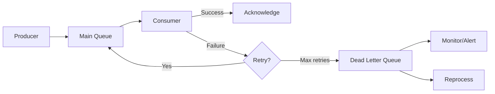

# How to Handle Dead Letter Queues in Node.js

Author: [nawazdhandala](https://www.github.com/nawazdhandala)

Tags: NodeJS, TypeScript, Message Queues, RabbitMQ, Redis, Backend, Reliability

Description: Learn how to implement dead letter queues in Node.js for handling failed messages, with retry strategies, monitoring, and reprocessing patterns for reliable message processing.

---

Messages fail. Network timeouts, malformed data, and downstream service outages cause message processing to fail. Dead letter queues (DLQs) capture these failed messages so you can analyze, fix, and reprocess them instead of losing them forever. This guide shows you how to implement robust dead letter handling in Node.js.

## What is a Dead Letter Queue?

A dead letter queue is a holding area for messages that could not be processed successfully. Instead of discarding failed messages or blocking the main queue, you move them to a DLQ where they can be:

- Analyzed to understand failure patterns
- Fixed and reprocessed
- Monitored for alerting



## Basic Dead Letter Pattern with Redis

Here is a simple implementation using Redis lists as queues.

```typescript
// dlq-redis.ts
import Redis from 'ioredis';

interface Message<T> {
  id: string;
  payload: T;
  attempts: number;
  createdAt: string;
  lastError?: string;
  lastAttemptAt?: string;
}

class DeadLetterQueue<T> {
  private redis: Redis;
  private mainQueue: string;
  private dlqQueue: string;
  private processingQueue: string;
  private maxRetries: number;

  constructor(options: {
    redis: Redis;
    queueName: string;
    maxRetries?: number;
  }) {
    this.redis = options.redis;
    this.mainQueue = `queue:${options.queueName}`;
    this.dlqQueue = `queue:${options.queueName}:dlq`;
    this.processingQueue = `queue:${options.queueName}:processing`;
    this.maxRetries = options.maxRetries ?? 3;
  }

  // Add a message to the main queue
  async enqueue(payload: T): Promise<string> {
    const message: Message<T> = {
      id: crypto.randomUUID(),
      payload,
      attempts: 0,
      createdAt: new Date().toISOString(),
    };

    await this.redis.lpush(this.mainQueue, JSON.stringify(message));
    return message.id;
  }

  // Get a message for processing
  // Uses BRPOPLPUSH for reliable processing
  async dequeue(timeout: number = 5): Promise<Message<T> | null> {
    const raw = await this.redis.brpoplpush(
      this.mainQueue,
      this.processingQueue,
      timeout
    );

    if (!raw) return null;

    return JSON.parse(raw);
  }

  // Mark message as successfully processed
  async acknowledge(message: Message<T>): Promise<void> {
    await this.redis.lrem(this.processingQueue, 1, JSON.stringify(message));
  }

  // Handle failed message
  async fail(message: Message<T>, error: Error): Promise<void> {
    // Remove from processing queue
    const originalJson = JSON.stringify(message);
    await this.redis.lrem(this.processingQueue, 1, originalJson);

    // Update message with error info
    message.attempts += 1;
    message.lastError = error.message;
    message.lastAttemptAt = new Date().toISOString();

    if (message.attempts >= this.maxRetries) {
      // Move to dead letter queue
      await this.redis.lpush(this.dlqQueue, JSON.stringify(message));
      console.log(`Message ${message.id} moved to DLQ after ${message.attempts} attempts`);
    } else {
      // Re-queue for retry with exponential backoff
      const delay = Math.pow(2, message.attempts) * 1000;
      await this.scheduleRetry(message, delay);
    }
  }

  // Schedule a delayed retry using sorted sets
  private async scheduleRetry(message: Message<T>, delayMs: number): Promise<void> {
    const retryAt = Date.now() + delayMs;
    await this.redis.zadd(
      `${this.mainQueue}:delayed`,
      retryAt,
      JSON.stringify(message)
    );
  }

  // Move due delayed messages back to main queue
  async processDelayed(): Promise<number> {
    const now = Date.now();
    const messages = await this.redis.zrangebyscore(
      `${this.mainQueue}:delayed`,
      0,
      now
    );

    for (const raw of messages) {
      // Move to main queue
      await this.redis.lpush(this.mainQueue, raw);
      await this.redis.zrem(`${this.mainQueue}:delayed`, raw);
    }

    return messages.length;
  }

  // Get DLQ message count
  async getDlqSize(): Promise<number> {
    return this.redis.llen(this.dlqQueue);
  }

  // Get messages from DLQ for inspection
  async getDlqMessages(limit: number = 10): Promise<Message<T>[]> {
    const raw = await this.redis.lrange(this.dlqQueue, 0, limit - 1);
    return raw.map(r => JSON.parse(r));
  }

  // Reprocess a single message from DLQ
  async reprocessOne(): Promise<Message<T> | null> {
    const raw = await this.redis.rpoplpush(this.dlqQueue, this.mainQueue);
    if (!raw) return null;

    const message: Message<T> = JSON.parse(raw);
    // Reset attempts for reprocessing
    message.attempts = 0;
    return message;
  }

  // Reprocess all DLQ messages
  async reprocessAll(): Promise<number> {
    let count = 0;
    while (await this.reprocessOne()) {
      count++;
    }
    return count;
  }
}

export { DeadLetterQueue, Message };
```

## Consumer Implementation

Here is how to build a consumer that properly handles retries and dead lettering.

```typescript
// consumer.ts
import { DeadLetterQueue, Message } from './dlq-redis';

interface OrderMessage {
  orderId: string;
  userId: string;
  amount: number;
}

type MessageHandler<T> = (payload: T) => Promise<void>;

class QueueConsumer<T> {
  private dlq: DeadLetterQueue<T>;
  private handler: MessageHandler<T>;
  private running: boolean = false;
  private concurrency: number;

  constructor(options: {
    dlq: DeadLetterQueue<T>;
    handler: MessageHandler<T>;
    concurrency?: number;
  }) {
    this.dlq = options.dlq;
    this.handler = options.handler;
    this.concurrency = options.concurrency ?? 1;
  }

  async start(): Promise<void> {
    this.running = true;

    // Start delayed message processor
    this.processDelayedLoop();

    // Start worker pool
    const workers = Array.from({ length: this.concurrency }, (_, i) =>
      this.workerLoop(i)
    );

    await Promise.all(workers);
  }

  stop(): void {
    this.running = false;
  }

  private async workerLoop(workerId: number): Promise<void> {
    console.log(`Worker ${workerId} started`);

    while (this.running) {
      try {
        const message = await this.dlq.dequeue(5);

        if (!message) {
          continue; // Timeout, loop again
        }

        await this.processMessage(message);
      } catch (error) {
        console.error(`Worker ${workerId} error:`, error);
        await this.sleep(1000);
      }
    }

    console.log(`Worker ${workerId} stopped`);
  }

  private async processMessage(message: Message<T>): Promise<void> {
    try {
      console.log(`Processing message ${message.id}`);
      await this.handler(message.payload);
      await this.dlq.acknowledge(message);
      console.log(`Message ${message.id} processed successfully`);
    } catch (error) {
      console.error(`Message ${message.id} failed:`, error);
      await this.dlq.fail(message, error as Error);
    }
  }

  private async processDelayedLoop(): Promise<void> {
    while (this.running) {
      try {
        const moved = await this.dlq.processDelayed();
        if (moved > 0) {
          console.log(`Moved ${moved} delayed messages to main queue`);
        }
      } catch (error) {
        console.error('Error processing delayed messages:', error);
      }

      await this.sleep(1000);
    }
  }

  private sleep(ms: number): Promise<void> {
    return new Promise(resolve => setTimeout(resolve, ms));
  }
}

// Usage
const redis = new Redis(process.env.REDIS_URL);

const dlq = new DeadLetterQueue<OrderMessage>({
  redis,
  queueName: 'orders',
  maxRetries: 3,
});

const consumer = new QueueConsumer<OrderMessage>({
  dlq,
  concurrency: 4,
  handler: async (order) => {
    // Process the order
    await processOrder(order);
  },
});

consumer.start();
```

## RabbitMQ Dead Letter Exchange

RabbitMQ has built-in dead letter exchange (DLX) support. Here is how to set it up in Node.js.

```typescript
// dlq-rabbitmq.ts
import amqp, { Connection, Channel, ConsumeMessage } from 'amqplib';

interface RabbitMQConfig {
  url: string;
  exchangeName: string;
  queueName: string;
  maxRetries?: number;
  retryDelays?: number[];
}

class RabbitMQDeadLetterQueue<T> {
  private connection?: Connection;
  private channel?: Channel;
  private config: Required<RabbitMQConfig>;

  constructor(config: RabbitMQConfig) {
    this.config = {
      maxRetries: 3,
      retryDelays: [1000, 5000, 30000],
      ...config,
    };
  }

  async connect(): Promise<void> {
    this.connection = await amqp.connect(this.config.url);
    this.channel = await this.connection.createChannel();

    // Set up exchanges
    await this.setupExchangesAndQueues();
  }

  private async setupExchangesAndQueues(): Promise<void> {
    const { exchangeName, queueName } = this.config;
    const ch = this.channel!;

    // Main exchange
    await ch.assertExchange(exchangeName, 'direct', { durable: true });

    // Dead letter exchange
    await ch.assertExchange(`${exchangeName}.dlx`, 'direct', { durable: true });

    // Retry exchange with delayed message plugin or TTL queues
    await ch.assertExchange(`${exchangeName}.retry`, 'direct', { durable: true });

    // Main queue with DLX configuration
    await ch.assertQueue(queueName, {
      durable: true,
      arguments: {
        'x-dead-letter-exchange': `${exchangeName}.dlx`,
        'x-dead-letter-routing-key': queueName,
      },
    });
    await ch.bindQueue(queueName, exchangeName, queueName);

    // Dead letter queue
    await ch.assertQueue(`${queueName}.dlq`, { durable: true });
    await ch.bindQueue(`${queueName}.dlq`, `${exchangeName}.dlx`, queueName);

    // Retry queues with different TTLs
    for (let i = 0; i < this.config.retryDelays.length; i++) {
      const delay = this.config.retryDelays[i];
      const retryQueue = `${queueName}.retry.${i}`;

      await ch.assertQueue(retryQueue, {
        durable: true,
        arguments: {
          'x-dead-letter-exchange': exchangeName,
          'x-dead-letter-routing-key': queueName,
          'x-message-ttl': delay,
        },
      });
      await ch.bindQueue(retryQueue, `${exchangeName}.retry`, `${queueName}.${i}`);
    }
  }

  async publish(payload: T, messageId?: string): Promise<void> {
    const message = {
      id: messageId || crypto.randomUUID(),
      payload,
      attempts: 0,
      createdAt: new Date().toISOString(),
    };

    this.channel!.publish(
      this.config.exchangeName,
      this.config.queueName,
      Buffer.from(JSON.stringify(message)),
      {
        persistent: true,
        messageId: message.id,
      }
    );
  }

  async consume(handler: (payload: T) => Promise<void>): Promise<void> {
    await this.channel!.prefetch(10);

    await this.channel!.consume(
      this.config.queueName,
      async (msg: ConsumeMessage | null) => {
        if (!msg) return;

        const message = JSON.parse(msg.content.toString());

        try {
          await handler(message.payload);
          this.channel!.ack(msg);
        } catch (error) {
          await this.handleFailure(msg, message, error as Error);
        }
      }
    );
  }

  private async handleFailure(
    msg: ConsumeMessage,
    message: { id: string; payload: T; attempts: number },
    error: Error
  ): Promise<void> {
    message.attempts += 1;

    if (message.attempts >= this.config.maxRetries) {
      // Send to DLQ by rejecting without requeue
      // RabbitMQ will route to DLX
      this.channel!.reject(msg, false);
      console.log(`Message ${message.id} sent to DLQ`);
    } else {
      // Acknowledge original message
      this.channel!.ack(msg);

      // Publish to retry queue with appropriate delay
      const retryIndex = Math.min(message.attempts - 1, this.config.retryDelays.length - 1);

      this.channel!.publish(
        `${this.config.exchangeName}.retry`,
        `${this.config.queueName}.${retryIndex}`,
        Buffer.from(JSON.stringify({
          ...message,
          lastError: error.message,
          lastAttemptAt: new Date().toISOString(),
        })),
        { persistent: true }
      );

      console.log(`Message ${message.id} scheduled for retry ${message.attempts}`);
    }
  }

  // Reprocess messages from DLQ
  async reprocessDlq(handler: (payload: T) => Promise<void>): Promise<number> {
    let processed = 0;

    await this.channel!.consume(
      `${this.config.queueName}.dlq`,
      async (msg: ConsumeMessage | null) => {
        if (!msg) return;

        const message = JSON.parse(msg.content.toString());
        // Reset attempts
        message.attempts = 0;

        try {
          await handler(message.payload);
          this.channel!.ack(msg);
          processed++;
        } catch (error) {
          // Keep in DLQ if still failing
          this.channel!.reject(msg, false);
        }
      },
      { noAck: false }
    );

    return processed;
  }

  async close(): Promise<void> {
    await this.channel?.close();
    await this.connection?.close();
  }
}

export { RabbitMQDeadLetterQueue };
```

## DLQ Monitoring and Alerting

Monitoring your dead letter queues is essential for production reliability.

```typescript
// dlq-monitor.ts
import { DeadLetterQueue } from './dlq-redis';
import { Gauge, Counter } from 'prom-client';

// Prometheus metrics for DLQ monitoring
const dlqSize = new Gauge({
  name: 'dlq_messages_total',
  help: 'Number of messages in dead letter queue',
  labelNames: ['queue'],
});

const dlqProcessed = new Counter({
  name: 'dlq_messages_processed_total',
  help: 'Total messages processed from DLQ',
  labelNames: ['queue', 'status'],
});

interface DLQStats {
  queueName: string;
  size: number;
  oldestMessage?: {
    id: string;
    createdAt: string;
    attempts: number;
    lastError?: string;
  };
  errorBreakdown: Record<string, number>;
}

class DLQMonitor<T> {
  private dlq: DeadLetterQueue<T>;
  private queueName: string;
  private alertThreshold: number;
  private onAlert?: (stats: DLQStats) => void;

  constructor(options: {
    dlq: DeadLetterQueue<T>;
    queueName: string;
    alertThreshold?: number;
    onAlert?: (stats: DLQStats) => void;
  }) {
    this.dlq = options.dlq;
    this.queueName = options.queueName;
    this.alertThreshold = options.alertThreshold ?? 100;
    this.onAlert = options.onAlert;
  }

  async getStats(): Promise<DLQStats> {
    const size = await this.dlq.getDlqSize();
    const messages = await this.dlq.getDlqMessages(100);

    // Count errors by type
    const errorBreakdown: Record<string, number> = {};
    for (const msg of messages) {
      const errorType = msg.lastError || 'Unknown';
      errorBreakdown[errorType] = (errorBreakdown[errorType] || 0) + 1;
    }

    // Find oldest message
    const oldest = messages.length > 0 ? messages[messages.length - 1] : undefined;

    return {
      queueName: this.queueName,
      size,
      oldestMessage: oldest ? {
        id: oldest.id,
        createdAt: oldest.createdAt,
        attempts: oldest.attempts,
        lastError: oldest.lastError,
      } : undefined,
      errorBreakdown,
    };
  }

  async checkAndAlert(): Promise<void> {
    const stats = await this.getStats();

    // Update Prometheus metric
    dlqSize.set({ queue: this.queueName }, stats.size);

    // Check alert threshold
    if (stats.size >= this.alertThreshold && this.onAlert) {
      this.onAlert(stats);
    }
  }

  // Start periodic monitoring
  startMonitoring(intervalMs: number = 60000): NodeJS.Timeout {
    return setInterval(() => this.checkAndAlert(), intervalMs);
  }
}

// Alerting integration
async function sendSlackAlert(stats: DLQStats): Promise<void> {
  const webhookUrl = process.env.SLACK_WEBHOOK_URL;
  if (!webhookUrl) return;

  await fetch(webhookUrl, {
    method: 'POST',
    headers: { 'Content-Type': 'application/json' },
    body: JSON.stringify({
      text: `DLQ Alert: ${stats.queueName}`,
      blocks: [
        {
          type: 'section',
          text: {
            type: 'mrkdwn',
            text: `*Dead Letter Queue Alert*\n` +
              `Queue: ${stats.queueName}\n` +
              `Messages: ${stats.size}\n` +
              `Oldest: ${stats.oldestMessage?.createdAt || 'N/A'}`,
          },
        },
        {
          type: 'section',
          text: {
            type: 'mrkdwn',
            text: `*Error Breakdown:*\n` +
              Object.entries(stats.errorBreakdown)
                .map(([error, count]) => `- ${error}: ${count}`)
                .join('\n'),
          },
        },
      ],
    }),
  });
}

// Usage
const monitor = new DLQMonitor({
  dlq,
  queueName: 'orders',
  alertThreshold: 50,
  onAlert: sendSlackAlert,
});

monitor.startMonitoring(60000); // Check every minute
```

## Reprocessing Strategies

Different failure types require different reprocessing approaches.

```typescript
// reprocessing.ts
import { DeadLetterQueue, Message } from './dlq-redis';

interface ReprocessConfig {
  // Filter messages to reprocess
  filter?: (message: Message<unknown>) => boolean;
  // Transform message before reprocessing
  transform?: (message: Message<unknown>) => Message<unknown>;
  // Batch size for reprocessing
  batchSize?: number;
  // Delay between batches
  batchDelayMs?: number;
}

class DLQReprocessor<T> {
  private dlq: DeadLetterQueue<T>;

  constructor(dlq: DeadLetterQueue<T>) {
    this.dlq = dlq;
  }

  // Reprocess with filtering and transformation
  async reprocess(config: ReprocessConfig = {}): Promise<{
    processed: number;
    skipped: number;
  }> {
    const { filter, transform, batchSize = 10, batchDelayMs = 100 } = config;

    const messages = await this.dlq.getDlqMessages(1000);
    let processed = 0;
    let skipped = 0;

    for (let i = 0; i < messages.length; i += batchSize) {
      const batch = messages.slice(i, i + batchSize);

      for (const message of batch) {
        // Apply filter
        if (filter && !filter(message as Message<unknown>)) {
          skipped++;
          continue;
        }

        // Apply transformation
        let toReprocess = message;
        if (transform) {
          toReprocess = transform(message as Message<unknown>) as Message<T>;
        }

        // Re-enqueue
        await this.dlq.enqueue(toReprocess.payload);
        processed++;
      }

      // Rate limiting between batches
      if (i + batchSize < messages.length) {
        await new Promise(r => setTimeout(r, batchDelayMs));
      }
    }

    return { processed, skipped };
  }

  // Reprocess only messages with specific error
  async reprocessByError(errorPattern: string | RegExp): Promise<number> {
    const result = await this.reprocess({
      filter: (msg) => {
        if (!msg.lastError) return false;
        if (typeof errorPattern === 'string') {
          return msg.lastError.includes(errorPattern);
        }
        return errorPattern.test(msg.lastError);
      },
    });
    return result.processed;
  }

  // Reprocess messages from a specific time range
  async reprocessByTimeRange(startTime: Date, endTime: Date): Promise<number> {
    const result = await this.reprocess({
      filter: (msg) => {
        const created = new Date(msg.createdAt);
        return created >= startTime && created <= endTime;
      },
    });
    return result.processed;
  }

  // Clear DLQ after analysis (be careful)
  async clearDlq(): Promise<number> {
    const messages = await this.dlq.getDlqMessages(10000);
    // Archive to cold storage before clearing
    await this.archiveMessages(messages);
    // Then clear
    return messages.length;
  }

  private async archiveMessages(messages: Message<T>[]): Promise<void> {
    // Store in S3, database, or other cold storage
    console.log(`Archiving ${messages.length} messages`);
  }
}

export { DLQReprocessor };
```

## Summary

| Component | Purpose |
|-----------|---------|
| Dead Letter Queue | Captures failed messages |
| Retry with backoff | Handles transient failures |
| Monitoring | Alerts on DLQ buildup |
| Reprocessing | Recovers from failures |
| Error analysis | Identifies root causes |

Dead letter queues are essential for building reliable message processing systems. They ensure no message is lost, provide visibility into failures, and give you the ability to recover from issues. Combining DLQs with proper monitoring and reprocessing strategies creates a robust foundation for any event-driven architecture.
