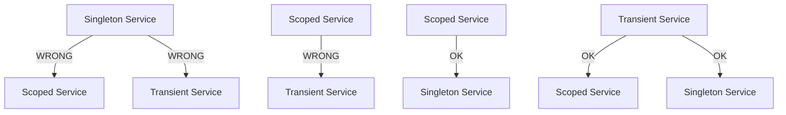

# How to Master Dependency Injection Scopes in .NET 8

Author: [nawazdhandala](https://www.github.com/nawazdhandala)

Tags: .NET, C#, Dependency Injection, DI Scopes, ASP.NET Core, Best Practices

Description: A practical guide to understanding and using dependency injection scopes in .NET 8. Learn when to use Transient, Scoped, and Singleton lifetimes, plus common pitfalls to avoid.

---

Dependency injection is fundamental to .NET development, but choosing the wrong service lifetime can lead to subtle bugs, memory leaks, and thread-safety issues. This guide explains each scope with real-world examples and shows you how to avoid common mistakes.

## The Three Service Lifetimes

.NET provides three built-in service lifetimes:

| Lifetime | Instance Created | Best For |
|----------|------------------|----------|
| **Transient** | Every time requested | Lightweight, stateless services |
| **Scoped** | Once per request/scope | Database contexts, unit of work |
| **Singleton** | Once for app lifetime | Configuration, caches, HTTP clients |

Let us explore each one with practical examples.

## Transient Services

Transient services create a new instance every time they are requested from the container. Use them for lightweight, stateless operations.

```csharp
// A transient service for generating unique identifiers
public interface IIdGenerator
{
    Guid GenerateId();
}

public class GuidGenerator : IIdGenerator
{
    // Each instance gets its own ID for demonstration
    private readonly Guid _instanceId = Guid.NewGuid();

    public Guid GenerateId()
    {
        Console.WriteLine($"Generator instance: {_instanceId}");
        return Guid.NewGuid();
    }
}

// Registration
builder.Services.AddTransient<IIdGenerator, GuidGenerator>();
```

### When Transient Goes Wrong

Transient services with expensive initialization cause performance problems:

```csharp
// BAD: Expensive initialization in a transient service
public class ExpensiveTransient : IExpensiveService
{
    private readonly List<ConfigItem> _config;

    public ExpensiveTransient()
    {
        // This runs EVERY time the service is requested
        _config = LoadConfigurationFromDatabase(); // Expensive!
    }
}

// BETTER: Use singleton or cache the expensive operation
builder.Services.AddSingleton<IExpensiveService, ExpensiveService>();
```

## Scoped Services

Scoped services create one instance per request (in web apps) or per scope (in console apps). They are perfect for services that should share state within a single operation but not across operations.

```csharp
// A scoped service for tracking operations within a request
public interface IOperationTracker
{
    Guid OperationId { get; }
    void LogOperation(string message);
    IReadOnlyList<string> GetLogs();
}

public class RequestOperationTracker : IOperationTracker
{
    public Guid OperationId { get; } = Guid.NewGuid();
    private readonly List<string> _logs = new();

    public void LogOperation(string message)
    {
        _logs.Add($"[{DateTime.UtcNow:HH:mm:ss.fff}] {message}");
    }

    public IReadOnlyList<string> GetLogs() => _logs.AsReadOnly();
}

// Registration
builder.Services.AddScoped<IOperationTracker, RequestOperationTracker>();
```

### Database Contexts Should Be Scoped

Entity Framework DbContext is the classic example of a scoped service:

```csharp
// DbContext is registered as scoped by default
builder.Services.AddDbContext<AppDbContext>(options =>
    options.UseNpgsql(connectionString));

// This ensures all operations in a request share the same context
// and can participate in the same transaction
public class OrderService
{
    private readonly AppDbContext _context;
    private readonly IOperationTracker _tracker;

    public OrderService(AppDbContext context, IOperationTracker tracker)
    {
        _context = context;
        _tracker = tracker;
    }

    public async Task<Order> CreateOrderAsync(CreateOrderRequest request)
    {
        _tracker.LogOperation("Creating order");

        var order = new Order { /* ... */ };
        _context.Orders.Add(order);

        _tracker.LogOperation("Adding order items");
        foreach (var item in request.Items)
        {
            _context.OrderItems.Add(new OrderItem { /* ... */ });
        }

        // All changes saved in one transaction
        await _context.SaveChangesAsync();

        _tracker.LogOperation($"Order {order.Id} created");
        return order;
    }
}
```

## Singleton Services

Singleton services create one instance for the entire application lifetime. Use them for stateless services, configuration, or thread-safe caches.

```csharp
// A singleton cache service
public interface ICacheService
{
    T? Get<T>(string key);
    void Set<T>(string key, T value, TimeSpan expiration);
}

public class InMemoryCacheService : ICacheService
{
    // ConcurrentDictionary is thread-safe for singleton use
    private readonly ConcurrentDictionary<string, CacheEntry> _cache = new();

    public T? Get<T>(string key)
    {
        if (_cache.TryGetValue(key, out var entry) && entry.ExpiresAt > DateTime.UtcNow)
        {
            return (T)entry.Value;
        }
        return default;
    }

    public void Set<T>(string key, T value, TimeSpan expiration)
    {
        var entry = new CacheEntry(value!, DateTime.UtcNow.Add(expiration));
        _cache.AddOrUpdate(key, entry, (_, _) => entry);
    }

    private record CacheEntry(object Value, DateTime ExpiresAt);
}

// Registration
builder.Services.AddSingleton<ICacheService, InMemoryCacheService>();
```

### HttpClient Should Be Singleton (via Factory)

```csharp
// Register HttpClient properly using the factory pattern
builder.Services.AddHttpClient<IExternalApiClient, ExternalApiClient>(client =>
{
    client.BaseAddress = new Uri("https://api.example.com");
    client.Timeout = TimeSpan.FromSeconds(30);
})
.AddTransientHttpErrorPolicy(policy =>
    policy.WaitAndRetryAsync(3, attempt => TimeSpan.FromSeconds(Math.Pow(2, attempt))));

// The HttpClient is managed by the factory (effectively singleton)
// but the typed client wrapper can have any lifetime
public class ExternalApiClient : IExternalApiClient
{
    private readonly HttpClient _client;

    public ExternalApiClient(HttpClient client)
    {
        _client = client;
    }

    public async Task<Product?> GetProductAsync(int id)
    {
        var response = await _client.GetAsync($"/products/{id}");
        response.EnsureSuccessStatusCode();
        return await response.Content.ReadFromJsonAsync<Product>();
    }
}
```

## The Captive Dependency Problem

The most common DI mistake is injecting a shorter-lived service into a longer-lived one. This is called the "captive dependency" problem.



### The Bug in Action

```csharp
// DANGER: Singleton capturing a scoped service
public class SingletonReportGenerator : IReportGenerator
{
    private readonly AppDbContext _context; // Scoped!

    public SingletonReportGenerator(AppDbContext context)
    {
        // This DbContext will be captured and reused across ALL requests
        // Leading to threading issues and stale data
        _context = context;
    }
}

// This will fail at runtime with ValidateScopes enabled
builder.Services.AddSingleton<IReportGenerator, SingletonReportGenerator>();
```

### Enable Scope Validation

Always enable scope validation in development to catch these issues early:

```csharp
var builder = WebApplication.CreateBuilder(args);

// Enable validation in development
if (builder.Environment.IsDevelopment())
{
    builder.Host.UseDefaultServiceProvider(options =>
    {
        options.ValidateScopes = true;
        options.ValidateOnBuild = true;
    });
}
```

### Fix Using IServiceScopeFactory

When a singleton needs to access scoped services, create a scope:

```csharp
public class SingletonReportGenerator : IReportGenerator
{
    private readonly IServiceScopeFactory _scopeFactory;

    public SingletonReportGenerator(IServiceScopeFactory scopeFactory)
    {
        _scopeFactory = scopeFactory;
    }

    public async Task<Report> GenerateReportAsync()
    {
        // Create a new scope for this operation
        using var scope = _scopeFactory.CreateScope();

        // Resolve scoped services from the new scope
        var context = scope.ServiceProvider.GetRequiredService<AppDbContext>();

        var data = await context.Orders
            .Where(o => o.CreatedAt > DateTime.UtcNow.AddDays(-30))
            .ToListAsync();

        return new Report { /* ... */ };
    }
}
```

## Background Services and Scopes

Hosted services are singletons, so they need special handling for scoped dependencies:

```csharp
public class OrderProcessingBackgroundService : BackgroundService
{
    private readonly IServiceScopeFactory _scopeFactory;
    private readonly ILogger<OrderProcessingBackgroundService> _logger;

    public OrderProcessingBackgroundService(
        IServiceScopeFactory scopeFactory,
        ILogger<OrderProcessingBackgroundService> logger)
    {
        _scopeFactory = scopeFactory;
        _logger = logger;
    }

    protected override async Task ExecuteAsync(CancellationToken stoppingToken)
    {
        while (!stoppingToken.IsCancellationRequested)
        {
            try
            {
                // Each iteration gets its own scope
                using var scope = _scopeFactory.CreateScope();
                var orderService = scope.ServiceProvider
                    .GetRequiredService<IOrderProcessingService>();

                await orderService.ProcessPendingOrdersAsync(stoppingToken);
            }
            catch (Exception ex)
            {
                _logger.LogError(ex, "Error processing orders");
            }

            await Task.Delay(TimeSpan.FromMinutes(1), stoppingToken);
        }
    }
}
```

## Keyed Services in .NET 8

.NET 8 introduces keyed services for registering multiple implementations:

```csharp
// Register multiple implementations with keys
builder.Services.AddKeyedSingleton<IPaymentProcessor, StripePaymentProcessor>("stripe");
builder.Services.AddKeyedSingleton<IPaymentProcessor, PayPalPaymentProcessor>("paypal");
builder.Services.AddKeyedSingleton<IPaymentProcessor, SquarePaymentProcessor>("square");

// Inject by key
public class PaymentService
{
    private readonly IPaymentProcessor _processor;

    public PaymentService(
        [FromKeyedServices("stripe")] IPaymentProcessor processor)
    {
        _processor = processor;
    }
}

// Or resolve dynamically
public class DynamicPaymentService
{
    private readonly IServiceProvider _provider;

    public DynamicPaymentService(IServiceProvider provider)
    {
        _provider = provider;
    }

    public async Task ProcessPaymentAsync(string provider, PaymentRequest request)
    {
        var processor = _provider.GetRequiredKeyedService<IPaymentProcessor>(provider);
        await processor.ProcessAsync(request);
    }
}
```

## Practical Guidelines

### Choosing the Right Lifetime

| Service Type | Recommended Lifetime | Reason |
|--------------|---------------------|--------|
| DbContext | Scoped | Tracks changes per request |
| Repository | Scoped | Usually wraps DbContext |
| Unit of Work | Scoped | Coordinates multiple repos |
| Validators | Transient | Stateless, lightweight |
| HttpClient | Singleton (via factory) | Socket exhaustion prevention |
| Configuration | Singleton | Read once, use everywhere |
| Logging | Singleton | Thread-safe by design |
| Cache | Singleton | Shared across requests |
| Background tasks | Singleton (create scopes inside) | Long-running by nature |

### Testing Tip

When writing tests, you can override lifetimes to control behavior:

```csharp
[Fact]
public async Task OrderService_CreatesOrder_Successfully()
{
    // Arrange
    var services = new ServiceCollection();

    // Use singleton for deterministic testing
    services.AddSingleton<IIdGenerator>(new FixedIdGenerator(testId));
    services.AddDbContext<AppDbContext>(o => o.UseInMemoryDatabase("test"));
    services.AddScoped<IOrderService, OrderService>();

    using var provider = services.BuildServiceProvider();
    using var scope = provider.CreateScope();

    var orderService = scope.ServiceProvider.GetRequiredService<IOrderService>();

    // Act
    var result = await orderService.CreateOrderAsync(request);

    // Assert
    Assert.Equal(testId, result.Id);
}
```

## Summary

Dependency injection scopes are straightforward once you understand the rules:

1. **Transient**: New instance every time. Use for stateless, lightweight services.
2. **Scoped**: One instance per request. Use for database contexts and request-specific state.
3. **Singleton**: One instance forever. Use for configuration, caches, and thread-safe services.

The golden rule: never inject a shorter-lived service into a longer-lived one. Enable `ValidateScopes` in development to catch violations early. When singletons need scoped services, use `IServiceScopeFactory` to create explicit scopes.
