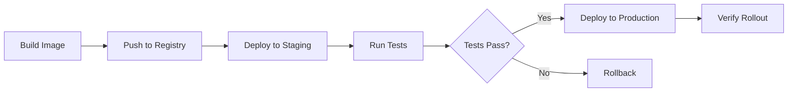

# How to Deploy to Kubernetes with GitLab CI

Author: [nawazdhandala](https://www.github.com/nawazdhandala)

Tags: GitLab CI, Kubernetes, Deployment, DevOps, CI/CD, Container Orchestration

Description: Learn how to deploy applications to Kubernetes clusters from GitLab CI using kubectl, Helm, and the GitLab Kubernetes Agent for secure, automated deployments.

---

Deploying to Kubernetes from GitLab CI connects your pipeline directly to your runtime environment. You can update deployments, run migrations, and verify rollouts automatically. This guide covers the practical approaches to Kubernetes deployments, from simple kubectl commands to full Helm releases.

## Authentication Methods

Before deploying, your pipeline needs access to your Kubernetes cluster. There are several ways to handle this.

### GitLab Kubernetes Agent

The recommended approach uses the GitLab Kubernetes Agent, which provides secure, pull-based access without exposing cluster credentials.

First, install the agent in your cluster:

```yaml
# agent-config.yaml in your project
gitops:
  manifest_projects:
    - id: your-group/your-project
      paths:
        - glob: 'manifests/**/*.yaml'

ci_access:
  projects:
    - id: your-group/your-project
```

Then reference it in your pipeline:

```yaml
deploy:
  stage: deploy
  image:
    name: bitnami/kubectl:latest
    entrypoint: [""]
  script:
    # The agent context is automatically available
    - kubectl config use-context your-group/your-project:agent-name
    - kubectl apply -f manifests/
  environment:
    name: production
    kubernetes:
      namespace: production
```

### Kubeconfig File

For clusters without the GitLab Agent, use a kubeconfig stored as a CI variable.

```yaml
deploy:
  stage: deploy
  image:
    name: bitnami/kubectl:latest
    entrypoint: [""]
  before_script:
    # KUBECONFIG_FILE is a file-type CI variable
    - export KUBECONFIG=$KUBECONFIG_FILE
  script:
    - kubectl get nodes
    - kubectl apply -f manifests/
```

Store the kubeconfig as a file-type variable in Settings, then CI/CD, then Variables. Mark it as protected if it accesses production clusters.

## Basic Deployment with kubectl

The simplest deployment updates a container image.

```yaml
stages:
  - build
  - deploy

variables:
  APP_NAME: "my-api"
  KUBE_NAMESPACE: "production"

build:
  stage: build
  image: docker:24.0
  services:
    - docker:24.0-dind
  script:
    - docker login -u $CI_REGISTRY_USER -p $CI_REGISTRY_PASSWORD $CI_REGISTRY
    - docker build -t $CI_REGISTRY_IMAGE:$CI_COMMIT_SHA .
    - docker push $CI_REGISTRY_IMAGE:$CI_COMMIT_SHA

deploy:
  stage: deploy
  image:
    name: bitnami/kubectl:latest
    entrypoint: [""]
  script:
    # Update the deployment image
    - kubectl -n $KUBE_NAMESPACE set image deployment/$APP_NAME app=$CI_REGISTRY_IMAGE:$CI_COMMIT_SHA
    # Wait for rollout to complete
    - kubectl -n $KUBE_NAMESPACE rollout status deployment/$APP_NAME --timeout=300s
  environment:
    name: production
    url: https://api.example.com
```

## Deployment Flow

Here's a typical Kubernetes deployment pipeline:



## Applying Manifest Files

For more control, apply complete manifest files with variable substitution.

```yaml
deploy:
  stage: deploy
  image:
    name: bitnami/kubectl:latest
    entrypoint: [""]
  before_script:
    - apk add --no-cache gettext  # For envsubst
  script:
    # Substitute environment variables in manifests
    - envsubst < manifests/deployment.yaml > deployment-rendered.yaml
    - kubectl apply -f deployment-rendered.yaml
    - kubectl apply -f manifests/service.yaml
    - kubectl rollout status deployment/$APP_NAME -n $KUBE_NAMESPACE
  variables:
    IMAGE_TAG: $CI_COMMIT_SHA
    REPLICAS: "3"
```

Your manifest template:

```yaml
# manifests/deployment.yaml
apiVersion: apps/v1
kind: Deployment
metadata:
  name: ${APP_NAME}
  namespace: ${KUBE_NAMESPACE}
spec:
  replicas: ${REPLICAS}
  selector:
    matchLabels:
      app: ${APP_NAME}
  template:
    metadata:
      labels:
        app: ${APP_NAME}
    spec:
      containers:
        - name: app
          image: ${CI_REGISTRY_IMAGE}:${IMAGE_TAG}
          ports:
            - containerPort: 3000
          env:
            - name: NODE_ENV
              value: production
```

## Helm Deployments

Helm provides templating, versioning, and rollback capabilities out of the box.

```yaml
deploy:
  stage: deploy
  image:
    name: alpine/helm:latest
    entrypoint: [""]
  before_script:
    - export KUBECONFIG=$KUBECONFIG_FILE
  script:
    # Add repository if using external charts
    - helm repo add stable https://charts.helm.sh/stable
    - helm repo update

    # Deploy using values file
    - helm upgrade --install $APP_NAME ./chart
      --namespace $KUBE_NAMESPACE
      --create-namespace
      --set image.repository=$CI_REGISTRY_IMAGE
      --set image.tag=$CI_COMMIT_SHA
      --values ./chart/values-production.yaml
      --wait
      --timeout 5m
  environment:
    name: production
```

Your Helm chart structure:

```
chart/
  Chart.yaml
  values.yaml
  values-staging.yaml
  values-production.yaml
  templates/
    deployment.yaml
    service.yaml
    ingress.yaml
```

```yaml
# chart/values-production.yaml
replicaCount: 3
resources:
  requests:
    memory: "256Mi"
    cpu: "200m"
  limits:
    memory: "512Mi"
    cpu: "500m"
ingress:
  enabled: true
  hosts:
    - api.example.com
```

## Multi-Environment Deployments

Deploy to multiple environments with shared configuration.

```yaml
stages:
  - build
  - deploy-staging
  - deploy-production

.deploy-template:
  image:
    name: bitnami/kubectl:latest
    entrypoint: [""]
  script:
    - kubectl config use-context ${KUBE_CONTEXT}
    - kubectl -n ${KUBE_NAMESPACE} set image deployment/${APP_NAME} app=${CI_REGISTRY_IMAGE}:${CI_COMMIT_SHA}
    - kubectl -n ${KUBE_NAMESPACE} rollout status deployment/${APP_NAME}

deploy-staging:
  extends: .deploy-template
  stage: deploy-staging
  variables:
    KUBE_CONTEXT: "staging-cluster"
    KUBE_NAMESPACE: "staging"
  environment:
    name: staging
    url: https://staging.example.com
  only:
    - develop

deploy-production:
  extends: .deploy-template
  stage: deploy-production
  variables:
    KUBE_CONTEXT: "production-cluster"
    KUBE_NAMESPACE: "production"
  environment:
    name: production
    url: https://example.com
  when: manual
  only:
    - main
```

## Running Migrations

Run database migrations before deployment updates.

```yaml
stages:
  - build
  - migrate
  - deploy

migrate:
  stage: migrate
  image:
    name: bitnami/kubectl:latest
    entrypoint: [""]
  script:
    # Run migration as a Kubernetes Job
    - |
      cat <<EOF | kubectl apply -f -
      apiVersion: batch/v1
      kind: Job
      metadata:
        name: migrate-${CI_COMMIT_SHORT_SHA}
        namespace: ${KUBE_NAMESPACE}
      spec:
        ttlSecondsAfterFinished: 300
        template:
          spec:
            restartPolicy: Never
            containers:
              - name: migrate
                image: ${CI_REGISTRY_IMAGE}:${CI_COMMIT_SHA}
                command: ["npm", "run", "migrate"]
                envFrom:
                  - secretRef:
                      name: app-secrets
      EOF
    # Wait for migration to complete
    - kubectl -n ${KUBE_NAMESPACE} wait --for=condition=complete job/migrate-${CI_COMMIT_SHORT_SHA} --timeout=300s
```

## Canary Deployments

Roll out changes gradually to reduce risk.

```yaml
deploy-canary:
  stage: deploy
  script:
    # Deploy canary with 10% traffic
    - kubectl -n ${KUBE_NAMESPACE} set image deployment/${APP_NAME}-canary app=${CI_REGISTRY_IMAGE}:${CI_COMMIT_SHA}
    - kubectl -n ${KUBE_NAMESPACE} scale deployment/${APP_NAME}-canary --replicas=1

verify-canary:
  stage: verify
  script:
    # Run smoke tests against canary
    - ./scripts/smoke-test.sh https://canary.example.com
  needs:
    - deploy-canary

promote-canary:
  stage: deploy
  script:
    # Roll out to main deployment
    - kubectl -n ${KUBE_NAMESPACE} set image deployment/${APP_NAME} app=${CI_REGISTRY_IMAGE}:${CI_COMMIT_SHA}
    - kubectl -n ${KUBE_NAMESPACE} rollout status deployment/${APP_NAME}
    # Scale down canary
    - kubectl -n ${KUBE_NAMESPACE} scale deployment/${APP_NAME}-canary --replicas=0
  needs:
    - verify-canary
  when: manual
```

## Rollback Strategies

Handle failed deployments gracefully.

```yaml
deploy:
  stage: deploy
  script:
    - kubectl -n ${KUBE_NAMESPACE} set image deployment/${APP_NAME} app=${CI_REGISTRY_IMAGE}:${CI_COMMIT_SHA}
    # Rollback if rollout fails
    - |
      if ! kubectl -n ${KUBE_NAMESPACE} rollout status deployment/${APP_NAME} --timeout=300s; then
        echo "Deployment failed, rolling back"
        kubectl -n ${KUBE_NAMESPACE} rollout undo deployment/${APP_NAME}
        exit 1
      fi
```

Manual rollback job:

```yaml
rollback:
  stage: deploy
  script:
    # Undo last deployment
    - kubectl -n ${KUBE_NAMESPACE} rollout undo deployment/${APP_NAME}
    - kubectl -n ${KUBE_NAMESPACE} rollout status deployment/${APP_NAME}
  when: manual
  environment:
    name: production
    action: stop
```

## Verifying Deployments

Add post-deployment verification.

```yaml
deploy:
  stage: deploy
  script:
    - kubectl -n ${KUBE_NAMESPACE} set image deployment/${APP_NAME} app=${CI_REGISTRY_IMAGE}:${CI_COMMIT_SHA}
    - kubectl -n ${KUBE_NAMESPACE} rollout status deployment/${APP_NAME}
  after_script:
    # Verify the deployment
    - |
      POD=$(kubectl -n ${KUBE_NAMESPACE} get pods -l app=${APP_NAME} -o jsonpath='{.items[0].metadata.name}')
      kubectl -n ${KUBE_NAMESPACE} exec $POD -- curl -f http://localhost:3000/health
    # Send deployment notification
    - |
      curl -X POST "https://oneuptime.example.com/api/v1/deployments" \
        -H "Content-Type: application/json" \
        -d "{\"app\": \"${APP_NAME}\", \"version\": \"${CI_COMMIT_SHA}\", \"status\": \"success\"}"
```

## Namespace Management

Create and manage namespaces per environment.

```yaml
setup-namespace:
  stage: prepare
  script:
    - |
      kubectl create namespace ${KUBE_NAMESPACE} --dry-run=client -o yaml | kubectl apply -f -
    # Apply resource quotas
    - kubectl apply -f manifests/resource-quota.yaml -n ${KUBE_NAMESPACE}
    # Create image pull secret
    - |
      kubectl -n ${KUBE_NAMESPACE} create secret docker-registry gitlab-registry \
        --docker-server=${CI_REGISTRY} \
        --docker-username=${CI_DEPLOY_USER} \
        --docker-password=${CI_DEPLOY_PASSWORD} \
        --dry-run=client -o yaml | kubectl apply -f -
```

---

Deploying to Kubernetes from GitLab CI creates a smooth path from commit to production. Start with simple kubectl commands, graduate to Helm for complex applications, and add canary deployments when reliability becomes critical. The GitLab Kubernetes Agent provides the most secure integration, eliminating the need to store cluster credentials in CI variables.
