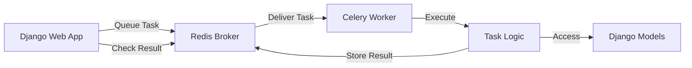

# How to Build Background Tasks with Django Celery

Author: [nawazdhandala](https://www.github.com/nawazdhandala)

Tags: Django, Celery, Python, Background Tasks, Redis, Web Development, Async

Description: Learn how to build reliable background tasks in Django using Celery. This guide covers setup, task creation, scheduling, error handling, and production deployment patterns for scalable Django applications.

---

> Every Django application eventually needs to handle work that takes too long for a web request. Sending emails, processing uploads, generating reports - these tasks should run in the background. Django Celery is the go-to solution for this problem.

When a user uploads a large file or requests a PDF report, you don't want them staring at a loading spinner. Background tasks let your application respond immediately while the heavy lifting happens asynchronously.

---

## Why Celery for Django?

Django and Celery work together naturally. Celery handles the task execution and message passing, while Django provides the ORM, settings management, and web framework. You get the best of both worlds:

- Tasks can access Django models directly
- Configuration lives in your Django settings
- Management commands for running workers
- Seamless integration with the Django ecosystem



---

## Setting Up Django Celery

### Installation

Start by installing Celery with Redis support. Redis is the most common broker for Django Celery setups because it's fast and reliable.

```bash
pip install celery[redis] django-celery-results django-celery-beat
```

The `django-celery-results` package stores task results in your database, and `django-celery-beat` provides database-backed periodic task scheduling.

### Project Structure

Here's a typical Django project structure with Celery:

```
myproject/
    myproject/
        __init__.py
        settings.py
        celery.py        # Celery app configuration
        urls.py
    myapp/
        __init__.py
        models.py
        tasks.py         # Task definitions
        views.py
    manage.py
```

### Creating the Celery App

Create the Celery application in your project directory. This file sets up Celery to work with Django's configuration.

```python
# myproject/celery.py
import os
from celery import Celery

# Set the default Django settings module
os.environ.setdefault('DJANGO_SETTINGS_MODULE', 'myproject.settings')

# Create the Celery app
app = Celery('myproject')

# Load configuration from Django settings
# The namespace='CELERY' means all celery-related settings
# should be prefixed with CELERY_ in settings.py
app.config_from_object('django.conf:settings', namespace='CELERY')

# Auto-discover tasks in all registered Django apps
# This looks for tasks.py files in each app directory
app.autodiscover_tasks()


@app.task(bind=True, ignore_result=True)
def debug_task(self):
    """Debug task to verify Celery is working"""
    print(f'Request: {self.request!r}')
```

Make sure the Celery app is loaded when Django starts:

```python
# myproject/__init__.py

# Import Celery app so it's available when Django starts
from .celery import app as celery_app

__all__ = ('celery_app',)
```

### Django Settings

Add Celery configuration to your Django settings file:

```python
# myproject/settings.py

INSTALLED_APPS = [
    # ... existing apps ...
    'django_celery_results',
    'django_celery_beat',
]

# Celery Configuration
CELERY_BROKER_URL = 'redis://localhost:6379/0'
CELERY_RESULT_BACKEND = 'django-db'  # Store results in Django database
CELERY_CACHE_BACKEND = 'django-cache'

# Serialization settings - JSON is safer than pickle
CELERY_ACCEPT_CONTENT = ['json']
CELERY_TASK_SERIALIZER = 'json'
CELERY_RESULT_SERIALIZER = 'json'

# Time zone settings
CELERY_TIMEZONE = 'UTC'
CELERY_ENABLE_UTC = True

# Task execution settings
CELERY_TASK_TRACK_STARTED = True  # Track when tasks start
CELERY_TASK_TIME_LIMIT = 30 * 60  # 30 minute hard limit
CELERY_TASK_SOFT_TIME_LIMIT = 25 * 60  # 25 minute soft limit

# Worker settings
CELERY_WORKER_PREFETCH_MULTIPLIER = 1  # Fetch one task at a time
CELERY_TASK_ACKS_LATE = True  # Acknowledge after completion
```

Run migrations to create the results tables:

```bash
python manage.py migrate django_celery_results
python manage.py migrate django_celery_beat
```

---

## Writing Your First Tasks

### Basic Task Definition

Tasks are regular Python functions decorated with `@shared_task`. The decorator makes them available to the Celery worker.

```python
# myapp/tasks.py
from celery import shared_task
from django.core.mail import send_mail
from django.conf import settings
import logging

logger = logging.getLogger(__name__)


@shared_task
def send_welcome_email(user_email, username):
    """Send a welcome email to a new user"""
    subject = f'Welcome to Our App, {username}!'
    message = f'''
    Hi {username},

    Thanks for signing up! We're excited to have you.

    Best regards,
    The Team
    '''

    # send_mail is a Django utility that handles SMTP
    send_mail(
        subject=subject,
        message=message,
        from_email=settings.DEFAULT_FROM_EMAIL,
        recipient_list=[user_email],
        fail_silently=False,
    )

    logger.info(f'Welcome email sent to {user_email}')
    return {'status': 'sent', 'recipient': user_email}
```

### Calling Tasks from Views

You can trigger tasks from anywhere in your Django code. The `.delay()` method queues the task immediately.

```python
# myapp/views.py
from django.shortcuts import redirect
from django.contrib.auth import login
from django.contrib import messages
from .tasks import send_welcome_email
from .forms import RegistrationForm


def register(request):
    """Handle user registration"""
    if request.method == 'POST':
        form = RegistrationForm(request.POST)
        if form.is_valid():
            # Create the user
            user = form.save()

            # Queue the welcome email - returns immediately
            # The email is sent by a Celery worker in the background
            send_welcome_email.delay(user.email, user.username)

            # Log the user in and redirect
            login(request, user)
            messages.success(request, 'Account created successfully!')
            return redirect('dashboard')
    else:
        form = RegistrationForm()

    return render(request, 'registration/register.html', {'form': form})
```

### Tasks That Access Models

When your tasks need to work with Django models, be careful about serialization. Pass IDs instead of model instances.

```python
# myapp/tasks.py
from celery import shared_task
from .models import Order, OrderItem
from .services import PaymentGateway, InventoryService
import logging

logger = logging.getLogger(__name__)


@shared_task
def process_order(order_id):
    """
    Process an order after payment confirmation.

    We pass order_id instead of the Order object because:
    1. Celery needs to serialize task arguments to JSON
    2. The order might change between queuing and execution
    3. We want the freshest data from the database
    """
    try:
        # Fetch the order from the database
        order = Order.objects.select_related('customer').get(id=order_id)

        if order.status != 'pending':
            logger.warning(f'Order {order_id} is not pending, skipping')
            return {'status': 'skipped', 'reason': 'not pending'}

        # Update status to processing
        order.status = 'processing'
        order.save(update_fields=['status'])

        # Reserve inventory for each item
        items = OrderItem.objects.filter(order=order)
        for item in items:
            InventoryService.reserve(item.product_id, item.quantity)

        # Charge the customer
        payment = PaymentGateway.charge(
            customer_id=order.customer.payment_id,
            amount=order.total,
            order_reference=order.reference_number
        )

        # Update order with payment info
        order.status = 'completed'
        order.payment_id = payment.id
        order.save(update_fields=['status', 'payment_id'])

        logger.info(f'Order {order_id} processed successfully')
        return {'status': 'completed', 'order_id': order_id}

    except Order.DoesNotExist:
        logger.error(f'Order {order_id} not found')
        return {'status': 'error', 'reason': 'order not found'}
```

---

## Handling Errors and Retries

Real-world tasks fail. Networks timeout, services go down, databases lock. Celery has built-in retry mechanisms to handle transient failures gracefully.

### Automatic Retries

Use `autoretry_for` to automatically retry on specific exceptions:

```python
# myapp/tasks.py
from celery import shared_task
import requests


@shared_task(
    bind=True,
    autoretry_for=(requests.RequestException,),
    retry_backoff=True,        # Exponential backoff: 1s, 2s, 4s, 8s...
    retry_backoff_max=600,     # Cap at 10 minutes
    retry_jitter=True,         # Add randomness to prevent thundering herd
    max_retries=5
)
def sync_to_external_service(self, user_id, data):
    """
    Sync user data to an external CRM.

    bind=True gives us access to self, which provides retry info.
    autoretry_for triggers automatic retry on network errors.
    """
    response = requests.post(
        'https://api.external-crm.com/users',
        json={'user_id': user_id, 'data': data},
        timeout=30
    )
    response.raise_for_status()

    return {'synced': True, 'external_id': response.json()['id']}
```

### Manual Retry Logic

For more control, use `self.retry()` to manually trigger retries:

```python
# myapp/tasks.py
from celery import shared_task
from celery.exceptions import MaxRetriesExceededError
from .models import Report
from .services import ReportGenerator
import logging

logger = logging.getLogger(__name__)


@shared_task(bind=True, max_retries=3)
def generate_report(self, report_id):
    """
    Generate a complex report.

    Uses manual retry for fine-grained control over retry behavior.
    """
    try:
        report = Report.objects.get(id=report_id)
        report.status = 'generating'
        report.save(update_fields=['status'])

        # This might fail due to resource constraints
        result = ReportGenerator.create(report)

        report.status = 'completed'
        report.file_path = result.path
        report.save(update_fields=['status', 'file_path'])

        return {'status': 'completed', 'path': result.path}

    except ReportGenerator.ResourceError as exc:
        # Transient error - retry with increasing delay
        retry_count = self.request.retries
        countdown = 60 * (2 ** retry_count)  # 60s, 120s, 240s

        logger.warning(
            f'Report {report_id} failed, retry {retry_count + 1}/3 '
            f'in {countdown}s: {exc}'
        )

        try:
            raise self.retry(exc=exc, countdown=countdown)
        except MaxRetriesExceededError:
            # All retries exhausted - mark as failed
            report.status = 'failed'
            report.error_message = str(exc)
            report.save(update_fields=['status', 'error_message'])
            raise

    except Report.DoesNotExist:
        logger.error(f'Report {report_id} not found')
        return {'status': 'error', 'reason': 'not found'}
```

### Error Callbacks

Use `link_error` to handle failures with a separate task:

```python
# myapp/tasks.py
from celery import shared_task
from .models import ImportJob


@shared_task
def handle_import_failure(request, exc, traceback, job_id):
    """Called when import_data fails after all retries"""
    job = ImportJob.objects.get(id=job_id)
    job.status = 'failed'
    job.error_message = str(exc)
    job.save(update_fields=['status', 'error_message'])

    # Notify the user
    send_notification.delay(
        user_id=job.user_id,
        message=f'Your import failed: {exc}'
    )


@shared_task(bind=True, max_retries=3)
def import_data(self, job_id, file_path):
    """Import data from a CSV file"""
    # Processing logic here
    pass


# In your view, set up the error callback
def start_import(request):
    job = ImportJob.objects.create(user=request.user, file=file)

    import_data.apply_async(
        args=[job.id, job.file.path],
        link_error=handle_import_failure.s(job_id=job.id)
    )

    return JsonResponse({'job_id': job.id})
```

---

## Periodic Tasks with Celery Beat

Celery Beat is a scheduler that sends tasks to the queue at regular intervals. Perfect for cron-like jobs.

### Database-Backed Scheduling

With `django-celery-beat`, you can manage schedules through Django admin:

```python
# myproject/settings.py

# Use database scheduler instead of file-based
CELERY_BEAT_SCHEDULER = 'django_celery_beat.schedulers:DatabaseScheduler'
```

### Defining Periodic Tasks

You can define schedules in settings or through the admin interface:

```python
# myproject/settings.py
from celery.schedules import crontab

CELERY_BEAT_SCHEDULE = {
    # Run every 15 minutes
    'check-pending-orders': {
        'task': 'myapp.tasks.check_pending_orders',
        'schedule': 900.0,  # 15 minutes in seconds
    },

    # Run daily at midnight
    'cleanup-expired-sessions': {
        'task': 'myapp.tasks.cleanup_expired_sessions',
        'schedule': crontab(hour=0, minute=0),
    },

    # Run every Monday at 9 AM
    'send-weekly-digest': {
        'task': 'myapp.tasks.send_weekly_digest',
        'schedule': crontab(hour=9, minute=0, day_of_week=1),
    },

    # Run every hour during business hours on weekdays
    'sync-inventory': {
        'task': 'myapp.tasks.sync_inventory',
        'schedule': crontab(minute=0, hour='9-17', day_of_week='mon-fri'),
    },
}
```

### Periodic Task Examples

```python
# myapp/tasks.py
from celery import shared_task
from django.utils import timezone
from datetime import timedelta
from .models import Order, Session, User


@shared_task
def check_pending_orders():
    """Find orders stuck in pending state and alert"""
    cutoff = timezone.now() - timedelta(hours=1)

    stuck_orders = Order.objects.filter(
        status='pending',
        created_at__lt=cutoff
    )

    count = stuck_orders.count()
    if count > 0:
        # Send alert to operations team
        send_alert.delay(
            channel='#operations',
            message=f'{count} orders stuck in pending state'
        )

    return {'stuck_count': count}


@shared_task
def cleanup_expired_sessions():
    """Remove expired sessions from database"""
    cutoff = timezone.now() - timedelta(days=30)

    deleted, _ = Session.objects.filter(
        last_activity__lt=cutoff
    ).delete()

    return {'deleted_count': deleted}


@shared_task
def send_weekly_digest():
    """Send weekly activity digest to all active users"""
    active_users = User.objects.filter(
        is_active=True,
        email_preferences__weekly_digest=True
    )

    for user in active_users:
        # Queue individual email tasks
        send_digest_email.delay(user.id)

    return {'queued_count': active_users.count()}
```

---

## Running Workers in Production

### Starting Workers

Run the Celery worker from your project directory:

```bash
# Basic worker with 4 concurrent processes
celery -A myproject worker --loglevel=info --concurrency=4

# Worker with specific queue
celery -A myproject worker -Q high_priority --concurrency=2

# Beat scheduler for periodic tasks
celery -A myproject beat --loglevel=info
```

### Systemd Service

For production, use systemd to manage your workers:

```ini
# /etc/systemd/system/celery.service
[Unit]
Description=Celery Worker
After=network.target

[Service]
Type=forking
User=www-data
Group=www-data
WorkingDirectory=/var/www/myproject
ExecStart=/var/www/myproject/venv/bin/celery \
    -A myproject worker \
    --loglevel=info \
    --concurrency=4 \
    --pidfile=/var/run/celery/worker.pid \
    --logfile=/var/log/celery/worker.log \
    --detach

ExecStop=/bin/kill -TERM $MAINPID
Restart=always
RestartSec=10

[Install]
WantedBy=multi-user.target
```

### Docker Compose Setup

Running Django Celery in Docker is straightforward:

```yaml
# docker-compose.yml
version: '3.8'

services:
  web:
    build: .
    command: gunicorn myproject.wsgi:application --bind 0.0.0.0:8000
    volumes:
      - .:/app
    environment:
      - CELERY_BROKER_URL=redis://redis:6379/0
    depends_on:
      - redis
      - db

  celery-worker:
    build: .
    command: celery -A myproject worker --loglevel=info --concurrency=4
    volumes:
      - .:/app
    environment:
      - CELERY_BROKER_URL=redis://redis:6379/0
    depends_on:
      - redis
      - db

  celery-beat:
    build: .
    command: celery -A myproject beat --loglevel=info
    volumes:
      - .:/app
    environment:
      - CELERY_BROKER_URL=redis://redis:6379/0
    depends_on:
      - redis
      - db

  redis:
    image: redis:7-alpine
    ports:
      - "6379:6379"

  db:
    image: postgres:15
    environment:
      - POSTGRES_DB=myproject
      - POSTGRES_USER=postgres
      - POSTGRES_PASSWORD=postgres
```

---

## Monitoring Your Tasks

### Flower Web Interface

Flower provides a real-time web interface for monitoring Celery:

```bash
pip install flower
celery -A myproject flower --port=5555
```

Visit `http://localhost:5555` to see:
- Active, processed, and failed tasks
- Worker status and performance
- Task execution times
- Queue lengths

### Django Admin Integration

With `django-celery-results`, you can view task results in Django admin:

```python
# myapp/admin.py
from django.contrib import admin
from django_celery_results.models import TaskResult

# The TaskResult model is automatically registered
# You can customize it if needed
class TaskResultAdmin(admin.ModelAdmin):
    list_display = ('task_id', 'task_name', 'status', 'date_done')
    list_filter = ('status', 'task_name')
    search_fields = ('task_id', 'task_name')

# Re-register with customizations
admin.site.unregister(TaskResult)
admin.site.register(TaskResult, TaskResultAdmin)
```

---

## Best Practices

1. **Pass IDs, not objects** - Django model instances can't be serialized to JSON. Pass the primary key and fetch fresh data in the task.

2. **Make tasks idempotent** - Tasks might run more than once. Design them so repeated execution produces the same result.

3. **Set time limits** - Use `task_time_limit` to prevent tasks from running forever.

4. **Use appropriate queues** - Separate fast tasks from slow ones using priority queues.

5. **Log everything** - Good logging makes debugging production issues much easier.

6. **Handle failures gracefully** - Use retries for transient errors and proper error handling for permanent failures.

---

## Conclusion

Django Celery transforms your application from handling everything synchronously to a responsive, scalable system. The key patterns to remember:

- Use `@shared_task` for Django-integrated tasks
- Pass model IDs instead of instances
- Configure retries for resilient task execution
- Use Celery Beat for scheduled jobs
- Monitor your workers in production

With these foundations, you can handle any background processing needs your Django application might have.

---

*Need visibility into your Django Celery workers? [OneUptime](https://oneuptime.com) provides comprehensive monitoring for background task systems, including queue depth tracking, failure alerting, and worker health monitoring.*
