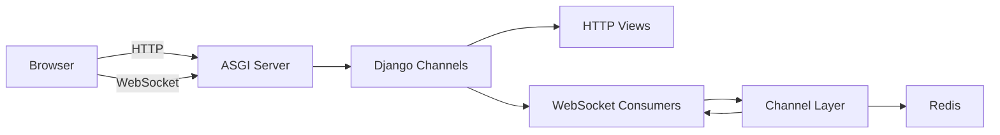

# How to Build Real-Time Features with Django Channels

Author: [nawazdhandala](https://www.github.com/nawazdhandala)

Tags: Django, Channels, WebSocket, Real-time, Python, ASGI

Description: Learn how to build real-time features in Django using Django Channels. This guide covers WebSocket consumers, channel layers, group broadcasting, and production deployment with practical code examples.

---

> Django Channels extends Django to handle WebSockets, background tasks, and other async protocols beyond traditional HTTP. If you need live updates, chat, notifications, or collaborative features in your Django app, Channels is the way to go.

Traditional Django handles one request at a time per worker - send a request, get a response, done. Real-time features need something different: persistent connections that stay open and push data whenever something happens. That is what Django Channels provides.

---

## Understanding the Architecture

Before diving into code, let's understand how Django Channels fits into the Django ecosystem.



Django Channels introduces a few key concepts:

- **ASGI**: Asynchronous Server Gateway Interface - the async equivalent of WSGI
- **Consumers**: Like Django views, but for WebSocket connections
- **Channel Layers**: A message-passing backend (usually Redis) that lets consumers communicate with each other
- **Groups**: Named collections of channels that you can broadcast messages to

---

## Installation and Setup

First, install Django Channels and the Redis channel layer:

```bash
# Install Django Channels and Redis support
pip install channels channels-redis
```

Update your Django settings to use Channels:

```python
# settings.py
# Add channels to installed apps
INSTALLED_APPS = [
    'django.contrib.auth',
    'django.contrib.contenttypes',
    'django.contrib.sessions',
    'django.contrib.messages',
    'django.contrib.staticfiles',
    'channels',  # Add channels
    'myapp',
]

# Tell Django to use ASGI instead of WSGI
ASGI_APPLICATION = 'myproject.asgi.application'

# Configure the channel layer (Redis for production)
CHANNEL_LAYERS = {
    'default': {
        'BACKEND': 'channels_redis.core.RedisChannelLayer',
        'CONFIG': {
            'hosts': [('localhost', 6379)],  # Redis server address
        },
    },
}
```

Create the ASGI application file:

```python
# myproject/asgi.py
# ASGI config for myproject
import os
from django.core.asgi import get_asgi_application
from channels.routing import ProtocolTypeRouter, URLRouter
from channels.auth import AuthMiddlewareStack
import myapp.routing  # We'll create this next

os.environ.setdefault('DJANGO_SETTINGS_MODULE', 'myproject.settings')

# ProtocolTypeRouter directs traffic based on protocol type
application = ProtocolTypeRouter({
    # Regular HTTP requests go to Django
    'http': get_asgi_application(),
    # WebSocket connections use our custom routing
    'websocket': AuthMiddlewareStack(  # Adds Django session auth to WebSocket
        URLRouter(
            myapp.routing.websocket_urlpatterns  # WebSocket URL routes
        )
    ),
})
```

---

## Your First WebSocket Consumer

Consumers are the heart of Django Channels. They handle WebSocket connections just like views handle HTTP requests.

```python
# myapp/consumers.py
# Basic WebSocket consumer that echoes messages back
import json
from channels.generic.websocket import AsyncWebsocketConsumer

class EchoConsumer(AsyncWebsocketConsumer):
    """Simple consumer that echoes messages back to the client"""

    async def connect(self):
        # Called when WebSocket connection is initiated
        await self.accept()  # Accept the connection
        await self.send(text_data=json.dumps({
            'message': 'Connected to echo server'
        }))

    async def disconnect(self, close_code):
        # Called when WebSocket closes
        # close_code indicates why (1000 = normal, 1006 = abnormal, etc.)
        pass

    async def receive(self, text_data):
        # Called when message received from client
        data = json.loads(text_data)
        message = data.get('message', '')

        # Echo the message back
        await self.send(text_data=json.dumps({
            'message': f'Echo: {message}'
        }))
```

Set up the WebSocket URL routing:

```python
# myapp/routing.py
# WebSocket URL patterns (similar to Django's urls.py)
from django.urls import re_path
from . import consumers

websocket_urlpatterns = [
    # Route /ws/echo/ to EchoConsumer
    re_path(r'ws/echo/$', consumers.EchoConsumer.as_asgi()),
]
```

---

## Building a Real-Time Chat Room

Now let's build something practical - a chat room where users can send messages to each other in real-time.

```python
# myapp/consumers.py
# Chat room consumer with group messaging
import json
from channels.generic.websocket import AsyncWebsocketConsumer

class ChatConsumer(AsyncWebsocketConsumer):
    """Chat room consumer with group broadcasting"""

    async def connect(self):
        # Extract room name from URL route
        self.room_name = self.scope['url_route']['kwargs']['room_name']
        # Create a unique group name for this room
        self.room_group_name = f'chat_{self.room_name}'

        # Get username from session (if authenticated)
        self.user = self.scope['user']
        self.username = self.user.username if self.user.is_authenticated else 'Anonymous'

        # Join the room group
        # This registers our channel with the group so we receive broadcasts
        await self.channel_layer.group_add(
            self.room_group_name,
            self.channel_name  # Unique identifier for this connection
        )

        await self.accept()

        # Notify room that user joined
        await self.channel_layer.group_send(
            self.room_group_name,
            {
                'type': 'user_join',  # Maps to user_join method below
                'username': self.username,
            }
        )

    async def disconnect(self, close_code):
        # Notify room that user left
        await self.channel_layer.group_send(
            self.room_group_name,
            {
                'type': 'user_leave',
                'username': self.username,
            }
        )

        # Leave the room group
        await self.channel_layer.group_discard(
            self.room_group_name,
            self.channel_name
        )

    async def receive(self, text_data):
        # Handle incoming message from client
        data = json.loads(text_data)
        message = data.get('message', '')

        if not message:
            return  # Ignore empty messages

        # Broadcast message to all users in the room
        await self.channel_layer.group_send(
            self.room_group_name,
            {
                'type': 'chat_message',  # Maps to chat_message method
                'message': message,
                'username': self.username,
            }
        )

    # Event handlers - called when group_send targets this consumer

    async def chat_message(self, event):
        """Handle chat message event from group"""
        await self.send(text_data=json.dumps({
            'type': 'message',
            'message': event['message'],
            'username': event['username'],
        }))

    async def user_join(self, event):
        """Handle user join event"""
        await self.send(text_data=json.dumps({
            'type': 'user_join',
            'username': event['username'],
        }))

    async def user_leave(self, event):
        """Handle user leave event"""
        await self.send(text_data=json.dumps({
            'type': 'user_leave',
            'username': event['username'],
        }))
```

Add the URL route:

```python
# myapp/routing.py
from django.urls import re_path
from . import consumers

websocket_urlpatterns = [
    re_path(r'ws/echo/$', consumers.EchoConsumer.as_asgi()),
    # Room name is captured from the URL
    re_path(r'ws/chat/(?P<room_name>\w+)/$', consumers.ChatConsumer.as_asgi()),
]
```

---

## Frontend WebSocket Client

Here is a simple JavaScript client to connect to our chat room:

```javascript
// static/js/chat.js
// WebSocket chat client

class ChatClient {
    constructor(roomName) {
        this.roomName = roomName;
        this.socket = null;
        this.reconnectAttempts = 0;
        this.maxReconnectAttempts = 5;
    }

    connect() {
        // Build WebSocket URL (use wss:// for HTTPS)
        const protocol = window.location.protocol === 'https:' ? 'wss:' : 'ws:';
        const url = `${protocol}//${window.location.host}/ws/chat/${this.roomName}/`;

        this.socket = new WebSocket(url);

        this.socket.onopen = () => {
            console.log('Connected to chat room');
            this.reconnectAttempts = 0;  // Reset on successful connection
        };

        this.socket.onmessage = (event) => {
            const data = JSON.parse(event.data);
            this.handleMessage(data);
        };

        this.socket.onclose = (event) => {
            console.log('Disconnected from chat room');
            // Attempt to reconnect
            if (this.reconnectAttempts < this.maxReconnectAttempts) {
                this.reconnectAttempts++;
                const delay = Math.min(1000 * Math.pow(2, this.reconnectAttempts), 30000);
                console.log(`Reconnecting in ${delay}ms...`);
                setTimeout(() => this.connect(), delay);
            }
        };

        this.socket.onerror = (error) => {
            console.error('WebSocket error:', error);
        };
    }

    handleMessage(data) {
        switch (data.type) {
            case 'message':
                this.displayMessage(data.username, data.message);
                break;
            case 'user_join':
                this.displaySystemMessage(`${data.username} joined the room`);
                break;
            case 'user_leave':
                this.displaySystemMessage(`${data.username} left the room`);
                break;
        }
    }

    sendMessage(message) {
        if (this.socket && this.socket.readyState === WebSocket.OPEN) {
            this.socket.send(JSON.stringify({ message: message }));
        }
    }

    displayMessage(username, message) {
        // Add message to chat UI
        const chat = document.getElementById('chat-messages');
        const div = document.createElement('div');
        div.className = 'message';
        div.innerHTML = `<strong>${username}:</strong> ${message}`;
        chat.appendChild(div);
        chat.scrollTop = chat.scrollHeight;
    }

    displaySystemMessage(message) {
        const chat = document.getElementById('chat-messages');
        const div = document.createElement('div');
        div.className = 'system-message';
        div.textContent = message;
        chat.appendChild(div);
    }
}

// Usage
const chat = new ChatClient('general');
chat.connect();
```

---

## Real-Time Notifications from Django Views

One of the most powerful features of Django Channels is sending real-time updates from regular Django views or background tasks.

```python
# myapp/views.py
# Sending WebSocket notifications from Django views
from django.shortcuts import render
from django.http import JsonResponse
from channels.layers import get_channel_layer
from asgiref.sync import async_to_sync

def create_order(request):
    """Create an order and notify relevant users in real-time"""
    # Regular Django view logic
    order = Order.objects.create(
        user=request.user,
        total=request.POST.get('total'),
    )

    # Send real-time notification to the user
    channel_layer = get_channel_layer()

    # async_to_sync wraps async channel layer methods for sync code
    async_to_sync(channel_layer.group_send)(
        f'user_{request.user.id}',  # User's personal notification group
        {
            'type': 'notification',  # Maps to notification handler in consumer
            'message': f'Order #{order.id} created successfully!',
            'order_id': order.id,
        }
    )

    # Also notify admin users
    async_to_sync(channel_layer.group_send)(
        'admin_notifications',  # Group for all admin users
        {
            'type': 'new_order',
            'order_id': order.id,
            'user': request.user.username,
            'total': str(order.total),
        }
    )

    return JsonResponse({'status': 'success', 'order_id': order.id})
```

The notification consumer:

```python
# myapp/consumers.py
# Notification consumer for real-time alerts
class NotificationConsumer(AsyncWebsocketConsumer):
    """Consumer for user notifications"""

    async def connect(self):
        user = self.scope['user']

        if not user.is_authenticated:
            await self.close()  # Reject unauthenticated connections
            return

        # Join user's personal notification group
        self.user_group = f'user_{user.id}'
        await self.channel_layer.group_add(
            self.user_group,
            self.channel_name
        )

        # If admin, also join admin group
        if user.is_staff:
            await self.channel_layer.group_add(
                'admin_notifications',
                self.channel_name
            )

        await self.accept()

    async def disconnect(self, close_code):
        user = self.scope['user']
        if user.is_authenticated:
            await self.channel_layer.group_discard(
                self.user_group,
                self.channel_name
            )
            if user.is_staff:
                await self.channel_layer.group_discard(
                    'admin_notifications',
                    self.channel_name
                )

    async def notification(self, event):
        """Handle generic notification"""
        await self.send(text_data=json.dumps({
            'type': 'notification',
            'message': event['message'],
            'data': event.get('data', {}),
        }))

    async def new_order(self, event):
        """Handle new order notification for admins"""
        await self.send(text_data=json.dumps({
            'type': 'new_order',
            'order_id': event['order_id'],
            'user': event['user'],
            'total': event['total'],
        }))
```

---

## Sending Updates from Celery Tasks

Real-time updates from background tasks follow the same pattern:

```python
# myapp/tasks.py
# Celery task with real-time progress updates
from celery import shared_task
from channels.layers import get_channel_layer
from asgiref.sync import async_to_sync

@shared_task
def process_large_file(file_id, user_id):
    """Process a file and send progress updates via WebSocket"""
    channel_layer = get_channel_layer()
    user_group = f'user_{user_id}'

    file_obj = File.objects.get(id=file_id)
    total_lines = file_obj.line_count

    for i, line in enumerate(file_obj.read_lines()):
        # Process the line
        process_line(line)

        # Send progress update every 100 lines
        if i % 100 == 0:
            progress = int((i / total_lines) * 100)
            async_to_sync(channel_layer.group_send)(
                user_group,
                {
                    'type': 'task_progress',
                    'task': 'file_processing',
                    'file_id': file_id,
                    'progress': progress,
                }
            )

    # Send completion notification
    async_to_sync(channel_layer.group_send)(
        user_group,
        {
            'type': 'task_complete',
            'task': 'file_processing',
            'file_id': file_id,
            'message': 'File processing complete!',
        }
    )
```

---

## Authentication and Permissions

Django Channels integrates with Django's authentication system. The `AuthMiddlewareStack` in your ASGI config adds the user to the WebSocket scope.

```python
# myapp/consumers.py
# Consumer with authentication checks
from channels.generic.websocket import AsyncWebsocketConsumer
from channels.db import database_sync_to_async

class SecureConsumer(AsyncWebsocketConsumer):
    """Consumer with authentication and permission checks"""

    async def connect(self):
        user = self.scope['user']

        # Check authentication
        if not user.is_authenticated:
            await self.close(code=4001)  # Custom close code for unauthorized
            return

        # Check permissions
        room_name = self.scope['url_route']['kwargs']['room_name']
        if not await self.can_access_room(user, room_name):
            await self.close(code=4003)  # Custom code for forbidden
            return

        # User is authenticated and authorized
        self.room_name = room_name
        self.room_group = f'room_{room_name}'

        await self.channel_layer.group_add(
            self.room_group,
            self.channel_name
        )
        await self.accept()

    @database_sync_to_async
    def can_access_room(self, user, room_name):
        """Check if user has permission to access the room"""
        # This runs in a thread pool since it accesses the database
        room = Room.objects.filter(name=room_name).first()
        if not room:
            return False
        return room.members.filter(id=user.id).exists()
```

For token-based authentication with APIs:

```python
# myapp/middleware.py
# Custom WebSocket authentication middleware for token auth
from channels.middleware import BaseMiddleware
from channels.db import database_sync_to_async
from django.contrib.auth.models import AnonymousUser
from rest_framework.authtoken.models import Token

class TokenAuthMiddleware(BaseMiddleware):
    """Authenticate WebSocket connections using token from query string"""

    async def __call__(self, scope, receive, send):
        # Parse query string for token
        query_string = scope.get('query_string', b'').decode()
        query_params = dict(
            param.split('=') for param in query_string.split('&') if '=' in param
        )
        token_key = query_params.get('token')

        if token_key:
            scope['user'] = await self.get_user_from_token(token_key)
        else:
            scope['user'] = AnonymousUser()

        return await super().__call__(scope, receive, send)

    @database_sync_to_async
    def get_user_from_token(self, token_key):
        """Look up user from auth token"""
        try:
            token = Token.objects.select_related('user').get(key=token_key)
            return token.user
        except Token.DoesNotExist:
            return AnonymousUser()
```

Update ASGI to use the custom middleware:

```python
# myproject/asgi.py
from myapp.middleware import TokenAuthMiddleware

application = ProtocolTypeRouter({
    'http': get_asgi_application(),
    'websocket': TokenAuthMiddleware(  # Use custom token auth
        URLRouter(
            myapp.routing.websocket_urlpatterns
        )
    ),
})
```

---

## Production Deployment

For production, you need an ASGI server. Daphne (from the Channels team) or Uvicorn both work well.

```bash
# Install production ASGI server
pip install daphne

# Run with Daphne
daphne -b 0.0.0.0 -p 8000 myproject.asgi:application

# Or with Uvicorn (faster, but requires uvloop)
pip install uvicorn
uvicorn myproject.asgi:application --host 0.0.0.0 --port 8000 --workers 4
```

Docker Compose setup for production:

```yaml
# docker-compose.yml
version: '3.8'

services:
  web:
    build: .
    command: daphne -b 0.0.0.0 -p 8000 myproject.asgi:application
    ports:
      - "8000:8000"
    depends_on:
      - redis
      - db
    environment:
      - REDIS_HOST=redis
      - DATABASE_URL=postgres://user:pass@db:5432/myapp

  redis:
    image: redis:7-alpine
    ports:
      - "6379:6379"
    volumes:
      - redis_data:/data

  db:
    image: postgres:15
    environment:
      - POSTGRES_USER=user
      - POSTGRES_PASSWORD=pass
      - POSTGRES_DB=myapp
    volumes:
      - postgres_data:/var/lib/postgresql/data

volumes:
  redis_data:
  postgres_data:
```

Nginx configuration for WebSocket proxying:

```nginx
# nginx.conf
upstream django {
    server web:8000;
}

server {
    listen 80;
    server_name example.com;

    location / {
        proxy_pass http://django;
        proxy_set_header Host $host;
        proxy_set_header X-Real-IP $remote_addr;
    }

    location /ws/ {
        proxy_pass http://django;
        proxy_http_version 1.1;
        # These headers are required for WebSocket upgrade
        proxy_set_header Upgrade $http_upgrade;
        proxy_set_header Connection "upgrade";
        proxy_set_header Host $host;
        proxy_set_header X-Real-IP $remote_addr;
        # Increase timeouts for long-lived connections
        proxy_read_timeout 86400;
    }
}
```

---

## Best Practices

1. **Always use Redis in production** - The in-memory channel layer is fine for development, but Redis is required for multi-process or multi-server deployments.

2. **Handle disconnections gracefully** - Clients disconnect unexpectedly. Clean up resources and group memberships in the disconnect handler.

3. **Authenticate before accepting** - Check authentication and permissions before calling `accept()`. Reject unauthorized connections early.

4. **Use database_sync_to_async** - When accessing the database from async consumers, wrap your ORM queries with `database_sync_to_async`.

5. **Implement reconnection logic** - Clients should implement exponential backoff reconnection for robustness.

6. **Monitor connection counts** - Track how many WebSocket connections you have. Each connection consumes server resources.

---

## Conclusion

Django Channels transforms Django from a request-response framework into a full real-time application platform. Key takeaways:

- **Consumers** handle WebSocket connections like views handle HTTP
- **Channel layers** with Redis enable communication between consumers
- **Groups** let you broadcast to multiple connections at once
- **async_to_sync** bridges the gap between sync Django code and async channels

With Django Channels, you can build chat systems, live dashboards, collaborative editing, real-time notifications, and more - all while keeping your existing Django codebase.

---

*Need to monitor your Django application's real-time features? [OneUptime](https://oneuptime.com) provides comprehensive monitoring for WebSocket connections, latency tracking, and alerting when things go wrong.*
