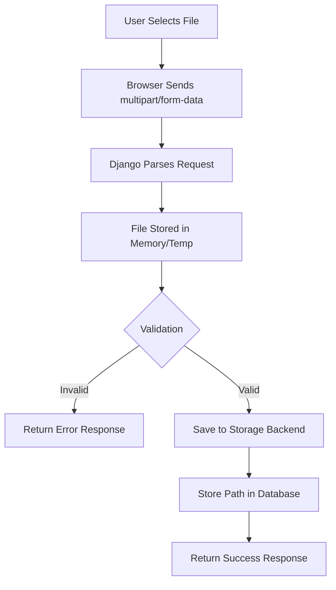
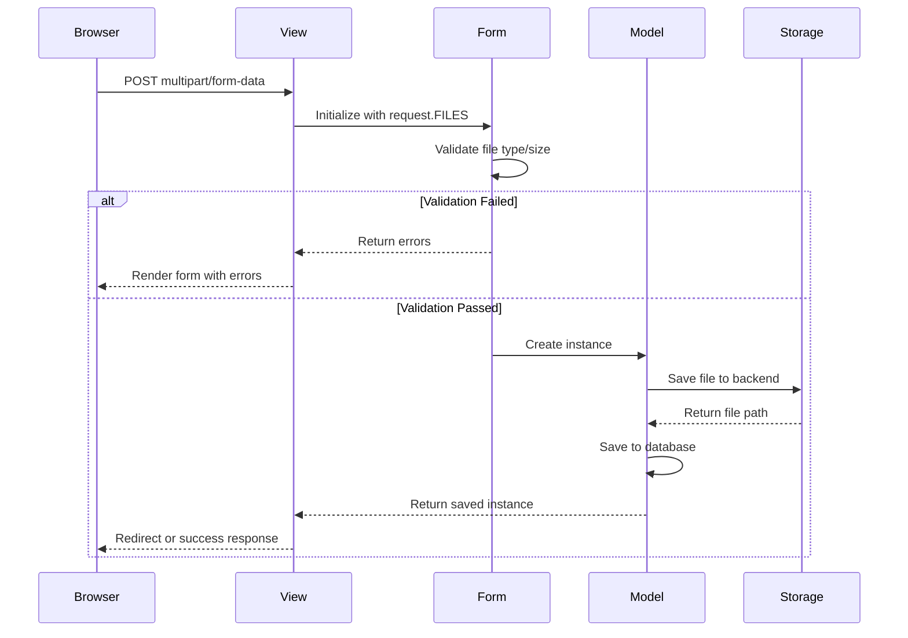
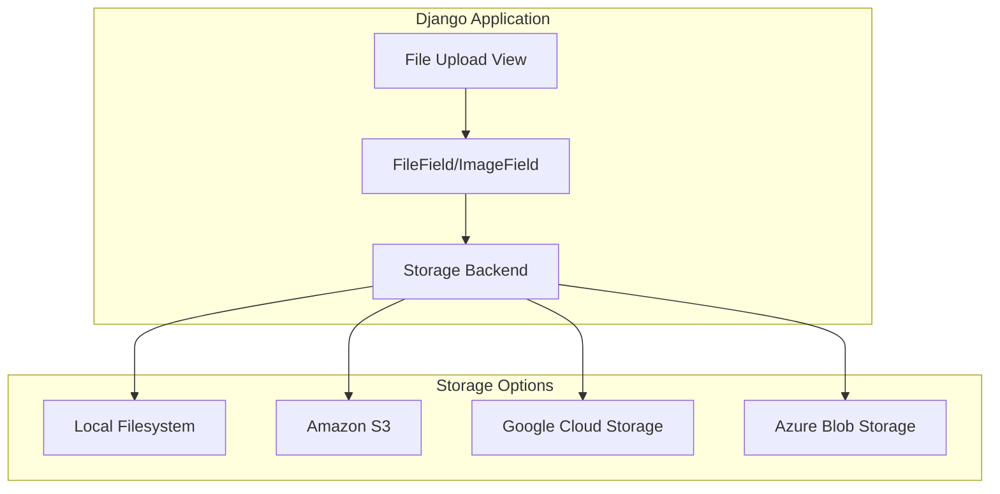

# How to Implement File Uploads in Django

Author: [nawazdhandala](https://www.github.com/nawazdhandala)

Tags: Python, Django, File Uploads, Web Development, Backend Development, Media Files, Forms

Description: Learn how to implement secure file uploads in Django with validation, storage backends, and best practices for handling user-uploaded content.

---

> File uploads are a common requirement for web applications. Django provides built-in support for handling file uploads through forms, models, and configurable storage backends. This guide covers everything from basic uploads to production-ready implementations with validation and cloud storage.

Whether you're building a document management system, image gallery, or user profile feature, understanding how to handle file uploads properly is essential. Django makes this straightforward while giving you control over validation, storage, and security.

---

## How File Uploads Work in Django

Before diving into code, let's understand the file upload flow:



Django handles uploaded files in two ways depending on size:
- Files smaller than 2.5MB are stored in memory
- Larger files are written to a temporary directory and streamed

---

## Basic Configuration

First, configure your Django settings for file uploads:

```python
# settings.py

import os

# Base directory for media files
MEDIA_URL = '/media/'
MEDIA_ROOT = os.path.join(BASE_DIR, 'media')

# File upload settings
FILE_UPLOAD_MAX_MEMORY_SIZE = 2621440  # 2.5 MB - files larger than this go to temp
DATA_UPLOAD_MAX_MEMORY_SIZE = 10485760  # 10 MB - max request body size
FILE_UPLOAD_PERMISSIONS = 0o644  # File permissions for uploaded files
FILE_UPLOAD_DIRECTORY_PERMISSIONS = 0o755  # Directory permissions

# Allowed upload handlers (default)
FILE_UPLOAD_HANDLERS = [
    'django.core.files.uploadhandler.MemoryFileUploadHandler',
    'django.core.files.uploadhandler.TemporaryFileUploadHandler',
]
```

Add media URL routing for development:

```python
# urls.py
from django.conf import settings
from django.conf.urls.static import static
from django.contrib import admin
from django.urls import path, include

urlpatterns = [
    path('admin/', admin.site.urls),
    path('', include('uploads.urls')),
]

# Serve media files in development only
if settings.DEBUG:
    urlpatterns += static(settings.MEDIA_URL, document_root=settings.MEDIA_ROOT)
```

---

## Creating Models with File Fields

Django provides two field types for file uploads:

| Field Type | Use Case |
|------------|----------|
| `FileField` | Any file type (documents, archives, etc.) |
| `ImageField` | Images only (requires Pillow library) |

```python
# uploads/models.py
from django.db import models
from django.contrib.auth.models import User
import os
import uuid

def user_directory_path(instance, filename):
    """
    Generate upload path based on user ID.
    Files will be uploaded to MEDIA_ROOT/user_<id>/<filename>
    """
    return f'user_{instance.user.id}/{filename}'

def document_path(instance, filename):
    """
    Generate a unique filename to prevent overwrites.
    Preserves original extension but uses UUID for name.
    """
    ext = filename.split('.')[-1]
    new_filename = f'{uuid.uuid4().hex}.{ext}'
    return os.path.join('documents', new_filename)

class UserProfile(models.Model):
    """User profile with avatar image"""
    user = models.OneToOneField(User, on_delete=models.CASCADE)
    avatar = models.ImageField(
        upload_to='avatars/',  # Simple path - files go to MEDIA_ROOT/avatars/
        blank=True,
        null=True
    )
    created_at = models.DateTimeField(auto_now_add=True)

    def __str__(self):
        return f"Profile for {self.user.username}"

class Document(models.Model):
    """Document upload model with metadata"""
    CATEGORY_CHOICES = [
        ('report', 'Report'),
        ('invoice', 'Invoice'),
        ('contract', 'Contract'),
        ('other', 'Other'),
    ]

    user = models.ForeignKey(
        User,
        on_delete=models.CASCADE,
        related_name='documents'
    )
    title = models.CharField(max_length=255)
    file = models.FileField(upload_to=document_path)  # Uses callable for path
    category = models.CharField(max_length=20, choices=CATEGORY_CHOICES)
    description = models.TextField(blank=True)
    uploaded_at = models.DateTimeField(auto_now_add=True)
    file_size = models.PositiveIntegerField(editable=False, default=0)

    class Meta:
        ordering = ['-uploaded_at']

    def save(self, *args, **kwargs):
        """Store file size on save"""
        if self.file:
            self.file_size = self.file.size
        super().save(*args, **kwargs)

    def __str__(self):
        return self.title

    @property
    def filename(self):
        """Return just the filename without path"""
        return os.path.basename(self.file.name)

class MultipleImage(models.Model):
    """Model for handling multiple image uploads"""
    gallery = models.ForeignKey(
        'Gallery',
        on_delete=models.CASCADE,
        related_name='images'
    )
    image = models.ImageField(upload_to='gallery/')
    caption = models.CharField(max_length=255, blank=True)
    order = models.PositiveIntegerField(default=0)

    class Meta:
        ordering = ['order']

class Gallery(models.Model):
    """Gallery to hold multiple images"""
    user = models.ForeignKey(User, on_delete=models.CASCADE)
    title = models.CharField(max_length=255)
    created_at = models.DateTimeField(auto_now_add=True)

    def __str__(self):
        return self.title
```

Run migrations:

```bash
python manage.py makemigrations uploads
python manage.py migrate
```

---

## File Upload Flow

Here's how the components interact during a file upload:



---

## Building Upload Forms

Create forms to handle file uploads with validation:

```python
# uploads/forms.py
from django import forms
from django.core.validators import FileExtensionValidator
from .models import Document, UserProfile, Gallery, MultipleImage

class DocumentUploadForm(forms.ModelForm):
    """Form for uploading documents with validation"""

    class Meta:
        model = Document
        fields = ['title', 'file', 'category', 'description']
        widgets = {
            'description': forms.Textarea(attrs={'rows': 3}),
        }

    def __init__(self, *args, **kwargs):
        super().__init__(*args, **kwargs)
        # Add CSS classes for styling
        for field_name, field in self.fields.items():
            field.widget.attrs['class'] = 'form-control'

    def clean_file(self):
        """
        Validate the uploaded file.
        Check file size and type.
        """
        file = self.cleaned_data.get('file')
        if file:
            # Check file size (limit to 10MB)
            max_size = 10 * 1024 * 1024  # 10MB in bytes
            if file.size > max_size:
                raise forms.ValidationError(
                    f'File size must be under 10MB. Your file is {file.size / (1024*1024):.1f}MB.'
                )

            # Check file extension
            allowed_extensions = ['pdf', 'doc', 'docx', 'xls', 'xlsx', 'txt', 'csv']
            ext = file.name.split('.')[-1].lower()
            if ext not in allowed_extensions:
                raise forms.ValidationError(
                    f'File type not allowed. Allowed types: {", ".join(allowed_extensions)}'
                )

            # Check content type (MIME type)
            allowed_content_types = [
                'application/pdf',
                'application/msword',
                'application/vnd.openxmlformats-officedocument.wordprocessingml.document',
                'application/vnd.ms-excel',
                'application/vnd.openxmlformats-officedocument.spreadsheetml.sheet',
                'text/plain',
                'text/csv',
            ]
            if file.content_type not in allowed_content_types:
                raise forms.ValidationError('Invalid file type detected.')

        return file

class AvatarUploadForm(forms.ModelForm):
    """Form for uploading profile avatars"""

    class Meta:
        model = UserProfile
        fields = ['avatar']

    def clean_avatar(self):
        """Validate avatar image"""
        avatar = self.cleaned_data.get('avatar')
        if avatar:
            # Check file size (limit to 2MB)
            if avatar.size > 2 * 1024 * 1024:
                raise forms.ValidationError('Image must be smaller than 2MB.')

            # Check image dimensions (optional)
            from PIL import Image
            img = Image.open(avatar)
            if img.width > 4096 or img.height > 4096:
                raise forms.ValidationError('Image dimensions must be 4096x4096 or smaller.')

            # Reset file pointer after reading
            avatar.seek(0)

        return avatar

class MultipleFileForm(forms.Form):
    """Form for uploading multiple files at once"""
    files = forms.FileField(
        widget=forms.ClearableFileInput(attrs={'multiple': True}),
        required=True
    )

    def clean_files(self):
        """Validate multiple files"""
        files = self.files.getlist('files')

        # Limit number of files
        if len(files) > 10:
            raise forms.ValidationError('You can upload a maximum of 10 files at once.')

        # Validate each file
        for f in files:
            if f.size > 5 * 1024 * 1024:
                raise forms.ValidationError(f'File {f.name} exceeds 5MB limit.')

        return files
```

---

## Creating Views

Implement views to handle file uploads:

```python
# uploads/views.py
from django.shortcuts import render, redirect, get_object_or_404
from django.contrib.auth.decorators import login_required
from django.contrib import messages
from django.http import JsonResponse, FileResponse, Http404
from django.views.decorators.http import require_POST
from django.core.paginator import Paginator
from .models import Document, UserProfile, Gallery, MultipleImage
from .forms import DocumentUploadForm, AvatarUploadForm, MultipleFileForm
import mimetypes
import os

@login_required
def upload_document(request):
    """
    Handle document upload via form submission.
    GET: Display empty form
    POST: Process and save uploaded file
    """
    if request.method == 'POST':
        form = DocumentUploadForm(request.POST, request.FILES)
        if form.is_valid():
            # Create document but don't save yet
            document = form.save(commit=False)
            # Associate with current user
            document.user = request.user
            document.save()

            messages.success(request, f'Document "{document.title}" uploaded successfully.')
            return redirect('document_list')
        else:
            messages.error(request, 'Please correct the errors below.')
    else:
        form = DocumentUploadForm()

    return render(request, 'uploads/document_form.html', {'form': form})

@login_required
def document_list(request):
    """List all documents for the current user with pagination"""
    documents = Document.objects.filter(user=request.user)

    # Filter by category if provided
    category = request.GET.get('category')
    if category:
        documents = documents.filter(category=category)

    # Paginate results
    paginator = Paginator(documents, 10)  # 10 documents per page
    page_number = request.GET.get('page')
    page_obj = paginator.get_page(page_number)

    return render(request, 'uploads/document_list.html', {
        'page_obj': page_obj,
        'category': category,
    })

@login_required
def download_document(request, pk):
    """
    Serve a document file for download.
    Only allows users to download their own documents.
    """
    document = get_object_or_404(Document, pk=pk, user=request.user)

    # Get the file path
    file_path = document.file.path

    # Check if file exists
    if not os.path.exists(file_path):
        raise Http404('File not found')

    # Determine content type
    content_type, _ = mimetypes.guess_type(file_path)
    if content_type is None:
        content_type = 'application/octet-stream'

    # Return file response with download header
    response = FileResponse(
        open(file_path, 'rb'),
        content_type=content_type
    )
    response['Content-Disposition'] = f'attachment; filename="{document.filename}"'
    return response

@login_required
def delete_document(request, pk):
    """Delete a document and its file"""
    document = get_object_or_404(Document, pk=pk, user=request.user)

    if request.method == 'POST':
        # Delete the file from storage
        if document.file:
            document.file.delete(save=False)
        # Delete the database record
        document.delete()
        messages.success(request, 'Document deleted successfully.')
        return redirect('document_list')

    return render(request, 'uploads/document_confirm_delete.html', {
        'document': document
    })

@login_required
def upload_avatar(request):
    """Handle profile avatar upload"""
    # Get or create user profile
    profile, created = UserProfile.objects.get_or_create(user=request.user)

    if request.method == 'POST':
        form = AvatarUploadForm(request.POST, request.FILES, instance=profile)
        if form.is_valid():
            # Delete old avatar if it exists
            if profile.avatar:
                old_avatar = profile.avatar.path
                if os.path.exists(old_avatar):
                    os.remove(old_avatar)

            form.save()
            messages.success(request, 'Avatar updated successfully.')
            return redirect('profile')
    else:
        form = AvatarUploadForm(instance=profile)

    return render(request, 'uploads/avatar_form.html', {
        'form': form,
        'profile': profile,
    })

@login_required
@require_POST
def ajax_upload(request):
    """
    Handle AJAX file upload requests.
    Returns JSON response for JavaScript handling.
    """
    if 'file' not in request.FILES:
        return JsonResponse({'error': 'No file provided'}, status=400)

    uploaded_file = request.FILES['file']

    # Validate file
    allowed_types = ['image/jpeg', 'image/png', 'image/gif']
    if uploaded_file.content_type not in allowed_types:
        return JsonResponse({'error': 'Invalid file type'}, status=400)

    if uploaded_file.size > 5 * 1024 * 1024:  # 5MB limit
        return JsonResponse({'error': 'File too large'}, status=400)

    # Get or create gallery
    gallery, created = Gallery.objects.get_or_create(
        user=request.user,
        title='Default Gallery'
    )

    # Save the image
    image = MultipleImage.objects.create(
        gallery=gallery,
        image=uploaded_file,
        caption=request.POST.get('caption', '')
    )

    return JsonResponse({
        'success': True,
        'id': image.id,
        'url': image.image.url,
        'filename': os.path.basename(image.image.name),
    })

@login_required
def upload_multiple(request):
    """Handle multiple file uploads in a single request"""
    if request.method == 'POST':
        files = request.FILES.getlist('files')

        if not files:
            messages.error(request, 'No files selected.')
            return redirect('upload_multiple')

        # Validate and save each file
        uploaded_count = 0
        for f in files:
            # Skip files that are too large
            if f.size > 10 * 1024 * 1024:
                messages.warning(request, f'Skipped {f.name}: file too large.')
                continue

            # Create document for each file
            Document.objects.create(
                user=request.user,
                title=f.name,
                file=f,
                category='other'
            )
            uploaded_count += 1

        messages.success(request, f'Successfully uploaded {uploaded_count} file(s).')
        return redirect('document_list')

    return render(request, 'uploads/multiple_upload.html')
```

---

## URL Configuration

Wire up the views:

```python
# uploads/urls.py
from django.urls import path
from . import views

urlpatterns = [
    # Document uploads
    path('upload/', views.upload_document, name='upload_document'),
    path('documents/', views.document_list, name='document_list'),
    path('documents/<int:pk>/download/', views.download_document, name='download_document'),
    path('documents/<int:pk>/delete/', views.delete_document, name='delete_document'),

    # Avatar upload
    path('avatar/', views.upload_avatar, name='upload_avatar'),

    # Multiple file upload
    path('upload/multiple/', views.upload_multiple, name='upload_multiple'),

    # AJAX upload endpoint
    path('api/upload/', views.ajax_upload, name='ajax_upload'),
]
```

---

## Creating Templates

Build the upload form template:

```html
<!-- templates/uploads/document_form.html -->



<div class="container mt-4">
    <h2>Upload Document</h2>

    <form method="post" enctype="multipart/form-data" class="mt-4">
        

        
        <div class="alert alert-danger">
            <ul class="mb-0">
                
                    
                    <li>{{ field }}: {{ error }}</li>
                    
                
            </ul>
        </div>
        

        <div class="mb-3">
            <label for="id_title" class="form-label">Title</label>
            {{ form.title }}
        </div>

        <div class="mb-3">
            <label for="id_file" class="form-label">File</label>
            {{ form.file }}
            <small class="text-muted">
                Allowed types: PDF, DOC, DOCX, XLS, XLSX, TXT, CSV. Max size: 10MB.
            </small>
        </div>

        <div class="mb-3">
            <label for="id_category" class="form-label">Category</label>
            {{ form.category }}
        </div>

        <div class="mb-3">
            <label for="id_description" class="form-label">Description</label>
            {{ form.description }}
        </div>

        <button type="submit" class="btn btn-primary">Upload</button>
        <a href="" class="btn btn-secondary">Cancel</a>
    </form>
</div>

```

Create a drag-and-drop upload interface:

```html
<!-- templates/uploads/drag_drop_upload.html -->



<div class="container mt-4">
    <h2>Upload Files</h2>

    <!-- Drop zone -->
    <div id="drop-zone" class="border border-dashed rounded p-5 text-center">
        <p class="mb-2">Drag and drop files here</p>
        <p class="text-muted">or</p>
        <input type="file" id="file-input" multiple class="d-none">
        <button type="button" class="btn btn-outline-primary" onclick="document.getElementById('file-input').click()">
            Browse Files
        </button>
    </div>

    <!-- Upload progress -->
    <div id="upload-progress" class="mt-4" style="display: none;">
        <h5>Uploading...</h5>
        <div class="progress">
            <div id="progress-bar" class="progress-bar" role="progressbar" style="width: 0%"></div>
        </div>
    </div>

    <!-- Uploaded files list -->
    <div id="uploaded-files" class="mt-4">
        <h5>Uploaded Files</h5>
        <ul id="file-list" class="list-group"></ul>
    </div>
</div>

<script>
document.addEventListener('DOMContentLoaded', function() {
    const dropZone = document.getElementById('drop-zone');
    const fileInput = document.getElementById('file-input');
    const progressDiv = document.getElementById('upload-progress');
    const progressBar = document.getElementById('progress-bar');
    const fileList = document.getElementById('file-list');

    // Prevent default drag behaviors
    ['dragenter', 'dragover', 'dragleave', 'drop'].forEach(eventName => {
        dropZone.addEventListener(eventName, preventDefaults, false);
        document.body.addEventListener(eventName, preventDefaults, false);
    });

    function preventDefaults(e) {
        e.preventDefault();
        e.stopPropagation();
    }

    // Highlight drop zone when dragging over
    ['dragenter', 'dragover'].forEach(eventName => {
        dropZone.addEventListener(eventName, () => {
            dropZone.classList.add('bg-light');
        }, false);
    });

    ['dragleave', 'drop'].forEach(eventName => {
        dropZone.addEventListener(eventName, () => {
            dropZone.classList.remove('bg-light');
        }, false);
    });

    // Handle dropped files
    dropZone.addEventListener('drop', handleDrop, false);
    fileInput.addEventListener('change', handleFileSelect, false);

    function handleDrop(e) {
        const files = e.dataTransfer.files;
        uploadFiles(files);
    }

    function handleFileSelect(e) {
        const files = e.target.files;
        uploadFiles(files);
    }

    function uploadFiles(files) {
        // Upload each file
        Array.from(files).forEach(uploadFile);
    }

    function uploadFile(file) {
        const formData = new FormData();
        formData.append('file', file);

        // Show progress
        progressDiv.style.display = 'block';

        fetch('', {
            method: 'POST',
            body: formData,
            headers: {
                'X-CSRFToken': '{{ csrf_token }}'
            }
        })
        .then(response => response.json())
        .then(data => {
            if (data.success) {
                // Add file to list
                const li = document.createElement('li');
                li.className = 'list-group-item d-flex justify-content-between align-items-center';
                li.innerHTML = `
                    <span>${data.filename}</span>
                    <a href="${data.url}" target="_blank" class="btn btn-sm btn-outline-primary">View</a>
                `;
                fileList.appendChild(li);
            } else {
                alert('Upload failed: ' + data.error);
            }
        })
        .catch(error => {
            console.error('Error:', error);
            alert('Upload failed');
        })
        .finally(() => {
            progressDiv.style.display = 'none';
            progressBar.style.width = '0%';
        });
    }
});
</script>

<style>
#drop-zone {
    border: 2px dashed #ccc;
    transition: background-color 0.2s ease;
}
#drop-zone.bg-light {
    border-color: #007bff;
}
</style>

```

---

## File Validation

Implement thorough file validation for security:

```python
# uploads/validators.py
from django.core.exceptions import ValidationError
import magic  # python-magic library for content detection

ALLOWED_DOCUMENT_TYPES = {
    'application/pdf': ['.pdf'],
    'application/msword': ['.doc'],
    'application/vnd.openxmlformats-officedocument.wordprocessingml.document': ['.docx'],
    'application/vnd.ms-excel': ['.xls'],
    'application/vnd.openxmlformats-officedocument.spreadsheetml.sheet': ['.xlsx'],
    'text/plain': ['.txt'],
    'text/csv': ['.csv'],
}

ALLOWED_IMAGE_TYPES = {
    'image/jpeg': ['.jpg', '.jpeg'],
    'image/png': ['.png'],
    'image/gif': ['.gif'],
    'image/webp': ['.webp'],
}

def validate_file_type(file, allowed_types):
    """
    Validate file type by checking actual content, not just extension.
    Uses python-magic to detect file MIME type from content.
    """
    # Read first chunk for magic number detection
    initial_position = file.tell()
    file.seek(0)
    file_content = file.read(2048)  # Read first 2KB for detection
    file.seek(initial_position)  # Reset position

    # Detect MIME type from content
    mime = magic.Magic(mime=True)
    detected_type = mime.from_buffer(file_content)

    if detected_type not in allowed_types:
        allowed_extensions = []
        for extensions in allowed_types.values():
            allowed_extensions.extend(extensions)
        raise ValidationError(
            f'Invalid file type. Detected: {detected_type}. '
            f'Allowed extensions: {", ".join(allowed_extensions)}'
        )

    # Verify extension matches content type
    import os
    ext = os.path.splitext(file.name)[1].lower()
    if ext not in allowed_types.get(detected_type, []):
        raise ValidationError(
            f'File extension {ext} does not match content type {detected_type}'
        )

    return detected_type

def validate_file_size(file, max_size_mb):
    """Validate that file size is within limits"""
    max_size = max_size_mb * 1024 * 1024  # Convert to bytes

    if file.size > max_size:
        raise ValidationError(
            f'File size ({file.size / (1024*1024):.1f}MB) exceeds '
            f'maximum allowed size ({max_size_mb}MB)'
        )

def validate_image_dimensions(file, max_width=4096, max_height=4096, min_width=100, min_height=100):
    """Validate image dimensions are within acceptable range"""
    from PIL import Image

    try:
        img = Image.open(file)
        width, height = img.size
        file.seek(0)  # Reset file pointer

        if width > max_width or height > max_height:
            raise ValidationError(
                f'Image dimensions ({width}x{height}) exceed maximum '
                f'({max_width}x{max_height})'
            )

        if width < min_width or height < min_height:
            raise ValidationError(
                f'Image dimensions ({width}x{height}) are below minimum '
                f'({min_width}x{min_height})'
            )

    except Exception as e:
        raise ValidationError(f'Could not read image: {str(e)}')

def scan_for_malware(file):
    """
    Scan uploaded file for malware using ClamAV.
    Requires clamd to be installed and running.
    """
    try:
        import clamd
        cd = clamd.ClamdUnixSocket()

        # Reset file position and scan
        file.seek(0)
        result = cd.instream(file)
        file.seek(0)

        # Check scan result
        status, reason = result['stream']
        if status != 'OK':
            raise ValidationError(f'Malware detected: {reason}')

    except ImportError:
        # ClamAV not installed - log warning but continue
        import logging
        logging.warning('ClamAV not available for malware scanning')
    except clamd.ConnectionError:
        import logging
        logging.warning('Could not connect to ClamAV daemon')

def sanitize_filename(filename):
    """
    Sanitize filename to prevent path traversal attacks.
    Removes special characters and limits length.
    """
    import re
    import os

    # Get base name (removes path components)
    filename = os.path.basename(filename)

    # Remove null bytes and path separators
    filename = filename.replace('\x00', '').replace('/', '').replace('\\', '')

    # Replace spaces with underscores
    filename = filename.replace(' ', '_')

    # Remove any non-alphanumeric characters except underscore, hyphen, and dot
    filename = re.sub(r'[^\w\-.]', '', filename)

    # Limit filename length (preserve extension)
    name, ext = os.path.splitext(filename)
    if len(name) > 100:
        name = name[:100]

    return f'{name}{ext}'
```

Use validators in your forms:

```python
# uploads/forms.py - updated with validators
from .validators import (
    validate_file_type,
    validate_file_size,
    validate_image_dimensions,
    sanitize_filename,
    ALLOWED_DOCUMENT_TYPES,
    ALLOWED_IMAGE_TYPES,
)

class SecureDocumentForm(forms.ModelForm):
    """Form with comprehensive file validation"""

    class Meta:
        model = Document
        fields = ['title', 'file', 'category', 'description']

    def clean_file(self):
        file = self.cleaned_data.get('file')
        if file:
            # Sanitize filename
            file.name = sanitize_filename(file.name)

            # Validate file size (max 10MB)
            validate_file_size(file, max_size_mb=10)

            # Validate file type by content
            validate_file_type(file, ALLOWED_DOCUMENT_TYPES)

        return file

class SecureImageForm(forms.Form):
    """Form for secure image upload"""
    image = forms.ImageField()

    def clean_image(self):
        image = self.cleaned_data.get('image')
        if image:
            # Sanitize filename
            image.name = sanitize_filename(image.name)

            # Validate size
            validate_file_size(image, max_size_mb=5)

            # Validate type by content
            validate_file_type(image, ALLOWED_IMAGE_TYPES)

            # Validate dimensions
            validate_image_dimensions(
                image,
                max_width=4096,
                max_height=4096,
                min_width=50,
                min_height=50
            )

        return image
```

---

## Storage Architecture

Here's how Django's storage system works:



---

## Cloud Storage with django-storages

For production, use cloud storage instead of local filesystem:

```bash
pip install django-storages boto3
```

Configure S3 storage:

```python
# settings.py - AWS S3 Configuration

# Install: pip install django-storages boto3
INSTALLED_APPS = [
    # ... other apps
    'storages',
]

# AWS Credentials (use environment variables in production)
AWS_ACCESS_KEY_ID = os.environ.get('AWS_ACCESS_KEY_ID')
AWS_SECRET_ACCESS_KEY = os.environ.get('AWS_SECRET_ACCESS_KEY')
AWS_STORAGE_BUCKET_NAME = os.environ.get('AWS_STORAGE_BUCKET_NAME')
AWS_S3_REGION_NAME = 'us-east-1'

# S3 settings
AWS_S3_CUSTOM_DOMAIN = f'{AWS_STORAGE_BUCKET_NAME}.s3.amazonaws.com'
AWS_S3_OBJECT_PARAMETERS = {
    'CacheControl': 'max-age=86400',  # 1 day cache
}
AWS_DEFAULT_ACL = 'private'  # Files are private by default
AWS_S3_FILE_OVERWRITE = False  # Don't overwrite files with same name
AWS_QUERYSTRING_AUTH = True  # Generate signed URLs for private files
AWS_QUERYSTRING_EXPIRE = 3600  # Signed URLs expire in 1 hour

# Use S3 for media files
DEFAULT_FILE_STORAGE = 'storages.backends.s3boto3.S3Boto3Storage'
MEDIA_URL = f'https://{AWS_S3_CUSTOM_DOMAIN}/media/'

# Separate static files storage (optional)
# STATICFILES_STORAGE = 'storages.backends.s3boto3.S3StaticStorage'
```

Create a custom storage backend for different file types:

```python
# uploads/storage.py
from storages.backends.s3boto3 import S3Boto3Storage

class PublicMediaStorage(S3Boto3Storage):
    """Storage for public media files (like avatars)"""
    location = 'media/public'
    default_acl = 'public-read'
    file_overwrite = False
    querystring_auth = False  # No signed URLs needed

class PrivateMediaStorage(S3Boto3Storage):
    """Storage for private media files (like documents)"""
    location = 'media/private'
    default_acl = 'private'
    file_overwrite = False
    querystring_auth = True  # Generate signed URLs

class DocumentStorage(S3Boto3Storage):
    """Storage specifically for documents with custom settings"""
    location = 'documents'
    default_acl = 'private'
    file_overwrite = False
    querystring_auth = True

    def get_object_parameters(self, name):
        """Set content disposition for document downloads"""
        params = super().get_object_parameters(name)
        params['ContentDisposition'] = f'attachment; filename="{name.split("/")[-1]}"'
        return params
```

Use different storage backends per field:

```python
# uploads/models.py - updated with storage backends
from .storage import PublicMediaStorage, PrivateMediaStorage

class UserProfile(models.Model):
    user = models.OneToOneField(User, on_delete=models.CASCADE)
    # Avatar uses public storage - viewable without authentication
    avatar = models.ImageField(
        upload_to='avatars/',
        storage=PublicMediaStorage(),
        blank=True,
        null=True
    )

class Document(models.Model):
    user = models.ForeignKey(User, on_delete=models.CASCADE)
    title = models.CharField(max_length=255)
    # Documents use private storage - requires signed URL
    file = models.FileField(
        upload_to=document_path,
        storage=PrivateMediaStorage()
    )
```

---

## Image Processing with Pillow

Process uploaded images (resize, thumbnail, etc.):

```python
# uploads/image_utils.py
from PIL import Image
from io import BytesIO
from django.core.files.uploadedfile import InMemoryUploadedFile
import sys

def resize_image(image_file, max_width=800, max_height=800, quality=85):
    """
    Resize image while maintaining aspect ratio.
    Returns a new InMemoryUploadedFile.
    """
    img = Image.open(image_file)

    # Convert to RGB if necessary (for PNG with transparency)
    if img.mode in ('RGBA', 'P'):
        img = img.convert('RGB')

    # Calculate new dimensions maintaining aspect ratio
    width, height = img.size
    if width > max_width or height > max_height:
        ratio = min(max_width / width, max_height / height)
        new_size = (int(width * ratio), int(height * ratio))
        img = img.resize(new_size, Image.Resampling.LANCZOS)

    # Save to buffer
    output = BytesIO()
    img.save(output, format='JPEG', quality=quality, optimize=True)
    output.seek(0)

    # Create new InMemoryUploadedFile
    return InMemoryUploadedFile(
        output,
        'ImageField',
        f'{image_file.name.rsplit(".", 1)[0]}.jpg',
        'image/jpeg',
        sys.getsizeof(output),
        None
    )

def create_thumbnail(image_file, size=(150, 150)):
    """
    Create a square thumbnail from an image.
    Crops to center and resizes.
    """
    img = Image.open(image_file)

    # Convert to RGB
    if img.mode in ('RGBA', 'P'):
        img = img.convert('RGB')

    # Crop to square (center crop)
    width, height = img.size
    if width != height:
        min_dim = min(width, height)
        left = (width - min_dim) // 2
        top = (height - min_dim) // 2
        right = left + min_dim
        bottom = top + min_dim
        img = img.crop((left, top, right, bottom))

    # Resize to thumbnail
    img.thumbnail(size, Image.Resampling.LANCZOS)

    # Save to buffer
    output = BytesIO()
    img.save(output, format='JPEG', quality=80)
    output.seek(0)

    return InMemoryUploadedFile(
        output,
        'ImageField',
        f'thumb_{image_file.name.rsplit(".", 1)[0]}.jpg',
        'image/jpeg',
        sys.getsizeof(output),
        None
    )

def extract_image_metadata(image_file):
    """Extract EXIF and other metadata from image"""
    img = Image.open(image_file)

    metadata = {
        'width': img.width,
        'height': img.height,
        'format': img.format,
        'mode': img.mode,
    }

    # Extract EXIF data if available
    exif = img._getexif()
    if exif:
        from PIL.ExifTags import TAGS
        for tag_id, value in exif.items():
            tag = TAGS.get(tag_id, tag_id)
            if tag in ['DateTimeOriginal', 'Make', 'Model', 'Orientation']:
                metadata[tag] = value

    image_file.seek(0)
    return metadata
```

Use image processing in models:

```python
# uploads/models.py - with automatic thumbnail generation
from django.db.models.signals import post_save
from django.dispatch import receiver
from .image_utils import resize_image, create_thumbnail

class Photo(models.Model):
    """Photo model with automatic thumbnail generation"""
    user = models.ForeignKey(User, on_delete=models.CASCADE)
    original = models.ImageField(upload_to='photos/original/')
    thumbnail = models.ImageField(upload_to='photos/thumbs/', blank=True)
    resized = models.ImageField(upload_to='photos/resized/', blank=True)
    title = models.CharField(max_length=255)
    uploaded_at = models.DateTimeField(auto_now_add=True)

    def save(self, *args, **kwargs):
        # Process image on first save
        if self.pk is None and self.original:
            # Create resized version
            self.resized = resize_image(
                self.original,
                max_width=1200,
                max_height=1200
            )

            # Create thumbnail
            self.thumbnail = create_thumbnail(
                self.original,
                size=(200, 200)
            )

        super().save(*args, **kwargs)
```

---

## Django REST Framework Integration

Add file upload support to your API:

```python
# uploads/serializers.py
from rest_framework import serializers
from .models import Document, Photo
from .validators import validate_file_size, validate_file_type, ALLOWED_DOCUMENT_TYPES

class DocumentSerializer(serializers.ModelSerializer):
    """Serializer for document uploads via API"""
    file_url = serializers.SerializerMethodField()
    filename = serializers.SerializerMethodField()

    class Meta:
        model = Document
        fields = [
            'id', 'title', 'file', 'file_url', 'filename',
            'category', 'description', 'file_size', 'uploaded_at'
        ]
        read_only_fields = ['file_size', 'uploaded_at']

    def get_file_url(self, obj):
        """Return full URL for the file"""
        request = self.context.get('request')
        if obj.file and request:
            return request.build_absolute_uri(obj.file.url)
        return None

    def get_filename(self, obj):
        return obj.filename

    def validate_file(self, value):
        """Validate uploaded file"""
        validate_file_size(value, max_size_mb=10)
        validate_file_type(value, ALLOWED_DOCUMENT_TYPES)
        return value

class PhotoSerializer(serializers.ModelSerializer):
    """Serializer for photo uploads with thumbnails"""
    thumbnail_url = serializers.SerializerMethodField()

    class Meta:
        model = Photo
        fields = ['id', 'title', 'original', 'thumbnail_url', 'uploaded_at']
        read_only_fields = ['uploaded_at']

    def get_thumbnail_url(self, obj):
        request = self.context.get('request')
        if obj.thumbnail and request:
            return request.build_absolute_uri(obj.thumbnail.url)
        return None
```

Create API views:

```python
# uploads/api_views.py
from rest_framework import viewsets, status
from rest_framework.decorators import action
from rest_framework.response import Response
from rest_framework.parsers import MultiPartParser, FormParser
from rest_framework.permissions import IsAuthenticated
from .models import Document, Photo
from .serializers import DocumentSerializer, PhotoSerializer

class DocumentViewSet(viewsets.ModelViewSet):
    """
    API endpoint for document uploads.
    Supports multipart/form-data for file uploads.
    """
    serializer_class = DocumentSerializer
    permission_classes = [IsAuthenticated]
    parser_classes = [MultiPartParser, FormParser]

    def get_queryset(self):
        """Return only current user's documents"""
        return Document.objects.filter(user=self.request.user)

    def perform_create(self, serializer):
        """Set user on document creation"""
        serializer.save(user=self.request.user)

    @action(detail=False, methods=['post'])
    def bulk_upload(self, request):
        """
        Upload multiple documents at once.
        Expects files[] array in form data.
        """
        files = request.FILES.getlist('files')
        if not files:
            return Response(
                {'error': 'No files provided'},
                status=status.HTTP_400_BAD_REQUEST
            )

        results = []
        errors = []

        for f in files:
            try:
                document = Document.objects.create(
                    user=request.user,
                    title=f.name,
                    file=f,
                    category='other'
                )
                results.append(DocumentSerializer(document, context={'request': request}).data)
            except Exception as e:
                errors.append({'file': f.name, 'error': str(e)})

        return Response({
            'uploaded': results,
            'errors': errors
        })

class PhotoViewSet(viewsets.ModelViewSet):
    """API endpoint for photo uploads with automatic processing"""
    serializer_class = PhotoSerializer
    permission_classes = [IsAuthenticated]
    parser_classes = [MultiPartParser, FormParser]

    def get_queryset(self):
        return Photo.objects.filter(user=self.request.user)

    def perform_create(self, serializer):
        serializer.save(user=self.request.user)
```

---

## Testing File Uploads

Write tests for your upload functionality:

```python
# uploads/tests.py
from django.test import TestCase, override_settings
from django.contrib.auth.models import User
from django.core.files.uploadedfile import SimpleUploadedFile
from django.urls import reverse
from rest_framework.test import APITestCase
from rest_framework import status
from PIL import Image
from io import BytesIO
import tempfile
import shutil

from .models import Document, UserProfile

# Use temporary directory for test media files
TEMP_MEDIA_ROOT = tempfile.mkdtemp()

@override_settings(MEDIA_ROOT=TEMP_MEDIA_ROOT)
class DocumentUploadTests(TestCase):
    """Test document upload functionality"""

    @classmethod
    def setUpClass(cls):
        super().setUpClass()
        cls.temp_dir = TEMP_MEDIA_ROOT

    @classmethod
    def tearDownClass(cls):
        super().tearDownClass()
        # Clean up temp directory
        shutil.rmtree(cls.temp_dir, ignore_errors=True)

    def setUp(self):
        self.user = User.objects.create_user(
            username='testuser',
            password='testpass123'
        )
        self.client.login(username='testuser', password='testpass123')

    def create_test_file(self, filename='test.pdf', content=b'%PDF-1.4 test content', content_type='application/pdf'):
        """Helper to create test files"""
        return SimpleUploadedFile(
            name=filename,
            content=content,
            content_type=content_type
        )

    def test_upload_valid_document(self):
        """Test uploading a valid PDF document"""
        test_file = self.create_test_file()

        response = self.client.post(reverse('upload_document'), {
            'title': 'Test Document',
            'file': test_file,
            'category': 'report',
            'description': 'A test document'
        })

        # Should redirect on success
        self.assertEqual(response.status_code, 302)
        self.assertEqual(Document.objects.count(), 1)

        document = Document.objects.first()
        self.assertEqual(document.title, 'Test Document')
        self.assertEqual(document.user, self.user)
        self.assertTrue(document.file.name.endswith('.pdf'))

    def test_upload_file_too_large(self):
        """Test that oversized files are rejected"""
        # Create a file larger than limit (mock large file)
        large_content = b'%PDF-1.4 ' + (b'x' * (11 * 1024 * 1024))  # 11MB
        test_file = self.create_test_file(content=large_content)

        response = self.client.post(reverse('upload_document'), {
            'title': 'Large Document',
            'file': test_file,
            'category': 'report',
        })

        # Should return form with errors
        self.assertEqual(response.status_code, 200)
        self.assertContains(response, 'File size must be under 10MB')
        self.assertEqual(Document.objects.count(), 0)

    def test_upload_invalid_file_type(self):
        """Test that invalid file types are rejected"""
        test_file = SimpleUploadedFile(
            name='test.exe',
            content=b'MZ executable content',
            content_type='application/x-msdownload'
        )

        response = self.client.post(reverse('upload_document'), {
            'title': 'Executable',
            'file': test_file,
            'category': 'other',
        })

        self.assertEqual(response.status_code, 200)
        self.assertContains(response, 'File type not allowed')
        self.assertEqual(Document.objects.count(), 0)

    def test_download_own_document(self):
        """Test downloading user's own document"""
        document = Document.objects.create(
            user=self.user,
            title='My Document',
            file=self.create_test_file(),
            category='report'
        )

        response = self.client.get(
            reverse('download_document', kwargs={'pk': document.pk})
        )

        self.assertEqual(response.status_code, 200)
        self.assertEqual(response['Content-Type'], 'application/pdf')

    def test_cannot_download_others_document(self):
        """Test that users cannot download other users' documents"""
        other_user = User.objects.create_user(
            username='otheruser',
            password='otherpass123'
        )
        document = Document.objects.create(
            user=other_user,
            title='Other Document',
            file=self.create_test_file(),
            category='report'
        )

        response = self.client.get(
            reverse('download_document', kwargs={'pk': document.pk})
        )

        self.assertEqual(response.status_code, 404)

@override_settings(MEDIA_ROOT=TEMP_MEDIA_ROOT)
class ImageUploadTests(TestCase):
    """Test image upload functionality"""

    def setUp(self):
        self.user = User.objects.create_user(
            username='testuser',
            password='testpass123'
        )
        self.client.login(username='testuser', password='testpass123')

    def create_test_image(self, width=100, height=100, format='JPEG'):
        """Helper to create test images"""
        image = Image.new('RGB', (width, height), color='red')
        buffer = BytesIO()
        image.save(buffer, format=format)
        buffer.seek(0)

        return SimpleUploadedFile(
            name='test.jpg',
            content=buffer.getvalue(),
            content_type='image/jpeg'
        )

    def test_upload_valid_avatar(self):
        """Test uploading a valid avatar image"""
        test_image = self.create_test_image(200, 200)

        response = self.client.post(reverse('upload_avatar'), {
            'avatar': test_image
        })

        self.assertEqual(response.status_code, 302)
        profile = UserProfile.objects.get(user=self.user)
        self.assertTrue(profile.avatar.name)

    def test_upload_oversized_image_dimensions(self):
        """Test that images with too large dimensions are rejected"""
        test_image = self.create_test_image(5000, 5000)

        response = self.client.post(reverse('upload_avatar'), {
            'avatar': test_image
        })

        self.assertEqual(response.status_code, 200)
        self.assertContains(response, 'dimensions')

@override_settings(MEDIA_ROOT=TEMP_MEDIA_ROOT)
class DocumentAPITests(APITestCase):
    """Test document upload API"""

    def setUp(self):
        self.user = User.objects.create_user(
            username='testuser',
            password='testpass123'
        )
        self.client.force_authenticate(user=self.user)

    def test_api_upload_document(self):
        """Test document upload via API"""
        test_file = SimpleUploadedFile(
            name='test.pdf',
            content=b'%PDF-1.4 test content',
            content_type='application/pdf'
        )

        response = self.client.post('/api/documents/', {
            'title': 'API Document',
            'file': test_file,
            'category': 'report',
        }, format='multipart')

        self.assertEqual(response.status_code, status.HTTP_201_CREATED)
        self.assertEqual(Document.objects.count(), 1)
        self.assertIn('file_url', response.data)

    def test_api_bulk_upload(self):
        """Test bulk document upload via API"""
        files = [
            SimpleUploadedFile(f'test{i}.pdf', b'%PDF-1.4 content', 'application/pdf')
            for i in range(3)
        ]

        response = self.client.post('/api/documents/bulk_upload/', {
            'files': files
        }, format='multipart')

        self.assertEqual(response.status_code, status.HTTP_200_OK)
        self.assertEqual(len(response.data['uploaded']), 3)
        self.assertEqual(Document.objects.count(), 3)
```

Run tests:

```bash
python manage.py test uploads
```

---

## Security Best Practices

Follow these guidelines to keep file uploads secure:

| Practice | Implementation |
|----------|----------------|
| **Validate file type by content** | Use python-magic to check actual MIME type |
| **Limit file size** | Set `FILE_UPLOAD_MAX_MEMORY_SIZE` and validate in forms |
| **Sanitize filenames** | Remove special characters and path components |
| **Store outside web root** | Use storage backends that don't expose direct paths |
| **Generate unique names** | Use UUID or hash to prevent overwrites |
| **Scan for malware** | Integrate ClamAV for virus scanning |
| **Restrict access** | Use signed URLs for private files |
| **Set proper permissions** | Configure `FILE_UPLOAD_PERMISSIONS` |

```python
# settings.py - Security settings for file uploads

# Limit upload size at Django level
FILE_UPLOAD_MAX_MEMORY_SIZE = 2621440  # 2.5 MB
DATA_UPLOAD_MAX_MEMORY_SIZE = 10485760  # 10 MB

# Set restrictive file permissions
FILE_UPLOAD_PERMISSIONS = 0o644
FILE_UPLOAD_DIRECTORY_PERMISSIONS = 0o755

# For nginx - limit request body size
# In nginx.conf: client_max_body_size 10M;

# Content Security Policy - restrict where files can be loaded from
# CSP_DEFAULT_SRC = ("'self'",)
# CSP_IMG_SRC = ("'self'", "https://your-s3-bucket.s3.amazonaws.com")
```

---

## Conclusion

Implementing file uploads in Django involves several components working together:

- **Models** define where and how files are stored
- **Forms** handle validation and user input
- **Views** process requests and manage file lifecycle
- **Storage backends** provide flexibility for local or cloud storage
- **Validators** ensure security and data integrity

Key takeaways:

1. Always validate file content, not just extensions
2. Use cloud storage in production for scalability
3. Generate unique filenames to prevent conflicts
4. Implement proper access controls for sensitive files
5. Process images server-side for consistency
6. Test upload functionality thoroughly

With these patterns, you can build file upload features that are secure, scalable, and maintainable.

---

*Managing file uploads is just one part of running a web application. [OneUptime](https://oneuptime.com) helps you monitor your Django applications with uptime monitoring, performance tracking, and incident management.*

**Related Reading:**
- [How to Build REST APIs with Django REST Framework](https://oneuptime.com/blog/post/2026-01-26-django-rest-framework-api/view)
- [How to Run Django Migrations with Docker Compose](https://oneuptime.com/blog/post/2026-01-25-run-django-migrations-docker-compose/view)
