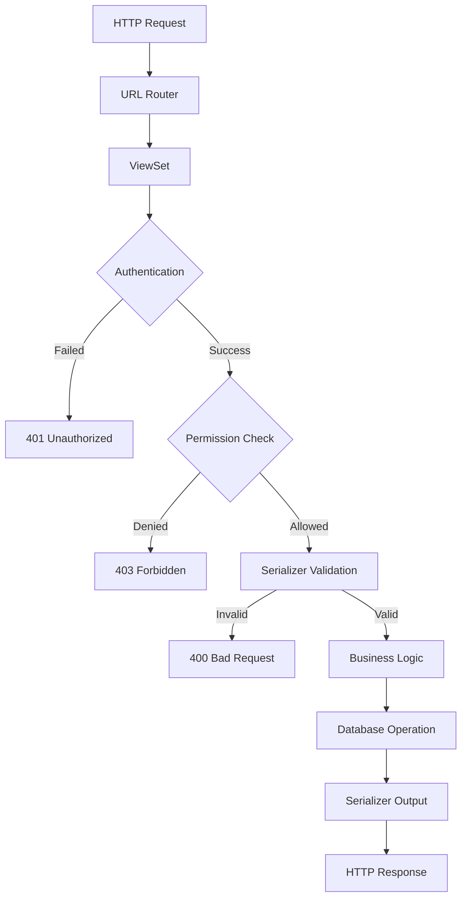

# How to Build REST APIs with Django REST Framework

Author: [nawazdhandala](https://www.github.com/nawazdhandala)

Tags: Python, Django, REST API, Django REST Framework, Backend Development, Web Development

Description: Learn how to build production-ready REST APIs with Django REST Framework. This guide covers project setup, serializers, viewsets, authentication, permissions, pagination, filtering, and testing.

---

> Django REST Framework (DRF) is the go-to library for building REST APIs in Python. It sits on top of Django and provides powerful tools for serialization, authentication, and API management. This guide walks you through building a complete API from scratch.

Django REST Framework has become the standard for building APIs in the Django ecosystem. It handles the tedious parts of API development - serialization, validation, authentication - so you can focus on your business logic.

---

## Why Django REST Framework?

| Feature | Benefit |
|---------|---------|
| **Serializers** | Automatic conversion between Python objects and JSON |
| **ViewSets** | CRUD operations with minimal code |
| **Authentication** | Built-in support for tokens, sessions, OAuth |
| **Permissions** | Fine-grained access control |
| **Browsable API** | Interactive documentation out of the box |
| **Throttling** | Rate limiting built in |

---

## Project Setup

Let's build a book management API. Start by creating a new Django project:

```bash
# Create and activate virtual environment
python -m venv venv
source venv/bin/activate  # On Windows: venv\Scripts\activate

# Install dependencies
pip install django djangorestframework

# Create Django project
django-admin startproject bookstore
cd bookstore

# Create app for books
python manage.py startapp books
```

Add the installed apps to `settings.py`:

```python
# bookstore/settings.py
INSTALLED_APPS = [
    'django.contrib.admin',
    'django.contrib.auth',
    'django.contrib.contenttypes',
    'django.contrib.sessions',
    'django.contrib.messages',
    'django.contrib.staticfiles',
    # Third party
    'rest_framework',
    # Local
    'books',
]

# DRF configuration
REST_FRAMEWORK = {
    'DEFAULT_PAGINATION_CLASS': 'rest_framework.pagination.PageNumberPagination',
    'PAGE_SIZE': 20,
    'DEFAULT_AUTHENTICATION_CLASSES': [
        'rest_framework.authentication.TokenAuthentication',
        'rest_framework.authentication.SessionAuthentication',
    ],
    'DEFAULT_PERMISSION_CLASSES': [
        'rest_framework.permissions.IsAuthenticatedOrReadOnly',
    ],
}
```

---

## Creating Models

Define the data models for our bookstore:

```python
# books/models.py
from django.db import models
from django.contrib.auth.models import User

class Author(models.Model):
    """Author model - stores information about book authors"""
    name = models.CharField(max_length=200)
    bio = models.TextField(blank=True)
    birth_date = models.DateField(null=True, blank=True)
    created_at = models.DateTimeField(auto_now_add=True)
    updated_at = models.DateTimeField(auto_now=True)

    class Meta:
        ordering = ['name']

    def __str__(self):
        return self.name

class Book(models.Model):
    """Book model - the main resource in our API"""
    title = models.CharField(max_length=300)
    author = models.ForeignKey(
        Author,
        on_delete=models.CASCADE,
        related_name='books'
    )
    isbn = models.CharField(max_length=13, unique=True)
    description = models.TextField(blank=True)
    price = models.DecimalField(max_digits=10, decimal_places=2)
    published_date = models.DateField()
    in_stock = models.BooleanField(default=True)
    created_by = models.ForeignKey(
        User,
        on_delete=models.SET_NULL,
        null=True,
        related_name='created_books'
    )
    created_at = models.DateTimeField(auto_now_add=True)
    updated_at = models.DateTimeField(auto_now=True)

    class Meta:
        ordering = ['-created_at']

    def __str__(self):
        return f"{self.title} by {self.author.name}"

class Review(models.Model):
    """Review model - user reviews for books"""
    book = models.ForeignKey(
        Book,
        on_delete=models.CASCADE,
        related_name='reviews'
    )
    user = models.ForeignKey(
        User,
        on_delete=models.CASCADE,
        related_name='reviews'
    )
    rating = models.IntegerField(choices=[(i, i) for i in range(1, 6)])
    comment = models.TextField()
    created_at = models.DateTimeField(auto_now_add=True)

    class Meta:
        # One review per user per book
        unique_together = ['book', 'user']
        ordering = ['-created_at']

    def __str__(self):
        return f"Review by {self.user.username} for {self.book.title}"
```

Run migrations:

```bash
python manage.py makemigrations
python manage.py migrate
```

---

## Building Serializers

Serializers convert model instances to JSON and validate incoming data:

```python
# books/serializers.py
from rest_framework import serializers
from django.contrib.auth.models import User
from .models import Author, Book, Review

class AuthorSerializer(serializers.ModelSerializer):
    """Serializer for Author model"""
    # Read-only field showing count of books
    book_count = serializers.SerializerMethodField()

    class Meta:
        model = Author
        fields = ['id', 'name', 'bio', 'birth_date', 'book_count', 'created_at']
        read_only_fields = ['created_at']

    def get_book_count(self, obj):
        """Return the number of books by this author"""
        return obj.books.count()

class ReviewSerializer(serializers.ModelSerializer):
    """Serializer for Review model"""
    # Show username instead of user ID
    user = serializers.StringRelatedField(read_only=True)

    class Meta:
        model = Review
        fields = ['id', 'user', 'rating', 'comment', 'created_at']
        read_only_fields = ['user', 'created_at']

    def validate_rating(self, value):
        """Ensure rating is between 1 and 5"""
        if value < 1 or value > 5:
            raise serializers.ValidationError("Rating must be between 1 and 5")
        return value

class BookListSerializer(serializers.ModelSerializer):
    """Lightweight serializer for book listings"""
    author_name = serializers.CharField(source='author.name', read_only=True)
    average_rating = serializers.SerializerMethodField()

    class Meta:
        model = Book
        fields = [
            'id', 'title', 'author_name', 'isbn',
            'price', 'in_stock', 'average_rating'
        ]

    def get_average_rating(self, obj):
        """Calculate average rating from reviews"""
        reviews = obj.reviews.all()
        if reviews:
            return round(sum(r.rating for r in reviews) / len(reviews), 1)
        return None

class BookDetailSerializer(serializers.ModelSerializer):
    """Detailed serializer for single book view"""
    author = AuthorSerializer(read_only=True)
    author_id = serializers.PrimaryKeyRelatedField(
        queryset=Author.objects.all(),
        source='author',
        write_only=True
    )
    reviews = ReviewSerializer(many=True, read_only=True)
    created_by = serializers.StringRelatedField(read_only=True)

    class Meta:
        model = Book
        fields = [
            'id', 'title', 'author', 'author_id', 'isbn',
            'description', 'price', 'published_date', 'in_stock',
            'reviews', 'created_by', 'created_at', 'updated_at'
        ]
        read_only_fields = ['created_by', 'created_at', 'updated_at']

    def validate_isbn(self, value):
        """Validate ISBN format"""
        # Remove hyphens for validation
        clean_isbn = value.replace('-', '')
        if len(clean_isbn) not in [10, 13]:
            raise serializers.ValidationError("ISBN must be 10 or 13 digits")
        if not clean_isbn.isdigit():
            raise serializers.ValidationError("ISBN must contain only digits")
        return clean_isbn

    def validate_price(self, value):
        """Ensure price is positive"""
        if value <= 0:
            raise serializers.ValidationError("Price must be greater than zero")
        return value
```

---

## Creating ViewSets and Views

ViewSets provide CRUD operations with minimal code:

```python
# books/views.py
from rest_framework import viewsets, status, filters
from rest_framework.decorators import action
from rest_framework.response import Response
from rest_framework.permissions import IsAuthenticated, IsAuthenticatedOrReadOnly
from django_filters.rest_framework import DjangoFilterBackend
from .models import Author, Book, Review
from .serializers import (
    AuthorSerializer,
    BookListSerializer,
    BookDetailSerializer,
    ReviewSerializer
)
from .permissions import IsOwnerOrReadOnly

class AuthorViewSet(viewsets.ModelViewSet):
    """
    ViewSet for Author model.
    Provides list, create, retrieve, update, and destroy actions.
    """
    queryset = Author.objects.all()
    serializer_class = AuthorSerializer
    permission_classes = [IsAuthenticatedOrReadOnly]
    filter_backends = [filters.SearchFilter, filters.OrderingFilter]
    search_fields = ['name', 'bio']
    ordering_fields = ['name', 'created_at']

    @action(detail=True, methods=['get'])
    def books(self, request, pk=None):
        """Get all books by this author"""
        author = self.get_object()
        books = author.books.all()
        serializer = BookListSerializer(books, many=True)
        return Response(serializer.data)

class BookViewSet(viewsets.ModelViewSet):
    """
    ViewSet for Book model.
    Uses different serializers for list and detail views.
    """
    queryset = Book.objects.select_related('author').prefetch_related('reviews')
    permission_classes = [IsAuthenticatedOrReadOnly]
    filter_backends = [
        DjangoFilterBackend,
        filters.SearchFilter,
        filters.OrderingFilter
    ]
    filterset_fields = ['author', 'in_stock', 'published_date']
    search_fields = ['title', 'description', 'isbn']
    ordering_fields = ['title', 'price', 'published_date', 'created_at']

    def get_serializer_class(self):
        """Use different serializers for list and detail"""
        if self.action == 'list':
            return BookListSerializer
        return BookDetailSerializer

    def perform_create(self, serializer):
        """Set created_by to current user when creating a book"""
        serializer.save(created_by=self.request.user)

    @action(detail=True, methods=['post'], permission_classes=[IsAuthenticated])
    def add_review(self, request, pk=None):
        """Add a review to this book"""
        book = self.get_object()

        # Check if user already reviewed this book
        if Review.objects.filter(book=book, user=request.user).exists():
            return Response(
                {'error': 'You have already reviewed this book'},
                status=status.HTTP_400_BAD_REQUEST
            )

        serializer = ReviewSerializer(data=request.data)
        if serializer.is_valid():
            serializer.save(book=book, user=request.user)
            return Response(serializer.data, status=status.HTTP_201_CREATED)
        return Response(serializer.errors, status=status.HTTP_400_BAD_REQUEST)

    @action(detail=False, methods=['get'])
    def in_stock(self, request):
        """Get only books that are in stock"""
        books = self.queryset.filter(in_stock=True)
        page = self.paginate_queryset(books)
        if page is not None:
            serializer = BookListSerializer(page, many=True)
            return self.get_paginated_response(serializer.data)
        serializer = BookListSerializer(books, many=True)
        return Response(serializer.data)

class ReviewViewSet(viewsets.ModelViewSet):
    """ViewSet for Review model"""
    queryset = Review.objects.select_related('user', 'book')
    serializer_class = ReviewSerializer
    permission_classes = [IsAuthenticatedOrReadOnly, IsOwnerOrReadOnly]

    def perform_create(self, serializer):
        """Set user to current user when creating review"""
        serializer.save(user=self.request.user)
```

---

## Custom Permissions

Create custom permission classes for fine-grained access control:

```python
# books/permissions.py
from rest_framework import permissions

class IsOwnerOrReadOnly(permissions.BasePermission):
    """
    Custom permission to only allow owners of an object to edit it.
    Assumes the model has a 'user' or 'created_by' attribute.
    """
    def has_object_permission(self, request, view, obj):
        # Read permissions are allowed to any request
        if request.method in permissions.SAFE_METHODS:
            return True

        # Write permissions only to owner
        if hasattr(obj, 'user'):
            return obj.user == request.user
        if hasattr(obj, 'created_by'):
            return obj.created_by == request.user
        return False

class IsAdminOrReadOnly(permissions.BasePermission):
    """
    Custom permission to only allow admins to edit.
    """
    def has_permission(self, request, view):
        if request.method in permissions.SAFE_METHODS:
            return True
        return request.user and request.user.is_staff
```

---

## URL Configuration

Wire up the viewsets using routers:

```python
# books/urls.py
from django.urls import path, include
from rest_framework.routers import DefaultRouter
from .views import AuthorViewSet, BookViewSet, ReviewViewSet

# Create router and register viewsets
router = DefaultRouter()
router.register(r'authors', AuthorViewSet)
router.register(r'books', BookViewSet)
router.register(r'reviews', ReviewViewSet)

urlpatterns = [
    path('', include(router.urls)),
]
```

Include in main URL configuration:

```python
# bookstore/urls.py
from django.contrib import admin
from django.urls import path, include
from rest_framework.authtoken.views import obtain_auth_token

urlpatterns = [
    path('admin/', admin.site.urls),
    path('api/', include('books.urls')),
    path('api/auth/', include('rest_framework.urls')),
    path('api/token/', obtain_auth_token, name='api_token'),
]
```

---

## API Flow

Here's how requests flow through the DRF stack:



---

## Authentication Setup

Set up token authentication for your API:

```python
# Add to INSTALLED_APPS in settings.py
INSTALLED_APPS = [
    # ... existing apps
    'rest_framework.authtoken',
]
```

Run migrations to create token table:

```bash
python manage.py migrate
```

Create a user registration endpoint:

```python
# books/views.py - add this
from django.contrib.auth.models import User
from rest_framework.authtoken.models import Token
from rest_framework.views import APIView
from rest_framework.permissions import AllowAny

class RegisterView(APIView):
    """User registration endpoint"""
    permission_classes = [AllowAny]

    def post(self, request):
        username = request.data.get('username')
        password = request.data.get('password')
        email = request.data.get('email', '')

        if not username or not password:
            return Response(
                {'error': 'Username and password are required'},
                status=status.HTTP_400_BAD_REQUEST
            )

        if User.objects.filter(username=username).exists():
            return Response(
                {'error': 'Username already exists'},
                status=status.HTTP_400_BAD_REQUEST
            )

        # Create user
        user = User.objects.create_user(
            username=username,
            password=password,
            email=email
        )

        # Create token for user
        token, created = Token.objects.get_or_create(user=user)

        return Response({
            'user_id': user.id,
            'username': user.username,
            'token': token.key
        }, status=status.HTTP_201_CREATED)
```

---

## Pagination and Filtering

DRF provides several pagination styles:

```python
# books/pagination.py
from rest_framework.pagination import PageNumberPagination, CursorPagination

class StandardPagination(PageNumberPagination):
    """Standard pagination with configurable page size"""
    page_size = 20
    page_size_query_param = 'page_size'
    max_page_size = 100

class BookCursorPagination(CursorPagination):
    """Cursor pagination for efficient large dataset traversal"""
    page_size = 20
    ordering = '-created_at'
    cursor_query_param = 'cursor'
```

Add filtering with django-filter:

```bash
pip install django-filter
```

```python
# books/filters.py
import django_filters
from .models import Book

class BookFilter(django_filters.FilterSet):
    """Custom filters for Book model"""
    min_price = django_filters.NumberFilter(field_name='price', lookup_expr='gte')
    max_price = django_filters.NumberFilter(field_name='price', lookup_expr='lte')
    published_after = django_filters.DateFilter(
        field_name='published_date',
        lookup_expr='gte'
    )
    published_before = django_filters.DateFilter(
        field_name='published_date',
        lookup_expr='lte'
    )
    title_contains = django_filters.CharFilter(
        field_name='title',
        lookup_expr='icontains'
    )

    class Meta:
        model = Book
        fields = ['author', 'in_stock', 'min_price', 'max_price']
```

Update the viewset to use the custom filter:

```python
# books/views.py - update BookViewSet
from .filters import BookFilter
from .pagination import StandardPagination

class BookViewSet(viewsets.ModelViewSet):
    queryset = Book.objects.select_related('author').prefetch_related('reviews')
    permission_classes = [IsAuthenticatedOrReadOnly]
    pagination_class = StandardPagination
    filter_backends = [
        DjangoFilterBackend,
        filters.SearchFilter,
        filters.OrderingFilter
    ]
    filterset_class = BookFilter  # Use custom filter class
    search_fields = ['title', 'description', 'isbn']
    ordering_fields = ['title', 'price', 'published_date', 'created_at']
```

---

## Error Handling

Create custom exception handling for consistent error responses:

```python
# books/exceptions.py
from rest_framework.views import exception_handler
from rest_framework.response import Response
from rest_framework import status

def custom_exception_handler(exc, context):
    """Custom exception handler for consistent error format"""
    response = exception_handler(exc, context)

    if response is not None:
        # Customize the response format
        custom_response = {
            'success': False,
            'error': {
                'status_code': response.status_code,
                'message': get_error_message(response.data)
            }
        }
        response.data = custom_response

    return response

def get_error_message(data):
    """Extract error message from response data"""
    if isinstance(data, dict):
        if 'detail' in data:
            return data['detail']
        # Flatten field errors
        messages = []
        for field, errors in data.items():
            if isinstance(errors, list):
                messages.append(f"{field}: {', '.join(str(e) for e in errors)}")
            else:
                messages.append(f"{field}: {errors}")
        return '; '.join(messages)
    return str(data)
```

Add to settings:

```python
# settings.py
REST_FRAMEWORK = {
    # ... existing config
    'EXCEPTION_HANDLER': 'books.exceptions.custom_exception_handler',
}
```

---

## Testing Your API

Write tests to verify your API works correctly:

```python
# books/tests.py
from django.test import TestCase
from django.contrib.auth.models import User
from rest_framework.test import APITestCase, APIClient
from rest_framework import status
from rest_framework.authtoken.models import Token
from decimal import Decimal
from datetime import date
from .models import Author, Book, Review

class BookAPITests(APITestCase):
    """Test cases for Book API endpoints"""

    def setUp(self):
        """Set up test data"""
        # Create test user
        self.user = User.objects.create_user(
            username='testuser',
            password='testpass123'
        )
        self.token = Token.objects.create(user=self.user)
        self.client = APIClient()

        # Create test author
        self.author = Author.objects.create(
            name='Test Author',
            bio='A test author bio'
        )

        # Create test book
        self.book = Book.objects.create(
            title='Test Book',
            author=self.author,
            isbn='1234567890123',
            description='A test book description',
            price=Decimal('29.99'),
            published_date=date(2024, 1, 15),
            created_by=self.user
        )

    def test_list_books_unauthenticated(self):
        """Test that unauthenticated users can list books"""
        response = self.client.get('/api/books/')
        self.assertEqual(response.status_code, status.HTTP_200_OK)

    def test_create_book_unauthenticated(self):
        """Test that unauthenticated users cannot create books"""
        data = {
            'title': 'New Book',
            'author_id': self.author.id,
            'isbn': '9876543210123',
            'price': '19.99',
            'published_date': '2024-06-01'
        }
        response = self.client.post('/api/books/', data)
        self.assertEqual(response.status_code, status.HTTP_401_UNAUTHORIZED)

    def test_create_book_authenticated(self):
        """Test that authenticated users can create books"""
        self.client.credentials(HTTP_AUTHORIZATION=f'Token {self.token.key}')
        data = {
            'title': 'New Book',
            'author_id': self.author.id,
            'isbn': '9876543210123',
            'price': '19.99',
            'published_date': '2024-06-01'
        }
        response = self.client.post('/api/books/', data)
        self.assertEqual(response.status_code, status.HTTP_201_CREATED)
        self.assertEqual(Book.objects.count(), 2)

    def test_retrieve_book(self):
        """Test retrieving a single book"""
        response = self.client.get(f'/api/books/{self.book.id}/')
        self.assertEqual(response.status_code, status.HTTP_200_OK)
        self.assertEqual(response.data['title'], 'Test Book')

    def test_update_book_owner(self):
        """Test that book owner can update the book"""
        self.client.credentials(HTTP_AUTHORIZATION=f'Token {self.token.key}')
        data = {'title': 'Updated Title'}
        response = self.client.patch(f'/api/books/{self.book.id}/', data)
        self.assertEqual(response.status_code, status.HTTP_200_OK)
        self.book.refresh_from_db()
        self.assertEqual(self.book.title, 'Updated Title')

    def test_filter_books_by_price(self):
        """Test filtering books by price range"""
        response = self.client.get('/api/books/', {'min_price': 20, 'max_price': 40})
        self.assertEqual(response.status_code, status.HTTP_200_OK)

    def test_search_books(self):
        """Test searching books by title"""
        response = self.client.get('/api/books/', {'search': 'Test'})
        self.assertEqual(response.status_code, status.HTTP_200_OK)
        self.assertEqual(len(response.data['results']), 1)

    def test_add_review(self):
        """Test adding a review to a book"""
        self.client.credentials(HTTP_AUTHORIZATION=f'Token {self.token.key}')
        data = {
            'rating': 5,
            'comment': 'Great book!'
        }
        response = self.client.post(
            f'/api/books/{self.book.id}/add_review/',
            data
        )
        self.assertEqual(response.status_code, status.HTTP_201_CREATED)
        self.assertEqual(Review.objects.count(), 1)

    def test_duplicate_review(self):
        """Test that users cannot review the same book twice"""
        self.client.credentials(HTTP_AUTHORIZATION=f'Token {self.token.key}')
        # First review
        Review.objects.create(
            book=self.book,
            user=self.user,
            rating=4,
            comment='Good book'
        )
        # Try second review
        data = {'rating': 5, 'comment': 'Still great!'}
        response = self.client.post(
            f'/api/books/{self.book.id}/add_review/',
            data
        )
        self.assertEqual(response.status_code, status.HTTP_400_BAD_REQUEST)

class AuthorAPITests(APITestCase):
    """Test cases for Author API endpoints"""

    def setUp(self):
        self.user = User.objects.create_user(
            username='testuser',
            password='testpass123'
        )
        self.token = Token.objects.create(user=self.user)
        self.author = Author.objects.create(
            name='Jane Doe',
            bio='Fiction writer'
        )

    def test_list_authors(self):
        """Test listing all authors"""
        response = self.client.get('/api/authors/')
        self.assertEqual(response.status_code, status.HTTP_200_OK)

    def test_search_authors(self):
        """Test searching authors by name"""
        response = self.client.get('/api/authors/', {'search': 'Jane'})
        self.assertEqual(response.status_code, status.HTTP_200_OK)

    def test_author_book_count(self):
        """Test that book count is included in response"""
        response = self.client.get(f'/api/authors/{self.author.id}/')
        self.assertEqual(response.status_code, status.HTTP_200_OK)
        self.assertIn('book_count', response.data)
```

Run the tests:

```bash
python manage.py test books
```

---

## API Documentation

DRF includes a browsable API by default. For production, add OpenAPI documentation:

```bash
pip install drf-spectacular
```

```python
# settings.py
INSTALLED_APPS = [
    # ... existing apps
    'drf_spectacular',
]

REST_FRAMEWORK = {
    # ... existing config
    'DEFAULT_SCHEMA_CLASS': 'drf_spectacular.openapi.AutoSchema',
}

SPECTACULAR_SETTINGS = {
    'TITLE': 'Bookstore API',
    'DESCRIPTION': 'API for managing books, authors, and reviews',
    'VERSION': '1.0.0',
}
```

Add documentation URLs:

```python
# bookstore/urls.py
from drf_spectacular.views import SpectacularAPIView, SpectacularSwaggerView

urlpatterns = [
    # ... existing urls
    path('api/schema/', SpectacularAPIView.as_view(), name='schema'),
    path('api/docs/', SpectacularSwaggerView.as_view(url_name='schema'), name='swagger-ui'),
]
```

---

## Conclusion

Django REST Framework provides everything you need to build production-ready APIs. Key takeaways:

- **Serializers** handle data conversion and validation automatically
- **ViewSets** reduce boilerplate for CRUD operations
- **Routers** generate URL patterns from viewsets
- **Permissions** provide flexible access control
- **Filtering and pagination** are built in and configurable
- **The browsable API** makes development and debugging easier

DRF's design philosophy of doing the common cases well while allowing customization for edge cases makes it ideal for most Django API projects.

---

*Building APIs is just the first step. [OneUptime](https://oneuptime.com) helps you monitor your APIs in production with uptime checks, performance tracking, and incident management.*

**Related Reading:**
- [How to Instrument Python Applications with OpenTelemetry](https://oneuptime.com/blog/post/2025-01-06-instrument-python-opentelemetry/view)
- [How to Implement Rate Limiting in FastAPI](https://oneuptime.com/blog/post/2025-01-06-fastapi-rate-limiting/view)
