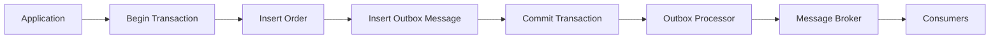
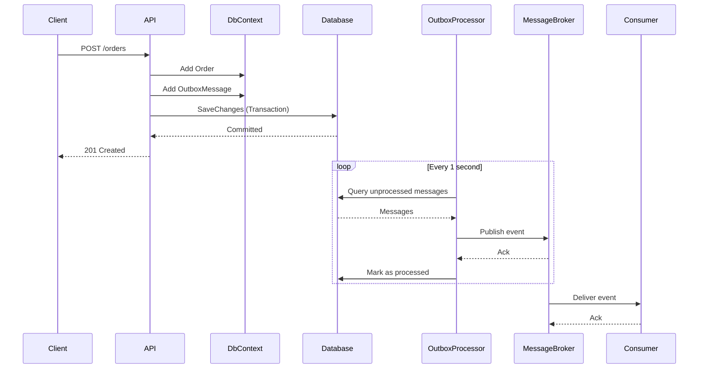

# How to Build the Outbox Pattern in .NET

Author: [nawazdhandala](https://www.github.com/nawazdhandala)

Tags: .NET, Outbox Pattern, Entity Framework Core, Distributed Systems, Messaging, MassTransit, Event-Driven Architecture

Description: Learn how to implement the transactional outbox pattern in .NET using Entity Framework Core to ensure reliable message delivery in distributed systems.

---

When building microservices, you often need to update your database and publish an event to a message broker. This dual-write operation is dangerous because either step can fail, leaving your system in an inconsistent state. The transactional outbox pattern solves this by storing events in a database table within the same transaction as your business data, then publishing them asynchronously.

## The Dual-Write Problem

Consider an e-commerce order service that saves an order and publishes an event:

```csharp
// This code has a serious bug
public async Task CreateOrderAsync(Order order)
{
    // Step 1: Save to database
    await _dbContext.Orders.AddAsync(order);
    await _dbContext.SaveChangesAsync();

    // Step 2: Publish event to message broker
    // What if this fails? The order exists but downstream services never know
    await _messageBus.PublishAsync(new OrderCreatedEvent(order.Id, order.CustomerId));
}
```

If the message broker is unavailable or the publish fails for any reason, you have an order in the database but no event was sent. The inventory service never reserves stock. The notification service never sends a confirmation email. Your system is now inconsistent.

## How the Outbox Pattern Works

The outbox pattern introduces an intermediary step:



Instead of publishing directly, you write the event to an outbox table in the same database transaction. A background processor reads from the outbox and publishes to the message broker. Since both writes happen in one transaction, they either both succeed or both fail.

## Setting Up the Outbox Table

Start by creating the outbox entity and database table:

```csharp
// OutboxMessage.cs - The entity that stores pending events
public class OutboxMessage
{
    public Guid Id { get; set; }

    // The type of entity this event relates to (e.g., "Order", "Customer")
    public string AggregateType { get; set; } = string.Empty;

    // The identifier of the specific entity instance
    public string AggregateId { get; set; } = string.Empty;

    // The event type (e.g., "OrderCreated", "OrderShipped")
    public string EventType { get; set; } = string.Empty;

    // The serialized event payload as JSON
    public string Payload { get; set; } = string.Empty;

    // When the message was created
    public DateTime CreatedAt { get; set; }

    // When the message was successfully published (null if pending)
    public DateTime? ProcessedAt { get; set; }
}
```

Add the Entity Framework configuration:

```csharp
// OutboxMessageConfiguration.cs - EF Core configuration for the outbox table
public class OutboxMessageConfiguration : IEntityTypeConfiguration<OutboxMessage>
{
    public void Configure(EntityTypeBuilder<OutboxMessage> builder)
    {
        builder.ToTable("outbox_messages");

        builder.HasKey(x => x.Id);

        builder.Property(x => x.AggregateType)
            .HasMaxLength(256)
            .IsRequired();

        builder.Property(x => x.AggregateId)
            .HasMaxLength(256)
            .IsRequired();

        builder.Property(x => x.EventType)
            .HasMaxLength(256)
            .IsRequired();

        builder.Property(x => x.Payload)
            .IsRequired();

        // Index for efficiently finding unprocessed messages
        builder.HasIndex(x => x.ProcessedAt)
            .HasFilter("[ProcessedAt] IS NULL");
    }
}
```

Add the outbox table to your DbContext:

```csharp
// ApplicationDbContext.cs
public class ApplicationDbContext : DbContext
{
    public DbSet<Order> Orders { get; set; }
    public DbSet<OutboxMessage> OutboxMessages { get; set; }

    protected override void OnModelCreating(ModelBuilder modelBuilder)
    {
        modelBuilder.ApplyConfiguration(new OutboxMessageConfiguration());
        // Apply other configurations...
    }
}
```

## Creating the Outbox Helper

Build a helper class that simplifies writing to the outbox:

```csharp
// IOutboxWriter.cs - Interface for writing outbox messages
public interface IOutboxWriter
{
    void Add<TEvent>(string aggregateType, string aggregateId, TEvent @event)
        where TEvent : class;
}

// OutboxWriter.cs - Implementation that writes to the DbContext
public class OutboxWriter : IOutboxWriter
{
    private readonly ApplicationDbContext _dbContext;
    private readonly JsonSerializerOptions _jsonOptions;

    public OutboxWriter(ApplicationDbContext dbContext)
    {
        _dbContext = dbContext;
        _jsonOptions = new JsonSerializerOptions
        {
            PropertyNamingPolicy = JsonNamingPolicy.CamelCase,
            WriteIndented = false
        };
    }

    public void Add<TEvent>(string aggregateType, string aggregateId, TEvent @event)
        where TEvent : class
    {
        // Serialize the event to JSON
        var payload = JsonSerializer.Serialize(@event, _jsonOptions);

        // Create the outbox message
        var outboxMessage = new OutboxMessage
        {
            Id = Guid.NewGuid(),
            AggregateType = aggregateType,
            AggregateId = aggregateId,
            EventType = typeof(TEvent).Name,
            Payload = payload,
            CreatedAt = DateTime.UtcNow
        };

        // Add to the DbContext - will be saved with the same transaction
        _dbContext.OutboxMessages.Add(outboxMessage);
    }
}
```

## Rewriting the Order Service

Now update the order service to use the outbox:

```csharp
// OrderService.cs - The service now writes to the outbox instead of publishing directly
public class OrderService
{
    private readonly ApplicationDbContext _dbContext;
    private readonly IOutboxWriter _outboxWriter;

    public OrderService(ApplicationDbContext dbContext, IOutboxWriter outboxWriter)
    {
        _dbContext = dbContext;
        _outboxWriter = outboxWriter;
    }

    public async Task<Order> CreateOrderAsync(CreateOrderRequest request)
    {
        // Create the order entity
        var order = new Order
        {
            Id = Guid.NewGuid(),
            CustomerId = request.CustomerId,
            Items = request.Items.Select(i => new OrderItem
            {
                ProductId = i.ProductId,
                Quantity = i.Quantity,
                UnitPrice = i.UnitPrice
            }).ToList(),
            TotalAmount = request.Items.Sum(i => i.Quantity * i.UnitPrice),
            Status = OrderStatus.Pending,
            CreatedAt = DateTime.UtcNow
        };

        // Add the order to the context
        await _dbContext.Orders.AddAsync(order);

        // Create the event to publish
        var orderCreatedEvent = new OrderCreatedEvent
        {
            OrderId = order.Id,
            CustomerId = order.CustomerId,
            TotalAmount = order.TotalAmount,
            CreatedAt = order.CreatedAt
        };

        // Write to the outbox - this will be included in the same transaction
        _outboxWriter.Add("Order", order.Id.ToString(), orderCreatedEvent);

        // Save both the order AND the outbox message in one transaction
        await _dbContext.SaveChangesAsync();

        return order;
    }
}
```

The order and the outbox message are now saved atomically. If anything fails, both are rolled back.

## Building the Outbox Processor

The processor runs as a background service, polling for unprocessed messages and publishing them:

```csharp
// OutboxProcessor.cs - Background service that publishes outbox messages
public class OutboxProcessor : BackgroundService
{
    private readonly IServiceScopeFactory _scopeFactory;
    private readonly ILogger<OutboxProcessor> _logger;
    private readonly TimeSpan _pollingInterval = TimeSpan.FromSeconds(1);
    private readonly int _batchSize = 100;

    public OutboxProcessor(
        IServiceScopeFactory scopeFactory,
        ILogger<OutboxProcessor> logger)
    {
        _scopeFactory = scopeFactory;
        _logger = logger;
    }

    protected override async Task ExecuteAsync(CancellationToken stoppingToken)
    {
        _logger.LogInformation("Outbox processor started");

        while (!stoppingToken.IsCancellationRequested)
        {
            try
            {
                await ProcessOutboxMessagesAsync(stoppingToken);
            }
            catch (Exception ex)
            {
                _logger.LogError(ex, "Error processing outbox messages");
            }

            await Task.Delay(_pollingInterval, stoppingToken);
        }
    }

    private async Task ProcessOutboxMessagesAsync(CancellationToken cancellationToken)
    {
        using var scope = _scopeFactory.CreateScope();
        var dbContext = scope.ServiceProvider.GetRequiredService<ApplicationDbContext>();
        var messageBus = scope.ServiceProvider.GetRequiredService<IMessageBus>();

        // Fetch unprocessed messages ordered by creation time
        var messages = await dbContext.OutboxMessages
            .Where(m => m.ProcessedAt == null)
            .OrderBy(m => m.CreatedAt)
            .Take(_batchSize)
            .ToListAsync(cancellationToken);

        if (messages.Count == 0)
        {
            return;
        }

        _logger.LogInformation("Processing {Count} outbox messages", messages.Count);

        foreach (var message in messages)
        {
            try
            {
                // Publish the message to the broker
                await messageBus.PublishAsync(
                    message.EventType,
                    message.Payload,
                    cancellationToken);

                // Mark as processed
                message.ProcessedAt = DateTime.UtcNow;

                _logger.LogDebug(
                    "Published outbox message {MessageId} of type {EventType}",
                    message.Id,
                    message.EventType);
            }
            catch (Exception ex)
            {
                _logger.LogError(
                    ex,
                    "Failed to publish outbox message {MessageId}",
                    message.Id);
                // Continue with next message - this one will be retried
            }
        }

        // Save the ProcessedAt timestamps
        await dbContext.SaveChangesAsync(cancellationToken);
    }
}
```

Register the background service in your DI container:

```csharp
// Program.cs or Startup.cs
builder.Services.AddHostedService<OutboxProcessor>();
builder.Services.AddScoped<IOutboxWriter, OutboxWriter>();
```

## Handling Concurrent Processing

When running multiple instances of your service, you need to prevent duplicate processing. Use row-level locking with `FOR UPDATE SKIP LOCKED` in PostgreSQL or similar mechanisms:

```csharp
// OutboxProcessorWithLocking.cs - Handles concurrent processing safely
private async Task ProcessOutboxMessagesAsync(CancellationToken cancellationToken)
{
    using var scope = _scopeFactory.CreateScope();
    var dbContext = scope.ServiceProvider.GetRequiredService<ApplicationDbContext>();
    var messageBus = scope.ServiceProvider.GetRequiredService<IMessageBus>();

    // Use a raw SQL query with locking for PostgreSQL
    var messages = await dbContext.OutboxMessages
        .FromSqlRaw(@"
            SELECT * FROM outbox_messages
            WHERE processed_at IS NULL
            ORDER BY created_at
            LIMIT {0}
            FOR UPDATE SKIP LOCKED", _batchSize)
        .ToListAsync(cancellationToken);

    // Process messages within a transaction
    using var transaction = await dbContext.Database.BeginTransactionAsync(cancellationToken);

    try
    {
        foreach (var message in messages)
        {
            await messageBus.PublishAsync(
                message.EventType,
                message.Payload,
                cancellationToken);

            message.ProcessedAt = DateTime.UtcNow;
        }

        await dbContext.SaveChangesAsync(cancellationToken);
        await transaction.CommitAsync(cancellationToken);
    }
    catch
    {
        await transaction.RollbackAsync(cancellationToken);
        throw;
    }
}
```

For SQL Server, you can use `UPDLOCK` and `READPAST` hints:

```csharp
// SQL Server version with locking hints
var messages = await dbContext.OutboxMessages
    .FromSqlRaw(@"
        SELECT * FROM outbox_messages WITH (UPDLOCK, READPAST)
        WHERE processed_at IS NULL
        ORDER BY created_at
        OFFSET 0 ROWS FETCH NEXT {0} ROWS ONLY", _batchSize)
    .ToListAsync(cancellationToken);
```

## Using MassTransit's Built-in Outbox

If you are using MassTransit, it includes a built-in outbox implementation that handles all of this for you:

```csharp
// Program.cs - Configuring MassTransit with the outbox pattern
builder.Services.AddMassTransit(x =>
{
    x.AddConsumer<OrderCreatedConsumer>();

    // Configure the Entity Framework outbox
    x.AddEntityFrameworkOutbox<ApplicationDbContext>(o =>
    {
        // Use SQL Server (or configure for PostgreSQL, MySQL, etc.)
        o.UseSqlServer();

        // Poll every second for new messages
        o.QueryDelay = TimeSpan.FromSeconds(1);

        // Process up to 100 messages per batch
        o.QueryMessageLimit = 100;

        // Use the bus outbox for publishing
        o.UseBusOutbox();
    });

    x.UsingRabbitMq((context, cfg) =>
    {
        cfg.Host("localhost", "/", h =>
        {
            h.Username("guest");
            h.Password("guest");
        });

        cfg.ConfigureEndpoints(context);
    });
});
```

With MassTransit's outbox, publishing is automatic:

```csharp
// OrderService.cs - Using MassTransit's outbox
public class OrderService
{
    private readonly ApplicationDbContext _dbContext;
    private readonly IPublishEndpoint _publishEndpoint;

    public OrderService(
        ApplicationDbContext dbContext,
        IPublishEndpoint publishEndpoint)
    {
        _dbContext = dbContext;
        _publishEndpoint = publishEndpoint;
    }

    public async Task<Order> CreateOrderAsync(CreateOrderRequest request)
    {
        var order = new Order
        {
            Id = Guid.NewGuid(),
            CustomerId = request.CustomerId,
            TotalAmount = request.TotalAmount,
            Status = OrderStatus.Pending,
            CreatedAt = DateTime.UtcNow
        };

        await _dbContext.Orders.AddAsync(order);

        // MassTransit automatically writes to the outbox table
        // when used within a DbContext transaction
        await _publishEndpoint.Publish(new OrderCreatedEvent
        {
            OrderId = order.Id,
            CustomerId = order.CustomerId,
            TotalAmount = order.TotalAmount
        });

        await _dbContext.SaveChangesAsync();

        return order;
    }
}
```

MassTransit handles the outbox table creation, message serialization, and background processing automatically.

## Cleanup: Removing Processed Messages

Over time, the outbox table grows with processed messages. Add a cleanup job:

```csharp
// OutboxCleanupService.cs - Removes old processed messages
public class OutboxCleanupService : BackgroundService
{
    private readonly IServiceScopeFactory _scopeFactory;
    private readonly ILogger<OutboxCleanupService> _logger;
    private readonly TimeSpan _cleanupInterval = TimeSpan.FromHours(1);
    private readonly TimeSpan _retentionPeriod = TimeSpan.FromDays(7);

    public OutboxCleanupService(
        IServiceScopeFactory scopeFactory,
        ILogger<OutboxCleanupService> logger)
    {
        _scopeFactory = scopeFactory;
        _logger = logger;
    }

    protected override async Task ExecuteAsync(CancellationToken stoppingToken)
    {
        while (!stoppingToken.IsCancellationRequested)
        {
            await Task.Delay(_cleanupInterval, stoppingToken);

            try
            {
                await CleanupOldMessagesAsync(stoppingToken);
            }
            catch (Exception ex)
            {
                _logger.LogError(ex, "Error cleaning up outbox messages");
            }
        }
    }

    private async Task CleanupOldMessagesAsync(CancellationToken cancellationToken)
    {
        using var scope = _scopeFactory.CreateScope();
        var dbContext = scope.ServiceProvider.GetRequiredService<ApplicationDbContext>();

        var cutoffDate = DateTime.UtcNow.Subtract(_retentionPeriod);

        // Delete in batches to avoid long-running transactions
        var deletedCount = await dbContext.OutboxMessages
            .Where(m => m.ProcessedAt != null && m.ProcessedAt < cutoffDate)
            .ExecuteDeleteAsync(cancellationToken);

        _logger.LogInformation(
            "Cleaned up {Count} processed outbox messages older than {Days} days",
            deletedCount,
            _retentionPeriod.TotalDays);
    }
}
```

## The Complete Flow

Here is how everything fits together:



## Idempotent Consumers

Because the outbox processor might fail after publishing but before marking a message as processed, consumers must handle duplicate messages. Add idempotency checks:

```csharp
// OrderCreatedConsumer.cs - Handles OrderCreatedEvent idempotently
public class OrderCreatedConsumer : IConsumer<OrderCreatedEvent>
{
    private readonly ApplicationDbContext _dbContext;
    private readonly ILogger<OrderCreatedConsumer> _logger;

    public OrderCreatedConsumer(
        ApplicationDbContext dbContext,
        ILogger<OrderCreatedConsumer> logger)
    {
        _dbContext = dbContext;
        _logger = logger;
    }

    public async Task Consume(ConsumeContext<OrderCreatedEvent> context)
    {
        var orderId = context.Message.OrderId;

        // Check if we have already processed this event
        var alreadyProcessed = await _dbContext.ProcessedEvents
            .AnyAsync(e => e.EventId == context.MessageId);

        if (alreadyProcessed)
        {
            _logger.LogInformation(
                "OrderCreatedEvent for order {OrderId} already processed, skipping",
                orderId);
            return;
        }

        // Process the event
        await ReserveInventoryAsync(context.Message);

        // Record that we processed this event
        _dbContext.ProcessedEvents.Add(new ProcessedEvent
        {
            EventId = context.MessageId ?? Guid.NewGuid(),
            ProcessedAt = DateTime.UtcNow
        });

        await _dbContext.SaveChangesAsync();
    }

    private async Task ReserveInventoryAsync(OrderCreatedEvent @event)
    {
        // Inventory reservation logic here
    }
}
```

## When to Use the Outbox Pattern

The outbox pattern is ideal when:

- You need guaranteed message delivery after database changes
- Your system requires eventual consistency between services
- You want to decouple your application from message broker availability
- You are building event-driven microservices that must not lose events

Consider alternatives when:

- Your database supports change data capture (CDC) like Debezium
- You can tolerate occasional lost messages
- You have simple use cases where a single database transaction is sufficient

## Summary

The transactional outbox pattern provides a reliable way to publish events from your .NET applications without the risks of dual writes. By storing events in the same transaction as your business data and processing them asynchronously, you guarantee that every change produces its corresponding event. Whether you build it yourself or use a library like MassTransit, the pattern is a cornerstone of reliable event-driven architectures.
