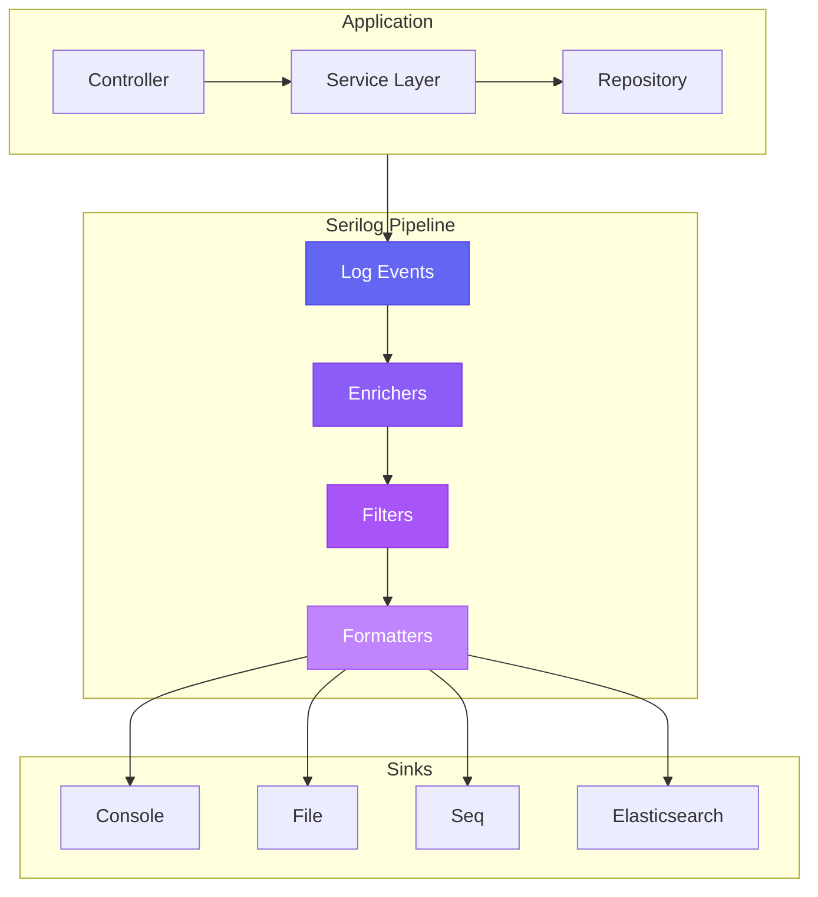

# How to Implement Logging with Serilog in .NET

Author: [nawazdhandala](https://www.github.com/nawazdhandala)

Tags: C#, .NET, Serilog, Logging, Structured Logging, Observability, ASP.NET Core

Description: A comprehensive guide to implementing structured logging in .NET applications using Serilog with practical examples for console, file, and external sink configurations.

---

Logging is one of those things that separates production-ready applications from hobby projects. While .NET provides built-in logging capabilities, Serilog takes logging to the next level with structured logging, rich formatting, and an extensive ecosystem of sinks. In this guide, you will learn how to implement Serilog in your .NET applications from basic setup to advanced configurations.

## Why Serilog?

Before diving into implementation, let's understand why Serilog stands out:


Serilog supports structured logging out of the box, meaning your log messages carry semantic data that can be queried, filtered, and analyzed. Instead of embedding data in strings, you preserve the original data types and structure.

## Setting Up Serilog

### Step 1: Install the Required Packages

Start by adding Serilog packages to your project. The packages you need depend on your project type and desired sinks.

```bash
# Core Serilog package
dotnet add package Serilog

# For ASP.NET Core integration
dotnet add package Serilog.AspNetCore

# Common sinks
dotnet add package Serilog.Sinks.Console
dotnet add package Serilog.Sinks.File

# For reading configuration from appsettings.json
dotnet add package Serilog.Settings.Configuration
```

### Step 2: Basic Configuration

Here's the simplest way to configure Serilog in a console application:

```csharp
using Serilog;

// Configure the logger at application startup
Log.Logger = new LoggerConfiguration()
    .MinimumLevel.Debug()                    // Set the minimum log level
    .WriteTo.Console()                        // Write logs to console
    .WriteTo.File("logs/app-.log",           // Write logs to file
        rollingInterval: RollingInterval.Day) // Create a new file each day
    .CreateLogger();

try
{
    Log.Information("Application starting up");

    // Your application code here
    RunApplication();

    Log.Information("Application shutting down gracefully");
}
catch (Exception ex)
{
    // Capture any unhandled exceptions
    Log.Fatal(ex, "Application terminated unexpectedly");
}
finally
{
    // Ensure all logs are flushed before exit
    Log.CloseAndFlush();
}
```

## Structured Logging in Action

The real power of Serilog comes from structured logging. Instead of string interpolation, you use message templates with named placeholders.

### Message Templates vs String Interpolation

```csharp
// Bad: String interpolation loses structure
var userId = 12345;
var action = "login";
Log.Information($"User {userId} performed {action}");
// Output: "User 12345 performed login"
// The data is lost in the string

// Good: Message templates preserve structure
Log.Information("User {UserId} performed {Action}", userId, action);
// Output: "User 12345 performed login"
// But internally stores: { UserId: 12345, Action: "login" }
```

The structured approach means you can later query your logs for all entries where `UserId = 12345` or where `Action = "login"`.

### Property Naming Conventions

Serilog uses specific prefixes for special behaviors:

```csharp
// @ prefix: Serialize the object (destructure it)
var user = new User { Id = 1, Name = "Alice", Email = "alice@example.com" };
Log.Information("User logged in: {@User}", user);
// Output includes all properties of the user object

// $ prefix: Convert to string using ToString()
Log.Information("User logged in: {$User}", user);
// Output uses the object's ToString() method

// No prefix: Scalar value
Log.Information("User ID: {UserId}", user.Id);
// Output: "User ID: 1"
```

## ASP.NET Core Integration

For ASP.NET Core applications, Serilog provides seamless integration that replaces the default logging infrastructure.

### Program.cs Configuration

```csharp
using Serilog;

var builder = WebApplication.CreateBuilder(args);

// Configure Serilog from appsettings.json
builder.Host.UseSerilog((context, services, configuration) => configuration
    .ReadFrom.Configuration(context.Configuration)
    .ReadFrom.Services(services)
    .Enrich.FromLogContext()
    .Enrich.WithMachineName()
    .Enrich.WithEnvironmentName()
    .WriteTo.Console(
        outputTemplate: "[{Timestamp:HH:mm:ss} {Level:u3}] {Message:lj}{NewLine}{Exception}")
);

builder.Services.AddControllers();

var app = builder.Build();

// Add request logging middleware
// This logs each HTTP request with timing information
app.UseSerilogRequestLogging(options =>
{
    // Customize the message template
    options.MessageTemplate = "HTTP {RequestMethod} {RequestPath} responded {StatusCode} in {Elapsed:0.0000} ms";

    // Attach additional properties to the log entry
    options.EnrichDiagnosticContext = (diagnosticContext, httpContext) =>
    {
        diagnosticContext.Set("RequestHost", httpContext.Request.Host.Value);
        diagnosticContext.Set("UserAgent", httpContext.Request.Headers["User-Agent"].ToString());
    };
});

app.MapControllers();

app.Run();
```

### appsettings.json Configuration

Configure Serilog through your configuration file for easier environment-specific settings:

```json
{
  "Serilog": {
    "Using": ["Serilog.Sinks.Console", "Serilog.Sinks.File"],
    "MinimumLevel": {
      "Default": "Information",
      "Override": {
        "Microsoft": "Warning",
        "Microsoft.Hosting.Lifetime": "Information",
        "System": "Warning"
      }
    },
    "WriteTo": [
      {
        "Name": "Console",
        "Args": {
          "outputTemplate": "[{Timestamp:HH:mm:ss} {Level:u3}] {SourceContext}{NewLine}{Message:lj}{NewLine}{Exception}"
        }
      },
      {
        "Name": "File",
        "Args": {
          "path": "logs/app-.log",
          "rollingInterval": "Day",
          "retainedFileCountLimit": 7,
          "outputTemplate": "{Timestamp:yyyy-MM-dd HH:mm:ss.fff zzz} [{Level:u3}] {Message:lj}{NewLine}{Exception}"
        }
      }
    ],
    "Enrich": ["FromLogContext", "WithMachineName", "WithThreadId"]
  }
}
```

## Log Levels and Filtering

Serilog supports standard log levels that help you categorize and filter log output:


### Using Log Levels Appropriately

```csharp
public class OrderService
{
    private readonly ILogger<OrderService> _logger;

    public OrderService(ILogger<OrderService> logger)
    {
        _logger = logger;
    }

    public async Task<Order> ProcessOrderAsync(OrderRequest request)
    {
        // Verbose: Detailed diagnostic information
        _logger.LogTrace("Entering ProcessOrderAsync with request {@Request}", request);

        // Debug: Information useful during development
        _logger.LogDebug("Processing order for customer {CustomerId}", request.CustomerId);

        // Information: General operational events
        _logger.LogInformation("Order {OrderId} created for customer {CustomerId}",
            request.OrderId, request.CustomerId);

        if (request.Items.Count > 100)
        {
            // Warning: Unusual but not error conditions
            _logger.LogWarning("Large order detected: {ItemCount} items in order {OrderId}",
                request.Items.Count, request.OrderId);
        }

        try
        {
            var result = await _paymentService.ProcessPaymentAsync(request.Payment);
            return result;
        }
        catch (PaymentDeclinedException ex)
        {
            // Error: Failures that need attention
            _logger.LogError(ex, "Payment declined for order {OrderId}", request.OrderId);
            throw;
        }
        catch (Exception ex)
        {
            // Fatal: Critical failures requiring immediate attention
            _logger.LogCritical(ex, "Unexpected error processing order {OrderId}", request.OrderId);
            throw;
        }
    }
}
```

## Enrichers: Adding Context to Every Log

Enrichers automatically add properties to every log event. This is useful for adding contextual information like machine name, environment, or request correlation IDs.

### Built-in Enrichers

```csharp
Log.Logger = new LoggerConfiguration()
    .Enrich.FromLogContext()           // Properties from LogContext
    .Enrich.WithMachineName()          // Server/machine name
    .Enrich.WithEnvironmentName()      // ASPNETCORE_ENVIRONMENT
    .Enrich.WithThreadId()             // Thread ID
    .Enrich.WithProcessId()            // Process ID
    .Enrich.WithCorrelationId()        // Request correlation
    .WriteTo.Console()
    .CreateLogger();
```

### Custom Enrichers

Create your own enrichers for application-specific context:

```csharp
// Custom enricher that adds tenant information
public class TenantEnricher : ILogEventEnricher
{
    private readonly ITenantContext _tenantContext;

    public TenantEnricher(ITenantContext tenantContext)
    {
        _tenantContext = tenantContext;
    }

    public void Enrich(LogEvent logEvent, ILogEventPropertyFactory propertyFactory)
    {
        var tenantId = _tenantContext.CurrentTenantId;

        if (!string.IsNullOrEmpty(tenantId))
        {
            var property = propertyFactory.CreateProperty("TenantId", tenantId);
            logEvent.AddPropertyIfAbsent(property);
        }
    }
}

// Register in DI
builder.Services.AddScoped<TenantEnricher>();

// Use in configuration
builder.Host.UseSerilog((context, services, configuration) => configuration
    .Enrich.With(services.GetRequiredService<TenantEnricher>())
    .WriteTo.Console()
);
```

## Using LogContext for Scoped Properties

LogContext allows you to push properties that apply to all log events within a scope:

```csharp
public async Task ProcessBatchAsync(IEnumerable<Order> orders, string batchId)
{
    // All logs within this scope will include BatchId
    using (LogContext.PushProperty("BatchId", batchId))
    {
        _logger.LogInformation("Starting batch processing");

        foreach (var order in orders)
        {
            // Nested scope adds OrderId
            using (LogContext.PushProperty("OrderId", order.Id))
            {
                await ProcessOrderAsync(order);
                // Logs here include both BatchId and OrderId
            }
        }

        _logger.LogInformation("Batch processing completed");
    }
}
```

## Popular Sinks Configuration

### Seq (Structured Log Server)

Seq is a log server built specifically for structured logs:

```bash
dotnet add package Serilog.Sinks.Seq
```

```csharp
Log.Logger = new LoggerConfiguration()
    .WriteTo.Seq("http://localhost:5341")
    .CreateLogger();
```

### Elasticsearch

For large-scale log aggregation:

```bash
dotnet add package Serilog.Sinks.Elasticsearch
```

```csharp
Log.Logger = new LoggerConfiguration()
    .WriteTo.Elasticsearch(new ElasticsearchSinkOptions(new Uri("http://localhost:9200"))
    {
        IndexFormat = "app-logs-{0:yyyy.MM.dd}",
        AutoRegisterTemplate = true,
        AutoRegisterTemplateVersion = AutoRegisterTemplateVersion.ESv7,
        NumberOfShards = 2,
        NumberOfReplicas = 1
    })
    .CreateLogger();
```

### Application Insights

For Azure-hosted applications:

```bash
dotnet add package Serilog.Sinks.ApplicationInsights
```

```csharp
Log.Logger = new LoggerConfiguration()
    .WriteTo.ApplicationInsights(
        services.GetRequiredService<TelemetryConfiguration>(),
        TelemetryConverter.Traces)
    .CreateLogger();
```

## Complete Logging Architecture

Here's how a complete logging setup looks in a production application:



## Best Practices

### 1. Use Dependency Injection

Always inject `ILogger<T>` instead of using the static `Log` class:

```csharp
public class UserService
{
    private readonly ILogger<UserService> _logger;

    public UserService(ILogger<UserService> logger)
    {
        _logger = logger;
    }

    public void CreateUser(string username)
    {
        _logger.LogInformation("Creating user {Username}", username);
    }
}
```

### 2. Use Source Generators for Performance

.NET 6+ supports compile-time logging source generators:

```csharp
public partial class UserService
{
    private readonly ILogger<UserService> _logger;

    public UserService(ILogger<UserService> logger)
    {
        _logger = logger;
    }

    // Source generator creates optimized logging code
    [LoggerMessage(Level = LogLevel.Information, Message = "Creating user {Username}")]
    partial void LogUserCreation(string username);

    [LoggerMessage(Level = LogLevel.Error, Message = "Failed to create user {Username}")]
    partial void LogUserCreationFailed(Exception ex, string username);

    public void CreateUser(string username)
    {
        LogUserCreation(username);

        try
        {
            // Create user logic
        }
        catch (Exception ex)
        {
            LogUserCreationFailed(ex, username);
            throw;
        }
    }
}
```

### 3. Configure Different Levels per Environment

```json
{
  "Serilog": {
    "MinimumLevel": {
      "Default": "Information",
      "Override": {
        "Microsoft.AspNetCore": "Warning",
        "Microsoft.EntityFrameworkCore.Database.Command": "Warning"
      }
    }
  }
}
```

For development, use `appsettings.Development.json`:

```json
{
  "Serilog": {
    "MinimumLevel": {
      "Default": "Debug",
      "Override": {
        "Microsoft.EntityFrameworkCore.Database.Command": "Information"
      }
    }
  }
}
```

### 4. Avoid Logging Sensitive Data

Be careful not to log passwords, tokens, or personal information:

```csharp
// Bad: Logs the entire request including sensitive data
Log.Information("Received login request {@Request}", loginRequest);

// Good: Log only safe properties
Log.Information("Login attempt for user {Username}", loginRequest.Username);

// Or use destructuring with a safe type
public record SafeLoginInfo(string Username, string IpAddress);
var safeInfo = new SafeLoginInfo(loginRequest.Username, httpContext.Connection.RemoteIpAddress?.ToString());
Log.Information("Login attempt {@LoginInfo}", safeInfo);
```

### 5. Handle Log Failures Gracefully

Configure Serilog to not crash your application if logging fails:

```csharp
Log.Logger = new LoggerConfiguration()
    .WriteTo.Console()
    .WriteTo.File("logs/app.log")
    .WriteTo.Seq("http://seq-server:5341",
        queueSizeLimit: 1000)  // Buffer logs if Seq is unavailable
    .CreateLogger();

// Wrap startup in try-catch
try
{
    Log.Information("Starting application");
    // ...
}
catch (Exception ex)
{
    Log.Fatal(ex, "Application startup failed");
}
finally
{
    Log.CloseAndFlush();  // Always flush logs on exit
}
```

## Troubleshooting Common Issues

### Logs Not Appearing

Check these common causes:

1. **Minimum level too high**: Ensure your minimum level allows the logs you expect
2. **Missing flush**: Call `Log.CloseAndFlush()` before application exit
3. **Wrong configuration section**: Verify your `appsettings.json` has the correct `Serilog` section

### Self-Diagnostics

Enable Serilog's self-log to debug configuration issues:

```csharp
// Write Serilog's internal errors to the console
Serilog.Debugging.SelfLog.Enable(Console.Error);

// Or write to a file
var file = File.CreateText("serilog-selflog.txt");
Serilog.Debugging.SelfLog.Enable(TextWriter.Synchronized(file));
```

## Summary

Serilog transforms logging from a debugging afterthought into a powerful observability tool. By using structured logging, you preserve the semantic meaning of your log data, making it searchable and analyzable. With its extensive sink ecosystem, you can send logs wherever they need to go, from simple files to distributed log aggregation systems.

Key takeaways:
- Use message templates instead of string interpolation
- Configure appropriate log levels for different environments
- Enrich logs with contextual information using enrichers and LogContext
- Choose sinks based on your operational needs
- Follow security best practices to avoid logging sensitive data

Start simple with console and file sinks, then expand to more sophisticated solutions like Seq or Elasticsearch as your application grows.
