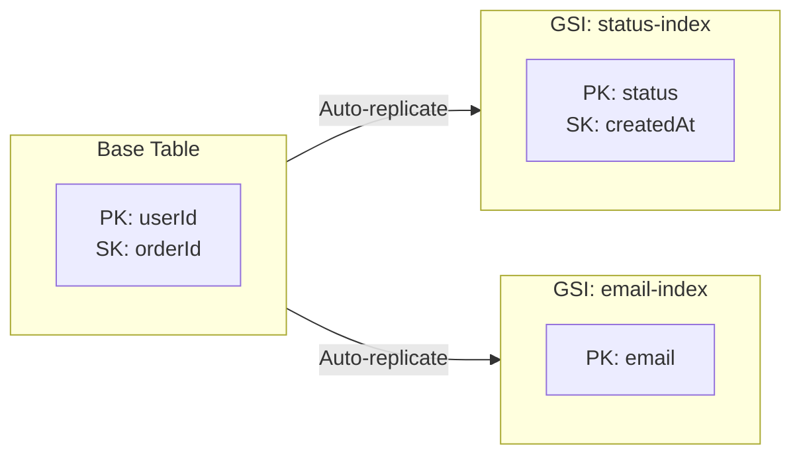
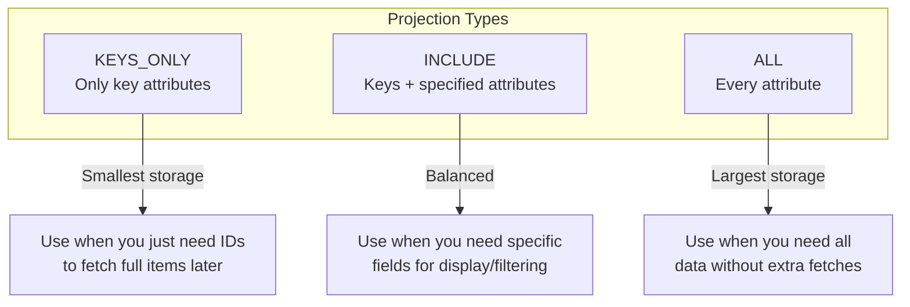
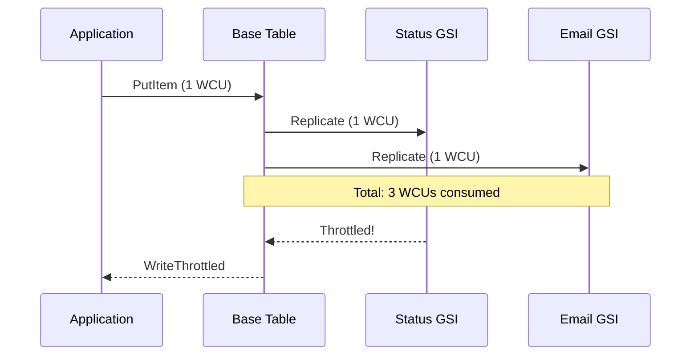
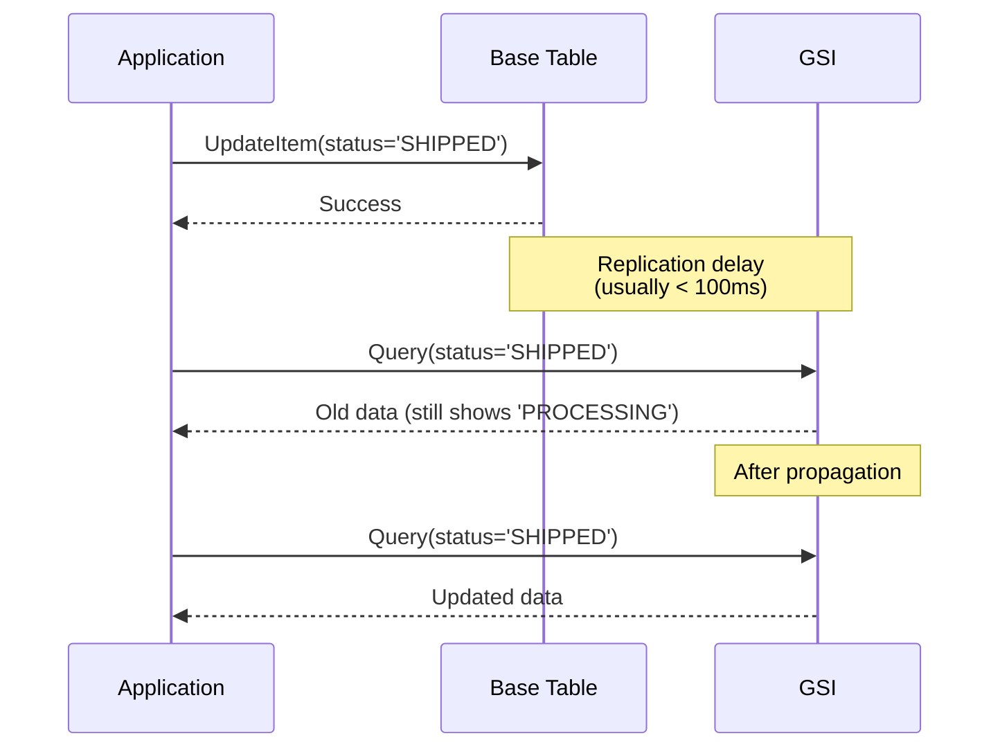

# How to Use DynamoDB Global Secondary Indexes

Author: [nawazdhandala](https://www.github.com/nawazdhandala)

Tags: AWS, DynamoDB, NoSQL, Database, Global Secondary Index, Cloud, Backend

Description: A practical guide to using DynamoDB Global Secondary Indexes (GSIs) to enable flexible query patterns beyond your table's primary key.

---

DynamoDB is fast and scales well, but the primary key design locks you into specific access patterns. When your application needs to query data differently - by status, email, or timestamp instead of the main key - you either scan the entire table or create a Global Secondary Index (GSI). Scanning is slow and expensive. GSIs give you a second (or third, or fourth) way to query your data efficiently.

## What is a Global Secondary Index?

A Global Secondary Index is a separate data structure that DynamoDB maintains alongside your base table. It has its own partition key and optional sort key, different from your table's primary key. When you write to the table, DynamoDB automatically replicates the data to the GSI based on your projected attributes.



The "Global" in GSI means the index spans all partitions of your table. This differs from Local Secondary Indexes (LSIs), which share the same partition key as your base table and must be created at table creation time.

## When to Use GSIs

Use GSIs when you need to:

- Query by a non-primary-key attribute (e.g., find orders by status)
- Support multiple access patterns without duplicating data manually
- Add new query capabilities to an existing table
- Enable queries that would otherwise require a full table scan

Avoid GSIs when:

- Your query frequency is very low (scanning might be cheaper)
- You need strongly consistent reads (GSIs only support eventually consistent)
- You are already at the 20-GSI limit per table

## Creating a GSI with AWS CLI

Let's work through a practical example. You have an orders table where the primary key is `userId` (partition key) and `orderId` (sort key). Now you need to find all orders with a specific status.

```bash
# Create a GSI on an existing table
aws dynamodb update-table \
    --table-name Orders \
    --attribute-definitions \
        AttributeName=status,AttributeType=S \
        AttributeName=createdAt,AttributeType=S \
    --global-secondary-index-updates \
        "[{
            \"Create\": {
                \"IndexName\": \"status-createdAt-index\",
                \"KeySchema\": [
                    {\"AttributeName\": \"status\", \"KeyType\": \"HASH\"},
                    {\"AttributeName\": \"createdAt\", \"KeyType\": \"RANGE\"}
                ],
                \"Projection\": {
                    \"ProjectionType\": \"ALL\"
                },
                \"ProvisionedThroughput\": {
                    \"ReadCapacityUnits\": 5,
                    \"WriteCapacityUnits\": 5
                }
            }
        }]"
```

This creates an index where you can query by `status` and optionally filter or sort by `createdAt`.

## Creating a GSI with CloudFormation

Here is the same index defined in CloudFormation:

```yaml
# CloudFormation template for DynamoDB table with GSI
AWSTemplateFormatVersion: '2010-09-09'
Description: Orders table with GSI for querying by status

Resources:
  OrdersTable:
    Type: AWS::DynamoDB::Table
    Properties:
      TableName: Orders
      BillingMode: PAY_PER_REQUEST

      # Define all attributes used in keys (table + GSIs)
      AttributeDefinitions:
        - AttributeName: userId
          AttributeType: S
        - AttributeName: orderId
          AttributeType: S
        - AttributeName: status
          AttributeType: S
        - AttributeName: createdAt
          AttributeType: S

      # Primary key for base table
      KeySchema:
        - AttributeName: userId
          KeyType: HASH
        - AttributeName: orderId
          KeyType: RANGE

      # GSI definitions
      GlobalSecondaryIndexes:
        - IndexName: status-createdAt-index
          KeySchema:
            - AttributeName: status
              KeyType: HASH
            - AttributeName: createdAt
              KeyType: RANGE
          # Project all attributes to the index
          Projection:
            ProjectionType: ALL
```

## Querying a GSI with Node.js

Once the GSI is active, you can query it using the AWS SDK:

```javascript
// query-by-status.js
// Query orders by status using GSI

const { DynamoDBClient } = require('@aws-sdk/client-dynamodb');
const {
    DynamoDBDocumentClient,
    QueryCommand
} = require('@aws-sdk/lib-dynamodb');

// Initialize the DynamoDB client
const client = new DynamoDBClient({ region: 'us-east-1' });
const docClient = DynamoDBDocumentClient.from(client);

async function getOrdersByStatus(status, startDate, endDate) {
    // Build the query parameters
    const params = {
        TableName: 'Orders',
        // Specify the GSI name
        IndexName: 'status-createdAt-index',
        // Partition key condition is required
        KeyConditionExpression: '#status = :status AND #createdAt BETWEEN :start AND :end',
        // Use expression attribute names for reserved words
        ExpressionAttributeNames: {
            '#status': 'status',
            '#createdAt': 'createdAt'
        },
        ExpressionAttributeValues: {
            ':status': status,
            ':start': startDate,
            ':end': endDate
        },
        // Optional: return newest orders first
        ScanIndexForward: false
    };

    try {
        const response = await docClient.send(new QueryCommand(params));
        console.log(`Found ${response.Count} orders with status: ${status}`);
        return response.Items;
    } catch (error) {
        console.error('Query failed:', error.message);
        throw error;
    }
}

// Example usage
async function main() {
    const pendingOrders = await getOrdersByStatus(
        'PENDING',
        '2026-01-01T00:00:00Z',
        '2026-01-31T23:59:59Z'
    );

    pendingOrders.forEach(order => {
        console.log(`Order ${order.orderId}: $${order.total}`);
    });
}

main();
```

## Querying a GSI with Python

Here is the equivalent in Python using boto3:

```python
# query_by_status.py
# Query orders by status using GSI

import boto3
from boto3.dynamodb.conditions import Key
from datetime import datetime, timedelta

def get_orders_by_status(status: str, start_date: str, end_date: str) -> list:
    """
    Query the GSI to find orders with a specific status within a date range.

    Args:
        status: Order status to filter by (e.g., 'PENDING', 'SHIPPED')
        start_date: ISO format date string for range start
        end_date: ISO format date string for range end

    Returns:
        List of order items matching the criteria
    """
    # Initialize the DynamoDB resource
    dynamodb = boto3.resource('dynamodb', region_name='us-east-1')
    table = dynamodb.Table('Orders')

    # Query the GSI
    response = table.query(
        IndexName='status-createdAt-index',
        KeyConditionExpression=(
            Key('status').eq(status) &
            Key('createdAt').between(start_date, end_date)
        ),
        # Return newest first
        ScanIndexForward=False
    )

    print(f"Found {response['Count']} orders with status: {status}")
    return response['Items']


def get_all_orders_by_status(status: str) -> list:
    """
    Query all orders with a given status, handling pagination.
    Large result sets require multiple queries.
    """
    dynamodb = boto3.resource('dynamodb', region_name='us-east-1')
    table = dynamodb.Table('Orders')

    items = []
    last_key = None

    while True:
        # Build query params
        query_params = {
            'IndexName': 'status-createdAt-index',
            'KeyConditionExpression': Key('status').eq(status)
        }

        # Add pagination token if we have one
        if last_key:
            query_params['ExclusiveStartKey'] = last_key

        response = table.query(**query_params)
        items.extend(response['Items'])

        # Check if there are more results
        last_key = response.get('LastEvaluatedKey')
        if not last_key:
            break

    return items


if __name__ == '__main__':
    # Find pending orders from the last 7 days
    end = datetime.utcnow().isoformat() + 'Z'
    start = (datetime.utcnow() - timedelta(days=7)).isoformat() + 'Z'

    orders = get_orders_by_status('PENDING', start, end)

    for order in orders:
        print(f"Order {order['orderId']}: ${order['total']}")
```

## Projection Types: What Data to Replicate

When you create a GSI, you choose which attributes to project (copy) into the index:



| Projection Type | Storage Cost | Query Flexibility | When to Use |
|-----------------|--------------|-------------------|-------------|
| `KEYS_ONLY` | Lowest | Must fetch item from base table | You just need IDs to batch-get later |
| `INCLUDE` | Medium | Access specified attributes | You need specific fields for listings |
| `ALL` | Highest | Full item access | You always need all attributes |

Here is how to specify projection in CloudFormation:

```yaml
# Example: Only project specific attributes
GlobalSecondaryIndexes:
  - IndexName: status-createdAt-index
    KeySchema:
      - AttributeName: status
        KeyType: HASH
      - AttributeName: createdAt
        KeyType: RANGE
    Projection:
      ProjectionType: INCLUDE
      # Only these attributes will be available in GSI queries
      NonKeyAttributes:
        - orderId
        - userId
        - total
        - customerName
```

## Sparse Indexes: Index Only What Matters

A GSI only contains items that have the index's key attributes. This creates "sparse indexes" that exclude items missing those attributes. You can use this intentionally to index a subset of your data.

```javascript
// sparse-index-example.js
// Only items with 'featuredAt' attribute appear in the featured-products GSI

const { PutCommand } = require('@aws-sdk/lib-dynamodb');

// This product WILL appear in the featured-products GSI
const featuredProduct = {
    productId: 'PROD-001',
    name: 'Premium Widget',
    price: 99.99,
    category: 'widgets',
    // This attribute makes it appear in the GSI
    featuredAt: '2026-01-15T10:00:00Z'
};

// This product will NOT appear in the featured-products GSI
const regularProduct = {
    productId: 'PROD-002',
    name: 'Basic Widget',
    price: 19.99,
    category: 'widgets'
    // No featuredAt attribute = excluded from GSI
};

async function saveProduct(product) {
    await docClient.send(new PutCommand({
        TableName: 'Products',
        Item: product
    }));
}
```

This pattern is useful for:

- Indexing only active/published items
- Creating a "hot" index of recent items
- Filtering out soft-deleted records

## GSI Write Costs and Throttling

Every write to your base table that affects a GSI attribute triggers a write to the GSI. This means:

- Writing one item can consume WCUs from the table AND each affected GSI
- GSIs have their own throughput (or share the table's on-demand capacity)
- A throttled GSI can back-pressure writes to your table



Best practices for GSI throughput:

```python
# monitor_gsi_throttling.py
# Check for GSI throttling in CloudWatch

import boto3
from datetime import datetime, timedelta

def check_gsi_throttling(table_name: str, index_name: str) -> dict:
    """
    Check CloudWatch metrics for GSI throttling events.
    High throttle counts indicate capacity issues.
    """
    cloudwatch = boto3.client('cloudwatch', region_name='us-east-1')

    end_time = datetime.utcnow()
    start_time = end_time - timedelta(hours=1)

    # Check write throttle events
    response = cloudwatch.get_metric_statistics(
        Namespace='AWS/DynamoDB',
        MetricName='WriteThrottleEvents',
        Dimensions=[
            {'Name': 'TableName', 'Value': table_name},
            {'Name': 'GlobalSecondaryIndexName', 'Value': index_name}
        ],
        StartTime=start_time,
        EndTime=end_time,
        Period=300,  # 5-minute intervals
        Statistics=['Sum']
    )

    total_throttles = sum(
        point['Sum'] for point in response['Datapoints']
    )

    if total_throttles > 0:
        print(f"Warning: {total_throttles} throttle events on {index_name}")

    return {
        'index': index_name,
        'throttle_events': total_throttles,
        'period': '1 hour'
    }
```

## Designing GSI Keys for Real Access Patterns

The most common mistake with GSIs is creating them for attributes without thinking about cardinality and access patterns.

**Bad GSI design:** Using `isActive` (true/false) as partition key

```
isActive = true  -> millions of items in one partition (hot partition)
isActive = false -> millions of items in one partition
```

**Better GSI design:** Composite key with higher cardinality

```
GSI Partition Key: status#region (e.g., "ACTIVE#us-east")
GSI Sort Key: createdAt

This spreads load across many partitions while still enabling useful queries.
```

Here is a practical example for an e-commerce order system:

```javascript
// well-designed-gsi.js
// Designing GSIs around actual query patterns

// Access Pattern 1: "Find orders by customer email"
// GSI: email-orderId-index
// PK: email, SK: orderId

// Access Pattern 2: "Find orders by status within a time range"
// GSI: status-createdAt-index
// PK: status, SK: createdAt

// Access Pattern 3: "Find orders by fulfillment center for shipping"
// GSI: fulfillmentCenter-shipBy-index
// PK: fulfillmentCenter, SK: shipByDate

// Item structure that supports all these access patterns
const order = {
    // Base table keys
    userId: 'USER-12345',          // Partition key
    orderId: 'ORD-2026-001',       // Sort key

    // GSI key attributes
    email: 'customer@example.com', // For email-orderId-index
    status: 'PROCESSING',          // For status-createdAt-index
    fulfillmentCenter: 'FC-NYC-1', // For fulfillmentCenter-shipBy-index

    // Sort key attributes for GSIs
    createdAt: '2026-01-26T14:30:00Z',
    shipByDate: '2026-01-28',

    // Other order data
    items: [
        { sku: 'WIDGET-001', qty: 2, price: 29.99 }
    ],
    total: 59.98,
    shippingAddress: {
        street: '123 Main St',
        city: 'New York',
        zip: '10001'
    }
};
```

## Handling GSI Eventual Consistency

GSIs are eventually consistent, meaning there is a small delay between writing to the base table and the data appearing in the GSI. For most applications, this delay is milliseconds, but you should design for it.



Strategies for handling eventual consistency:

```python
# eventual_consistency_patterns.py
# Patterns for handling GSI replication delay

import time
from typing import Optional

def update_and_verify_status(
    order_id: str,
    user_id: str,
    new_status: str,
    max_retries: int = 3
) -> bool:
    """
    Update order status and verify it appears in the GSI.
    Use this when you need to query the GSI immediately after update.
    """
    dynamodb = boto3.resource('dynamodb')
    table = dynamodb.Table('Orders')

    # Update the base table
    table.update_item(
        Key={'userId': user_id, 'orderId': order_id},
        UpdateExpression='SET #status = :status, updatedAt = :now',
        ExpressionAttributeNames={'#status': 'status'},
        ExpressionAttributeValues={
            ':status': new_status,
            ':now': datetime.utcnow().isoformat() + 'Z'
        }
    )

    # Verify the update propagated to GSI
    for attempt in range(max_retries):
        time.sleep(0.1 * (attempt + 1))  # Exponential backoff

        response = table.query(
            IndexName='status-createdAt-index',
            KeyConditionExpression=Key('status').eq(new_status),
            FilterExpression='orderId = :orderId',
            ExpressionAttributeValues={':orderId': order_id},
            Limit=1
        )

        if response['Count'] > 0:
            return True

    # If consistency is critical, fall back to base table query
    print(f"GSI not yet consistent for order {order_id}")
    return False


def read_your_writes_pattern(user_id: str, order_id: str) -> Optional[dict]:
    """
    When you need to read immediately after write, query the base table
    instead of the GSI to get strongly consistent data.
    """
    dynamodb = boto3.resource('dynamodb')
    table = dynamodb.Table('Orders')

    # Use GetItem on base table for strong consistency
    response = table.get_item(
        Key={'userId': user_id, 'orderId': order_id},
        ConsistentRead=True  # Strong consistency (not available on GSI)
    )

    return response.get('Item')
```

## Cost Optimization Tips

GSIs add storage and throughput costs. Here are ways to minimize them:

1. **Use KEYS_ONLY projection when possible**: If you just need to find IDs and then batch-get items, do not replicate all attributes.

2. **Delete unused GSIs**: GSIs cost money even when not queried.

3. **Use sparse indexes**: Only index items that need to be queried through that pattern.

4. **Monitor consumed capacity**: Set up CloudWatch alarms for unexpected GSI usage.

```yaml
# cloudformation-cost-optimized-gsi.yaml
# Example of a cost-optimized GSI setup

Resources:
  OrdersTable:
    Type: AWS::DynamoDB::Table
    Properties:
      TableName: Orders
      BillingMode: PAY_PER_REQUEST  # Scale to zero when not in use

      AttributeDefinitions:
        - AttributeName: userId
          AttributeType: S
        - AttributeName: orderId
          AttributeType: S
        - AttributeName: status
          AttributeType: S
        - AttributeName: createdAt
          AttributeType: S

      KeySchema:
        - AttributeName: userId
          KeyType: HASH
        - AttributeName: orderId
          KeyType: RANGE

      GlobalSecondaryIndexes:
        - IndexName: status-createdAt-index
          KeySchema:
            - AttributeName: status
              KeyType: HASH
            - AttributeName: createdAt
              KeyType: RANGE
          Projection:
            # Only project what you need for the query result
            ProjectionType: INCLUDE
            NonKeyAttributes:
              - userId
              - total
              - customerName

  # CloudWatch alarm for unexpected GSI costs
  GSIThrottleAlarm:
    Type: AWS::CloudWatch::Alarm
    Properties:
      AlarmName: Orders-GSI-Throttle-Alarm
      MetricName: WriteThrottleEvents
      Namespace: AWS/DynamoDB
      Dimensions:
        - Name: TableName
          Value: !Ref OrdersTable
        - Name: GlobalSecondaryIndexName
          Value: status-createdAt-index
      Statistic: Sum
      Period: 300
      EvaluationPeriods: 1
      Threshold: 10
      ComparisonOperator: GreaterThanThreshold
```

## Common Mistakes to Avoid

| Mistake | Problem | Solution |
|---------|---------|----------|
| Low-cardinality partition key | Hot partitions, throttling | Use composite keys or add suffix |
| Projecting ALL when not needed | Higher storage costs | Use KEYS_ONLY or INCLUDE |
| Not handling pagination | Missing data in large result sets | Always check LastEvaluatedKey |
| Expecting strong consistency | Stale reads after writes | Query base table for critical reads |
| Too many GSIs | Write amplification, costs | Consolidate access patterns |

## Summary

Global Secondary Indexes let you query DynamoDB tables by attributes other than the primary key. They are essential for applications with multiple access patterns but come with tradeoffs in cost, consistency, and operational complexity.

Key takeaways:

- GSIs maintain a separate copy of your data with different key attributes
- Choose projection type based on your query needs and cost tolerance
- Design partition keys with high cardinality to avoid hot partitions
- Handle eventual consistency in your application logic
- Monitor GSI throttling and adjust capacity accordingly

Start with your access patterns, design the GSI keys around those patterns, and project only the attributes you need. Your future self debugging a throttled GSI at 3 AM will thank you.
