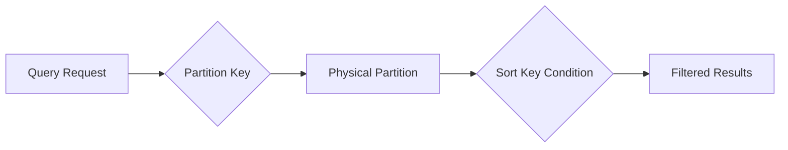
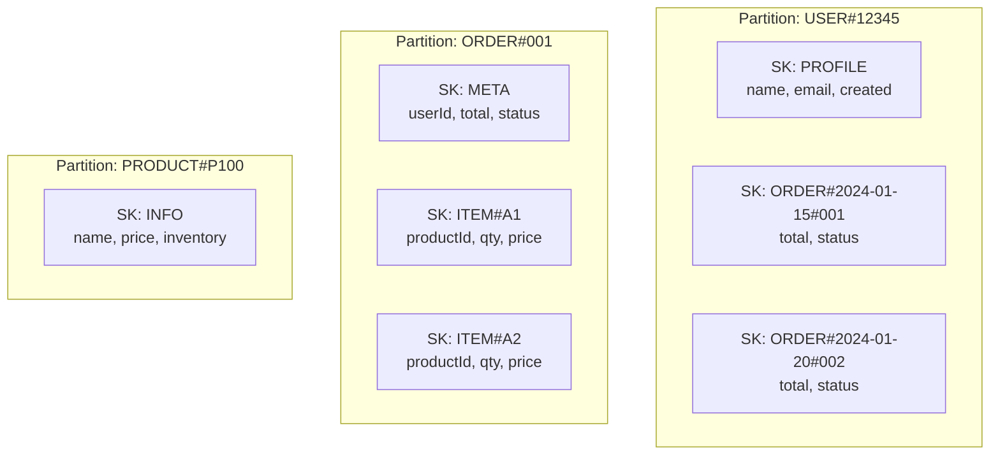
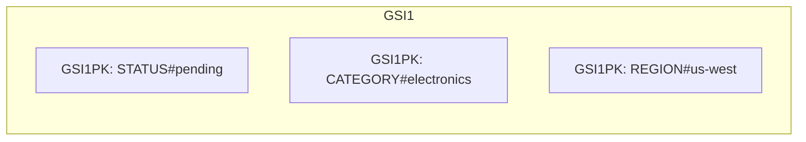
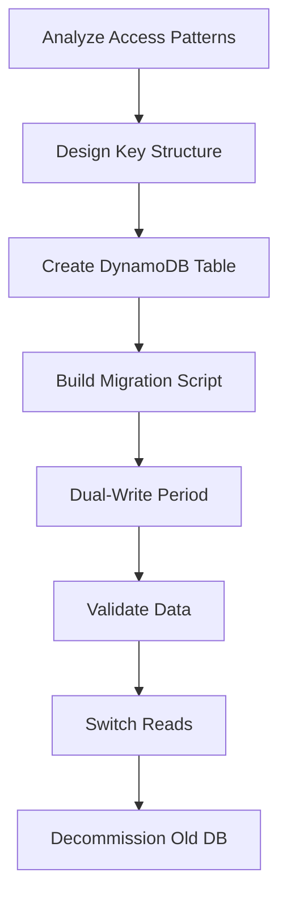

# How to Implement DynamoDB Single-Table Design

Author: [nawazdhandala](https://www.github.com/nawazdhandala)

Tags: DynamoDB, AWS, NoSQL, Database Design, Single-Table Design, Data Modeling, Serverless

Description: A practical guide to implementing single-table design in DynamoDB, covering access patterns, key design, GSIs, and real-world examples for scalable NoSQL data modeling.

---

Single-table design is a data modeling approach in DynamoDB where you store multiple entity types in one table. Instead of creating separate tables for users, orders, and products, you store them all together with carefully designed partition keys and sort keys.

This approach might seem counterintuitive if you come from a relational database background, but it unlocks significant performance and cost benefits in DynamoDB.

---

## Table of Contents

1. Why Single-Table Design?
2. Understanding DynamoDB Fundamentals
3. Access Pattern-First Design
4. Key Design Strategies
5. Implementing a Real-World Example
6. Global Secondary Indexes (GSIs)
7. Common Patterns and Techniques
8. Query Examples with Code
9. Migration Strategies
10. When Not to Use Single-Table Design
11. Best Practices and Pitfalls

---

## 1. Why Single-Table Design?

DynamoDB charges you per table for on-demand capacity and has limits on the number of tables per account. More importantly, DynamoDB does not support joins. If your application needs data from multiple entities in a single request, you have two options:

1. Make multiple round trips to different tables (slow and expensive)
2. Store related data together so you can fetch it in one query (fast and cheap)

Single-table design enables the second option.

### Benefits

| Benefit | Explanation |
|---------|-------------|
| Fewer round trips | Fetch related entities in a single query |
| Lower latency | One network call instead of many |
| Reduced costs | Fewer read capacity units consumed |
| Simpler infrastructure | One table to manage, backup, and monitor |
| Atomic transactions | TransactWriteItems works within a single table |

### The Mental Shift

In relational databases, you normalize data and use joins at query time. In DynamoDB single-table design, you denormalize data and pre-join at write time. Your table structure is driven by how you need to read data, not by the shape of your entities.

---

## 2. Understanding DynamoDB Fundamentals

Before diving into single-table design, you need to understand how DynamoDB organizes data.

### Partition Key (PK)

The partition key determines which physical partition stores your item. Items with the same partition key are stored together. You can retrieve all items with a given partition key in a single query.

### Sort Key (SK)

The sort key orders items within a partition. Combined with the partition key, it forms the primary key. You can use comparison operators (begins_with, between, >, <) on the sort key in queries.

### How Queries Work



A query always requires a partition key. The sort key condition is optional but lets you narrow down results efficiently. DynamoDB can only query within a single partition at a time on the base table.

---

## 3. Access Pattern-First Design

The most critical step in single-table design is identifying your access patterns before you design your keys. Write down every query your application needs to perform.

### Example: E-commerce Application

Let's design a table for an e-commerce application. First, list the access patterns:

| Access Pattern | Description |
|----------------|-------------|
| Get user by ID | Fetch a single user's profile |
| Get user's orders | List all orders for a user |
| Get order by ID | Fetch a single order with its items |
| Get order items | List all items in an order |
| Get product by ID | Fetch product details |
| Get orders by status | Find orders that are pending, shipped, etc. |
| Get recent orders | List orders from the last 7 days |

Now design your keys to support these patterns.

---

## 4. Key Design Strategies

### Entity Prefixes

Use prefixes to distinguish entity types:

```
PK: USER#12345
SK: PROFILE

PK: USER#12345
SK: ORDER#2024-01-15#98765

PK: ORDER#98765
SK: ITEM#001
```

### Composite Sort Keys

Pack multiple attributes into the sort key for flexible querying:

```
SK: ORDER#2024-01-15#98765
       ↑         ↑      ↑
    entity    date   order_id
```

This lets you query:
- All orders for a user (begins_with "ORDER#")
- Orders after a date (> "ORDER#2024-01-01")
- A specific order (= "ORDER#2024-01-15#98765")

### Key Structure Diagram

```mermaid
erDiagram
    TABLE {
        string PK "Partition Key"
        string SK "Sort Key"
        string GSI1PK "GSI1 Partition Key"
        string GSI1SK "GSI1 Sort Key"
        map attributes "Entity Data"
    }
```

---

## 5. Implementing a Real-World Example

Let's implement the e-commerce data model.

### Table Design

| Entity | PK | SK | GSI1PK | GSI1SK |
|--------|----|----|--------|--------|
| User | USER#\<userId\> | PROFILE | | |
| Order | USER#\<userId\> | ORDER#\<date\>#\<orderId\> | ORDER#\<orderId\> | STATUS#\<status\> |
| Order (lookup) | ORDER#\<orderId\> | META | | |
| Order Item | ORDER#\<orderId\> | ITEM#\<itemId\> | | |
| Product | PRODUCT#\<productId\> | INFO | | |

### Data Model Visualization



---

## 6. Global Secondary Indexes (GSIs)

GSIs let you query your data with different key structures. In single-table design, you typically use 1-3 GSIs to cover access patterns that the base table cannot support.

### GSI for Order Status Queries

To find orders by status across all users, create a GSI:

| GSI1PK | GSI1SK | Use Case |
|--------|--------|----------|
| STATUS#pending | ORDER#\<date\>#\<orderId\> | Find all pending orders |
| STATUS#shipped | ORDER#\<date\>#\<orderId\> | Find all shipped orders |

### Sparse Indexes

Only items with the GSI key attributes appear in the index. You can use this to create filtered views:

```javascript
// Only active users appear in this GSI
{
  PK: "USER#12345",
  SK: "PROFILE",
  GSI2PK: "ACTIVE_USER",  // Only set when user is active
  GSI2SK: "USER#12345"
}
```

### GSI Overloading

Reuse GSI key attributes for multiple entity types:



---

## 7. Common Patterns and Techniques

### Pattern 1: One-to-Many Relationships

Store the "many" side with a sort key that includes the parent ID:

```javascript
// Parent: User
{
  PK: "USER#123",
  SK: "PROFILE",
  name: "Alice"
}

// Children: User's addresses
{
  PK: "USER#123",
  SK: "ADDRESS#home",
  street: "123 Main St"
}

{
  PK: "USER#123",
  SK: "ADDRESS#work",
  street: "456 Office Blvd"
}
```

Query all addresses: `PK = "USER#123" AND begins_with(SK, "ADDRESS#")`

### Pattern 2: Many-to-Many Relationships

Use adjacency lists with inverted indexes:

```javascript
// User belongs to Organization
{
  PK: "USER#123",
  SK: "ORG#456",
  role: "admin",
  GSI1PK: "ORG#456",
  GSI1SK: "USER#123"
}
```

- Query user's organizations: `PK = "USER#123" AND begins_with(SK, "ORG#")`
- Query organization's users: GSI1 with `GSI1PK = "ORG#456" AND begins_with(GSI1SK, "USER#")`

### Pattern 3: Hierarchical Data

Encode the hierarchy in the sort key:

```javascript
// File system structure
{
  PK: "FILESYSTEM#user123",
  SK: "FOLDER#documents#projects#2024"
}
```

Query all items in documents folder: `begins_with(SK, "FOLDER#documents#")`

### Pattern 4: Time-Series Data

Use time-based partition keys to avoid hot partitions:

```javascript
// Metrics partitioned by day
{
  PK: "METRICS#2024-01-15",
  SK: "14:30:00#server1",
  cpu: 45.2
}
```

---

## 8. Query Examples with Code

### Setting Up the DynamoDB Client

```typescript
// dynamodb-client.ts
import { DynamoDBClient } from "@aws-sdk/client-dynamodb";
import {
  DynamoDBDocumentClient,
  PutCommand,
  GetCommand,
  QueryCommand,
  TransactWriteCommand
} from "@aws-sdk/lib-dynamodb";

// Create the low-level DynamoDB client
const client = new DynamoDBClient({
  region: process.env.AWS_REGION || "us-east-1",
});

// Create the document client for easier JSON handling
export const docClient = DynamoDBDocumentClient.from(client, {
  marshallOptions: {
    // Remove undefined values from objects before sending
    removeUndefinedValues: true,
  },
});

export const TABLE_NAME = process.env.DYNAMODB_TABLE || "ECommerceTable";
```

### Creating a User

```typescript
// user-repository.ts
import { PutCommand } from "@aws-sdk/lib-dynamodb";
import { docClient, TABLE_NAME } from "./dynamodb-client";

interface User {
  userId: string;
  email: string;
  name: string;
  createdAt: string;
}

export async function createUser(user: User): Promise<void> {
  // Build the item with proper key structure
  const item = {
    // Partition key identifies this as a user partition
    PK: `USER#${user.userId}`,
    // Sort key identifies this specific record type within the partition
    SK: "PROFILE",
    // Store the entity type for easier filtering and debugging
    entityType: "User",
    // Spread the user data
    ...user,
  };

  await docClient.send(
    new PutCommand({
      TableName: TABLE_NAME,
      Item: item,
      // Prevent overwriting existing users
      ConditionExpression: "attribute_not_exists(PK)",
    })
  );
}
```

### Creating an Order with Items (Transaction)

```typescript
// order-repository.ts
import { TransactWriteCommand } from "@aws-sdk/lib-dynamodb";
import { docClient, TABLE_NAME } from "./dynamodb-client";

interface OrderItem {
  itemId: string;
  productId: string;
  quantity: number;
  price: number;
}

interface Order {
  orderId: string;
  userId: string;
  items: OrderItem[];
  total: number;
  status: string;
}

export async function createOrder(order: Order): Promise<void> {
  const timestamp = new Date().toISOString().split("T")[0]; // YYYY-MM-DD

  // Build all the items we need to write atomically
  const transactItems = [
    // 1. Order record in user's partition (for "get user's orders" query)
    {
      Put: {
        TableName: TABLE_NAME,
        Item: {
          PK: `USER#${order.userId}`,
          SK: `ORDER#${timestamp}#${order.orderId}`,
          entityType: "OrderSummary",
          orderId: order.orderId,
          total: order.total,
          status: order.status,
          createdAt: new Date().toISOString(),
        },
      },
    },
    // 2. Order metadata in order's partition (for "get order by ID" query)
    {
      Put: {
        TableName: TABLE_NAME,
        Item: {
          PK: `ORDER#${order.orderId}`,
          SK: "META",
          entityType: "Order",
          userId: order.userId,
          total: order.total,
          status: order.status,
          // GSI for status-based queries
          GSI1PK: `STATUS#${order.status}`,
          GSI1SK: `ORDER#${timestamp}#${order.orderId}`,
          createdAt: new Date().toISOString(),
        },
      },
    },
    // 3. Order items in order's partition
    ...order.items.map((item) => ({
      Put: {
        TableName: TABLE_NAME,
        Item: {
          PK: `ORDER#${order.orderId}`,
          SK: `ITEM#${item.itemId}`,
          entityType: "OrderItem",
          productId: item.productId,
          quantity: item.quantity,
          price: item.price,
        },
      },
    })),
  ];

  // Execute all writes atomically
  // If any write fails, all writes are rolled back
  await docClient.send(
    new TransactWriteCommand({
      TransactItems: transactItems,
    })
  );
}
```

### Fetching a User's Orders

```typescript
// order-repository.ts (continued)
import { QueryCommand } from "@aws-sdk/lib-dynamodb";

interface OrderSummary {
  orderId: string;
  total: number;
  status: string;
  createdAt: string;
}

export async function getUserOrders(userId: string): Promise<OrderSummary[]> {
  const response = await docClient.send(
    new QueryCommand({
      TableName: TABLE_NAME,
      // Query the user's partition
      KeyConditionExpression: "PK = :pk AND begins_with(SK, :skPrefix)",
      ExpressionAttributeValues: {
        ":pk": `USER#${userId}`,
        ":skPrefix": "ORDER#",
      },
      // Sort by most recent first (sort key is ORDER#date#id)
      ScanIndexForward: false,
    })
  );

  // Transform DynamoDB items to application objects
  return (response.Items || []).map((item) => ({
    orderId: item.orderId,
    total: item.total,
    status: item.status,
    createdAt: item.createdAt,
  }));
}
```

### Fetching an Order with All Items

```typescript
// order-repository.ts (continued)

interface OrderWithItems {
  orderId: string;
  userId: string;
  total: number;
  status: string;
  createdAt: string;
  items: OrderItem[];
}

export async function getOrderWithItems(orderId: string): Promise<OrderWithItems | null> {
  // Query the order partition to get metadata and all items in one call
  const response = await docClient.send(
    new QueryCommand({
      TableName: TABLE_NAME,
      KeyConditionExpression: "PK = :pk",
      ExpressionAttributeValues: {
        ":pk": `ORDER#${orderId}`,
      },
    })
  );

  if (!response.Items || response.Items.length === 0) {
    return null;
  }

  // Separate the metadata from the items
  const metaItem = response.Items.find((item) => item.SK === "META");
  const itemRecords = response.Items.filter((item) =>
    item.SK.startsWith("ITEM#")
  );

  if (!metaItem) {
    return null;
  }

  return {
    orderId: metaItem.orderId || orderId,
    userId: metaItem.userId,
    total: metaItem.total,
    status: metaItem.status,
    createdAt: metaItem.createdAt,
    items: itemRecords.map((item) => ({
      itemId: item.SK.replace("ITEM#", ""),
      productId: item.productId,
      quantity: item.quantity,
      price: item.price,
    })),
  };
}
```

### Querying Orders by Status (Using GSI)

```typescript
// order-repository.ts (continued)

export async function getOrdersByStatus(status: string): Promise<OrderSummary[]> {
  const response = await docClient.send(
    new QueryCommand({
      TableName: TABLE_NAME,
      IndexName: "GSI1", // Use the Global Secondary Index
      KeyConditionExpression: "GSI1PK = :gsi1pk",
      ExpressionAttributeValues: {
        ":gsi1pk": `STATUS#${status}`,
      },
      // Most recent orders first
      ScanIndexForward: false,
    })
  );

  return (response.Items || []).map((item) => ({
    orderId: item.GSI1SK.split("#").pop(), // Extract orderId from GSI1SK
    total: item.total,
    status: item.status,
    createdAt: item.createdAt,
  }));
}
```

### Updating Order Status

```typescript
// order-repository.ts (continued)
import { UpdateCommand } from "@aws-sdk/lib-dynamodb";

export async function updateOrderStatus(
  orderId: string,
  newStatus: string
): Promise<void> {
  const timestamp = new Date().toISOString().split("T")[0];

  // Update the order metadata with new status
  // This also updates the GSI1 key for status-based queries
  await docClient.send(
    new UpdateCommand({
      TableName: TABLE_NAME,
      Key: {
        PK: `ORDER#${orderId}`,
        SK: "META",
      },
      UpdateExpression:
        "SET #status = :newStatus, GSI1PK = :gsi1pk, updatedAt = :updatedAt",
      ExpressionAttributeNames: {
        "#status": "status", // status is a reserved word
      },
      ExpressionAttributeValues: {
        ":newStatus": newStatus,
        ":gsi1pk": `STATUS#${newStatus}`,
        ":updatedAt": new Date().toISOString(),
      },
      // Ensure the order exists
      ConditionExpression: "attribute_exists(PK)",
    })
  );
}
```

---

## 9. Migration Strategies

### From Relational to Single-Table



### Migration Script Example

```typescript
// migration.ts
import { BatchWriteCommand } from "@aws-sdk/lib-dynamodb";
import { docClient, TABLE_NAME } from "./dynamodb-client";

interface LegacyUser {
  id: number;
  email: string;
  name: string;
  created_at: Date;
}

interface LegacyOrder {
  id: number;
  user_id: number;
  total: number;
  status: string;
  created_at: Date;
}

export async function migrateUsers(users: LegacyUser[]): Promise<void> {
  // DynamoDB BatchWrite accepts up to 25 items per request
  const BATCH_SIZE = 25;

  for (let i = 0; i < users.length; i += BATCH_SIZE) {
    const batch = users.slice(i, i + BATCH_SIZE);

    const putRequests = batch.map((user) => ({
      PutRequest: {
        Item: {
          PK: `USER#${user.id}`,
          SK: "PROFILE",
          entityType: "User",
          userId: String(user.id),
          email: user.email,
          name: user.name,
          createdAt: user.created_at.toISOString(),
        },
      },
    }));

    await docClient.send(
      new BatchWriteCommand({
        RequestItems: {
          [TABLE_NAME]: putRequests,
        },
      })
    );

    // Add delay to avoid throttling
    await new Promise((resolve) => setTimeout(resolve, 100));
  }
}

export async function migrateOrders(orders: LegacyOrder[]): Promise<void> {
  const BATCH_SIZE = 25;

  for (let i = 0; i < orders.length; i += BATCH_SIZE) {
    const batch = orders.slice(i, i + BATCH_SIZE);

    const putRequests = batch.flatMap((order) => {
      const dateStr = order.created_at.toISOString().split("T")[0];

      return [
        // Order in user partition
        {
          PutRequest: {
            Item: {
              PK: `USER#${order.user_id}`,
              SK: `ORDER#${dateStr}#${order.id}`,
              entityType: "OrderSummary",
              orderId: String(order.id),
              total: order.total,
              status: order.status,
              createdAt: order.created_at.toISOString(),
            },
          },
        },
        // Order metadata
        {
          PutRequest: {
            Item: {
              PK: `ORDER#${order.id}`,
              SK: "META",
              entityType: "Order",
              userId: String(order.user_id),
              total: order.total,
              status: order.status,
              GSI1PK: `STATUS#${order.status}`,
              GSI1SK: `ORDER#${dateStr}#${order.id}`,
              createdAt: order.created_at.toISOString(),
            },
          },
        },
      ];
    });

    await docClient.send(
      new BatchWriteCommand({
        RequestItems: {
          [TABLE_NAME]: putRequests,
        },
      })
    );

    await new Promise((resolve) => setTimeout(resolve, 100));
  }
}
```

---

## 10. When Not to Use Single-Table Design

Single-table design is not always the right choice. Consider alternatives when:

### Ad-Hoc Queries Are Common

If your application needs flexible querying with unknown patterns, consider:
- Amazon OpenSearch Service for full-text search
- Amazon Athena for analytics queries
- A relational database for complex joins

### Multiple Teams Own Different Entities

If the User team and Order team deploy independently, separate tables provide:
- Independent scaling
- Isolated failure domains
- Clearer ownership

### Data Size Varies Dramatically

If users have vastly different amounts of data (one user has 10 orders, another has 10 million), consider sharding strategies or separate tables.

### Simple CRUD Applications

If your application is straightforward CRUD with no complex access patterns, separate tables are simpler to understand and maintain.

---

## 11. Best Practices and Pitfalls

### Best Practices

**Document your access patterns**

Keep a living document that maps every query to its key structure:

```markdown
| Access Pattern | Key Condition | Index |
|----------------|---------------|-------|
| Get user profile | PK=USER#id, SK=PROFILE | Base |
| List user orders | PK=USER#id, SK begins_with ORDER# | Base |
| Get order by status | GSI1PK=STATUS#status | GSI1 |
```

**Use consistent key prefixes**

Establish naming conventions and stick to them:

```
USER#     - User entities
ORDER#    - Order entities
PRODUCT#  - Product entities
STATUS#   - Status-based GSI keys
```

**Include entity type attribute**

Always store an entityType field for debugging and filtering:

```javascript
{
  PK: "USER#123",
  SK: "PROFILE",
  entityType: "User",  // Makes Scan filtering and debugging easier
  // ...
}
```

**Plan for GSI capacity**

GSIs have separate throughput. If a GSI receives heavy traffic, provision it accordingly or use on-demand capacity.

### Common Pitfalls

**Hot partitions**

Avoid partition keys with uneven distribution:

```javascript
// BAD: All orders go to the same partition
{ PK: "ORDERS", SK: "ORDER#123" }

// GOOD: Orders distributed by user
{ PK: "USER#456", SK: "ORDER#123" }
```

**Unbounded item collections**

DynamoDB limits partition size to 10GB. If a single partition key can accumulate unlimited items, add time-based bucketing:

```javascript
// BAD: Unbounded metrics for a server
{ PK: "METRICS#server1", SK: "2024-01-15T14:30:00" }

// GOOD: Daily buckets prevent unbounded growth
{ PK: "METRICS#server1#2024-01-15", SK: "14:30:00" }
```

**Over-indexing**

Each GSI duplicates data and consumes write capacity. Start with fewer GSIs and add more only when access patterns require them.

**Forgetting to update all copies**

When you store the same data in multiple places (user partition and order partition), you must update all copies. Use transactions to ensure consistency.

---

## Summary

Single-table design in DynamoDB is a powerful pattern that optimizes for read performance by co-locating related data. The key steps are:

1. **List all access patterns first** - You cannot retrofit access patterns easily
2. **Design keys to support queries** - Partition key for grouping, sort key for ordering and filtering
3. **Use GSIs sparingly** - Only for access patterns the base table cannot support
4. **Write atomically** - Use transactions when updating multiple items
5. **Document everything** - Future maintainers need to understand the design

The upfront design effort pays off with single-digit millisecond latency at any scale, predictable costs, and operational simplicity.

---

## Further Reading

- [DynamoDB Best Practices](https://docs.aws.amazon.com/amazondynamodb/latest/developerguide/best-practices.html)
- [The DynamoDB Book by Alex DeBrie](https://www.dynamodbbook.com/)
- [AWS re:Invent talks on DynamoDB data modeling](https://www.youtube.com/results?search_query=aws+reinvent+dynamodb+data+modeling)

---

*Building serverless applications? Monitoring DynamoDB performance is critical. [OneUptime](https://oneuptime.com) provides real-time observability for your AWS infrastructure with metrics, traces, and alerts to catch issues before your users do.*
