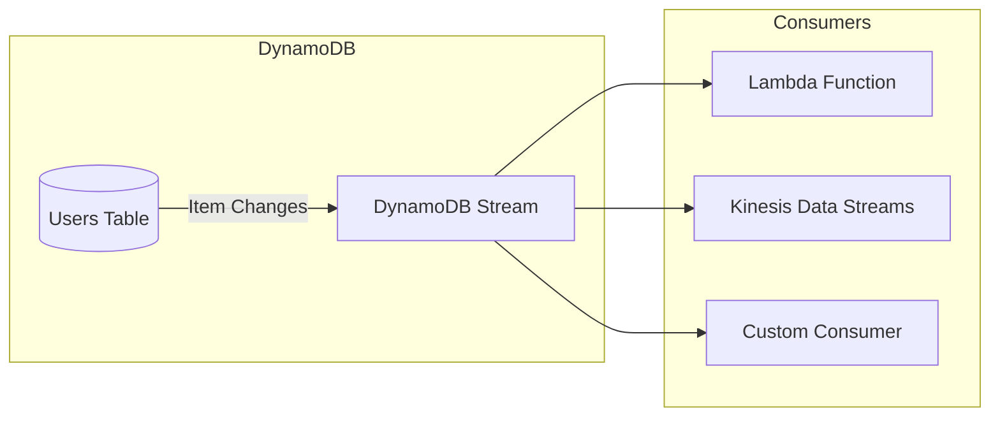
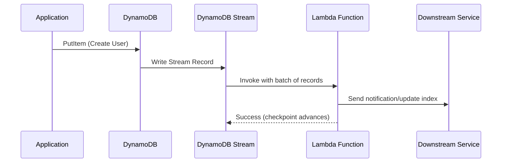
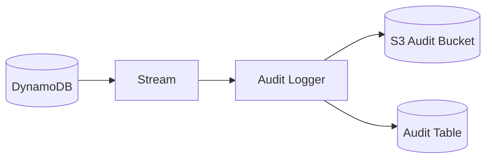
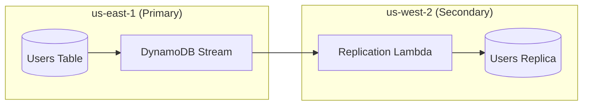

# How to Use DynamoDB Streams

Author: [nawazdhandala](https://www.github.com/nawazdhandala)

Tags: AWS, DynamoDB, DynamoDB Streams, Event-Driven Architecture, Serverless, Lambda

Description: Learn how to capture and process real-time data changes in DynamoDB using Streams for event-driven architectures, data replication, and audit logging.

---

DynamoDB Streams captures a time-ordered sequence of item-level changes in any DynamoDB table. Every insert, update, or delete generates a stream record that you can process with Lambda, Kinesis, or custom consumers.

Use cases include:

- **Event-driven microservices**: React to data changes without polling
- **Cross-region replication**: Sync tables across AWS regions
- **Audit trails**: Keep immutable logs of every modification
- **Materialized views**: Maintain denormalized data or search indexes

## How DynamoDB Streams Work

When you enable streams on a table, DynamoDB writes every change to a dedicated stream. Each stream record contains the item key and, depending on your configuration, the old and/or new item values.



Stream records persist for 24 hours. If your consumer falls behind or fails, you have a window to catch up before records expire.

## Enable Streams on a Table

You can enable streams when creating a table or on an existing one. The `StreamViewType` determines what data each record contains:

| StreamViewType | Contents |
|----------------|----------|
| KEYS_ONLY | Only the key attributes of modified items |
| NEW_IMAGE | The entire item as it appears after the change |
| OLD_IMAGE | The entire item as it appeared before the change |
| NEW_AND_OLD_IMAGES | Both old and new item images |

### Using AWS CLI

```bash
# Enable streams on an existing table
# NEW_AND_OLD_IMAGES lets you see what changed by comparing old vs new
aws dynamodb update-table \
    --table-name Users \
    --stream-specification StreamEnabled=true,StreamViewType=NEW_AND_OLD_IMAGES

# Check the stream ARN (you'll need this for Lambda triggers)
aws dynamodb describe-table \
    --table-name Users \
    --query "Table.LatestStreamArn" \
    --output text
```

### Using CloudFormation/SAM

```yaml
# template.yaml
AWSTemplateFormatVersion: '2010-09-09'
Transform: AWS::Serverless-2016-10-31

Resources:
  UsersTable:
    Type: AWS::DynamoDB::Table
    Properties:
      TableName: Users
      BillingMode: PAY_PER_REQUEST

      # Define the primary key
      AttributeDefinitions:
        - AttributeName: userId
          AttributeType: S
      KeySchema:
        - AttributeName: userId
          KeyType: HASH

      # Enable streams with full before/after images
      StreamSpecification:
        StreamViewType: NEW_AND_OLD_IMAGES

Outputs:
  # Export the stream ARN for use in other stacks
  UsersTableStreamArn:
    Value: !GetAtt UsersTable.StreamArn
    Export:
      Name: UsersTableStreamArn
```

### Using Terraform

```hcl
# dynamodb.tf
resource "aws_dynamodb_table" "users" {
  name         = "Users"
  billing_mode = "PAY_PER_REQUEST"
  hash_key     = "userId"

  attribute {
    name = "userId"
    type = "S"
  }

  # Enable streams - captures both old and new item values
  stream_enabled   = true
  stream_view_type = "NEW_AND_OLD_IMAGES"

  tags = {
    Environment = "production"
    Service     = "user-service"
  }
}

# Output the stream ARN for Lambda event source mapping
output "users_table_stream_arn" {
  value       = aws_dynamodb_table.users.stream_arn
  description = "ARN of the DynamoDB stream for the Users table"
}
```

## Process Streams with Lambda

Lambda is the most common way to consume DynamoDB Streams. AWS manages the polling, batching, and checkpointing for you.



### Lambda Function Code (Node.js)

```javascript
// handler.js
// Processes DynamoDB stream events and routes them based on change type

/**
 * Main handler for DynamoDB Stream events
 * Each invocation receives a batch of stream records
 */
export const handler = async (event) => {
    console.log(`Processing ${event.Records.length} records`);

    // Process each record in the batch
    // DynamoDB streams guarantee ordering per partition key
    for (const record of event.Records) {
        try {
            await processRecord(record);
        } catch (error) {
            // Log the error but continue processing other records
            // Consider using a dead-letter queue for failed records
            console.error(`Failed to process record: ${error.message}`, {
                eventId: record.eventID,
                eventName: record.eventName
            });
        }
    }

    // Return success - Lambda will checkpoint after this
    return { statusCode: 200, body: 'Processed' };
};

/**
 * Process a single stream record based on the event type
 * eventName indicates what type of change occurred
 */
async function processRecord(record) {
    const { eventName, dynamodb } = record;

    // Unmarshal DynamoDB's attribute format to plain JavaScript objects
    // dynamodb.NewImage contains the item after the change
    // dynamodb.OldImage contains the item before the change
    const newItem = dynamodb.NewImage
        ? unmarshall(dynamodb.NewImage)
        : null;
    const oldItem = dynamodb.OldImage
        ? unmarshall(dynamodb.OldImage)
        : null;

    switch (eventName) {
        case 'INSERT':
            // New item created - trigger welcome email, create search index entry, etc.
            await handleInsert(newItem);
            break;

        case 'MODIFY':
            // Item updated - compare old and new to determine what changed
            await handleModify(oldItem, newItem);
            break;

        case 'REMOVE':
            // Item deleted - clean up related resources
            await handleRemove(oldItem);
            break;

        default:
            console.warn(`Unknown event type: ${eventName}`);
    }
}

/**
 * Handle new item creation
 */
async function handleInsert(item) {
    console.log('New user created:', item.userId);

    // Example: Send welcome email
    // await sendWelcomeEmail(item.email);

    // Example: Index in Elasticsearch
    // await indexUser(item);

    // Example: Publish event to SNS for other services
    // await publishEvent('UserCreated', item);
}

/**
 * Handle item updates - compare old and new to find changes
 */
async function handleModify(oldItem, newItem) {
    console.log('User modified:', newItem.userId);

    // Detect specific field changes
    if (oldItem.email !== newItem.email) {
        console.log(`Email changed from ${oldItem.email} to ${newItem.email}`);
        // Trigger email verification flow
    }

    if (oldItem.subscriptionTier !== newItem.subscriptionTier) {
        console.log(`Subscription upgraded: ${oldItem.subscriptionTier} -> ${newItem.subscriptionTier}`);
        // Provision new features, send confirmation
    }
}

/**
 * Handle item deletion
 */
async function handleRemove(item) {
    console.log('User deleted:', item.userId);

    // Clean up related data in other tables or services
    // await deleteUserData(item.userId);

    // Remove from search index
    // await removeFromIndex(item.userId);
}

/**
 * Convert DynamoDB attribute format to plain JavaScript object
 * DynamoDB stores values like { S: "string" } or { N: "123" }
 */
function unmarshall(dynamoItem) {
    const result = {};

    for (const [key, value] of Object.entries(dynamoItem)) {
        result[key] = unmarshallValue(value);
    }

    return result;
}

function unmarshallValue(value) {
    // String
    if (value.S !== undefined) return value.S;
    // Number (DynamoDB stores numbers as strings)
    if (value.N !== undefined) return parseFloat(value.N);
    // Boolean
    if (value.BOOL !== undefined) return value.BOOL;
    // Null
    if (value.NULL !== undefined) return null;
    // List
    if (value.L !== undefined) return value.L.map(unmarshallValue);
    // Map (nested object)
    if (value.M !== undefined) return unmarshall(value.M);
    // Binary
    if (value.B !== undefined) return value.B;
    // String Set
    if (value.SS !== undefined) return new Set(value.SS);
    // Number Set
    if (value.NS !== undefined) return new Set(value.NS.map(parseFloat));

    return value;
}
```

### Lambda Function Code (Python)

```python
# handler.py
# Processes DynamoDB stream events for user data changes

import json
import logging
from decimal import Decimal

# Configure logging
logger = logging.getLogger()
logger.setLevel(logging.INFO)


def handler(event, context):
    """
    Main Lambda handler for DynamoDB Stream events.
    Receives batches of stream records to process.
    """
    records = event.get('Records', [])
    logger.info(f"Processing {len(records)} records")

    failed_records = []

    for record in records:
        try:
            process_record(record)
        except Exception as e:
            # Track failures for potential DLQ handling
            logger.error(f"Failed to process record {record['eventID']}: {e}")
            failed_records.append(record['eventID'])

    if failed_records:
        # Partial batch failure - return failed record IDs
        # Requires FunctionResponseTypes: ["ReportBatchItemFailures"] in event source mapping
        return {
            'batchItemFailures': [
                {'itemIdentifier': record_id}
                for record_id in failed_records
            ]
        }

    return {'statusCode': 200, 'body': 'Success'}


def process_record(record):
    """
    Route record processing based on event type.
    """
    event_name = record['eventName']
    dynamodb_data = record['dynamodb']

    # Convert DynamoDB format to Python dicts
    new_image = unmarshall(dynamodb_data.get('NewImage', {}))
    old_image = unmarshall(dynamodb_data.get('OldImage', {}))

    if event_name == 'INSERT':
        handle_insert(new_image)
    elif event_name == 'MODIFY':
        handle_modify(old_image, new_image)
    elif event_name == 'REMOVE':
        handle_remove(old_image)
    else:
        logger.warning(f"Unknown event type: {event_name}")


def handle_insert(item):
    """
    Process new item creation.
    Common actions: send notifications, index for search, emit events.
    """
    user_id = item.get('userId')
    logger.info(f"New user created: {user_id}")

    # Example: Publish to SNS for downstream consumers
    # sns_client.publish(
    #     TopicArn=os.environ['USER_EVENTS_TOPIC'],
    #     Message=json.dumps({'event': 'UserCreated', 'user': item}),
    #     MessageAttributes={'eventType': {'DataType': 'String', 'StringValue': 'UserCreated'}}
    # )


def handle_modify(old_item, new_item):
    """
    Process item updates. Compare old and new to detect specific changes.
    """
    user_id = new_item.get('userId')
    logger.info(f"User modified: {user_id}")

    # Build a dict of changed fields
    changes = {}
    all_keys = set(old_item.keys()) | set(new_item.keys())

    for key in all_keys:
        old_val = old_item.get(key)
        new_val = new_item.get(key)
        if old_val != new_val:
            changes[key] = {'old': old_val, 'new': new_val}

    if changes:
        logger.info(f"Changed fields: {list(changes.keys())}")

        # React to specific field changes
        if 'email' in changes:
            # Trigger email verification
            logger.info(f"Email changed - triggering verification")

        if 'status' in changes and changes['status']['new'] == 'suspended':
            # User suspended - revoke active sessions
            logger.info(f"User suspended - revoking sessions")


def handle_remove(item):
    """
    Process item deletion. Clean up related resources.
    """
    user_id = item.get('userId')
    logger.info(f"User deleted: {user_id}")

    # Clean up user data from other services
    # - Remove from search index
    # - Delete S3 objects
    # - Revoke API keys


def unmarshall(dynamo_obj):
    """
    Convert DynamoDB attribute format to Python native types.
    DynamoDB uses typed wrappers like {'S': 'value'} or {'N': '123'}.
    """
    if not dynamo_obj:
        return {}

    result = {}
    for key, value in dynamo_obj.items():
        result[key] = unmarshall_value(value)
    return result


def unmarshall_value(value):
    """
    Convert a single DynamoDB typed value to Python native type.
    """
    if 'S' in value:
        return value['S']
    elif 'N' in value:
        # Use Decimal for precision, convert to float/int as needed
        num = Decimal(value['N'])
        return int(num) if num == int(num) else float(num)
    elif 'BOOL' in value:
        return value['BOOL']
    elif 'NULL' in value:
        return None
    elif 'L' in value:
        return [unmarshall_value(item) for item in value['L']]
    elif 'M' in value:
        return unmarshall(value['M'])
    elif 'B' in value:
        return value['B']  # Binary, base64 encoded
    elif 'SS' in value:
        return set(value['SS'])
    elif 'NS' in value:
        return {Decimal(n) for n in value['NS']}
    elif 'BS' in value:
        return set(value['BS'])

    return value
```

### Connect Lambda to Stream (SAM Template)

```yaml
# template.yaml
AWSTemplateFormatVersion: '2010-09-09'
Transform: AWS::Serverless-2016-10-31

Resources:
  # The DynamoDB table with streams enabled
  UsersTable:
    Type: AWS::DynamoDB::Table
    Properties:
      TableName: Users
      BillingMode: PAY_PER_REQUEST
      AttributeDefinitions:
        - AttributeName: userId
          AttributeType: S
      KeySchema:
        - AttributeName: userId
          KeyType: HASH
      StreamSpecification:
        StreamViewType: NEW_AND_OLD_IMAGES

  # Lambda function that processes stream events
  StreamProcessor:
    Type: AWS::Serverless::Function
    Properties:
      FunctionName: users-stream-processor
      Runtime: nodejs20.x
      Handler: handler.handler
      CodeUri: ./src
      Timeout: 30
      MemorySize: 256

      # IAM permissions for the function
      Policies:
        - DynamoDBStreamReadPolicy:
            TableName: !Ref UsersTable
            StreamName: !Select [3, !Split ["/", !GetAtt UsersTable.StreamArn]]
        # Add other policies as needed (SNS, SQS, other DynamoDB tables, etc.)

      # Connect to the DynamoDB stream
      Events:
        DynamoDBStream:
          Type: DynamoDB
          Properties:
            Stream: !GetAtt UsersTable.StreamArn
            StartingPosition: TRIM_HORIZON  # Start from oldest available record
            BatchSize: 100                   # Max records per invocation
            MaximumBatchingWindowInSeconds: 5  # Wait up to 5s to fill batch
            MaximumRetryAttempts: 3          # Retry failed batches 3 times
            ParallelizationFactor: 1         # Concurrent Lambda invocations per shard

            # Enable partial batch failure reporting
            FunctionResponseTypes:
              - ReportBatchItemFailures

            # Send failed records to DLQ after retries exhausted
            DestinationConfig:
              OnFailure:
                Destination: !GetAtt ProcessorDLQ.Arn

  # Dead Letter Queue for failed stream records
  ProcessorDLQ:
    Type: AWS::SQS::Queue
    Properties:
      QueueName: users-stream-processor-dlq
      MessageRetentionPeriod: 1209600  # 14 days
```

## Stream Processing Patterns

### Pattern 1: Audit Trail

Capture every change to an immutable audit log stored in S3 or another DynamoDB table.



```javascript
// audit-handler.js
// Writes every change to an immutable audit log

import { S3Client, PutObjectCommand } from '@aws-sdk/client-s3';
import { DynamoDBClient, PutItemCommand } from '@aws-sdk/client-dynamodb';

const s3 = new S3Client({});
const dynamodb = new DynamoDBClient({});

export const handler = async (event) => {
    const auditRecords = [];

    for (const record of event.Records) {
        const auditEntry = {
            // Unique ID for this audit record
            auditId: `${record.eventID}`,

            // What table and item changed
            tableName: record.eventSourceARN.split('/')[1],
            itemKey: record.dynamodb.Keys,

            // What type of change
            eventType: record.eventName,

            // When it happened (epoch milliseconds)
            timestamp: record.dynamodb.ApproximateCreationDateTime * 1000,

            // The actual data before and after
            oldImage: record.dynamodb.OldImage || null,
            newImage: record.dynamodb.NewImage || null,

            // Sequence number for ordering
            sequenceNumber: record.dynamodb.SequenceNumber
        };

        auditRecords.push(auditEntry);
    }

    // Write to S3 for long-term storage (cheaper than DynamoDB)
    const s3Key = `audit/${new Date().toISOString().split('T')[0]}/${Date.now()}.json`;
    await s3.send(new PutObjectCommand({
        Bucket: process.env.AUDIT_BUCKET,
        Key: s3Key,
        Body: JSON.stringify(auditRecords, null, 2),
        ContentType: 'application/json'
    }));

    // Also write to DynamoDB for fast queries on recent audits
    for (const entry of auditRecords) {
        await dynamodb.send(new PutItemCommand({
            TableName: process.env.AUDIT_TABLE,
            Item: {
                pk: { S: entry.tableName },
                sk: { S: `${entry.timestamp}#${entry.auditId}` },
                eventType: { S: entry.eventType },
                itemKey: { S: JSON.stringify(entry.itemKey) },
                data: { S: JSON.stringify(entry) },
                // TTL to auto-delete after 90 days (keep full history in S3)
                ttl: { N: String(Math.floor(Date.now() / 1000) + 90 * 24 * 60 * 60) }
            }
        }));
    }

    return { statusCode: 200 };
};
```

### Pattern 2: Search Index Sync

Keep an Elasticsearch or OpenSearch index in sync with DynamoDB.

```javascript
// search-sync-handler.js
// Synchronizes DynamoDB changes to OpenSearch for full-text search

import { Client } from '@opensearch-project/opensearch';

const client = new Client({
    node: process.env.OPENSEARCH_ENDPOINT,
    // Use AWS Signature V4 for authentication in production
});

export const handler = async (event) => {
    const operations = [];

    for (const record of event.Records) {
        const { eventName, dynamodb } = record;

        // Extract the document ID from DynamoDB keys
        const docId = Object.values(dynamodb.Keys)
            .map(v => Object.values(v)[0])
            .join('#');

        if (eventName === 'REMOVE') {
            // Delete from index
            operations.push(
                { delete: { _index: 'users', _id: docId } }
            );
        } else {
            // Index or update the document
            const item = unmarshall(dynamodb.NewImage);

            // Transform DynamoDB item to search document
            const searchDoc = {
                userId: item.userId,
                email: item.email,
                name: item.name,
                // Add searchable fields
                fullText: [item.name, item.email, item.bio].filter(Boolean).join(' '),
                createdAt: item.createdAt,
                updatedAt: item.updatedAt
            };

            operations.push(
                { index: { _index: 'users', _id: docId } },
                searchDoc
            );
        }
    }

    if (operations.length > 0) {
        // Bulk operation for efficiency
        const response = await client.bulk({ body: operations });

        if (response.body.errors) {
            // Log failed items but don't fail the batch
            const failures = response.body.items.filter(item =>
                item.index?.error || item.delete?.error
            );
            console.error('Bulk operation had failures:', JSON.stringify(failures));
        }
    }

    return { statusCode: 200 };
};
```

### Pattern 3: Cross-Region Replication

Replicate changes to a DynamoDB table in another region for disaster recovery.



```python
# replicator.py
# Replicates DynamoDB changes to a table in another region

import os
import boto3
import logging

logger = logging.getLogger()
logger.setLevel(logging.INFO)

# Client for the replica region
replica_client = boto3.client(
    'dynamodb',
    region_name=os.environ['REPLICA_REGION']
)

REPLICA_TABLE = os.environ['REPLICA_TABLE']


def handler(event, context):
    """
    Replicate stream records to the secondary region table.
    Preserves the exact item structure from the source.
    """
    for record in event['Records']:
        event_name = record['eventName']
        keys = record['dynamodb']['Keys']

        try:
            if event_name == 'REMOVE':
                # Delete from replica
                replica_client.delete_item(
                    TableName=REPLICA_TABLE,
                    Key=keys
                )
                logger.info(f"Deleted item from replica: {keys}")

            else:
                # INSERT or MODIFY - write the new image to replica
                new_image = record['dynamodb']['NewImage']
                replica_client.put_item(
                    TableName=REPLICA_TABLE,
                    Item=new_image
                )
                logger.info(f"Replicated item: {keys}")

        except Exception as e:
            logger.error(f"Replication failed for {keys}: {e}")
            raise  # Re-raise to trigger retry

    return {'statusCode': 200}
```

Note: For production cross-region replication, consider using DynamoDB Global Tables instead of custom replication. Global Tables handle conflict resolution and provide lower latency.

## Error Handling and Retries

Stream processing can fail. Design for resilience.

### Configure Retry Behavior

```yaml
# In SAM/CloudFormation event source mapping
Events:
  DynamoDBStream:
    Type: DynamoDB
    Properties:
      Stream: !GetAtt Table.StreamArn
      StartingPosition: TRIM_HORIZON

      # Retry configuration
      MaximumRetryAttempts: 3           # Retry up to 3 times
      MaximumRecordAgeInSeconds: 3600   # Skip records older than 1 hour
      BisectBatchOnFunctionError: true  # Split batch to isolate bad records

      # Report partial failures instead of retrying entire batch
      FunctionResponseTypes:
        - ReportBatchItemFailures

      # Dead letter queue for records that fail all retries
      DestinationConfig:
        OnFailure:
          Destination: !GetAtt DLQ.Arn
```

### Handle Partial Batch Failures

Return failed record identifiers so Lambda only retries those specific records:

```javascript
// handler.js with partial batch failure support

export const handler = async (event) => {
    const failedRecords = [];

    for (const record of event.Records) {
        try {
            await processRecord(record);
        } catch (error) {
            console.error(`Failed record ${record.eventID}:`, error);
            // Track the failed record's sequence number
            failedRecords.push({
                itemIdentifier: record.dynamodb.SequenceNumber
            });
        }
    }

    // Return failed records for retry
    // Successfully processed records won't be retried
    return {
        batchItemFailures: failedRecords
    };
};
```

## Monitoring and Observability

### CloudWatch Metrics to Watch

DynamoDB Streams and Lambda publish metrics automatically:

| Metric | What It Tells You |
|--------|-------------------|
| `IteratorAge` | How far behind your consumer is (target: < 1 minute) |
| `GetRecords.IteratorAgeMilliseconds` | Time since oldest record in batch was written |
| `Lambda Errors` | Failed invocations |
| `Lambda Duration` | Processing time per batch |
| `Lambda ConcurrentExecutions` | Parallelism level |

### CloudWatch Alarm for Consumer Lag

```yaml
# template.yaml
Resources:
  IteratorAgeAlarm:
    Type: AWS::CloudWatch::Alarm
    Properties:
      AlarmName: users-stream-lag
      AlarmDescription: Stream consumer is falling behind

      MetricName: IteratorAge
      Namespace: AWS/DynamoDB
      Dimensions:
        - Name: TableName
          Value: !Ref UsersTable

      Statistic: Maximum
      Period: 60
      EvaluationPeriods: 5
      Threshold: 300000  # 5 minutes in milliseconds
      ComparisonOperator: GreaterThanThreshold

      AlarmActions:
        - !Ref AlertTopic
```

### Custom Metrics from Lambda

```javascript
// Emit custom metrics for business-level monitoring

import { CloudWatchClient, PutMetricDataCommand } from '@aws-sdk/client-cloudwatch';

const cloudwatch = new CloudWatchClient({});

async function emitMetrics(eventCounts) {
    await cloudwatch.send(new PutMetricDataCommand({
        Namespace: 'MyApp/DynamoDBStreams',
        MetricData: [
            {
                MetricName: 'RecordsProcessed',
                Value: eventCounts.total,
                Unit: 'Count',
                Dimensions: [{ Name: 'Table', Value: 'Users' }]
            },
            {
                MetricName: 'InsertsProcessed',
                Value: eventCounts.inserts,
                Unit: 'Count',
                Dimensions: [{ Name: 'Table', Value: 'Users' }]
            },
            {
                MetricName: 'UpdatesProcessed',
                Value: eventCounts.updates,
                Unit: 'Count',
                Dimensions: [{ Name: 'Table', Value: 'Users' }]
            },
            {
                MetricName: 'DeletesProcessed',
                Value: eventCounts.deletes,
                Unit: 'Count',
                Dimensions: [{ Name: 'Table', Value: 'Users' }]
            }
        ]
    }));
}
```

## Best Practices

### 1. Choose the Right StreamViewType

- Use `KEYS_ONLY` when you only need to know which items changed (minimizes data transfer)
- Use `NEW_IMAGE` when you need the final state but not what changed
- Use `NEW_AND_OLD_IMAGES` when you need to detect specific field changes or compute diffs

### 2. Keep Lambda Functions Fast

Stream records expire after 24 hours. If processing is slow:
- Increase Lambda memory (also increases CPU)
- Increase `ParallelizationFactor` (up to 10)
- Offload heavy work to SQS or Step Functions

### 3. Handle Duplicates

Stream processing is at-least-once. Records may be delivered more than once during retries or shard splits. Make your handlers idempotent:

```javascript
// Use conditional writes to ensure idempotency
await dynamodb.send(new PutItemCommand({
    TableName: 'ProcessedEvents',
    Item: {
        eventId: { S: record.eventID },
        processedAt: { N: String(Date.now()) }
    },
    // Only write if this event hasn't been processed
    ConditionExpression: 'attribute_not_exists(eventId)'
}));
```

### 4. Use Filters to Reduce Noise

Lambda supports event filtering to invoke only for matching records:

```yaml
Events:
  DynamoDBStream:
    Type: DynamoDB
    Properties:
      Stream: !GetAtt Table.StreamArn
      FilterCriteria:
        Filters:
          # Only process records where status changed to 'active'
          - Pattern: '{"dynamodb": {"NewImage": {"status": {"S": ["active"]}}}}'
```

### 5. Plan for Stream Disabled/Re-enabled

If you disable and re-enable streams, you get a new stream ARN. Update all consumers and be aware that changes during the disabled period are lost.

---

DynamoDB Streams turn your database into an event source. Combined with Lambda, you get a scalable, serverless pipeline for reacting to data changes in real time. Start with the basics, add proper error handling and monitoring, and you have a foundation for event-driven architectures.
