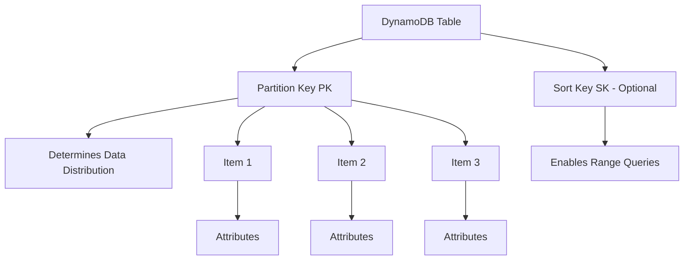
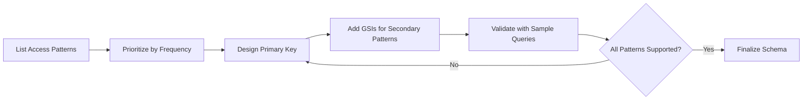
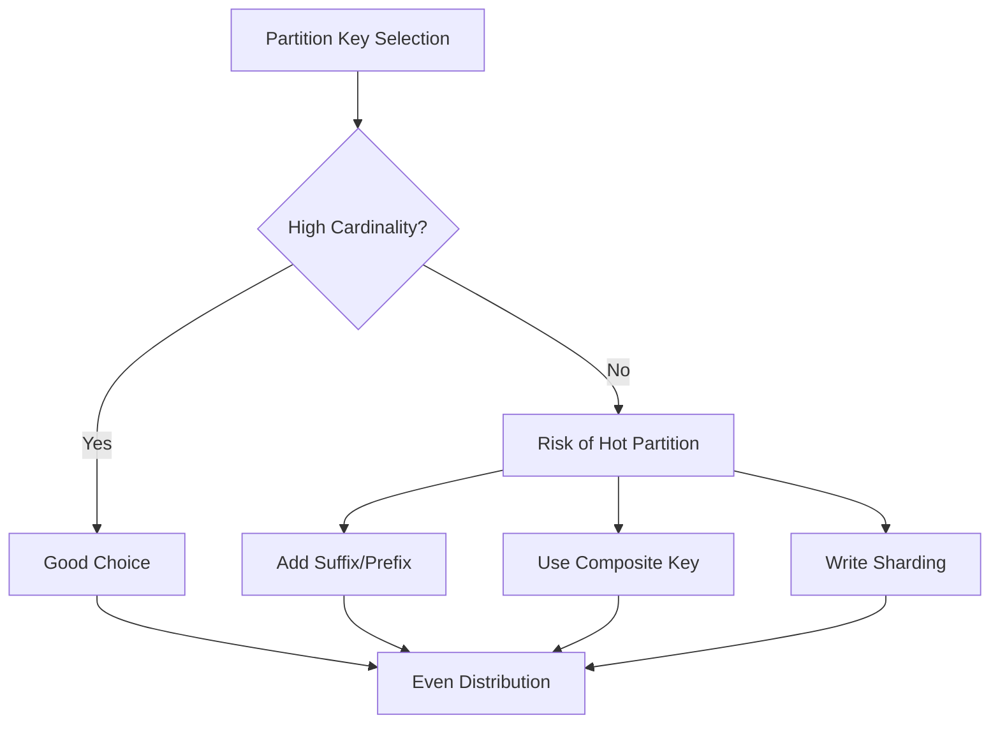
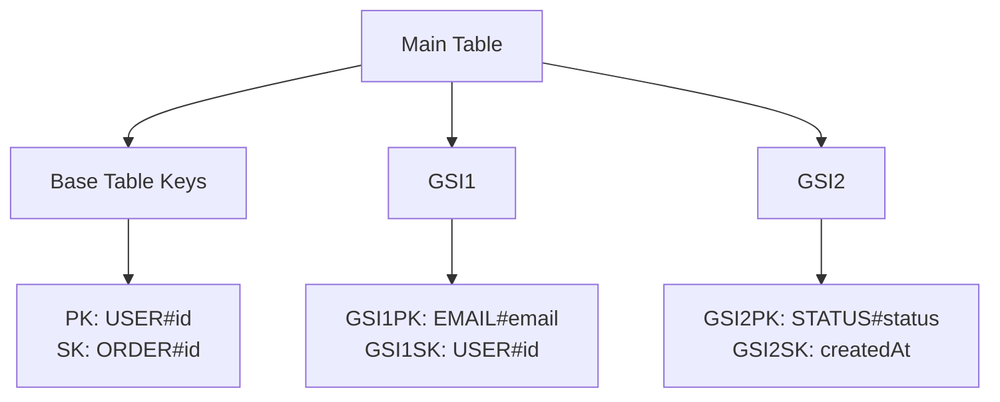
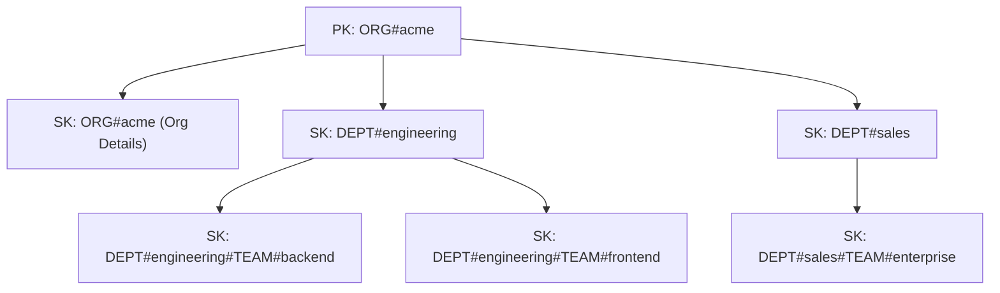
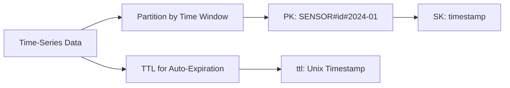
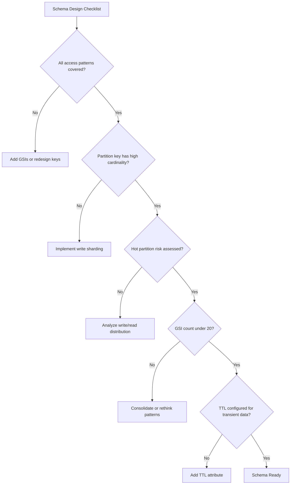

# How to Design DynamoDB Table Schemas

Author: [nawazdhandala](https://www.github.com/nawazdhandala)

Tags: DynamoDB, AWS, NoSQL, Database Design, Backend Development

Description: Learn how to design effective DynamoDB table schemas with partition keys, sort keys, and access patterns for scalable applications.

---

DynamoDB is a fully managed NoSQL database that can handle massive scale with single-digit millisecond latency. But getting the most out of it requires thinking differently about data modeling. Unlike relational databases where you normalize data and figure out access patterns later, DynamoDB demands that you design your schema around how you will query the data.

## Understanding DynamoDB's Data Model

Before diving into schema design, you need to understand the fundamental building blocks.



### Primary Key Types

DynamoDB supports two types of primary keys:

1. **Simple Primary Key (Partition Key only)**: Each item is uniquely identified by a single attribute
2. **Composite Primary Key (Partition Key + Sort Key)**: Items are identified by a combination of two attributes

```javascript
// Simple Primary Key - good for direct lookups
const userTable = {
  TableName: 'Users',
  KeySchema: [
    { AttributeName: 'userId', KeyType: 'HASH' }  // Partition key
  ],
  AttributeDefinitions: [
    { AttributeName: 'userId', AttributeType: 'S' }
  ]
};

// Composite Primary Key - enables range queries
const orderTable = {
  TableName: 'Orders',
  KeySchema: [
    { AttributeName: 'customerId', KeyType: 'HASH' },  // Partition key
    { AttributeName: 'orderDate', KeyType: 'RANGE' }   // Sort key
  ],
  AttributeDefinitions: [
    { AttributeName: 'customerId', AttributeType: 'S' },
    { AttributeName: 'orderDate', AttributeType: 'S' }
  ]
};
```

## The Access Pattern First Approach

The golden rule of DynamoDB design: **identify your access patterns before designing your schema**.



### Example: E-Commerce Application

Let's design a schema for an e-commerce application. First, list the access patterns:

| Access Pattern | Query |
|---------------|-------|
| Get user by ID | PK = USER#userId |
| Get order by ID | PK = ORDER#orderId |
| Get all orders for a user | PK = USER#userId, SK begins_with ORDER# |
| Get order items | PK = ORDER#orderId, SK begins_with ITEM# |
| Get user by email | GSI: email |
| Get orders by status | GSI: status + orderDate |

## Single Table Design

Single table design is a pattern where you store multiple entity types in one table. This reduces the number of round trips to the database and simplifies your application.

```mermaid
erDiagram
    SINGLE_TABLE {
        string PK "Partition Key"
        string SK "Sort Key"
        string GSI1PK "GSI1 Partition Key"
        string GSI1SK "GSI1 Sort Key"
        string entityType "USER|ORDER|ITEM"
        json attributes "Entity-specific data"
    }
```

### Implementing Single Table Design

```javascript
const { DynamoDBClient, PutItemCommand, QueryCommand } = require('@aws-sdk/client-dynamodb');
const { marshall, unmarshall } = require('@aws-sdk/util-dynamodb');

const client = new DynamoDBClient({ region: 'us-east-1' });
const TABLE_NAME = 'ECommerceTable';

// Helper function to create consistent key prefixes
const keys = {
  user: (userId) => ({
    PK: `USER#${userId}`,
    SK: `USER#${userId}`
  }),
  order: (userId, orderId) => ({
    PK: `USER#${userId}`,
    SK: `ORDER#${orderId}`
  }),
  orderItem: (orderId, itemId) => ({
    PK: `ORDER#${orderId}`,
    SK: `ITEM#${itemId}`
  })
};

// Create a user
async function createUser(user) {
  const item = {
    ...keys.user(user.id),
    entityType: 'USER',
    email: user.email,
    name: user.name,
    createdAt: new Date().toISOString(),
    // GSI for email lookup
    GSI1PK: `EMAIL#${user.email}`,
    GSI1SK: `USER#${user.id}`
  };

  await client.send(new PutItemCommand({
    TableName: TABLE_NAME,
    Item: marshall(item),
    // Prevent overwriting existing users
    ConditionExpression: 'attribute_not_exists(PK)'
  }));

  return item;
}

// Create an order
async function createOrder(order) {
  const item = {
    ...keys.order(order.userId, order.id),
    entityType: 'ORDER',
    status: order.status,
    total: order.total,
    createdAt: new Date().toISOString(),
    // GSI for status queries
    GSI1PK: `STATUS#${order.status}`,
    GSI1SK: order.createdAt
  };

  await client.send(new PutItemCommand({
    TableName: TABLE_NAME,
    Item: marshall(item)
  }));

  return item;
}

// Get all orders for a user
async function getUserOrders(userId) {
  const response = await client.send(new QueryCommand({
    TableName: TABLE_NAME,
    KeyConditionExpression: 'PK = :pk AND begins_with(SK, :sk)',
    ExpressionAttributeValues: marshall({
      ':pk': `USER#${userId}`,
      ':sk': 'ORDER#'
    })
  }));

  return response.Items.map(item => unmarshall(item));
}

// Get user with their orders in a single query
async function getUserWithOrders(userId) {
  const response = await client.send(new QueryCommand({
    TableName: TABLE_NAME,
    KeyConditionExpression: 'PK = :pk',
    ExpressionAttributeValues: marshall({
      ':pk': `USER#${userId}`
    })
  }));

  const items = response.Items.map(item => unmarshall(item));

  // Separate user from orders based on entityType
  const user = items.find(item => item.entityType === 'USER');
  const orders = items.filter(item => item.entityType === 'ORDER');

  return { user, orders };
}
```

## Partition Key Design Strategies

The partition key determines how data is distributed across DynamoDB's storage nodes. Poor partition key choices lead to hot partitions and throttling.



### Avoiding Hot Partitions

```javascript
// BAD: Low cardinality partition key
// All items for a date go to the same partition
const badDesign = {
  PK: '2024-01-15',  // Only 365 unique values per year
  SK: 'ORDER#12345'
};

// GOOD: High cardinality with user-specific partitioning
const goodDesign = {
  PK: 'USER#abc123',  // Millions of unique users
  SK: '2024-01-15#ORDER#12345'
};

// GOOD: Write sharding for high-traffic items
function getShardedKey(baseKey, shardCount = 10) {
  // Distribute writes across multiple partitions
  const shard = Math.floor(Math.random() * shardCount);
  return `${baseKey}#SHARD#${shard}`;
}

// Writing to a sharded partition
async function incrementCounter(counterId) {
  const shardedKey = getShardedKey(`COUNTER#${counterId}`);

  await client.send(new UpdateItemCommand({
    TableName: TABLE_NAME,
    Key: marshall({
      PK: shardedKey,
      SK: 'COUNT'
    }),
    UpdateExpression: 'ADD #count :inc',
    ExpressionAttributeNames: { '#count': 'count' },
    ExpressionAttributeValues: marshall({ ':inc': 1 })
  }));
}

// Reading from sharded partitions requires aggregation
async function getCounter(counterId, shardCount = 10) {
  let total = 0;

  // Query all shards and sum the results
  for (let shard = 0; shard < shardCount; shard++) {
    const response = await client.send(new GetItemCommand({
      TableName: TABLE_NAME,
      Key: marshall({
        PK: `COUNTER#${counterId}#SHARD#${shard}`,
        SK: 'COUNT'
      })
    }));

    if (response.Item) {
      const item = unmarshall(response.Item);
      total += item.count || 0;
    }
  }

  return total;
}
```

## Global Secondary Indexes (GSI)

GSIs allow you to query data using different key attributes. They are essential for supporting multiple access patterns.



### Creating and Using GSIs

```javascript
const { CreateTableCommand } = require('@aws-sdk/client-dynamodb');

// Table creation with GSIs
const tableParams = {
  TableName: 'ECommerceTable',
  KeySchema: [
    { AttributeName: 'PK', KeyType: 'HASH' },
    { AttributeName: 'SK', KeyType: 'RANGE' }
  ],
  AttributeDefinitions: [
    { AttributeName: 'PK', AttributeType: 'S' },
    { AttributeName: 'SK', AttributeType: 'S' },
    { AttributeName: 'GSI1PK', AttributeType: 'S' },
    { AttributeName: 'GSI1SK', AttributeType: 'S' },
    { AttributeName: 'GSI2PK', AttributeType: 'S' },
    { AttributeName: 'GSI2SK', AttributeType: 'S' }
  ],
  GlobalSecondaryIndexes: [
    {
      IndexName: 'GSI1',
      KeySchema: [
        { AttributeName: 'GSI1PK', KeyType: 'HASH' },
        { AttributeName: 'GSI1SK', KeyType: 'RANGE' }
      ],
      Projection: { ProjectionType: 'ALL' }
    },
    {
      IndexName: 'GSI2',
      KeySchema: [
        { AttributeName: 'GSI2PK', KeyType: 'HASH' },
        { AttributeName: 'GSI2SK', KeyType: 'RANGE' }
      ],
      Projection: {
        ProjectionType: 'INCLUDE',
        NonKeyAttributes: ['orderId', 'total', 'userId']
      }
    }
  ],
  BillingMode: 'PAY_PER_REQUEST'
};

// Query user by email using GSI1
async function getUserByEmail(email) {
  const response = await client.send(new QueryCommand({
    TableName: TABLE_NAME,
    IndexName: 'GSI1',
    KeyConditionExpression: 'GSI1PK = :pk',
    ExpressionAttributeValues: marshall({
      ':pk': `EMAIL#${email}`
    })
  }));

  return response.Items.length > 0
    ? unmarshall(response.Items[0])
    : null;
}

// Query orders by status using GSI2
async function getOrdersByStatus(status, startDate, endDate) {
  const response = await client.send(new QueryCommand({
    TableName: TABLE_NAME,
    IndexName: 'GSI2',
    KeyConditionExpression: 'GSI2PK = :pk AND GSI2SK BETWEEN :start AND :end',
    ExpressionAttributeValues: marshall({
      ':pk': `STATUS#${status}`,
      ':start': startDate,
      ':end': endDate
    }),
    // Sort by date descending
    ScanIndexForward: false
  }));

  return response.Items.map(item => unmarshall(item));
}
```

## Hierarchical Data Patterns

DynamoDB excels at storing hierarchical data using the sort key.



### Implementing Hierarchical Queries

```javascript
// Store hierarchical organization data
async function createOrgStructure() {
  const items = [
    // Organization
    {
      PK: 'ORG#acme',
      SK: 'ORG#acme',
      entityType: 'ORG',
      name: 'Acme Corporation',
      founded: '2010'
    },
    // Departments
    {
      PK: 'ORG#acme',
      SK: 'DEPT#engineering',
      entityType: 'DEPT',
      name: 'Engineering',
      headCount: 50
    },
    {
      PK: 'ORG#acme',
      SK: 'DEPT#sales',
      entityType: 'DEPT',
      name: 'Sales',
      headCount: 30
    },
    // Teams under Engineering
    {
      PK: 'ORG#acme',
      SK: 'DEPT#engineering#TEAM#backend',
      entityType: 'TEAM',
      name: 'Backend Team',
      headCount: 15
    },
    {
      PK: 'ORG#acme',
      SK: 'DEPT#engineering#TEAM#frontend',
      entityType: 'TEAM',
      name: 'Frontend Team',
      headCount: 12
    },
    // Employees
    {
      PK: 'ORG#acme',
      SK: 'DEPT#engineering#TEAM#backend#EMP#001',
      entityType: 'EMPLOYEE',
      name: 'Alice Smith',
      role: 'Senior Engineer'
    }
  ];

  // Batch write all items
  const { BatchWriteItemCommand } = require('@aws-sdk/client-dynamodb');

  await client.send(new BatchWriteItemCommand({
    RequestItems: {
      [TABLE_NAME]: items.map(item => ({
        PutRequest: { Item: marshall(item) }
      }))
    }
  }));
}

// Get entire organization structure
async function getOrgStructure(orgId) {
  const response = await client.send(new QueryCommand({
    TableName: TABLE_NAME,
    KeyConditionExpression: 'PK = :pk',
    ExpressionAttributeValues: marshall({
      ':pk': `ORG#${orgId}`
    })
  }));

  return response.Items.map(item => unmarshall(item));
}

// Get only departments
async function getDepartments(orgId) {
  const response = await client.send(new QueryCommand({
    TableName: TABLE_NAME,
    KeyConditionExpression: 'PK = :pk AND begins_with(SK, :sk)',
    ExpressionAttributeValues: marshall({
      ':pk': `ORG#${orgId}`,
      ':sk': 'DEPT#'
    }),
    // Filter to only department entities, not teams under them
    FilterExpression: 'entityType = :type',
    ExpressionAttributeValues: marshall({
      ':pk': `ORG#${orgId}`,
      ':sk': 'DEPT#',
      ':type': 'DEPT'
    })
  }));

  return response.Items.map(item => unmarshall(item));
}

// Get everything under a department (teams and employees)
async function getDepartmentDetails(orgId, deptId) {
  const response = await client.send(new QueryCommand({
    TableName: TABLE_NAME,
    KeyConditionExpression: 'PK = :pk AND begins_with(SK, :sk)',
    ExpressionAttributeValues: marshall({
      ':pk': `ORG#${orgId}`,
      ':sk': `DEPT#${deptId}`
    })
  }));

  return response.Items.map(item => unmarshall(item));
}
```

## Time-Based Data and TTL

For time-series data, design your schema to support efficient time-range queries and automatic data expiration.



### Implementing Time-Series with TTL

```javascript
// Store time-series sensor data with TTL
async function storeSensorReading(sensorId, reading) {
  const timestamp = new Date().toISOString();
  const monthPartition = timestamp.slice(0, 7);  // 2024-01

  // Calculate TTL: 90 days from now
  const ttl = Math.floor(Date.now() / 1000) + (90 * 24 * 60 * 60);

  const item = {
    // Partition by sensor and month to avoid hot partitions
    PK: `SENSOR#${sensorId}#${monthPartition}`,
    SK: timestamp,
    entityType: 'READING',
    value: reading.value,
    unit: reading.unit,
    ttl: ttl  // DynamoDB will auto-delete after this time
  };

  await client.send(new PutItemCommand({
    TableName: TABLE_NAME,
    Item: marshall(item)
  }));

  return item;
}

// Query sensor readings for a time range
async function getSensorReadings(sensorId, startTime, endTime) {
  const results = [];

  // Determine which monthly partitions to query
  const start = new Date(startTime);
  const end = new Date(endTime);
  const partitions = [];

  let current = new Date(start.getFullYear(), start.getMonth(), 1);
  while (current <= end) {
    partitions.push(
      `${current.getFullYear()}-${String(current.getMonth() + 1).padStart(2, '0')}`
    );
    current.setMonth(current.getMonth() + 1);
  }

  // Query each partition
  for (const partition of partitions) {
    const response = await client.send(new QueryCommand({
      TableName: TABLE_NAME,
      KeyConditionExpression: 'PK = :pk AND SK BETWEEN :start AND :end',
      ExpressionAttributeValues: marshall({
        ':pk': `SENSOR#${sensorId}#${partition}`,
        ':start': startTime,
        ':end': endTime
      })
    }));

    results.push(...response.Items.map(item => unmarshall(item)));
  }

  return results.sort((a, b) => a.SK.localeCompare(b.SK));
}
```

## Transactions for Data Integrity

DynamoDB transactions ensure all-or-nothing operations across multiple items.

```javascript
const { TransactWriteItemsCommand } = require('@aws-sdk/client-dynamodb');

// Transfer funds between accounts atomically
async function transferFunds(fromAccountId, toAccountId, amount) {
  const timestamp = new Date().toISOString();
  const transferId = `TXN#${Date.now()}`;

  await client.send(new TransactWriteItemsCommand({
    TransactItems: [
      // Deduct from source account
      {
        Update: {
          TableName: TABLE_NAME,
          Key: marshall({
            PK: `ACCOUNT#${fromAccountId}`,
            SK: `ACCOUNT#${fromAccountId}`
          }),
          UpdateExpression: 'SET balance = balance - :amount, updatedAt = :ts',
          ConditionExpression: 'balance >= :amount',
          ExpressionAttributeValues: marshall({
            ':amount': amount,
            ':ts': timestamp
          })
        }
      },
      // Add to destination account
      {
        Update: {
          TableName: TABLE_NAME,
          Key: marshall({
            PK: `ACCOUNT#${toAccountId}`,
            SK: `ACCOUNT#${toAccountId}`
          }),
          UpdateExpression: 'SET balance = balance + :amount, updatedAt = :ts',
          ExpressionAttributeValues: marshall({
            ':amount': amount,
            ':ts': timestamp
          })
        }
      },
      // Record the transfer
      {
        Put: {
          TableName: TABLE_NAME,
          Item: marshall({
            PK: `ACCOUNT#${fromAccountId}`,
            SK: transferId,
            entityType: 'TRANSFER',
            fromAccount: fromAccountId,
            toAccount: toAccountId,
            amount: amount,
            createdAt: timestamp
          })
        }
      }
    ]
  }));

  return { transferId, amount, timestamp };
}
```

## Schema Design Checklist

Before finalizing your DynamoDB schema, verify these points:



### Key Takeaways

1. **Start with access patterns**: List every query your application needs before designing the schema
2. **Use composite keys**: Partition key + sort key unlocks powerful query patterns
3. **Embrace single table design**: Reduces round trips and simplifies code
4. **Plan for scale**: Choose high-cardinality partition keys and implement sharding if needed
5. **Use GSIs sparingly**: Each GSI costs additional storage and write capacity
6. **Set TTL for transient data**: Automatic cleanup saves money and keeps tables manageable
7. **Test with realistic data**: Validate your design with production-like data volumes

---

DynamoDB rewards thoughtful upfront design. Spend time understanding your access patterns, and you will have a database that scales effortlessly from prototype to millions of users. The key is remembering that DynamoDB is not a relational database, so leave SQL habits at the door and embrace the NoSQL mindset.
