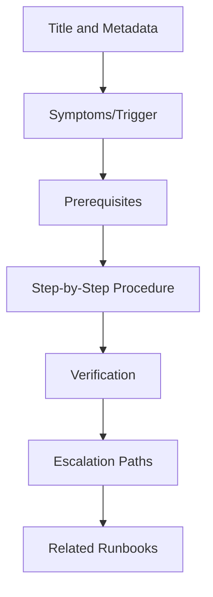
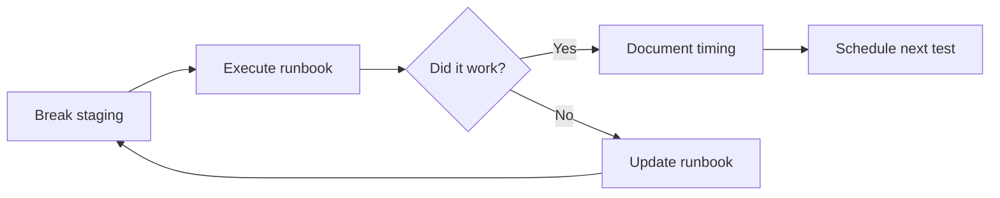

# How to Build Effective Runbooks

Author: [nawazdhandala](https://www.github.com/nawazdhandala)

Tags: Site Reliability Engineering, SRE, Runbooks, Incident Response, DevOps, Documentation, Operational Excellence

Description: A practical guide to creating runbooks that actually work during incidents - covering structure, writing style, testing, and maintenance strategies that keep your documentation useful.

---

Your database is down at 2 AM. The on-call engineer opens the runbook and finds a document last updated 18 months ago with steps that reference a service that no longer exists. This is not a hypothetical scenario - it happens all the time.

Good runbooks save hours during incidents. Bad runbooks waste time and create confusion when you can least afford it. The difference comes down to how you build and maintain them.

## What Makes a Runbook Effective

A runbook is not a wiki page or a general knowledge document. It is a step-by-step procedure for handling a specific operational task or incident. The key word is "specific."

Effective runbooks share these characteristics:

- **Actionable**: Every step tells the reader exactly what to do
- **Self-contained**: The reader does not need to search for additional information
- **Testable**: Each step has clear success and failure criteria
- **Current**: The steps actually work with today's infrastructure

The opposite of an effective runbook is one that says "investigate the issue and take appropriate action." That is not helpful at 2 AM.

## Runbook Structure

Every runbook should follow a consistent structure. This lets engineers quickly find what they need without reading the entire document.



### Title and Metadata

The title should clearly identify when this runbook applies. "Database Issues" is too vague. "PostgreSQL Primary Failover" is better.

Include metadata at the top:

```markdown
# PostgreSQL Primary Failover

**Last Updated**: 2026-01-15
**Last Tested**: 2026-01-10
**Owner**: Database Team
**Expected Duration**: 15-30 minutes
**Risk Level**: High - involves database failover
```

The "Last Tested" date is critical. A runbook that has not been tested in six months should be treated with suspicion.

### Symptoms and Trigger Conditions

Describe exactly when this runbook should be used. Include the alert names, error messages, or conditions that indicate this procedure is needed.

```markdown
## When to Use This Runbook

Use this runbook when:
- Alert "PostgreSQL Primary Unreachable" fires
- Application logs show "connection refused" to primary database
- Replication lag exceeds 60 seconds with no recovery

Do NOT use this runbook when:
- Only read replicas are affected (see: Read Replica Recovery)
- The issue is network connectivity (see: Network Troubleshooting)
```

Being explicit about when NOT to use a runbook prevents engineers from following the wrong procedure.

### Prerequisites

List everything needed before starting. This includes access requirements, tools, and any preparation steps.

```markdown
## Prerequisites

Before starting:
- [ ] Confirm you have database admin access (test with `psql -h primary.db.internal`)
- [ ] Verify you can access the failover dashboard at https://internal.example.com/db-failover
- [ ] Open the #database-incidents Slack channel
- [ ] Notify the incident commander that failover is starting
```

Use checkboxes. Engineers can check them off as they go, which prevents skipped steps.

### Step-by-Step Procedure

This is the core of the runbook. Each step must be specific, testable, and include expected output.

Bad step:
```markdown
3. Promote the standby to primary
```

Good step:
```markdown
3. Promote the standby database to primary

   Run on the standby server:
   ```bash
   sudo -u postgres pg_ctl promote -D /var/lib/postgresql/14/main
   ```

   Expected output:
   ```
   waiting for server to promote.... done
   server promoted
   ```

   If you see "server is not in standby mode", the standby may have already been promoted.
   Check the current role with: `SELECT pg_is_in_recovery();`
   - Returns `f` if primary
   - Returns `t` if standby
```

Notice the pattern: command to run, expected output, and what to do if the output differs.

### Verification

After completing the procedure, how do you know it worked? Include verification steps with specific success criteria.

```markdown
## Verification

After completing the failover, verify success:

1. Check new primary is accepting writes:
   ```bash
   psql -h primary.db.internal -c "CREATE TABLE failover_test (id int); DROP TABLE failover_test;"
   ```
   Expected: Query completes without error

2. Check application connectivity:
   ```bash
   curl -s http://api.internal/health | jq '.database'
   ```
   Expected: `"connected"`

3. Check replication to new standby:
   ```bash
   psql -h primary.db.internal -c "SELECT client_addr, state FROM pg_stat_replication;"
   ```
   Expected: At least one row with `state = 'streaming'`
```

### Escalation Paths

Not every runbook execution succeeds. Define clear escalation points.

```markdown
## Escalation

Escalate to the Database Team Lead if:
- Failover does not complete within 30 minutes
- Data inconsistency is detected between old and new primary
- Application cannot connect after failover completion

Database Team Lead on-call: See PagerDuty schedule "Database Primary"
```

## Writing Style for Runbooks

Runbooks are read during stressful situations. The writing style matters.

### Use Direct Commands

Write imperatively. Tell the reader what to do, not what they could do or might want to consider.

Instead of: "You may want to check the logs for any errors that might indicate the root cause."

Write: "Check the application logs for errors. Run: `kubectl logs -l app=api --tail=100`"

### Include Copy-Paste Commands

Engineers should be able to copy commands directly from the runbook. Do not use placeholder values that require mental substitution during an incident.

Instead of: `ssh $USER@$SERVER`

Write: `ssh admin@db-primary-01.prod.internal`

If variables are necessary, define them at the start of the section:

```markdown
Set these variables based on the affected environment:
```bash
export ENV="prod"  # or "staging"
export CLUSTER="us-east-1"
```

Then run:
```bash
kubectl --context=${CLUSTER}-${ENV} get pods
```
```

### Show Expected Output

For every command, show what success looks like. This lets engineers quickly verify they are on the right track.

```markdown
```bash
systemctl status postgresql
```

Expected output (healthy):
```
postgresql.service - PostgreSQL database server
   Active: active (running) since Mon 2026-01-15 10:30:00 UTC
```

Expected output (problem):
```
postgresql.service - PostgreSQL database server
   Active: failed (Result: exit-code) since Mon 2026-01-15 10:30:00 UTC
```
```

### Handle Edge Cases

Real incidents rarely follow the happy path. Document what to do when things go wrong.

```markdown
### If the service does not start

Check the PostgreSQL logs:
```bash
tail -100 /var/log/postgresql/postgresql-14-main.log
```

Common errors:

**"could not bind IPv4 address: Address already in use"**
Another process is using port 5432. Find and stop it:
```bash
sudo lsof -i :5432
sudo kill <PID>
```

**"FATAL: could not open relation mapping file"**
Data directory may be corrupted. Do not attempt repair - escalate immediately.
```

## Testing Runbooks

Untested runbooks are unreliable. Build testing into your process.

### Game Days

Run through runbooks in a staging environment periodically. Schedule monthly or quarterly "game days" where the team executes runbooks against intentionally broken systems.



### Chaos Engineering Integration

If you practice chaos engineering, use those experiments to validate runbooks. When you inject a failure, the corresponding runbook should resolve it.

### New Engineer Validation

When a new engineer joins, have them execute runbooks as part of onboarding. Fresh eyes catch unclear instructions that experienced engineers skip over unconsciously.

## Keeping Runbooks Current

The biggest runbook problem is drift. Systems change, but documentation does not.

### Ownership Assignment

Every runbook needs an owner - a person or team responsible for keeping it current. Add ownership to your metadata and include it in your on-call rotation responsibilities.

### Change-Triggered Reviews

When infrastructure changes, flag affected runbooks for review. If you modify the database deployment, the database runbooks need verification.

Automate this where possible:

```yaml
# In your CI/CD pipeline
- name: Check runbook impact
  script: |
    CHANGED_SERVICES=$(git diff --name-only HEAD~1 | grep "terraform/")
    if echo "$CHANGED_SERVICES" | grep -q "database"; then
      echo "WARNING: Database runbooks may need update"
      # Post to Slack or create ticket
    fi
```

### Incident-Driven Updates

After every incident where a runbook was used, ask:

- Did the runbook help resolve the incident?
- Were any steps unclear or outdated?
- Did we discover steps that should be added?

Make runbook updates part of your incident retrospective process.

### Scheduled Reviews

Even without changes, review runbooks quarterly. Add a recurring calendar event for the owning team.

## Runbook Organization

As you build more runbooks, organization becomes important.

### Naming Convention

Use a consistent naming pattern that sorts logically:

```
service-action-scope.md

Examples:
postgresql-failover-primary.md
postgresql-recovery-replica.md
kubernetes-restart-deployment.md
kubernetes-scale-nodes.md
```

### Linking Related Runbooks

Runbooks rarely exist in isolation. Link to related procedures:

```markdown
## Related Runbooks

- [PostgreSQL Replica Recovery](./postgresql-recovery-replica.md) - If only replicas are affected
- [Network Troubleshooting](./network-troubleshooting.md) - If connectivity issues
- [Application Rollback](./application-rollback.md) - If caused by recent deployment
```

### Searchability

Make runbooks searchable by including common symptoms and error messages. When an engineer searches for an error message, the right runbook should appear.

```markdown
## Keywords

Error messages that indicate this runbook:
- "FATAL: the database system is not yet accepting connections"
- "could not connect to server: Connection refused"
- "psql: error: connection to server failed"
```

## Common Runbook Mistakes

### Too Many Prerequisites

If your runbook requires 15 minutes of setup before you can start fixing the problem, something is wrong. Consider pre-provisioning access or automating the prerequisites.

### Missing Context

Runbooks should explain why, not just what. Understanding why a step exists helps engineers adapt when conditions differ:

```markdown
4. Wait 60 seconds before proceeding

   This delay allows replication to catch up. Proceeding too quickly
   can cause data loss if the old primary had uncommitted transactions.
```

### Over-Automation

Not every runbook should be a script. Sometimes the value is in the documentation itself - helping engineers understand the system. Fully automated runbooks can become black boxes that nobody understands when they fail.

### No Rollback

Every runbook that makes changes should include a rollback procedure. What if step 5 makes things worse?

## Starting Point

You do not need perfect runbooks on day one. Start with your most common incidents:

1. List your top 5 alert types by frequency
2. Write a runbook for each one
3. Test them during the next occurrence
4. Iterate based on feedback

A simple runbook that works is better than a comprehensive one that does not exist.

The goal is not documentation for its own sake. The goal is faster incident resolution with less stress. Build runbooks that serve that purpose, and your on-call engineers will thank you.
