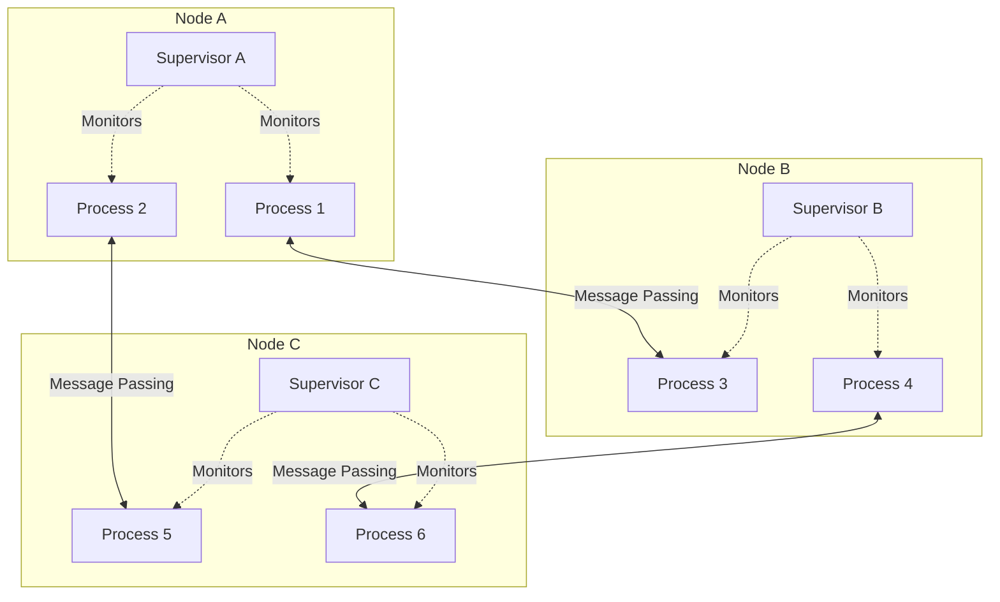
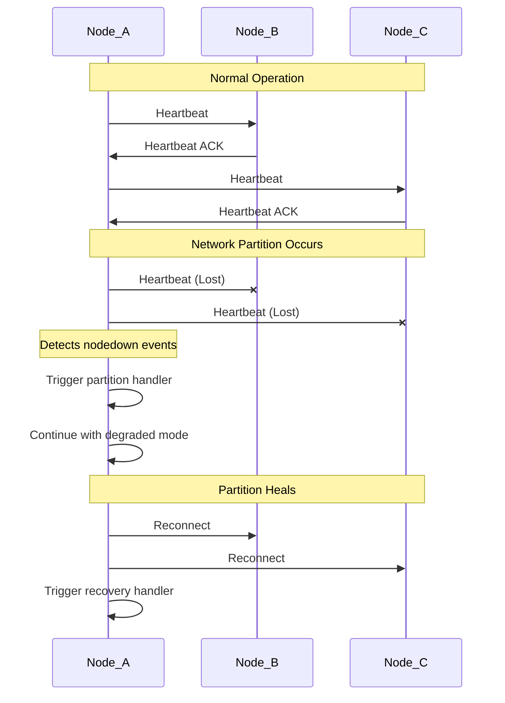
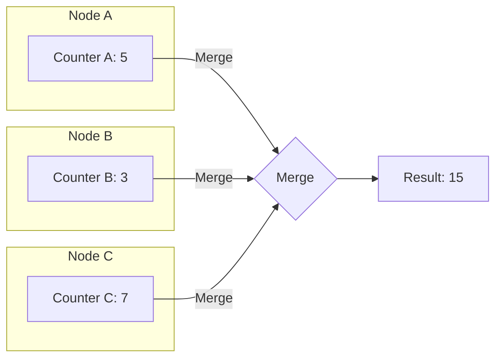
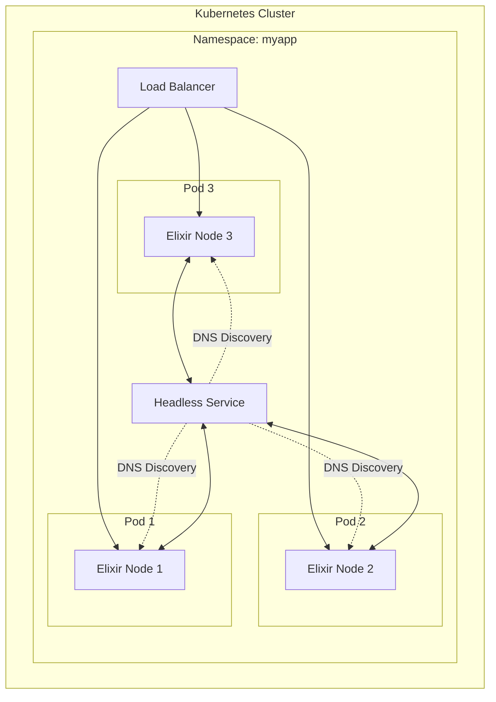

# How to Use Elixir for Distributed Systems

Author: [nawazdhandala](https://www.github.com/nawazdhandala)

Tags: Elixir, Distributed Systems, OTP, BEAM, Concurrency, Fault Tolerance, Clustering

Description: A practical guide to building distributed systems with Elixir, covering node clustering, process distribution, data replication, and fault tolerance patterns.

---

Elixir runs on the BEAM virtual machine, which was designed from the ground up for building distributed, fault-tolerant systems. This heritage from Erlang gives Elixir native support for clustering, remote process communication, and distributed state management. In this guide, you will learn how to leverage these capabilities to build production-ready distributed systems.

## Why Elixir for Distributed Systems?

The BEAM VM provides several features that make it uniquely suited for distributed computing:

- **Location Transparency**: Processes communicate the same way whether they're on the same node or different machines
- **Built-in Distribution**: Node clustering and remote procedure calls are part of the standard library
- **Fault Isolation**: Process crashes are isolated and don't bring down the entire system
- **Hot Code Upgrades**: Deploy new code without stopping the system



## Setting Up a Distributed Elixir Cluster

### Basic Node Configuration

Every Elixir node needs a name and a shared cookie for authentication. Start nodes with these parameters:

```bash
# Start the first node with a short name (for local network)
iex --sname node1 --cookie my_secret_cookie -S mix

# Start another node on the same machine or network
iex --sname node2 --cookie my_secret_cookie -S mix

# For nodes across different networks, use long names with full hostnames
iex --name node1@192.168.1.100 --cookie my_secret_cookie -S mix
```

### Connecting Nodes Programmatically

Once nodes are running, you can connect them from within Elixir:

```elixir
defmodule ClusterManager do
  @moduledoc """
  Handles node discovery and cluster management.
  Provides functions to connect nodes and monitor cluster health.
  """

  @doc """
  Connects to a list of nodes and returns the successfully connected ones.
  Nodes that are already connected or successfully join the cluster are included.
  """
  def connect_nodes(node_list) when is_list(node_list) do
    node_list
    |> Enum.map(&connect_node/1)
    |> Enum.filter(fn {status, _node} -> status == :ok end)
    |> Enum.map(fn {:ok, node} -> node end)
  end

  @doc """
  Attempts to connect to a single node.
  Returns {:ok, node} on success, {:error, node} on failure.
  """
  def connect_node(node) when is_atom(node) do
    case Node.connect(node) do
      true ->
        IO.puts("Connected to #{node}")
        {:ok, node}
      false ->
        IO.puts("Failed to connect to #{node}")
        {:error, node}
      :ignored ->
        # Node is already connected
        {:ok, node}
    end
  end

  @doc """
  Returns a list of all connected nodes including the current node.
  """
  def cluster_members do
    [Node.self() | Node.list()]
  end

  @doc """
  Monitors the cluster and logs when nodes join or leave.
  This function should be started as a supervised process.
  """
  def monitor_cluster do
    # Subscribe to node up/down events
    :net_kernel.monitor_nodes(true)
    listen_for_node_events()
  end

  defp listen_for_node_events do
    receive do
      {:nodeup, node} ->
        IO.puts("Node joined the cluster: #{node}")
        listen_for_node_events()

      {:nodedown, node} ->
        IO.puts("Node left the cluster: #{node}")
        listen_for_node_events()
    end
  end
end
```

### Using libcluster for Automatic Discovery

For production systems, manual node connection is impractical. The `libcluster` library provides automatic node discovery:

```elixir
# In mix.exs, add the dependency
defp deps do
  [
    {:libcluster, "~> 3.3"}
  ]
end
```

Configure the clustering strategy in your application:

```elixir
# config/config.exs
config :libcluster,
  topologies: [
    # Strategy for Kubernetes deployments
    k8s_example: [
      strategy: Cluster.Strategy.Kubernetes,
      config: [
        kubernetes_selector: "app=my_app",
        kubernetes_node_basename: "my_app"
      ]
    ],

    # Strategy for local development or static clusters
    gossip_example: [
      strategy: Cluster.Strategy.Gossip,
      config: [
        port: 45892,
        if_addr: "0.0.0.0",
        multicast_addr: "230.1.1.251",
        broadcast_only: true
      ]
    ],

    # Strategy for DNS-based discovery (useful for Docker Swarm)
    dns_example: [
      strategy: Cluster.Strategy.DNSPoll,
      config: [
        polling_interval: 5_000,
        query: "tasks.my_app",
        node_basename: "my_app"
      ]
    ]
  ]
```

Start the cluster supervisor in your application:

```elixir
defmodule MyApp.Application do
  use Application

  def start(_type, _args) do
    # Get the topology configuration
    topologies = Application.get_env(:libcluster, :topologies, [])

    children = [
      # Start the cluster supervisor first
      {Cluster.Supervisor, [topologies, [name: MyApp.ClusterSupervisor]]},
      # Then start your other supervised processes
      MyApp.DistributedWorkerSupervisor,
      MyApp.StateManager
    ]

    opts = [strategy: :one_for_one, name: MyApp.Supervisor]
    Supervisor.start_link(children, opts)
  end
end
```

## Distributed Process Communication

### Sending Messages to Remote Processes

Elixir's message passing works transparently across nodes:

```elixir
defmodule DistributedMessenger do
  @moduledoc """
  Demonstrates message passing between processes on different nodes.
  Shows both direct PID messaging and named process communication.
  """

  @doc """
  Sends a message to a process on a remote node using its PID.
  The target_pid must be a valid PID from a connected node.
  """
  def send_to_pid(target_pid, message) when is_pid(target_pid) do
    # Message passing works the same way regardless of node location
    send(target_pid, {:distributed_message, Node.self(), message})
  end

  @doc """
  Sends a message to a named process on a specific node.
  This is useful when you know the process name but not the PID.
  """
  def send_to_named(node, process_name, message)
      when is_atom(node) and is_atom(process_name) do
    # Use the {name, node} tuple format to address remote named processes
    send({process_name, node}, {:distributed_message, Node.self(), message})
  end

  @doc """
  Calls a function on a remote node and waits for the result.
  Uses :rpc.call which is a blocking operation with a timeout.
  """
  def remote_call(node, module, function, args, timeout \\ 5000) do
    case :rpc.call(node, module, function, args, timeout) do
      {:badrpc, reason} ->
        {:error, {:rpc_failed, reason}}
      result ->
        {:ok, result}
    end
  end

  @doc """
  Asynchronously calls a function on a remote node.
  Returns a key that can be used to retrieve the result later.
  """
  def async_remote_call(node, module, function, args) do
    :rpc.async_call(node, module, function, args)
  end

  @doc """
  Retrieves the result of an async call.
  Blocks until the result is available or timeout is reached.
  """
  def get_async_result(key, timeout \\ 5000) do
    :rpc.yield(key, timeout)
  end

  @doc """
  Multicasts a call to all connected nodes.
  Returns a list of results from each node.
  """
  def multicast_call(module, function, args) do
    nodes = Node.list()
    :rpc.multicall(nodes, module, function, args)
  end
end
```

### Building a Distributed Task Runner

Here's a practical example of distributing work across cluster nodes:

```elixir
defmodule DistributedTaskRunner do
  @moduledoc """
  Distributes tasks across cluster nodes using round-robin scheduling.
  Handles node failures gracefully by retrying on other nodes.
  """

  use GenServer
  require Logger

  # Client API

  def start_link(opts \\ []) do
    GenServer.start_link(__MODULE__, opts, name: __MODULE__)
  end

  @doc """
  Submits a task to be executed on one of the cluster nodes.
  Returns {:ok, result} or {:error, reason}.
  """
  def run_task(module, function, args) do
    GenServer.call(__MODULE__, {:run_task, module, function, args}, 30_000)
  end

  @doc """
  Submits a task asynchronously and returns immediately.
  The caller receives a message with the result when complete.
  """
  def run_task_async(module, function, args, reply_to \\ self()) do
    GenServer.cast(__MODULE__, {:run_task_async, module, function, args, reply_to})
  end

  # Server Implementation

  @impl true
  def init(_opts) do
    # Monitor node events to update available workers
    :net_kernel.monitor_nodes(true)

    state = %{
      # Index for round-robin scheduling
      current_index: 0,
      # Track running tasks for potential retries
      running_tasks: %{}
    }

    {:ok, state}
  end

  @impl true
  def handle_call({:run_task, module, function, args}, _from, state) do
    {node, new_state} = select_node(state)

    result = execute_with_retry(node, module, function, args, get_other_nodes(node))

    {:reply, result, new_state}
  end

  @impl true
  def handle_cast({:run_task_async, module, function, args, reply_to}, state) do
    {node, new_state} = select_node(state)

    # Spawn a task to handle the async execution
    Task.start(fn ->
      result = execute_with_retry(node, module, function, args, get_other_nodes(node))
      send(reply_to, {:task_result, {module, function, args}, result})
    end)

    {:noreply, new_state}
  end

  @impl true
  def handle_info({:nodeup, node}, state) do
    Logger.info("Node #{node} joined - available for task execution")
    {:noreply, state}
  end

  @impl true
  def handle_info({:nodedown, node}, state) do
    Logger.warning("Node #{node} disconnected - removing from task pool")
    {:noreply, state}
  end

  # Private Functions

  # Selects the next node using round-robin scheduling
  defp select_node(state) do
    nodes = available_nodes()

    if Enum.empty?(nodes) do
      # If no remote nodes, execute locally
      {Node.self(), state}
    else
      index = rem(state.current_index, length(nodes))
      node = Enum.at(nodes, index)
      {node, %{state | current_index: state.current_index + 1}}
    end
  end

  # Returns all connected nodes plus the current node
  defp available_nodes do
    [Node.self() | Node.list()]
  end

  # Gets all nodes except the specified one
  defp get_other_nodes(exclude_node) do
    available_nodes()
    |> Enum.reject(&(&1 == exclude_node))
  end

  # Executes the task with automatic retry on failure
  defp execute_with_retry(node, module, function, args, fallback_nodes) do
    case :rpc.call(node, module, function, args, 10_000) do
      {:badrpc, reason} ->
        Logger.warning("Task failed on #{node}: #{inspect(reason)}")
        retry_on_fallback(module, function, args, fallback_nodes)

      result ->
        {:ok, result}
    end
  end

  # Tries to execute on fallback nodes if the primary fails
  defp retry_on_fallback(_module, _function, _args, []) do
    {:error, :all_nodes_failed}
  end

  defp retry_on_fallback(module, function, args, [node | rest]) do
    Logger.info("Retrying task on fallback node #{node}")
    execute_with_retry(node, module, function, args, rest)
  end
end
```

## Distributed State Management

### Using Global Process Registry

Elixir provides `:global` for registering process names across the cluster:

```elixir
defmodule GlobalStateManager do
  @moduledoc """
  Manages global state that is accessible from any node in the cluster.
  Uses :global for name registration and GenServer for state management.
  """

  use GenServer
  require Logger

  # The globally registered name for this process
  @global_name {:global, __MODULE__}

  # Client API

  @doc """
  Starts the global state manager. Only one instance runs across the entire cluster.
  If an instance is already running on another node, this call returns an error.
  """
  def start_link(initial_state \\ %{}) do
    GenServer.start_link(__MODULE__, initial_state, name: @global_name)
  end

  @doc """
  Gets a value from the global state by key.
  This call works from any node in the cluster.
  """
  def get(key) do
    GenServer.call(@global_name, {:get, key})
  end

  @doc """
  Sets a value in the global state.
  The change is immediately visible from all nodes.
  """
  def put(key, value) do
    GenServer.call(@global_name, {:put, key, value})
  end

  @doc """
  Deletes a key from the global state.
  """
  def delete(key) do
    GenServer.call(@global_name, {:delete, key})
  end

  @doc """
  Returns all keys and values in the global state.
  """
  def get_all do
    GenServer.call(@global_name, :get_all)
  end

  # Server Implementation

  @impl true
  def init(initial_state) do
    Logger.info("Global state manager started on #{Node.self()}")
    {:ok, initial_state}
  end

  @impl true
  def handle_call({:get, key}, _from, state) do
    {:reply, Map.get(state, key), state}
  end

  @impl true
  def handle_call({:put, key, value}, _from, state) do
    new_state = Map.put(state, key, value)
    {:reply, :ok, new_state}
  end

  @impl true
  def handle_call({:delete, key}, _from, state) do
    new_state = Map.delete(state, key)
    {:reply, :ok, new_state}
  end

  @impl true
  def handle_call(:get_all, _from, state) do
    {:reply, state, state}
  end
end
```

### Distributed Process Groups with pg

For scenarios where multiple processes handle the same type of work, use process groups:

```elixir
defmodule WorkerPool do
  @moduledoc """
  Implements a distributed worker pool using :pg (process groups).
  Workers can be on any node, and work is distributed among them.
  """

  use GenServer
  require Logger

  @group :worker_pool

  # Client API

  def start_link(opts \\ []) do
    GenServer.start_link(__MODULE__, opts)
  end

  @doc """
  Dispatches work to a random worker in the pool.
  The work is sent as a message, not a synchronous call.
  """
  def dispatch_work(work) do
    case get_random_worker() do
      nil ->
        {:error, :no_workers_available}

      worker_pid ->
        send(worker_pid, {:work, work})
        {:ok, worker_pid}
    end
  end

  @doc """
  Broadcasts work to all workers in the pool.
  Useful for cache invalidation or configuration updates.
  """
  def broadcast_work(work) do
    workers = get_all_workers()

    Enum.each(workers, fn pid ->
      send(pid, {:broadcast_work, work})
    end)

    {:ok, length(workers)}
  end

  @doc """
  Returns the count of workers on each node.
  """
  def worker_distribution do
    get_all_workers()
    |> Enum.group_by(&node/1)
    |> Enum.map(fn {node, pids} -> {node, length(pids)} end)
    |> Map.new()
  end

  # Private helper functions for worker selection

  defp get_all_workers do
    :pg.get_members(@group)
  end

  defp get_random_worker do
    case get_all_workers() do
      [] -> nil
      workers -> Enum.random(workers)
    end
  end

  # Server Implementation

  @impl true
  def init(opts) do
    # Ensure the pg scope is started
    :pg.start_link()

    # Join this process to the worker pool group
    :pg.join(@group, self())

    Logger.info("Worker #{inspect(self())} joined pool on #{Node.self()}")

    state = %{
      processed_count: 0,
      opts: opts
    }

    {:ok, state}
  end

  @impl true
  def handle_info({:work, work}, state) do
    Logger.debug("Processing work: #{inspect(work)}")

    # Simulate work processing
    process_work(work)

    new_state = %{state | processed_count: state.processed_count + 1}
    {:noreply, new_state}
  end

  @impl true
  def handle_info({:broadcast_work, work}, state) do
    Logger.debug("Processing broadcast work: #{inspect(work)}")
    process_work(work)
    {:noreply, state}
  end

  @impl true
  def terminate(_reason, _state) do
    # Leave the group when terminating
    :pg.leave(@group, self())
    :ok
  end

  defp process_work(work) do
    # Your work processing logic here
    :timer.sleep(100)
    Logger.info("Completed work: #{inspect(work)}")
  end
end
```

## Handling Network Partitions and Failures

Network partitions are inevitable in distributed systems. Here's how to handle them:



```elixir
defmodule PartitionHandler do
  @moduledoc """
  Handles network partition detection and recovery.
  Implements strategies for maintaining consistency during splits.
  """

  use GenServer
  require Logger

  @check_interval 5_000

  def start_link(opts \\ []) do
    GenServer.start_link(__MODULE__, opts, name: __MODULE__)
  end

  @impl true
  def init(_opts) do
    # Monitor all node connections
    :net_kernel.monitor_nodes(true, [:nodedown_reason])

    # Schedule periodic partition checks
    schedule_partition_check()

    state = %{
      known_nodes: MapSet.new(),
      partitioned_nodes: MapSet.new(),
      partition_start_time: nil
    }

    {:ok, state}
  end

  @impl true
  def handle_info({:nodeup, node, _info}, state) do
    Logger.info("Node #{node} connected")

    new_state = %{state |
      known_nodes: MapSet.put(state.known_nodes, node),
      partitioned_nodes: MapSet.delete(state.partitioned_nodes, node)
    }

    # Check if we're recovering from a partition
    if MapSet.size(new_state.partitioned_nodes) == 0 and
       state.partition_start_time != nil do
      handle_partition_recovery(state.partition_start_time)
      {:noreply, %{new_state | partition_start_time: nil}}
    else
      {:noreply, new_state}
    end
  end

  @impl true
  def handle_info({:nodedown, node, info}, state) do
    reason = Keyword.get(info, :nodedown_reason, :unknown)
    Logger.warning("Node #{node} disconnected. Reason: #{inspect(reason)}")

    new_state = %{state |
      partitioned_nodes: MapSet.put(state.partitioned_nodes, node)
    }

    # Set partition start time if this is the first node to disconnect
    new_state = if state.partition_start_time == nil do
      handle_partition_detected(node, reason)
      %{new_state | partition_start_time: System.monotonic_time(:second)}
    else
      new_state
    end

    {:noreply, new_state}
  end

  @impl true
  def handle_info(:check_partition, state) do
    check_and_recover_nodes(state)
    schedule_partition_check()
    {:noreply, state}
  end

  # Private Functions

  defp schedule_partition_check do
    Process.send_after(self(), :check_partition, @check_interval)
  end

  defp handle_partition_detected(node, reason) do
    Logger.error("Partition detected! Node #{node} unreachable: #{inspect(reason)}")

    # Implement your partition strategy here
    # Options include:
    # 1. Continue operating in degraded mode
    # 2. Stop accepting writes to prevent split-brain
    # 3. Switch to a quorum-based decision system

    # Notify monitoring systems
    notify_partition_event(:partition_start, node)
  end

  defp handle_partition_recovery(start_time) do
    duration = System.monotonic_time(:second) - start_time
    Logger.info("Partition recovered after #{duration} seconds")

    # Implement recovery strategy
    # Options include:
    # 1. Reconcile diverged state
    # 2. Replay missed events
    # 3. Full state sync from authoritative node

    notify_partition_event(:partition_end, duration)
  end

  defp check_and_recover_nodes(state) do
    # Attempt to reconnect to partitioned nodes
    Enum.each(state.partitioned_nodes, fn node ->
      case Node.connect(node) do
        true ->
          Logger.info("Reconnected to #{node}")
        _ ->
          :ok
      end
    end)
  end

  defp notify_partition_event(event, data) do
    # Send to your monitoring/alerting system
    Logger.warning("Partition event: #{event}, data: #{inspect(data)}")
  end
end
```

## Distributed Data with Mnesia

Mnesia is Erlang's built-in distributed database, perfect for shared state:

```elixir
defmodule DistributedCache do
  @moduledoc """
  Implements a distributed cache using Mnesia.
  Data is automatically replicated across cluster nodes.
  """

  require Logger

  # Define the table structure
  @table_name :cache_entries

  @doc """
  Initializes Mnesia and creates the cache table.
  Call this once when setting up the cluster.
  """
  def setup_cluster(nodes) do
    # Stop Mnesia if it's running
    :mnesia.stop()

    # Create the schema on all nodes
    case :mnesia.create_schema(nodes) do
      :ok -> Logger.info("Schema created successfully")
      {:error, {_, {:already_exists, _}}} -> Logger.info("Schema already exists")
      {:error, reason} -> Logger.error("Schema creation failed: #{inspect(reason)}")
    end

    # Start Mnesia on all nodes
    :rpc.multicall(nodes, :mnesia, :start, [])

    # Create the cache table with replication
    table_def = [
      attributes: [:key, :value, :expires_at, :created_at],
      # Replicate as RAM copies for speed (use disc_copies for persistence)
      ram_copies: nodes,
      type: :set
    ]

    case :mnesia.create_table(@table_name, table_def) do
      {:atomic, :ok} ->
        Logger.info("Cache table created")
        :ok

      {:aborted, {:already_exists, @table_name}} ->
        Logger.info("Cache table already exists")
        :ok

      {:aborted, reason} ->
        Logger.error("Table creation failed: #{inspect(reason)}")
        {:error, reason}
    end
  end

  @doc """
  Adds a new node to the Mnesia cluster and replicates the cache table.
  """
  def add_node_to_cluster(new_node) do
    # Add the new node to the schema
    case :mnesia.change_config(:extra_db_nodes, [new_node]) do
      {:ok, _} ->
        # Copy the table to the new node
        :rpc.call(new_node, :mnesia, :add_table_copy, [@table_name, new_node, :ram_copies])
        Logger.info("Node #{new_node} added to Mnesia cluster")
        :ok

      {:error, reason} ->
        Logger.error("Failed to add node: #{inspect(reason)}")
        {:error, reason}
    end
  end

  @doc """
  Stores a value in the distributed cache with an optional TTL in seconds.
  """
  def put(key, value, ttl_seconds \\ nil) do
    expires_at = if ttl_seconds do
      System.system_time(:second) + ttl_seconds
    else
      nil
    end

    record = {@table_name, key, value, expires_at, System.system_time(:second)}

    transaction = fn ->
      :mnesia.write(record)
    end

    case :mnesia.transaction(transaction) do
      {:atomic, :ok} -> :ok
      {:aborted, reason} -> {:error, reason}
    end
  end

  @doc """
  Retrieves a value from the cache.
  Returns nil if the key doesn't exist or has expired.
  """
  def get(key) do
    transaction = fn ->
      case :mnesia.read({@table_name, key}) do
        [{@table_name, ^key, value, expires_at, _created_at}] ->
          if expired?(expires_at) do
            # Delete expired entry
            :mnesia.delete({@table_name, key})
            nil
          else
            value
          end

        [] ->
          nil
      end
    end

    case :mnesia.transaction(transaction) do
      {:atomic, result} -> result
      {:aborted, _reason} -> nil
    end
  end

  @doc """
  Deletes a key from the cache.
  """
  def delete(key) do
    transaction = fn ->
      :mnesia.delete({@table_name, key})
    end

    case :mnesia.transaction(transaction) do
      {:atomic, :ok} -> :ok
      {:aborted, reason} -> {:error, reason}
    end
  end

  @doc """
  Returns all keys in the cache (excluding expired ones).
  """
  def keys do
    transaction = fn ->
      :mnesia.foldl(
        fn {_table, key, _value, expires_at, _created}, acc ->
          if not expired?(expires_at) do
            [key | acc]
          else
            acc
          end
        end,
        [],
        @table_name
      )
    end

    case :mnesia.transaction(transaction) do
      {:atomic, keys} -> keys
      {:aborted, _reason} -> []
    end
  end

  @doc """
  Cleans up all expired entries from the cache.
  Should be called periodically by a scheduled job.
  """
  def cleanup_expired do
    now = System.system_time(:second)

    transaction = fn ->
      # Find and delete all expired entries
      :mnesia.foldl(
        fn {_table, key, _value, expires_at, _created} = _record, deleted_count ->
          if expires_at != nil and expires_at < now do
            :mnesia.delete({@table_name, key})
            deleted_count + 1
          else
            deleted_count
          end
        end,
        0,
        @table_name
      )
    end

    case :mnesia.transaction(transaction) do
      {:atomic, count} ->
        Logger.info("Cleaned up #{count} expired cache entries")
        {:ok, count}

      {:aborted, reason} ->
        {:error, reason}
    end
  end

  # Check if a timestamp has expired
  defp expired?(nil), do: false
  defp expired?(expires_at), do: System.system_time(:second) > expires_at
end
```

## Building a Distributed Counter with CRDTs

For eventually consistent data, Conflict-free Replicated Data Types (CRDTs) are ideal:



```elixir
defmodule GCounter do
  @moduledoc """
  Implements a Grow-only Counter (G-Counter) CRDT.
  This counter can only increment and guarantees eventual consistency
  across all nodes without coordination.
  """

  defstruct counts: %{}

  @doc """
  Creates a new G-Counter.
  """
  def new do
    %GCounter{counts: %{}}
  end

  @doc """
  Increments the counter for the current node.
  Each node maintains its own count independently.
  """
  def increment(%GCounter{counts: counts} = counter, amount \\ 1)
      when is_integer(amount) and amount > 0 do
    node = Node.self()
    current = Map.get(counts, node, 0)
    %GCounter{counter | counts: Map.put(counts, node, current + amount)}
  end

  @doc """
  Returns the total count across all nodes.
  """
  def value(%GCounter{counts: counts}) do
    counts
    |> Map.values()
    |> Enum.sum()
  end

  @doc """
  Merges two G-Counters by taking the maximum count for each node.
  This merge operation is commutative, associative, and idempotent.
  """
  def merge(%GCounter{counts: counts1}, %GCounter{counts: counts2}) do
    merged = Map.merge(counts1, counts2, fn _key, v1, v2 ->
      max(v1, v2)
    end)

    %GCounter{counts: merged}
  end

  @doc """
  Returns the counter state broken down by node.
  Useful for debugging and monitoring.
  """
  def breakdown(%GCounter{counts: counts}) do
    counts
  end
end

defmodule PNCounter do
  @moduledoc """
  Implements a Positive-Negative Counter (PN-Counter) CRDT.
  This counter supports both increment and decrement operations
  while maintaining eventual consistency.
  """

  defstruct positive: nil, negative: nil

  @doc """
  Creates a new PN-Counter.
  """
  def new do
    %PNCounter{
      positive: GCounter.new(),
      negative: GCounter.new()
    }
  end

  @doc """
  Increments the counter by the specified amount.
  """
  def increment(%PNCounter{positive: pos} = counter, amount \\ 1)
      when is_integer(amount) and amount > 0 do
    %PNCounter{counter | positive: GCounter.increment(pos, amount)}
  end

  @doc """
  Decrements the counter by the specified amount.
  Internally, this increments the negative counter.
  """
  def decrement(%PNCounter{negative: neg} = counter, amount \\ 1)
      when is_integer(amount) and amount > 0 do
    %PNCounter{counter | negative: GCounter.increment(neg, amount)}
  end

  @doc """
  Returns the current value (positive count minus negative count).
  """
  def value(%PNCounter{positive: pos, negative: neg}) do
    GCounter.value(pos) - GCounter.value(neg)
  end

  @doc """
  Merges two PN-Counters.
  """
  def merge(%PNCounter{positive: pos1, negative: neg1},
            %PNCounter{positive: pos2, negative: neg2}) do
    %PNCounter{
      positive: GCounter.merge(pos1, pos2),
      negative: GCounter.merge(neg1, neg2)
    }
  end
end

defmodule DistributedCounter do
  @moduledoc """
  A distributed counter service that uses CRDTs for eventual consistency.
  Periodically syncs counter state with other nodes.
  """

  use GenServer
  require Logger

  @sync_interval 1_000

  def start_link(counter_name) do
    GenServer.start_link(__MODULE__, counter_name, name: via_tuple(counter_name))
  end

  # Use Registry for local process lookup with the counter name
  defp via_tuple(counter_name) do
    {:via, Registry, {CounterRegistry, counter_name}}
  end

  def increment(counter_name, amount \\ 1) do
    GenServer.call(via_tuple(counter_name), {:increment, amount})
  end

  def decrement(counter_name, amount \\ 1) do
    GenServer.call(via_tuple(counter_name), {:decrement, amount})
  end

  def value(counter_name) do
    GenServer.call(via_tuple(counter_name), :value)
  end

  # Server Implementation

  @impl true
  def init(counter_name) do
    schedule_sync()

    state = %{
      name: counter_name,
      counter: PNCounter.new()
    }

    {:ok, state}
  end

  @impl true
  def handle_call({:increment, amount}, _from, state) do
    new_counter = PNCounter.increment(state.counter, amount)
    {:reply, PNCounter.value(new_counter), %{state | counter: new_counter}}
  end

  @impl true
  def handle_call({:decrement, amount}, _from, state) do
    new_counter = PNCounter.decrement(state.counter, amount)
    {:reply, PNCounter.value(new_counter), %{state | counter: new_counter}}
  end

  @impl true
  def handle_call(:value, _from, state) do
    {:reply, PNCounter.value(state.counter), state}
  end

  @impl true
  def handle_cast({:sync, remote_counter}, state) do
    # Merge the remote counter state with our local state
    merged = PNCounter.merge(state.counter, remote_counter)
    {:noreply, %{state | counter: merged}}
  end

  @impl true
  def handle_info(:sync, state) do
    # Send our counter state to all other nodes
    broadcast_state(state.name, state.counter)
    schedule_sync()
    {:noreply, state}
  end

  defp schedule_sync do
    Process.send_after(self(), :sync, @sync_interval)
  end

  defp broadcast_state(counter_name, counter) do
    Node.list()
    |> Enum.each(fn node ->
      # Send to the same counter on other nodes
      GenServer.cast({via_tuple(counter_name), node}, {:sync, counter})
    end)
  end
end
```

## Supervision Strategies for Distributed Systems

Proper supervision is critical for fault-tolerant distributed systems:

```elixir
defmodule DistributedApp.Supervisor do
  @moduledoc """
  Top-level supervisor for a distributed application.
  Organizes child processes into logical groups with appropriate restart strategies.
  """

  use Supervisor

  def start_link(init_arg) do
    Supervisor.start_link(__MODULE__, init_arg, name: __MODULE__)
  end

  @impl true
  def init(_init_arg) do
    children = [
      # Registry for local process lookup
      {Registry, keys: :unique, name: CounterRegistry},

      # Cluster management - restart always, as it's critical
      {Cluster.Supervisor, [get_topologies(), [name: ClusterSupervisor]]},

      # Partition handler - monitors cluster health
      PartitionHandler,

      # Dynamic supervisor for distributed workers
      {DynamicSupervisor,
        name: WorkerSupervisor,
        strategy: :one_for_one,
        max_restarts: 100,
        max_seconds: 60
      },

      # Task supervisor for distributed tasks
      {Task.Supervisor, name: DistributedTaskSupervisor},

      # Application-specific supervisors
      DistributedApp.CacheSupervisor,
      DistributedApp.CounterSupervisor
    ]

    # one_for_one: if a child dies, only restart that child
    # This is appropriate when children are independent
    Supervisor.init(children, strategy: :one_for_one)
  end

  defp get_topologies do
    Application.get_env(:libcluster, :topologies, [])
  end
end

defmodule DistributedApp.CacheSupervisor do
  @moduledoc """
  Supervisor for cache-related processes.
  Uses rest_for_one strategy because the cache cleaner depends on the cache being up.
  """

  use Supervisor

  def start_link(init_arg) do
    Supervisor.start_link(__MODULE__, init_arg, name: __MODULE__)
  end

  @impl true
  def init(_init_arg) do
    children = [
      # Start the Mnesia cache initialization process
      {DistributedCache.Initializer, []},

      # Cache cleaner runs periodically to remove expired entries
      {DistributedCache.Cleaner, interval: :timer.minutes(5)}
    ]

    # rest_for_one: if a child dies, restart it and all children started after it
    Supervisor.init(children, strategy: :rest_for_one)
  end
end

defmodule DistributedApp.CounterSupervisor do
  @moduledoc """
  Dynamic supervisor for distributed counters.
  Allows creating and stopping counters at runtime.
  """

  use DynamicSupervisor

  def start_link(init_arg) do
    DynamicSupervisor.start_link(__MODULE__, init_arg, name: __MODULE__)
  end

  @impl true
  def init(_init_arg) do
    DynamicSupervisor.init(
      strategy: :one_for_one,
      max_restarts: 10,
      max_seconds: 60
    )
  end

  @doc """
  Starts a new distributed counter with the given name.
  """
  def start_counter(name) do
    spec = {DistributedCounter, name}
    DynamicSupervisor.start_child(__MODULE__, spec)
  end

  @doc """
  Stops a distributed counter.
  """
  def stop_counter(name) do
    case Registry.lookup(CounterRegistry, name) do
      [{pid, _}] ->
        DynamicSupervisor.terminate_child(__MODULE__, pid)
      [] ->
        {:error, :not_found}
    end
  end

  @doc """
  Lists all running counters.
  """
  def list_counters do
    Registry.select(CounterRegistry, [{{:"$1", :_, :_}, [], [:"$1"]}])
  end
end
```

## Production Deployment Considerations

When deploying distributed Elixir applications:



### Release Configuration

Configure your release for distributed operation:

```elixir
# config/runtime.exs
import Config

if config_env() == :prod do
  # Get the pod IP for node naming in Kubernetes
  pod_ip = System.get_env("POD_IP") || "127.0.0.1"
  app_name = System.get_env("APP_NAME") || "myapp"

  config :myapp, MyApp.Endpoint,
    url: [host: System.get_env("HOST") || "localhost"]

  # Configure the node name using the pod IP
  config :myapp,
    node_name: :"#{app_name}@#{pod_ip}"
end

# Libcluster configuration for Kubernetes
config :libcluster,
  topologies: [
    k8s: [
      strategy: Cluster.Strategy.Kubernetes.DNS,
      config: [
        service: System.get_env("SERVICE_NAME") || "myapp-headless",
        application_name: System.get_env("APP_NAME") || "myapp",
        polling_interval: 5_000
      ]
    ]
  ]
```

### Kubernetes Deployment

Example Kubernetes configuration for a distributed Elixir app:

```yaml
# kubernetes/deployment.yaml
apiVersion: apps/v1
kind: Deployment
metadata:
  name: myapp
spec:
  replicas: 3
  selector:
    matchLabels:
      app: myapp
  template:
    metadata:
      labels:
        app: myapp
    spec:
      containers:
      - name: myapp
        image: myapp:latest
        ports:
        - containerPort: 4000
          name: http
        - containerPort: 4369
          name: epmd
        - containerPort: 9000
          name: distribution
        env:
        - name: POD_IP
          valueFrom:
            fieldRef:
              fieldPath: status.podIP
        - name: APP_NAME
          value: "myapp"
        - name: SERVICE_NAME
          value: "myapp-headless"
        - name: RELEASE_DISTRIBUTION
          value: "name"
        - name: RELEASE_NODE
          value: "myapp@$(POD_IP)"
        - name: RELEASE_COOKIE
          valueFrom:
            secretKeyRef:
              name: myapp-secrets
              key: erlang-cookie
---
# Headless service for node discovery
apiVersion: v1
kind: Service
metadata:
  name: myapp-headless
spec:
  clusterIP: None
  selector:
    app: myapp
  ports:
  - port: 4369
    name: epmd
  - port: 9000
    name: distribution
---
# Regular service for external traffic
apiVersion: v1
kind: Service
metadata:
  name: myapp
spec:
  type: LoadBalancer
  selector:
    app: myapp
  ports:
  - port: 80
    targetPort: 4000
```

## Summary

Elixir provides first-class support for building distributed systems through the BEAM VM. Key takeaways:

1. **Node clustering** is built into the runtime - use `libcluster` for automatic discovery
2. **Message passing** is location-transparent - processes communicate the same way locally and remotely
3. **Process groups** (`pg`) enable pub/sub patterns across the cluster
4. **Mnesia** provides distributed database capabilities with automatic replication
5. **CRDTs** offer eventual consistency without coordination
6. **Supervision trees** ensure fault tolerance at every level
7. **Network partitions** require explicit handling - design for failure

The combination of immutable data, lightweight processes, and built-in distribution makes Elixir an excellent choice for systems that need to scale horizontally and remain resilient under failure conditions.
