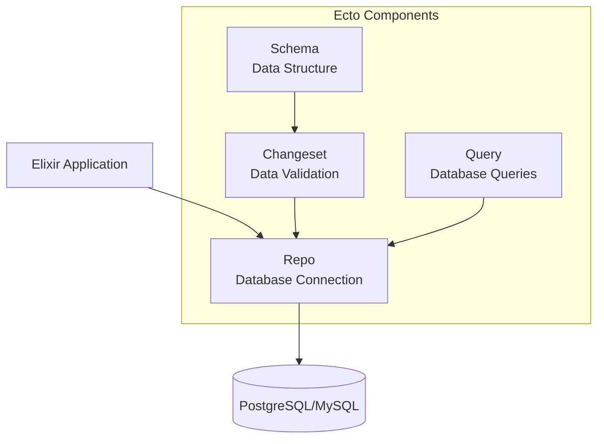
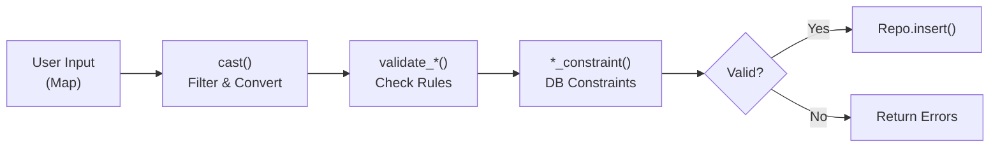
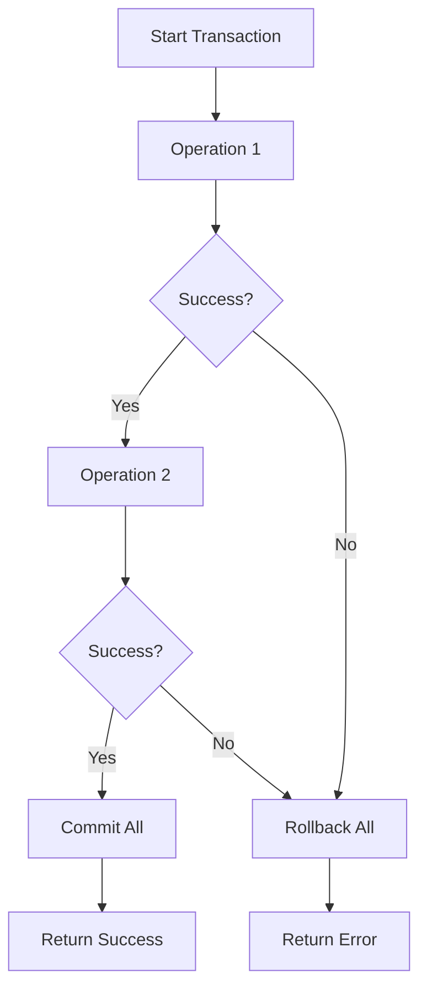

# How to Use Ecto for Database Operations in Elixir

Author: [nawazdhandala](https://www.github.com/nawazdhandala)

Tags: Elixir, Ecto, Database, ORM, PostgreSQL

Description: Learn how to use Ecto for database operations in Elixir including schemas, changesets, queries, associations, and migrations.

---

> Ecto is the database library for Elixir that provides a query DSL, schema definitions, changesets for data validation, and migrations. It is not an ORM in the traditional sense, but a toolkit that gives you complete control over your database interactions while keeping your code functional and composable.

---

## What is Ecto?

Ecto consists of four main components that work together:



- **Repo**: The database wrapper that executes queries
- **Schema**: Maps database tables to Elixir structs
- **Changeset**: Validates and tracks changes to data
- **Query**: Composes database queries using Elixir syntax

---

## Project Setup

### Add Dependencies

Add Ecto and your database adapter to your `mix.exs` file:

```elixir
# mix.exs
defp deps do
  [
    # Ecto with SQL support
    {:ecto_sql, "~> 3.11"},
    # PostgreSQL adapter (use :myxql for MySQL)
    {:postgrex, "~> 0.17"},
    # Optional: for UUID primary keys
    {:ecto_ulid, "~> 0.3"}
  ]
end
```

Install dependencies with:

```bash
mix deps.get
```

### Configure the Repo

Generate the Repo module and configuration:

```bash
# This creates lib/my_app/repo.ex and updates config files
mix ecto.gen.repo -r MyApp.Repo
```

The generated Repo module looks like this:

```elixir
# lib/my_app/repo.ex
defmodule MyApp.Repo do
  use Ecto.Repo,
    otp_app: :my_app,
    adapter: Ecto.Adapters.Postgres
end
```

### Database Configuration

Configure your database connection in `config/dev.exs`:

```elixir
# config/dev.exs
config :my_app, MyApp.Repo,
  username: "postgres",
  password: "postgres",
  hostname: "localhost",
  database: "my_app_dev",
  stacktrace: true,
  show_sensitive_data_on_connection_error: true,
  pool_size: 10

# config/prod.exs - use environment variables in production
config :my_app, MyApp.Repo,
  url: System.get_env("DATABASE_URL"),
  pool_size: String.to_integer(System.get_env("POOL_SIZE") || "10"),
  ssl: true,
  ssl_opts: [verify: :verify_none]
```

Add the Repo to your application supervision tree:

```elixir
# lib/my_app/application.ex
defmodule MyApp.Application do
  use Application

  def start(_type, _args) do
    children = [
      # Start the Repo before other processes that depend on it
      MyApp.Repo,
      # Your other workers and supervisors
    ]

    opts = [strategy: :one_for_one, name: MyApp.Supervisor]
    Supervisor.start_link(children, opts)
  end
end
```

Create the database:

```bash
mix ecto.create
```

---

## Schemas

Schemas define how Elixir structs map to database tables.

### Basic Schema

```elixir
# lib/my_app/accounts/user.ex
defmodule MyApp.Accounts.User do
  use Ecto.Schema
  import Ecto.Changeset

  # Define the schema that maps to the "users" table
  schema "users" do
    field :email, :string
    field :username, :string
    field :password_hash, :string
    field :is_active, :boolean, default: true
    field :role, :string, default: "user"

    # Virtual fields are not persisted to the database
    # Useful for form inputs that need processing before storage
    field :password, :string, virtual: true
    field :password_confirmation, :string, virtual: true

    # Automatically manages inserted_at and updated_at timestamps
    timestamps()
  end

  @doc """
  Creates a changeset for user registration.
  Validates required fields and hashes the password.
  """
  def registration_changeset(user, attrs) do
    user
    |> cast(attrs, [:email, :username, :password, :password_confirmation])
    |> validate_required([:email, :username, :password])
    |> validate_format(:email, ~r/^[^\s]+@[^\s]+$/, message: "must be a valid email")
    |> validate_length(:username, min: 3, max: 30)
    |> validate_length(:password, min: 8, max: 72)
    |> validate_confirmation(:password, message: "passwords do not match")
    |> unique_constraint(:email)
    |> unique_constraint(:username)
    |> hash_password()
  end

  # Private function to hash the password if present and valid
  defp hash_password(changeset) do
    case changeset do
      %Ecto.Changeset{valid?: true, changes: %{password: password}} ->
        put_change(changeset, :password_hash, Bcrypt.hash_pwd_salt(password))

      _ ->
        changeset
    end
  end
end
```

### Schema with Relationships

```elixir
# lib/my_app/blog/post.ex
defmodule MyApp.Blog.Post do
  use Ecto.Schema
  import Ecto.Changeset

  schema "posts" do
    field :title, :string
    field :body, :string
    field :slug, :string
    field :published_at, :utc_datetime
    field :view_count, :integer, default: 0

    # belongs_to creates an author_id foreign key field
    belongs_to :author, MyApp.Accounts.User

    # has_many defines the inverse relationship
    has_many :comments, MyApp.Blog.Comment

    # many_to_many uses a join table for the relationship
    many_to_many :tags, MyApp.Blog.Tag, join_through: "posts_tags"

    timestamps()
  end

  def changeset(post, attrs) do
    post
    |> cast(attrs, [:title, :body, :slug, :published_at, :author_id])
    |> validate_required([:title, :body, :author_id])
    |> validate_length(:title, min: 5, max: 200)
    |> validate_length(:body, min: 50)
    |> generate_slug()
    |> unique_constraint(:slug)
    |> foreign_key_constraint(:author_id)
  end

  # Generate URL-friendly slug from title
  defp generate_slug(changeset) do
    case get_change(changeset, :title) do
      nil ->
        changeset

      title ->
        slug =
          title
          |> String.downcase()
          |> String.replace(~r/[^\w\s-]/, "")
          |> String.replace(~r/\s+/, "-")
          |> String.slice(0, 100)

        put_change(changeset, :slug, slug)
    end
  end
end
```

---

## Migrations

Migrations define database schema changes that can be applied and rolled back.

### Generate a Migration

```bash
# Creates a new migration file with timestamp prefix
mix ecto.gen.migration create_users
```

### Write the Migration

```elixir
# priv/repo/migrations/20260126000001_create_users.exs
defmodule MyApp.Repo.Migrations.CreateUsers do
  use Ecto.Migration

  def change do
    # create/2 defines a new table
    # The change/0 function allows Ecto to automatically generate rollback
    create table(:users) do
      add :email, :string, null: false
      add :username, :string, null: false
      add :password_hash, :string, null: false
      add :is_active, :boolean, default: true, null: false
      add :role, :string, default: "user", null: false

      # timestamps() adds inserted_at and updated_at columns
      timestamps()
    end

    # Create indexes for frequently queried columns
    create unique_index(:users, [:email])
    create unique_index(:users, [:username])
    create index(:users, [:is_active])
  end
end
```

### Migration with Foreign Keys

```elixir
# priv/repo/migrations/20260126000002_create_posts.exs
defmodule MyApp.Repo.Migrations.CreatePosts do
  use Ecto.Migration

  def change do
    create table(:posts) do
      add :title, :string, null: false
      add :body, :text, null: false
      add :slug, :string, null: false
      add :published_at, :utc_datetime
      add :view_count, :integer, default: 0

      # references/2 creates a foreign key constraint
      # on_delete: :delete_all removes posts when user is deleted
      add :author_id, references(:users, on_delete: :delete_all), null: false

      timestamps()
    end

    create unique_index(:posts, [:slug])
    create index(:posts, [:author_id])
    create index(:posts, [:published_at])
  end
end
```

### Many-to-Many Join Table

```elixir
# priv/repo/migrations/20260126000003_create_posts_tags.exs
defmodule MyApp.Repo.Migrations.CreatePostsTags do
  use Ecto.Migration

  def change do
    create table(:tags) do
      add :name, :string, null: false
      add :slug, :string, null: false

      timestamps()
    end

    create unique_index(:tags, [:slug])

    # Join table for many-to-many relationship
    create table(:posts_tags, primary_key: false) do
      add :post_id, references(:posts, on_delete: :delete_all), null: false
      add :tag_id, references(:tags, on_delete: :delete_all), null: false
    end

    # Composite unique index prevents duplicate associations
    create unique_index(:posts_tags, [:post_id, :tag_id])
    create index(:posts_tags, [:tag_id])
  end
end
```

Run migrations:

```bash
# Run all pending migrations
mix ecto.migrate

# Rollback the last migration
mix ecto.rollback

# Rollback multiple migrations
mix ecto.rollback --step 3
```

---

## Changesets

Changesets validate and transform data before it reaches the database.



### Changeset Functions

```elixir
# lib/my_app/blog/comment.ex
defmodule MyApp.Blog.Comment do
  use Ecto.Schema
  import Ecto.Changeset

  schema "comments" do
    field :body, :string
    field :is_approved, :boolean, default: false

    belongs_to :post, MyApp.Blog.Post
    belongs_to :user, MyApp.Accounts.User

    timestamps()
  end

  @doc """
  Changeset for creating a new comment.
  Users can only set the body - approval is handled separately.
  """
  def create_changeset(comment, attrs) do
    comment
    # cast/3 filters and casts external data to schema types
    # Only fields listed here will be accepted from user input
    |> cast(attrs, [:body, :post_id, :user_id])
    # validate_required/2 ensures these fields have values
    |> validate_required([:body, :post_id, :user_id])
    # validate_length/3 checks string length bounds
    |> validate_length(:body, min: 10, max: 5000)
    # foreign_key_constraint/2 catches DB constraint violations
    |> foreign_key_constraint(:post_id)
    |> foreign_key_constraint(:user_id)
  end

  @doc """
  Changeset for moderators to approve/reject comments.
  Separate changeset ensures users cannot approve their own comments.
  """
  def moderation_changeset(comment, attrs) do
    comment
    |> cast(attrs, [:is_approved])
    |> validate_required([:is_approved])
  end
end
```

### Custom Validations

```elixir
defmodule MyApp.Accounts.Profile do
  use Ecto.Schema
  import Ecto.Changeset

  schema "profiles" do
    field :bio, :string
    field :website, :string
    field :birth_date, :date

    belongs_to :user, MyApp.Accounts.User

    timestamps()
  end

  def changeset(profile, attrs) do
    profile
    |> cast(attrs, [:bio, :website, :birth_date, :user_id])
    |> validate_length(:bio, max: 500)
    # Custom validation functions for complex rules
    |> validate_url(:website)
    |> validate_age(:birth_date, min_age: 13)
  end

  # Custom validation: check if website is a valid URL
  defp validate_url(changeset, field) do
    validate_change(changeset, field, fn _, value ->
      case URI.parse(value) do
        %URI{scheme: scheme, host: host}
        when scheme in ["http", "https"] and not is_nil(host) ->
          []

        _ ->
          [{field, "must be a valid URL starting with http:// or https://"}]
      end
    end)
  end

  # Custom validation: check minimum age based on birth date
  defp validate_age(changeset, field, opts) do
    min_age = Keyword.get(opts, :min_age, 0)

    validate_change(changeset, field, fn _, birth_date ->
      age = Date.diff(Date.utc_today(), birth_date) |> div(365)

      if age >= min_age do
        []
      else
        [{field, "you must be at least #{min_age} years old"}]
      end
    end)
  end
end
```

---

## Queries

Ecto provides a powerful query DSL that compiles to efficient SQL.

### Basic Queries

```elixir
defmodule MyApp.Accounts do
  import Ecto.Query
  alias MyApp.Repo
  alias MyApp.Accounts.User

  @doc """
  Fetch a user by ID. Returns nil if not found.
  """
  def get_user(id), do: Repo.get(User, id)

  @doc """
  Fetch a user by ID. Raises Ecto.NoResultsError if not found.
  Use this when the user must exist (e.g., authenticated routes).
  """
  def get_user!(id), do: Repo.get!(User, id)

  @doc """
  Fetch a user by email address.
  """
  def get_user_by_email(email) do
    Repo.get_by(User, email: email)
  end

  @doc """
  List all active users, ordered by creation date.
  """
  def list_active_users do
    User
    |> where([u], u.is_active == true)
    |> order_by([u], desc: u.inserted_at)
    |> Repo.all()
  end

  @doc """
  Search users by username or email.
  Uses ILIKE for case-insensitive partial matching.
  """
  def search_users(search_term) do
    search_pattern = "%#{search_term}%"

    User
    |> where([u], ilike(u.username, ^search_pattern) or ilike(u.email, ^search_pattern))
    |> order_by([u], asc: u.username)
    |> Repo.all()
  end
end
```

### Composable Queries

Build complex queries by composing smaller query functions:

```elixir
defmodule MyApp.Blog do
  import Ecto.Query
  alias MyApp.Repo
  alias MyApp.Blog.Post

  @doc """
  List posts with flexible filtering options.

  ## Options
    * `:published` - filter by publication status (true/false)
    * `:author_id` - filter by author
    * `:tag` - filter by tag name
    * `:search` - search in title and body
    * `:limit` - maximum number of results
    * `:offset` - number of results to skip
  """
  def list_posts(opts \\ []) do
    Post
    |> filter_by_published(opts[:published])
    |> filter_by_author(opts[:author_id])
    |> filter_by_tag(opts[:tag])
    |> filter_by_search(opts[:search])
    |> order_by([p], desc: p.published_at, desc: p.inserted_at)
    |> limit_results(opts[:limit])
    |> offset_results(opts[:offset])
    |> Repo.all()
  end

  # Each filter function returns a query, making them composable
  defp filter_by_published(query, nil), do: query

  defp filter_by_published(query, true) do
    where(query, [p], not is_nil(p.published_at) and p.published_at <= ^DateTime.utc_now())
  end

  defp filter_by_published(query, false) do
    where(query, [p], is_nil(p.published_at))
  end

  defp filter_by_author(query, nil), do: query
  defp filter_by_author(query, author_id), do: where(query, [p], p.author_id == ^author_id)

  defp filter_by_tag(query, nil), do: query

  defp filter_by_tag(query, tag_name) do
    query
    |> join(:inner, [p], t in assoc(p, :tags))
    |> where([p, t], t.name == ^tag_name)
  end

  defp filter_by_search(query, nil), do: query
  defp filter_by_search(query, ""), do: query

  defp filter_by_search(query, search_term) do
    pattern = "%#{search_term}%"
    where(query, [p], ilike(p.title, ^pattern) or ilike(p.body, ^pattern))
  end

  defp limit_results(query, nil), do: query
  defp limit_results(query, limit), do: limit(query, ^limit)

  defp offset_results(query, nil), do: query
  defp offset_results(query, offset), do: offset(query, ^offset)
end
```

### Preloading Associations

```elixir
defmodule MyApp.Blog do
  import Ecto.Query
  alias MyApp.Repo
  alias MyApp.Blog.Post

  @doc """
  Get a post with all its associations loaded.
  """
  def get_post_with_associations(id) do
    Post
    |> Repo.get(id)
    # preload/2 loads associations in separate queries
    |> Repo.preload([:author, :tags, comments: :user])
  end

  @doc """
  List posts with associations using a single query with joins.
  More efficient than separate preload queries for listing pages.
  """
  def list_posts_with_authors do
    Post
    # join and preload in the same query
    |> join(:left, [p], a in assoc(p, :author))
    |> preload([p, a], author: a)
    |> order_by([p], desc: p.published_at)
    |> Repo.all()
  end

  @doc """
  Get posts with comment counts using subquery.
  """
  def list_posts_with_comment_counts do
    # Subquery to count comments per post
    comment_counts =
      from c in MyApp.Blog.Comment,
        where: c.is_approved == true,
        group_by: c.post_id,
        select: %{post_id: c.post_id, count: count(c.id)}

    Post
    |> join(:left, [p], cc in subquery(comment_counts), on: p.id == cc.post_id)
    |> select([p, cc], %{post: p, comment_count: coalesce(cc.count, 0)})
    |> Repo.all()
  end
end
```

### Aggregations

```elixir
defmodule MyApp.Analytics do
  import Ecto.Query
  alias MyApp.Repo
  alias MyApp.Blog.Post

  @doc """
  Get total view count across all posts.
  """
  def total_views do
    Post
    |> select([p], sum(p.view_count))
    |> Repo.one()
    |> Kernel.||(0)
  end

  @doc """
  Get posting statistics grouped by month.
  """
  def posts_per_month do
    Post
    |> where([p], not is_nil(p.published_at))
    |> group_by([p], fragment("date_trunc('month', ?)", p.published_at))
    |> select([p], %{
      month: fragment("date_trunc('month', ?)", p.published_at),
      count: count(p.id),
      total_views: sum(p.view_count)
    })
    |> order_by([p], desc: fragment("date_trunc('month', ?)", p.published_at))
    |> Repo.all()
  end

  @doc """
  Get top authors by total views.
  """
  def top_authors(limit \\ 10) do
    Post
    |> join(:inner, [p], a in assoc(p, :author))
    |> group_by([p, a], a.id)
    |> select([p, a], %{
      author: a,
      post_count: count(p.id),
      total_views: sum(p.view_count)
    })
    |> order_by([p, a], desc: sum(p.view_count))
    |> limit(^limit)
    |> Repo.all()
  end
end
```

---

## CRUD Operations

### Create

```elixir
defmodule MyApp.Blog do
  alias MyApp.Repo
  alias MyApp.Blog.Post

  @doc """
  Creates a new post.
  Returns {:ok, post} on success or {:error, changeset} on failure.
  """
  def create_post(attrs) do
    %Post{}
    |> Post.changeset(attrs)
    |> Repo.insert()
  end

  @doc """
  Creates a post and associates it with tags.
  Uses Repo.transaction to ensure atomicity.
  """
  def create_post_with_tags(attrs, tag_names) do
    Repo.transaction(fn ->
      # First, create or get existing tags
      tags = Enum.map(tag_names, &get_or_create_tag/1)

      # Create the post with tag associations
      case create_post(attrs) do
        {:ok, post} ->
          # Update post with tag associations
          post
          |> Repo.preload(:tags)
          |> Post.changeset(%{})
          |> Ecto.Changeset.put_assoc(:tags, tags)
          |> Repo.update!()

        {:error, changeset} ->
          # Rollback transaction by raising
          Repo.rollback(changeset)
      end
    end)
  end

  defp get_or_create_tag(name) do
    slug = String.downcase(name) |> String.replace(" ", "-")

    case Repo.get_by(MyApp.Blog.Tag, slug: slug) do
      nil ->
        %MyApp.Blog.Tag{}
        |> MyApp.Blog.Tag.changeset(%{name: name, slug: slug})
        |> Repo.insert!()

      tag ->
        tag
    end
  end
end
```

### Read

```elixir
defmodule MyApp.Blog do
  import Ecto.Query
  alias MyApp.Repo
  alias MyApp.Blog.Post

  @doc """
  Gets a post by slug for public viewing.
  Only returns published posts.
  """
  def get_published_post_by_slug(slug) do
    now = DateTime.utc_now()

    Post
    |> where([p], p.slug == ^slug)
    |> where([p], not is_nil(p.published_at) and p.published_at <= ^now)
    |> Repo.one()
  end

  @doc """
  Gets a post by ID for editing.
  Verifies the current user owns the post.
  """
  def get_post_for_edit(id, user_id) do
    Post
    |> where([p], p.id == ^id and p.author_id == ^user_id)
    |> Repo.one()
  end

  @doc """
  Paginated list of posts.
  """
  def list_posts_paginated(page \\ 1, per_page \\ 20) do
    offset = (page - 1) * per_page

    posts =
      Post
      |> where([p], not is_nil(p.published_at))
      |> order_by([p], desc: p.published_at)
      |> limit(^per_page)
      |> offset(^offset)
      |> Repo.all()

    total_count =
      Post
      |> where([p], not is_nil(p.published_at))
      |> Repo.aggregate(:count)

    %{
      posts: posts,
      page: page,
      per_page: per_page,
      total_count: total_count,
      total_pages: ceil(total_count / per_page)
    }
  end
end
```

### Update

```elixir
defmodule MyApp.Blog do
  alias MyApp.Repo
  alias MyApp.Blog.Post

  @doc """
  Updates a post with new attributes.
  """
  def update_post(%Post{} = post, attrs) do
    post
    |> Post.changeset(attrs)
    |> Repo.update()
  end

  @doc """
  Publishes a post by setting the published_at timestamp.
  """
  def publish_post(%Post{} = post) do
    post
    |> Ecto.Changeset.change(published_at: DateTime.utc_now())
    |> Repo.update()
  end

  @doc """
  Increments the view count atomically.
  Uses Repo.update_all to avoid race conditions.
  """
  def increment_view_count(post_id) do
    from(p in Post, where: p.id == ^post_id)
    |> Repo.update_all(inc: [view_count: 1])
  end

  @doc """
  Bulk update: unpublish all posts by a specific author.
  """
  def unpublish_author_posts(author_id) do
    from(p in Post, where: p.author_id == ^author_id)
    |> Repo.update_all(set: [published_at: nil, updated_at: DateTime.utc_now()])
  end
end
```

### Delete

```elixir
defmodule MyApp.Blog do
  import Ecto.Query
  alias MyApp.Repo
  alias MyApp.Blog.Post

  @doc """
  Deletes a post.
  Associated comments are deleted via ON DELETE CASCADE in migration.
  """
  def delete_post(%Post{} = post) do
    Repo.delete(post)
  end

  @doc """
  Soft delete: marks post as deleted without removing from database.
  Useful for maintaining data history and recovery options.
  """
  def soft_delete_post(%Post{} = post) do
    post
    |> Ecto.Changeset.change(deleted_at: DateTime.utc_now())
    |> Repo.update()
  end

  @doc """
  Delete old unpublished drafts.
  """
  def cleanup_old_drafts(days_old \\ 90) do
    cutoff = DateTime.add(DateTime.utc_now(), -days_old * 24 * 60 * 60, :second)

    from(p in Post,
      where: is_nil(p.published_at),
      where: p.updated_at < ^cutoff
    )
    |> Repo.delete_all()
  end
end
```

---

## Transactions

Transactions ensure multiple database operations succeed or fail together.



### Basic Transaction

```elixir
defmodule MyApp.Accounts do
  alias MyApp.Repo
  alias MyApp.Accounts.{User, Profile}

  @doc """
  Creates a user with an associated profile in a single transaction.
  If either operation fails, both are rolled back.
  """
  def create_user_with_profile(user_attrs, profile_attrs) do
    Repo.transaction(fn ->
      # Create user first
      user =
        case create_user(user_attrs) do
          {:ok, user} -> user
          {:error, changeset} -> Repo.rollback(changeset)
        end

      # Create profile linked to user
      profile_attrs = Map.put(profile_attrs, :user_id, user.id)

      case create_profile(profile_attrs) do
        {:ok, profile} -> %{user: user, profile: profile}
        {:error, changeset} -> Repo.rollback(changeset)
      end
    end)
  end

  defp create_user(attrs) do
    %User{}
    |> User.registration_changeset(attrs)
    |> Repo.insert()
  end

  defp create_profile(attrs) do
    %Profile{}
    |> Profile.changeset(attrs)
    |> Repo.insert()
  end
end
```

### Multi for Complex Transactions

Ecto.Multi provides a cleaner way to compose transactional operations:

```elixir
defmodule MyApp.Orders do
  alias Ecto.Multi
  alias MyApp.Repo
  alias MyApp.Orders.{Order, OrderItem}
  alias MyApp.Inventory

  @doc """
  Creates an order with items and updates inventory.
  Uses Ecto.Multi for clean transaction composition.
  """
  def create_order(user_id, items) do
    Multi.new()
    # Step 1: Create the order record
    |> Multi.insert(:order, fn _ ->
      %Order{}
      |> Order.changeset(%{user_id: user_id, status: "pending"})
    end)
    # Step 2: Create order items (depends on order being created)
    |> Multi.run(:order_items, fn repo, %{order: order} ->
      order_items =
        Enum.map(items, fn item ->
          %OrderItem{}
          |> OrderItem.changeset(%{
            order_id: order.id,
            product_id: item.product_id,
            quantity: item.quantity,
            unit_price: item.price
          })
          |> repo.insert!()
        end)

      {:ok, order_items}
    end)
    # Step 3: Update inventory levels
    |> Multi.run(:inventory, fn repo, %{order_items: order_items} ->
      Enum.each(order_items, fn item ->
        Inventory.decrease_stock(item.product_id, item.quantity)
      end)

      {:ok, :inventory_updated}
    end)
    # Step 4: Calculate and update order total
    |> Multi.update(:update_total, fn %{order: order, order_items: items} ->
      total = Enum.reduce(items, Decimal.new(0), fn item, acc ->
        Decimal.add(acc, Decimal.mult(item.unit_price, item.quantity))
      end)

      Order.changeset(order, %{total: total})
    end)
    |> Repo.transaction()
    |> case do
      {:ok, %{order: order, order_items: items}} ->
        {:ok, Repo.preload(order, :order_items)}

      {:error, step, changeset, _changes} ->
        {:error, {step, changeset}}
    end
  end
end
```

---

## Best Practices

### Use Contexts to Organize Business Logic

```elixir
# lib/my_app/accounts.ex - Context module
defmodule MyApp.Accounts do
  @moduledoc """
  The Accounts context handles user management and authentication.
  All database operations for users and profiles go through this module.
  """

  import Ecto.Query
  alias MyApp.Repo
  alias MyApp.Accounts.User

  # Public API functions that other parts of your app can call
  def get_user(id), do: Repo.get(User, id)
  def get_user!(id), do: Repo.get!(User, id)
  def get_user_by_email(email), do: Repo.get_by(User, email: email)

  def list_users(opts \\ []) do
    User
    |> apply_filters(opts)
    |> Repo.all()
  end

  def create_user(attrs) do
    %User{}
    |> User.registration_changeset(attrs)
    |> Repo.insert()
  end

  # Keep query logic private within the context
  defp apply_filters(query, opts) do
    Enum.reduce(opts, query, fn
      {:active, true}, query -> where(query, [u], u.is_active == true)
      {:active, false}, query -> where(query, [u], u.is_active == false)
      {:role, role}, query -> where(query, [u], u.role == ^role)
      _, query -> query
    end)
  end
end
```

### Handle Errors Gracefully

```elixir
defmodule MyApp.Blog do
  alias MyApp.Repo
  alias MyApp.Blog.Post

  @doc """
  Creates a post with proper error handling.
  """
  def create_post(attrs) do
    case %Post{} |> Post.changeset(attrs) |> Repo.insert() do
      {:ok, post} ->
        # Success: return the created post
        {:ok, post}

      {:error, %Ecto.Changeset{} = changeset} ->
        # Validation error: return structured error info
        {:error, format_changeset_errors(changeset)}
    end
  end

  # Convert changeset errors to a readable format
  defp format_changeset_errors(changeset) do
    Ecto.Changeset.traverse_errors(changeset, fn {msg, opts} ->
      Regex.replace(~r"%{(\w+)}", msg, fn _, key ->
        opts |> Keyword.get(String.to_existing_atom(key), key) |> to_string()
      end)
    end)
  end
end
```

### Use Database Constraints

```elixir
defmodule MyApp.Blog.Post do
  use Ecto.Schema
  import Ecto.Changeset

  schema "posts" do
    field :title, :string
    field :slug, :string
    belongs_to :author, MyApp.Accounts.User
    timestamps()
  end

  def changeset(post, attrs) do
    post
    |> cast(attrs, [:title, :slug, :author_id])
    |> validate_required([:title, :author_id])
    # Validations run in application
    |> validate_length(:title, min: 5, max: 200)
    # Constraints check database rules - catch violations gracefully
    |> unique_constraint(:slug, message: "this slug is already taken")
    |> foreign_key_constraint(:author_id, message: "author does not exist")
    # Check constraint for custom database rules
    |> check_constraint(:title, name: :title_not_empty, message: "title cannot be blank")
  end
end
```

---

## Conclusion

Ecto provides a powerful and flexible toolkit for database operations in Elixir:

- **Schemas** define the shape of your data and map to database tables
- **Changesets** validate and transform data before it reaches the database
- **Queries** compose efficiently using Elixir's pipe operator
- **Migrations** version control your database schema
- **Transactions** ensure data consistency across multiple operations

The key to effective Ecto usage is understanding that it is not hiding the database from you. Instead, it gives you explicit control while providing safety through the type system and validation layer.

Start with simple schemas and queries, then gradually adopt more advanced patterns like composable queries and Ecto.Multi as your application grows.

---

*Building applications with Elixir and Ecto? [OneUptime](https://oneuptime.com) provides comprehensive monitoring for your Elixir applications, including database performance tracking and query analysis.*
