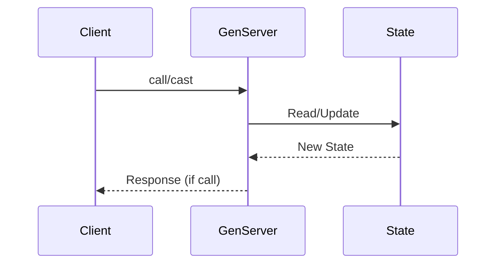
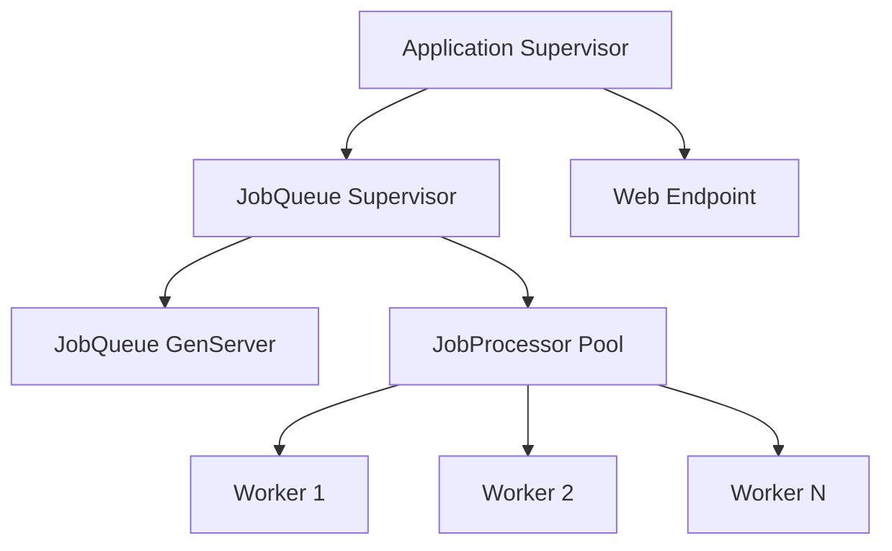

# How to Use GenServers for Background Processing

Author: [nawazdhandala](https://www.github.com/nawazdhandala)

Tags: Elixir, GenServer, Background Processing, OTP, Concurrency, Functional Programming

Description: Learn how to use GenServers in Elixir for background processing. This guide covers GenServer basics, state management, async task processing, supervision trees, and production patterns for building reliable background workers.

---

> GenServers are the workhorses of Elixir applications. They provide a simple abstraction for managing state and handling background work, all while leveraging the battle-tested Erlang OTP framework that has powered telecom systems for decades.

If you have ever needed to process jobs in the background, manage a cache, or maintain stateful connections, GenServers are your go-to tool. This guide walks through practical patterns for using GenServers to build reliable background processing systems.

---

## What is a GenServer?

A GenServer (Generic Server) is an OTP behavior that abstracts the common patterns of a server process. It handles the boilerplate of receiving messages, maintaining state, and responding to clients.



Think of a GenServer as a process that:
- Holds state between function calls
- Processes messages one at a time (no race conditions)
- Can be supervised and restarted on failure
- Provides both synchronous and asynchronous interfaces

---

## Your First GenServer

Let us start with a simple job queue that processes tasks in the background.

```elixir
# lib/my_app/job_queue.ex
defmodule MyApp.JobQueue do
  use GenServer

  # Client API - these functions run in the caller's process
  # They provide a clean interface for interacting with the GenServer

  @doc """
  Starts the job queue process and links it to the caller.
  """
  def start_link(opts \\ []) do
    # The name option registers this process globally
    name = Keyword.get(opts, :name, __MODULE__)
    GenServer.start_link(__MODULE__, [], name: name)
  end

  @doc """
  Adds a job to the queue for background processing.
  Returns immediately without waiting for the job to complete.
  """
  def enqueue(server \\ __MODULE__, job) do
    # cast is async - fire and forget
    GenServer.cast(server, {:enqueue, job})
  end

  @doc """
  Returns the current number of pending jobs.
  Blocks until the server responds.
  """
  def pending_count(server \\ __MODULE__) do
    # call is sync - waits for response
    GenServer.call(server, :pending_count)
  end

  @doc """
  Returns all pending jobs without removing them.
  """
  def list_jobs(server \\ __MODULE__) do
    GenServer.call(server, :list_jobs)
  end

  # Server callbacks - these run in the GenServer process
  # They handle the actual work and state management

  @impl true
  def init(_opts) do
    # Initialize with an empty queue
    # The state is a simple list of jobs
    {:ok, []}
  end

  @impl true
  def handle_cast({:enqueue, job}, jobs) do
    # Add job to the end of the queue
    # Then trigger processing
    new_jobs = jobs ++ [job]
    send(self(), :process_next)
    {:noreply, new_jobs}
  end

  @impl true
  def handle_call(:pending_count, _from, jobs) do
    # Return the count and keep state unchanged
    {:reply, length(jobs), jobs}
  end

  @impl true
  def handle_call(:list_jobs, _from, jobs) do
    {:reply, jobs, jobs}
  end

  @impl true
  def handle_info(:process_next, []) do
    # No jobs to process
    {:noreply, []}
  end

  @impl true
  def handle_info(:process_next, [job | remaining]) do
    # Process the first job
    process_job(job)

    # Schedule next job if queue is not empty
    if remaining != [] do
      send(self(), :process_next)
    end

    {:noreply, remaining}
  end

  # Private helper to process individual jobs
  defp process_job(job) do
    IO.puts("Processing job: #{inspect(job)}")
    # Simulate work
    Process.sleep(100)
  end
end
```

Using the job queue is straightforward:

```elixir
# Start the queue (typically done by a supervisor)
{:ok, _pid} = MyApp.JobQueue.start_link()

# Enqueue some jobs
MyApp.JobQueue.enqueue(%{type: :email, to: "user@example.com"})
MyApp.JobQueue.enqueue(%{type: :notification, user_id: 123})

# Check pending count
MyApp.JobQueue.pending_count()
# => 2 (or fewer if processing has started)
```

---

## Understanding GenServer Callbacks

GenServers have three main types of callbacks for handling different message patterns.

| Callback | Triggered By | Returns | Use Case |
|----------|--------------|---------|----------|
| `handle_call/3` | `GenServer.call/2` | `{:reply, response, state}` | Synchronous requests that need a response |
| `handle_cast/2` | `GenServer.cast/2` | `{:noreply, state}` | Async requests where you do not need a response |
| `handle_info/2` | Direct messages (`send/2`) | `{:noreply, state}` | Timeouts, process messages, external events |

Let us expand our job queue to use all three patterns effectively.

```elixir
# lib/my_app/advanced_job_queue.ex
defmodule MyApp.AdvancedJobQueue do
  use GenServer
  require Logger

  # Define the state structure clearly
  defstruct jobs: :queue.new(),
            processing: nil,
            processed_count: 0,
            failed_count: 0

  # Client API

  def start_link(opts \\ []) do
    name = Keyword.get(opts, :name, __MODULE__)
    GenServer.start_link(__MODULE__, opts, name: name)
  end

  @doc """
  Enqueues a job and returns immediately.
  """
  def enqueue(server \\ __MODULE__, job) do
    GenServer.cast(server, {:enqueue, job})
  end

  @doc """
  Enqueues a job and waits for confirmation.
  Returns the position in queue.
  """
  def enqueue_sync(server \\ __MODULE__, job) do
    GenServer.call(server, {:enqueue_sync, job})
  end

  @doc """
  Gets queue statistics.
  """
  def stats(server \\ __MODULE__) do
    GenServer.call(server, :stats)
  end

  @doc """
  Pauses job processing.
  """
  def pause(server \\ __MODULE__) do
    GenServer.call(server, :pause)
  end

  @doc """
  Resumes job processing.
  """
  def resume(server \\ __MODULE__) do
    GenServer.call(server, :resume)
  end

  # Server callbacks

  @impl true
  def init(opts) do
    # Start processing loop after a short delay
    # This gives the supervisor time to finish setup
    Process.send_after(self(), :tick, 100)

    state = %__MODULE__{
      jobs: :queue.new()
    }

    {:ok, state}
  end

  @impl true
  def handle_cast({:enqueue, job}, state) do
    # Add to queue without blocking caller
    new_queue = :queue.in(job, state.jobs)
    {:noreply, %{state | jobs: new_queue}}
  end

  @impl true
  def handle_call({:enqueue_sync, job}, _from, state) do
    new_queue = :queue.in(job, state.jobs)
    position = :queue.len(new_queue)
    {:reply, {:ok, position}, %{state | jobs: new_queue}}
  end

  @impl true
  def handle_call(:stats, _from, state) do
    stats = %{
      pending: :queue.len(state.jobs),
      processing: state.processing != nil,
      processed: state.processed_count,
      failed: state.failed_count
    }
    {:reply, stats, state}
  end

  @impl true
  def handle_call(:pause, _from, state) do
    # Cancel the next tick by setting a flag
    {:reply, :ok, Map.put(state, :paused, true)}
  end

  @impl true
  def handle_call(:resume, _from, state) do
    # Resume processing
    send(self(), :tick)
    {:reply, :ok, Map.delete(state, :paused)}
  end

  @impl true
  def handle_info(:tick, %{paused: true} = state) do
    # Do not process when paused
    {:noreply, state}
  end

  @impl true
  def handle_info(:tick, state) do
    state = process_next_job(state)

    # Schedule next tick
    # Adjust interval based on queue depth for efficiency
    interval = if :queue.is_empty(state.jobs), do: 1000, else: 10
    Process.send_after(self(), :tick, interval)

    {:noreply, state}
  end

  @impl true
  def handle_info({:job_complete, job, :ok}, state) do
    Logger.info("Job completed: #{inspect(job)}")
    {:noreply, %{state |
      processing: nil,
      processed_count: state.processed_count + 1
    }}
  end

  @impl true
  def handle_info({:job_complete, job, {:error, reason}}, state) do
    Logger.error("Job failed: #{inspect(job)}, reason: #{inspect(reason)}")
    {:noreply, %{state |
      processing: nil,
      failed_count: state.failed_count + 1
    }}
  end

  # Private functions

  defp process_next_job(%{processing: current} = state) when current != nil do
    # Already processing a job, skip
    state
  end

  defp process_next_job(state) do
    case :queue.out(state.jobs) do
      {:empty, _} ->
        state

      {{:value, job}, remaining} ->
        # Process job asynchronously
        parent = self()
        spawn(fn ->
          result = execute_job(job)
          send(parent, {:job_complete, job, result})
        end)

        %{state | jobs: remaining, processing: job}
    end
  end

  defp execute_job(job) do
    try do
      # Your actual job processing logic here
      process_job(job)
      :ok
    rescue
      error ->
        {:error, error}
    end
  end

  defp process_job(%{type: :email} = job) do
    Logger.info("Sending email to #{job.to}")
    # Simulate email sending
    Process.sleep(500)
  end

  defp process_job(%{type: :webhook} = job) do
    Logger.info("Sending webhook to #{job.url}")
    # Simulate webhook
    Process.sleep(200)
  end

  defp process_job(job) do
    Logger.info("Processing generic job: #{inspect(job)}")
    Process.sleep(100)
  end
end
```

---

## Supervision Trees for Reliability

GenServers become truly powerful when combined with supervisors. A supervisor monitors child processes and restarts them when they crash.



Here is how to set up a supervision tree for background processing:

```elixir
# lib/my_app/application.ex
defmodule MyApp.Application do
  use Application

  @impl true
  def start(_type, _args) do
    children = [
      # Start the job queue supervisor
      # This will manage the queue and its workers
      MyApp.BackgroundSupervisor,

      # Other application children
      MyAppWeb.Endpoint
    ]

    opts = [strategy: :one_for_one, name: MyApp.Supervisor]
    Supervisor.start_link(children, opts)
  end
end
```

```elixir
# lib/my_app/background_supervisor.ex
defmodule MyApp.BackgroundSupervisor do
  use Supervisor

  def start_link(opts) do
    Supervisor.start_link(__MODULE__, opts, name: __MODULE__)
  end

  @impl true
  def init(_opts) do
    children = [
      # The job queue itself
      {MyApp.AdvancedJobQueue, name: MyApp.AdvancedJobQueue},

      # A pool of workers for CPU-intensive tasks
      {MyApp.WorkerPool, pool_size: 5},

      # Scheduled job runner
      {MyApp.Scheduler, []}
    ]

    # rest_for_one means if the queue crashes,
    # restart workers too since they depend on it
    Supervisor.init(children, strategy: :rest_for_one)
  end
end
```

---

## Building a Worker Pool

For CPU-bound tasks or when you need to limit concurrency, implement a worker pool using GenServers.

```elixir
# lib/my_app/worker_pool.ex
defmodule MyApp.WorkerPool do
  use Supervisor

  def start_link(opts) do
    pool_size = Keyword.get(opts, :pool_size, 5)
    Supervisor.start_link(__MODULE__, pool_size, name: __MODULE__)
  end

  @impl true
  def init(pool_size) do
    # Create N worker children
    children =
      for i <- 1..pool_size do
        # Each worker gets a unique ID
        Supervisor.child_spec(
          {MyApp.Worker, name: worker_name(i)},
          id: {MyApp.Worker, i}
        )
      end

    Supervisor.init(children, strategy: :one_for_one)
  end

  @doc """
  Finds an available worker and assigns a task.
  Returns {:ok, result} or {:error, :no_workers_available}.
  """
  def run(task, timeout \\ 5000) do
    case find_available_worker() do
      nil ->
        {:error, :no_workers_available}

      worker ->
        MyApp.Worker.run(worker, task, timeout)
    end
  end

  @doc """
  Runs a task asynchronously.
  Returns :ok immediately.
  """
  def run_async(task) do
    case find_available_worker() do
      nil ->
        {:error, :no_workers_available}

      worker ->
        MyApp.Worker.run_async(worker, task)
    end
  end

  # Private helpers

  defp worker_name(index) do
    :"#{__MODULE__}.Worker.#{index}"
  end

  defp find_available_worker do
    # Get all worker PIDs from the supervisor
    Supervisor.which_children(__MODULE__)
    |> Enum.find_value(fn {_id, pid, _type, _modules} ->
      if MyApp.Worker.available?(pid), do: pid
    end)
  end
end
```

```elixir
# lib/my_app/worker.ex
defmodule MyApp.Worker do
  use GenServer
  require Logger

  defstruct status: :idle, current_task: nil

  # Client API

  def start_link(opts) do
    name = Keyword.fetch!(opts, :name)
    GenServer.start_link(__MODULE__, [], name: name)
  end

  def available?(worker) do
    GenServer.call(worker, :available?)
  end

  def run(worker, task, timeout \\ 5000) do
    GenServer.call(worker, {:run, task}, timeout)
  end

  def run_async(worker, task) do
    GenServer.cast(worker, {:run_async, task})
  end

  # Server callbacks

  @impl true
  def init(_opts) do
    {:ok, %__MODULE__{}}
  end

  @impl true
  def handle_call(:available?, _from, state) do
    {:reply, state.status == :idle, state}
  end

  @impl true
  def handle_call({:run, task}, _from, state) do
    # Mark as busy
    state = %{state | status: :busy, current_task: task}

    # Execute the task synchronously
    result = execute_task(task)

    # Mark as idle
    state = %{state | status: :idle, current_task: nil}

    {:reply, result, state}
  end

  @impl true
  def handle_cast({:run_async, task}, state) do
    state = %{state | status: :busy, current_task: task}

    # Execute in a spawned process to not block the GenServer
    parent = self()
    spawn(fn ->
      result = execute_task(task)
      send(parent, {:task_complete, result})
    end)

    {:noreply, state}
  end

  @impl true
  def handle_info({:task_complete, _result}, state) do
    {:noreply, %{state | status: :idle, current_task: nil}}
  end

  # Task execution

  defp execute_task(%{handler: handler, args: args}) do
    try do
      result = apply(handler, args)
      {:ok, result}
    rescue
      error ->
        Logger.error("Task failed: #{inspect(error)}")
        {:error, error}
    end
  end

  defp execute_task(fun) when is_function(fun, 0) do
    try do
      result = fun.()
      {:ok, result}
    rescue
      error ->
        {:error, error}
    end
  end
end
```

---

## Scheduled Background Tasks

Many applications need periodic background tasks. Here is a GenServer-based scheduler:

```elixir
# lib/my_app/scheduler.ex
defmodule MyApp.Scheduler do
  use GenServer
  require Logger

  @doc """
  Starts the scheduler with a list of scheduled tasks.
  Each task is a map with :name, :interval (ms), and :function.
  """
  def start_link(opts) do
    GenServer.start_link(__MODULE__, opts, name: __MODULE__)
  end

  @doc """
  Adds a new scheduled task at runtime.
  """
  def schedule(name, interval, fun) do
    GenServer.call(__MODULE__, {:schedule, name, interval, fun})
  end

  @doc """
  Removes a scheduled task.
  """
  def unschedule(name) do
    GenServer.call(__MODULE__, {:unschedule, name})
  end

  @doc """
  Lists all scheduled tasks and their next run time.
  """
  def list_tasks do
    GenServer.call(__MODULE__, :list_tasks)
  end

  # Server implementation

  @impl true
  def init(_opts) do
    # Define default scheduled tasks
    tasks = %{
      cleanup_old_jobs: %{
        interval: :timer.minutes(30),
        function: &cleanup_old_jobs/0,
        next_run: System.monotonic_time(:millisecond) + :timer.minutes(30)
      },
      health_check: %{
        interval: :timer.seconds(60),
        function: &run_health_check/0,
        next_run: System.monotonic_time(:millisecond) + :timer.seconds(60)
      }
    }

    # Start the scheduler loop
    schedule_tick()

    {:ok, tasks}
  end

  @impl true
  def handle_call({:schedule, name, interval, fun}, _from, tasks) do
    task = %{
      interval: interval,
      function: fun,
      next_run: System.monotonic_time(:millisecond) + interval
    }

    {:reply, :ok, Map.put(tasks, name, task)}
  end

  @impl true
  def handle_call({:unschedule, name}, _from, tasks) do
    {:reply, :ok, Map.delete(tasks, name)}
  end

  @impl true
  def handle_call(:list_tasks, _from, tasks) do
    now = System.monotonic_time(:millisecond)

    task_list =
      Enum.map(tasks, fn {name, task} ->
        %{
          name: name,
          interval: task.interval,
          next_run_in: max(0, task.next_run - now)
        }
      end)

    {:reply, task_list, tasks}
  end

  @impl true
  def handle_info(:tick, tasks) do
    now = System.monotonic_time(:millisecond)

    # Run any tasks that are due
    tasks =
      Enum.reduce(tasks, tasks, fn {name, task}, acc ->
        if task.next_run <= now do
          run_scheduled_task(name, task.function)

          # Update next run time
          updated_task = %{task | next_run: now + task.interval}
          Map.put(acc, name, updated_task)
        else
          acc
        end
      end)

    schedule_tick()
    {:noreply, tasks}
  end

  # Private helpers

  defp schedule_tick do
    # Check every second for due tasks
    Process.send_after(self(), :tick, 1000)
  end

  defp run_scheduled_task(name, fun) do
    # Run in a separate process to not block the scheduler
    spawn(fn ->
      Logger.info("Running scheduled task: #{name}")

      try do
        fun.()
        Logger.info("Scheduled task completed: #{name}")
      rescue
        error ->
          Logger.error("Scheduled task failed: #{name}, error: #{inspect(error)}")
      end
    end)
  end

  # Default scheduled tasks

  defp cleanup_old_jobs do
    # Clean up jobs older than 7 days
    cutoff = DateTime.add(DateTime.utc_now(), -7, :day)
    # MyApp.Jobs.delete_completed_before(cutoff)
    Logger.info("Cleaned up old jobs before #{cutoff}")
  end

  defp run_health_check do
    # Check external services
    # MyApp.HealthCheck.run_all()
    Logger.debug("Health check completed")
  end
end
```

---

## Handling Timeouts and Long-Running Tasks

GenServers have a default timeout of 5 seconds for `call` operations. For long-running tasks, you have several options.

```elixir
defmodule MyApp.LongRunningTasks do
  use GenServer

  # Option 1: Increase the timeout
  def process_large_file(server, file_path) do
    # Increase timeout to 60 seconds
    GenServer.call(server, {:process_file, file_path}, 60_000)
  end

  # Option 2: Use async pattern with a reference
  def process_async(server, task) do
    GenServer.call(server, {:process_async, task})
  end

  def get_result(server, ref, timeout \\ 5000) do
    GenServer.call(server, {:get_result, ref}, timeout)
  end

  @impl true
  def init(_) do
    {:ok, %{results: %{}, in_progress: %{}}}
  end

  @impl true
  def handle_call({:process_async, task}, _from, state) do
    # Generate a unique reference for this task
    ref = make_ref()
    parent = self()

    # Start async processing
    spawn(fn ->
      result = do_heavy_work(task)
      send(parent, {:result_ready, ref, result})
    end)

    # Track in-progress task
    state = put_in(state.in_progress[ref], task)

    # Return ref immediately so caller can poll for result
    {:reply, {:ok, ref}, state}
  end

  @impl true
  def handle_call({:get_result, ref}, _from, state) do
    case Map.get(state.results, ref) do
      nil ->
        # Not ready yet
        {:reply, {:pending, ref}, state}

      result ->
        # Clean up and return result
        state = update_in(state.results, &Map.delete(&1, ref))
        {:reply, {:ok, result}, state}
    end
  end

  @impl true
  def handle_info({:result_ready, ref, result}, state) do
    # Store result and clean up in-progress tracking
    state = put_in(state.results[ref], result)
    state = update_in(state.in_progress, &Map.delete(&1, ref))
    {:noreply, state}
  end

  defp do_heavy_work(task) do
    # Simulate heavy processing
    Process.sleep(10_000)
    {:processed, task}
  end
end
```

---

## Production Best Practices

When deploying GenServers in production, keep these patterns in mind:

### 1. Use Telemetry for Monitoring

```elixir
defmodule MyApp.InstrumentedQueue do
  use GenServer

  @impl true
  def handle_cast({:enqueue, job}, state) do
    # Emit telemetry event
    :telemetry.execute(
      [:my_app, :job_queue, :enqueue],
      %{count: 1},
      %{job_type: job.type}
    )

    # ... rest of implementation
    {:noreply, state}
  end
end
```

### 2. Handle Graceful Shutdown

```elixir
@impl true
def init(_) do
  # Trap exits to get terminate callback
  Process.flag(:trap_exit, true)
  {:ok, initial_state()}
end

@impl true
def terminate(reason, state) do
  # Save pending jobs to persistent storage
  save_pending_jobs(state.jobs)

  # Log shutdown reason
  Logger.info("Queue shutting down: #{inspect(reason)}")

  :ok
end
```

### 3. Limit Memory Growth

```elixir
@max_queue_size 10_000

@impl true
def handle_cast({:enqueue, job}, state) do
  current_size = :queue.len(state.jobs)

  if current_size >= @max_queue_size do
    Logger.warning("Queue full, dropping job")
    {:noreply, state}
  else
    new_queue = :queue.in(job, state.jobs)
    {:noreply, %{state | jobs: new_queue}}
  end
end
```

---

## Testing GenServers

Testing GenServers is straightforward because they are just processes.

```elixir
# test/my_app/job_queue_test.exs
defmodule MyApp.JobQueueTest do
  use ExUnit.Case, async: true

  alias MyApp.JobQueue

  setup do
    # Start a fresh queue for each test
    # Use a unique name to allow parallel tests
    name = :"queue_#{:erlang.unique_integer()}"
    {:ok, pid} = JobQueue.start_link(name: name)

    %{queue: name, pid: pid}
  end

  test "enqueues and processes jobs", %{queue: queue} do
    # Enqueue a job
    :ok = JobQueue.enqueue(queue, %{type: :test, id: 1})

    # Wait for processing
    Process.sleep(200)

    # Verify it was processed
    assert JobQueue.pending_count(queue) == 0
  end

  test "handles multiple jobs in order", %{queue: queue} do
    # Enqueue multiple jobs
    for i <- 1..5 do
      JobQueue.enqueue(queue, %{type: :test, id: i})
    end

    # Check they are queued
    assert JobQueue.pending_count(queue) == 5
  end

  test "survives crashes and restarts", %{pid: pid} do
    # This tests the supervisor - simulate a crash
    Process.exit(pid, :kill)

    # Wait for supervisor to restart
    Process.sleep(100)

    # Verify a new process is running
    # (Would need supervisor setup for this to work)
  end
end
```

---

## Conclusion

GenServers provide a solid foundation for background processing in Elixir. The key takeaways:

- **State isolation**: Each GenServer maintains its own state, preventing race conditions
- **Supervision**: Combine GenServers with supervisors for automatic recovery from failures
- **Async patterns**: Use `cast` for fire-and-forget, `call` for synchronous operations
- **Scalability**: Build worker pools to control concurrency and resource usage
- **Observability**: Add telemetry events for monitoring in production

The Erlang VM has been running background processing systems for telecommunications for over 30 years. When you use GenServers, you benefit from that battle-tested infrastructure.

---

*Running background workers in production? [OneUptime](https://oneuptime.com) provides comprehensive monitoring, alerting, and status pages to keep your Elixir applications running reliably.*

**Related Reading:**
- [How to Build a REST API with Phoenix Framework](https://oneuptime.com/blog/post/2026-01-26-phoenix-elixir-rest-api/view)
- [How to Use Phoenix LiveView for Real-Time UIs](https://oneuptime.com/blog/post/2026-01-26-phoenix-liveview-realtime/view)
