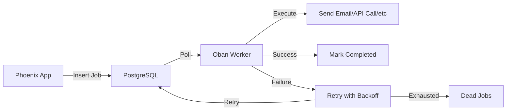

# How to Implement Background Jobs with Oban in Elixir

Author: [nawazdhandala](https://www.github.com/nawazdhandala)

Tags: Elixir, Oban, Background Jobs, Job Queue, Phoenix, PostgreSQL, Async Processing

Description: A practical guide to implementing background jobs with Oban in Elixir applications. Learn how to set up workers, handle retries, schedule jobs, manage queues, and monitor job processing in production.

---

Background jobs are fundamental to any production application. Sending emails, processing uploads, syncing with external APIs, generating reports - these tasks should not block your users. In Elixir, Oban has become the standard solution for reliable background job processing, and for good reason.

Unlike Redis-backed job systems, Oban uses PostgreSQL as its job store. This means your jobs have the same ACID guarantees as your application data. No more worrying about Redis going down and losing your job queue, or dealing with the complexity of running another infrastructure component.

## Why Oban?

Oban stands out in the Elixir ecosystem for several reasons:

| Feature | Benefit |
|---------|---------|
| **PostgreSQL-backed** | Jobs are stored in your existing database with full transaction support |
| **ACID Guarantees** | Jobs are part of your database transactions - commit together, rollback together |
| **Unique Jobs** | Built-in deduplication prevents duplicate processing |
| **Scheduled Jobs** | Schedule jobs for future execution with precision |
| **Cron-like Scheduling** | Run recurring jobs on a schedule |
| **Telemetry Integration** | Full observability into job execution |
| **Pruning** | Automatic cleanup of old completed jobs |

Here is how Oban fits into a typical Phoenix application:



---

## Setting Up Oban

Add Oban to your dependencies in `mix.exs`:

```elixir
# mix.exs
defp deps do
  [
    {:oban, "~> 2.17"},
    # Optional: Web UI for monitoring (requires license for production)
    # {:oban_web, "~> 2.10"}
  ]
end
```

Run `mix deps.get` and then generate the migration for Oban's job table:

```bash
# Generate the migration
mix ecto.gen.migration add_oban_jobs_table
```

Edit the generated migration to use Oban's migration module:

```elixir
# priv/repo/migrations/20260126000001_add_oban_jobs_table.exs
defmodule MyApp.Repo.Migrations.AddObanJobsTable do
  use Ecto.Migration

  def up do
    # Create the oban_jobs table and indexes
    Oban.Migration.up(version: 12)
  end

  def down do
    # Remove the oban_jobs table
    Oban.Migration.down(version: 1)
  end
end
```

Run the migration:

```bash
mix ecto.migrate
```

Now configure Oban in your application config:

```elixir
# config/config.exs
config :my_app, Oban,
  repo: MyApp.Repo,
  queues: [
    default: 10,      # 10 concurrent jobs in the default queue
    mailers: 20,      # 20 concurrent jobs for sending emails
    webhooks: 5,      # 5 concurrent jobs for webhook delivery
    reports: 2        # 2 concurrent jobs for heavy report generation
  ],
  plugins: [
    # Prune completed jobs older than 7 days
    {Oban.Plugins.Pruner, max_age: 60 * 60 * 24 * 7},
    # Rescue stuck jobs (jobs that were running when the node crashed)
    {Oban.Plugins.Lifeline, rescue_after: :timer.minutes(30)},
    # Optional: Stager for better job distribution
    Oban.Plugins.Stager
  ]
```

Add Oban to your application supervision tree:

```elixir
# lib/my_app/application.ex
defmodule MyApp.Application do
  use Application

  @impl true
  def start(_type, _args) do
    children = [
      MyApp.Repo,
      MyAppWeb.Telemetry,
      {Phoenix.PubSub, name: MyApp.PubSub},
      # Add Oban to the supervision tree
      {Oban, Application.fetch_env!(:my_app, Oban)},
      MyAppWeb.Endpoint
    ]

    opts = [strategy: :one_for_one, name: MyApp.Supervisor]
    Supervisor.start_link(children, opts)
  end
end
```

---

## Creating Your First Worker

Oban workers are modules that define how to process a specific type of job. Let us create a worker that sends welcome emails:

```elixir
# lib/my_app/workers/welcome_email_worker.ex
defmodule MyApp.Workers.WelcomeEmailWorker do
  @moduledoc """
  Worker that sends welcome emails to new users.
  Runs in the mailers queue with up to 3 retry attempts.
  """

  use Oban.Worker,
    queue: :mailers,
    max_attempts: 3,
    # Use unique constraints to prevent duplicate emails
    unique: [period: 300, fields: [:args, :queue]]

  alias MyApp.Accounts
  alias MyApp.Mailer

  @impl Oban.Worker
  def perform(%Oban.Job{args: %{"user_id" => user_id}}) do
    # Fetch the user - they might have been deleted since job was enqueued
    case Accounts.get_user(user_id) do
      nil ->
        # User no longer exists, nothing to do
        # Return :ok to mark job as completed (not failed)
        :ok

      user ->
        # Send the welcome email
        user
        |> MyApp.Emails.welcome_email()
        |> Mailer.deliver()

        :ok
    end
  end
end
```

Enqueue jobs from anywhere in your application:

```elixir
# In a controller after user registration
defmodule MyAppWeb.UserController do
  use MyAppWeb, :controller

  alias MyApp.Accounts
  alias MyApp.Workers.WelcomeEmailWorker

  def create(conn, %{"user" => user_params}) do
    case Accounts.create_user(user_params) do
      {:ok, user} ->
        # Enqueue the welcome email job
        %{user_id: user.id}
        |> WelcomeEmailWorker.new()
        |> Oban.insert()

        conn
        |> put_status(:created)
        |> render(:show, user: user)

      {:error, changeset} ->
        conn
        |> put_status(:unprocessable_entity)
        |> render(:error, changeset: changeset)
    end
  end
end
```

---

## Job Arguments Best Practices

Oban serializes job arguments to JSON and stores them in PostgreSQL. Follow these guidelines for reliable job processing:

```elixir
# Good - Pass IDs and simple values
%{user_id: user.id, action: "welcome"}
|> WelcomeEmailWorker.new()
|> Oban.insert()

# Good - Pass serializable data structures
%{
  order_id: order.id,
  items: Enum.map(order.items, & &1.id),
  notify_email: customer.email
}
|> OrderProcessingWorker.new()
|> Oban.insert()

# Bad - Do not pass structs or complex types
%{user: user}  # Ecto structs will not serialize properly
|> SomeWorker.new()
|> Oban.insert()

# Bad - Do not pass functions or PIDs
%{callback: fn -> IO.puts("done") end}  # Functions cannot be serialized
|> SomeWorker.new()
|> Oban.insert()
```

---

## Handling Retries and Failures

Oban automatically retries failed jobs with exponential backoff. You can customize this behavior:

```elixir
# lib/my_app/workers/webhook_delivery_worker.ex
defmodule MyApp.Workers.WebhookDeliveryWorker do
  @moduledoc """
  Delivers webhooks to external endpoints.
  Uses custom backoff strategy for rate-limited APIs.
  """

  use Oban.Worker,
    queue: :webhooks,
    max_attempts: 10

  require Logger

  @impl Oban.Worker
  def perform(%Oban.Job{args: args, attempt: attempt}) do
    %{"url" => url, "payload" => payload, "event_id" => event_id} = args

    case deliver_webhook(url, payload) do
      {:ok, _response} ->
        Logger.info("Webhook delivered successfully",
          event_id: event_id,
          url: url
        )
        :ok

      {:error, :rate_limited} ->
        # Return a snooze to retry after a specific delay
        # This is better than failing and using backoff for rate limits
        {:snooze, 60}

      {:error, :not_found} ->
        # Endpoint no longer exists - do not retry
        # Return :discard to mark as completed without retry
        Logger.warn("Webhook endpoint not found, discarding",
          event_id: event_id,
          url: url
        )
        {:discard, "Endpoint not found"}

      {:error, reason} ->
        # Let it fail and retry with backoff
        Logger.error("Webhook delivery failed",
          event_id: event_id,
          url: url,
          reason: inspect(reason),
          attempt: attempt
        )
        {:error, reason}
    end
  end

  # Custom backoff calculation
  # Called when a job fails to determine retry delay
  @impl Oban.Worker
  def backoff(%Oban.Job{attempt: attempt}) do
    # Exponential backoff: 15s, 30s, 60s, 120s, etc.
    # Capped at 1 hour
    trunc(:math.pow(2, attempt) * 15)
    |> min(3600)
  end

  defp deliver_webhook(url, payload) do
    headers = [{"content-type", "application/json"}]
    body = Jason.encode!(payload)

    case HTTPoison.post(url, body, headers, timeout: 10_000) do
      {:ok, %{status_code: status}} when status in 200..299 ->
        {:ok, :delivered}

      {:ok, %{status_code: 404}} ->
        {:error, :not_found}

      {:ok, %{status_code: 429}} ->
        {:error, :rate_limited}

      {:ok, %{status_code: status}} ->
        {:error, {:http_error, status}}

      {:error, reason} ->
        {:error, reason}
    end
  end
end
```

---

## Scheduling Jobs for Later

Oban makes it easy to schedule jobs for future execution:

```elixir
# Schedule a job to run in 1 hour
%{user_id: user.id}
|> ReminderWorker.new(schedule_in: 3600)
|> Oban.insert()

# Schedule for a specific time
scheduled_at = DateTime.add(DateTime.utc_now(), 1, :day)

%{report_id: report.id}
|> ReportGenerationWorker.new(scheduled_at: scheduled_at)
|> Oban.insert()

# Schedule with a specific queue (overrides worker default)
%{cleanup_type: "temp_files"}
|> CleanupWorker.new(schedule_in: 300, queue: :low_priority)
|> Oban.insert()
```

---

## Recurring Jobs with Cron

For jobs that need to run on a schedule, use the Cron plugin:

```elixir
# config/config.exs
config :my_app, Oban,
  repo: MyApp.Repo,
  queues: [default: 10, scheduled: 5],
  plugins: [
    {Oban.Plugins.Pruner, max_age: 60 * 60 * 24 * 7},
    {Oban.Plugins.Cron,
     crontab: [
       # Run daily at 3 AM UTC
       {"0 3 * * *", MyApp.Workers.DailyReportWorker},
       # Run every hour
       {"0 * * * *", MyApp.Workers.HourlySyncWorker},
       # Run every 15 minutes
       {"*/15 * * * *", MyApp.Workers.HealthCheckWorker},
       # Run on weekdays at 9 AM
       {"0 9 * * 1-5", MyApp.Workers.WeekdayNotificationWorker, args: %{type: "morning"}},
       # Run monthly on the 1st at midnight
       {"0 0 1 * *", MyApp.Workers.MonthlyCleanupWorker}
     ]}
  ]
```

Create a cron worker:

```elixir
# lib/my_app/workers/daily_report_worker.ex
defmodule MyApp.Workers.DailyReportWorker do
  @moduledoc """
  Generates daily summary reports.
  Scheduled to run at 3 AM UTC via Oban Cron plugin.
  """

  use Oban.Worker, queue: :scheduled

  alias MyApp.Reports

  @impl Oban.Worker
  def perform(%Oban.Job{args: args}) do
    # Get the date for the report (default to yesterday)
    date = parse_date(args) || Date.add(Date.utc_today(), -1)

    # Generate the report
    case Reports.generate_daily_summary(date) do
      {:ok, report} ->
        # Optionally enqueue email delivery
        %{report_id: report.id, recipients: ["team@example.com"]}
        |> MyApp.Workers.ReportEmailWorker.new()
        |> Oban.insert()

        :ok

      {:error, reason} ->
        {:error, reason}
    end
  end

  defp parse_date(%{"date" => date_string}) do
    case Date.from_iso8601(date_string) do
      {:ok, date} -> date
      _ -> nil
    end
  end

  defp parse_date(_), do: nil
end
```

---

## Unique Jobs and Deduplication

Oban provides built-in job uniqueness to prevent duplicate processing:

```elixir
# lib/my_app/workers/data_sync_worker.ex
defmodule MyApp.Workers.DataSyncWorker do
  @moduledoc """
  Syncs data with external service.
  Uses uniqueness to prevent overlapping syncs for the same resource.
  """

  use Oban.Worker,
    queue: :default,
    # Unique job settings
    unique: [
      # Check uniqueness based on args and queue
      fields: [:args, :queue],
      # Keys within args to use for uniqueness check
      keys: [:resource_type, :resource_id],
      # Uniqueness window - 5 minutes
      period: 300,
      # Which states to consider for uniqueness
      states: [:available, :scheduled, :executing]
    ]

  @impl Oban.Worker
  def perform(%Oban.Job{args: %{"resource_type" => type, "resource_id" => id}}) do
    # Sync logic here
    MyApp.ExternalService.sync(type, id)
  end
end
```

When you try to insert a duplicate job within the uniqueness window:

```elixir
# First insert succeeds
{:ok, job1} = %{resource_type: "user", resource_id: 123}
|> DataSyncWorker.new()
|> Oban.insert()

# Second insert within 5 minutes returns the existing job
{:ok, job2} = %{resource_type: "user", resource_id: 123}
|> DataSyncWorker.new()
|> Oban.insert()

# job1.id == job2.id - same job, no duplicate created
```

---

## Transactional Job Insertion

One of Oban's strongest features is the ability to insert jobs within database transactions:

```elixir
# lib/my_app/orders.ex
defmodule MyApp.Orders do
  alias MyApp.Repo
  alias MyApp.Orders.Order
  alias MyApp.Workers.{OrderConfirmationWorker, InventoryUpdateWorker}

  def create_order(attrs) do
    Repo.transaction(fn ->
      # Create the order
      order =
        %Order{}
        |> Order.changeset(attrs)
        |> Repo.insert!()

      # Insert jobs within the same transaction
      # If the transaction rolls back, the jobs are never created
      %{order_id: order.id, email: attrs["email"]}
      |> OrderConfirmationWorker.new()
      |> Oban.insert!()

      %{order_id: order.id, items: attrs["items"]}
      |> InventoryUpdateWorker.new()
      |> Oban.insert!()

      order
    end)
  end
end
```

This guarantees that jobs are only created when the order is successfully saved. If anything fails, the entire transaction rolls back - including the job insertions.

---

## Monitoring and Observability

Oban emits telemetry events that you can use for monitoring:

```elixir
# lib/my_app/oban_telemetry.ex
defmodule MyApp.ObanTelemetry do
  @moduledoc """
  Handles Oban telemetry events for monitoring and alerting.
  """

  require Logger

  def attach do
    events = [
      [:oban, :job, :start],
      [:oban, :job, :stop],
      [:oban, :job, :exception]
    ]

    :telemetry.attach_many(
      "oban-logger",
      events,
      &handle_event/4,
      nil
    )
  end

  def handle_event([:oban, :job, :start], _measurements, meta, _config) do
    Logger.info("Job started",
      worker: meta.worker,
      queue: meta.queue,
      job_id: meta.id,
      attempt: meta.attempt
    )
  end

  def handle_event([:oban, :job, :stop], measurements, meta, _config) do
    duration_ms = System.convert_time_unit(measurements.duration, :native, :millisecond)

    Logger.info("Job completed",
      worker: meta.worker,
      queue: meta.queue,
      job_id: meta.id,
      duration_ms: duration_ms,
      state: meta.state
    )

    # Track metrics
    :telemetry.execute(
      [:my_app, :oban, :job, :duration],
      %{duration: duration_ms},
      %{worker: meta.worker, queue: meta.queue}
    )
  end

  def handle_event([:oban, :job, :exception], measurements, meta, _config) do
    duration_ms = System.convert_time_unit(measurements.duration, :native, :millisecond)

    Logger.error("Job failed",
      worker: meta.worker,
      queue: meta.queue,
      job_id: meta.id,
      attempt: meta.attempt,
      duration_ms: duration_ms,
      error: inspect(meta.reason),
      stacktrace: Exception.format_stacktrace(meta.stacktrace)
    )

    # Alert on failures in critical queue
    if meta.queue == :critical do
      MyApp.Alerts.notify("Critical job failed: #{meta.worker}")
    end
  end
end
```

Attach the telemetry handler in your application:

```elixir
# lib/my_app/application.ex
def start(_type, _args) do
  # Attach telemetry before starting supervision tree
  MyApp.ObanTelemetry.attach()

  children = [
    # ... other children
  ]

  Supervisor.start_link(children, opts)
end
```

---

## Testing Oban Workers

Oban provides testing utilities to make worker testing straightforward:

```elixir
# test/support/oban_case.ex
defmodule MyApp.ObanCase do
  use ExUnit.CaseTemplate

  using do
    quote do
      use Oban.Testing, repo: MyApp.Repo
    end
  end
end
```

Write tests for your workers:

```elixir
# test/my_app/workers/welcome_email_worker_test.exs
defmodule MyApp.Workers.WelcomeEmailWorkerTest do
  use MyApp.DataCase
  use Oban.Testing, repo: MyApp.Repo

  alias MyApp.Workers.WelcomeEmailWorker

  describe "perform/1" do
    test "sends welcome email to user" do
      user = insert(:user)

      # Execute the worker directly
      assert :ok = perform_job(WelcomeEmailWorker, %{user_id: user.id})

      # Verify email was sent (using your email testing approach)
      assert_email_sent(to: user.email, subject: "Welcome!")
    end

    test "handles missing user gracefully" do
      # User ID that does not exist
      assert :ok = perform_job(WelcomeEmailWorker, %{user_id: -1})

      # No email should be sent
      refute_email_sent()
    end
  end

  describe "job insertion" do
    test "enqueues job with correct arguments" do
      user = insert(:user)

      %{user_id: user.id}
      |> WelcomeEmailWorker.new()
      |> Oban.insert()

      # Assert job was enqueued
      assert_enqueued(
        worker: WelcomeEmailWorker,
        args: %{user_id: user.id},
        queue: :mailers
      )
    end

    test "respects uniqueness constraints" do
      user = insert(:user)

      # Insert the same job twice
      {:ok, job1} = %{user_id: user.id}
      |> WelcomeEmailWorker.new()
      |> Oban.insert()

      {:ok, job2} = %{user_id: user.id}
      |> WelcomeEmailWorker.new()
      |> Oban.insert()

      # Should be the same job due to uniqueness
      assert job1.id == job2.id
    end
  end
end
```

Configure Oban for testing:

```elixir
# config/test.exs
config :my_app, Oban,
  repo: MyApp.Repo,
  # Use inline testing mode - jobs execute immediately
  testing: :inline

# Or use manual mode for more control
# testing: :manual
```

---

## Production Considerations

### Queue Sizing

Choose queue concurrency based on the nature of the work:

```elixir
config :my_app, Oban,
  queues: [
    # High concurrency for fast, IO-bound jobs
    mailers: 50,
    webhooks: 30,

    # Lower concurrency for CPU-bound or resource-intensive jobs
    reports: 3,
    video_processing: 2,

    # Default queue for general work
    default: 20
  ]
```

### Graceful Shutdown

Oban handles graceful shutdown automatically. When your application receives a shutdown signal, Oban will:

1. Stop fetching new jobs
2. Wait for executing jobs to complete (up to the shutdown timeout)
3. Mark incomplete jobs as available for retry

Configure the shutdown timeout:

```elixir
# config/runtime.exs
config :my_app, Oban,
  shutdown_grace_period: 30_000  # 30 seconds to finish jobs
```

### Pausing Queues

You can pause and resume queues at runtime:

```elixir
# Pause a queue (jobs will not be fetched)
Oban.pause_queue(queue: :reports)

# Resume processing
Oban.resume_queue(queue: :reports)

# Pause all queues
Oban.pause_all_queues()

# Resume all queues
Oban.resume_all_queues()
```

### Dead Jobs

Jobs that exhaust all retry attempts are moved to the discarded state. Query and handle them:

```elixir
# Find discarded jobs from the last 24 hours
import Ecto.Query

discarded_jobs =
  Oban.Job
  |> where([j], j.state == "discarded")
  |> where([j], j.discarded_at > ago(1, "day"))
  |> MyApp.Repo.all()

# Retry specific discarded jobs
Enum.each(discarded_jobs, fn job ->
  Oban.retry_job(job.id)
end)
```

---

## Complete Worker Example

Here is a complete example of a production-ready worker:

```elixir
# lib/my_app/workers/invoice_generation_worker.ex
defmodule MyApp.Workers.InvoiceGenerationWorker do
  @moduledoc """
  Generates PDF invoices for orders and emails them to customers.

  This worker:
  - Generates a PDF invoice
  - Uploads it to cloud storage
  - Sends an email with the download link
  - Updates the order record

  ## Options

  - `:order_id` - Required. The order to generate an invoice for.
  - `:regenerate` - Optional. Set to true to regenerate an existing invoice.

  ## Examples

      %{order_id: 123}
      |> InvoiceGenerationWorker.new()
      |> Oban.insert()

  """

  use Oban.Worker,
    queue: :reports,
    max_attempts: 5,
    unique: [fields: [:args], keys: [:order_id], period: 3600]

  require Logger

  alias MyApp.{Orders, Invoices, Storage, Mailer}

  @impl Oban.Worker
  def perform(%Oban.Job{args: args, attempt: attempt}) do
    %{"order_id" => order_id} = args
    regenerate = Map.get(args, "regenerate", false)

    Logger.info("Starting invoice generation",
      order_id: order_id,
      attempt: attempt,
      regenerate: regenerate
    )

    with {:ok, order} <- fetch_order(order_id),
         :ok <- maybe_skip_existing(order, regenerate),
         {:ok, pdf_binary} <- generate_pdf(order),
         {:ok, storage_url} <- upload_pdf(order, pdf_binary),
         {:ok, _order} <- update_order(order, storage_url),
         :ok <- send_notification(order, storage_url) do
      Logger.info("Invoice generation completed",
        order_id: order_id,
        storage_url: storage_url
      )

      :ok
    else
      {:error, :order_not_found} ->
        Logger.warn("Order not found, discarding job", order_id: order_id)
        {:discard, "Order not found"}

      {:error, :invoice_exists} ->
        Logger.info("Invoice already exists, skipping", order_id: order_id)
        :ok

      {:error, reason} ->
        Logger.error("Invoice generation failed",
          order_id: order_id,
          reason: inspect(reason),
          attempt: attempt
        )
        {:error, reason}
    end
  end

  @impl Oban.Worker
  def backoff(%Oban.Job{attempt: attempt}) do
    # Wait longer between retries: 1min, 5min, 15min, 30min, 60min
    case attempt do
      1 -> 60
      2 -> 300
      3 -> 900
      4 -> 1800
      _ -> 3600
    end
  end

  defp fetch_order(order_id) do
    case Orders.get_order_with_items(order_id) do
      nil -> {:error, :order_not_found}
      order -> {:ok, order}
    end
  end

  defp maybe_skip_existing(order, false) do
    if order.invoice_url, do: {:error, :invoice_exists}, else: :ok
  end

  defp maybe_skip_existing(_order, true), do: :ok

  defp generate_pdf(order) do
    Invoices.generate_pdf(order)
  end

  defp upload_pdf(order, pdf_binary) do
    filename = "invoices/#{order.id}/invoice-#{Date.utc_today()}.pdf"
    Storage.upload(filename, pdf_binary, content_type: "application/pdf")
  end

  defp update_order(order, storage_url) do
    Orders.update_order(order, %{
      invoice_url: storage_url,
      invoice_generated_at: DateTime.utc_now()
    })
  end

  defp send_notification(order, storage_url) do
    order
    |> MyApp.Emails.invoice_ready(storage_url)
    |> Mailer.deliver()
  end
end
```

---

Oban provides everything you need for reliable background job processing in Elixir. By using PostgreSQL as its backing store, you get transactional guarantees that Redis-based solutions cannot match. Start with simple workers, add monitoring, and scale up your queue configuration as your application grows. The patterns covered here - unique jobs, custom backoff, and telemetry integration - will serve you well in production.

---

*Running background jobs in production? [OneUptime](https://oneuptime.com) provides comprehensive monitoring, alerting, and status pages to keep your Elixir applications and job queues running smoothly.*

**Related Reading:**
- [How to Build a REST API with Phoenix Framework](https://oneuptime.com/blog/post/2026-01-26-phoenix-elixir-rest-api/view)
- [How to Implement Background Jobs with Sidekiq in Rails](https://oneuptime.com/blog/post/2026-01-26-rails-sidekiq-background-jobs/view)
