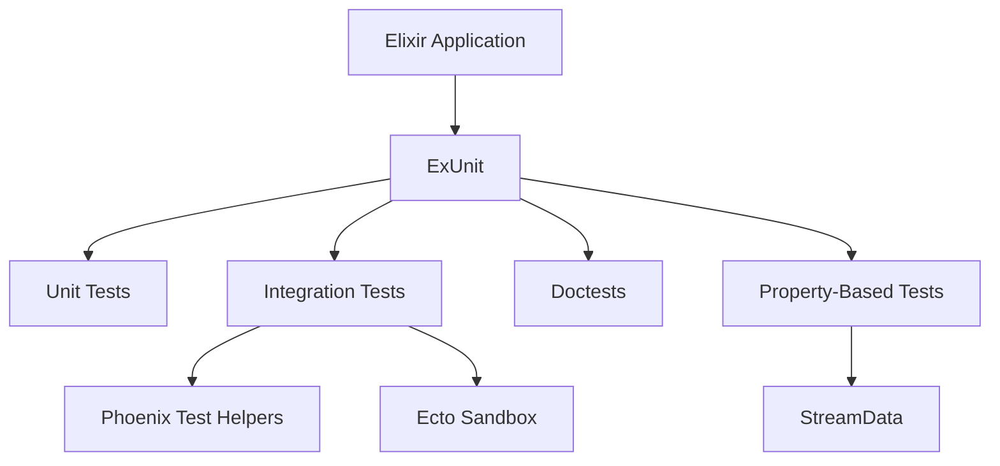
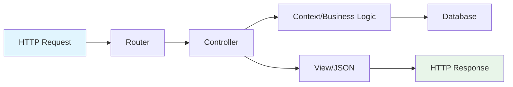
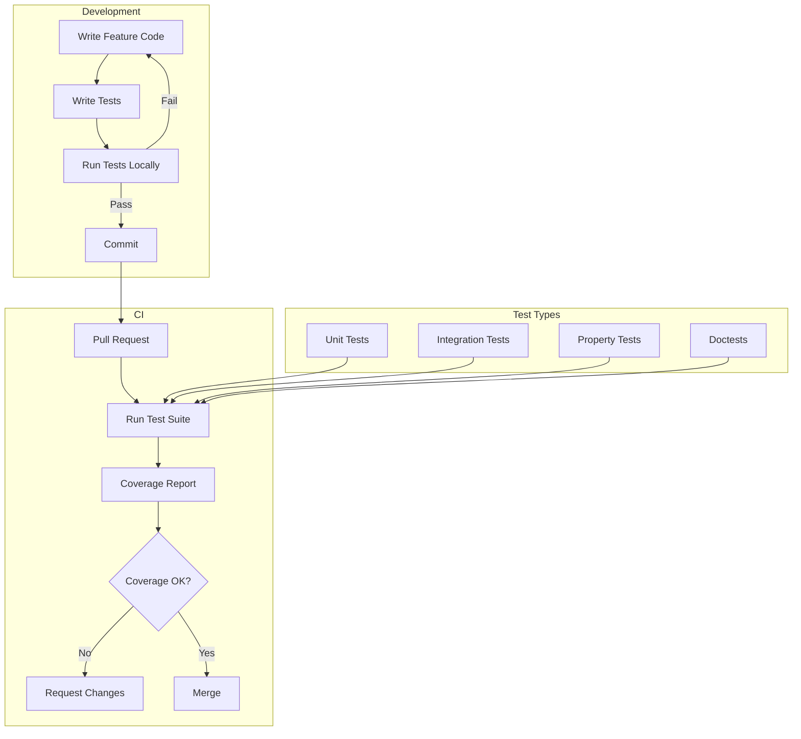

# How to Implement Testing in Elixir Applications

Author: [nawazdhandala](https://www.github.com/nawazdhandala)

Tags: Elixir, Testing, ExUnit, TDD, Phoenix, Functional Programming, Quality Assurance

Description: Learn how to write effective tests for Elixir applications using ExUnit, including unit tests, integration tests, doctests, and property-based testing with real-world examples.

---

Testing in Elixir is a first-class citizen. The language ships with ExUnit, a powerful testing framework built directly into the standard library. This guide walks you through practical testing patterns for production Elixir applications.

## 1. Understanding the Elixir Test Ecosystem



Elixir provides multiple testing approaches out of the box:
- **ExUnit**: The built-in test framework
- **Doctests**: Tests embedded in documentation
- **StreamData**: Property-based testing library
- **Mox**: Mock library that respects behaviors

## 2. Setting Up Your Test Environment

Every Mix project comes with a `test` directory and a `test_helper.exs` file. Here's how to configure it properly.

```elixir
# test/test_helper.exs

# Start ExUnit with common options
ExUnit.start(
  # Capture logs during test runs to keep output clean
  capture_log: true,
  # Run tests in a random order to catch order-dependent bugs
  seed: 0,
  # Exclude slow tests by default (run with --include slow)
  exclude: [:slow]
)

# Configure Ecto for async tests (if using Phoenix/Ecto)
Ecto.Adapters.SQL.Sandbox.mode(MyApp.Repo, :manual)
```

## 3. Writing Your First Unit Test

Unit tests in Elixir focus on testing individual functions in isolation.

```elixir
# lib/my_app/calculator.ex

defmodule MyApp.Calculator do
  @moduledoc """
  A simple calculator module demonstrating basic arithmetic operations.
  """

  @doc """
  Adds two numbers together.

  ## Examples

      iex> MyApp.Calculator.add(2, 3)
      5
  """
  def add(a, b), do: a + b

  @doc """
  Divides the first number by the second.
  Returns {:ok, result} on success, {:error, reason} on failure.
  """
  def divide(_a, 0), do: {:error, :division_by_zero}
  def divide(a, b), do: {:ok, a / b}
end
```

```elixir
# test/my_app/calculator_test.exs

defmodule MyApp.CalculatorTest do
  # Use ExUnit.Case to get testing functionality
  # async: true allows this test module to run in parallel with others
  use ExUnit.Case, async: true

  # Alias the module under test for cleaner code
  alias MyApp.Calculator

  # Describe blocks group related tests together
  describe "add/2" do
    test "adds two positive numbers" do
      # Arrange & Act & Assert in one line for simple cases
      assert Calculator.add(2, 3) == 5
    end

    test "handles negative numbers" do
      assert Calculator.add(-1, -2) == -3
      assert Calculator.add(-1, 2) == 1
    end

    test "handles floating point numbers" do
      # Use assert_in_delta for floating point comparisons
      # The third argument is the acceptable delta
      assert_in_delta Calculator.add(0.1, 0.2), 0.3, 0.0001
    end
  end

  describe "divide/2" do
    test "divides two numbers successfully" do
      # Pattern match on the result tuple
      assert {:ok, result} = Calculator.divide(10, 2)
      assert result == 5.0
    end

    test "returns error tuple for division by zero" do
      # Test error handling explicitly
      assert {:error, :division_by_zero} = Calculator.divide(10, 0)
    end

    test "handles floating point division" do
      assert {:ok, result} = Calculator.divide(1, 3)
      assert_in_delta result, 0.333, 0.001
    end
  end
end
```

## 4. Using Setup and Context

ExUnit provides setup callbacks to reduce repetition and share state between tests.

```elixir
# test/my_app/user_service_test.exs

defmodule MyApp.UserServiceTest do
  use ExUnit.Case, async: true

  alias MyApp.UserService

  # setup runs before each test in this module
  # The returned map is merged into the test context
  setup do
    # Create test data that will be available to all tests
    valid_attrs = %{
      name: "John Doe",
      email: "john@example.com",
      age: 30
    }

    invalid_attrs = %{
      name: "",
      email: "invalid-email",
      age: -5
    }

    # Return a map with test fixtures
    # These become available as context in each test
    %{valid_attrs: valid_attrs, invalid_attrs: invalid_attrs}
  end

  # setup_all runs once before all tests in this module
  # Use sparingly - it can create test interdependencies
  setup_all do
    # Initialize something expensive once
    config = %{max_users: 100}
    %{config: config}
  end

  describe "create_user/1" do
    # Context is pattern matched from setup return value
    test "creates a user with valid attributes", %{valid_attrs: attrs} do
      assert {:ok, user} = UserService.create_user(attrs)
      assert user.name == "John Doe"
      assert user.email == "john@example.com"
    end

    test "returns error with invalid attributes", %{invalid_attrs: attrs} do
      assert {:error, changeset} = UserService.create_user(attrs)
      # Check that specific validation errors exist
      assert "can't be blank" in errors_on(changeset).name
    end
  end

  # Helper function to extract errors from changeset
  defp errors_on(changeset) do
    Ecto.Changeset.traverse_errors(changeset, fn {msg, _opts} -> msg end)
  end
end
```

## 5. Testing with Doctests

Doctests let you write tests inside your documentation. They serve as both examples and executable tests.

```elixir
# lib/my_app/string_utils.ex

defmodule MyApp.StringUtils do
  @moduledoc """
  Utility functions for string manipulation.
  """

  @doc """
  Capitalizes the first letter of each word in a string.

  ## Examples

      iex> MyApp.StringUtils.title_case("hello world")
      "Hello World"

      iex> MyApp.StringUtils.title_case("elixir is awesome")
      "Elixir Is Awesome"

      iex> MyApp.StringUtils.title_case("")
      ""

  """
  def title_case(string) when is_binary(string) do
    string
    |> String.split(" ")
    |> Enum.map(&String.capitalize/1)
    |> Enum.join(" ")
  end

  @doc """
  Truncates a string to the specified length, adding ellipsis if needed.

  ## Examples

      iex> MyApp.StringUtils.truncate("Hello, World!", 5)
      "Hello..."

      iex> MyApp.StringUtils.truncate("Hi", 10)
      "Hi"

      iex> MyApp.StringUtils.truncate("Test", 4)
      "Test"

  """
  def truncate(string, max_length) when byte_size(string) <= max_length do
    string
  end

  def truncate(string, max_length) do
    String.slice(string, 0, max_length) <> "..."
  end
end
```

```elixir
# test/my_app/string_utils_test.exs

defmodule MyApp.StringUtilsTest do
  use ExUnit.Case, async: true

  # This single line runs all doctests from the module
  # Doctests are extracted from @doc attributes
  doctest MyApp.StringUtils
end
```

## 6. Testing GenServers and Processes

Testing concurrent code requires special attention. Here's how to test a GenServer properly.

```elixir
# lib/my_app/counter.ex

defmodule MyApp.Counter do
  @moduledoc """
  A simple counter implemented as a GenServer.
  Demonstrates stateful process testing.
  """
  use GenServer

  # Client API

  def start_link(initial_value \\ 0) do
    GenServer.start_link(__MODULE__, initial_value)
  end

  def increment(pid), do: GenServer.call(pid, :increment)
  def decrement(pid), do: GenServer.call(pid, :decrement)
  def get_value(pid), do: GenServer.call(pid, :get_value)
  def reset(pid), do: GenServer.cast(pid, :reset)

  # Server Callbacks

  @impl true
  def init(initial_value), do: {:ok, initial_value}

  @impl true
  def handle_call(:increment, _from, state), do: {:reply, state + 1, state + 1}
  def handle_call(:decrement, _from, state), do: {:reply, state - 1, state - 1}
  def handle_call(:get_value, _from, state), do: {:reply, state, state}

  @impl true
  def handle_cast(:reset, _state), do: {:noreply, 0}
end
```

```elixir
# test/my_app/counter_test.exs

defmodule MyApp.CounterTest do
  use ExUnit.Case, async: true

  alias MyApp.Counter

  # Start a fresh counter for each test
  setup do
    # start_supervised! ensures the process is properly cleaned up after each test
    # This prevents test pollution and resource leaks
    pid = start_supervised!({Counter, 0})
    %{counter: pid}
  end

  describe "increment/1" do
    test "increments the counter by 1", %{counter: pid} do
      assert Counter.increment(pid) == 1
      assert Counter.increment(pid) == 2
      assert Counter.get_value(pid) == 2
    end
  end

  describe "decrement/1" do
    test "decrements the counter by 1", %{counter: pid} do
      # First increment to have a positive value
      Counter.increment(pid)
      Counter.increment(pid)

      assert Counter.decrement(pid) == 1
      assert Counter.get_value(pid) == 1
    end

    test "can go negative", %{counter: pid} do
      assert Counter.decrement(pid) == -1
      assert Counter.get_value(pid) == -1
    end
  end

  describe "reset/1" do
    test "resets counter to zero", %{counter: pid} do
      Counter.increment(pid)
      Counter.increment(pid)
      Counter.increment(pid)

      # reset is a cast (async), so we need to sync before checking
      Counter.reset(pid)

      # Small delay to ensure cast is processed
      # Or use get_value which is a call and will sync
      assert Counter.get_value(pid) == 0
    end
  end

  describe "initialization" do
    test "can start with a custom initial value" do
      # Start a separate counter with initial value 100
      {:ok, pid} = Counter.start_link(100)
      assert Counter.get_value(pid) == 100

      # Clean up manually since we didn't use start_supervised!
      GenServer.stop(pid)
    end
  end
end
```

## 7. Testing Phoenix Controllers

Phoenix applications require integration testing for controllers and views.



```elixir
# test/my_app_web/controllers/user_controller_test.exs

defmodule MyAppWeb.UserControllerTest do
  # Use ConnCase for controller tests - it sets up the connection
  use MyAppWeb.ConnCase

  alias MyApp.Accounts
  alias MyApp.Accounts.User

  # Define fixtures for testing
  @create_attrs %{
    name: "Test User",
    email: "test@example.com",
    password: "securepassword123"
  }

  @invalid_attrs %{
    name: nil,
    email: "invalid",
    password: "short"
  }

  # Helper function to create a user
  defp create_user(_context) do
    {:ok, user} = Accounts.create_user(@create_attrs)
    %{user: user}
  end

  describe "index" do
    # Setup creates a user before this test group runs
    setup [:create_user]

    test "lists all users", %{conn: conn} do
      # Make a GET request to the users index
      conn = get(conn, ~p"/api/users")

      # Assert the response status and structure
      assert json_response(conn, 200)["data"] |> length() >= 1
    end
  end

  describe "create user" do
    test "renders user when data is valid", %{conn: conn} do
      # POST request with valid attributes
      conn = post(conn, ~p"/api/users", user: @create_attrs)

      # Assert 201 Created status
      assert %{"id" => id} = json_response(conn, 201)["data"]

      # Verify the user was actually created
      conn = get(conn, ~p"/api/users/#{id}")
      response = json_response(conn, 200)["data"]

      assert response["name"] == "Test User"
      assert response["email"] == "test@example.com"
      # Password should never be in the response
      refute Map.has_key?(response, "password")
    end

    test "renders errors when data is invalid", %{conn: conn} do
      conn = post(conn, ~p"/api/users", user: @invalid_attrs)

      # Assert 422 Unprocessable Entity status
      assert json_response(conn, 422)["errors"] != %{}
    end
  end

  describe "update user" do
    setup [:create_user]

    test "renders user when data is valid", %{conn: conn, user: user} do
      update_attrs = %{name: "Updated Name"}

      conn = put(conn, ~p"/api/users/#{user.id}", user: update_attrs)
      assert %{"id" => ^id} = json_response(conn, 200)["data"]

      # Verify the update persisted
      conn = get(conn, ~p"/api/users/#{id}")
      assert json_response(conn, 200)["data"]["name"] == "Updated Name"
    end
  end

  describe "delete user" do
    setup [:create_user]

    test "deletes chosen user", %{conn: conn, user: user} do
      conn = delete(conn, ~p"/api/users/#{user.id}")
      assert response(conn, 204)

      # Verify the user no longer exists
      assert_error_sent 404, fn ->
        get(conn, ~p"/api/users/#{user.id}")
      end
    end
  end
end
```

## 8. Property-Based Testing with StreamData

Property-based testing generates random inputs to find edge cases you might miss.

```elixir
# mix.exs - add to deps
# {:stream_data, "~> 0.6", only: [:dev, :test]}
```

```elixir
# test/my_app/encoder_test.exs

defmodule MyApp.EncoderTest do
  use ExUnit.Case, async: true
  use ExUnitProperties

  alias MyApp.Encoder

  describe "encode/1 and decode/1" do
    # Property: encoding then decoding should return the original value
    property "encode/decode roundtrip preserves data" do
      check all string <- string(:printable) do
        # For any printable string, encoding then decoding
        # should return the original string
        encoded = Encoder.encode(string)
        decoded = Encoder.decode(encoded)

        assert decoded == string
      end
    end

    property "encoded strings are always valid base64" do
      check all string <- string(:printable) do
        encoded = Encoder.encode(string)

        # Base64 strings only contain these characters
        assert String.match?(encoded, ~r/^[A-Za-z0-9+\/=]*$/)
      end
    end
  end

  describe "sort/1" do
    property "sorted lists are always in ascending order" do
      check all list <- list_of(integer()) do
        sorted = Enum.sort(list)

        # Check each consecutive pair is in order
        sorted
        |> Enum.chunk_every(2, 1, :discard)
        |> Enum.each(fn [a, b] ->
          assert a <= b
        end)
      end
    end

    property "sorting preserves all elements" do
      check all list <- list_of(integer()) do
        sorted = Enum.sort(list)

        # Same length
        assert length(sorted) == length(list)

        # Same elements (using frequency count)
        assert Enum.frequencies(sorted) == Enum.frequencies(list)
      end
    end
  end
end
```

## 9. Using Mox for Mocking External Dependencies

Mox helps you mock modules that implement behaviors, keeping tests isolated.

```elixir
# lib/my_app/http_client.ex

defmodule MyApp.HTTPClient do
  @moduledoc """
  Behavior for HTTP clients. Used for dependency injection in tests.
  """

  @callback get(url :: String.t()) :: {:ok, map()} | {:error, term()}
  @callback post(url :: String.t(), body :: map()) :: {:ok, map()} | {:error, term()}
end
```

```elixir
# lib/my_app/http_client/httpoison.ex

defmodule MyApp.HTTPClient.HTTPoison do
  @moduledoc """
  Production implementation using HTTPoison.
  """
  @behaviour MyApp.HTTPClient

  @impl true
  def get(url) do
    case HTTPoison.get(url) do
      {:ok, %{status_code: 200, body: body}} ->
        {:ok, Jason.decode!(body)}
      {:ok, %{status_code: status}} ->
        {:error, {:http_error, status}}
      {:error, reason} ->
        {:error, reason}
    end
  end

  @impl true
  def post(url, body) do
    case HTTPoison.post(url, Jason.encode!(body), [{"Content-Type", "application/json"}]) do
      {:ok, %{status_code: status, body: response_body}} when status in 200..299 ->
        {:ok, Jason.decode!(response_body)}
      {:ok, %{status_code: status}} ->
        {:error, {:http_error, status}}
      {:error, reason} ->
        {:error, reason}
    end
  end
end
```

```elixir
# test/support/mocks.ex

# Define mocks in test support
Mox.defmock(MyApp.HTTPClientMock, for: MyApp.HTTPClient)
```

```elixir
# config/test.exs

# Use the mock in tests
config :my_app, :http_client, MyApp.HTTPClientMock
```

```elixir
# test/my_app/weather_service_test.exs

defmodule MyApp.WeatherServiceTest do
  use ExUnit.Case, async: true

  import Mox

  alias MyApp.WeatherService

  # Ensure mocks are verified after each test
  setup :verify_on_exit!

  describe "get_temperature/1" do
    test "returns temperature for valid city" do
      # Set up the mock expectation
      expect(MyApp.HTTPClientMock, :get, fn url ->
        # Verify the URL is correct
        assert String.contains?(url, "London")

        # Return mock data
        {:ok, %{"main" => %{"temp" => 15.5}}}
      end)

      # Call the function under test
      assert {:ok, 15.5} = WeatherService.get_temperature("London")
    end

    test "handles API errors gracefully" do
      expect(MyApp.HTTPClientMock, :get, fn _url ->
        {:error, {:http_error, 500}}
      end)

      assert {:error, :service_unavailable} = WeatherService.get_temperature("London")
    end

    test "handles network failures" do
      expect(MyApp.HTTPClientMock, :get, fn _url ->
        {:error, :timeout}
      end)

      assert {:error, :network_error} = WeatherService.get_temperature("London")
    end
  end

  describe "caching behavior" do
    test "caches successful responses" do
      # Expect only ONE call to the HTTP client
      expect(MyApp.HTTPClientMock, :get, 1, fn _url ->
        {:ok, %{"main" => %{"temp" => 20.0}}}
      end)

      # Call twice
      assert {:ok, 20.0} = WeatherService.get_temperature("Paris")
      assert {:ok, 20.0} = WeatherService.get_temperature("Paris")

      # The mock verifies only one HTTP call was made
    end
  end
end
```

## 10. Testing Async Operations

Elixir provides tools for testing asynchronous code reliably.

```elixir
# test/my_app/async_worker_test.exs

defmodule MyApp.AsyncWorkerTest do
  use ExUnit.Case, async: true

  alias MyApp.AsyncWorker

  describe "process_async/1" do
    test "processes items asynchronously and notifies caller" do
      # Start the worker
      {:ok, worker} = AsyncWorker.start_link()

      # Subscribe to completion notifications
      AsyncWorker.subscribe(worker, self())

      # Trigger async processing
      AsyncWorker.process_async(worker, %{id: 1, data: "test"})

      # Assert we receive the completion message
      # assert_receive waits up to 100ms by default
      assert_receive {:processing_complete, %{id: 1, result: _result}}, 1000
    end

    test "handles multiple concurrent items" do
      {:ok, worker} = AsyncWorker.start_link()
      AsyncWorker.subscribe(worker, self())

      # Send multiple items
      for i <- 1..5 do
        AsyncWorker.process_async(worker, %{id: i, data: "item_#{i}"})
      end

      # Collect all completion messages
      results =
        for _ <- 1..5 do
          assert_receive {:processing_complete, result}, 5000
          result
        end

      # Verify all items were processed
      ids = Enum.map(results, & &1.id) |> Enum.sort()
      assert ids == [1, 2, 3, 4, 5]
    end

    test "refute_receive confirms no unexpected messages" do
      {:ok, worker} = AsyncWorker.start_link()

      # Don't subscribe, so we shouldn't receive anything
      AsyncWorker.process_async(worker, %{id: 1, data: "test"})

      # Verify no message is received
      refute_receive {:processing_complete, _}, 100
    end
  end
end
```

## 11. Test Organization and Tags

Organize tests with tags for flexible test runs.

```elixir
# test/my_app/database_test.exs

defmodule MyApp.DatabaseTest do
  use ExUnit.Case

  # Tag entire module
  @moduletag :integration

  describe "connection pool" do
    # Tag specific tests
    @tag :slow
    @tag timeout: 60_000  # Custom timeout for slow tests
    test "handles 100 concurrent connections" do
      # Long-running test...
    end

    @tag :skip  # Skip this test
    test "pending feature" do
      # Not implemented yet
    end
  end

  describe "migrations" do
    @tag :database
    test "applies migrations successfully" do
      # Test migration logic
    end
  end
end
```

Run specific tests with tags:

```bash
# Run only integration tests
mix test --only integration

# Exclude slow tests
mix test --exclude slow

# Run database tests with extended timeout
mix test --only database

# Include normally excluded tests
mix test --include slow
```

## 12. Code Coverage and CI Integration

```elixir
# mix.exs

defp project do
  [
    # ... other config
    test_coverage: [tool: ExCoveralls],
    preferred_cli_env: [
      coveralls: :test,
      "coveralls.detail": :test,
      "coveralls.html": :test
    ]
  ]
end

defp deps do
  [
    {:excoveralls, "~> 0.18", only: :test}
  ]
end
```

```yaml
# .github/workflows/test.yml

name: Test

on:
  push:
    branches: [main]
  pull_request:
    branches: [main]

jobs:
  test:
    runs-on: ubuntu-latest

    services:
      postgres:
        image: postgres:15
        env:
          POSTGRES_PASSWORD: postgres
        options: >-
          --health-cmd pg_isready
          --health-interval 10s
          --health-timeout 5s
          --health-retries 5
        ports:
          - 5432:5432

    steps:
      - uses: actions/checkout@v4

      - name: Set up Elixir
        uses: erlef/setup-beam@v1
        with:
          elixir-version: '1.16'
          otp-version: '26'

      - name: Restore dependencies cache
        uses: actions/cache@v3
        with:
          path: deps
          key: ${{ runner.os }}-mix-${{ hashFiles('**/mix.lock') }}

      - name: Install dependencies
        run: mix deps.get

      - name: Run tests with coverage
        run: mix coveralls.github
        env:
          GITHUB_TOKEN: ${{ secrets.GITHUB_TOKEN }}
          MIX_ENV: test
```

## Test Workflow Summary



## Best Practices Summary

1. **Use `async: true`** for tests that don't share state to run them in parallel
2. **Use `start_supervised!`** for GenServers to ensure proper cleanup
3. **Write doctests** for public API functions as living documentation
4. **Use property-based tests** for algorithms with clear mathematical properties
5. **Mock external dependencies** with Mox to keep tests fast and isolated
6. **Tag slow tests** and exclude them from regular development runs
7. **Run the full test suite in CI** with coverage reporting
8. **Use descriptive test names** that explain the expected behavior

---

Testing in Elixir is designed to be straightforward and productive. With ExUnit's built-in features, clear patterns for testing concurrent code, and excellent tooling for mocking and property-based testing, you can build confidence in your application's correctness while maintaining fast feedback loops during development.
