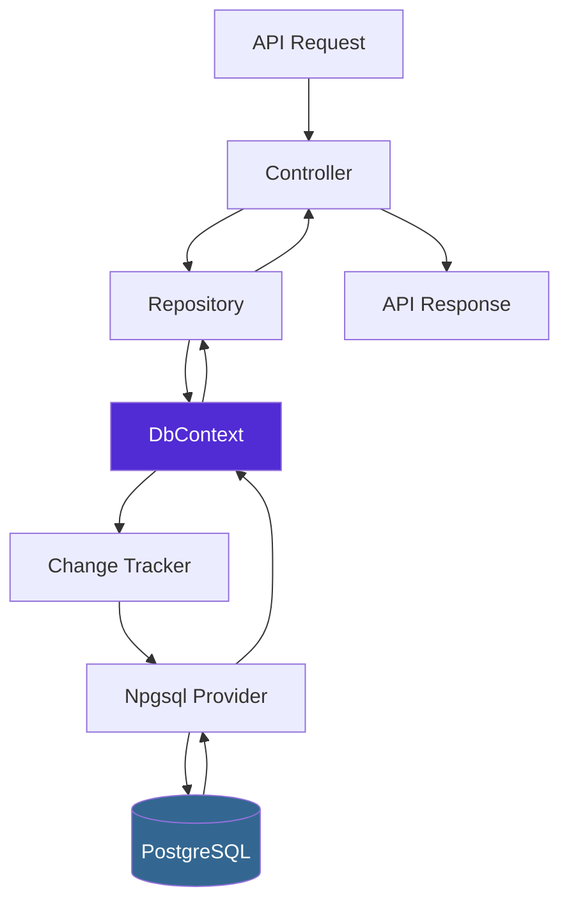

# How to Use Entity Framework Core with PostgreSQL

Author: [nawazdhandala](https://github.com/nawazdhandala)

Tags: C#, Entity Framework Core, PostgreSQL, .NET, Database, ORM, Npgsql, ASP.NET Core

Description: Learn how to connect Entity Framework Core to PostgreSQL with practical examples covering setup, configuration, migrations, CRUD operations, and production-ready patterns for building .NET applications.

---

PostgreSQL has become a popular choice for .NET applications due to its reliability, performance, and rich feature set. Entity Framework Core pairs well with PostgreSQL through the Npgsql provider, giving you type-safe database access with all the benefits of an ORM. This guide walks you through everything you need to get started.

## Why PostgreSQL with EF Core?

PostgreSQL offers several advantages for .NET applications:

- **Open source and free** - No licensing costs
- **JSONB support** - Store and query JSON documents natively
- **Full-text search** - Built-in search capabilities
- **Array types** - Store collections without join tables
- **Reliability** - Battle-tested in production environments

The Npgsql provider for EF Core brings full support for these PostgreSQL-specific features while maintaining standard EF Core patterns.

## Project Setup

### Create a New Project

```bash
# Create a new ASP.NET Core Web API project
dotnet new webapi -n MyPostgresApp
cd MyPostgresApp

# Add the required packages
dotnet add package Npgsql.EntityFrameworkCore.PostgreSQL
dotnet add package Microsoft.EntityFrameworkCore.Design
```

### Define Your Entities

Create your domain models with standard C# classes:

```csharp
// Models/Product.cs
namespace MyPostgresApp.Models;

public class Product
{
    public int Id { get; set; }
    public string Name { get; set; } = string.Empty;
    public string Description { get; set; } = string.Empty;
    public decimal Price { get; set; }
    public int Stock { get; set; }
    public DateTime CreatedAt { get; set; }
    public DateTime? UpdatedAt { get; set; }

    // Navigation property for one-to-many relationship
    public int CategoryId { get; set; }
    public Category Category { get; set; } = null!;

    // Navigation property for many-to-many relationship
    public ICollection<Tag> Tags { get; set; } = new List<Tag>();
}

// Models/Category.cs
namespace MyPostgresApp.Models;

public class Category
{
    public int Id { get; set; }
    public string Name { get; set; } = string.Empty;
    public string? Description { get; set; }

    // Navigation property - collection indicates "many" side
    public ICollection<Product> Products { get; set; } = new List<Product>();
}

// Models/Tag.cs
namespace MyPostgresApp.Models;

public class Tag
{
    public int Id { get; set; }
    public string Name { get; set; } = string.Empty;

    // Many-to-many with products
    public ICollection<Product> Products { get; set; } = new List<Product>();
}
```

### Create the DbContext

The DbContext is your main entry point for database operations:

```csharp
// Data/AppDbContext.cs
using Microsoft.EntityFrameworkCore;
using MyPostgresApp.Models;

namespace MyPostgresApp.Data;

public class AppDbContext : DbContext
{
    public AppDbContext(DbContextOptions<AppDbContext> options)
        : base(options)
    {
    }

    // DbSet properties expose tables for querying
    public DbSet<Product> Products => Set<Product>();
    public DbSet<Category> Categories => Set<Category>();
    public DbSet<Tag> Tags => Set<Tag>();

    protected override void OnModelCreating(ModelBuilder modelBuilder)
    {
        // Configure Product entity
        modelBuilder.Entity<Product>(entity =>
        {
            // Map to specific table name (PostgreSQL convention: lowercase)
            entity.ToTable("products");

            // Configure primary key
            entity.HasKey(p => p.Id);

            // Configure properties
            entity.Property(p => p.Name)
                .IsRequired()
                .HasMaxLength(200);

            entity.Property(p => p.Price)
                .HasPrecision(18, 2);

            // Configure one-to-many relationship with Category
            entity.HasOne(p => p.Category)
                .WithMany(c => c.Products)
                .HasForeignKey(p => p.CategoryId)
                .OnDelete(DeleteBehavior.Restrict);

            // Many-to-many relationship is configured automatically in EF Core 5+
            // EF Core creates the join table ProductTag automatically

            // Add index for frequently queried columns
            entity.HasIndex(p => p.CategoryId);
            entity.HasIndex(p => p.Name);
        });

        // Configure Category entity
        modelBuilder.Entity<Category>(entity =>
        {
            entity.ToTable("categories");
            entity.HasKey(c => c.Id);
            entity.Property(c => c.Name)
                .IsRequired()
                .HasMaxLength(100);
        });

        // Configure Tag entity
        modelBuilder.Entity<Tag>(entity =>
        {
            entity.ToTable("tags");
            entity.HasKey(t => t.Id);
            entity.Property(t => t.Name)
                .IsRequired()
                .HasMaxLength(50);
            entity.HasIndex(t => t.Name).IsUnique();
        });
    }
}
```

### Configure the Connection

Add your PostgreSQL connection string and register the DbContext:

```csharp
// Program.cs
using Microsoft.EntityFrameworkCore;
using MyPostgresApp.Data;

var builder = WebApplication.CreateBuilder(args);

// Register DbContext with PostgreSQL provider
builder.Services.AddDbContext<AppDbContext>(options =>
    options.UseNpgsql(
        builder.Configuration.GetConnectionString("DefaultConnection"),
        npgsqlOptions =>
        {
            // Enable retry on failure for transient errors
            npgsqlOptions.EnableRetryOnFailure(
                maxRetryCount: 3,
                maxRetryDelay: TimeSpan.FromSeconds(30),
                errorCodesToAdd: null);

            // Set command timeout for long-running queries
            npgsqlOptions.CommandTimeout(60);
        }));

builder.Services.AddControllers();
builder.Services.AddEndpointsApiExplorer();
builder.Services.AddSwaggerGen();

var app = builder.Build();

if (app.Environment.IsDevelopment())
{
    app.UseSwagger();
    app.UseSwaggerUI();
}

app.UseHttpsRedirection();
app.UseAuthorization();
app.MapControllers();
app.Run();
```

Add the connection string to your configuration:

```json
// appsettings.json
{
  "ConnectionStrings": {
    "DefaultConnection": "Host=localhost;Port=5432;Database=myapp;Username=postgres;Password=yourpassword"
  },
  "Logging": {
    "LogLevel": {
      "Default": "Information",
      "Microsoft.AspNetCore": "Warning"
    }
  }
}
```

## Database Migrations

EF Core migrations track your schema changes over time.

### Create Your First Migration

```bash
# Create the initial migration
dotnet ef migrations add InitialCreate

# Apply the migration to the database
dotnet ef database update
```

This generates a migration file in the Migrations folder:

```csharp
// Migrations/20260126000000_InitialCreate.cs
public partial class InitialCreate : Migration
{
    protected override void Up(MigrationBuilder migrationBuilder)
    {
        migrationBuilder.CreateTable(
            name: "categories",
            columns: table => new
            {
                Id = table.Column<int>(type: "integer", nullable: false)
                    .Annotation("Npgsql:ValueGenerationStrategy",
                        NpgsqlValueGenerationStrategy.IdentityByDefaultColumn),
                Name = table.Column<string>(type: "character varying(100)",
                    maxLength: 100, nullable: false),
                Description = table.Column<string>(type: "text", nullable: true)
            },
            constraints: table =>
            {
                table.PrimaryKey("PK_categories", x => x.Id);
            });

        // Additional table creation code...
    }

    protected override void Down(MigrationBuilder migrationBuilder)
    {
        migrationBuilder.DropTable(name: "products");
        migrationBuilder.DropTable(name: "categories");
        migrationBuilder.DropTable(name: "tags");
    }
}
```

### Add New Migrations for Schema Changes

When you modify your entities, create a new migration:

```bash
# Add a new column to Product
# First, modify the entity class, then:
dotnet ef migrations add AddProductSku

# Review the generated migration before applying
dotnet ef database update
```

## CRUD Operations

### Repository Pattern

Implement a repository for clean data access:

```csharp
// Repositories/IProductRepository.cs
using MyPostgresApp.Models;

namespace MyPostgresApp.Repositories;

public interface IProductRepository
{
    Task<IEnumerable<Product>> GetAllAsync();
    Task<Product?> GetByIdAsync(int id);
    Task<IEnumerable<Product>> GetByCategoryAsync(int categoryId);
    Task<Product> CreateAsync(Product product);
    Task<Product> UpdateAsync(Product product);
    Task DeleteAsync(int id);
    Task<bool> ExistsAsync(int id);
}

// Repositories/ProductRepository.cs
using Microsoft.EntityFrameworkCore;
using MyPostgresApp.Data;
using MyPostgresApp.Models;

namespace MyPostgresApp.Repositories;

public class ProductRepository : IProductRepository
{
    private readonly AppDbContext _context;

    public ProductRepository(AppDbContext context)
    {
        _context = context;
    }

    public async Task<IEnumerable<Product>> GetAllAsync()
    {
        // Include related data with eager loading
        return await _context.Products
            .Include(p => p.Category)
            .Include(p => p.Tags)
            .AsNoTracking() // Better performance for read-only queries
            .ToListAsync();
    }

    public async Task<Product?> GetByIdAsync(int id)
    {
        return await _context.Products
            .Include(p => p.Category)
            .Include(p => p.Tags)
            .FirstOrDefaultAsync(p => p.Id == id);
    }

    public async Task<IEnumerable<Product>> GetByCategoryAsync(int categoryId)
    {
        return await _context.Products
            .Where(p => p.CategoryId == categoryId)
            .Include(p => p.Tags)
            .AsNoTracking()
            .ToListAsync();
    }

    public async Task<Product> CreateAsync(Product product)
    {
        product.CreatedAt = DateTime.UtcNow;
        _context.Products.Add(product);
        await _context.SaveChangesAsync();
        return product;
    }

    public async Task<Product> UpdateAsync(Product product)
    {
        product.UpdatedAt = DateTime.UtcNow;
        _context.Entry(product).State = EntityState.Modified;

        // Don't update CreatedAt
        _context.Entry(product).Property(p => p.CreatedAt).IsModified = false;

        await _context.SaveChangesAsync();
        return product;
    }

    public async Task DeleteAsync(int id)
    {
        var product = await _context.Products.FindAsync(id);
        if (product != null)
        {
            _context.Products.Remove(product);
            await _context.SaveChangesAsync();
        }
    }

    public async Task<bool> ExistsAsync(int id)
    {
        return await _context.Products.AnyAsync(p => p.Id == id);
    }
}
```

### Register the Repository

```csharp
// In Program.cs, add:
builder.Services.AddScoped<IProductRepository, ProductRepository>();
```

### Controller Implementation

```csharp
// Controllers/ProductsController.cs
using Microsoft.AspNetCore.Mvc;
using MyPostgresApp.Models;
using MyPostgresApp.Repositories;

namespace MyPostgresApp.Controllers;

[ApiController]
[Route("api/[controller]")]
public class ProductsController : ControllerBase
{
    private readonly IProductRepository _repository;

    public ProductsController(IProductRepository repository)
    {
        _repository = repository;
    }

    [HttpGet]
    public async Task<ActionResult<IEnumerable<Product>>> GetAll()
    {
        var products = await _repository.GetAllAsync();
        return Ok(products);
    }

    [HttpGet("{id}")]
    public async Task<ActionResult<Product>> GetById(int id)
    {
        var product = await _repository.GetByIdAsync(id);
        if (product == null)
        {
            return NotFound();
        }
        return Ok(product);
    }

    [HttpPost]
    public async Task<ActionResult<Product>> Create(Product product)
    {
        var created = await _repository.CreateAsync(product);
        return CreatedAtAction(nameof(GetById), new { id = created.Id }, created);
    }

    [HttpPut("{id}")]
    public async Task<IActionResult> Update(int id, Product product)
    {
        if (id != product.Id)
        {
            return BadRequest();
        }

        if (!await _repository.ExistsAsync(id))
        {
            return NotFound();
        }

        await _repository.UpdateAsync(product);
        return NoContent();
    }

    [HttpDelete("{id}")]
    public async Task<IActionResult> Delete(int id)
    {
        if (!await _repository.ExistsAsync(id))
        {
            return NotFound();
        }

        await _repository.DeleteAsync(id);
        return NoContent();
    }
}
```

## PostgreSQL-Specific Features

### Using JSONB Columns

PostgreSQL's JSONB type is excellent for semi-structured data:

```csharp
// Models/Order.cs
using System.Text.Json;

namespace MyPostgresApp.Models;

public class Order
{
    public int Id { get; set; }
    public string OrderNumber { get; set; } = string.Empty;
    public DateTime OrderDate { get; set; }

    // JSONB column for flexible metadata
    public JsonDocument? Metadata { get; set; }

    // Strongly-typed JSONB column
    public OrderDetails Details { get; set; } = new();
}

public class OrderDetails
{
    public string ShippingAddress { get; set; } = string.Empty;
    public string BillingAddress { get; set; } = string.Empty;
    public List<string> Notes { get; set; } = new();
}
```

Configure the JSONB mapping:

```csharp
// In AppDbContext.OnModelCreating
modelBuilder.Entity<Order>(entity =>
{
    entity.ToTable("orders");

    // Map to JSONB column type
    entity.Property(o => o.Metadata)
        .HasColumnType("jsonb");

    // Map strongly-typed property to JSONB
    entity.Property(o => o.Details)
        .HasColumnType("jsonb")
        .HasConversion(
            v => JsonSerializer.Serialize(v, (JsonSerializerOptions?)null),
            v => JsonSerializer.Deserialize<OrderDetails>(v, (JsonSerializerOptions?)null)!);
});
```

Query JSONB data:

```csharp
// Query using JSONB operators
var ordersWithNotes = await _context.Orders
    .Where(o => EF.Functions.JsonContains(o.Details, new { Notes = new[] { "urgent" } }))
    .ToListAsync();
```

### Array Types

PostgreSQL natively supports array columns:

```csharp
// Models/Article.cs
namespace MyPostgresApp.Models;

public class Article
{
    public int Id { get; set; }
    public string Title { get; set; } = string.Empty;
    public string Content { get; set; } = string.Empty;

    // Array column - no join table needed
    public string[] Keywords { get; set; } = Array.Empty<string>();
}
```

Configure and query arrays:

```csharp
// Configuration
modelBuilder.Entity<Article>(entity =>
{
    entity.ToTable("articles");
    entity.Property(a => a.Keywords)
        .HasColumnType("text[]");
});

// Query articles containing a keyword
var articles = await _context.Articles
    .Where(a => a.Keywords.Contains("dotnet"))
    .ToListAsync();
```

### Full-Text Search

Use PostgreSQL's full-text search capabilities:

```csharp
// Add a search vector column
public class Article
{
    public int Id { get; set; }
    public string Title { get; set; } = string.Empty;
    public string Content { get; set; } = string.Empty;

    // Full-text search vector
    public NpgsqlTsVector SearchVector { get; set; } = null!;
}

// Configure the search vector
modelBuilder.Entity<Article>(entity =>
{
    entity.ToTable("articles");

    // Create generated column for search vector
    entity.Property(a => a.SearchVector)
        .HasColumnType("tsvector")
        .IsGeneratedTsVectorColumn("english", "Title", "Content");

    // Add GIN index for fast full-text search
    entity.HasIndex(a => a.SearchVector)
        .HasMethod("GIN");
});

// Perform full-text search
var results = await _context.Articles
    .Where(a => a.SearchVector.Matches("database & performance"))
    .OrderByDescending(a => a.SearchVector.Rank(EF.Functions.ToTsQuery("database & performance")))
    .ToListAsync();
```

## Performance Best Practices

### Connection Pooling

Npgsql handles connection pooling automatically. Configure pool settings in your connection string:

```json
{
  "ConnectionStrings": {
    "DefaultConnection": "Host=localhost;Database=myapp;Username=postgres;Password=secret;Pooling=true;Minimum Pool Size=5;Maximum Pool Size=100"
  }
}
```

### Query Optimization

```csharp
// Use AsNoTracking for read-only queries
var products = await _context.Products
    .AsNoTracking()
    .ToListAsync();

// Use projections to select only needed columns
var productNames = await _context.Products
    .Select(p => new { p.Id, p.Name, p.Price })
    .ToListAsync();

// Use pagination for large datasets
var pagedProducts = await _context.Products
    .OrderBy(p => p.Id)
    .Skip(page * pageSize)
    .Take(pageSize)
    .ToListAsync();

// Avoid N+1 queries with Include
var productsWithCategories = await _context.Products
    .Include(p => p.Category)
    .ToListAsync();

// Split query for complex includes (EF Core 5+)
var products = await _context.Products
    .Include(p => p.Category)
    .Include(p => p.Tags)
    .AsSplitQuery()
    .ToListAsync();
```

### Batch Operations

For bulk operations, use ExecuteUpdate and ExecuteDelete (EF Core 7+):

```csharp
// Update multiple rows without loading entities
await _context.Products
    .Where(p => p.CategoryId == oldCategoryId)
    .ExecuteUpdateAsync(s => s
        .SetProperty(p => p.CategoryId, newCategoryId)
        .SetProperty(p => p.UpdatedAt, DateTime.UtcNow));

// Delete multiple rows efficiently
await _context.Products
    .Where(p => p.Stock == 0 && p.UpdatedAt < DateTime.UtcNow.AddYears(-1))
    .ExecuteDeleteAsync();
```

## Data Flow Overview

Here is how data flows through a typical EF Core application with PostgreSQL:



## Handling Transactions

For operations that need to succeed or fail together:

```csharp
public async Task TransferStockAsync(int fromProductId, int toProductId, int quantity)
{
    // Use explicit transaction for multiple operations
    await using var transaction = await _context.Database.BeginTransactionAsync();

    try
    {
        var fromProduct = await _context.Products.FindAsync(fromProductId);
        var toProduct = await _context.Products.FindAsync(toProductId);

        if (fromProduct == null || toProduct == null)
        {
            throw new InvalidOperationException("Product not found");
        }

        if (fromProduct.Stock < quantity)
        {
            throw new InvalidOperationException("Insufficient stock");
        }

        fromProduct.Stock -= quantity;
        toProduct.Stock += quantity;

        await _context.SaveChangesAsync();
        await transaction.CommitAsync();
    }
    catch
    {
        await transaction.RollbackAsync();
        throw;
    }
}
```

## Conclusion

Entity Framework Core with PostgreSQL gives you a powerful combination for building .NET applications. The Npgsql provider brings full support for PostgreSQL-specific features like JSONB, arrays, and full-text search while maintaining familiar EF Core patterns.

Key takeaways:

- **Use migrations** to track schema changes and enable reproducible deployments
- **Leverage PostgreSQL features** like JSONB and arrays when they fit your data model
- **Apply AsNoTracking** for read-only queries to improve performance
- **Use Include wisely** to avoid N+1 query problems
- **Configure connection pooling** appropriately for your workload

The combination handles everything from small applications to large-scale systems. Start with the basics, then adopt PostgreSQL-specific features as your needs grow.

---

*Building applications with PostgreSQL? [OneUptime](https://oneuptime.com) provides database monitoring with query performance tracking, connection pool metrics, and alerting to keep your PostgreSQL databases running smoothly.*

**Related Reading:**
- [How to Configure Entity Framework Core Relationships](https://oneuptime.com/blog/post/2025-12-23-configure-entity-framework-core-relationships/view)
- [How to Optimize Entity Framework Core Queries](https://oneuptime.com/blog/post/2026-01-28-optimize-entity-framework-core-queries/view)
