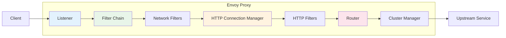
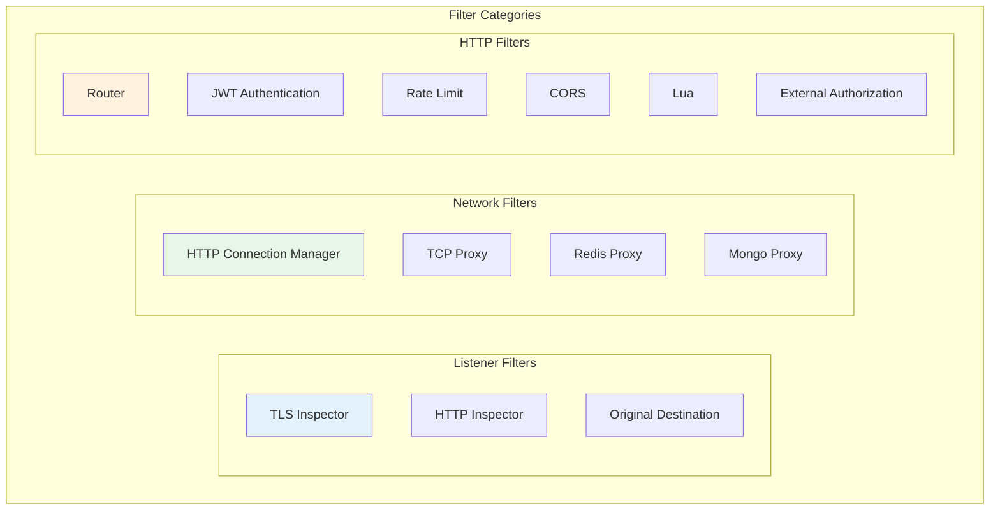
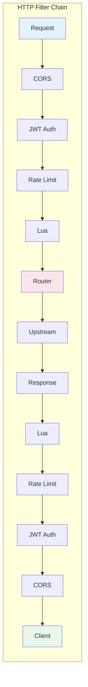
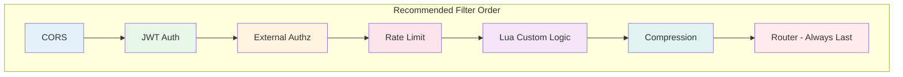

# How to Use Envoy Filters

Author: [nawazdhandala](https://www.github.com/nawazdhandala)

Tags: Envoy, Filters, Proxy, Traffic Management, HTTP Filters, Network Filters, Load Balancing

Description: Learn how to configure and use Envoy's native filter system to customize request processing, add authentication, implement rate limiting, and transform traffic.

---

## Introduction

Envoy Proxy uses a powerful filter architecture that allows you to intercept and manipulate traffic at various stages of request processing. Filters are the building blocks of Envoy's data plane functionality, enabling everything from basic routing to complex authentication and traffic transformation.

This guide covers Envoy's native filter system, showing you how to configure and chain filters together to build sophisticated traffic management solutions. Whether you're running Envoy as a standalone proxy or as part of a service mesh, understanding filters is essential for unlocking Envoy's full potential.

## How Envoy Filters Work

Envoy processes traffic through a chain of filters. Each filter can inspect, modify, or reject requests and responses as they flow through the proxy.



### Filter Types Overview

Envoy supports three main categories of filters:

| Filter Type | Layer | Purpose |
|-------------|-------|---------|
| Listener Filters | L3/L4 | Process raw connection data before protocol detection |
| Network Filters | L4 | Handle TCP-level processing and protocol-specific logic |
| HTTP Filters | L7 | Process HTTP requests and responses |



## Basic Envoy Configuration Structure

Before diving into filters, let's understand how Envoy configuration is structured:

```yaml
# envoy.yaml - Basic Envoy configuration structure
# This file defines how Envoy listens for and routes traffic

# Static resources are defined at startup and don't change
static_resources:
  # Listeners define where Envoy accepts connections
  listeners:
    - name: main_listener
      address:
        socket_address:
          address: 0.0.0.0
          port_value: 8080
      # Filter chains process traffic on this listener
      filter_chains:
        - filters:
            # Network filters process L4 traffic
            - name: envoy.filters.network.http_connection_manager
              typed_config:
                "@type": type.googleapis.com/envoy.extensions.filters.network.http_connection_manager.v3.HttpConnectionManager
                stat_prefix: ingress_http
                codec_type: AUTO
                route_config:
                  name: local_route
                  virtual_hosts:
                    - name: backend
                      domains: ["*"]
                      routes:
                        - match:
                            prefix: "/"
                          route:
                            cluster: backend_service
                # HTTP filters process L7 traffic
                http_filters:
                  - name: envoy.filters.http.router
                    typed_config:
                      "@type": type.googleapis.com/envoy.extensions.filters.http.router.v3.Router

  # Clusters define upstream services
  clusters:
    - name: backend_service
      connect_timeout: 5s
      type: STRICT_DNS
      lb_policy: ROUND_ROBIN
      load_assignment:
        cluster_name: backend_service
        endpoints:
          - lb_endpoints:
              - endpoint:
                  address:
                    socket_address:
                      address: backend
                      port_value: 8000
```

## Listener Filters

Listener filters run before the connection is associated with a network filter chain. They are useful for protocol detection and connection preprocessing.

### TLS Inspector Filter

The TLS Inspector filter examines TLS handshakes to detect SNI (Server Name Indication) for routing decisions:

```yaml
# Configuration for TLS-based routing using listener filters
# This allows routing to different backends based on the requested hostname

static_resources:
  listeners:
    - name: tls_listener
      address:
        socket_address:
          address: 0.0.0.0
          port_value: 443
      # Listener filters run first, before filter chains
      listener_filters:
        # TLS inspector examines the ClientHello to extract SNI
        - name: envoy.filters.listener.tls_inspector
          typed_config:
            "@type": type.googleapis.com/envoy.extensions.filters.listener.tls_inspector.v3.TlsInspector
      # Multiple filter chains can be matched based on SNI
      filter_chains:
        # Route api.example.com to the API backend
        - filter_chain_match:
            server_names:
              - "api.example.com"
          transport_socket:
            name: envoy.transport_sockets.tls
            typed_config:
              "@type": type.googleapis.com/envoy.extensions.transport_sockets.tls.v3.DownstreamTlsContext
              common_tls_context:
                tls_certificates:
                  - certificate_chain:
                      filename: /etc/certs/api-cert.pem
                    private_key:
                      filename: /etc/certs/api-key.pem
          filters:
            - name: envoy.filters.network.http_connection_manager
              typed_config:
                "@type": type.googleapis.com/envoy.extensions.filters.network.http_connection_manager.v3.HttpConnectionManager
                stat_prefix: api_http
                route_config:
                  name: api_route
                  virtual_hosts:
                    - name: api
                      domains: ["*"]
                      routes:
                        - match:
                            prefix: "/"
                          route:
                            cluster: api_cluster
                http_filters:
                  - name: envoy.filters.http.router
                    typed_config:
                      "@type": type.googleapis.com/envoy.extensions.filters.http.router.v3.Router
        # Route web.example.com to the web backend
        - filter_chain_match:
            server_names:
              - "web.example.com"
          transport_socket:
            name: envoy.transport_sockets.tls
            typed_config:
              "@type": type.googleapis.com/envoy.extensions.transport_sockets.tls.v3.DownstreamTlsContext
              common_tls_context:
                tls_certificates:
                  - certificate_chain:
                      filename: /etc/certs/web-cert.pem
                    private_key:
                      filename: /etc/certs/web-key.pem
          filters:
            - name: envoy.filters.network.http_connection_manager
              typed_config:
                "@type": type.googleapis.com/envoy.extensions.filters.network.http_connection_manager.v3.HttpConnectionManager
                stat_prefix: web_http
                route_config:
                  name: web_route
                  virtual_hosts:
                    - name: web
                      domains: ["*"]
                      routes:
                        - match:
                            prefix: "/"
                          route:
                            cluster: web_cluster
                http_filters:
                  - name: envoy.filters.http.router
                    typed_config:
                      "@type": type.googleapis.com/envoy.extensions.filters.http.router.v3.Router
```

### HTTP Inspector Filter

The HTTP Inspector filter detects whether traffic is HTTP without fully parsing it:

```yaml
# Use HTTP inspector to detect HTTP vs non-HTTP traffic
# Useful when you need to handle multiple protocols on the same port

static_resources:
  listeners:
    - name: multi_protocol_listener
      address:
        socket_address:
          address: 0.0.0.0
          port_value: 8080
      listener_filters:
        # HTTP inspector detects if the connection is HTTP
        - name: envoy.filters.listener.http_inspector
          typed_config:
            "@type": type.googleapis.com/envoy.extensions.filters.listener.http_inspector.v3.HttpInspector
      filter_chains:
        # Match HTTP traffic
        - filter_chain_match:
            application_protocols:
              - "http/1.1"
              - "h2c"
          filters:
            - name: envoy.filters.network.http_connection_manager
              typed_config:
                "@type": type.googleapis.com/envoy.extensions.filters.network.http_connection_manager.v3.HttpConnectionManager
                stat_prefix: http_traffic
                route_config:
                  name: http_route
                  virtual_hosts:
                    - name: http_backend
                      domains: ["*"]
                      routes:
                        - match:
                            prefix: "/"
                          route:
                            cluster: http_service
                http_filters:
                  - name: envoy.filters.http.router
                    typed_config:
                      "@type": type.googleapis.com/envoy.extensions.filters.http.router.v3.Router
        # Default: TCP proxy for non-HTTP traffic
        - filters:
            - name: envoy.filters.network.tcp_proxy
              typed_config:
                "@type": type.googleapis.com/envoy.extensions.filters.network.tcp_proxy.v3.TcpProxy
                stat_prefix: tcp_traffic
                cluster: tcp_service
```

## Network Filters

Network filters operate at the L4 (transport) layer and handle protocol-specific processing.

### HTTP Connection Manager

The HTTP Connection Manager is the most commonly used network filter. It handles HTTP/1.1, HTTP/2, and HTTP/3 traffic:

```yaml
# Complete HTTP Connection Manager configuration
# This filter is the gateway for all HTTP traffic processing

static_resources:
  listeners:
    - name: http_listener
      address:
        socket_address:
          address: 0.0.0.0
          port_value: 8080
      filter_chains:
        - filters:
            - name: envoy.filters.network.http_connection_manager
              typed_config:
                "@type": type.googleapis.com/envoy.extensions.filters.network.http_connection_manager.v3.HttpConnectionManager
                # Prefix for statistics emitted by this connection manager
                stat_prefix: ingress_http

                # Codec type: AUTO detects HTTP/1.1 vs HTTP/2
                codec_type: AUTO

                # Enable HTTP/2 for upstream connections
                http2_protocol_options:
                  max_concurrent_streams: 100
                  initial_stream_window_size: 65536
                  initial_connection_window_size: 1048576

                # Connection timeouts
                stream_idle_timeout: 300s
                request_timeout: 60s

                # Access logging configuration
                access_log:
                  - name: envoy.access_loggers.stdout
                    typed_config:
                      "@type": type.googleapis.com/envoy.extensions.access_loggers.stream.v3.StdoutAccessLog
                      log_format:
                        json_format:
                          timestamp: "%START_TIME%"
                          method: "%REQ(:METHOD)%"
                          path: "%REQ(X-ENVOY-ORIGINAL-PATH?:PATH)%"
                          protocol: "%PROTOCOL%"
                          status: "%RESPONSE_CODE%"
                          duration: "%DURATION%"
                          upstream: "%UPSTREAM_HOST%"
                          request_id: "%REQ(X-REQUEST-ID)%"

                # Route configuration
                route_config:
                  name: local_route
                  virtual_hosts:
                    - name: backend
                      domains:
                        - "*"
                      routes:
                        - match:
                            prefix: "/api/v1/"
                          route:
                            cluster: api_v1_cluster
                            timeout: 30s
                        - match:
                            prefix: "/api/v2/"
                          route:
                            cluster: api_v2_cluster
                            timeout: 30s
                        - match:
                            prefix: "/"
                          route:
                            cluster: default_cluster

                # HTTP filters chain
                http_filters:
                  - name: envoy.filters.http.router
                    typed_config:
                      "@type": type.googleapis.com/envoy.extensions.filters.http.router.v3.Router
```

### TCP Proxy Filter

For non-HTTP traffic, the TCP Proxy filter forwards raw TCP connections:

```yaml
# TCP Proxy configuration for database connections
# Useful for proxying MySQL, PostgreSQL, or other TCP services

static_resources:
  listeners:
    - name: mysql_listener
      address:
        socket_address:
          address: 0.0.0.0
          port_value: 3306
      filter_chains:
        - filters:
            - name: envoy.filters.network.tcp_proxy
              typed_config:
                "@type": type.googleapis.com/envoy.extensions.filters.network.tcp_proxy.v3.TcpProxy
                stat_prefix: mysql_proxy

                # Target cluster for the TCP connection
                cluster: mysql_cluster

                # Idle timeout for the connection
                idle_timeout: 3600s

                # Access logging for TCP connections
                access_log:
                  - name: envoy.access_loggers.stdout
                    typed_config:
                      "@type": type.googleapis.com/envoy.extensions.access_loggers.stream.v3.StdoutAccessLog
                      log_format:
                        json_format:
                          timestamp: "%START_TIME%"
                          duration: "%DURATION%"
                          bytes_sent: "%BYTES_SENT%"
                          bytes_received: "%BYTES_RECEIVED%"
                          upstream: "%UPSTREAM_HOST%"

                # Hash policy for consistent routing (optional)
                hash_policy:
                  - source_ip: {}

  clusters:
    - name: mysql_cluster
      connect_timeout: 5s
      type: STRICT_DNS
      lb_policy: ROUND_ROBIN
      load_assignment:
        cluster_name: mysql_cluster
        endpoints:
          - lb_endpoints:
              - endpoint:
                  address:
                    socket_address:
                      address: mysql-primary.database.svc
                      port_value: 3306
              - endpoint:
                  address:
                    socket_address:
                      address: mysql-replica.database.svc
                      port_value: 3306
```

## HTTP Filters

HTTP filters are where most of the traffic manipulation happens. They form a chain that processes requests and responses in order.



### Router Filter

The Router filter is mandatory and must be the last filter in the chain. It performs the actual routing to upstream clusters:

```yaml
# Router filter configuration with retry and timeout settings
# The router is responsible for forwarding requests to upstream services

http_filters:
  - name: envoy.filters.http.router
    typed_config:
      "@type": type.googleapis.com/envoy.extensions.filters.http.router.v3.Router
      # Enable dynamic stats for route-level metrics
      dynamic_stats: true
      # Start child span for tracing
      start_child_span: true
```

Advanced routing is configured in the route_config section:

```yaml
# Advanced routing configuration with retries, timeouts, and traffic splitting

route_config:
  name: advanced_routes
  virtual_hosts:
    - name: api_service
      domains:
        - "api.example.com"
        - "api.example.com:*"
      # Virtual host level retry policy
      retry_policy:
        retry_on: "5xx,reset,connect-failure,retriable-4xx"
        num_retries: 3
        per_try_timeout: 10s
        retry_host_predicate:
          - name: envoy.retry_host_predicates.previous_hosts
        host_selection_retry_max_attempts: 5
      routes:
        # Canary route with traffic splitting
        - match:
            prefix: "/api/v2/"
            headers:
              - name: "x-canary"
                exact_match: "true"
          route:
            cluster: api_v2_canary
            timeout: 30s

        # Weighted traffic split between stable and canary
        - match:
            prefix: "/api/v2/"
          route:
            weighted_clusters:
              clusters:
                - name: api_v2_stable
                  weight: 90
                - name: api_v2_canary
                  weight: 10
            timeout: 30s
            retry_policy:
              retry_on: "5xx"
              num_retries: 2

        # Route with request hedging
        - match:
            prefix: "/api/critical/"
          route:
            cluster: critical_service
            timeout: 5s
            hedge_policy:
              initial_requests: 1
              additional_request_chance:
                numerator: 50
                denominator: HUNDRED

        # Route with hash-based routing for session affinity
        - match:
            prefix: "/api/stateful/"
          route:
            cluster: stateful_service
            hash_policy:
              - header:
                  header_name: "x-user-id"
              - cookie:
                  name: "session_id"
                  ttl: 3600s
```

### JWT Authentication Filter

The JWT Authentication filter validates JSON Web Tokens:

```yaml
# JWT Authentication filter configuration
# Validates tokens and extracts claims for downstream services

http_filters:
  # JWT filter must come before the router
  - name: envoy.filters.http.jwt_authn
    typed_config:
      "@type": type.googleapis.com/envoy.extensions.filters.http.jwt_authn.v3.JwtAuthentication
      providers:
        # Auth0 provider configuration
        auth0_provider:
          # Issuer must match the 'iss' claim in the token
          issuer: "https://your-tenant.auth0.com/"

          # Audiences that this provider accepts
          audiences:
            - "https://api.example.com"

          # JWKS endpoint for token verification
          remote_jwks:
            http_uri:
              uri: "https://your-tenant.auth0.com/.well-known/jwks.json"
              cluster: auth0_jwks
              timeout: 5s
            # Cache JWKS for 5 minutes
            cache_duration: 300s

          # Forward claims as headers to upstream
          forward_payload_header: "x-jwt-payload"

          # Extract specific claims to headers
          claim_to_headers:
            - header_name: "x-user-id"
              claim_name: "sub"
            - header_name: "x-user-email"
              claim_name: "email"
            - header_name: "x-user-roles"
              claim_name: "https://example.com/roles"

        # Internal service token provider
        internal_provider:
          issuer: "internal-auth-service"
          audiences:
            - "internal-api"
          # Local JWKS for internal tokens
          local_jwks:
            inline_string: |
              {
                "keys": [
                  {
                    "kty": "RSA",
                    "n": "your-public-key-n-value",
                    "e": "AQAB",
                    "kid": "internal-key-1"
                  }
                ]
              }

      # Rules define which routes require authentication
      rules:
        # Public endpoints - no authentication required
        - match:
            prefix: "/public/"
        - match:
            prefix: "/health"
        - match:
            prefix: "/ready"

        # API endpoints require Auth0 token
        - match:
            prefix: "/api/"
          requires:
            provider_name: "auth0_provider"

        # Internal endpoints accept either provider
        - match:
            prefix: "/internal/"
          requires:
            requires_any:
              requirements:
                - provider_name: "auth0_provider"
                - provider_name: "internal_provider"

  - name: envoy.filters.http.router
    typed_config:
      "@type": type.googleapis.com/envoy.extensions.filters.http.router.v3.Router

# Don't forget to add the JWKS cluster
clusters:
  - name: auth0_jwks
    connect_timeout: 5s
    type: LOGICAL_DNS
    lb_policy: ROUND_ROBIN
    load_assignment:
      cluster_name: auth0_jwks
      endpoints:
        - lb_endpoints:
            - endpoint:
                address:
                  socket_address:
                    address: your-tenant.auth0.com
                    port_value: 443
    transport_socket:
      name: envoy.transport_sockets.tls
      typed_config:
        "@type": type.googleapis.com/envoy.extensions.transport_sockets.tls.v3.UpstreamTlsContext
        sni: your-tenant.auth0.com
```

### Rate Limiting Filter

Envoy supports both local (per-instance) and global (distributed) rate limiting:

```yaml
# Local rate limiting - per Envoy instance
# Good for protecting against sudden traffic spikes

http_filters:
  - name: envoy.filters.http.local_ratelimit
    typed_config:
      "@type": type.googleapis.com/envoy.extensions.filters.http.local_ratelimit.v3.LocalRateLimit
      stat_prefix: http_local_rate_limiter

      # Token bucket configuration
      token_bucket:
        # Maximum tokens in the bucket
        max_tokens: 1000
        # Tokens added per fill interval
        tokens_per_fill: 100
        # Fill interval
        fill_interval: 1s

      # Percentage of requests to apply rate limiting
      filter_enabled:
        runtime_key: local_rate_limit_enabled
        default_value:
          numerator: 100
          denominator: HUNDRED

      # Percentage of rate-limited requests to actually reject
      filter_enforced:
        runtime_key: local_rate_limit_enforced
        default_value:
          numerator: 100
          denominator: HUNDRED

      # Response headers to add when rate limited
      response_headers_to_add:
        - append_action: OVERWRITE_IF_EXISTS_OR_ADD
          header:
            key: "x-local-rate-limit"
            value: "true"

      # Custom status code for rate-limited responses
      status:
        code: TooManyRequests

  - name: envoy.filters.http.router
    typed_config:
      "@type": type.googleapis.com/envoy.extensions.filters.http.router.v3.Router
```

For distributed rate limiting, use the global rate limit filter with an external rate limit service:

```yaml
# Global rate limiting with external service
# Provides consistent rate limiting across all Envoy instances

http_filters:
  - name: envoy.filters.http.ratelimit
    typed_config:
      "@type": type.googleapis.com/envoy.extensions.filters.http.ratelimit.v3.RateLimit
      # Domain for rate limit rules
      domain: production

      # Failure mode: allow or deny when rate limit service is unavailable
      failure_mode_deny: false

      # Enable sending x-ratelimit headers
      enable_x_ratelimit_headers: DRAFT_VERSION_03

      # Rate limit service configuration
      rate_limit_service:
        grpc_service:
          envoy_grpc:
            cluster_name: rate_limit_cluster
        transport_api_version: V3

  - name: envoy.filters.http.router
    typed_config:
      "@type": type.googleapis.com/envoy.extensions.filters.http.router.v3.Router

# Route configuration with rate limit actions
route_config:
  name: rate_limited_routes
  virtual_hosts:
    - name: api
      domains: ["*"]
      routes:
        - match:
            prefix: "/api/"
          route:
            cluster: api_cluster
            # Rate limit actions for this route
            rate_limits:
              # Rate limit by client IP
              - actions:
                  - remote_address: {}
              # Rate limit by API key header
              - actions:
                  - request_headers:
                      header_name: "x-api-key"
                      descriptor_key: "api_key"
              # Rate limit by user ID from JWT
              - actions:
                  - request_headers:
                      header_name: "x-user-id"
                      descriptor_key: "user_id"

# Rate limit service cluster
clusters:
  - name: rate_limit_cluster
    connect_timeout: 1s
    type: STRICT_DNS
    lb_policy: ROUND_ROBIN
    http2_protocol_options: {}
    load_assignment:
      cluster_name: rate_limit_cluster
      endpoints:
        - lb_endpoints:
            - endpoint:
                address:
                  socket_address:
                    address: ratelimit.service.svc
                    port_value: 8081
```

### CORS Filter

The CORS filter handles Cross-Origin Resource Sharing headers:

```yaml
# CORS filter configuration
# Handles preflight requests and adds CORS headers to responses

http_filters:
  - name: envoy.filters.http.cors
    typed_config:
      "@type": type.googleapis.com/envoy.extensions.filters.http.cors.v3.Cors

  - name: envoy.filters.http.router
    typed_config:
      "@type": type.googleapis.com/envoy.extensions.filters.http.router.v3.Router

# CORS is configured per route or virtual host
route_config:
  name: cors_routes
  virtual_hosts:
    - name: api
      domains: ["api.example.com"]
      # Virtual host level CORS policy
      cors:
        # Allowed origins (exact match)
        allow_origin_string_match:
          - exact: "https://app.example.com"
          - exact: "https://admin.example.com"
          # Regex match for development environments
          - safe_regex:
              google_re2: {}
              regex: "https://.*\\.example\\.dev"

        # Allowed HTTP methods
        allow_methods: "GET, POST, PUT, DELETE, PATCH, OPTIONS"

        # Allowed request headers
        allow_headers: "content-type, authorization, x-request-id, x-api-key"

        # Headers exposed to the client
        expose_headers: "x-request-id, x-ratelimit-remaining"

        # Allow credentials (cookies, authorization headers)
        allow_credentials: true

        # Preflight cache duration
        max_age: "86400"

      routes:
        # Route with different CORS policy
        - match:
            prefix: "/public-api/"
          route:
            cluster: public_api
          typed_per_filter_config:
            envoy.filters.http.cors:
              "@type": type.googleapis.com/envoy.extensions.filters.http.cors.v3.CorsPolicy
              allow_origin_string_match:
                - exact: "*"
              allow_methods: "GET, OPTIONS"
              allow_headers: "content-type"
              max_age: "3600"

        - match:
            prefix: "/"
          route:
            cluster: api_cluster
```

### Lua Filter

The Lua filter allows custom request/response processing using Lua scripts:

```yaml
# Lua filter for custom request processing
# Useful for complex transformations not covered by built-in filters

http_filters:
  - name: envoy.filters.http.lua
    typed_config:
      "@type": type.googleapis.com/envoy.extensions.filters.http.lua.v3.Lua
      # Inline Lua code
      inline_code: |
        -- Helper function to generate a simple UUID
        function generate_uuid()
          local template = 'xxxxxxxx-xxxx-4xxx-yxxx-xxxxxxxxxxxx'
          return string.gsub(template, '[xy]', function(c)
            local v = (c == 'x') and math.random(0, 0xf) or math.random(8, 0xb)
            return string.format('%x', v)
          end)
        end

        -- Process incoming requests
        function envoy_on_request(request_handle)
          -- Get request headers
          local headers = request_handle:headers()
          local path = headers:get(":path")
          local method = headers:get(":method")

          -- Add request ID if not present
          local request_id = headers:get("x-request-id")
          if request_id == nil then
            request_id = generate_uuid()
            headers:add("x-request-id", request_id)
          end

          -- Add timestamp header
          headers:add("x-request-timestamp", tostring(os.time()))

          -- Log request information
          request_handle:logInfo(string.format(
            "Request: %s %s (request_id=%s)",
            method, path, request_id
          ))

          -- Store data in dynamic metadata for later use
          request_handle:streamInfo():dynamicMetadata():set(
            "request_tracking",
            "request_id",
            request_id
          )
          request_handle:streamInfo():dynamicMetadata():set(
            "request_tracking",
            "start_time",
            os.clock()
          )

          -- Block requests to admin endpoints without admin header
          if string.find(path, "/admin") then
            local admin_token = headers:get("x-admin-token")
            if admin_token == nil or admin_token ~= "secret-admin-token" then
              request_handle:respond(
                {[":status"] = "403"},
                '{"error": "Admin access denied"}'
              )
              return
            end
          end
        end

        -- Process outgoing responses
        function envoy_on_response(response_handle)
          local headers = response_handle:headers()
          local status = headers:get(":status")

          -- Get request metadata
          local metadata = response_handle:streamInfo():dynamicMetadata():get("request_tracking")

          -- Add request ID to response
          if metadata and metadata["request_id"] then
            headers:add("x-request-id", metadata["request_id"])
          end

          -- Calculate and add response time
          if metadata and metadata["start_time"] then
            local duration = os.clock() - metadata["start_time"]
            headers:add("x-response-time-ms", string.format("%.2f", duration * 1000))
          end

          -- Add security headers
          headers:add("x-content-type-options", "nosniff")
          headers:add("x-frame-options", "DENY")
          headers:add("x-xss-protection", "1; mode=block")

          -- Remove server header to hide implementation details
          headers:remove("server")

          -- Log response
          response_handle:logInfo(string.format(
            "Response: status=%s",
            status
          ))
        end

  - name: envoy.filters.http.router
    typed_config:
      "@type": type.googleapis.com/envoy.extensions.filters.http.router.v3.Router
```

### External Authorization Filter

The External Authorization filter delegates authorization decisions to an external service:

```yaml
# External authorization filter configuration
# Sends authorization requests to an external gRPC or HTTP service

http_filters:
  - name: envoy.filters.http.ext_authz
    typed_config:
      "@type": type.googleapis.com/envoy.extensions.filters.http.ext_authz.v3.ExtAuthz

      # gRPC authorization service
      grpc_service:
        envoy_grpc:
          cluster_name: ext_authz_cluster
        timeout: 0.5s

      # Include peer certificate in authorization request
      include_peer_certificate: true

      # Transport API version
      transport_api_version: V3

      # Failure mode: open (allow) or closed (deny)
      failure_mode_allow: false

      # Status on error (when authz service is unavailable)
      status_on_error:
        code: ServiceUnavailable

      # Headers to send to the authorization service
      with_request_body:
        max_request_bytes: 8192
        allow_partial_message: true
        pack_as_bytes: true

      # Clear route cache if authz modifies headers used in routing
      clear_route_cache: true

  - name: envoy.filters.http.router
    typed_config:
      "@type": type.googleapis.com/envoy.extensions.filters.http.router.v3.Router

# Per-route authorization configuration
route_config:
  name: authz_routes
  virtual_hosts:
    - name: api
      domains: ["*"]
      routes:
        # Public endpoint - skip authorization
        - match:
            prefix: "/public/"
          route:
            cluster: public_cluster
          typed_per_filter_config:
            envoy.filters.http.ext_authz:
              "@type": type.googleapis.com/envoy.extensions.filters.http.ext_authz.v3.ExtAuthzPerRoute
              disabled: true

        # Admin endpoint - require authorization with specific context
        - match:
            prefix: "/admin/"
          route:
            cluster: admin_cluster
          typed_per_filter_config:
            envoy.filters.http.ext_authz:
              "@type": type.googleapis.com/envoy.extensions.filters.http.ext_authz.v3.ExtAuthzPerRoute
              check_settings:
                context_extensions:
                  required_role: "admin"
                  resource_type: "admin_panel"

        # Default - use standard authorization
        - match:
            prefix: "/"
          route:
            cluster: api_cluster

# Authorization service cluster
clusters:
  - name: ext_authz_cluster
    connect_timeout: 0.5s
    type: STRICT_DNS
    lb_policy: ROUND_ROBIN
    http2_protocol_options: {}
    load_assignment:
      cluster_name: ext_authz_cluster
      endpoints:
        - lb_endpoints:
            - endpoint:
                address:
                  socket_address:
                    address: authz-service.auth.svc
                    port_value: 9001
```

### Compression Filter

The Compression filter compresses response bodies to reduce bandwidth:

```yaml
# Compression filter configuration
# Compresses responses based on content type and size

http_filters:
  - name: envoy.filters.http.compressor
    typed_config:
      "@type": type.googleapis.com/envoy.extensions.filters.http.compressor.v3.Compressor

      # Response direction configuration
      response_direction_config:
        common_config:
          # Only compress responses larger than 1KB
          min_content_length: 1024

          # Content types to compress
          content_type:
            - "application/json"
            - "application/javascript"
            - "application/xml"
            - "text/html"
            - "text/css"
            - "text/plain"
            - "text/xml"
            - "image/svg+xml"

          # Disable compression if response has ETag
          disable_on_etag_header: true

        # Remove Accept-Encoding header after compression decision
        disable_on_etag_header: true

      # Compressor library configuration
      compressor_library:
        name: text_optimized
        typed_config:
          "@type": type.googleapis.com/envoy.extensions.compression.gzip.compressor.v3.Gzip
          # Compression level: BEST_SPEED (1) to BEST_COMPRESSION (9)
          compression_level: COMPRESSION_LEVEL_5
          # Memory level for compression (1-9)
          memory_level: 5
          # Window bits (9-15)
          window_bits: 15
          # Compression strategy
          compression_strategy: DEFAULT_STRATEGY

  - name: envoy.filters.http.router
    typed_config:
      "@type": type.googleapis.com/envoy.extensions.filters.http.router.v3.Router
```

## Chaining Filters Together

The order of filters in the chain matters. Here's a complete example showing proper filter ordering:



```yaml
# Complete filter chain example with proper ordering
# Each filter processes requests in order, and responses in reverse order

static_resources:
  listeners:
    - name: main_listener
      address:
        socket_address:
          address: 0.0.0.0
          port_value: 8080
      filter_chains:
        - filters:
            - name: envoy.filters.network.http_connection_manager
              typed_config:
                "@type": type.googleapis.com/envoy.extensions.filters.network.http_connection_manager.v3.HttpConnectionManager
                stat_prefix: ingress_http
                codec_type: AUTO

                # Access logging
                access_log:
                  - name: envoy.access_loggers.stdout
                    typed_config:
                      "@type": type.googleapis.com/envoy.extensions.access_loggers.stream.v3.StdoutAccessLog

                route_config:
                  name: local_route
                  virtual_hosts:
                    - name: backend
                      domains: ["*"]
                      cors:
                        allow_origin_string_match:
                          - exact: "https://app.example.com"
                        allow_methods: "GET, POST, PUT, DELETE, OPTIONS"
                        allow_headers: "content-type, authorization"
                        allow_credentials: true
                        max_age: "86400"
                      routes:
                        - match:
                            prefix: "/"
                          route:
                            cluster: backend_service

                # HTTP filters in recommended order
                http_filters:
                  # 1. CORS - Handle preflight requests first
                  - name: envoy.filters.http.cors
                    typed_config:
                      "@type": type.googleapis.com/envoy.extensions.filters.http.cors.v3.Cors

                  # 2. JWT Authentication - Validate tokens
                  - name: envoy.filters.http.jwt_authn
                    typed_config:
                      "@type": type.googleapis.com/envoy.extensions.filters.http.jwt_authn.v3.JwtAuthentication
                      providers:
                        main_provider:
                          issuer: "https://auth.example.com/"
                          audiences:
                            - "api.example.com"
                          remote_jwks:
                            http_uri:
                              uri: "https://auth.example.com/.well-known/jwks.json"
                              cluster: auth_cluster
                              timeout: 5s
                          claim_to_headers:
                            - header_name: "x-user-id"
                              claim_name: "sub"
                      rules:
                        - match:
                            prefix: "/public/"
                        - match:
                            prefix: "/"
                          requires:
                            provider_name: "main_provider"

                  # 3. External Authorization - Complex authorization logic
                  - name: envoy.filters.http.ext_authz
                    typed_config:
                      "@type": type.googleapis.com/envoy.extensions.filters.http.ext_authz.v3.ExtAuthz
                      grpc_service:
                        envoy_grpc:
                          cluster_name: authz_cluster
                        timeout: 0.5s
                      failure_mode_allow: false

                  # 4. Local Rate Limiting - Protect against abuse
                  - name: envoy.filters.http.local_ratelimit
                    typed_config:
                      "@type": type.googleapis.com/envoy.extensions.filters.http.local_ratelimit.v3.LocalRateLimit
                      stat_prefix: http_local_rate_limiter
                      token_bucket:
                        max_tokens: 1000
                        tokens_per_fill: 100
                        fill_interval: 1s
                      filter_enabled:
                        default_value:
                          numerator: 100
                          denominator: HUNDRED
                      filter_enforced:
                        default_value:
                          numerator: 100
                          denominator: HUNDRED

                  # 5. Lua - Custom processing logic
                  - name: envoy.filters.http.lua
                    typed_config:
                      "@type": type.googleapis.com/envoy.extensions.filters.http.lua.v3.Lua
                      inline_code: |
                        function envoy_on_request(request_handle)
                          local headers = request_handle:headers()
                          headers:add("x-processed", "true")
                          headers:add("x-timestamp", tostring(os.time()))
                        end

                        function envoy_on_response(response_handle)
                          local headers = response_handle:headers()
                          headers:add("x-served-by", "envoy")
                          headers:remove("server")
                        end

                  # 6. Compression - Compress responses
                  - name: envoy.filters.http.compressor
                    typed_config:
                      "@type": type.googleapis.com/envoy.extensions.filters.http.compressor.v3.Compressor
                      response_direction_config:
                        common_config:
                          min_content_length: 1024
                          content_type:
                            - "application/json"
                            - "text/html"
                      compressor_library:
                        name: gzip
                        typed_config:
                          "@type": type.googleapis.com/envoy.extensions.compression.gzip.compressor.v3.Gzip
                          compression_level: COMPRESSION_LEVEL_5

                  # 7. Router - Always last, performs actual routing
                  - name: envoy.filters.http.router
                    typed_config:
                      "@type": type.googleapis.com/envoy.extensions.filters.http.router.v3.Router

  clusters:
    - name: backend_service
      connect_timeout: 5s
      type: STRICT_DNS
      lb_policy: ROUND_ROBIN
      load_assignment:
        cluster_name: backend_service
        endpoints:
          - lb_endpoints:
              - endpoint:
                  address:
                    socket_address:
                      address: backend.default.svc
                      port_value: 8000

    - name: auth_cluster
      connect_timeout: 5s
      type: LOGICAL_DNS
      lb_policy: ROUND_ROBIN
      load_assignment:
        cluster_name: auth_cluster
        endpoints:
          - lb_endpoints:
              - endpoint:
                  address:
                    socket_address:
                      address: auth.example.com
                      port_value: 443
      transport_socket:
        name: envoy.transport_sockets.tls
        typed_config:
          "@type": type.googleapis.com/envoy.extensions.transport_sockets.tls.v3.UpstreamTlsContext
          sni: auth.example.com

    - name: authz_cluster
      connect_timeout: 0.5s
      type: STRICT_DNS
      lb_policy: ROUND_ROBIN
      http2_protocol_options: {}
      load_assignment:
        cluster_name: authz_cluster
        endpoints:
          - lb_endpoints:
              - endpoint:
                  address:
                    socket_address:
                      address: authz.default.svc
                      port_value: 9001
```

## Real-World Example: API Gateway

Here's a complete configuration for an API gateway with authentication, rate limiting, and routing:

```yaml
# Complete API Gateway configuration
# Demonstrates a production-ready Envoy setup

admin:
  address:
    socket_address:
      address: 127.0.0.1
      port_value: 9901

static_resources:
  listeners:
    - name: api_gateway
      address:
        socket_address:
          address: 0.0.0.0
          port_value: 8443
      listener_filters:
        - name: envoy.filters.listener.tls_inspector
          typed_config:
            "@type": type.googleapis.com/envoy.extensions.filters.listener.tls_inspector.v3.TlsInspector
      filter_chains:
        - transport_socket:
            name: envoy.transport_sockets.tls
            typed_config:
              "@type": type.googleapis.com/envoy.extensions.transport_sockets.tls.v3.DownstreamTlsContext
              common_tls_context:
                tls_certificates:
                  - certificate_chain:
                      filename: /etc/certs/server-cert.pem
                    private_key:
                      filename: /etc/certs/server-key.pem
                alpn_protocols:
                  - "h2"
                  - "http/1.1"
          filters:
            - name: envoy.filters.network.http_connection_manager
              typed_config:
                "@type": type.googleapis.com/envoy.extensions.filters.network.http_connection_manager.v3.HttpConnectionManager
                stat_prefix: api_gateway
                codec_type: AUTO

                # Use server header
                server_name: "api-gateway"

                # HTTP/2 settings
                http2_protocol_options:
                  max_concurrent_streams: 100

                # Timeouts
                stream_idle_timeout: 300s
                request_timeout: 60s

                # Access logging with detailed format
                access_log:
                  - name: envoy.access_loggers.file
                    typed_config:
                      "@type": type.googleapis.com/envoy.extensions.access_loggers.file.v3.FileAccessLog
                      path: /var/log/envoy/access.log
                      log_format:
                        json_format:
                          timestamp: "%START_TIME%"
                          request_id: "%REQ(X-REQUEST-ID)%"
                          method: "%REQ(:METHOD)%"
                          path: "%REQ(X-ENVOY-ORIGINAL-PATH?:PATH)%"
                          protocol: "%PROTOCOL%"
                          status: "%RESPONSE_CODE%"
                          response_flags: "%RESPONSE_FLAGS%"
                          bytes_received: "%BYTES_RECEIVED%"
                          bytes_sent: "%BYTES_SENT%"
                          duration: "%DURATION%"
                          upstream_service_time: "%RESP(X-ENVOY-UPSTREAM-SERVICE-TIME)%"
                          upstream_host: "%UPSTREAM_HOST%"
                          upstream_cluster: "%UPSTREAM_CLUSTER%"
                          downstream_remote_address: "%DOWNSTREAM_REMOTE_ADDRESS%"
                          user_agent: "%REQ(USER-AGENT)%"
                          referer: "%REQ(REFERER)%"
                          user_id: "%REQ(X-USER-ID)%"

                route_config:
                  name: api_routes
                  virtual_hosts:
                    - name: api
                      domains:
                        - "api.example.com"
                        - "api.example.com:*"

                      # CORS configuration
                      cors:
                        allow_origin_string_match:
                          - exact: "https://app.example.com"
                          - exact: "https://admin.example.com"
                        allow_methods: "GET, POST, PUT, DELETE, PATCH, OPTIONS"
                        allow_headers: "content-type, authorization, x-request-id"
                        expose_headers: "x-request-id, x-ratelimit-remaining"
                        allow_credentials: true
                        max_age: "86400"

                      # Retry policy for all routes
                      retry_policy:
                        retry_on: "5xx,reset,connect-failure"
                        num_retries: 2
                        per_try_timeout: 10s

                      routes:
                        # Health check endpoint
                        - match:
                            prefix: "/health"
                          direct_response:
                            status: 200
                            body:
                              inline_string: '{"status": "healthy"}'
                          response_headers_to_add:
                            - header:
                                key: "content-type"
                                value: "application/json"

                        # Users API
                        - match:
                            prefix: "/api/v1/users"
                          route:
                            cluster: users_service
                            timeout: 30s

                        # Orders API
                        - match:
                            prefix: "/api/v1/orders"
                          route:
                            cluster: orders_service
                            timeout: 30s

                        # Products API with caching
                        - match:
                            prefix: "/api/v1/products"
                          route:
                            cluster: products_service
                            timeout: 30s
                          response_headers_to_add:
                            - header:
                                key: "cache-control"
                                value: "public, max-age=300"

                        # Default route
                        - match:
                            prefix: "/"
                          route:
                            cluster: default_service

                http_filters:
                  # CORS filter
                  - name: envoy.filters.http.cors
                    typed_config:
                      "@type": type.googleapis.com/envoy.extensions.filters.http.cors.v3.Cors

                  # JWT Authentication
                  - name: envoy.filters.http.jwt_authn
                    typed_config:
                      "@type": type.googleapis.com/envoy.extensions.filters.http.jwt_authn.v3.JwtAuthentication
                      providers:
                        auth0:
                          issuer: "https://example.auth0.com/"
                          audiences:
                            - "api.example.com"
                          remote_jwks:
                            http_uri:
                              uri: "https://example.auth0.com/.well-known/jwks.json"
                              cluster: auth0_cluster
                              timeout: 5s
                            cache_duration: 300s
                          claim_to_headers:
                            - header_name: "x-user-id"
                              claim_name: "sub"
                            - header_name: "x-user-email"
                              claim_name: "email"
                      rules:
                        - match:
                            prefix: "/health"
                        - match:
                            prefix: "/api/"
                          requires:
                            provider_name: "auth0"

                  # Rate limiting
                  - name: envoy.filters.http.local_ratelimit
                    typed_config:
                      "@type": type.googleapis.com/envoy.extensions.filters.http.local_ratelimit.v3.LocalRateLimit
                      stat_prefix: api_rate_limiter
                      token_bucket:
                        max_tokens: 100
                        tokens_per_fill: 10
                        fill_interval: 1s
                      filter_enabled:
                        default_value:
                          numerator: 100
                          denominator: HUNDRED
                      filter_enforced:
                        default_value:
                          numerator: 100
                          denominator: HUNDRED
                      response_headers_to_add:
                        - header:
                            key: "x-ratelimit-limit"
                            value: "100"
                          append_action: OVERWRITE_IF_EXISTS_OR_ADD

                  # Custom processing
                  - name: envoy.filters.http.lua
                    typed_config:
                      "@type": type.googleapis.com/envoy.extensions.filters.http.lua.v3.Lua
                      inline_code: |
                        function envoy_on_request(request_handle)
                          -- Add request ID if missing
                          local headers = request_handle:headers()
                          if headers:get("x-request-id") == nil then
                            local uuid = string.format('%x%x-%x-%x-%x-%x%x%x',
                              math.random(0, 0xffff), math.random(0, 0xffff),
                              math.random(0, 0xffff),
                              math.random(0, 0x0fff) + 0x4000,
                              math.random(0, 0x3fff) + 0x8000,
                              math.random(0, 0xffff), math.random(0, 0xffff), math.random(0, 0xffff))
                            headers:add("x-request-id", uuid)
                          end
                        end

                        function envoy_on_response(response_handle)
                          local headers = response_handle:headers()
                          -- Add security headers
                          headers:add("strict-transport-security", "max-age=31536000; includeSubDomains")
                          headers:add("x-content-type-options", "nosniff")
                          headers:add("x-frame-options", "DENY")
                          -- Remove sensitive headers
                          headers:remove("x-powered-by")
                        end

                  # Compression
                  - name: envoy.filters.http.compressor
                    typed_config:
                      "@type": type.googleapis.com/envoy.extensions.filters.http.compressor.v3.Compressor
                      response_direction_config:
                        common_config:
                          min_content_length: 1024
                          content_type:
                            - "application/json"
                            - "text/plain"
                      compressor_library:
                        name: gzip
                        typed_config:
                          "@type": type.googleapis.com/envoy.extensions.compression.gzip.compressor.v3.Gzip
                          compression_level: COMPRESSION_LEVEL_5

                  # Router (must be last)
                  - name: envoy.filters.http.router
                    typed_config:
                      "@type": type.googleapis.com/envoy.extensions.filters.http.router.v3.Router

  clusters:
    - name: users_service
      connect_timeout: 5s
      type: STRICT_DNS
      lb_policy: ROUND_ROBIN
      health_checks:
        - timeout: 5s
          interval: 10s
          unhealthy_threshold: 3
          healthy_threshold: 2
          http_health_check:
            path: /health
      load_assignment:
        cluster_name: users_service
        endpoints:
          - lb_endpoints:
              - endpoint:
                  address:
                    socket_address:
                      address: users.default.svc
                      port_value: 8000

    - name: orders_service
      connect_timeout: 5s
      type: STRICT_DNS
      lb_policy: ROUND_ROBIN
      health_checks:
        - timeout: 5s
          interval: 10s
          unhealthy_threshold: 3
          healthy_threshold: 2
          http_health_check:
            path: /health
      load_assignment:
        cluster_name: orders_service
        endpoints:
          - lb_endpoints:
              - endpoint:
                  address:
                    socket_address:
                      address: orders.default.svc
                      port_value: 8000

    - name: products_service
      connect_timeout: 5s
      type: STRICT_DNS
      lb_policy: ROUND_ROBIN
      health_checks:
        - timeout: 5s
          interval: 10s
          unhealthy_threshold: 3
          healthy_threshold: 2
          http_health_check:
            path: /health
      load_assignment:
        cluster_name: products_service
        endpoints:
          - lb_endpoints:
              - endpoint:
                  address:
                    socket_address:
                      address: products.default.svc
                      port_value: 8000

    - name: default_service
      connect_timeout: 5s
      type: STRICT_DNS
      lb_policy: ROUND_ROBIN
      load_assignment:
        cluster_name: default_service
        endpoints:
          - lb_endpoints:
              - endpoint:
                  address:
                    socket_address:
                      address: default.default.svc
                      port_value: 8000

    - name: auth0_cluster
      connect_timeout: 5s
      type: LOGICAL_DNS
      lb_policy: ROUND_ROBIN
      load_assignment:
        cluster_name: auth0_cluster
        endpoints:
          - lb_endpoints:
              - endpoint:
                  address:
                    socket_address:
                      address: example.auth0.com
                      port_value: 443
      transport_socket:
        name: envoy.transport_sockets.tls
        typed_config:
          "@type": type.googleapis.com/envoy.extensions.transport_sockets.tls.v3.UpstreamTlsContext
          sni: example.auth0.com
```

## Debugging Filters

When troubleshooting filter configurations, these techniques help:

### Enable Debug Logging

```yaml
# Set log level in bootstrap config
admin:
  address:
    socket_address:
      address: 127.0.0.1
      port_value: 9901

# Or dynamically via admin API:
# POST /logging?level=debug
# POST /logging?paths=filter:debug
```

### View Active Configuration

```bash
# Get current listener configuration
curl -s localhost:9901/config_dump?resource=dynamic_listeners | jq .

# Get all HTTP filters
curl -s localhost:9901/config_dump | jq '.configs[] | select(.["@type"] | contains("ListenersConfigDump"))'

# Check filter statistics
curl -s localhost:9901/stats | grep -E "http\.(ingress|egress)"

# View rate limit stats
curl -s localhost:9901/stats | grep rate_limit
```

### Test Filter Chain

```bash
# Send test request and examine headers
curl -v -H "Authorization: Bearer $TOKEN" \
  -H "X-Request-ID: test-123" \
  https://api.example.com/api/v1/users

# Test CORS preflight
curl -v -X OPTIONS \
  -H "Origin: https://app.example.com" \
  -H "Access-Control-Request-Method: POST" \
  https://api.example.com/api/v1/users

# Test rate limiting
for i in {1..20}; do
  curl -s -o /dev/null -w "%{http_code}\n" https://api.example.com/api/v1/users
done
```

## Best Practices

### 1. Filter Ordering

Always maintain proper filter ordering:
1. CORS (handles preflight early)
2. Authentication (JWT, OAuth)
3. Authorization (ext_authz)
4. Rate limiting
5. Custom processing (Lua)
6. Compression
7. Router (always last)

### 2. Failure Modes

Configure appropriate failure modes for external dependencies:

```yaml
# Allow requests when auth service is down (fail open)
ext_authz:
  failure_mode_allow: true

# Deny requests when auth service is down (fail closed)
ext_authz:
  failure_mode_allow: false
```

### 3. Timeouts

Set reasonable timeouts to prevent cascading failures:

```yaml
# Connection timeout
connect_timeout: 5s

# Request timeout
request_timeout: 30s

# Per-filter timeouts
grpc_service:
  timeout: 0.5s  # External authz timeout
```

### 4. Observability

Add appropriate statistics prefixes for monitoring:

```yaml
stat_prefix: my_service_ingress

# Then query stats:
# curl localhost:9901/stats | grep my_service_ingress
```

## Conclusion

Envoy's filter architecture provides a flexible and powerful way to customize traffic handling. By understanding the different filter types and how they chain together, you can build sophisticated traffic management solutions.

Key takeaways:

1. **Listener filters** handle connection-level processing before protocol detection
2. **Network filters** process L4 traffic and protocol-specific logic
3. **HTTP filters** provide the richest functionality for request/response manipulation
4. **Filter ordering matters** - authentication before authorization, router always last
5. **Use Lua filters** for custom logic not covered by built-in filters
6. **Configure appropriate failure modes** for external dependencies
7. **Add observability** through access logging and statistics

Whether you're implementing authentication, rate limiting, traffic transformation, or custom business logic, Envoy's filter system gives you the tools to build production-ready proxy solutions.

## Additional Resources

- [Envoy Proxy Documentation](https://www.envoyproxy.io/docs/envoy/latest/)
- [Envoy Filter Reference](https://www.envoyproxy.io/docs/envoy/latest/configuration/listeners/network_filters/network_filters)
- [HTTP Filter Reference](https://www.envoyproxy.io/docs/envoy/latest/configuration/http/http_filters/http_filters)
- [Envoy Lua Filter API](https://www.envoyproxy.io/docs/envoy/latest/configuration/http/http_filters/lua_filter)
- [Envoy Examples Repository](https://github.com/envoyproxy/envoy/tree/main/examples)
