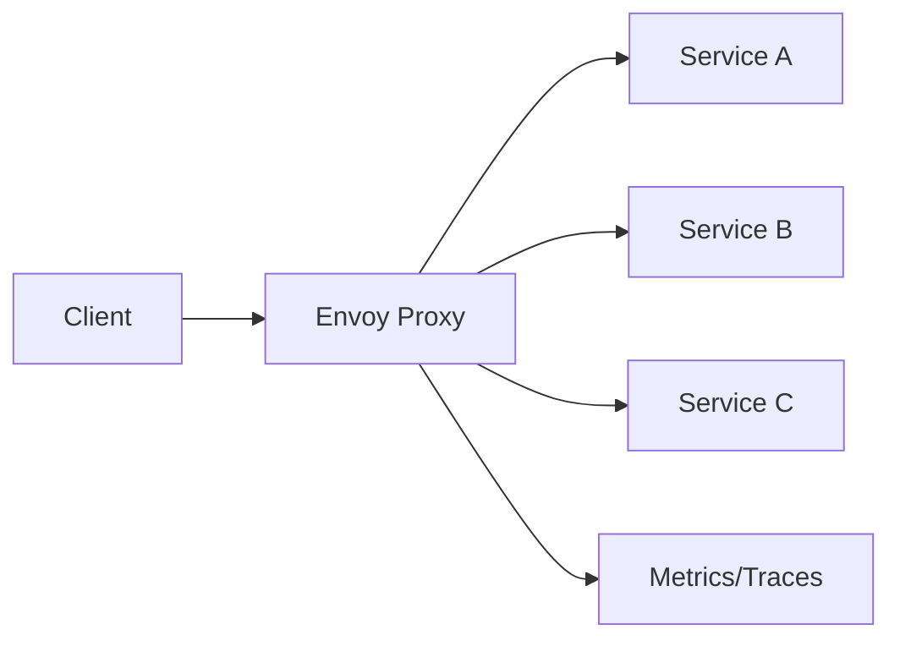
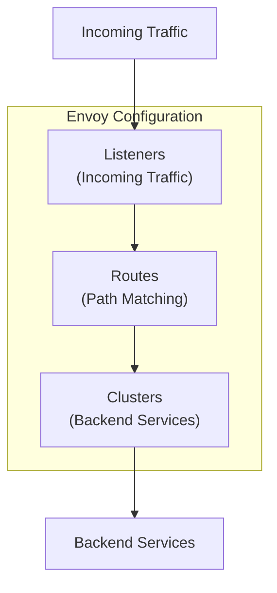

# How to Get Started with Envoy Proxy

Author: [nawazdhandala](https://www.github.com/nawazdhandala)

Tags: Envoy, Proxy, Load Balancing, Kubernetes, Service Mesh, Microservices, Observability, Traffic Management

Description: A practical guide to getting started with Envoy Proxy. Learn how to install, configure, and deploy Envoy for load balancing, traffic routing, and observability in modern application architectures.

---

> Envoy Proxy has become the backbone of modern service mesh architectures. Originally built at Lyft to handle their microservices communication, it now powers Istio, AWS App Mesh, and countless production deployments. This guide walks you through setting up Envoy from scratch.

Learning Envoy opens doors to understanding service meshes and modern traffic management. Let's build something practical.

---

## What is Envoy Proxy?

Envoy is a high-performance, open-source edge and service proxy designed for cloud-native applications. Unlike traditional proxies like Nginx or HAProxy, Envoy was built specifically for microservices with features like:

- **Dynamic configuration** - Update routing rules without restarts
- **Rich observability** - Built-in metrics, tracing, and logging
- **Modern protocols** - Native support for HTTP/2, gRPC, and WebSocket
- **Advanced load balancing** - Circuit breaking, retries, rate limiting



---

## Installation

### Install Envoy on Linux

The simplest way to install Envoy on Linux is through the official package repository:

```bash
# Add Envoy GPG key and repository
sudo apt update
sudo apt install -y apt-transport-https ca-certificates curl gnupg

# Add the Envoy GPG key
curl -sL 'https://deb.dl.getenvoy.io/public/gpg.8115BA8E629CC074.key' | sudo gpg --dearmor -o /usr/share/keyrings/getenvoy-keyring.gpg

# Add the repository
echo "deb [signed-by=/usr/share/keyrings/getenvoy-keyring.gpg] https://deb.dl.getenvoy.io/public/deb/ubuntu $(lsb_release -cs) main" | sudo tee /etc/apt/sources.list.d/getenvoy.list

# Install Envoy
sudo apt update
sudo apt install -y getenvoy-envoy

# Verify installation
envoy --version
```

### Install Envoy on macOS

Use Homebrew for the easiest installation on macOS:

```bash
# Install via Homebrew
brew install envoy

# Verify installation
envoy --version
```

### Run Envoy with Docker

Docker is often the most convenient option, especially for testing configurations:

```bash
# Pull the official Envoy image
docker pull envoyproxy/envoy:v1.29-latest

# Run with a custom configuration file
docker run --rm -it \
  -v $(pwd)/envoy.yaml:/etc/envoy/envoy.yaml \
  -p 10000:10000 \
  -p 9901:9901 \
  envoyproxy/envoy:v1.29-latest
```

---

## Understanding Envoy Configuration

Envoy uses YAML configuration files. The configuration has several key sections that control how traffic flows through the proxy.



### Key Concepts

- **Listeners** - Define where Envoy accepts incoming connections (ports and protocols)
- **Routes** - Specify how requests are matched and forwarded to clusters
- **Clusters** - Groups of backend hosts that handle requests
- **Filters** - Process requests and responses (authentication, rate limiting, etc.)

---

## Your First Envoy Configuration

Let's create a simple Envoy configuration that proxies HTTP traffic to a backend service.

### Basic HTTP Proxy

Create a file named `envoy.yaml`:

```yaml
# envoy.yaml - Basic HTTP proxy configuration
static_resources:
  # Listeners define where Envoy accepts connections
  listeners:
    - name: http_listener
      address:
        socket_address:
          address: 0.0.0.0  # Listen on all interfaces
          port_value: 10000  # Incoming port
      filter_chains:
        - filters:
            # HTTP connection manager handles HTTP/1.1 and HTTP/2
            - name: envoy.filters.network.http_connection_manager
              typed_config:
                "@type": type.googleapis.com/envoy.extensions.filters.network.http_connection_manager.v3.HttpConnectionManager
                stat_prefix: ingress_http  # Prefix for metrics
                codec_type: AUTO  # Detect HTTP/1.1 or HTTP/2 automatically
                route_config:
                  name: local_route
                  virtual_hosts:
                    - name: backend
                      domains: ["*"]  # Match all domains
                      routes:
                        # Route all traffic to the backend cluster
                        - match:
                            prefix: "/"
                          route:
                            cluster: backend_service
                http_filters:
                  # Router filter is required and must be last
                  - name: envoy.filters.http.router
                    typed_config:
                      "@type": type.googleapis.com/envoy.extensions.filters.http.router.v3.Router

  # Clusters define backend services
  clusters:
    - name: backend_service
      connect_timeout: 5s  # Timeout for establishing connection
      type: STRICT_DNS  # Use DNS to resolve endpoints
      lb_policy: ROUND_ROBIN  # Load balancing algorithm
      load_assignment:
        cluster_name: backend_service
        endpoints:
          - lb_endpoints:
              - endpoint:
                  address:
                    socket_address:
                      address: httpbin.org  # Backend host
                      port_value: 80
```

### Run the Configuration

```bash
# Run Envoy with your configuration
envoy -c envoy.yaml

# Or with Docker
docker run --rm -it \
  -v $(pwd)/envoy.yaml:/etc/envoy/envoy.yaml \
  -p 10000:10000 \
  envoyproxy/envoy:v1.29-latest -c /etc/envoy/envoy.yaml
```

### Test the Proxy

```bash
# Send a request through Envoy
curl http://localhost:10000/get

# You should see the response from httpbin.org
```

---

## Load Balancing Multiple Backends

Envoy excels at distributing traffic across multiple backend instances. Here is a configuration with multiple endpoints:

```yaml
# envoy-lb.yaml - Load balancing configuration
static_resources:
  listeners:
    - name: http_listener
      address:
        socket_address:
          address: 0.0.0.0
          port_value: 10000
      filter_chains:
        - filters:
            - name: envoy.filters.network.http_connection_manager
              typed_config:
                "@type": type.googleapis.com/envoy.extensions.filters.network.http_connection_manager.v3.HttpConnectionManager
                stat_prefix: ingress_http
                codec_type: AUTO
                route_config:
                  name: local_route
                  virtual_hosts:
                    - name: backend
                      domains: ["*"]
                      routes:
                        - match:
                            prefix: "/"
                          route:
                            cluster: backend_cluster
                            # Retry failed requests up to 3 times
                            retry_policy:
                              retry_on: "5xx,connect-failure"
                              num_retries: 3
                http_filters:
                  - name: envoy.filters.http.router
                    typed_config:
                      "@type": type.googleapis.com/envoy.extensions.filters.http.router.v3.Router

  clusters:
    - name: backend_cluster
      connect_timeout: 5s
      type: STATIC  # Use static IPs instead of DNS
      lb_policy: ROUND_ROBIN  # Distribute requests evenly
      # Health checks ensure traffic only goes to healthy instances
      health_checks:
        - timeout: 2s
          interval: 10s
          unhealthy_threshold: 3  # Mark unhealthy after 3 failures
          healthy_threshold: 2    # Mark healthy after 2 successes
          http_health_check:
            path: "/health"
      load_assignment:
        cluster_name: backend_cluster
        endpoints:
          - lb_endpoints:
              # Multiple backend instances
              - endpoint:
                  address:
                    socket_address:
                      address: 10.0.0.1
                      port_value: 8080
              - endpoint:
                  address:
                    socket_address:
                      address: 10.0.0.2
                      port_value: 8080
              - endpoint:
                  address:
                    socket_address:
                      address: 10.0.0.3
                      port_value: 8080
```

### Load Balancing Algorithms

Envoy supports several load balancing policies:

```yaml
clusters:
  - name: backend
    # Choose one of these lb_policy values:
    lb_policy: ROUND_ROBIN       # Rotate through backends equally
    # lb_policy: LEAST_REQUEST   # Send to backend with fewest active requests
    # lb_policy: RANDOM          # Random selection
    # lb_policy: RING_HASH       # Consistent hashing for session affinity
```

---

## Path-Based Routing

Route requests to different backends based on URL paths:

```yaml
# envoy-routing.yaml - Path-based routing
static_resources:
  listeners:
    - name: http_listener
      address:
        socket_address:
          address: 0.0.0.0
          port_value: 10000
      filter_chains:
        - filters:
            - name: envoy.filters.network.http_connection_manager
              typed_config:
                "@type": type.googleapis.com/envoy.extensions.filters.network.http_connection_manager.v3.HttpConnectionManager
                stat_prefix: ingress_http
                codec_type: AUTO
                route_config:
                  name: local_route
                  virtual_hosts:
                    - name: backend
                      domains: ["*"]
                      routes:
                        # Route /api/users to users service
                        - match:
                            prefix: "/api/users"
                          route:
                            cluster: users_service
                            prefix_rewrite: "/"  # Strip /api/users prefix

                        # Route /api/orders to orders service
                        - match:
                            prefix: "/api/orders"
                          route:
                            cluster: orders_service
                            prefix_rewrite: "/"

                        # Route /api/products to products service
                        - match:
                            prefix: "/api/products"
                          route:
                            cluster: products_service

                        # Default route for everything else
                        - match:
                            prefix: "/"
                          route:
                            cluster: frontend_service
                http_filters:
                  - name: envoy.filters.http.router
                    typed_config:
                      "@type": type.googleapis.com/envoy.extensions.filters.http.router.v3.Router

  clusters:
    - name: users_service
      connect_timeout: 5s
      type: STRICT_DNS
      lb_policy: ROUND_ROBIN
      load_assignment:
        cluster_name: users_service
        endpoints:
          - lb_endpoints:
              - endpoint:
                  address:
                    socket_address:
                      address: users-service
                      port_value: 8080

    - name: orders_service
      connect_timeout: 5s
      type: STRICT_DNS
      lb_policy: ROUND_ROBIN
      load_assignment:
        cluster_name: orders_service
        endpoints:
          - lb_endpoints:
              - endpoint:
                  address:
                    socket_address:
                      address: orders-service
                      port_value: 8080

    - name: products_service
      connect_timeout: 5s
      type: STRICT_DNS
      lb_policy: ROUND_ROBIN
      load_assignment:
        cluster_name: products_service
        endpoints:
          - lb_endpoints:
              - endpoint:
                  address:
                    socket_address:
                      address: products-service
                      port_value: 8080

    - name: frontend_service
      connect_timeout: 5s
      type: STRICT_DNS
      lb_policy: ROUND_ROBIN
      load_assignment:
        cluster_name: frontend_service
        endpoints:
          - lb_endpoints:
              - endpoint:
                  address:
                    socket_address:
                      address: frontend
                      port_value: 3000
```

---

## Enabling the Admin Interface

Envoy includes a powerful admin interface for debugging and monitoring. Enable it by adding an admin section:

```yaml
# Add this at the top level of your envoy.yaml
admin:
  address:
    socket_address:
      address: 0.0.0.0
      port_value: 9901  # Admin interface port

static_resources:
  # ... rest of your configuration
```

### Useful Admin Endpoints

Once enabled, access these endpoints:

```bash
# View current configuration
curl http://localhost:9901/config_dump

# View cluster health status
curl http://localhost:9901/clusters

# View statistics
curl http://localhost:9901/stats

# View Prometheus-format metrics
curl http://localhost:9901/stats/prometheus

# View server info
curl http://localhost:9901/server_info

# Force a config reload (if using dynamic config)
curl -X POST http://localhost:9901/runtime_modify?key=value
```

---

## Circuit Breaking

Protect your services from cascading failures with circuit breaking:

```yaml
clusters:
  - name: backend_service
    connect_timeout: 5s
    type: STRICT_DNS
    lb_policy: ROUND_ROBIN
    # Circuit breaker configuration
    circuit_breakers:
      thresholds:
        - priority: DEFAULT
          # Maximum concurrent connections to the cluster
          max_connections: 100
          # Maximum pending requests when no connections available
          max_pending_requests: 100
          # Maximum concurrent requests to the cluster
          max_requests: 1000
          # Maximum concurrent retries
          max_retries: 3
    # Outlier detection removes unhealthy hosts
    outlier_detection:
      consecutive_5xx: 5  # Eject after 5 consecutive 5xx errors
      interval: 10s       # Check interval
      base_ejection_time: 30s  # Minimum ejection time
      max_ejection_percent: 50  # Never eject more than 50% of hosts
    load_assignment:
      cluster_name: backend_service
      endpoints:
        - lb_endpoints:
            - endpoint:
                address:
                  socket_address:
                    address: backend
                    port_value: 8080
```

---

## Rate Limiting

Add rate limiting to protect your services from traffic spikes. This example uses a local rate limiter:

```yaml
static_resources:
  listeners:
    - name: http_listener
      address:
        socket_address:
          address: 0.0.0.0
          port_value: 10000
      filter_chains:
        - filters:
            - name: envoy.filters.network.http_connection_manager
              typed_config:
                "@type": type.googleapis.com/envoy.extensions.filters.network.http_connection_manager.v3.HttpConnectionManager
                stat_prefix: ingress_http
                codec_type: AUTO
                route_config:
                  name: local_route
                  virtual_hosts:
                    - name: backend
                      domains: ["*"]
                      routes:
                        - match:
                            prefix: "/"
                          route:
                            cluster: backend_service
                http_filters:
                  # Local rate limiter filter
                  - name: envoy.filters.http.local_ratelimit
                    typed_config:
                      "@type": type.googleapis.com/envoy.extensions.filters.http.local_ratelimit.v3.LocalRateLimit
                      stat_prefix: http_local_rate_limiter
                      token_bucket:
                        max_tokens: 100        # Maximum tokens in bucket
                        tokens_per_fill: 100   # Tokens added per interval
                        fill_interval: 60s     # Refill interval (100 req/min)
                      filter_enabled:
                        runtime_key: local_rate_limit_enabled
                        default_value:
                          numerator: 100
                          denominator: HUNDRED
                      filter_enforced:
                        runtime_key: local_rate_limit_enforced
                        default_value:
                          numerator: 100
                          denominator: HUNDRED
                      response_headers_to_add:
                        - append_action: OVERWRITE_IF_EXISTS_OR_ADD
                          header:
                            key: x-rate-limit-remaining
                            value: "%REMAINING_RATE_LIMIT%"
                  - name: envoy.filters.http.router
                    typed_config:
                      "@type": type.googleapis.com/envoy.extensions.filters.http.router.v3.Router
```

---

## TLS Termination

Configure Envoy to handle HTTPS traffic:

```yaml
static_resources:
  listeners:
    - name: https_listener
      address:
        socket_address:
          address: 0.0.0.0
          port_value: 443
      filter_chains:
        - filters:
            - name: envoy.filters.network.http_connection_manager
              typed_config:
                "@type": type.googleapis.com/envoy.extensions.filters.network.http_connection_manager.v3.HttpConnectionManager
                stat_prefix: ingress_https
                codec_type: AUTO
                route_config:
                  name: local_route
                  virtual_hosts:
                    - name: backend
                      domains: ["*"]
                      routes:
                        - match:
                            prefix: "/"
                          route:
                            cluster: backend_service
                http_filters:
                  - name: envoy.filters.http.router
                    typed_config:
                      "@type": type.googleapis.com/envoy.extensions.filters.http.router.v3.Router
          # TLS configuration for the listener
          transport_socket:
            name: envoy.transport_sockets.tls
            typed_config:
              "@type": type.googleapis.com/envoy.extensions.transport_sockets.tls.v3.DownstreamTlsContext
              common_tls_context:
                tls_certificates:
                  # Path to certificate and key files
                  - certificate_chain:
                      filename: "/etc/envoy/certs/server.crt"
                    private_key:
                      filename: "/etc/envoy/certs/server.key"
                # Minimum TLS version (1.2 or higher recommended)
                tls_params:
                  tls_minimum_protocol_version: TLSv1_2
```

---

## Deploying Envoy in Kubernetes

Deploy Envoy as an ingress controller or sidecar proxy in Kubernetes:

```yaml
# envoy-deployment.yaml
apiVersion: v1
kind: ConfigMap
metadata:
  name: envoy-config
data:
  envoy.yaml: |
    admin:
      address:
        socket_address:
          address: 0.0.0.0
          port_value: 9901
    static_resources:
      listeners:
        - name: http_listener
          address:
            socket_address:
              address: 0.0.0.0
              port_value: 10000
          filter_chains:
            - filters:
                - name: envoy.filters.network.http_connection_manager
                  typed_config:
                    "@type": type.googleapis.com/envoy.extensions.filters.network.http_connection_manager.v3.HttpConnectionManager
                    stat_prefix: ingress_http
                    codec_type: AUTO
                    route_config:
                      name: local_route
                      virtual_hosts:
                        - name: backend
                          domains: ["*"]
                          routes:
                            - match:
                                prefix: "/"
                              route:
                                cluster: backend_service
                    http_filters:
                      - name: envoy.filters.http.router
                        typed_config:
                          "@type": type.googleapis.com/envoy.extensions.filters.http.router.v3.Router
      clusters:
        - name: backend_service
          connect_timeout: 5s
          type: STRICT_DNS
          lb_policy: ROUND_ROBIN
          load_assignment:
            cluster_name: backend_service
            endpoints:
              - lb_endpoints:
                  - endpoint:
                      address:
                        socket_address:
                          address: backend-service.default.svc.cluster.local
                          port_value: 8080
---
apiVersion: apps/v1
kind: Deployment
metadata:
  name: envoy
spec:
  replicas: 2
  selector:
    matchLabels:
      app: envoy
  template:
    metadata:
      labels:
        app: envoy
    spec:
      containers:
        - name: envoy
          image: envoyproxy/envoy:v1.29-latest
          ports:
            - containerPort: 10000
              name: http
            - containerPort: 9901
              name: admin
          volumeMounts:
            - name: config
              mountPath: /etc/envoy
          resources:
            requests:
              memory: "128Mi"
              cpu: "100m"
            limits:
              memory: "256Mi"
              cpu: "200m"
          # Readiness probe ensures traffic only goes to ready pods
          readinessProbe:
            httpGet:
              path: /ready
              port: 9901
            initialDelaySeconds: 5
            periodSeconds: 10
          # Liveness probe restarts unhealthy pods
          livenessProbe:
            httpGet:
              path: /server_info
              port: 9901
            initialDelaySeconds: 10
            periodSeconds: 30
      volumes:
        - name: config
          configMap:
            name: envoy-config
---
apiVersion: v1
kind: Service
metadata:
  name: envoy
spec:
  type: LoadBalancer
  ports:
    - port: 80
      targetPort: 10000
      name: http
  selector:
    app: envoy
```

Deploy with:

```bash
kubectl apply -f envoy-deployment.yaml
```

---

## Observability with Prometheus

Envoy exposes metrics in Prometheus format. Here is how to scrape them:

```yaml
# prometheus.yaml - Scrape config for Prometheus
scrape_configs:
  - job_name: 'envoy'
    metrics_path: /stats/prometheus
    static_configs:
      - targets: ['envoy:9901']
```

### Key Metrics to Monitor

| Metric | Description |
|--------|-------------|
| `envoy_cluster_upstream_rq_total` | Total requests per cluster |
| `envoy_cluster_upstream_rq_xx` | Requests by response code (2xx, 4xx, 5xx) |
| `envoy_cluster_upstream_rq_time` | Request latency histogram |
| `envoy_cluster_membership_healthy` | Number of healthy backends |
| `envoy_cluster_circuit_breakers_*` | Circuit breaker state |

---

## Common Troubleshooting

### Check Cluster Health

```bash
# View cluster status and health check results
curl http://localhost:9901/clusters | grep health_flags
```

### View Access Logs

Add access logging to your configuration:

```yaml
http_filters:
  # Add before the router filter
  - name: envoy.filters.http.router
    typed_config:
      "@type": type.googleapis.com/envoy.extensions.filters.http.router.v3.Router
access_log:
  - name: envoy.access_loggers.stdout
    typed_config:
      "@type": type.googleapis.com/envoy.extensions.access_loggers.stream.v3.StdoutAccessLog
      log_format:
        text_format: "[%START_TIME%] %REQ(:METHOD)% %REQ(:PATH)% %RESPONSE_CODE% %DURATION%ms\n"
```

### Debug Configuration Issues

```bash
# Validate configuration without starting
envoy --mode validate -c envoy.yaml

# Run with debug logging
envoy -c envoy.yaml -l debug
```

---

## Best Practices

1. **Start simple** - Begin with static configuration before moving to dynamic (xDS)
2. **Enable health checks** - Prevent traffic to unhealthy backends
3. **Use circuit breakers** - Protect against cascading failures
4. **Monitor metrics** - Set up dashboards for key Envoy metrics
5. **Enable access logs** - Essential for debugging production issues
6. **Set timeouts** - Configure appropriate connect and request timeouts
7. **Use TLS** - Encrypt traffic between services

---

## Next Steps

Once comfortable with basic Envoy configuration, explore these advanced topics:

- **xDS API** - Dynamic configuration through control plane
- **Istio** - Service mesh built on Envoy
- **Rate limiting services** - Distributed rate limiting
- **External authorization** - Integrate with auth services
- **Lua filters** - Custom request processing

---

## Conclusion

Envoy Proxy provides a powerful foundation for managing traffic in modern applications. Starting with static configuration helps you understand the core concepts before moving to more dynamic setups.

Key takeaways:

- **Listeners** accept incoming connections
- **Clusters** define your backend services
- **Routes** map requests to clusters
- **Health checks and circuit breakers** improve reliability
- **The admin interface** is invaluable for debugging

Whether you use Envoy standalone or as part of a service mesh like Istio, understanding these fundamentals makes you more effective at operating and troubleshooting your infrastructure.

---

*Building a microservices architecture? [OneUptime](https://oneuptime.com) provides comprehensive monitoring for your Envoy proxies and the services behind them, with automatic alerting when things go wrong.*
