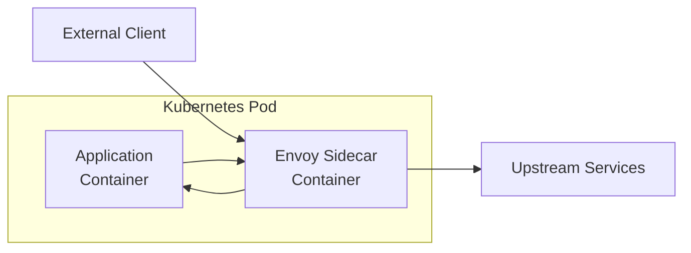
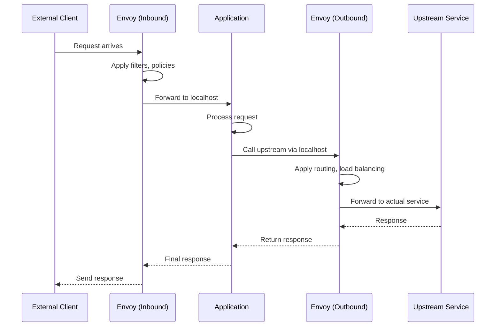
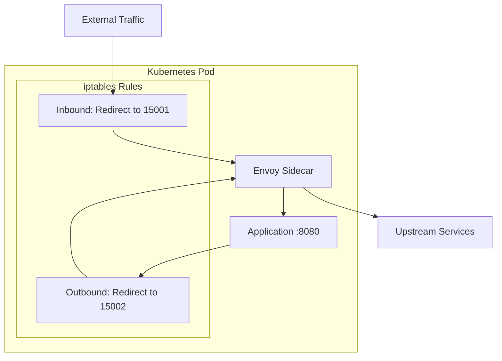
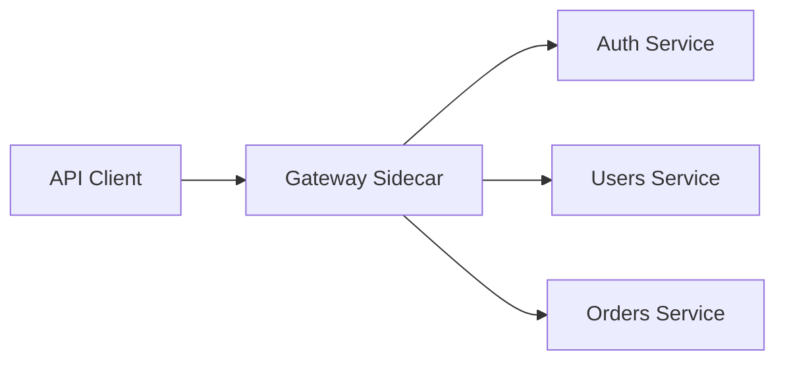

# How to Configure Envoy as Sidecar Proxy

Author: [nawazdhandala](https://www.github.com/nawazdhandala)

Tags: Envoy, Sidecar Proxy, Service Mesh, Kubernetes, Microservices, Traffic Management, Observability

Description: Learn how to configure Envoy as a sidecar proxy for your microservices, enabling transparent traffic management, observability, and security without changing application code.

---

> The sidecar pattern has become the backbone of service mesh architectures. By deploying Envoy alongside your application container, you gain powerful traffic management capabilities without modifying your application code. This guide walks through configuring Envoy as a sidecar from scratch.

Understanding the sidecar pattern opens doors to implementing service mesh concepts manually, giving you fine-grained control over your traffic management strategy.

---

## What is the Sidecar Pattern?

The sidecar pattern deploys a helper container alongside your main application container. This sidecar handles cross-cutting concerns like networking, logging, and security, keeping your application code focused on business logic.



### Benefits of Using Envoy as a Sidecar

- **Transparent proxying** - Applications connect to localhost; Envoy handles external communication
- **Language agnostic** - Works with any application regardless of programming language
- **Consistent observability** - Uniform metrics, logs, and traces across all services
- **Traffic control** - Retries, timeouts, and circuit breaking without code changes
- **Security** - mTLS between services without application awareness

---

## How Traffic Flows Through the Sidecar

Understanding traffic flow is essential for proper configuration. Here is how requests move through an Envoy sidecar setup:



---

## Basic Sidecar Configuration

Let's start with a fundamental Envoy sidecar configuration. This setup handles both inbound and outbound traffic for a web application.

### Directory Structure

```
/app
├── envoy.yaml          # Envoy configuration
├── docker-compose.yaml # For local testing
└── kubernetes.yaml     # For K8s deployment
```

### Core Envoy Configuration

Create `envoy.yaml` with separate listeners for inbound and outbound traffic:

```yaml
# envoy.yaml - Sidecar proxy configuration
# This configuration handles both inbound requests (from other services)
# and outbound requests (from the application to other services)

admin:
  address:
    socket_address:
      address: 127.0.0.1      # Admin only accessible from localhost
      port_value: 15000

static_resources:
  listeners:
    # Inbound listener - receives traffic destined for the application
    - name: inbound_listener
      address:
        socket_address:
          address: 0.0.0.0     # Accept from all interfaces
          port_value: 15001    # Sidecar inbound port
      filter_chains:
        - filters:
            - name: envoy.filters.network.http_connection_manager
              typed_config:
                "@type": type.googleapis.com/envoy.extensions.filters.network.http_connection_manager.v3.HttpConnectionManager
                stat_prefix: inbound_http
                codec_type: AUTO
                # Access logging for debugging and observability
                access_log:
                  - name: envoy.access_loggers.stdout
                    typed_config:
                      "@type": type.googleapis.com/envoy.extensions.access_loggers.stream.v3.StdoutAccessLog
                      log_format:
                        text_format: "[INBOUND] %START_TIME% %REQ(:METHOD)% %REQ(:PATH)% %RESPONSE_CODE% %DURATION%ms\n"
                route_config:
                  name: inbound_route
                  virtual_hosts:
                    - name: local_app
                      domains: ["*"]
                      routes:
                        - match:
                            prefix: "/"
                          route:
                            cluster: local_app
                            timeout: 30s
                http_filters:
                  - name: envoy.filters.http.router
                    typed_config:
                      "@type": type.googleapis.com/envoy.extensions.filters.http.router.v3.Router

    # Outbound listener - intercepts traffic from the application
    - name: outbound_listener
      address:
        socket_address:
          address: 127.0.0.1   # Only accept from localhost (the app)
          port_value: 15002    # Sidecar outbound port
      filter_chains:
        - filters:
            - name: envoy.filters.network.http_connection_manager
              typed_config:
                "@type": type.googleapis.com/envoy.extensions.filters.network.http_connection_manager.v3.HttpConnectionManager
                stat_prefix: outbound_http
                codec_type: AUTO
                access_log:
                  - name: envoy.access_loggers.stdout
                    typed_config:
                      "@type": type.googleapis.com/envoy.extensions.access_loggers.stream.v3.StdoutAccessLog
                      log_format:
                        text_format: "[OUTBOUND] %START_TIME% %REQ(:METHOD)% %REQ(:PATH)% -> %UPSTREAM_HOST% %RESPONSE_CODE% %DURATION%ms\n"
                route_config:
                  name: outbound_route
                  virtual_hosts:
                    # Route to user service
                    - name: users_api
                      domains: ["users-service", "users-service:8080"]
                      routes:
                        - match:
                            prefix: "/"
                          route:
                            cluster: users_service
                            retry_policy:
                              retry_on: "5xx,connect-failure,retriable-4xx"
                              num_retries: 3
                              per_try_timeout: 5s
                    # Route to orders service
                    - name: orders_api
                      domains: ["orders-service", "orders-service:8080"]
                      routes:
                        - match:
                            prefix: "/"
                          route:
                            cluster: orders_service
                            retry_policy:
                              retry_on: "5xx,connect-failure"
                              num_retries: 2
                http_filters:
                  - name: envoy.filters.http.router
                    typed_config:
                      "@type": type.googleapis.com/envoy.extensions.filters.http.router.v3.Router

  clusters:
    # Local application cluster - where the app actually runs
    - name: local_app
      connect_timeout: 5s
      type: STATIC
      lb_policy: ROUND_ROBIN
      load_assignment:
        cluster_name: local_app
        endpoints:
          - lb_endpoints:
              - endpoint:
                  address:
                    socket_address:
                      address: 127.0.0.1   # App runs on localhost
                      port_value: 8080      # App's actual port

    # Users service cluster
    - name: users_service
      connect_timeout: 5s
      type: STRICT_DNS
      lb_policy: ROUND_ROBIN
      circuit_breakers:
        thresholds:
          - priority: DEFAULT
            max_connections: 100
            max_pending_requests: 100
            max_requests: 1000
      load_assignment:
        cluster_name: users_service
        endpoints:
          - lb_endpoints:
              - endpoint:
                  address:
                    socket_address:
                      address: users-service
                      port_value: 15001    # Connect to their sidecar

    # Orders service cluster
    - name: orders_service
      connect_timeout: 5s
      type: STRICT_DNS
      lb_policy: ROUND_ROBIN
      circuit_breakers:
        thresholds:
          - priority: DEFAULT
            max_connections: 100
            max_pending_requests: 100
            max_requests: 1000
      load_assignment:
        cluster_name: orders_service
        endpoints:
          - lb_endpoints:
              - endpoint:
                  address:
                    socket_address:
                      address: orders-service
                      port_value: 15001
```

---

## Testing with Docker Compose

Before deploying to Kubernetes, test your sidecar configuration locally with Docker Compose.

### Sample Application

Create a simple Node.js application that the sidecar will proxy:

```javascript
// app.js - Simple Express application
const express = require('express');
const axios = require('axios');

const app = express();
const PORT = 8080;

// Health check endpoint
app.get('/health', (req, res) => {
    res.json({ status: 'healthy', timestamp: new Date().toISOString() });
});

// Main endpoint
app.get('/api/data', async (req, res) => {
    try {
        // Call upstream service through the sidecar's outbound port
        // The app thinks it's calling "users-service" but actually goes through Envoy
        const response = await axios.get('http://127.0.0.1:15002/users', {
            headers: {
                'Host': 'users-service'  // Envoy uses this to route
            }
        });
        res.json({
            local_data: 'Hello from main service',
            upstream_data: response.data
        });
    } catch (error) {
        res.status(500).json({
            error: 'Failed to call upstream',
            message: error.message
        });
    }
});

app.listen(PORT, '127.0.0.1', () => {
    // Bind to localhost only - external traffic comes through sidecar
    console.log(`Application listening on 127.0.0.1:${PORT}`);
});
```

### Docker Compose Configuration

```yaml
# docker-compose.yaml - Local testing setup
version: '3.8'

services:
  # Main application with its Envoy sidecar
  app:
    build: ./app
    # Note: We don't expose the app port directly
    # All traffic goes through the sidecar
    network_mode: "service:app-sidecar"
    depends_on:
      - app-sidecar

  app-sidecar:
    image: envoyproxy/envoy:v1.29-latest
    volumes:
      - ./envoy.yaml:/etc/envoy/envoy.yaml:ro
    ports:
      - "15001:15001"   # Inbound traffic port
      - "15000:15000"   # Admin interface
    command: >
      envoy -c /etc/envoy/envoy.yaml
      --service-cluster app-cluster
      --service-node app-node-1

  # Simulated upstream service (users-service)
  users-service:
    build: ./users-service
    network_mode: "service:users-sidecar"
    depends_on:
      - users-sidecar

  users-sidecar:
    image: envoyproxy/envoy:v1.29-latest
    volumes:
      - ./users-envoy.yaml:/etc/envoy/envoy.yaml:ro
    ports:
      - "15011:15001"   # Inbound traffic port for users service
    command: >
      envoy -c /etc/envoy/envoy.yaml
      --service-cluster users-cluster
      --service-node users-node-1

networks:
  default:
    driver: bridge
```

### Running the Test

```bash
# Start all services
docker-compose up -d

# Test inbound traffic through sidecar
curl http://localhost:15001/health

# View Envoy admin stats
curl http://localhost:15000/stats | grep -E "(upstream_rq|downstream_rq)"

# Check cluster health
curl http://localhost:15000/clusters

# View access logs
docker-compose logs -f app-sidecar
```

---

## Kubernetes Deployment

Deploying Envoy as a sidecar in Kubernetes requires a multi-container pod configuration.

### Basic Sidecar Deployment

```yaml
# kubernetes.yaml - Sidecar deployment
apiVersion: v1
kind: ConfigMap
metadata:
  name: envoy-sidecar-config
  namespace: default
data:
  envoy.yaml: |
    admin:
      address:
        socket_address:
          address: 127.0.0.1
          port_value: 15000

    static_resources:
      listeners:
        - name: inbound_listener
          address:
            socket_address:
              address: 0.0.0.0
              port_value: 15001
          filter_chains:
            - filters:
                - name: envoy.filters.network.http_connection_manager
                  typed_config:
                    "@type": type.googleapis.com/envoy.extensions.filters.network.http_connection_manager.v3.HttpConnectionManager
                    stat_prefix: inbound_http
                    codec_type: AUTO
                    access_log:
                      - name: envoy.access_loggers.stdout
                        typed_config:
                          "@type": type.googleapis.com/envoy.extensions.access_loggers.stream.v3.StdoutAccessLog
                    route_config:
                      name: inbound_route
                      virtual_hosts:
                        - name: local_app
                          domains: ["*"]
                          routes:
                            - match:
                                prefix: "/"
                              route:
                                cluster: local_app
                    http_filters:
                      - name: envoy.filters.http.router
                        typed_config:
                          "@type": type.googleapis.com/envoy.extensions.filters.http.router.v3.Router

        - name: outbound_listener
          address:
            socket_address:
              address: 127.0.0.1
              port_value: 15002
          filter_chains:
            - filters:
                - name: envoy.filters.network.http_connection_manager
                  typed_config:
                    "@type": type.googleapis.com/envoy.extensions.filters.network.http_connection_manager.v3.HttpConnectionManager
                    stat_prefix: outbound_http
                    codec_type: AUTO
                    route_config:
                      name: outbound_route
                      virtual_hosts:
                        - name: upstream_services
                          domains: ["*"]
                          routes:
                            - match:
                                prefix: "/"
                              route:
                                cluster: dynamic_forward
                                auto_host_rewrite: true
                    http_filters:
                      - name: envoy.filters.http.router
                        typed_config:
                          "@type": type.googleapis.com/envoy.extensions.filters.http.router.v3.Router

      clusters:
        - name: local_app
          connect_timeout: 5s
          type: STATIC
          lb_policy: ROUND_ROBIN
          load_assignment:
            cluster_name: local_app
            endpoints:
              - lb_endpoints:
                  - endpoint:
                      address:
                        socket_address:
                          address: 127.0.0.1
                          port_value: 8080

        - name: dynamic_forward
          connect_timeout: 5s
          type: STRICT_DNS
          lb_policy: ROUND_ROBIN
          load_assignment:
            cluster_name: dynamic_forward
            endpoints:
              - lb_endpoints:
                  - endpoint:
                      address:
                        socket_address:
                          address: upstream-service.default.svc.cluster.local
                          port_value: 15001
---
apiVersion: apps/v1
kind: Deployment
metadata:
  name: my-service
  namespace: default
spec:
  replicas: 2
  selector:
    matchLabels:
      app: my-service
  template:
    metadata:
      labels:
        app: my-service
      annotations:
        # Signal that this pod has an Envoy sidecar
        sidecar.istio.io/inject: "false"  # Disable Istio if present
    spec:
      containers:
        # Main application container
        - name: app
          image: my-app:latest
          ports:
            - containerPort: 8080
              name: http
          env:
            # Configure app to use sidecar for outbound calls
            - name: HTTP_PROXY
              value: "http://127.0.0.1:15002"
            - name: UPSTREAM_URL
              value: "http://127.0.0.1:15002"
          resources:
            requests:
              memory: "128Mi"
              cpu: "100m"
            limits:
              memory: "256Mi"
              cpu: "500m"
          # Application health checks
          livenessProbe:
            httpGet:
              path: /health
              port: 8080
            initialDelaySeconds: 10
            periodSeconds: 15
          readinessProbe:
            httpGet:
              path: /health
              port: 8080
            initialDelaySeconds: 5
            periodSeconds: 10

        # Envoy sidecar container
        - name: envoy-sidecar
          image: envoyproxy/envoy:v1.29-latest
          args:
            - "-c"
            - "/etc/envoy/envoy.yaml"
            - "--service-cluster"
            - "my-service"
            - "--service-node"
            - "$(POD_NAME)"
          env:
            - name: POD_NAME
              valueFrom:
                fieldRef:
                  fieldPath: metadata.name
          ports:
            - containerPort: 15001
              name: sidecar-inbound
            - containerPort: 15000
              name: sidecar-admin
          volumeMounts:
            - name: envoy-config
              mountPath: /etc/envoy
          resources:
            requests:
              memory: "64Mi"
              cpu: "50m"
            limits:
              memory: "128Mi"
              cpu: "200m"
          # Sidecar health checks
          readinessProbe:
            httpGet:
              path: /ready
              port: 15000
            initialDelaySeconds: 2
            periodSeconds: 5
          livenessProbe:
            httpGet:
              path: /server_info
              port: 15000
            initialDelaySeconds: 5
            periodSeconds: 15

      volumes:
        - name: envoy-config
          configMap:
            name: envoy-sidecar-config
---
apiVersion: v1
kind: Service
metadata:
  name: my-service
  namespace: default
spec:
  selector:
    app: my-service
  ports:
    # Expose the sidecar inbound port, not the app directly
    - port: 80
      targetPort: 15001
      name: http
  type: ClusterIP
```

---

## Traffic Interception with iptables

For transparent proxying where the application doesn't need to know about the sidecar, use iptables rules to redirect traffic.



### Init Container for iptables Setup

```yaml
# Add this init container to your pod spec
initContainers:
  - name: envoy-init
    image: docker.io/istio/proxyv2:1.20.0
    securityContext:
      capabilities:
        add:
          - NET_ADMIN
          - NET_RAW
      privileged: false
      runAsUser: 0
      runAsGroup: 0
      runAsNonRoot: false
    command:
      - /bin/sh
      - -c
      - |
        # Envoy user ID - traffic from this UID won't be redirected
        ENVOY_UID=1337

        # Ports
        INBOUND_CAPTURE_PORT=15001
        OUTBOUND_CAPTURE_PORT=15002

        # Create a new chain for inbound traffic
        iptables -t nat -N PROXY_INBOUND

        # Redirect inbound traffic to Envoy (except from Envoy itself)
        iptables -t nat -A PROXY_INBOUND -p tcp -j REDIRECT --to-port ${INBOUND_CAPTURE_PORT}

        # Apply to incoming packets
        iptables -t nat -A PREROUTING -p tcp -j PROXY_INBOUND

        # Create a new chain for outbound traffic
        iptables -t nat -N PROXY_OUTBOUND

        # Don't redirect Envoy's own traffic (avoid loops)
        iptables -t nat -A PROXY_OUTBOUND -m owner --uid-owner ${ENVOY_UID} -j RETURN

        # Don't redirect localhost traffic
        iptables -t nat -A PROXY_OUTBOUND -d 127.0.0.1/32 -j RETURN

        # Redirect all other outbound TCP traffic to Envoy
        iptables -t nat -A PROXY_OUTBOUND -p tcp -j REDIRECT --to-port ${OUTBOUND_CAPTURE_PORT}

        # Apply to outgoing packets
        iptables -t nat -A OUTPUT -p tcp -j PROXY_OUTBOUND

        echo "iptables rules configured successfully"
```

---

## Adding mTLS Between Sidecars

Secure service-to-service communication with mutual TLS. Each sidecar validates the identity of the other.

```yaml
# envoy-mtls.yaml - mTLS configuration
static_resources:
  listeners:
    - name: inbound_listener
      address:
        socket_address:
          address: 0.0.0.0
          port_value: 15001
      filter_chains:
        - filters:
            - name: envoy.filters.network.http_connection_manager
              typed_config:
                "@type": type.googleapis.com/envoy.extensions.filters.network.http_connection_manager.v3.HttpConnectionManager
                stat_prefix: inbound_http
                codec_type: AUTO
                route_config:
                  name: inbound_route
                  virtual_hosts:
                    - name: local_app
                      domains: ["*"]
                      routes:
                        - match:
                            prefix: "/"
                          route:
                            cluster: local_app
                http_filters:
                  - name: envoy.filters.http.router
                    typed_config:
                      "@type": type.googleapis.com/envoy.extensions.filters.http.router.v3.Router
          # TLS configuration for inbound connections
          transport_socket:
            name: envoy.transport_sockets.tls
            typed_config:
              "@type": type.googleapis.com/envoy.extensions.transport_sockets.tls.v3.DownstreamTlsContext
              # Require client certificates (mTLS)
              require_client_certificate: true
              common_tls_context:
                # Server certificate
                tls_certificates:
                  - certificate_chain:
                      filename: /etc/certs/server-cert.pem
                    private_key:
                      filename: /etc/certs/server-key.pem
                # CA certificate to validate client certificates
                validation_context:
                  trusted_ca:
                    filename: /etc/certs/ca-cert.pem

  clusters:
    - name: local_app
      connect_timeout: 5s
      type: STATIC
      lb_policy: ROUND_ROBIN
      load_assignment:
        cluster_name: local_app
        endpoints:
          - lb_endpoints:
              - endpoint:
                  address:
                    socket_address:
                      address: 127.0.0.1
                      port_value: 8080

    - name: upstream_service
      connect_timeout: 5s
      type: STRICT_DNS
      lb_policy: ROUND_ROBIN
      # TLS configuration for outbound connections
      transport_socket:
        name: envoy.transport_sockets.tls
        typed_config:
          "@type": type.googleapis.com/envoy.extensions.transport_sockets.tls.v3.UpstreamTlsContext
          common_tls_context:
            # Client certificate for mTLS
            tls_certificates:
              - certificate_chain:
                  filename: /etc/certs/client-cert.pem
                private_key:
                  filename: /etc/certs/client-key.pem
            # CA certificate to validate server certificates
            validation_context:
              trusted_ca:
                filename: /etc/certs/ca-cert.pem
      load_assignment:
        cluster_name: upstream_service
        endpoints:
          - lb_endpoints:
              - endpoint:
                  address:
                    socket_address:
                      address: upstream.default.svc.cluster.local
                      port_value: 15001
```

### Certificate Generation Script

```bash
#!/bin/bash
# generate-certs.sh - Generate certificates for mTLS

set -e

CERT_DIR="./certs"
mkdir -p ${CERT_DIR}

# Generate CA key and certificate
openssl genrsa -out ${CERT_DIR}/ca-key.pem 4096
openssl req -new -x509 -days 365 -key ${CERT_DIR}/ca-key.pem \
    -out ${CERT_DIR}/ca-cert.pem \
    -subj "/CN=Sidecar CA/O=MyOrg"

# Function to generate service certificates
generate_cert() {
    SERVICE_NAME=$1

    # Generate private key
    openssl genrsa -out ${CERT_DIR}/${SERVICE_NAME}-key.pem 2048

    # Generate certificate signing request
    openssl req -new -key ${CERT_DIR}/${SERVICE_NAME}-key.pem \
        -out ${CERT_DIR}/${SERVICE_NAME}.csr \
        -subj "/CN=${SERVICE_NAME}/O=MyOrg"

    # Create certificate extension file for SAN
    cat > ${CERT_DIR}/${SERVICE_NAME}-ext.cnf << EOF
authorityKeyIdentifier=keyid,issuer
basicConstraints=CA:FALSE
keyUsage = digitalSignature, keyEncipherment
extendedKeyUsage = serverAuth, clientAuth
subjectAltName = @alt_names

[alt_names]
DNS.1 = ${SERVICE_NAME}
DNS.2 = ${SERVICE_NAME}.default.svc.cluster.local
DNS.3 = localhost
IP.1 = 127.0.0.1
EOF

    # Sign the certificate
    openssl x509 -req -days 365 \
        -in ${CERT_DIR}/${SERVICE_NAME}.csr \
        -CA ${CERT_DIR}/ca-cert.pem \
        -CAkey ${CERT_DIR}/ca-key.pem \
        -CAcreateserial \
        -out ${CERT_DIR}/${SERVICE_NAME}-cert.pem \
        -extfile ${CERT_DIR}/${SERVICE_NAME}-ext.cnf

    # Clean up CSR and extension file
    rm ${CERT_DIR}/${SERVICE_NAME}.csr ${CERT_DIR}/${SERVICE_NAME}-ext.cnf

    echo "Generated certificates for ${SERVICE_NAME}"
}

# Generate certificates for each service
generate_cert "my-service"
generate_cert "users-service"
generate_cert "orders-service"

echo "All certificates generated in ${CERT_DIR}/"
```

---

## Observability Setup

Configure Envoy to export metrics, traces, and structured logs.

### Prometheus Metrics

```yaml
# Add to your envoy.yaml at the top level
admin:
  address:
    socket_address:
      address: 0.0.0.0      # Allow external access for scraping
      port_value: 15000

# Prometheus will scrape /stats/prometheus from port 15000
```

### Kubernetes ServiceMonitor for Prometheus

```yaml
# servicemonitor.yaml
apiVersion: monitoring.coreos.com/v1
kind: ServiceMonitor
metadata:
  name: envoy-sidecar-metrics
  namespace: default
  labels:
    app: my-service
spec:
  selector:
    matchLabels:
      app: my-service
  endpoints:
    - port: sidecar-admin
      path: /stats/prometheus
      interval: 15s
```

### Distributed Tracing with Zipkin

```yaml
# Add tracing configuration to envoy.yaml
static_resources:
  listeners:
    - name: inbound_listener
      # ... existing config
      filter_chains:
        - filters:
            - name: envoy.filters.network.http_connection_manager
              typed_config:
                "@type": type.googleapis.com/envoy.extensions.filters.network.http_connection_manager.v3.HttpConnectionManager
                stat_prefix: inbound_http
                # Enable tracing
                tracing:
                  provider:
                    name: envoy.tracers.zipkin
                    typed_config:
                      "@type": type.googleapis.com/envoy.config.trace.v3.ZipkinConfig
                      collector_cluster: zipkin
                      collector_endpoint: "/api/v2/spans"
                      collector_endpoint_version: HTTP_JSON
                  # Sample 100% of requests (adjust for production)
                  random_sampling:
                    value: 100
                # ... rest of config

  clusters:
    # Zipkin collector cluster
    - name: zipkin
      connect_timeout: 5s
      type: STRICT_DNS
      lb_policy: ROUND_ROBIN
      load_assignment:
        cluster_name: zipkin
        endpoints:
          - lb_endpoints:
              - endpoint:
                  address:
                    socket_address:
                      address: zipkin.monitoring.svc.cluster.local
                      port_value: 9411
```

### Structured JSON Logging

```yaml
# Structured access log format
access_log:
  - name: envoy.access_loggers.stdout
    typed_config:
      "@type": type.googleapis.com/envoy.extensions.access_loggers.stream.v3.StdoutAccessLog
      log_format:
        json_format:
          timestamp: "%START_TIME%"
          method: "%REQ(:METHOD)%"
          path: "%REQ(:PATH)%"
          protocol: "%PROTOCOL%"
          response_code: "%RESPONSE_CODE%"
          response_flags: "%RESPONSE_FLAGS%"
          bytes_received: "%BYTES_RECEIVED%"
          bytes_sent: "%BYTES_SENT%"
          duration_ms: "%DURATION%"
          upstream_host: "%UPSTREAM_HOST%"
          upstream_cluster: "%UPSTREAM_CLUSTER%"
          request_id: "%REQ(X-REQUEST-ID)%"
          user_agent: "%REQ(USER-AGENT)%"
          trace_id: "%REQ(X-B3-TRACEID)%"
```

---

## Health Checks and Graceful Shutdown

Proper health checks and shutdown handling prevent dropped requests during deployments.

```yaml
# Complete health check configuration
clusters:
  - name: upstream_service
    connect_timeout: 5s
    type: STRICT_DNS
    lb_policy: ROUND_ROBIN
    # Active health checks
    health_checks:
      - timeout: 3s
        interval: 10s
        unhealthy_threshold: 3    # Mark unhealthy after 3 failures
        healthy_threshold: 2      # Mark healthy after 2 successes
        http_health_check:
          path: "/health"
          expected_statuses:
            - start: 200
              end: 299
    # Passive health checks (outlier detection)
    outlier_detection:
      consecutive_5xx: 5           # Eject after 5 consecutive 5xx
      interval: 10s                # Check interval
      base_ejection_time: 30s      # Minimum ejection duration
      max_ejection_percent: 50     # Never eject more than 50%
      consecutive_gateway_failure: 5
    load_assignment:
      cluster_name: upstream_service
      endpoints:
        - lb_endpoints:
            - endpoint:
                address:
                  socket_address:
                    address: upstream.default.svc.cluster.local
                    port_value: 15001
```

### Graceful Shutdown in Kubernetes

```yaml
# Pod spec additions for graceful shutdown
spec:
  terminationGracePeriodSeconds: 30
  containers:
    - name: envoy-sidecar
      lifecycle:
        preStop:
          exec:
            command:
              - "/bin/sh"
              - "-c"
              - |
                # Signal Envoy to start draining connections
                curl -X POST http://localhost:15000/drain_listeners?graceful
                # Wait for connections to drain
                sleep 10
```

---

## Common Sidecar Patterns

### Pattern 1: API Gateway Sidecar

Route external traffic to different backend services based on path.



```yaml
# api-gateway-sidecar.yaml
route_config:
  name: api_gateway
  virtual_hosts:
    - name: api
      domains: ["api.example.com"]
      routes:
        - match:
            prefix: "/auth"
          route:
            cluster: auth_service
        - match:
            prefix: "/users"
          route:
            cluster: users_service
            prefix_rewrite: "/api/v1"
        - match:
            prefix: "/orders"
          route:
            cluster: orders_service
            prefix_rewrite: "/api/v1"
```

### Pattern 2: Rate Limiting Sidecar

Protect your service from traffic spikes.

```yaml
# rate-limit-sidecar.yaml
http_filters:
  - name: envoy.filters.http.local_ratelimit
    typed_config:
      "@type": type.googleapis.com/envoy.extensions.filters.http.local_ratelimit.v3.LocalRateLimit
      stat_prefix: local_rate_limiter
      token_bucket:
        max_tokens: 1000
        tokens_per_fill: 1000
        fill_interval: 60s       # 1000 requests per minute
      filter_enabled:
        runtime_key: local_rate_limit_enabled
        default_value:
          numerator: 100
          denominator: HUNDRED
      filter_enforced:
        runtime_key: local_rate_limit_enforced
        default_value:
          numerator: 100
          denominator: HUNDRED
      response_headers_to_add:
        - append_action: OVERWRITE_IF_EXISTS_OR_ADD
          header:
            key: x-ratelimit-limit
            value: "1000"
        - append_action: OVERWRITE_IF_EXISTS_OR_ADD
          header:
            key: x-ratelimit-remaining
            value: "%DYNAMIC_METADATA([\"envoy.filters.http.local_ratelimit\", \"remaining\"])%"
  - name: envoy.filters.http.router
    typed_config:
      "@type": type.googleapis.com/envoy.extensions.filters.http.router.v3.Router
```

### Pattern 3: Canary Deployment Sidecar

Split traffic between service versions.

```yaml
# canary-sidecar.yaml
route_config:
  name: canary_route
  virtual_hosts:
    - name: service
      domains: ["*"]
      routes:
        - match:
            prefix: "/"
            headers:
              - name: "x-canary"
                exact_match: "true"
          route:
            cluster: service_v2      # Canary version
        - match:
            prefix: "/"
          route:
            weighted_clusters:
              clusters:
                - name: service_v1
                  weight: 90         # 90% to stable version
                - name: service_v2
                  weight: 10         # 10% to canary version
```

---

## Troubleshooting

### Check Sidecar Connectivity

```bash
# View listener configuration
kubectl exec -it my-pod -c envoy-sidecar -- \
    curl -s localhost:15000/listeners

# Check cluster health
kubectl exec -it my-pod -c envoy-sidecar -- \
    curl -s localhost:15000/clusters | grep health

# View recent configuration changes
kubectl exec -it my-pod -c envoy-sidecar -- \
    curl -s localhost:15000/config_dump | jq '.configs[].dynamic_listeners'
```

### Debug Traffic Issues

```bash
# Enable debug logging temporarily
kubectl exec -it my-pod -c envoy-sidecar -- \
    curl -X POST "localhost:15000/logging?level=debug"

# View real-time stats
kubectl exec -it my-pod -c envoy-sidecar -- \
    curl -s localhost:15000/stats | grep -E "(upstream_rq|downstream_rq|cx_active)"

# Check for connection errors
kubectl exec -it my-pod -c envoy-sidecar -- \
    curl -s localhost:15000/stats | grep -E "(connect_fail|timeout|retry)"
```

### Common Error Patterns

| Symptom | Possible Cause | Solution |
|---------|---------------|----------|
| Connection refused | App not listening on localhost | Verify app binds to 127.0.0.1 |
| 503 errors | Upstream cluster unhealthy | Check health_checks and cluster DNS |
| Timeouts | Network policy blocking | Verify NetworkPolicy allows sidecar ports |
| No metrics | Admin port not exposed | Check admin address configuration |

---

## Best Practices

1. **Keep sidecar config minimal** - Only configure what your service needs
2. **Use consistent port conventions** - 15001 for inbound, 15002 for outbound, 15000 for admin
3. **Enable health checks** - Both active and passive (outlier detection)
4. **Set appropriate timeouts** - Match your application's SLA requirements
5. **Monitor sidecar resources** - Sidecars consume CPU and memory
6. **Use structured logging** - JSON format enables better log analysis
7. **Implement circuit breakers** - Protect against cascading failures
8. **Test locally first** - Use Docker Compose before Kubernetes deployment

---

## Conclusion

Configuring Envoy as a sidecar proxy gives you fine-grained control over service communication. While service meshes like Istio automate much of this, understanding manual sidecar configuration helps you:

- Debug complex traffic issues
- Customize behavior beyond what Istio exposes
- Run lightweight setups without a full service mesh
- Understand what's happening under the hood

The sidecar pattern separates network concerns from application logic, making your services more maintainable and your infrastructure more observable.

---

*Running microservices with Envoy sidecars? [OneUptime](https://oneuptime.com) provides comprehensive monitoring for your service mesh, tracking request latencies, error rates, and sidecar health across your entire infrastructure.*
