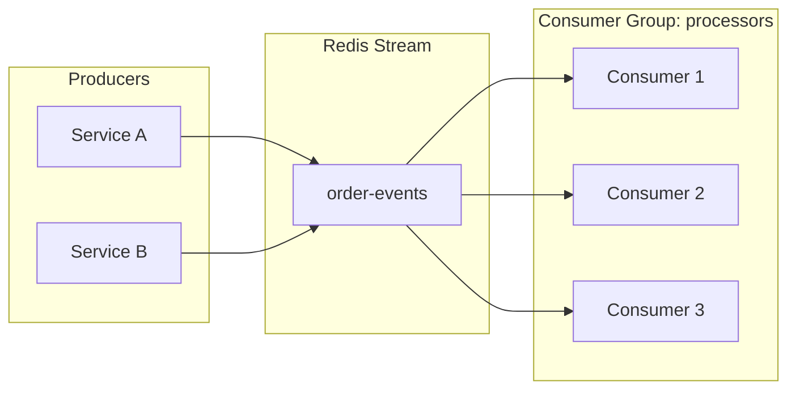

# How to Build Event-Driven Apps with Redis Streams

Author: [nawazdhandala](https://www.github.com/nawazdhandala)

Tags: Redis, Streams, Event-Driven, Message Queue, Consumer Groups, Microservices

Description: Learn how to build event-driven applications using Redis Streams for reliable message delivery, consumer groups, and event sourcing. This guide covers producers, consumers, and handling failures.

---

Redis Streams provide a log-like data structure for building event-driven applications. Unlike Pub/Sub where messages are fire-and-forget, Streams persist messages and support consumer groups for distributing work across multiple consumers. This guide shows you how to build reliable event-driven systems with Redis Streams.

## Why Redis Streams?

Streams sit between Pub/Sub and full-fledged message brokers like Kafka. They offer:

- **Persistence** - Messages are stored and can be replayed
- **Consumer groups** - Multiple consumers can share the workload
- **Message acknowledgment** - Failed messages can be retried
- **Automatic ID generation** - Time-based ordering is built in



## Basic Stream Operations

Let's start with fundamental stream operations before building a complete system.

```javascript
// stream-basics.js
// Basic Redis Stream operations
const Redis = require('ioredis');
const redis = new Redis();

// Add a message to a stream
// XADD key ID field value [field value ...]
// Using * as ID lets Redis generate a timestamp-based ID
async function addMessage(streamKey, data) {
  const fields = [];
  for (const [key, value] of Object.entries(data)) {
    fields.push(key, JSON.stringify(value));
  }

  // Returns the message ID (e.g., "1699123456789-0")
  const messageId = await redis.xadd(streamKey, '*', ...fields);
  console.log(`Added message: ${messageId}`);
  return messageId;
}

// Read messages from a stream
// XREAD COUNT count STREAMS key ID
// Using "0" reads from the beginning, "$" reads only new messages
async function readMessages(streamKey, fromId = '0', count = 10) {
  const result = await redis.xread('COUNT', count, 'STREAMS', streamKey, fromId);

  if (!result) return [];

  // Result format: [[streamKey, [[id, [field, value, ...]], ...]]]
  const messages = result[0][1].map(([id, fields]) => ({
    id,
    data: parseFields(fields),
  }));

  return messages;
}

// Parse field array into object
function parseFields(fields) {
  const data = {};
  for (let i = 0; i < fields.length; i += 2) {
    data[fields[i]] = JSON.parse(fields[i + 1]);
  }
  return data;
}

// Get stream info
async function getStreamInfo(streamKey) {
  const info = await redis.xinfo('STREAM', streamKey);

  // Convert array to object
  const infoObj = {};
  for (let i = 0; i < info.length; i += 2) {
    infoObj[info[i]] = info[i + 1];
  }

  return infoObj;
}

module.exports = { addMessage, readMessages, getStreamInfo, parseFields };
```

## Producer Implementation

Here's a robust producer that publishes events to Redis Streams.

```javascript
// event-producer.js
// Event producer for publishing to Redis Streams
const Redis = require('ioredis');

class EventProducer {
  constructor(options = {}) {
    this.redis = new Redis(options.redis);
    this.defaultStream = options.defaultStream || 'events';
    this.maxRetries = options.maxRetries || 3;
  }

  // Publish an event to the stream
  async publish(eventType, payload, options = {}) {
    const stream = options.stream || this.defaultStream;
    const event = {
      type: eventType,
      payload,
      timestamp: new Date().toISOString(),
      correlationId: options.correlationId || this.generateId(),
      source: options.source || process.env.SERVICE_NAME || 'unknown',
    };

    // Prepare fields for XADD
    const fields = [];
    for (const [key, value] of Object.entries(event)) {
      fields.push(key, typeof value === 'string' ? value : JSON.stringify(value));
    }

    let lastError;
    for (let attempt = 1; attempt <= this.maxRetries; attempt++) {
      try {
        const messageId = await this.redis.xadd(stream, '*', ...fields);

        console.log(`Published ${eventType} to ${stream}: ${messageId}`);

        return {
          messageId,
          stream,
          event,
        };
      } catch (error) {
        lastError = error;
        console.error(`Publish attempt ${attempt} failed:`, error.message);

        if (attempt < this.maxRetries) {
          await this.sleep(100 * attempt);
        }
      }
    }

    throw lastError;
  }

  // Publish multiple events atomically using pipeline
  async publishBatch(events, options = {}) {
    const stream = options.stream || this.defaultStream;
    const pipeline = this.redis.pipeline();

    const preparedEvents = events.map((evt) => ({
      type: evt.type,
      payload: evt.payload,
      timestamp: new Date().toISOString(),
      correlationId: evt.correlationId || this.generateId(),
      source: evt.source || process.env.SERVICE_NAME || 'unknown',
    }));

    for (const event of preparedEvents) {
      const fields = [];
      for (const [key, value] of Object.entries(event)) {
        fields.push(key, typeof value === 'string' ? value : JSON.stringify(value));
      }
      pipeline.xadd(stream, '*', ...fields);
    }

    const results = await pipeline.exec();

    return results.map(([err, messageId], index) => {
      if (err) throw err;
      return {
        messageId,
        stream,
        event: preparedEvents[index],
      };
    });
  }

  // Trim stream to keep it from growing unbounded
  async trimStream(stream, maxLength) {
    // MAXLEN ~ uses approximate trimming for better performance
    await this.redis.xtrim(stream, 'MAXLEN', '~', maxLength);
  }

  generateId() {
    return `${Date.now()}-${Math.random().toString(36).substr(2, 9)}`;
  }

  sleep(ms) {
    return new Promise((resolve) => setTimeout(resolve, ms));
  }

  async close() {
    await this.redis.quit();
  }
}

module.exports = EventProducer;
```

## Consumer Group Implementation

Consumer groups allow multiple consumers to share the message load while ensuring each message is processed only once.

```javascript
// event-consumer.js
// Event consumer using Redis Streams consumer groups
const Redis = require('ioredis');
const { parseFields } = require('./stream-basics');

class EventConsumer {
  constructor(options = {}) {
    this.redis = new Redis(options.redis);
    this.stream = options.stream || 'events';
    this.groupName = options.groupName || 'default-group';
    this.consumerName = options.consumerName || `consumer-${process.pid}`;
    this.batchSize = options.batchSize || 10;
    this.blockTime = options.blockTime || 5000; // Block for 5 seconds
    this.handlers = new Map();
    this.running = false;
  }

  // Register a handler for an event type
  on(eventType, handler) {
    this.handlers.set(eventType, handler);
    return this;
  }

  // Create consumer group if it doesn't exist
  async ensureGroup() {
    try {
      // Create group starting from the beginning ("0") or end ("$")
      await this.redis.xgroup(
        'CREATE',
        this.stream,
        this.groupName,
        '0',
        'MKSTREAM'
      );
      console.log(`Created consumer group: ${this.groupName}`);
    } catch (error) {
      if (!error.message.includes('BUSYGROUP')) {
        throw error;
      }
      // Group already exists, that's fine
    }
  }

  // Start consuming messages
  async start() {
    await this.ensureGroup();
    this.running = true;

    console.log(`Consumer ${this.consumerName} started for group ${this.groupName}`);

    // First, claim any pending messages that might have been abandoned
    await this.claimPendingMessages();

    // Then start the main consume loop
    while (this.running) {
      try {
        await this.consumeBatch();
      } catch (error) {
        console.error('Consumer error:', error.message);
        await this.sleep(1000);
      }
    }
  }

  // Read and process a batch of messages
  async consumeBatch() {
    // XREADGROUP GROUP group consumer [COUNT count] [BLOCK ms] STREAMS key ID
    // ">" means read only new messages not yet delivered to any consumer
    const result = await this.redis.xreadgroup(
      'GROUP',
      this.groupName,
      this.consumerName,
      'COUNT',
      this.batchSize,
      'BLOCK',
      this.blockTime,
      'STREAMS',
      this.stream,
      '>'
    );

    if (!result) return; // Timeout, no messages

    const messages = result[0][1];

    for (const [messageId, fields] of messages) {
      await this.processMessage(messageId, fields);
    }
  }

  // Process a single message
  async processMessage(messageId, fields) {
    const event = this.parseEvent(fields);

    console.log(`Processing ${event.type} (${messageId})`);

    const handler = this.handlers.get(event.type);

    if (!handler) {
      console.warn(`No handler for event type: ${event.type}`);
      // Acknowledge to avoid reprocessing unknown events
      await this.acknowledge(messageId);
      return;
    }

    try {
      await handler(event, {
        messageId,
        acknowledge: () => this.acknowledge(messageId),
        stream: this.stream,
      });

      // Auto-acknowledge on success
      await this.acknowledge(messageId);
    } catch (error) {
      console.error(`Failed to process ${messageId}:`, error.message);
      // Don't acknowledge - message will be retried
      // In production, implement dead letter queue after N retries
    }
  }

  // Acknowledge a processed message
  async acknowledge(messageId) {
    await this.redis.xack(this.stream, this.groupName, messageId);
    console.log(`Acknowledged: ${messageId}`);
  }

  // Claim messages that have been pending too long (abandoned by crashed consumers)
  async claimPendingMessages() {
    const minIdleTime = 60000; // 1 minute

    // XAUTOCLAIM handles pending message claiming automatically
    const result = await this.redis.xautoclaim(
      this.stream,
      this.groupName,
      this.consumerName,
      minIdleTime,
      '0-0',
      'COUNT',
      this.batchSize
    );

    if (!result || !result[1] || result[1].length === 0) {
      return;
    }

    const [nextId, messages] = result;

    console.log(`Claimed ${messages.length} pending messages`);

    for (const [messageId, fields] of messages) {
      if (fields) {
        await this.processMessage(messageId, fields);
      }
    }
  }

  parseEvent(fields) {
    const data = parseFields(fields);

    // Parse nested JSON
    if (typeof data.payload === 'string') {
      try {
        data.payload = JSON.parse(data.payload);
      } catch (e) {
        // Keep as string if not valid JSON
      }
    }

    return data;
  }

  // Stop the consumer gracefully
  async stop() {
    this.running = false;
    console.log(`Consumer ${this.consumerName} stopping...`);
    await this.redis.quit();
  }

  sleep(ms) {
    return new Promise((resolve) => setTimeout(resolve, ms));
  }
}

module.exports = EventConsumer;
```

## Complete Event System Example

Here's a complete example of an order processing system.

```javascript
// order-system.js
// Complete event-driven order processing system
const EventProducer = require('./event-producer');
const EventConsumer = require('./event-consumer');

// Order service - publishes order events
class OrderService {
  constructor() {
    this.producer = new EventProducer({
      defaultStream: 'order-events',
    });
  }

  async createOrder(orderData) {
    const order = {
      id: `order-${Date.now()}`,
      items: orderData.items,
      customerId: orderData.customerId,
      total: orderData.items.reduce((sum, item) => sum + item.price * item.quantity, 0),
      status: 'created',
      createdAt: new Date().toISOString(),
    };

    // Publish order created event
    await this.producer.publish('order.created', order, {
      correlationId: order.id,
      source: 'order-service',
    });

    return order;
  }

  async cancelOrder(orderId, reason) {
    await this.producer.publish('order.cancelled', {
      orderId,
      reason,
      cancelledAt: new Date().toISOString(),
    }, {
      correlationId: orderId,
      source: 'order-service',
    });
  }
}

// Payment service - processes payments
class PaymentService {
  constructor() {
    this.consumer = new EventConsumer({
      stream: 'order-events',
      groupName: 'payment-processors',
      consumerName: `payment-${process.pid}`,
    });

    this.producer = new EventProducer({
      defaultStream: 'payment-events',
    });

    this.setupHandlers();
  }

  setupHandlers() {
    this.consumer.on('order.created', async (event, ctx) => {
      const { payload } = event;

      console.log(`Processing payment for order ${payload.id}`);

      // Simulate payment processing
      const paymentSuccessful = Math.random() > 0.1; // 90% success rate

      if (paymentSuccessful) {
        await this.producer.publish('payment.completed', {
          orderId: payload.id,
          amount: payload.total,
          transactionId: `txn-${Date.now()}`,
        }, {
          correlationId: payload.id,
        });
      } else {
        await this.producer.publish('payment.failed', {
          orderId: payload.id,
          amount: payload.total,
          reason: 'Insufficient funds',
        }, {
          correlationId: payload.id,
        });
      }
    });
  }

  async start() {
    await this.consumer.start();
  }
}

// Inventory service - reserves inventory
class InventoryService {
  constructor() {
    this.consumer = new EventConsumer({
      stream: 'payment-events',
      groupName: 'inventory-processors',
      consumerName: `inventory-${process.pid}`,
    });

    this.producer = new EventProducer({
      defaultStream: 'inventory-events',
    });

    this.setupHandlers();
  }

  setupHandlers() {
    this.consumer.on('payment.completed', async (event, ctx) => {
      const { payload } = event;

      console.log(`Reserving inventory for order ${payload.orderId}`);

      // Simulate inventory check
      await this.sleep(100);

      await this.producer.publish('inventory.reserved', {
        orderId: payload.orderId,
        reservationId: `res-${Date.now()}`,
      }, {
        correlationId: payload.orderId,
      });
    });

    this.consumer.on('payment.failed', async (event, ctx) => {
      console.log(`Payment failed for order ${event.payload.orderId}, no inventory action needed`);
    });
  }

  sleep(ms) {
    return new Promise((resolve) => setTimeout(resolve, ms));
  }

  async start() {
    await this.consumer.start();
  }
}

// Notification service - sends notifications
class NotificationService {
  constructor() {
    // Subscribe to multiple streams
    this.orderConsumer = new EventConsumer({
      stream: 'order-events',
      groupName: 'notification-service',
      consumerName: `notification-order-${process.pid}`,
    });

    this.inventoryConsumer = new EventConsumer({
      stream: 'inventory-events',
      groupName: 'notification-service',
      consumerName: `notification-inventory-${process.pid}`,
    });

    this.setupHandlers();
  }

  setupHandlers() {
    this.orderConsumer.on('order.created', async (event) => {
      console.log(`[Email] Order ${event.payload.id} confirmed!`);
    });

    this.orderConsumer.on('order.cancelled', async (event) => {
      console.log(`[Email] Order ${event.payload.orderId} was cancelled`);
    });

    this.inventoryConsumer.on('inventory.reserved', async (event) => {
      console.log(`[Email] Order ${event.payload.orderId} is being prepared!`);
    });
  }

  async start() {
    // Run both consumers
    await Promise.all([
      this.orderConsumer.start(),
      this.inventoryConsumer.start(),
    ]);
  }
}

module.exports = { OrderService, PaymentService, InventoryService, NotificationService };
```

## Monitoring Stream Health

Track stream metrics for observability.

```javascript
// stream-monitor.js
// Monitor Redis Streams health and metrics
const Redis = require('ioredis');

class StreamMonitor {
  constructor(options = {}) {
    this.redis = new Redis(options.redis);
  }

  // Get comprehensive stream statistics
  async getStreamStats(stream) {
    const info = await this.redis.xinfo('STREAM', stream);
    const infoMap = this.arrayToMap(info);

    return {
      length: infoMap.length,
      radixTreeKeys: infoMap['radix-tree-keys'],
      radixTreeNodes: infoMap['radix-tree-nodes'],
      lastGeneratedId: infoMap['last-generated-id'],
      firstEntry: infoMap['first-entry'],
      lastEntry: infoMap['last-entry'],
      groups: await this.getGroupStats(stream),
    };
  }

  // Get consumer group statistics
  async getGroupStats(stream) {
    try {
      const groups = await this.redis.xinfo('GROUPS', stream);

      return groups.map((group) => {
        const groupMap = this.arrayToMap(group);
        return {
          name: groupMap.name,
          consumers: groupMap.consumers,
          pending: groupMap.pending,
          lastDeliveredId: groupMap['last-delivered-id'],
        };
      });
    } catch (error) {
      return [];
    }
  }

  // Get pending message details for a group
  async getPendingDetails(stream, groupName) {
    const pending = await this.redis.xpending(
      stream,
      groupName,
      '-',
      '+',
      100
    );

    return pending.map(([messageId, consumer, idleTime, deliveryCount]) => ({
      messageId,
      consumer,
      idleTimeMs: idleTime,
      deliveryCount,
    }));
  }

  // Calculate processing lag
  async calculateLag(stream, groupName) {
    const streamInfo = await this.redis.xinfo('STREAM', stream);
    const streamMap = this.arrayToMap(streamInfo);

    const groups = await this.redis.xinfo('GROUPS', stream);
    const group = groups.find((g) => this.arrayToMap(g).name === groupName);

    if (!group) {
      return null;
    }

    const groupMap = this.arrayToMap(group);
    const lastStreamId = streamMap['last-generated-id'];
    const lastDeliveredId = groupMap['last-delivered-id'];

    // Count messages between last delivered and end of stream
    const range = await this.redis.xrange(stream, lastDeliveredId, '+');

    return {
      messagesLag: range.length - 1, // Exclude the last delivered message
      pendingMessages: groupMap.pending,
      lastStreamId,
      lastDeliveredId,
    };
  }

  arrayToMap(arr) {
    const map = {};
    for (let i = 0; i < arr.length; i += 2) {
      map[arr[i]] = arr[i + 1];
    }
    return map;
  }

  async close() {
    await this.redis.quit();
  }
}

// Example usage
async function monitorStreams() {
  const monitor = new StreamMonitor();

  const stats = await monitor.getStreamStats('order-events');
  console.log('Stream Stats:', JSON.stringify(stats, null, 2));

  const lag = await monitor.calculateLag('order-events', 'payment-processors');
  console.log('Processing Lag:', lag);

  await monitor.close();
}

module.exports = StreamMonitor;
```

## Best Practices

| Practice | Description |
|----------|-------------|
| Use consumer groups | Distribute work and handle failures |
| Trim streams regularly | Prevent unbounded growth with XTRIM |
| Monitor pending messages | Detect stuck or failing consumers |
| Implement dead letter queues | Move failed messages after N retries |
| Use correlation IDs | Track events across services |
| Idempotent handlers | Same message processed twice should be safe |

Redis Streams provide a solid foundation for event-driven architectures. They offer the persistence and consumer groups you need for reliable message processing, without the operational complexity of systems like Kafka. Start with Streams when you need more than Pub/Sub but don't need the full power of a dedicated message broker.
