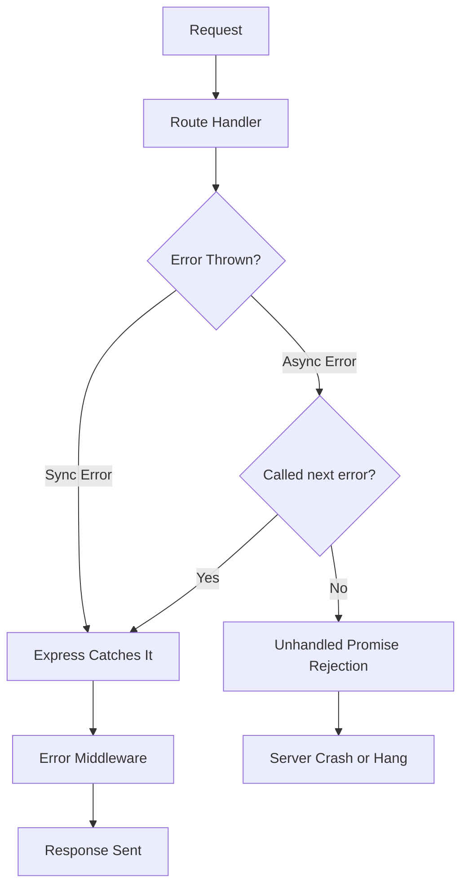
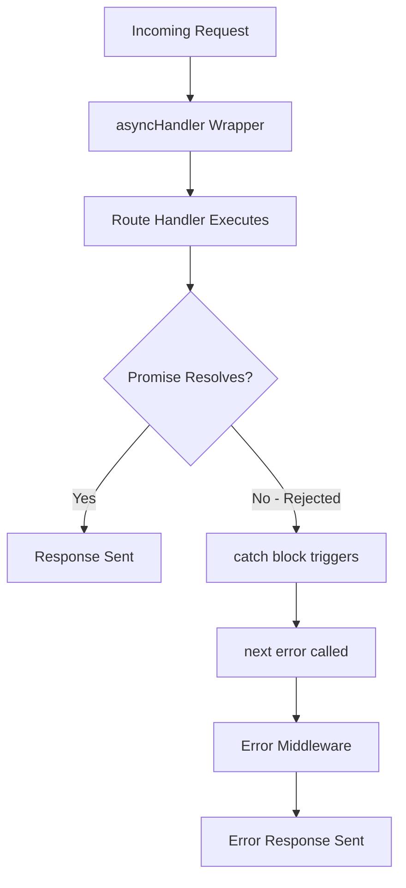
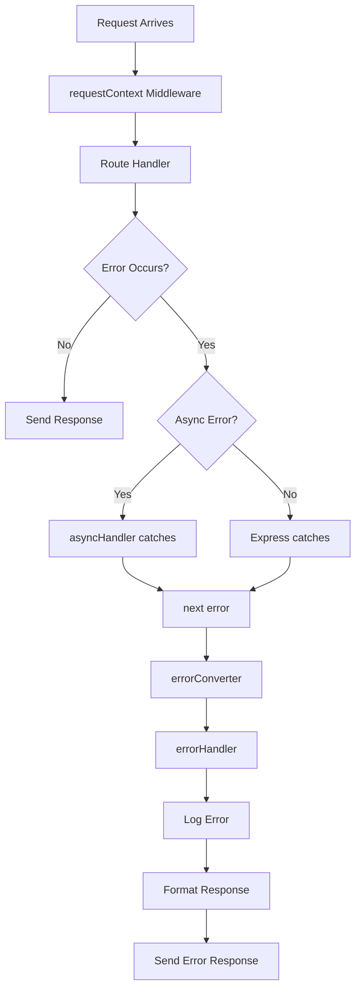

# How to Implement Error Handling in Express

Author: [nawazdhandala](https://www.github.com/nawazdhandala)

Tags: Express, NodeJS, Error Handling, Middleware, Backend, JavaScript, REST API

Description: Learn how to build production-ready error handling in Express.js with custom error classes, middleware, async wrappers, and structured responses.

---

Error handling is one of the most overlooked aspects of Express.js development. A well-designed error handling system makes debugging easier, provides consistent API responses, and keeps your application running smoothly even when things go wrong. This guide walks through building a complete error handling solution from scratch.

## How Express Handles Errors

Express has a built-in error handling mechanism, but it only kicks in under specific conditions. Understanding this flow is the first step toward better error management.



Express catches synchronous errors automatically, but async errors require explicit handling. This is why many Express applications have silent failures - async errors simply disappear unless you forward them properly.

## Creating Custom Error Classes

Standard JavaScript errors lack context for API responses. Custom error classes let you attach HTTP status codes, error codes, and additional metadata that your error middleware can use.

```javascript
// errors/AppError.js

/**
 * Base class for all application errors.
 * Extends the native Error class with HTTP-specific properties.
 */
class AppError extends Error {
  constructor(message, statusCode, errorCode = null) {
    super(message);

    // HTTP status code for the response
    this.statusCode = statusCode;

    // Machine-readable error code for client-side handling
    this.errorCode = errorCode || this.constructor.name;

    // Distinguishes operational errors from programming errors
    this.isOperational = true;

    // Captures stack trace, excluding constructor call from it
    Error.captureStackTrace(this, this.constructor);
  }
}

/**
 * Use when a requested resource does not exist.
 * Returns 404 Not Found.
 */
class NotFoundError extends AppError {
  constructor(resource = 'Resource') {
    super(`${resource} not found`, 404, 'NOT_FOUND');
  }
}

/**
 * Use for validation failures in request data.
 * Returns 400 Bad Request with field-level error details.
 */
class ValidationError extends AppError {
  constructor(errors) {
    super('Validation failed', 400, 'VALIDATION_ERROR');
    // Array of { field, message } objects
    this.errors = errors;
  }
}

/**
 * Use when authentication is missing or invalid.
 * Returns 401 Unauthorized.
 */
class UnauthorizedError extends AppError {
  constructor(message = 'Authentication required') {
    super(message, 401, 'UNAUTHORIZED');
  }
}

/**
 * Use when user lacks permission for the requested action.
 * Returns 403 Forbidden.
 */
class ForbiddenError extends AppError {
  constructor(message = 'Access denied') {
    super(message, 403, 'FORBIDDEN');
  }
}

/**
 * Use for duplicate entries or constraint violations.
 * Returns 409 Conflict.
 */
class ConflictError extends AppError {
  constructor(message = 'Resource already exists') {
    super(message, 409, 'CONFLICT');
  }
}

/**
 * Use when rate limits are exceeded.
 * Returns 429 Too Many Requests.
 */
class RateLimitError extends AppError {
  constructor(retryAfter = 60) {
    super('Too many requests', 429, 'RATE_LIMIT_EXCEEDED');
    this.retryAfter = retryAfter;
  }
}

module.exports = {
  AppError,
  NotFoundError,
  ValidationError,
  UnauthorizedError,
  ForbiddenError,
  ConflictError,
  RateLimitError
};
```

These error classes provide structure that your error handling middleware can interpret. The `isOperational` flag distinguishes expected errors (like validation failures) from unexpected programming bugs.

## The Async Wrapper Pattern

Express does not catch errors from async functions automatically. Every async route handler needs a try-catch block, or you need a wrapper function that handles this for you.

```javascript
// middleware/asyncHandler.js

/**
 * Wraps async route handlers to catch rejected promises
 * and forward them to Express error middleware.
 *
 * Without this wrapper:
 *   app.get('/users', async (req, res) => {
 *     const users = await User.find(); // If this throws, Express never sees it
 *   });
 *
 * With this wrapper:
 *   app.get('/users', asyncHandler(async (req, res) => {
 *     const users = await User.find(); // Errors are caught and forwarded
 *   }));
 */
const asyncHandler = (fn) => {
  return (req, res, next) => {
    // Execute the async function and catch any errors
    Promise.resolve(fn(req, res, next)).catch(next);
  };
};

module.exports = asyncHandler;
```

The wrapper ensures every promise rejection reaches your error middleware. Here is how request flow changes with the async handler:



## Building the Error Middleware

The error middleware is where all errors converge. It formats the response, logs the error, and ensures sensitive information stays out of production responses.

```javascript
// middleware/errorHandler.js

const { AppError } = require('../errors/AppError');

/**
 * Formats error details for development responses.
 * Includes full stack trace and internal details.
 */
const formatDevError = (err, req) => {
  return {
    success: false,
    error: {
      code: err.errorCode || 'INTERNAL_ERROR',
      message: err.message,
      stack: err.stack,
      path: req.originalUrl,
      method: req.method,
      timestamp: new Date().toISOString()
    }
  };
};

/**
 * Formats error details for production responses.
 * Hides internal details and stack traces.
 */
const formatProdError = (err, req) => {
  // Only expose details for operational errors
  if (err.isOperational) {
    const response = {
      success: false,
      error: {
        code: err.errorCode,
        message: err.message
      }
    };

    // Include validation errors if present
    if (err.errors) {
      response.error.details = err.errors;
    }

    // Include retry header for rate limit errors
    if (err.retryAfter) {
      response.error.retryAfter = err.retryAfter;
    }

    return response;
  }

  // Generic message for programming errors
  return {
    success: false,
    error: {
      code: 'INTERNAL_ERROR',
      message: 'Something went wrong'
    }
  };
};

/**
 * Central error handling middleware.
 * Must have exactly 4 parameters for Express to recognize it as error middleware.
 */
const errorHandler = (err, req, res, next) => {
  // Default to 500 if no status code is set
  err.statusCode = err.statusCode || 500;

  // Log all errors for debugging
  console.error(`[${new Date().toISOString()}] ${err.statusCode} - ${err.message}`);
  console.error(`Path: ${req.method} ${req.originalUrl}`);

  // Log stack trace for non-operational errors
  if (!err.isOperational) {
    console.error('Stack:', err.stack);
  }

  // Format response based on environment
  const response = process.env.NODE_ENV === 'production'
    ? formatProdError(err, req)
    : formatDevError(err, req);

  // Set retry-after header for rate limit errors
  if (err.retryAfter) {
    res.set('Retry-After', err.retryAfter);
  }

  res.status(err.statusCode).json(response);
};

module.exports = errorHandler;
```

## Handling Specific Error Types

Some errors come from libraries or the database and need conversion to your custom error format. This keeps your API responses consistent regardless of where the error originated.

```javascript
// middleware/errorConverter.js

const { AppError, ValidationError, ConflictError } = require('../errors/AppError');

/**
 * Converts known error types to AppError instances.
 * Place this middleware before the main error handler.
 */
const errorConverter = (err, req, res, next) => {
  let convertedError = err;

  // Handle Mongoose validation errors
  if (err.name === 'ValidationError' && err.errors) {
    const errors = Object.keys(err.errors).map(field => ({
      field,
      message: err.errors[field].message
    }));
    convertedError = new ValidationError(errors);
  }

  // Handle Mongoose duplicate key errors
  if (err.code === 11000) {
    const field = Object.keys(err.keyValue)[0];
    convertedError = new ConflictError(`${field} already exists`);
  }

  // Handle Mongoose cast errors (invalid ObjectId, etc.)
  if (err.name === 'CastError') {
    convertedError = new AppError(`Invalid ${err.path}: ${err.value}`, 400, 'INVALID_ID');
  }

  // Handle JSON parse errors
  if (err instanceof SyntaxError && err.status === 400 && 'body' in err) {
    convertedError = new AppError('Invalid JSON in request body', 400, 'INVALID_JSON');
  }

  // Handle JWT errors
  if (err.name === 'JsonWebTokenError') {
    convertedError = new AppError('Invalid token', 401, 'INVALID_TOKEN');
  }

  if (err.name === 'TokenExpiredError') {
    convertedError = new AppError('Token expired', 401, 'TOKEN_EXPIRED');
  }

  next(convertedError);
};

module.exports = errorConverter;
```

## Putting It All Together

Here is how to wire everything into your Express application:

```javascript
// app.js

const express = require('express');
const asyncHandler = require('./middleware/asyncHandler');
const errorConverter = require('./middleware/errorConverter');
const errorHandler = require('./middleware/errorHandler');
const {
  NotFoundError,
  ValidationError,
  UnauthorizedError
} = require('./errors/AppError');

const app = express();

// Body parsing middleware
app.use(express.json());

// Example route using async handler and custom errors
app.get('/users/:id', asyncHandler(async (req, res) => {
  const { id } = req.params;

  // Simulate database lookup
  const user = await findUserById(id);

  if (!user) {
    // Throws NotFoundError which gets caught by asyncHandler
    throw new NotFoundError('User');
  }

  res.json({ success: true, data: user });
}));

// Example route with validation
app.post('/users', asyncHandler(async (req, res) => {
  const { email, password, name } = req.body;
  const errors = [];

  // Manual validation (or use a library like Joi or Zod)
  if (!email) {
    errors.push({ field: 'email', message: 'Email is required' });
  } else if (!isValidEmail(email)) {
    errors.push({ field: 'email', message: 'Invalid email format' });
  }

  if (!password) {
    errors.push({ field: 'password', message: 'Password is required' });
  } else if (password.length < 8) {
    errors.push({ field: 'password', message: 'Password must be at least 8 characters' });
  }

  if (errors.length > 0) {
    throw new ValidationError(errors);
  }

  const user = await createUser({ email, password, name });
  res.status(201).json({ success: true, data: user });
}));

// Protected route example
app.delete('/users/:id', asyncHandler(async (req, res) => {
  if (!req.user) {
    throw new UnauthorizedError();
  }

  if (req.user.role !== 'admin') {
    throw new ForbiddenError('Only admins can delete users');
  }

  await deleteUser(req.params.id);
  res.status(204).send();
}));

// 404 handler for unknown routes - must be after all other routes
app.use((req, res, next) => {
  next(new NotFoundError('Route'));
});

// Error handling pipeline - order matters here
app.use(errorConverter);  // Convert library errors to AppError
app.use(errorHandler);    // Format and send error response

// Start server
const PORT = process.env.PORT || 3000;
app.listen(PORT, () => {
  console.log(`Server running on port ${PORT}`);
});
```

## Handling Uncaught Exceptions

Some errors escape Express entirely. These need process-level handlers to prevent silent crashes.

```javascript
// server.js

const app = require('./app');

// Handle uncaught exceptions (synchronous errors outside Express)
process.on('uncaughtException', (err) => {
  console.error('UNCAUGHT EXCEPTION - Shutting down...');
  console.error(err.name, err.message);
  console.error(err.stack);

  // Exit immediately - the process is in an undefined state
  process.exit(1);
});

const server = app.listen(process.env.PORT || 3000);

// Handle unhandled promise rejections (async errors outside Express)
process.on('unhandledRejection', (err) => {
  console.error('UNHANDLED REJECTION - Shutting down...');
  console.error(err.name, err.message);
  console.error(err.stack);

  // Close server gracefully before exiting
  server.close(() => {
    process.exit(1);
  });
});

// Handle SIGTERM for graceful shutdown
process.on('SIGTERM', () => {
  console.log('SIGTERM received. Shutting down gracefully...');
  server.close(() => {
    console.log('Process terminated');
  });
});
```

## Error Response Examples

Here is what your API responses look like with this error handling system:

**Validation Error (400)**
```json
{
  "success": false,
  "error": {
    "code": "VALIDATION_ERROR",
    "message": "Validation failed",
    "details": [
      { "field": "email", "message": "Invalid email format" },
      { "field": "password", "message": "Password must be at least 8 characters" }
    ]
  }
}
```

**Not Found Error (404)**
```json
{
  "success": false,
  "error": {
    "code": "NOT_FOUND",
    "message": "User not found"
  }
}
```

**Development Error (500)**
```json
{
  "success": false,
  "error": {
    "code": "INTERNAL_ERROR",
    "message": "Cannot read property 'id' of undefined",
    "stack": "TypeError: Cannot read property 'id' of undefined\n    at /app/routes/users.js:45:23\n    ...",
    "path": "/api/users/123",
    "method": "GET",
    "timestamp": "2026-01-26T10:30:00.000Z"
  }
}
```

## Adding Request Context to Errors

For debugging, it helps to attach request context to errors:

```javascript
// middleware/requestContext.js

const crypto = require('crypto');

/**
 * Attaches a unique request ID and captures request context.
 * Place this early in your middleware chain.
 */
const requestContext = (req, res, next) => {
  // Generate or use existing request ID
  req.requestId = req.headers['x-request-id'] || crypto.randomUUID();

  // Add request ID to response headers
  res.set('X-Request-ID', req.requestId);

  // Store start time for duration calculation
  req.startTime = Date.now();

  next();
};

module.exports = requestContext;
```

Then update your error handler to include this context:

```javascript
// In errorHandler.js

const errorHandler = (err, req, res, next) => {
  err.statusCode = err.statusCode || 500;

  // Enhanced logging with request context
  console.error(JSON.stringify({
    level: 'error',
    requestId: req.requestId,
    method: req.method,
    path: req.originalUrl,
    statusCode: err.statusCode,
    errorCode: err.errorCode,
    message: err.message,
    duration: req.startTime ? Date.now() - req.startTime : null,
    stack: err.isOperational ? undefined : err.stack,
    timestamp: new Date().toISOString()
  }));

  // Include request ID in response for support tickets
  const response = process.env.NODE_ENV === 'production'
    ? formatProdError(err, req)
    : formatDevError(err, req);

  response.requestId = req.requestId;

  res.status(err.statusCode).json(response);
};
```

## Error Handling Flow Summary



## Summary

| Component | Purpose |
|-----------|---------|
| Custom Error Classes | Attach status codes and error codes to errors |
| asyncHandler | Catch promise rejections in route handlers |
| errorConverter | Convert library-specific errors to your format |
| errorHandler | Format responses and log errors |
| Process Handlers | Catch errors that escape Express |
| Request Context | Add debugging info to error logs |

Building proper error handling takes effort upfront but pays off immediately. Your API becomes predictable, your logs become useful, and debugging production issues becomes manageable. Start with the custom error classes and async wrapper, then add the more advanced features as your application grows.
