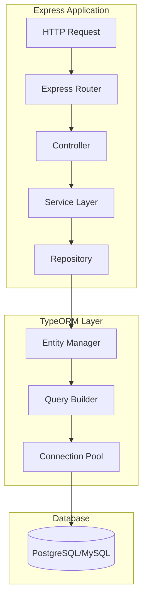
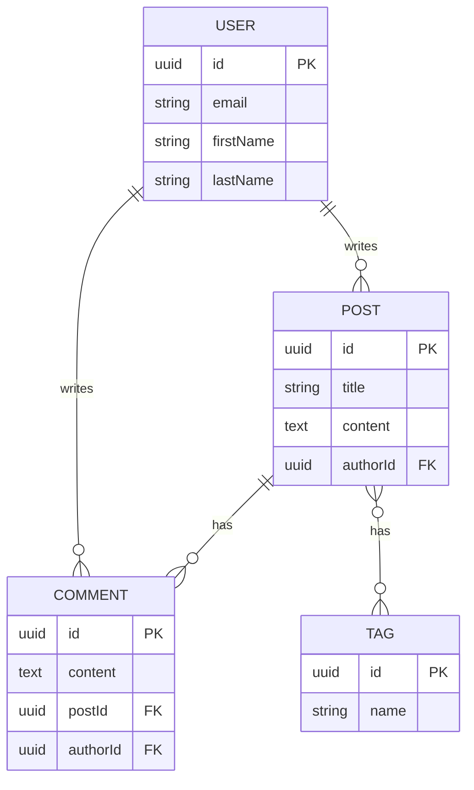
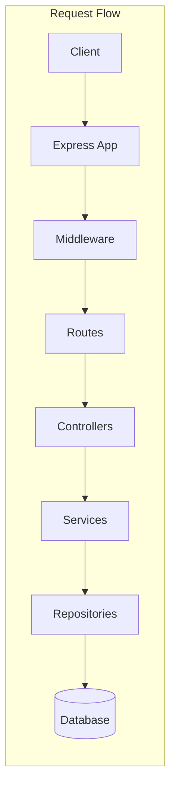

# How to Use Express with TypeORM

Author: [nawazdhandala](https://www.github.com/nawazdhandala)

Tags: Express.js, TypeORM, TypeScript, Database, Node.js

Description: Learn how to use Express with TypeORM for database operations including entities, repositories, relations, and migrations.

---

TypeORM is a powerful Object-Relational Mapper that works seamlessly with TypeScript and Express.js. It provides a clean, type-safe way to interact with databases while supporting advanced features like migrations, relations, and query builders.

## Architecture Overview



## Project Setup

### Installation

```bash
# Create a new project
mkdir express-typeorm-app && cd express-typeorm-app
npm init -y

# Install dependencies
npm install express typeorm reflect-metadata pg
npm install -D typescript @types/express @types/node ts-node nodemon
```

### TypeScript Configuration

Create `tsconfig.json` with the required settings for TypeORM decorators:

```json
{
  "compilerOptions": {
    "target": "ES2020",
    "module": "commonjs",
    "lib": ["ES2020"],
    "outDir": "./dist",
    "rootDir": "./src",
    "strict": true,
    "esModuleInterop": true,
    "experimentalDecorators": true,
    "emitDecoratorMetadata": true,
    "skipLibCheck": true,
    "forceConsistentCasingInFileNames": true,
    "resolveJsonModule": true
  },
  "include": ["src/**/*"],
  "exclude": ["node_modules", "dist"]
}
```

### Data Source Configuration

Create `src/data-source.ts` to configure the database connection:

```typescript
import "reflect-metadata";
import { DataSource } from "typeorm";

// DataSource is the main entry point for TypeORM
// It manages connections, entity metadata, and migrations
export const AppDataSource = new DataSource({
  // Database type - supports postgres, mysql, sqlite, mssql, etc.
  type: "postgres",

  // Connection details from environment variables
  host: process.env.DB_HOST || "localhost",
  port: parseInt(process.env.DB_PORT || "5432"),
  username: process.env.DB_USER || "postgres",
  password: process.env.DB_PASSWORD || "password",
  database: process.env.DB_NAME || "express_typeorm",

  // Automatically sync schema in development (disable in production)
  synchronize: process.env.NODE_ENV !== "production",

  // Enable query logging in development
  logging: process.env.NODE_ENV !== "production",

  // Entity files location - TypeORM will load all entities from here
  entities: ["src/entities/**/*.ts"],

  // Migration files location
  migrations: ["src/migrations/**/*.ts"],

  // Subscriber files for entity lifecycle hooks
  subscribers: ["src/subscribers/**/*.ts"],
});
```

## Defining Entities

Entities are TypeScript classes that map to database tables. Each entity property decorated with `@Column` becomes a table column.

### Basic Entity

```typescript
// src/entities/User.ts
import {
  Entity,
  PrimaryGeneratedColumn,
  Column,
  CreateDateColumn,
  UpdateDateColumn,
  Index,
} from "typeorm";

// @Entity decorator marks this class as a database table
// Table name defaults to class name in lowercase
@Entity("users")
export class User {
  // Auto-generated UUID primary key
  @PrimaryGeneratedColumn("uuid")
  id: string;

  // Indexed column for faster lookups
  @Index()
  @Column({ type: "varchar", length: 255, unique: true })
  email: string;

  // Column with default value
  @Column({ type: "varchar", length: 100 })
  firstName: string;

  @Column({ type: "varchar", length: 100 })
  lastName: string;

  // Password should never be selected by default
  @Column({ type: "varchar", length: 255, select: false })
  password: string;

  // Enum column for user roles
  @Column({
    type: "enum",
    enum: ["admin", "user", "moderator"],
    default: "user",
  })
  role: "admin" | "user" | "moderator";

  // Boolean column with default
  @Column({ type: "boolean", default: true })
  isActive: boolean;

  // Automatically set on insert
  @CreateDateColumn()
  createdAt: Date;

  // Automatically updated on every save
  @UpdateDateColumn()
  updatedAt: Date;

  // Virtual property (not stored in database)
  get fullName(): string {
    return `${this.firstName} ${this.lastName}`;
  }
}
```

### Entity with Relations



```typescript
// src/entities/Post.ts
import {
  Entity,
  PrimaryGeneratedColumn,
  Column,
  ManyToOne,
  OneToMany,
  ManyToMany,
  JoinTable,
  JoinColumn,
  CreateDateColumn,
  UpdateDateColumn,
} from "typeorm";
import { User } from "./User";
import { Comment } from "./Comment";
import { Tag } from "./Tag";

@Entity("posts")
export class Post {
  @PrimaryGeneratedColumn("uuid")
  id: string;

  @Column({ type: "varchar", length: 255 })
  title: string;

  @Column({ type: "text" })
  content: string;

  @Column({ type: "boolean", default: false })
  isPublished: boolean;

  @Column({ type: "int", default: 0 })
  viewCount: number;

  // Many posts belong to one user
  // eager: true means user is always loaded with post
  @ManyToOne(() => User, { eager: false, onDelete: "CASCADE" })
  @JoinColumn({ name: "authorId" })
  author: User;

  // Store the foreign key as a column
  @Column({ type: "uuid" })
  authorId: string;

  // One post has many comments
  // cascade: true means comments are saved/deleted with the post
  @OneToMany(() => Comment, (comment) => comment.post, { cascade: true })
  comments: Comment[];

  // Many-to-many with tags through a junction table
  @ManyToMany(() => Tag, (tag) => tag.posts)
  @JoinTable({
    name: "post_tags", // Junction table name
    joinColumn: { name: "postId", referencedColumnName: "id" },
    inverseJoinColumn: { name: "tagId", referencedColumnName: "id" },
  })
  tags: Tag[];

  @CreateDateColumn()
  createdAt: Date;

  @UpdateDateColumn()
  updatedAt: Date;
}
```

```typescript
// src/entities/Comment.ts
import {
  Entity,
  PrimaryGeneratedColumn,
  Column,
  ManyToOne,
  JoinColumn,
  CreateDateColumn,
} from "typeorm";
import { User } from "./User";
import { Post } from "./Post";

@Entity("comments")
export class Comment {
  @PrimaryGeneratedColumn("uuid")
  id: string;

  @Column({ type: "text" })
  content: string;

  // Comment belongs to a post
  @ManyToOne(() => Post, (post) => post.comments, { onDelete: "CASCADE" })
  @JoinColumn({ name: "postId" })
  post: Post;

  @Column({ type: "uuid" })
  postId: string;

  // Comment belongs to a user
  @ManyToOne(() => User, { onDelete: "CASCADE" })
  @JoinColumn({ name: "authorId" })
  author: User;

  @Column({ type: "uuid" })
  authorId: string;

  @CreateDateColumn()
  createdAt: Date;
}
```

```typescript
// src/entities/Tag.ts
import {
  Entity,
  PrimaryGeneratedColumn,
  Column,
  ManyToMany,
  Index,
} from "typeorm";
import { Post } from "./Post";

@Entity("tags")
export class Tag {
  @PrimaryGeneratedColumn("uuid")
  id: string;

  @Index()
  @Column({ type: "varchar", length: 50, unique: true })
  name: string;

  @Column({ type: "varchar", length: 255, nullable: true })
  description: string;

  // Inverse side of many-to-many relation
  @ManyToMany(() => Post, (post) => post.tags)
  posts: Post[];
}
```

## Repository Pattern

The repository pattern provides a clean abstraction over database operations. TypeORM repositories offer built-in methods and allow custom query methods.

### Custom Repository

```typescript
// src/repositories/UserRepository.ts
import { AppDataSource } from "../data-source";
import { User } from "../entities/User";

// Get the repository for User entity
export const UserRepository = AppDataSource.getRepository(User).extend({
  // Find user by email with password included
  async findByEmailWithPassword(email: string): Promise<User | null> {
    return this.createQueryBuilder("user")
      .where("user.email = :email", { email })
      .addSelect("user.password") // Include password field
      .getOne();
  },

  // Find active users with pagination
  async findActiveUsers(page: number = 1, limit: number = 10) {
    const skip = (page - 1) * limit;

    const [users, total] = await this.findAndCount({
      where: { isActive: true },
      order: { createdAt: "DESC" },
      skip,
      take: limit,
    });

    return {
      users,
      total,
      page,
      totalPages: Math.ceil(total / limit),
    };
  },

  // Search users by name
  async searchByName(query: string): Promise<User[]> {
    return this.createQueryBuilder("user")
      .where("user.firstName ILIKE :query", { query: `%${query}%` })
      .orWhere("user.lastName ILIKE :query", { query: `%${query}%` })
      .orderBy("user.firstName", "ASC")
      .getMany();
  },

  // Count users by role
  async countByRole(): Promise<{ role: string; count: number }[]> {
    return this.createQueryBuilder("user")
      .select("user.role", "role")
      .addSelect("COUNT(*)", "count")
      .groupBy("user.role")
      .getRawMany();
  },
});
```

### Post Repository with Complex Queries

```typescript
// src/repositories/PostRepository.ts
import { AppDataSource } from "../data-source";
import { Post } from "../entities/Post";

export const PostRepository = AppDataSource.getRepository(Post).extend({
  // Find posts with author and comment count
  async findWithDetails(postId: string): Promise<Post | null> {
    return this.createQueryBuilder("post")
      .leftJoinAndSelect("post.author", "author")
      .leftJoinAndSelect("post.tags", "tags")
      .loadRelationCountAndMap("post.commentCount", "post.comments")
      .where("post.id = :postId", { postId })
      .getOne();
  },

  // Find published posts with pagination and filters
  async findPublished(options: {
    page?: number;
    limit?: number;
    authorId?: string;
    tagName?: string;
  }) {
    const { page = 1, limit = 10, authorId, tagName } = options;
    const skip = (page - 1) * limit;

    const query = this.createQueryBuilder("post")
      .leftJoinAndSelect("post.author", "author")
      .leftJoinAndSelect("post.tags", "tags")
      .where("post.isPublished = :isPublished", { isPublished: true });

    // Add optional filters
    if (authorId) {
      query.andWhere("post.authorId = :authorId", { authorId });
    }

    if (tagName) {
      query.andWhere("tags.name = :tagName", { tagName });
    }

    const [posts, total] = await query
      .orderBy("post.createdAt", "DESC")
      .skip(skip)
      .take(limit)
      .getManyAndCount();

    return {
      posts,
      total,
      page,
      totalPages: Math.ceil(total / limit),
    };
  },

  // Get popular posts by view count
  async findPopular(limit: number = 10): Promise<Post[]> {
    return this.createQueryBuilder("post")
      .leftJoinAndSelect("post.author", "author")
      .where("post.isPublished = :isPublished", { isPublished: true })
      .orderBy("post.viewCount", "DESC")
      .take(limit)
      .getMany();
  },

  // Increment view count atomically
  async incrementViewCount(postId: string): Promise<void> {
    await this.createQueryBuilder()
      .update(Post)
      .set({ viewCount: () => "viewCount + 1" })
      .where("id = :postId", { postId })
      .execute();
  },
});
```

## Express Application Setup



### Main Application File

```typescript
// src/app.ts
import "reflect-metadata";
import express, { Request, Response, NextFunction } from "express";
import { AppDataSource } from "./data-source";
import userRoutes from "./routes/userRoutes";
import postRoutes from "./routes/postRoutes";

const app = express();

// Middleware
app.use(express.json());
app.use(express.urlencoded({ extended: true }));

// Request logging middleware
app.use((req: Request, res: Response, next: NextFunction) => {
  console.log(`${new Date().toISOString()} ${req.method} ${req.path}`);
  next();
});

// Routes
app.use("/api/users", userRoutes);
app.use("/api/posts", postRoutes);

// Health check endpoint
app.get("/health", (req: Request, res: Response) => {
  res.json({ status: "ok", timestamp: new Date().toISOString() });
});

// Error handling middleware
app.use((err: Error, req: Request, res: Response, next: NextFunction) => {
  console.error("Error:", err.message);
  res.status(500).json({
    error: "Internal server error",
    message: process.env.NODE_ENV !== "production" ? err.message : undefined,
  });
});

// Initialize database and start server
const PORT = process.env.PORT || 3000;

AppDataSource.initialize()
  .then(() => {
    console.log("Database connection established");

    app.listen(PORT, () => {
      console.log(`Server running on port ${PORT}`);
    });
  })
  .catch((error) => {
    console.error("Database connection failed:", error);
    process.exit(1);
  });

export default app;
```

### Controllers

```typescript
// src/controllers/UserController.ts
import { Request, Response } from "express";
import { UserRepository } from "../repositories/UserRepository";
import bcrypt from "bcrypt";

export class UserController {
  // Get all users with pagination
  async getAll(req: Request, res: Response): Promise<void> {
    try {
      const page = parseInt(req.query.page as string) || 1;
      const limit = parseInt(req.query.limit as string) || 10;

      const result = await UserRepository.findActiveUsers(page, limit);
      res.json(result);
    } catch (error) {
      console.error("Error fetching users:", error);
      res.status(500).json({ error: "Failed to fetch users" });
    }
  }

  // Get single user by ID
  async getById(req: Request, res: Response): Promise<void> {
    try {
      const { id } = req.params;

      const user = await UserRepository.findOne({
        where: { id },
        select: ["id", "email", "firstName", "lastName", "role", "createdAt"],
      });

      if (!user) {
        res.status(404).json({ error: "User not found" });
        return;
      }

      res.json(user);
    } catch (error) {
      console.error("Error fetching user:", error);
      res.status(500).json({ error: "Failed to fetch user" });
    }
  }

  // Create new user
  async create(req: Request, res: Response): Promise<void> {
    try {
      const { email, firstName, lastName, password, role } = req.body;

      // Check if email already exists
      const existingUser = await UserRepository.findOne({ where: { email } });
      if (existingUser) {
        res.status(409).json({ error: "Email already registered" });
        return;
      }

      // Hash password before saving
      const hashedPassword = await bcrypt.hash(password, 10);

      // Create and save user
      const user = UserRepository.create({
        email,
        firstName,
        lastName,
        password: hashedPassword,
        role: role || "user",
      });

      await UserRepository.save(user);

      // Remove password from response
      const { password: _, ...userResponse } = user;
      res.status(201).json(userResponse);
    } catch (error) {
      console.error("Error creating user:", error);
      res.status(500).json({ error: "Failed to create user" });
    }
  }

  // Update user
  async update(req: Request, res: Response): Promise<void> {
    try {
      const { id } = req.params;
      const { firstName, lastName, role, isActive } = req.body;

      const user = await UserRepository.findOne({ where: { id } });
      if (!user) {
        res.status(404).json({ error: "User not found" });
        return;
      }

      // Update only provided fields
      if (firstName !== undefined) user.firstName = firstName;
      if (lastName !== undefined) user.lastName = lastName;
      if (role !== undefined) user.role = role;
      if (isActive !== undefined) user.isActive = isActive;

      await UserRepository.save(user);
      res.json(user);
    } catch (error) {
      console.error("Error updating user:", error);
      res.status(500).json({ error: "Failed to update user" });
    }
  }

  // Delete user (soft delete by setting isActive to false)
  async delete(req: Request, res: Response): Promise<void> {
    try {
      const { id } = req.params;

      const result = await UserRepository.update(id, { isActive: false });

      if (result.affected === 0) {
        res.status(404).json({ error: "User not found" });
        return;
      }

      res.status(204).send();
    } catch (error) {
      console.error("Error deleting user:", error);
      res.status(500).json({ error: "Failed to delete user" });
    }
  }

  // Search users
  async search(req: Request, res: Response): Promise<void> {
    try {
      const query = req.query.q as string;

      if (!query || query.length < 2) {
        res.status(400).json({ error: "Search query must be at least 2 characters" });
        return;
      }

      const users = await UserRepository.searchByName(query);
      res.json(users);
    } catch (error) {
      console.error("Error searching users:", error);
      res.status(500).json({ error: "Failed to search users" });
    }
  }
}

export default new UserController();
```

```typescript
// src/controllers/PostController.ts
import { Request, Response } from "express";
import { PostRepository } from "../repositories/PostRepository";
import { AppDataSource } from "../data-source";
import { Tag } from "../entities/Tag";

export class PostController {
  // Get published posts with filters
  async getPublished(req: Request, res: Response): Promise<void> {
    try {
      const page = parseInt(req.query.page as string) || 1;
      const limit = parseInt(req.query.limit as string) || 10;
      const authorId = req.query.authorId as string;
      const tagName = req.query.tag as string;

      const result = await PostRepository.findPublished({
        page,
        limit,
        authorId,
        tagName,
      });

      res.json(result);
    } catch (error) {
      console.error("Error fetching posts:", error);
      res.status(500).json({ error: "Failed to fetch posts" });
    }
  }

  // Get single post with details
  async getById(req: Request, res: Response): Promise<void> {
    try {
      const { id } = req.params;

      const post = await PostRepository.findWithDetails(id);

      if (!post) {
        res.status(404).json({ error: "Post not found" });
        return;
      }

      // Increment view count asynchronously
      PostRepository.incrementViewCount(id).catch(console.error);

      res.json(post);
    } catch (error) {
      console.error("Error fetching post:", error);
      res.status(500).json({ error: "Failed to fetch post" });
    }
  }

  // Create new post with tags
  async create(req: Request, res: Response): Promise<void> {
    try {
      const { title, content, authorId, tagNames, isPublished } = req.body;

      // Use transaction for creating post with tags
      const post = await AppDataSource.transaction(async (manager) => {
        // Find or create tags
        const tagRepository = manager.getRepository(Tag);
        const tags: Tag[] = [];

        if (tagNames && tagNames.length > 0) {
          for (const name of tagNames) {
            let tag = await tagRepository.findOne({ where: { name } });

            if (!tag) {
              tag = tagRepository.create({ name });
              await tagRepository.save(tag);
            }

            tags.push(tag);
          }
        }

        // Create post with tags
        const postRepository = manager.getRepository(Post);
        const newPost = postRepository.create({
          title,
          content,
          authorId,
          isPublished: isPublished || false,
          tags,
        });

        return postRepository.save(newPost);
      });

      res.status(201).json(post);
    } catch (error) {
      console.error("Error creating post:", error);
      res.status(500).json({ error: "Failed to create post" });
    }
  }

  // Update post
  async update(req: Request, res: Response): Promise<void> {
    try {
      const { id } = req.params;
      const { title, content, isPublished, tagNames } = req.body;

      const post = await PostRepository.findOne({
        where: { id },
        relations: ["tags"],
      });

      if (!post) {
        res.status(404).json({ error: "Post not found" });
        return;
      }

      // Update post within transaction
      const updatedPost = await AppDataSource.transaction(async (manager) => {
        if (title !== undefined) post.title = title;
        if (content !== undefined) post.content = content;
        if (isPublished !== undefined) post.isPublished = isPublished;

        // Update tags if provided
        if (tagNames !== undefined) {
          const tagRepository = manager.getRepository(Tag);
          const tags: Tag[] = [];

          for (const name of tagNames) {
            let tag = await tagRepository.findOne({ where: { name } });

            if (!tag) {
              tag = tagRepository.create({ name });
              await tagRepository.save(tag);
            }

            tags.push(tag);
          }

          post.tags = tags;
        }

        return manager.save(post);
      });

      res.json(updatedPost);
    } catch (error) {
      console.error("Error updating post:", error);
      res.status(500).json({ error: "Failed to update post" });
    }
  }

  // Delete post
  async delete(req: Request, res: Response): Promise<void> {
    try {
      const { id } = req.params;

      const result = await PostRepository.delete(id);

      if (result.affected === 0) {
        res.status(404).json({ error: "Post not found" });
        return;
      }

      res.status(204).send();
    } catch (error) {
      console.error("Error deleting post:", error);
      res.status(500).json({ error: "Failed to delete post" });
    }
  }

  // Get popular posts
  async getPopular(req: Request, res: Response): Promise<void> {
    try {
      const limit = parseInt(req.query.limit as string) || 10;
      const posts = await PostRepository.findPopular(limit);
      res.json(posts);
    } catch (error) {
      console.error("Error fetching popular posts:", error);
      res.status(500).json({ error: "Failed to fetch popular posts" });
    }
  }
}

export default new PostController();
```

### Routes

```typescript
// src/routes/userRoutes.ts
import { Router } from "express";
import UserController from "../controllers/UserController";

const router = Router();

// GET /api/users - List users with pagination
router.get("/", UserController.getAll.bind(UserController));

// GET /api/users/search - Search users by name
router.get("/search", UserController.search.bind(UserController));

// GET /api/users/:id - Get single user
router.get("/:id", UserController.getById.bind(UserController));

// POST /api/users - Create new user
router.post("/", UserController.create.bind(UserController));

// PATCH /api/users/:id - Update user
router.patch("/:id", UserController.update.bind(UserController));

// DELETE /api/users/:id - Delete user
router.delete("/:id", UserController.delete.bind(UserController));

export default router;
```

```typescript
// src/routes/postRoutes.ts
import { Router } from "express";
import PostController from "../controllers/PostController";

const router = Router();

// GET /api/posts - List published posts
router.get("/", PostController.getPublished.bind(PostController));

// GET /api/posts/popular - Get popular posts
router.get("/popular", PostController.getPopular.bind(PostController));

// GET /api/posts/:id - Get single post
router.get("/:id", PostController.getById.bind(PostController));

// POST /api/posts - Create new post
router.post("/", PostController.create.bind(PostController));

// PATCH /api/posts/:id - Update post
router.patch("/:id", PostController.update.bind(PostController));

// DELETE /api/posts/:id - Delete post
router.delete("/:id", PostController.delete.bind(PostController));

export default router;
```

## Migrations

Migrations provide version control for your database schema. They are essential for production deployments where you cannot use `synchronize: true`.

### Creating Migrations

```bash
# Generate migration from entity changes
npx typeorm migration:generate src/migrations/CreateUsersTable -d src/data-source.ts

# Create empty migration for custom changes
npx typeorm migration:create src/migrations/AddIndexToEmail
```

### Migration Example

```typescript
// src/migrations/1706300000000-CreateInitialSchema.ts
import { MigrationInterface, QueryRunner, Table, TableIndex } from "typeorm";

export class CreateInitialSchema1706300000000 implements MigrationInterface {
  public async up(queryRunner: QueryRunner): Promise<void> {
    // Create users table
    await queryRunner.createTable(
      new Table({
        name: "users",
        columns: [
          {
            name: "id",
            type: "uuid",
            isPrimary: true,
            generationStrategy: "uuid",
            default: "uuid_generate_v4()",
          },
          {
            name: "email",
            type: "varchar",
            length: "255",
            isUnique: true,
          },
          {
            name: "firstName",
            type: "varchar",
            length: "100",
          },
          {
            name: "lastName",
            type: "varchar",
            length: "100",
          },
          {
            name: "password",
            type: "varchar",
            length: "255",
          },
          {
            name: "role",
            type: "enum",
            enum: ["admin", "user", "moderator"],
            default: "'user'",
          },
          {
            name: "isActive",
            type: "boolean",
            default: true,
          },
          {
            name: "createdAt",
            type: "timestamp",
            default: "CURRENT_TIMESTAMP",
          },
          {
            name: "updatedAt",
            type: "timestamp",
            default: "CURRENT_TIMESTAMP",
          },
        ],
      }),
      true
    );

    // Create index on email for faster lookups
    await queryRunner.createIndex(
      "users",
      new TableIndex({
        name: "IDX_USER_EMAIL",
        columnNames: ["email"],
      })
    );

    // Create posts table
    await queryRunner.createTable(
      new Table({
        name: "posts",
        columns: [
          {
            name: "id",
            type: "uuid",
            isPrimary: true,
            generationStrategy: "uuid",
            default: "uuid_generate_v4()",
          },
          {
            name: "title",
            type: "varchar",
            length: "255",
          },
          {
            name: "content",
            type: "text",
          },
          {
            name: "isPublished",
            type: "boolean",
            default: false,
          },
          {
            name: "viewCount",
            type: "int",
            default: 0,
          },
          {
            name: "authorId",
            type: "uuid",
          },
          {
            name: "createdAt",
            type: "timestamp",
            default: "CURRENT_TIMESTAMP",
          },
          {
            name: "updatedAt",
            type: "timestamp",
            default: "CURRENT_TIMESTAMP",
          },
        ],
        foreignKeys: [
          {
            columnNames: ["authorId"],
            referencedTableName: "users",
            referencedColumnNames: ["id"],
            onDelete: "CASCADE",
          },
        ],
      }),
      true
    );
  }

  public async down(queryRunner: QueryRunner): Promise<void> {
    // Drop tables in reverse order due to foreign key constraints
    await queryRunner.dropTable("posts");
    await queryRunner.dropTable("users");
  }
}
```

### Running Migrations

```bash
# Run pending migrations
npx typeorm migration:run -d src/data-source.ts

# Revert last migration
npx typeorm migration:revert -d src/data-source.ts

# Show migration status
npx typeorm migration:show -d src/data-source.ts
```

## Query Builder Advanced Usage

The query builder provides fine-grained control over SQL queries while maintaining type safety.

```typescript
// Complex query examples
import { AppDataSource } from "./data-source";
import { Post } from "./entities/Post";
import { Brackets } from "typeorm";

// Search posts with multiple conditions
async function searchPosts(options: {
  query?: string;
  authorId?: string;
  tags?: string[];
  minViews?: number;
  startDate?: Date;
  endDate?: Date;
}) {
  const qb = AppDataSource.getRepository(Post)
    .createQueryBuilder("post")
    .leftJoinAndSelect("post.author", "author")
    .leftJoinAndSelect("post.tags", "tags")
    .where("post.isPublished = :isPublished", { isPublished: true });

  // Text search in title and content
  if (options.query) {
    qb.andWhere(
      new Brackets((subQb) => {
        subQb
          .where("post.title ILIKE :query", { query: `%${options.query}%` })
          .orWhere("post.content ILIKE :query", { query: `%${options.query}%` });
      })
    );
  }

  // Filter by author
  if (options.authorId) {
    qb.andWhere("post.authorId = :authorId", { authorId: options.authorId });
  }

  // Filter by tags (posts must have ALL specified tags)
  if (options.tags && options.tags.length > 0) {
    qb.andWhere("tags.name IN (:...tags)", { tags: options.tags });
    qb.groupBy("post.id");
    qb.having("COUNT(DISTINCT tags.name) = :tagCount", {
      tagCount: options.tags.length,
    });
  }

  // Filter by minimum views
  if (options.minViews) {
    qb.andWhere("post.viewCount >= :minViews", { minViews: options.minViews });
  }

  // Filter by date range
  if (options.startDate) {
    qb.andWhere("post.createdAt >= :startDate", { startDate: options.startDate });
  }

  if (options.endDate) {
    qb.andWhere("post.createdAt <= :endDate", { endDate: options.endDate });
  }

  return qb.orderBy("post.createdAt", "DESC").getMany();
}

// Aggregate queries
async function getPostStatistics(authorId: string) {
  const stats = await AppDataSource.getRepository(Post)
    .createQueryBuilder("post")
    .select("COUNT(*)", "totalPosts")
    .addSelect("SUM(post.viewCount)", "totalViews")
    .addSelect("AVG(post.viewCount)", "avgViews")
    .addSelect("COUNT(CASE WHEN post.isPublished THEN 1 END)", "publishedCount")
    .where("post.authorId = :authorId", { authorId })
    .getRawOne();

  return stats;
}

// Subquery example
async function getUsersWithPostCount() {
  const subQuery = AppDataSource.getRepository(Post)
    .createQueryBuilder("post")
    .select("COUNT(*)")
    .where("post.authorId = user.id");

  return AppDataSource.getRepository(User)
    .createQueryBuilder("user")
    .addSelect(`(${subQuery.getQuery()})`, "postCount")
    .setParameters(subQuery.getParameters())
    .getRawMany();
}
```

## Entity Subscribers

Subscribers listen to entity lifecycle events for cross-cutting concerns like auditing.

```typescript
// src/subscribers/AuditSubscriber.ts
import {
  EntitySubscriberInterface,
  EventSubscriber,
  InsertEvent,
  UpdateEvent,
  RemoveEvent,
} from "typeorm";
import { Post } from "../entities/Post";

@EventSubscriber()
export class PostSubscriber implements EntitySubscriberInterface<Post> {
  // Only listen to Post entity events
  listenTo() {
    return Post;
  }

  // Before insert
  beforeInsert(event: InsertEvent<Post>): void {
    console.log("About to insert post:", event.entity.title);
  }

  // After insert
  afterInsert(event: InsertEvent<Post>): void {
    console.log("Inserted post with ID:", event.entity.id);
    // Could trigger notifications, update search index, etc.
  }

  // Before update
  beforeUpdate(event: UpdateEvent<Post>): void {
    console.log("About to update post:", event.entity?.id);
  }

  // After update
  afterUpdate(event: UpdateEvent<Post>): void {
    console.log("Updated post:", event.entity?.id);
    // Could invalidate cache, update search index, etc.
  }

  // Before remove
  beforeRemove(event: RemoveEvent<Post>): void {
    console.log("About to remove post:", event.entity?.id);
  }

  // After remove
  afterRemove(event: RemoveEvent<Post>): void {
    console.log("Removed post:", event.entity?.id);
    // Could clean up related data, update counts, etc.
  }
}
```

## Summary

| Component | Purpose |
|-----------|---------|
| **DataSource** | Database connection configuration |
| **Entities** | TypeScript classes mapping to database tables |
| **Repositories** | Data access layer with query methods |
| **Relations** | OneToMany, ManyToOne, ManyToMany relationships |
| **Migrations** | Version-controlled schema changes |
| **Query Builder** | Type-safe complex queries |
| **Subscribers** | Entity lifecycle event handlers |

TypeORM with Express provides a robust foundation for building data-driven applications. The combination of TypeScript's type safety, TypeORM's powerful ORM features, and Express's flexibility creates a productive development experience. Use migrations for production deployments, leverage the query builder for complex queries, and implement the repository pattern for clean separation of concerns.
