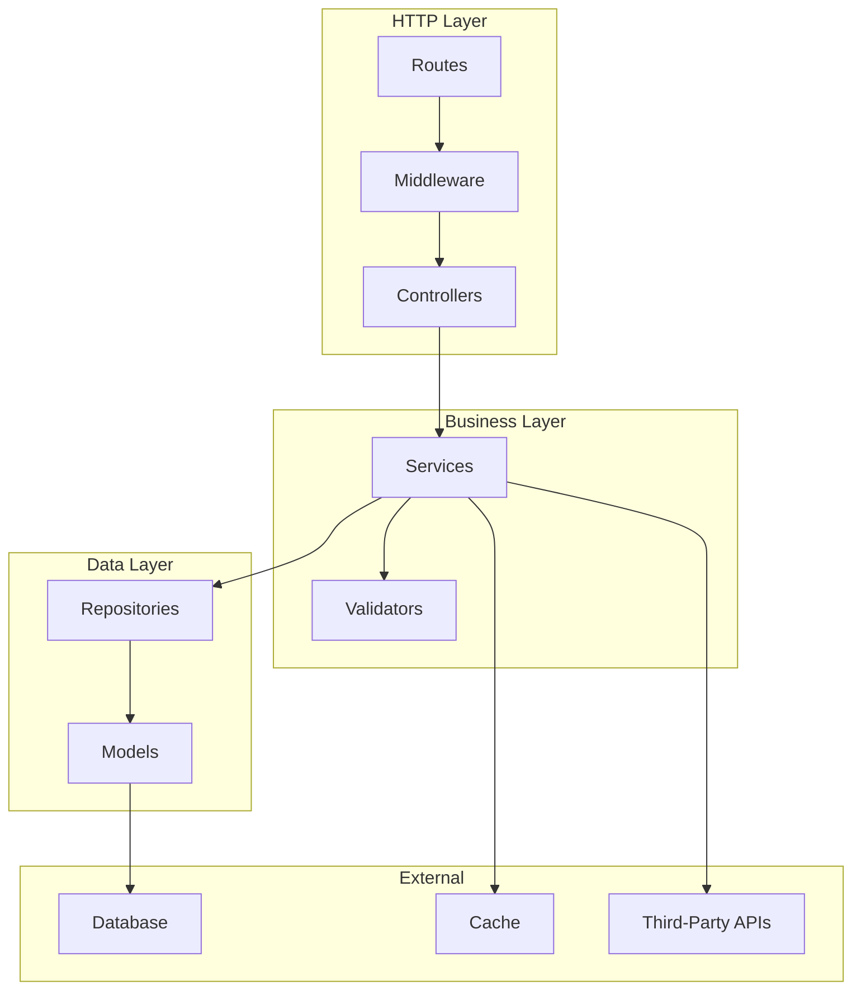
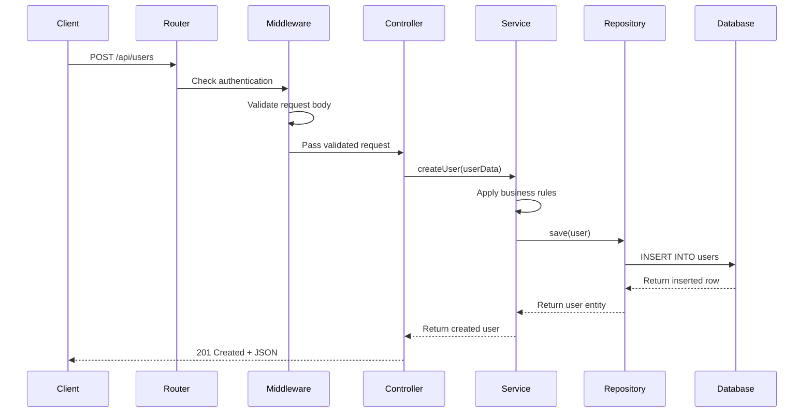
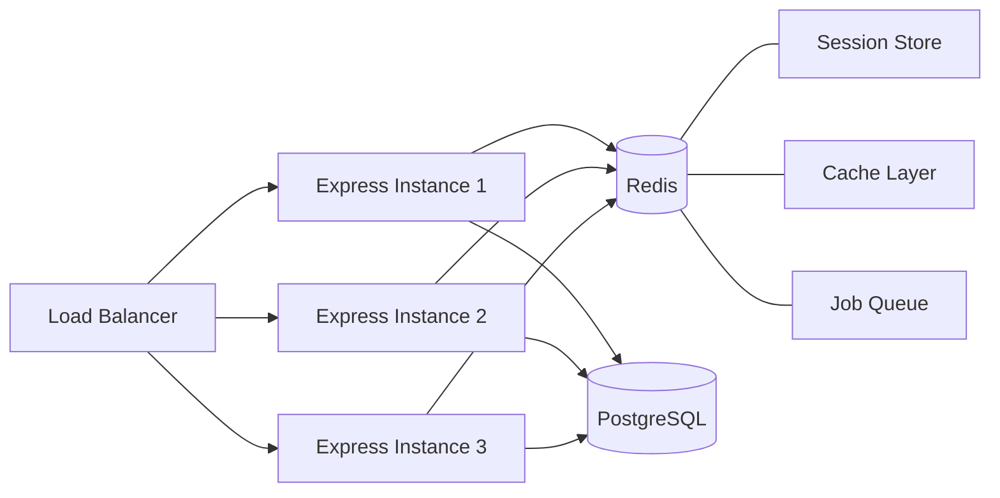

# How to Structure Express.js Applications for Scale

Author: [nawazdhandala](https://www.github.com/nawazdhandala)

Tags: Express.js, Node.js, Application Structure, Backend Development, Scalability

Description: Learn how to structure Express.js applications for scale with proper folder organization, middleware patterns, and separation of concerns.

---

Building an Express.js application that handles a few hundred users is straightforward. Building one that handles millions of requests while remaining maintainable is a different challenge. The difference often comes down to how you structure your code from the beginning.

This guide covers folder organization patterns, middleware architecture, and separation of concerns that keep Express applications manageable as they grow.

## Why Structure Matters

A poorly structured Express app becomes a maintenance nightmare as it scales. Common problems include:

- Route handlers that contain business logic, database queries, and response formatting all mixed together
- Middleware that is difficult to test in isolation
- Configuration scattered across multiple files
- No clear separation between HTTP concerns and domain logic

The goal of good structure is to make changes predictable. When you need to modify how users are authenticated, you should know exactly where that code lives without searching through dozens of files.

## Application Layer Architecture

Before diving into folder structures, understand the layers that make up a well-designed Express application:



Each layer has a specific responsibility:

- **Routes**: Define URL patterns and HTTP methods
- **Middleware**: Handle cross-cutting concerns like authentication and logging
- **Controllers**: Parse HTTP requests and format HTTP responses
- **Services**: Contain business logic and orchestrate operations
- **Repositories**: Abstract database operations
- **Models**: Define data structures and relationships

## Recommended Folder Structure

Here is a folder structure that works well for medium to large Express applications:

```
src/
├── config/
│   ├── index.js           # Configuration aggregator
│   ├── database.js        # Database connection settings
│   ├── redis.js           # Cache settings
│   └── app.js             # Application settings
├── middleware/
│   ├── authentication.js  # JWT/session validation
│   ├── authorization.js   # Role-based access control
│   ├── errorHandler.js    # Centralized error handling
│   ├── requestLogger.js   # Request/response logging
│   ├── rateLimiter.js     # Rate limiting logic
│   └── validator.js       # Request validation wrapper
├── routes/
│   ├── index.js           # Route aggregator
│   ├── users.js           # User-related routes
│   ├── products.js        # Product-related routes
│   └── orders.js          # Order-related routes
├── controllers/
│   ├── userController.js
│   ├── productController.js
│   └── orderController.js
├── services/
│   ├── userService.js
│   ├── productService.js
│   ├── orderService.js
│   └── emailService.js
├── repositories/
│   ├── userRepository.js
│   ├── productRepository.js
│   └── orderRepository.js
├── models/
│   ├── index.js           # Model aggregator
│   ├── User.js
│   ├── Product.js
│   └── Order.js
├── validators/
│   ├── userValidator.js
│   ├── productValidator.js
│   └── orderValidator.js
├── utils/
│   ├── logger.js          # Logging utility
│   ├── errors.js          # Custom error classes
│   └── helpers.js         # General helper functions
├── app.js                 # Express app setup
└── server.js              # Server entry point
```

## Request Flow Through Layers

When a request comes in, it flows through the layers in a predictable pattern:



## Implementation Examples

### Entry Point and App Setup

Start with a clean separation between app configuration and server startup:

```javascript
// src/server.js
// Entry point for the application
// Handles server startup and graceful shutdown

const app = require('./app');
const config = require('./config');
const logger = require('./utils/logger');

const server = app.listen(config.app.port, () => {
  logger.info(`Server running on port ${config.app.port}`);
  logger.info(`Environment: ${config.app.env}`);
});

// Graceful shutdown handling
// Give existing connections time to complete before exiting
const shutdown = (signal) => {
  logger.info(`${signal} received, starting graceful shutdown`);

  server.close((err) => {
    if (err) {
      logger.error('Error during shutdown', err);
      process.exit(1);
    }

    logger.info('Server closed successfully');
    process.exit(0);
  });

  // Force shutdown after 30 seconds if graceful shutdown fails
  setTimeout(() => {
    logger.error('Forced shutdown after timeout');
    process.exit(1);
  }, 30000);
};

process.on('SIGTERM', () => shutdown('SIGTERM'));
process.on('SIGINT', () => shutdown('SIGINT'));
```

```javascript
// src/app.js
// Express application configuration
// Middleware registration and route mounting

const express = require('express');
const helmet = require('helmet');
const cors = require('cors');
const compression = require('compression');

const config = require('./config');
const routes = require('./routes');
const errorHandler = require('./middleware/errorHandler');
const requestLogger = require('./middleware/requestLogger');
const rateLimiter = require('./middleware/rateLimiter');

const app = express();

// Security middleware
// helmet sets various HTTP headers for security
app.use(helmet());

// CORS configuration
// Restrict origins in production
app.use(cors({
  origin: config.app.corsOrigins,
  credentials: true,
}));

// Request parsing
app.use(express.json({ limit: '10mb' }));
app.use(express.urlencoded({ extended: true }));

// Compression for responses larger than 1KB
app.use(compression({ threshold: 1024 }));

// Custom middleware
app.use(requestLogger);
app.use(rateLimiter);

// Health check endpoint
// Place before authentication so monitoring can access it
app.get('/health', (req, res) => {
  res.json({ status: 'healthy', timestamp: new Date().toISOString() });
});

// API routes
app.use('/api', routes);

// 404 handler for unmatched routes
app.use((req, res) => {
  res.status(404).json({
    error: 'Not Found',
    message: `Cannot ${req.method} ${req.path}`,
  });
});

// Centralized error handling
// Must be last middleware
app.use(errorHandler);

module.exports = app;
```

### Configuration Management

Centralize configuration to avoid scattered environment variable access:

```javascript
// src/config/index.js
// Aggregates all configuration modules
// Validates required environment variables at startup

const app = require('./app');
const database = require('./database');
const redis = require('./redis');

// Validate required configuration at startup
// Fail fast if critical config is missing
const requiredEnvVars = ['DATABASE_URL', 'JWT_SECRET'];

for (const envVar of requiredEnvVars) {
  if (!process.env[envVar]) {
    throw new Error(`Missing required environment variable: ${envVar}`);
  }
}

module.exports = {
  app,
  database,
  redis,
};
```

```javascript
// src/config/app.js
// Application-level configuration

module.exports = {
  env: process.env.NODE_ENV || 'development',
  port: parseInt(process.env.PORT, 10) || 3000,

  // CORS origins differ by environment
  corsOrigins: process.env.CORS_ORIGINS
    ? process.env.CORS_ORIGINS.split(',')
    : ['http://localhost:3000'],

  // JWT configuration
  jwt: {
    secret: process.env.JWT_SECRET,
    expiresIn: process.env.JWT_EXPIRES_IN || '24h',
  },

  // Rate limiting
  rateLimit: {
    windowMs: parseInt(process.env.RATE_LIMIT_WINDOW_MS, 10) || 60000,
    maxRequests: parseInt(process.env.RATE_LIMIT_MAX, 10) || 100,
  },
};
```

### Route Organization

Keep routes thin. Their job is only to map URLs to controllers:

```javascript
// src/routes/index.js
// Route aggregator
// Mounts all route modules under their prefixes

const express = require('express');
const userRoutes = require('./users');
const productRoutes = require('./products');
const orderRoutes = require('./orders');

const router = express.Router();

// Mount routes with their prefixes
router.use('/users', userRoutes);
router.use('/products', productRoutes);
router.use('/orders', orderRoutes);

module.exports = router;
```

```javascript
// src/routes/users.js
// User-related routes
// Defines URL patterns and connects them to controllers

const express = require('express');
const userController = require('../controllers/userController');
const { authenticate, authorize } = require('../middleware/authentication');
const { validateBody } = require('../middleware/validator');
const { createUserSchema, updateUserSchema } = require('../validators/userValidator');

const router = express.Router();

// Public routes
router.post('/register', validateBody(createUserSchema), userController.register);
router.post('/login', userController.login);

// Protected routes
// authenticate middleware verifies JWT token
// authorize middleware checks user roles
router.use(authenticate);

router.get('/me', userController.getCurrentUser);
router.patch('/me', validateBody(updateUserSchema), userController.updateCurrentUser);

// Admin-only routes
router.get('/', authorize('admin'), userController.listUsers);
router.get('/:id', authorize('admin'), userController.getUserById);
router.delete('/:id', authorize('admin'), userController.deleteUser);

module.exports = router;
```

### Controllers

Controllers handle HTTP-specific logic. They parse requests, call services, and format responses:

```javascript
// src/controllers/userController.js
// Handles HTTP request/response for user operations
// Delegates business logic to userService

const userService = require('../services/userService');
const { NotFoundError } = require('../utils/errors');

// Controller methods receive req, res, and next
// They should not contain business logic
const userController = {

  // POST /api/users/register
  async register(req, res, next) {
    try {
      // Extract validated data from request body
      const { email, password, name } = req.body;

      // Delegate to service layer
      const result = await userService.createUser({ email, password, name });

      // Format and send response
      res.status(201).json({
        message: 'User registered successfully',
        data: {
          user: result.user,
          token: result.token,
        },
      });
    } catch (error) {
      // Pass errors to error handling middleware
      next(error);
    }
  },

  // POST /api/users/login
  async login(req, res, next) {
    try {
      const { email, password } = req.body;

      const result = await userService.authenticate(email, password);

      res.json({
        message: 'Login successful',
        data: {
          user: result.user,
          token: result.token,
        },
      });
    } catch (error) {
      next(error);
    }
  },

  // GET /api/users/me
  async getCurrentUser(req, res, next) {
    try {
      // req.user is set by authentication middleware
      const user = await userService.getUserById(req.user.id);

      res.json({
        data: { user },
      });
    } catch (error) {
      next(error);
    }
  },

  // GET /api/users/:id
  async getUserById(req, res, next) {
    try {
      const user = await userService.getUserById(req.params.id);

      if (!user) {
        throw new NotFoundError('User not found');
      }

      res.json({
        data: { user },
      });
    } catch (error) {
      next(error);
    }
  },

  // GET /api/users
  async listUsers(req, res, next) {
    try {
      // Extract pagination parameters from query string
      const page = parseInt(req.query.page, 10) || 1;
      const limit = parseInt(req.query.limit, 10) || 20;

      const result = await userService.listUsers({ page, limit });

      res.json({
        data: { users: result.users },
        pagination: {
          page: result.page,
          limit: result.limit,
          total: result.total,
          totalPages: result.totalPages,
        },
      });
    } catch (error) {
      next(error);
    }
  },

  // PATCH /api/users/me
  async updateCurrentUser(req, res, next) {
    try {
      const user = await userService.updateUser(req.user.id, req.body);

      res.json({
        message: 'User updated successfully',
        data: { user },
      });
    } catch (error) {
      next(error);
    }
  },

  // DELETE /api/users/:id
  async deleteUser(req, res, next) {
    try {
      await userService.deleteUser(req.params.id);

      // 204 No Content for successful deletion
      res.status(204).send();
    } catch (error) {
      next(error);
    }
  },
};

module.exports = userController;
```

### Services

Services contain business logic and orchestrate operations:

```javascript
// src/services/userService.js
// Business logic for user operations
// Orchestrates repositories, validators, and external services

const bcrypt = require('bcrypt');
const jwt = require('jsonwebtoken');
const config = require('../config');
const userRepository = require('../repositories/userRepository');
const emailService = require('./emailService');
const { ConflictError, UnauthorizedError, NotFoundError } = require('../utils/errors');

const SALT_ROUNDS = 12;

const userService = {

  // Create a new user account
  async createUser({ email, password, name }) {
    // Check if email is already registered
    const existingUser = await userRepository.findByEmail(email);

    if (existingUser) {
      throw new ConflictError('Email already registered');
    }

    // Hash password before storing
    const passwordHash = await bcrypt.hash(password, SALT_ROUNDS);

    // Create user in database
    const user = await userRepository.create({
      email,
      passwordHash,
      name,
      role: 'user',
    });

    // Generate authentication token
    const token = this.generateToken(user);

    // Send welcome email asynchronously
    // Do not await to avoid blocking the response
    emailService.sendWelcomeEmail(user.email, user.name).catch((err) => {
      // Log error but do not fail the request
      console.error('Failed to send welcome email:', err);
    });

    return {
      user: this.sanitizeUser(user),
      token,
    };
  },

  // Authenticate user with email and password
  async authenticate(email, password) {
    const user = await userRepository.findByEmail(email);

    if (!user) {
      // Use same error message to prevent email enumeration
      throw new UnauthorizedError('Invalid email or password');
    }

    // Verify password against stored hash
    const isValidPassword = await bcrypt.compare(password, user.passwordHash);

    if (!isValidPassword) {
      throw new UnauthorizedError('Invalid email or password');
    }

    // Update last login timestamp
    await userRepository.updateLastLogin(user.id);

    const token = this.generateToken(user);

    return {
      user: this.sanitizeUser(user),
      token,
    };
  },

  // Get user by ID
  async getUserById(id) {
    const user = await userRepository.findById(id);

    if (!user) {
      return null;
    }

    return this.sanitizeUser(user);
  },

  // List users with pagination
  async listUsers({ page, limit }) {
    const offset = (page - 1) * limit;

    const [users, total] = await Promise.all([
      userRepository.findMany({ offset, limit }),
      userRepository.count(),
    ]);

    return {
      users: users.map(this.sanitizeUser),
      page,
      limit,
      total,
      totalPages: Math.ceil(total / limit),
    };
  },

  // Update user profile
  async updateUser(id, updates) {
    const user = await userRepository.findById(id);

    if (!user) {
      throw new NotFoundError('User not found');
    }

    // Only allow updating specific fields
    const allowedUpdates = ['name', 'email'];
    const sanitizedUpdates = {};

    for (const field of allowedUpdates) {
      if (updates[field] !== undefined) {
        sanitizedUpdates[field] = updates[field];
      }
    }

    // If email is being updated, check for conflicts
    if (sanitizedUpdates.email && sanitizedUpdates.email !== user.email) {
      const existingUser = await userRepository.findByEmail(sanitizedUpdates.email);
      if (existingUser) {
        throw new ConflictError('Email already in use');
      }
    }

    const updatedUser = await userRepository.update(id, sanitizedUpdates);

    return this.sanitizeUser(updatedUser);
  },

  // Delete user account
  async deleteUser(id) {
    const user = await userRepository.findById(id);

    if (!user) {
      throw new NotFoundError('User not found');
    }

    await userRepository.delete(id);
  },

  // Generate JWT token for user
  generateToken(user) {
    return jwt.sign(
      {
        id: user.id,
        email: user.email,
        role: user.role,
      },
      config.app.jwt.secret,
      { expiresIn: config.app.jwt.expiresIn }
    );
  },

  // Remove sensitive fields from user object
  sanitizeUser(user) {
    const { passwordHash, ...sanitized } = user;
    return sanitized;
  },
};

module.exports = userService;
```

### Repositories

Repositories abstract database operations:

```javascript
// src/repositories/userRepository.js
// Database access layer for users
// Abstracts SQL/ORM queries from business logic

const { db } = require('../models');

const userRepository = {

  // Find user by ID
  async findById(id) {
    return db.query(
      'SELECT * FROM users WHERE id = $1',
      [id]
    ).then(result => result.rows[0] || null);
  },

  // Find user by email
  async findByEmail(email) {
    return db.query(
      'SELECT * FROM users WHERE email = $1',
      [email.toLowerCase()]
    ).then(result => result.rows[0] || null);
  },

  // Find multiple users with pagination
  async findMany({ offset, limit }) {
    return db.query(
      'SELECT * FROM users ORDER BY created_at DESC LIMIT $1 OFFSET $2',
      [limit, offset]
    ).then(result => result.rows);
  },

  // Count total users
  async count() {
    return db.query(
      'SELECT COUNT(*) FROM users'
    ).then(result => parseInt(result.rows[0].count, 10));
  },

  // Create new user
  async create({ email, passwordHash, name, role }) {
    return db.query(
      `INSERT INTO users (email, password_hash, name, role, created_at, updated_at)
       VALUES ($1, $2, $3, $4, NOW(), NOW())
       RETURNING *`,
      [email.toLowerCase(), passwordHash, name, role]
    ).then(result => result.rows[0]);
  },

  // Update user by ID
  async update(id, updates) {
    const fields = [];
    const values = [];
    let paramIndex = 1;

    // Build dynamic update query
    for (const [key, value] of Object.entries(updates)) {
      fields.push(`${this.toSnakeCase(key)} = $${paramIndex}`);
      values.push(value);
      paramIndex++;
    }

    fields.push(`updated_at = NOW()`);
    values.push(id);

    return db.query(
      `UPDATE users SET ${fields.join(', ')} WHERE id = $${paramIndex} RETURNING *`,
      values
    ).then(result => result.rows[0]);
  },

  // Update last login timestamp
  async updateLastLogin(id) {
    return db.query(
      'UPDATE users SET last_login_at = NOW() WHERE id = $1',
      [id]
    );
  },

  // Delete user by ID
  async delete(id) {
    return db.query(
      'DELETE FROM users WHERE id = $1',
      [id]
    );
  },

  // Convert camelCase to snake_case for database columns
  toSnakeCase(str) {
    return str.replace(/[A-Z]/g, letter => `_${letter.toLowerCase()}`);
  },
};

module.exports = userRepository;
```

### Middleware Patterns

#### Authentication Middleware

```javascript
// src/middleware/authentication.js
// JWT authentication and role-based authorization

const jwt = require('jsonwebtoken');
const config = require('../config');
const { UnauthorizedError, ForbiddenError } = require('../utils/errors');

// Verify JWT token and attach user to request
const authenticate = (req, res, next) => {
  const authHeader = req.headers.authorization;

  if (!authHeader || !authHeader.startsWith('Bearer ')) {
    return next(new UnauthorizedError('No token provided'));
  }

  const token = authHeader.substring(7); // Remove 'Bearer ' prefix

  try {
    const decoded = jwt.verify(token, config.app.jwt.secret);

    // Attach decoded user info to request
    req.user = {
      id: decoded.id,
      email: decoded.email,
      role: decoded.role,
    };

    next();
  } catch (error) {
    if (error.name === 'TokenExpiredError') {
      return next(new UnauthorizedError('Token expired'));
    }
    return next(new UnauthorizedError('Invalid token'));
  }
};

// Check if user has required role
// Can accept single role or array of roles
const authorize = (...allowedRoles) => {
  return (req, res, next) => {
    if (!req.user) {
      return next(new UnauthorizedError('Authentication required'));
    }

    if (!allowedRoles.includes(req.user.role)) {
      return next(new ForbiddenError('Insufficient permissions'));
    }

    next();
  };
};

module.exports = { authenticate, authorize };
```

#### Error Handling Middleware

```javascript
// src/middleware/errorHandler.js
// Centralized error handling for all routes

const logger = require('../utils/logger');
const { AppError } = require('../utils/errors');

const errorHandler = (err, req, res, next) => {
  // Log error details
  logger.error({
    message: err.message,
    stack: err.stack,
    path: req.path,
    method: req.method,
    requestId: req.id,
  });

  // Handle known application errors
  if (err instanceof AppError) {
    return res.status(err.statusCode).json({
      error: err.name,
      message: err.message,
      ...(err.details && { details: err.details }),
    });
  }

  // Handle validation errors from libraries like Joi
  if (err.name === 'ValidationError') {
    return res.status(400).json({
      error: 'ValidationError',
      message: 'Invalid request data',
      details: err.details || err.message,
    });
  }

  // Handle database errors
  if (err.code === '23505') {
    // PostgreSQL unique violation
    return res.status(409).json({
      error: 'ConflictError',
      message: 'Resource already exists',
    });
  }

  // Handle unknown errors
  // Do not expose internal details in production
  const isProduction = process.env.NODE_ENV === 'production';

  res.status(500).json({
    error: 'InternalServerError',
    message: isProduction ? 'An unexpected error occurred' : err.message,
    ...(!isProduction && { stack: err.stack }),
  });
};

module.exports = errorHandler;
```

#### Custom Error Classes

```javascript
// src/utils/errors.js
// Custom error classes for consistent error handling

// Base application error
class AppError extends Error {
  constructor(message, statusCode = 500) {
    super(message);
    this.name = this.constructor.name;
    this.statusCode = statusCode;
    Error.captureStackTrace(this, this.constructor);
  }
}

// 400 Bad Request
class BadRequestError extends AppError {
  constructor(message = 'Bad request', details = null) {
    super(message, 400);
    this.details = details;
  }
}

// 401 Unauthorized
class UnauthorizedError extends AppError {
  constructor(message = 'Unauthorized') {
    super(message, 401);
  }
}

// 403 Forbidden
class ForbiddenError extends AppError {
  constructor(message = 'Forbidden') {
    super(message, 403);
  }
}

// 404 Not Found
class NotFoundError extends AppError {
  constructor(message = 'Resource not found') {
    super(message, 404);
  }
}

// 409 Conflict
class ConflictError extends AppError {
  constructor(message = 'Resource conflict') {
    super(message, 409);
  }
}

// 422 Unprocessable Entity
class ValidationError extends AppError {
  constructor(message = 'Validation failed', details = null) {
    super(message, 422);
    this.details = details;
  }
}

module.exports = {
  AppError,
  BadRequestError,
  UnauthorizedError,
  ForbiddenError,
  NotFoundError,
  ConflictError,
  ValidationError,
};
```

### Request Validation

Use a validation library with a middleware wrapper:

```javascript
// src/middleware/validator.js
// Validation middleware wrapper for Joi schemas

const { ValidationError } = require('../utils/errors');

// Validate request body against schema
const validateBody = (schema) => {
  return (req, res, next) => {
    const { error, value } = schema.validate(req.body, {
      abortEarly: false,       // Return all errors, not just first
      stripUnknown: true,      // Remove unknown fields
    });

    if (error) {
      const details = error.details.map(detail => ({
        field: detail.path.join('.'),
        message: detail.message,
      }));

      return next(new ValidationError('Validation failed', details));
    }

    // Replace body with validated/sanitized values
    req.body = value;
    next();
  };
};

// Validate query parameters
const validateQuery = (schema) => {
  return (req, res, next) => {
    const { error, value } = schema.validate(req.query, {
      abortEarly: false,
      stripUnknown: true,
    });

    if (error) {
      const details = error.details.map(detail => ({
        field: detail.path.join('.'),
        message: detail.message,
      }));

      return next(new ValidationError('Invalid query parameters', details));
    }

    req.query = value;
    next();
  };
};

// Validate route parameters
const validateParams = (schema) => {
  return (req, res, next) => {
    const { error, value } = schema.validate(req.params, {
      abortEarly: false,
    });

    if (error) {
      const details = error.details.map(detail => ({
        field: detail.path.join('.'),
        message: detail.message,
      }));

      return next(new ValidationError('Invalid route parameters', details));
    }

    req.params = value;
    next();
  };
};

module.exports = { validateBody, validateQuery, validateParams };
```

```javascript
// src/validators/userValidator.js
// Validation schemas for user operations

const Joi = require('joi');

const createUserSchema = Joi.object({
  email: Joi.string()
    .email()
    .required()
    .messages({
      'string.email': 'Please provide a valid email address',
      'any.required': 'Email is required',
    }),

  password: Joi.string()
    .min(8)
    .max(128)
    .pattern(/^(?=.*[a-z])(?=.*[A-Z])(?=.*\d)/)
    .required()
    .messages({
      'string.min': 'Password must be at least 8 characters',
      'string.pattern.base': 'Password must contain lowercase, uppercase, and number',
      'any.required': 'Password is required',
    }),

  name: Joi.string()
    .min(2)
    .max(100)
    .required()
    .messages({
      'string.min': 'Name must be at least 2 characters',
      'any.required': 'Name is required',
    }),
});

const updateUserSchema = Joi.object({
  email: Joi.string()
    .email()
    .messages({
      'string.email': 'Please provide a valid email address',
    }),

  name: Joi.string()
    .min(2)
    .max(100)
    .messages({
      'string.min': 'Name must be at least 2 characters',
    }),
}).min(1).messages({
  'object.min': 'At least one field must be provided for update',
});

module.exports = {
  createUserSchema,
  updateUserSchema,
};
```

## Dependency Injection Pattern

For better testability, use dependency injection instead of direct imports:

```javascript
// src/services/userService.js with dependency injection

const createUserService = ({ userRepository, emailService, config }) => {
  return {
    async createUser({ email, password, name }) {
      // Same implementation but uses injected dependencies
      const existingUser = await userRepository.findByEmail(email);
      // ...
    },

    // ... other methods
  };
};

module.exports = createUserService;
```

```javascript
// src/container.js
// Dependency injection container

const config = require('./config');
const userRepository = require('./repositories/userRepository');
const emailService = require('./services/emailService');
const createUserService = require('./services/userService');

// Create service instances with dependencies
const userService = createUserService({
  userRepository,
  emailService,
  config,
});

module.exports = {
  userService,
  // ... other services
};
```

## Scaling Considerations

### Horizontal Scaling



When running multiple Express instances:

1. **Session Storage**: Use Redis instead of in-memory sessions
2. **Stateless Design**: Do not store state in memory between requests
3. **Database Connection Pooling**: Configure connection pools appropriately
4. **Shared Cache**: Use Redis for caching instead of in-process caching

### Connection Pooling

```javascript
// src/config/database.js
// Database connection with pooling

const { Pool } = require('pg');

const pool = new Pool({
  connectionString: process.env.DATABASE_URL,

  // Pool configuration for production workloads
  max: 20,                    // Maximum connections in pool
  idleTimeoutMillis: 30000,   // Close idle connections after 30s
  connectionTimeoutMillis: 2000, // Fail fast if connection takes too long
});

// Handle pool errors
pool.on('error', (err) => {
  console.error('Unexpected database pool error', err);
});

module.exports = { pool };
```

## Summary

| Layer | Responsibility | Example Files |
|-------|----------------|---------------|
| Routes | URL mapping | `routes/users.js` |
| Middleware | Cross-cutting concerns | `middleware/authentication.js` |
| Controllers | HTTP handling | `controllers/userController.js` |
| Services | Business logic | `services/userService.js` |
| Repositories | Data access | `repositories/userRepository.js` |
| Validators | Input validation | `validators/userValidator.js` |
| Utils | Shared helpers | `utils/errors.js`, `utils/logger.js` |

The key principles for scalable Express applications:

1. **Separate concerns**: Each layer has one job
2. **Keep routes thin**: Only URL mapping and middleware assignment
3. **Business logic in services**: Controllers should not contain domain rules
4. **Abstract data access**: Repositories hide database implementation details
5. **Centralize error handling**: One place for error transformation
6. **Validate early**: Check input before it reaches business logic
7. **Inject dependencies**: Make services testable with injected dependencies

This structure scales well because changes are localized. Adding a new feature means adding files in known locations. Modifying business rules means changing service files. The codebase remains predictable as it grows.
