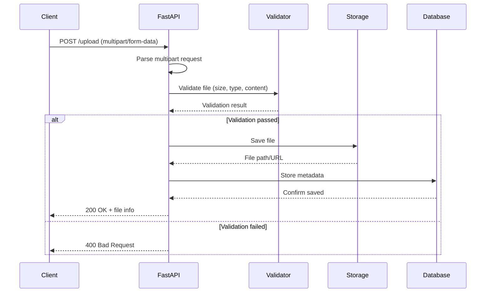
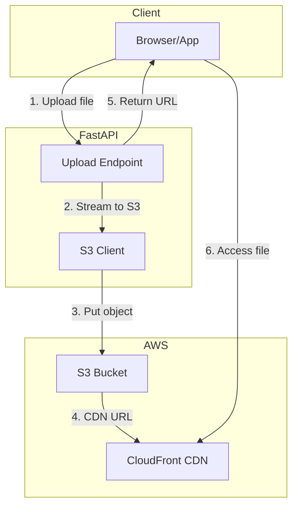
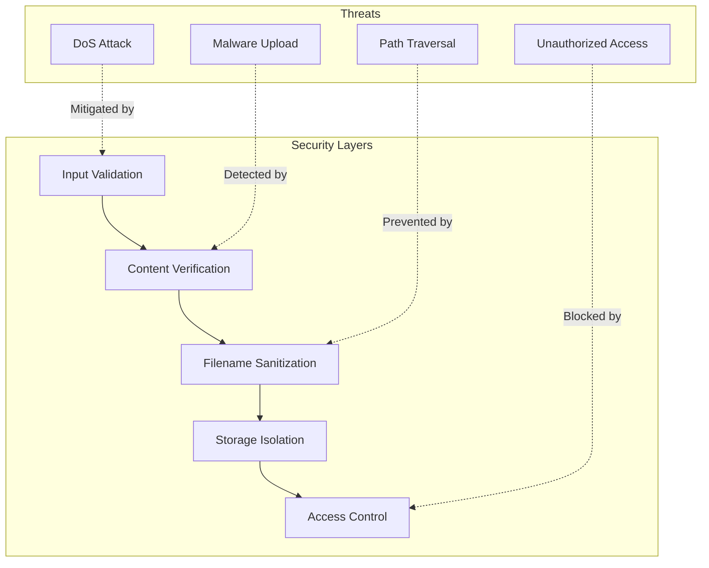

# How to Implement File Uploads in FastAPI

Author: [nawazdhandala](https://www.github.com/nawazdhandala)

Tags: FastAPI, File Uploads, Python, REST API, Multipart Forms, Async, Web Development

Description: A hands-on guide to implementing secure and scalable file uploads in FastAPI with validation, progress tracking, and cloud storage integration.

---

File uploads are a common requirement in web applications, from profile pictures to document management systems. FastAPI provides excellent support for handling file uploads through its built-in `File` and `UploadFile` classes. This guide walks you through implementing file uploads from basic single-file handling to advanced patterns like chunked uploads and cloud storage integration.

## Understanding FastAPI File Upload Architecture

Before diving into code, let's understand how file uploads flow through a FastAPI application.



## Basic File Upload Setup

Let's start with the essentials. First, install FastAPI and its dependencies:

```bash
# Install FastAPI with all dependencies
pip install fastapi[all] python-multipart aiofiles
```

Here's a minimal file upload endpoint:

```python
# main.py
from fastapi import FastAPI, File, UploadFile
from fastapi.responses import JSONResponse
import aiofiles
import os
from pathlib import Path

app = FastAPI()

# Create upload directory if it doesn't exist
UPLOAD_DIR = Path("uploads")
UPLOAD_DIR.mkdir(exist_ok=True)

@app.post("/upload")
async def upload_file(file: UploadFile = File(...)):
    """
    Basic file upload endpoint.

    Args:
        file: The uploaded file from the multipart form request.
              UploadFile gives us access to file metadata and streaming.

    Returns:
        JSON with filename and size information.
    """
    # Build the full path where we'll save the file
    file_path = UPLOAD_DIR / file.filename

    # Use aiofiles for async file writing - important for performance
    # when handling multiple concurrent uploads
    async with aiofiles.open(file_path, "wb") as buffer:
        # Read and write in chunks to handle large files efficiently
        # without loading the entire file into memory
        while content := await file.read(1024 * 1024):  # 1MB chunks
            await buffer.write(content)

    # Get file size for the response
    file_size = os.path.getsize(file_path)

    return JSONResponse({
        "filename": file.filename,
        "size": file_size,
        "content_type": file.content_type
    })
```

## File Validation

Never trust user uploads blindly. Here's a complete validation system:

```python
# validators.py
from fastapi import HTTPException, UploadFile
from typing import Set
import magic  # pip install python-magic

class FileValidator:
    """
    Validates uploaded files for size, extension, and actual content type.

    Content type validation uses libmagic to detect the real file type
    based on file headers, not just the extension which can be faked.
    """

    def __init__(
        self,
        max_size: int = 10 * 1024 * 1024,  # 10MB default
        allowed_extensions: Set[str] = None,
        allowed_content_types: Set[str] = None
    ):
        self.max_size = max_size
        self.allowed_extensions = allowed_extensions or {".jpg", ".jpeg", ".png", ".pdf"}
        self.allowed_content_types = allowed_content_types or {
            "image/jpeg",
            "image/png",
            "application/pdf"
        }

    async def validate(self, file: UploadFile) -> None:
        """
        Run all validations on the uploaded file.

        Raises HTTPException if any validation fails.
        """
        await self._validate_extension(file)
        await self._validate_size(file)
        await self._validate_content_type(file)

    async def _validate_extension(self, file: UploadFile) -> None:
        """Check if file extension is in the allowed list."""
        ext = "." + file.filename.split(".")[-1].lower() if "." in file.filename else ""

        if ext not in self.allowed_extensions:
            raise HTTPException(
                status_code=400,
                detail=f"File extension '{ext}' not allowed. Allowed: {self.allowed_extensions}"
            )

    async def _validate_size(self, file: UploadFile) -> None:
        """
        Check file size without loading entire file into memory.

        We read the file in chunks and count bytes, then seek back
        to the beginning so the file can still be saved afterward.
        """
        size = 0
        # Read file in chunks to count total size
        while chunk := await file.read(1024 * 1024):
            size += len(chunk)
            if size > self.max_size:
                raise HTTPException(
                    status_code=400,
                    detail=f"File too large. Maximum size: {self.max_size / 1024 / 1024}MB"
                )

        # Reset file position so it can be read again for saving
        await file.seek(0)

    async def _validate_content_type(self, file: UploadFile) -> None:
        """
        Validate actual file content type using libmagic.

        This detects the real file type by reading the file's magic bytes,
        preventing attacks where someone renames a malicious file to .jpg
        """
        # Read the first 2048 bytes - enough for magic number detection
        header = await file.read(2048)
        await file.seek(0)  # Reset for later reading

        # Use libmagic to detect actual content type from file header
        detected_type = magic.from_buffer(header, mime=True)

        if detected_type not in self.allowed_content_types:
            raise HTTPException(
                status_code=400,
                detail=f"Content type '{detected_type}' not allowed. Allowed: {self.allowed_content_types}"
            )
```

Now integrate the validator into your endpoint:

```python
# main.py (updated)
from validators import FileValidator

# Configure validator for image uploads
image_validator = FileValidator(
    max_size=5 * 1024 * 1024,  # 5MB
    allowed_extensions={".jpg", ".jpeg", ".png", ".gif"},
    allowed_content_types={"image/jpeg", "image/png", "image/gif"}
)

@app.post("/upload/image")
async def upload_image(file: UploadFile = File(...)):
    """
    Upload endpoint specifically for images with validation.
    """
    # Validate before saving - raises HTTPException if invalid
    await image_validator.validate(file)

    # Generate safe filename to prevent path traversal attacks
    safe_filename = generate_safe_filename(file.filename)
    file_path = UPLOAD_DIR / safe_filename

    async with aiofiles.open(file_path, "wb") as buffer:
        while content := await file.read(1024 * 1024):
            await buffer.write(content)

    return {"filename": safe_filename, "status": "uploaded"}


def generate_safe_filename(original: str) -> str:
    """
    Generate a safe filename that prevents path traversal attacks.

    Removes directory components and adds a UUID prefix to ensure
    uniqueness and prevent overwriting existing files.
    """
    import uuid
    from pathlib import Path

    # Extract just the filename, removing any path components
    # This prevents ../../../etc/passwd type attacks
    clean_name = Path(original).name

    # Add UUID prefix for uniqueness
    unique_prefix = str(uuid.uuid4())[:8]

    return f"{unique_prefix}_{clean_name}"
```

## Multiple File Uploads

Handling multiple files is straightforward with FastAPI:

```python
from typing import List

@app.post("/upload/multiple")
async def upload_multiple_files(files: List[UploadFile] = File(...)):
    """
    Handle multiple file uploads in a single request.

    Args:
        files: List of uploaded files. FastAPI automatically handles
               the multipart parsing for multiple files.

    Returns:
        List of upload results for each file.
    """
    results = []

    for file in files:
        try:
            # Validate each file
            await image_validator.validate(file)

            # Save each file
            safe_filename = generate_safe_filename(file.filename)
            file_path = UPLOAD_DIR / safe_filename

            async with aiofiles.open(file_path, "wb") as buffer:
                while content := await file.read(1024 * 1024):
                    await buffer.write(content)

            results.append({
                "original_name": file.filename,
                "saved_as": safe_filename,
                "status": "success"
            })

        except HTTPException as e:
            # Record failures but continue processing other files
            results.append({
                "original_name": file.filename,
                "status": "failed",
                "error": e.detail
            })

    # Count successes and failures
    success_count = sum(1 for r in results if r["status"] == "success")

    return {
        "total": len(files),
        "successful": success_count,
        "failed": len(files) - success_count,
        "results": results
    }
```

## Upload Progress Tracking

For large files, users need feedback. Here's how to implement server-sent events (SSE) for progress tracking:


```python
# progress.py
from fastapi import FastAPI, UploadFile, File, Request
from fastapi.responses import StreamingResponse
from typing import AsyncGenerator
import asyncio
import json

# Store upload progress by upload ID
upload_progress: dict = {}

@app.post("/upload/with-progress/{upload_id}")
async def upload_with_progress(
    upload_id: str,
    file: UploadFile = File(...)
):
    """
    Upload endpoint that tracks progress for the given upload_id.

    Clients should connect to /upload/progress/{upload_id} via SSE
    before starting the upload to receive progress updates.
    """
    # Get file size from content-length header if available
    # Note: This isn't always accurate for multipart uploads
    file_size = file.size or 0

    # Initialize progress tracking
    upload_progress[upload_id] = {
        "filename": file.filename,
        "total_size": file_size,
        "uploaded": 0,
        "status": "uploading"
    }

    file_path = UPLOAD_DIR / generate_safe_filename(file.filename)

    async with aiofiles.open(file_path, "wb") as buffer:
        while chunk := await file.read(1024 * 1024):  # 1MB chunks
            await buffer.write(chunk)

            # Update progress
            upload_progress[upload_id]["uploaded"] += len(chunk)

            # Small delay to allow SSE to catch up
            await asyncio.sleep(0.01)

    # Mark upload as complete
    upload_progress[upload_id]["status"] = "complete"

    return {"status": "complete", "upload_id": upload_id}


@app.get("/upload/progress/{upload_id}")
async def get_upload_progress(upload_id: str, request: Request):
    """
    Server-Sent Events endpoint for upload progress.

    Connect to this endpoint before starting the upload to receive
    real-time progress updates.

    Example client usage:
        const eventSource = new EventSource('/upload/progress/123');
        eventSource.onmessage = (event) => {
            const progress = JSON.parse(event.data);
            console.log(`${progress.percent}% complete`);
        };
    """
    async def event_generator() -> AsyncGenerator[str, None]:
        while True:
            # Check if client disconnected
            if await request.is_disconnected():
                break

            # Get current progress
            progress = upload_progress.get(upload_id)

            if progress:
                # Calculate percentage
                if progress["total_size"] > 0:
                    percent = (progress["uploaded"] / progress["total_size"]) * 100
                else:
                    percent = 0

                # Format as SSE message
                data = json.dumps({
                    "filename": progress["filename"],
                    "uploaded": progress["uploaded"],
                    "total": progress["total_size"],
                    "percent": round(percent, 2),
                    "status": progress["status"]
                })

                yield f"data: {data}\n\n"

                # Stop streaming when complete
                if progress["status"] == "complete":
                    # Clean up
                    del upload_progress[upload_id]
                    break

            await asyncio.sleep(0.5)  # Update every 500ms

    return StreamingResponse(
        event_generator(),
        media_type="text/event-stream",
        headers={
            "Cache-Control": "no-cache",
            "Connection": "keep-alive"
        }
    )
```

## Chunked Uploads for Large Files

For very large files, chunked uploads allow resumable transfers:

```python
# chunked_upload.py
from fastapi import FastAPI, UploadFile, File, Header, HTTPException
from pydantic import BaseModel
from typing import Optional
import aiofiles
import os

# Track ongoing chunked uploads
chunked_uploads: dict = {}

class ChunkUploadInit(BaseModel):
    """Request body for initializing a chunked upload."""
    filename: str
    total_size: int
    chunk_size: int = 5 * 1024 * 1024  # 5MB default chunk size


class ChunkUploadResponse(BaseModel):
    """Response containing upload session info."""
    upload_id: str
    chunk_size: int
    total_chunks: int


@app.post("/upload/chunked/init")
async def init_chunked_upload(data: ChunkUploadInit) -> ChunkUploadResponse:
    """
    Initialize a chunked upload session.

    Call this first to get an upload_id, then upload each chunk
    to /upload/chunked/{upload_id}/{chunk_number}
    """
    import uuid

    upload_id = str(uuid.uuid4())

    # Calculate number of chunks needed
    total_chunks = (data.total_size + data.chunk_size - 1) // data.chunk_size

    # Store session info
    chunked_uploads[upload_id] = {
        "filename": data.filename,
        "total_size": data.total_size,
        "chunk_size": data.chunk_size,
        "total_chunks": total_chunks,
        "received_chunks": set(),
        "temp_dir": UPLOAD_DIR / f"temp_{upload_id}"
    }

    # Create temp directory for chunks
    chunked_uploads[upload_id]["temp_dir"].mkdir(exist_ok=True)

    return ChunkUploadResponse(
        upload_id=upload_id,
        chunk_size=data.chunk_size,
        total_chunks=total_chunks
    )


@app.post("/upload/chunked/{upload_id}/{chunk_number}")
async def upload_chunk(
    upload_id: str,
    chunk_number: int,
    file: UploadFile = File(...)
):
    """
    Upload a single chunk of a large file.

    Args:
        upload_id: The session ID from /upload/chunked/init
        chunk_number: Zero-based index of this chunk
        file: The chunk data

    Chunks can be uploaded in any order and even in parallel.
    """
    if upload_id not in chunked_uploads:
        raise HTTPException(status_code=404, detail="Upload session not found")

    session = chunked_uploads[upload_id]

    # Validate chunk number
    if chunk_number < 0 or chunk_number >= session["total_chunks"]:
        raise HTTPException(status_code=400, detail="Invalid chunk number")

    # Check for duplicate chunk
    if chunk_number in session["received_chunks"]:
        return {"status": "already_received", "chunk": chunk_number}

    # Save chunk to temp file
    chunk_path = session["temp_dir"] / f"chunk_{chunk_number:06d}"

    async with aiofiles.open(chunk_path, "wb") as buffer:
        content = await file.read()
        await buffer.write(content)

    # Mark chunk as received
    session["received_chunks"].add(chunk_number)

    # Check if all chunks received
    if len(session["received_chunks"]) == session["total_chunks"]:
        # Assemble the final file
        final_path = UPLOAD_DIR / generate_safe_filename(session["filename"])
        await assemble_chunks(session, final_path)

        # Cleanup
        del chunked_uploads[upload_id]

        return {
            "status": "complete",
            "filename": final_path.name,
            "total_chunks": session["total_chunks"]
        }

    return {
        "status": "chunk_received",
        "chunk": chunk_number,
        "received": len(session["received_chunks"]),
        "total": session["total_chunks"]
    }


async def assemble_chunks(session: dict, final_path: Path) -> None:
    """
    Assemble all chunks into the final file.

    Reads chunks in order and writes them to the final destination,
    then cleans up temporary chunk files.
    """
    async with aiofiles.open(final_path, "wb") as final_file:
        for i in range(session["total_chunks"]):
            chunk_path = session["temp_dir"] / f"chunk_{i:06d}"

            async with aiofiles.open(chunk_path, "rb") as chunk_file:
                content = await chunk_file.read()
                await final_file.write(content)

            # Remove chunk file after writing
            os.remove(chunk_path)

    # Remove temp directory
    os.rmdir(session["temp_dir"])
```

## Cloud Storage Integration

In production, you'll often want to upload directly to cloud storage:



```python
# s3_upload.py
from fastapi import FastAPI, UploadFile, File, HTTPException
import boto3
from botocore.exceptions import ClientError
import os

# Initialize S3 client
# Credentials should be in environment variables or IAM role
s3_client = boto3.client(
    "s3",
    region_name=os.getenv("AWS_REGION", "us-east-1")
)

BUCKET_NAME = os.getenv("S3_BUCKET_NAME", "my-upload-bucket")
CLOUDFRONT_DOMAIN = os.getenv("CLOUDFRONT_DOMAIN", "")


@app.post("/upload/s3")
async def upload_to_s3(file: UploadFile = File(...)):
    """
    Upload file directly to S3 with streaming.

    Uses boto3's upload_fileobj which handles multipart uploads
    automatically for large files.
    """
    # Validate the file first
    await image_validator.validate(file)

    # Generate unique S3 key
    safe_filename = generate_safe_filename(file.filename)
    s3_key = f"uploads/{safe_filename}"

    try:
        # Upload to S3 using streaming
        # upload_fileobj handles multipart uploads automatically
        s3_client.upload_fileobj(
            file.file,  # SpooledTemporaryFile from UploadFile
            BUCKET_NAME,
            s3_key,
            ExtraArgs={
                "ContentType": file.content_type,
                # Set public-read if files should be publicly accessible
                # Otherwise, use presigned URLs for access
                "ACL": "private"
            }
        )

        # Generate URL for the uploaded file
        if CLOUDFRONT_DOMAIN:
            # Use CloudFront URL if configured
            file_url = f"https://{CLOUDFRONT_DOMAIN}/{s3_key}"
        else:
            # Generate presigned URL valid for 1 hour
            file_url = s3_client.generate_presigned_url(
                "get_object",
                Params={"Bucket": BUCKET_NAME, "Key": s3_key},
                ExpiresIn=3600
            )

        return {
            "status": "success",
            "key": s3_key,
            "url": file_url
        }

    except ClientError as e:
        raise HTTPException(
            status_code=500,
            detail=f"Failed to upload to S3: {str(e)}"
        )


@app.post("/upload/presigned-url")
async def get_presigned_upload_url(filename: str, content_type: str):
    """
    Generate a presigned URL for direct client-to-S3 upload.

    This allows clients to upload directly to S3, bypassing your server
    entirely. Useful for very large files to reduce server load.

    Client workflow:
    1. Call this endpoint to get presigned URL
    2. PUT file directly to the presigned URL
    3. Notify your server that upload is complete
    """
    safe_filename = generate_safe_filename(filename)
    s3_key = f"uploads/{safe_filename}"

    try:
        # Generate presigned POST URL
        presigned_post = s3_client.generate_presigned_post(
            BUCKET_NAME,
            s3_key,
            Fields={
                "Content-Type": content_type
            },
            Conditions=[
                {"Content-Type": content_type},
                ["content-length-range", 1, 100 * 1024 * 1024]  # 1 byte to 100MB
            ],
            ExpiresIn=3600  # URL valid for 1 hour
        )

        return {
            "url": presigned_post["url"],
            "fields": presigned_post["fields"],
            "key": s3_key
        }

    except ClientError as e:
        raise HTTPException(
            status_code=500,
            detail=f"Failed to generate presigned URL: {str(e)}"
        )
```

## Complete Example Application

Here's a complete, production-ready file upload service:

```python
# app.py
from fastapi import FastAPI, UploadFile, File, HTTPException, Depends
from fastapi.middleware.cors import CORSMiddleware
from pydantic import BaseModel
from typing import List, Optional
import aiofiles
import os
from pathlib import Path
from datetime import datetime
import uuid

app = FastAPI(
    title="File Upload Service",
    description="Production-ready file upload API",
    version="1.0.0"
)

# Enable CORS for frontend applications
app.add_middleware(
    CORSMiddleware,
    allow_origins=["*"],  # Configure appropriately for production
    allow_credentials=True,
    allow_methods=["*"],
    allow_headers=["*"],
)

# Configuration
UPLOAD_DIR = Path(os.getenv("UPLOAD_DIR", "uploads"))
MAX_FILE_SIZE = int(os.getenv("MAX_FILE_SIZE", 50 * 1024 * 1024))  # 50MB
ALLOWED_EXTENSIONS = {".jpg", ".jpeg", ".png", ".gif", ".pdf", ".doc", ".docx"}

UPLOAD_DIR.mkdir(exist_ok=True)


class FileResponse(BaseModel):
    """Response model for file upload."""
    id: str
    filename: str
    original_name: str
    size: int
    content_type: str
    upload_time: str
    url: str


class FileValidator:
    """Dependency for file validation."""

    def __init__(
        self,
        max_size: int = MAX_FILE_SIZE,
        allowed_extensions: set = ALLOWED_EXTENSIONS
    ):
        self.max_size = max_size
        self.allowed_extensions = allowed_extensions

    async def __call__(self, file: UploadFile = File(...)) -> UploadFile:
        """Validate file when used as a dependency."""
        # Check extension
        ext = Path(file.filename).suffix.lower()
        if ext not in self.allowed_extensions:
            raise HTTPException(
                status_code=400,
                detail=f"Extension {ext} not allowed"
            )

        # Check size by reading
        content = await file.read()
        if len(content) > self.max_size:
            raise HTTPException(
                status_code=400,
                detail=f"File exceeds maximum size of {self.max_size} bytes"
            )

        # Reset file position
        await file.seek(0)

        return file


# Create validator instances for different use cases
validate_file = FileValidator()
validate_image = FileValidator(
    max_size=10 * 1024 * 1024,
    allowed_extensions={".jpg", ".jpeg", ".png", ".gif"}
)


@app.post("/api/upload", response_model=FileResponse)
async def upload_file(file: UploadFile = Depends(validate_file)):
    """
    Upload a single file.

    Accepts any file type in the allowed list, validates size,
    and saves to local storage with a unique filename.
    """
    # Generate unique ID and filename
    file_id = str(uuid.uuid4())
    ext = Path(file.filename).suffix.lower()
    safe_filename = f"{file_id}{ext}"
    file_path = UPLOAD_DIR / safe_filename

    # Save file
    async with aiofiles.open(file_path, "wb") as buffer:
        content = await file.read()
        await buffer.write(content)

    file_size = os.path.getsize(file_path)

    return FileResponse(
        id=file_id,
        filename=safe_filename,
        original_name=file.filename,
        size=file_size,
        content_type=file.content_type,
        upload_time=datetime.utcnow().isoformat(),
        url=f"/files/{safe_filename}"
    )


@app.post("/api/upload/images", response_model=List[FileResponse])
async def upload_images(files: List[UploadFile] = File(...)):
    """
    Upload multiple image files at once.

    Each file is validated individually, and the response includes
    the status of each upload.
    """
    results = []

    for file in files:
        try:
            # Validate each file using the image validator
            validated_file = await validate_image(file)

            # Generate unique filename
            file_id = str(uuid.uuid4())
            ext = Path(validated_file.filename).suffix.lower()
            safe_filename = f"{file_id}{ext}"
            file_path = UPLOAD_DIR / safe_filename

            # Save file
            async with aiofiles.open(file_path, "wb") as buffer:
                content = await validated_file.read()
                await buffer.write(content)

            file_size = os.path.getsize(file_path)

            results.append(FileResponse(
                id=file_id,
                filename=safe_filename,
                original_name=validated_file.filename,
                size=file_size,
                content_type=validated_file.content_type,
                upload_time=datetime.utcnow().isoformat(),
                url=f"/files/{safe_filename}"
            ))

        except HTTPException:
            # Skip invalid files, continue with others
            continue

    if not results:
        raise HTTPException(
            status_code=400,
            detail="No valid files were uploaded"
        )

    return results


@app.delete("/api/files/{file_id}")
async def delete_file(file_id: str):
    """
    Delete an uploaded file by ID.

    Searches for the file with the given ID prefix and removes it.
    """
    # Find file with matching ID
    for file_path in UPLOAD_DIR.iterdir():
        if file_path.stem == file_id:
            os.remove(file_path)
            return {"status": "deleted", "id": file_id}

    raise HTTPException(status_code=404, detail="File not found")


# Serve uploaded files
from fastapi.staticfiles import StaticFiles
app.mount("/files", StaticFiles(directory=UPLOAD_DIR), name="files")


if __name__ == "__main__":
    import uvicorn
    uvicorn.run(app, host="0.0.0.0", port=8000)
```

## Testing File Uploads

Here's how to test your upload endpoints:

```python
# test_uploads.py
import pytest
from fastapi.testclient import TestClient
from io import BytesIO
from app import app

client = TestClient(app)


def test_upload_valid_file():
    """Test uploading a valid image file."""
    # Create a simple PNG file (1x1 pixel)
    png_data = (
        b'\x89PNG\r\n\x1a\n\x00\x00\x00\rIHDR\x00\x00\x00\x01'
        b'\x00\x00\x00\x01\x08\x02\x00\x00\x00\x90wS\xde\x00'
        b'\x00\x00\x0cIDATx\x9cc\xf8\x0f\x00\x00\x01\x01\x00'
        b'\x05\x18\xd8N\x00\x00\x00\x00IEND\xaeB`\x82'
    )

    response = client.post(
        "/api/upload",
        files={"file": ("test.png", BytesIO(png_data), "image/png")}
    )

    assert response.status_code == 200
    data = response.json()
    assert data["original_name"] == "test.png"
    assert data["content_type"] == "image/png"
    assert "id" in data
    assert "url" in data


def test_upload_invalid_extension():
    """Test that invalid file extensions are rejected."""
    response = client.post(
        "/api/upload",
        files={"file": ("test.exe", BytesIO(b"fake exe"), "application/x-msdownload")}
    )

    assert response.status_code == 400
    assert "not allowed" in response.json()["detail"]


def test_upload_too_large():
    """Test that oversized files are rejected."""
    # Create a file larger than the limit
    large_data = b"x" * (51 * 1024 * 1024)  # 51MB

    response = client.post(
        "/api/upload",
        files={"file": ("large.pdf", BytesIO(large_data), "application/pdf")}
    )

    assert response.status_code == 400
    assert "exceeds" in response.json()["detail"]


def test_upload_multiple_files():
    """Test uploading multiple files at once."""
    png_data = (
        b'\x89PNG\r\n\x1a\n\x00\x00\x00\rIHDR\x00\x00\x00\x01'
        b'\x00\x00\x00\x01\x08\x02\x00\x00\x00\x90wS\xde\x00'
        b'\x00\x00\x0cIDATx\x9cc\xf8\x0f\x00\x00\x01\x01\x00'
        b'\x05\x18\xd8N\x00\x00\x00\x00IEND\xaeB`\x82'
    )

    files = [
        ("files", ("image1.png", BytesIO(png_data), "image/png")),
        ("files", ("image2.png", BytesIO(png_data), "image/png")),
    ]

    response = client.post("/api/upload/images", files=files)

    assert response.status_code == 200
    data = response.json()
    assert len(data) == 2
```

## Security Considerations

When implementing file uploads, keep these security practices in mind:



Key security measures:

1. **Validate file types by content**, not just extension
2. **Sanitize filenames** to prevent path traversal attacks
3. **Set size limits** to prevent denial of service
4. **Store files outside the web root** or use a separate storage service
5. **Use virus scanning** for user-uploaded files in sensitive applications
6. **Implement rate limiting** to prevent abuse

## Conclusion

FastAPI provides a solid foundation for implementing file uploads, from simple single-file handlers to complex chunked upload systems. The key takeaways are:

- Use `UploadFile` for streaming large files efficiently
- Always validate files before processing
- Consider async operations for better performance under load
- Use cloud storage for production deployments
- Implement proper security measures to protect your application

The patterns shown here can be adapted to fit your specific needs, whether you're building a simple image gallery or a document management system.
