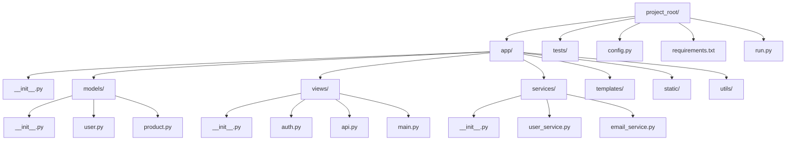
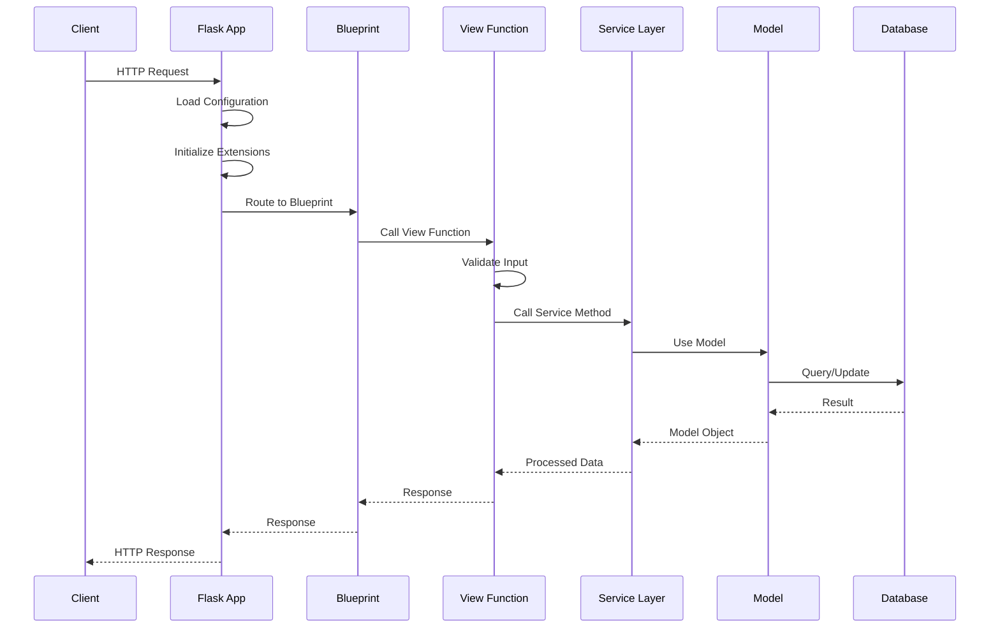

# How to Structure Large Flask Applications

Author: [nawazdhandala](https://www.github.com/nawazdhandala)

Tags: Flask, Python, Application Structure, Backend Development, Web Development

Description: Learn how to structure large Flask applications using blueprints, application factories, and proper project organization for maintainability.

---

When your Flask application grows beyond a simple single-file project, you need a solid structure to keep things maintainable. This guide walks you through organizing large Flask applications using proven patterns like the application factory, blueprints, and proper separation of concerns.

## The Problem with Single-File Flask Apps

Starting with Flask is easy. You create a single `app.py` file and you're running in minutes:

```python
from flask import Flask

app = Flask(__name__)

@app.route('/')
def index():
    return 'Hello, World!'

if __name__ == '__main__':
    app.run()
```

This works great for small projects. But as your application grows, you'll encounter several problems:

- Circular imports become a nightmare
- Testing becomes difficult without proper isolation
- Configuration management gets messy
- Code becomes hard to navigate

## The Recommended Project Structure

Here's a scalable structure that works well for large Flask applications:



Let's break down each component:

```
myproject/
├── app/
│   ├── __init__.py          # Application factory lives here
│   ├── models/
│   │   ├── __init__.py
│   │   ├── user.py          # User model
│   │   └── product.py       # Product model
│   ├── views/
│   │   ├── __init__.py
│   │   ├── auth.py          # Authentication blueprint
│   │   ├── api.py           # API blueprint
│   │   └── main.py          # Main blueprint
│   ├── services/
│   │   ├── __init__.py
│   │   ├── user_service.py  # Business logic for users
│   │   └── email_service.py # Email handling
│   ├── templates/
│   │   ├── base.html
│   │   └── auth/
│   │       └── login.html
│   ├── static/
│   │   ├── css/
│   │   └── js/
│   └── utils/
│       ├── __init__.py
│       └── helpers.py
├── tests/
│   ├── __init__.py
│   ├── conftest.py          # Pytest fixtures
│   ├── test_auth.py
│   └── test_api.py
├── config.py                 # Configuration classes
├── requirements.txt
└── run.py                    # Entry point
```

## The Application Factory Pattern

The application factory is the foundation of a well-structured Flask app. Instead of creating a global `app` object, you create a function that builds and configures the application:

```python
# app/__init__.py

from flask import Flask
from flask_sqlalchemy import SQLAlchemy
from flask_migrate import Migrate
from flask_login import LoginManager

# Initialize extensions without binding to app
# This allows us to import them elsewhere without circular imports
db = SQLAlchemy()
migrate = Migrate()
login_manager = LoginManager()

def create_app(config_name='development'):
    """
    Application factory function.

    Args:
        config_name: The configuration to use (development, testing, production)

    Returns:
        Configured Flask application instance
    """
    # Create the Flask application instance
    app = Flask(__name__)

    # Load configuration from config object
    # This keeps sensitive data out of version control
    from config import config
    app.config.from_object(config[config_name])

    # Initialize extensions with the app instance
    # This binds the extensions to this specific app
    db.init_app(app)
    migrate.init_app(app, db)
    login_manager.init_app(app)

    # Configure login manager settings
    login_manager.login_view = 'auth.login'
    login_manager.login_message_category = 'info'

    # Register blueprints
    # Each blueprint handles a specific area of functionality
    from app.views.main import main_bp
    from app.views.auth import auth_bp
    from app.views.api import api_bp

    app.register_blueprint(main_bp)
    app.register_blueprint(auth_bp, url_prefix='/auth')
    app.register_blueprint(api_bp, url_prefix='/api/v1')

    # Register error handlers
    register_error_handlers(app)

    # Register CLI commands for database management
    register_cli_commands(app)

    return app


def register_error_handlers(app):
    """Register custom error handlers for common HTTP errors."""

    @app.errorhandler(404)
    def not_found_error(error):
        return {'error': 'Resource not found'}, 404

    @app.errorhandler(500)
    def internal_error(error):
        # Rollback any failed database transactions
        db.session.rollback()
        return {'error': 'Internal server error'}, 500


def register_cli_commands(app):
    """Register custom CLI commands."""

    @app.cli.command()
    def init_db():
        """Initialize the database."""
        db.create_all()
        print('Database initialized.')
```

## Configuration Management

Keep your configuration organized in a dedicated file with different classes for each environment:

```python
# config.py

import os
from datetime import timedelta

class Config:
    """
    Base configuration class.
    Contains settings common to all environments.
    """
    # Security settings - always load from environment variables
    SECRET_KEY = os.environ.get('SECRET_KEY') or 'you-will-never-guess'

    # Database settings
    SQLALCHEMY_TRACK_MODIFICATIONS = False

    # Session settings
    PERMANENT_SESSION_LIFETIME = timedelta(days=7)

    # Pagination
    ITEMS_PER_PAGE = 20

    @staticmethod
    def init_app(app):
        """Perform any initialization needed for all environments."""
        pass


class DevelopmentConfig(Config):
    """Development configuration with debug enabled."""

    DEBUG = True
    SQLALCHEMY_DATABASE_URI = os.environ.get('DEV_DATABASE_URL') or \
        'sqlite:///dev.db'

    # More verbose logging in development
    SQLALCHEMY_ECHO = True


class TestingConfig(Config):
    """Testing configuration using in-memory database."""

    TESTING = True

    # Use in-memory SQLite for fast tests
    SQLALCHEMY_DATABASE_URI = 'sqlite:///:memory:'

    # Disable CSRF for testing
    WTF_CSRF_ENABLED = False


class ProductionConfig(Config):
    """Production configuration with security hardened."""

    # Database URL must be set in production
    SQLALCHEMY_DATABASE_URI = os.environ.get('DATABASE_URL')

    # Security headers
    SESSION_COOKIE_SECURE = True
    SESSION_COOKIE_HTTPONLY = True

    @staticmethod
    def init_app(app):
        """Production-specific initialization."""
        # Log to stderr in production
        import logging
        from logging import StreamHandler
        handler = StreamHandler()
        handler.setLevel(logging.WARNING)
        app.logger.addHandler(handler)


# Configuration dictionary for easy access
config = {
    'development': DevelopmentConfig,
    'testing': TestingConfig,
    'production': ProductionConfig,
    'default': DevelopmentConfig
}
```

## Blueprints for Modular Organization

Blueprints let you organize related routes and views into separate modules. Here's how to structure them:

```python
# app/views/auth.py

from flask import Blueprint, render_template, redirect, url_for, flash, request
from flask_login import login_user, logout_user, login_required, current_user
from app.models.user import User
from app.services.user_service import UserService
from app import db

# Create the blueprint instance
# The first argument is the blueprint name used in url_for()
# The second argument is the import name (usually __name__)
auth_bp = Blueprint('auth', __name__, template_folder='templates')

# Initialize the service layer
user_service = UserService()


@auth_bp.route('/login', methods=['GET', 'POST'])
def login():
    """
    Handle user login.

    GET: Display the login form
    POST: Process login credentials
    """
    # Redirect if already authenticated
    if current_user.is_authenticated:
        return redirect(url_for('main.index'))

    if request.method == 'POST':
        email = request.form.get('email')
        password = request.form.get('password')
        remember = request.form.get('remember', False)

        # Delegate authentication to service layer
        user = user_service.authenticate(email, password)

        if user:
            login_user(user, remember=remember)

            # Handle next parameter for redirect after login
            next_page = request.args.get('next')
            if next_page:
                return redirect(next_page)
            return redirect(url_for('main.index'))

        flash('Invalid email or password', 'error')

    return render_template('auth/login.html')


@auth_bp.route('/register', methods=['GET', 'POST'])
def register():
    """Handle new user registration."""
    if current_user.is_authenticated:
        return redirect(url_for('main.index'))

    if request.method == 'POST':
        email = request.form.get('email')
        username = request.form.get('username')
        password = request.form.get('password')

        # Check if user already exists
        if user_service.get_by_email(email):
            flash('Email already registered', 'error')
            return render_template('auth/register.html')

        # Create new user through service layer
        user = user_service.create_user(
            email=email,
            username=username,
            password=password
        )

        flash('Registration successful. Please log in.', 'success')
        return redirect(url_for('auth.login'))

    return render_template('auth/register.html')


@auth_bp.route('/logout')
@login_required
def logout():
    """Log out the current user."""
    logout_user()
    flash('You have been logged out.', 'info')
    return redirect(url_for('main.index'))
```

## The API Blueprint

For RESTful APIs, create a dedicated blueprint with proper response handling:

```python
# app/views/api.py

from flask import Blueprint, request, jsonify
from flask_login import login_required, current_user
from app.models.product import Product
from app.services.product_service import ProductService
from app.utils.decorators import json_required, admin_required

# Create API blueprint with versioned prefix
api_bp = Blueprint('api', __name__)
product_service = ProductService()


@api_bp.route('/products', methods=['GET'])
def get_products():
    """
    Get paginated list of products.

    Query Parameters:
        page: Page number (default: 1)
        per_page: Items per page (default: 20, max: 100)
        category: Filter by category (optional)

    Returns:
        JSON object with products array and pagination metadata
    """
    # Parse query parameters with defaults
    page = request.args.get('page', 1, type=int)
    per_page = min(request.args.get('per_page', 20, type=int), 100)
    category = request.args.get('category')

    # Get paginated results from service
    pagination = product_service.get_products(
        page=page,
        per_page=per_page,
        category=category
    )

    # Build response with pagination metadata
    return jsonify({
        'products': [p.to_dict() for p in pagination.items],
        'pagination': {
            'page': pagination.page,
            'per_page': pagination.per_page,
            'total_pages': pagination.pages,
            'total_items': pagination.total,
            'has_next': pagination.has_next,
            'has_prev': pagination.has_prev
        }
    })


@api_bp.route('/products', methods=['POST'])
@login_required
@admin_required
@json_required
def create_product():
    """
    Create a new product.

    Request Body:
        name: Product name (required)
        description: Product description (optional)
        price: Product price (required)
        category: Product category (required)

    Returns:
        Created product object with 201 status
    """
    data = request.get_json()

    # Validate required fields
    required_fields = ['name', 'price', 'category']
    missing = [f for f in required_fields if f not in data]
    if missing:
        return jsonify({
            'error': 'Missing required fields',
            'fields': missing
        }), 400

    # Create product through service layer
    product = product_service.create_product(
        name=data['name'],
        description=data.get('description', ''),
        price=data['price'],
        category=data['category'],
        created_by=current_user.id
    )

    return jsonify(product.to_dict()), 201


@api_bp.route('/products/<int:product_id>', methods=['GET'])
def get_product(product_id):
    """Get a single product by ID."""
    product = product_service.get_by_id(product_id)

    if not product:
        return jsonify({'error': 'Product not found'}), 404

    return jsonify(product.to_dict())


@api_bp.route('/products/<int:product_id>', methods=['PUT'])
@login_required
@admin_required
@json_required
def update_product(product_id):
    """Update an existing product."""
    product = product_service.get_by_id(product_id)

    if not product:
        return jsonify({'error': 'Product not found'}), 404

    data = request.get_json()
    updated_product = product_service.update_product(product_id, data)

    return jsonify(updated_product.to_dict())


@api_bp.route('/products/<int:product_id>', methods=['DELETE'])
@login_required
@admin_required
def delete_product(product_id):
    """Delete a product."""
    product = product_service.get_by_id(product_id)

    if not product:
        return jsonify({'error': 'Product not found'}), 404

    product_service.delete_product(product_id)

    return '', 204
```

## Models with SQLAlchemy

Organize your models in separate files within the models directory:

```python
# app/models/user.py

from datetime import datetime
from werkzeug.security import generate_password_hash, check_password_hash
from flask_login import UserMixin
from app import db, login_manager


class User(UserMixin, db.Model):
    """
    User model for authentication and authorization.

    Attributes:
        id: Primary key
        email: Unique email address
        username: Display name
        password_hash: Hashed password (never store plain text)
        is_admin: Admin flag for authorization
        created_at: Account creation timestamp
        updated_at: Last update timestamp
    """
    __tablename__ = 'users'

    id = db.Column(db.Integer, primary_key=True)
    email = db.Column(db.String(120), unique=True, nullable=False, index=True)
    username = db.Column(db.String(64), nullable=False)
    password_hash = db.Column(db.String(256), nullable=False)
    is_admin = db.Column(db.Boolean, default=False)
    is_active = db.Column(db.Boolean, default=True)
    created_at = db.Column(db.DateTime, default=datetime.utcnow)
    updated_at = db.Column(db.DateTime, default=datetime.utcnow, onupdate=datetime.utcnow)

    # Relationships
    products = db.relationship('Product', backref='creator', lazy='dynamic')

    def set_password(self, password):
        """
        Hash and store the password.
        Never store passwords in plain text.
        """
        self.password_hash = generate_password_hash(password)

    def check_password(self, password):
        """Verify password against stored hash."""
        return check_password_hash(self.password_hash, password)

    def to_dict(self):
        """
        Convert user to dictionary for JSON serialization.
        Note: Never include password_hash in API responses.
        """
        return {
            'id': self.id,
            'email': self.email,
            'username': self.username,
            'is_admin': self.is_admin,
            'created_at': self.created_at.isoformat(),
            'updated_at': self.updated_at.isoformat()
        }

    def __repr__(self):
        return f'<User {self.username}>'


# Flask-Login user loader callback
@login_manager.user_loader
def load_user(user_id):
    """Load user by ID for Flask-Login."""
    return User.query.get(int(user_id))
```

```python
# app/models/product.py

from datetime import datetime
from app import db


class Product(db.Model):
    """
    Product model for the catalog.

    Attributes:
        id: Primary key
        name: Product name
        description: Detailed description
        price: Product price in cents (to avoid floating point issues)
        category: Product category for filtering
        created_by: Foreign key to User who created this product
    """
    __tablename__ = 'products'

    id = db.Column(db.Integer, primary_key=True)
    name = db.Column(db.String(200), nullable=False)
    description = db.Column(db.Text)
    price = db.Column(db.Integer, nullable=False)  # Price in cents
    category = db.Column(db.String(50), nullable=False, index=True)
    is_active = db.Column(db.Boolean, default=True)
    created_by = db.Column(db.Integer, db.ForeignKey('users.id'), nullable=False)
    created_at = db.Column(db.DateTime, default=datetime.utcnow)
    updated_at = db.Column(db.DateTime, default=datetime.utcnow, onupdate=datetime.utcnow)

    def to_dict(self):
        """Convert product to dictionary for JSON serialization."""
        return {
            'id': self.id,
            'name': self.name,
            'description': self.description,
            'price': self.price / 100,  # Convert cents to dollars
            'category': self.category,
            'is_active': self.is_active,
            'created_by': self.created_by,
            'created_at': self.created_at.isoformat(),
            'updated_at': self.updated_at.isoformat()
        }

    def __repr__(self):
        return f'<Product {self.name}>'
```

## Service Layer for Business Logic

Keep your views thin by moving business logic to a service layer:

```python
# app/services/user_service.py

from typing import Optional
from app import db
from app.models.user import User


class UserService:
    """
    Service class for user-related business logic.

    This layer sits between views and models, containing
    all business rules and complex operations.
    """

    def authenticate(self, email: str, password: str) -> Optional[User]:
        """
        Authenticate a user by email and password.

        Args:
            email: User's email address
            password: Plain text password to verify

        Returns:
            User object if authentication succeeds, None otherwise
        """
        user = User.query.filter_by(email=email).first()

        # Check if user exists and password is correct
        if user and user.check_password(password):
            # Additional checks can go here
            # For example: is the account active? Is email verified?
            if user.is_active:
                return user

        return None

    def create_user(self, email: str, username: str, password: str,
                    is_admin: bool = False) -> User:
        """
        Create a new user account.

        Args:
            email: Unique email address
            username: Display name
            password: Plain text password (will be hashed)
            is_admin: Whether user has admin privileges

        Returns:
            Newly created User object
        """
        user = User(
            email=email,
            username=username,
            is_admin=is_admin
        )
        user.set_password(password)

        db.session.add(user)
        db.session.commit()

        return user

    def get_by_email(self, email: str) -> Optional[User]:
        """Find a user by email address."""
        return User.query.filter_by(email=email).first()

    def get_by_id(self, user_id: int) -> Optional[User]:
        """Find a user by ID."""
        return User.query.get(user_id)

    def update_user(self, user_id: int, data: dict) -> Optional[User]:
        """
        Update user profile information.

        Args:
            user_id: ID of user to update
            data: Dictionary of fields to update

        Returns:
            Updated User object or None if not found
        """
        user = self.get_by_id(user_id)
        if not user:
            return None

        # Only update allowed fields
        allowed_fields = ['username', 'email']
        for field in allowed_fields:
            if field in data:
                setattr(user, field, data[field])

        # Handle password separately
        if 'password' in data:
            user.set_password(data['password'])

        db.session.commit()
        return user
```

## Custom Decorators for Common Patterns

Create reusable decorators for common patterns:

```python
# app/utils/decorators.py

from functools import wraps
from flask import request, jsonify
from flask_login import current_user


def json_required(f):
    """
    Decorator that ensures the request contains valid JSON.
    Returns 400 error if Content-Type is not application/json
    or if the body cannot be parsed as JSON.
    """
    @wraps(f)
    def decorated_function(*args, **kwargs):
        if not request.is_json:
            return jsonify({
                'error': 'Content-Type must be application/json'
            }), 400

        try:
            # Try to parse JSON, will raise if invalid
            request.get_json()
        except Exception:
            return jsonify({
                'error': 'Invalid JSON in request body'
            }), 400

        return f(*args, **kwargs)
    return decorated_function


def admin_required(f):
    """
    Decorator that ensures the current user is an admin.
    Must be used after @login_required.
    """
    @wraps(f)
    def decorated_function(*args, **kwargs):
        if not current_user.is_admin:
            return jsonify({
                'error': 'Admin privileges required'
            }), 403
        return f(*args, **kwargs)
    return decorated_function


def paginate_args(f):
    """
    Decorator that parses and validates pagination arguments.
    Adds page and per_page to kwargs.
    """
    @wraps(f)
    def decorated_function(*args, **kwargs):
        page = request.args.get('page', 1, type=int)
        per_page = request.args.get('per_page', 20, type=int)

        # Enforce limits
        page = max(1, page)
        per_page = max(1, min(100, per_page))

        kwargs['page'] = page
        kwargs['per_page'] = per_page

        return f(*args, **kwargs)
    return decorated_function
```

## Request Flow Architecture

Here's how a request flows through the application:



## Testing Your Application

With the application factory, testing becomes straightforward:

```python
# tests/conftest.py

import pytest
from app import create_app, db
from app.models.user import User


@pytest.fixture
def app():
    """
    Create application for testing.
    Uses testing configuration with in-memory database.
    """
    app = create_app('testing')

    # Create tables in the test database
    with app.app_context():
        db.create_all()
        yield app
        db.session.remove()
        db.drop_all()


@pytest.fixture
def client(app):
    """Create test client for making requests."""
    return app.test_client()


@pytest.fixture
def runner(app):
    """Create CLI runner for testing commands."""
    return app.test_cli_runner()


@pytest.fixture
def auth_client(app, client):
    """
    Create authenticated test client.
    Creates a test user and logs them in.
    """
    with app.app_context():
        # Create test user
        user = User(
            email='test@example.com',
            username='testuser'
        )
        user.set_password('password123')
        db.session.add(user)
        db.session.commit()

        # Log in the user
        client.post('/auth/login', data={
            'email': 'test@example.com',
            'password': 'password123'
        })

    return client
```

```python
# tests/test_api.py

import json


def test_get_products_empty(client):
    """Test getting products when database is empty."""
    response = client.get('/api/v1/products')

    assert response.status_code == 200
    data = json.loads(response.data)
    assert data['products'] == []
    assert data['pagination']['total_items'] == 0


def test_create_product_unauthorized(client):
    """Test that unauthenticated users cannot create products."""
    response = client.post(
        '/api/v1/products',
        data=json.dumps({
            'name': 'Test Product',
            'price': 9.99,
            'category': 'Electronics'
        }),
        content_type='application/json'
    )

    # Should redirect to login or return 401
    assert response.status_code in [401, 302]


def test_create_product_success(auth_client, app):
    """Test successful product creation by authenticated admin."""
    # First, make the test user an admin
    with app.app_context():
        from app.models.user import User
        user = User.query.filter_by(email='test@example.com').first()
        user.is_admin = True
        db.session.commit()

    response = auth_client.post(
        '/api/v1/products',
        data=json.dumps({
            'name': 'Test Product',
            'price': 999,  # Price in cents
            'category': 'Electronics',
            'description': 'A test product'
        }),
        content_type='application/json'
    )

    assert response.status_code == 201
    data = json.loads(response.data)
    assert data['name'] == 'Test Product'
    assert data['category'] == 'Electronics'
```

## Entry Point

Finally, create a simple entry point for running the application:

```python
# run.py

import os
from app import create_app, db
from app.models.user import User
from app.models.product import Product

# Get configuration from environment variable, default to development
config_name = os.environ.get('FLASK_CONFIG', 'development')
app = create_app(config_name)


@app.shell_context_processor
def make_shell_context():
    """
    Make database models available in flask shell.
    Run 'flask shell' to get an interactive Python shell
    with these objects pre-imported.
    """
    return {
        'db': db,
        'User': User,
        'Product': Product
    }


if __name__ == '__main__':
    app.run()
```

## Key Takeaways

1. **Use the Application Factory Pattern**: Create apps with `create_app()` instead of a global `app` object. This enables testing and multiple configurations.

2. **Organize with Blueprints**: Group related routes into blueprints. This keeps your codebase modular and navigable.

3. **Separate Concerns**: Views handle HTTP, services handle business logic, models handle data. Each layer has a single responsibility.

4. **Configure Per Environment**: Use configuration classes for development, testing, and production. Never hardcode sensitive values.

5. **Keep Views Thin**: Move complex logic to the service layer. Views should only handle request/response concerns.

6. **Write Tests**: The factory pattern makes testing easy. Write tests for your API endpoints and business logic.

This structure scales well from small projects to large applications with multiple developers. Start with the basics and add complexity only as needed. The goal is maintainability, and that comes from clear organization and separation of concerns.
